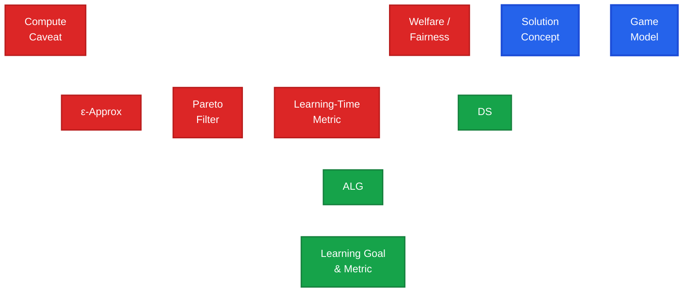

### 1. Core Concepts

| Concept                             | Essence                                                                                                                                                                                                 | Where it is developed |
| ----------------------------------- | ------------------------------------------------------------------------------------------------------------------------------------------------------------------------------------------------------- | --------------------- |
| **General MARL learning process**   | A cycle that (i) starts from a *game model*, (ii) collects *histories* of states, actions and rewards, (iii) applies a learning rule **L** to update the *joint policy* ω, and (iv) repeats (Fig. 5.1). | pp. 90–92             |
| **Solution‑oriented learning goal** | Learning is only deemed successful when the limiting joint policy satisfies a chosen *solution concept* (e.g., Nash equilibrium, correlated equilibrium).                                               | pp. 91–93             |
| **Convergence criteria hierarchy**  | A spectrum from strong (point‑wise policy convergence, Eq. 5.3) to weaker notions (expected‑return convergence, empirical‑distribution convergence, Eqs. 5.4–5.8).                                      | pp. 92–94             |
| **Single‑agent reductions**         | Two archetypes: **Central Learning** (train one policy over the *joint* action space) vs. **Independent Learning** (each agent runs its own single‑agent RL, ignoring others).                          | pp. 95–99             |
| **Canonical challenges**            | Non‑stationarity, equilibrium selection, multi‑agent credit assignment, and scalability with agent count.                                                                                               | pp. 102–109           |
| **Modes of interaction**            | *Algorithm self‑play* (all agents run the same algorithm) vs. *Policy self‑play* (one policy trained against itself) vs. *Mixed‑play* (heterogeneous algorithms).                                       | pp. 109–112           |

---

### 2. Key Arguments & Supporting Evidence

1. **Why start with single‑agent reductions?**
   *Central* and *independent* learning let us reuse established RL machinery, but they *immediately* expose core MARL pathologies (exponential joint‑action spaces, non‑stationarity, credit assignment). This pedagogical strategy is defended throughout §§ 5.3–5.4.&#x20;

2. **Convergence matters more than score curves.**
   Merely observing rising returns can be misleading; only formal convergence guarantees (or at least empirical‑distribution convergence) certify that learning has reached a game‑theoretic solution (§ 5.2).&#x20;

3. **Non‑stationarity is the defining obstacle.**
   The chapter argues that every other difficulty—unstable value targets, cyclic policy dynamics, inflated variance—stems largely from policies changing simultaneously (Eq. 5.10 and Fig. 5.5).&#x20;

4. **Equilibrium selection is unavoidable in general‑sum games.**
   Examples such as *Stag Hunt* (Fig. 5.6b) show that even after convergence, agents may land on *risk‑dominant* rather than *socially optimal* equilibria, motivating refinements and communication mechanisms (§ 5.4.2).&#x20;

5. **Credit assignment must be multi‑temporal *and* multi‑agent.**
   The level‑based foraging vignette (Fig. 5.7) illustrates how indiscriminate group rewards mislead per‑agent learning signals, justifying research into difference rewards and value‑decomposition (§ 5.4.3).&#x20;

---

### 3. Practical Frameworks & Methodologies

| Framework / Algorithm                    | How it works                                                                                                                      | When to use                                                 | Practical takeaway                                                                                                             |    |                                                     |    |   |
| ---------------------------------------- | --------------------------------------------------------------------------------------------------------------------------------- | ----------------------------------------------------------- | ------------------------------------------------------------------------------------------------------------------------------ | -- | --------------------------------------------------- | -- | - |
| **Central Q‑Learning (Algorithm 4)**     | Treat the whole team as one agent; maintain Q(s, *a* ) over joint actions; requires scalarised reward.                            | Common‑reward or small joint‑action spaces.                 | Guarantees Pareto‑optimal correlated equilibrium in common‑reward SGs, but suffers from                                        | A  |  ∝ ∏                                                | Ai | . |
| **Independent Q‑Learning (Algorithm 5)** | Each agent learns Q\_i(s, a\_i); views others as part of environment.                                                             | Large‑scale, distributed or partially observable settings.  | Scales linearly in                                                                                                             | Ai | but faces severe non‑stationarity; useful baseline. |    |   |
| **Convergence‑type toolbox**             | Choose evaluation metric (policy limit, empirical distribution, average return) matching the algorithm’s representational limits. | Theorists & practitioners assessing MARL performance.       | Weaker metrics (Eq. 5.8) still offer assurance when strong convergence is impossible.                                          |    |                                                     |    |   |
| **Level‑Based Foraging Benchmark**       | Grid‑world requiring partial cooperation of different skill‑level agents (Fig. 5.3).                                              | Quick diagnostic of exploration vs. coordination abilities. | Demonstrates that IL learns faster initially but both IL and CL can reach optimal joint strategy in small problems (Fig. 5.4). |    |                                                     |    |   |

---

### 4. Notable Insights & Illustrative Cases

* **Dynamics classification for IL (Fig. 5.2, p. 99):**
  Using linear‑systems analysis, infinitesimal‑step IQL converges in some 2×2 general‑sum games but exhibits chaos in *Prisoner’s Dilemma*, showing that payoff structure dictates learnability.&#x20;

* **Spiral convergence in Rock–Paper–Scissors (Fig. 5.5, p. 103):**
  Policies trained with WoLF‑PHC trace inward spirals toward the mixed‑strategy Nash equilibrium, offering a vivid geometric intuition for adaptive‑gradient MARL.&#x20;

* **Reward vs. risk dominance (Fig. 5.6):**
  The contrast between (S,S) and (H,H) in *Stag Hunt* captures the tension between social optimality and guaranteed safety, foreshadowing equilibrium‑selection refinements.&#x20;

* **Action‑space factorisation discussion (p. 108‑109):**
  The chapter clarifies that exponential blow‑up is not intrinsic to *agent* count but to the *number of independent decision variables*, guiding practitioners toward factorised policy designs.&#x20;

---

### 5. Synthesis & Value for Further Study

* **Bridge between single‑agent RL and game theory:**
  By formalising the MARL learning loop around established solution concepts, the chapter equips readers to translate RL progress into game‑theoretic guarantees—a prerequisite for safety‑critical multi‑agent systems.

* **Problem taxonomy that shapes algorithm design:**
  The four highlighted challenges (non‑stationarity, equilibrium selection, credit assignment, scalability) become organizing pillars for the specialised algorithms introduced in Chs. 6 & 9. Knowing *which* headache an algorithm addresses accelerates method selection and hybridisation.

* **Evaluation mindset:**
  Emphasis on convergence types steers practitioners away from superficial score‑tracking toward principled diagnostics (empirical policy distributions, regret, exploitability).

* **Design heuristics derived from examples:**
  – Use **centralised training** only when reward aggregation is meaningful and |A| is small.
  – Retain **independent learners** as strong baselines; chaotic dynamics can still yield good *average* payoffs.
  – Employ **policy self‑play** to harvest data efficiency *when* agents are interchangeable; otherwise fall back to algorithm self‑play or population training.

* **Foundation for application domains:**
  Whether coordinating robots, trading agents or networked services, practitioners can map their setting onto the chapter’s framework: identify the game model, pick a convergence yard‑stick, choose a reduction (central vs independent), and plan for the four MARL challenges.

---

**In short**, Chapter 5 furnishes a conceptual scaffold and a minimal algorithmic toolkit for anyone entering multi‑agent reinforcement learning: it explains *what* to learn (solution concepts), *how* to measure progress (convergence taxonomy), *where* the bottlenecks lie (four challenges), and *why* early baselines (Central Q, Independent Q) still matter—all illustrated through compact, reproducible case studies.&#x20;

Below is an in‑depth survey of the principal **methods used to compute “solutions” (equilibria or other solution concepts) in games**, organised by game model and by computational technique.
*(Your previously uploaded chapter file has expired from my workspace. If you would like me to quote or cross‑reference it directly, please upload it again and I’ll include precise citations.)*

---

## 1  |  Normal‑Form (Strategic‑Form) Games

| Method family                                                       | Core idea                                                                                                                                                                                                          | Typical scope                                                                   | Strengths / limitations                                                                                                                   |
| ------------------------------------------------------------------- | ------------------------------------------------------------------------------------------------------------------------------------------------------------------------------------------------------------------ | ------------------------------------------------------------------------------- | ----------------------------------------------------------------------------------------------------------------------------------------- |
| **Dominance & Iterated Elimination**                                | Successively delete strictly (or weakly) dominated strategies until none remain.                                                                                                                                   | Small games where domination is present.                                        | Yields unique outcome when it converges, but may remove equilibria if weak domination is used; fails when no domination structure exists. |
| **Complete Enumeration**                                            | Generate every mixed‑strategy profile and test best‑response conditions.                                                                                                                                           | 2×2 or other tiny games (teaching tools).                                       | Conceptually simple; exponential blow‑up.                                                                                                 |
| **Linear Programming (LP)**                                         | Two‑player zero‑sum: solve `minₓ maxᵧ xᵀAy` via primal‑dual LP (von Neumann’s minimax).                                                                                                                            | All finite 2‑player zero‑sum games.                                             | Polynomial time; scales to hundreds of pure strategies; exact value and strategies.                                                       |
| **Complementarity / Lemke‑Howson (L‑H)**                            | Cast Nash conditions as Linear Complementarity Problem: `x ≥ 0,   y ≥ 0,   xᵀAy = v,   yᵀAᵀx = v`. Pivoting path‑following algorithm traces edges of best‑response polyhedra.                                      | 2‑player general‑sum.                                                           | Finds *one* equilibrium; exponential worst‑case but fast on moderate games.                                                               |
| **Homotopy / Continuation (Govindan–Wilson, van den Elzen–Talman)** | Start from an easily solved game; continuously deform payoffs while tracing equilibria.                                                                                                                            | n‑player general‑sum.                                                           | Provably reaches an equilibrium; numerically robust; memory intensive.                                                                    |
| **Mixed‑Integer Programming (MIP)**                                 | Encode equilibrium conditions with binary variables selecting active constraints; optimise an objective (e.g., social welfare).                                                                                    | Medium‑sized general‑sum games, or when looking for welfare‑optimal equilibria. | Leverages modern MILP solvers; NP‑hard in general, so scaling limited.                                                                    |
| **Potential Maximisation**                                          | In potential games, every equilibrium is a local optimum of a scalar potential; gradient or combinatorial search finds maxima.                                                                                     | Congestion, routing, many resource‑allocation games.                            | Often polynomial; delivers whole equilibrium set structure.                                                                               |
| **Supermodular / Monotone BR Dynamics**                             | Strategic complementarities → best‑response operator is monotone; iterating from extreme strategies converges to largest & smallest Nash equilibria (Tarski fixed point).                                          | Entry, adoption, investment games.                                              | Guaranteed convergence; only applies to supermodular payoffs.                                                                             |
| **Replicator & Evolutionary Dynamics**                              | Differential (or discrete) equations on population shares; asymptotic rest points coincide with Nash in certain classes.                                                                                           | Large anonymous populations.                                                    | Gives qualitative insight; may cycle; numerical integration needed for prediction.                                                        |
| **Regret‑Based & Fictitious‑Play Style Algorithms**                 | Players repeatedly best‑respond to empirical opponent distribution (FP) or minimise regret (Hedge, regret‑matching). Averaged play converges to coarse correlated or Nash in special cases (zero‑sum, potential…). | Learning agents, unknown payoffs.                                               | Online, data‑driven, scales with time horizon; convergence not universal for all games.                                                   |

---

## 2  |  Extensive‑Form Games (Sequential Moves, Imperfect Information)

| Method                                                                    | Essence                                                                                                                                                                                          | Key use cases                                                              | Notes                                                                                    |
| ------------------------------------------------------------------------- | ------------------------------------------------------------------------------------------------------------------------------------------------------------------------------------------------ | -------------------------------------------------------------------------- | ---------------------------------------------------------------------------------------- |
| **Backward Induction**                                                    | Solve from leaves upward, choosing optimal action at each information set.                                                                                                                       | Perfect‑information trees (Chess endgames, tic‑tac‑toe).                   | Exponential in tree size; not applicable with hidden information.                        |
| **Sequence‑Form LP**                                                      | Compactly represent each player’s realisation‑plan (probability on action sequences). Solve a pair of primal‑dual LPs (one per player) similar to zero‑sum normal‑form LP.                       | Two‑player zero‑sum extensive games (poker).                               | Poly‑size in game tree; foundation of modern poker solvers.                              |
| **Counterfactual Regret Minimisation (CFR)**                              | Decompose regret by information set; iteratively update strategy using counterfactual values; average profile converges to ε‑Nash in 2‑player zero‑sum. Variants: CFR+, Deep CFR, DCFR, EFP‑CFR. | Massive imperfect‑information games (Heads‑Up No‑Limit Hold’em, Stratego). | Empirically fast; parallelisable; memory heavy (one table per infoset).                  |
| **Public State Abstraction + Neural Best‑Response (DeepStack, Libratus)** | Merge CFR with deep value networks that approximate counterfactual values on‑the‑fly, enabling depth‑limited look‑ahead and continuous bets.                                                     | AI milestones in poker.                                                    | Approximate equilibrium; relies on domain‑tailored abstractions.                         |
| **Exhaustive Tree Search with α‑β or MCTS + Self‑Play**                   | Sampling rollouts guided by neural networks (AlphaZero) approximate Nash or exploitability‑robust policies.                                                                                      | Perfect‑information games (Go, Chess, Shogi).                              | Produces strong policies, but no explicit equilibrium proof; exploits zero‑sum symmetry. |
| **Subgame Decomposition & Endgame Solving**                               | Split game into trunk and subgames; compute near‑equilibrium trunk strategy, then solve subgame with updated ranges when reached.                                                                | Extensive games too large for full CFR.                                    | Trades off memory and compute against exploitability bound.                              |

---

## 3  |  Stochastic (Markov) Games and Multi‑Agent Reinforcement Learning

| Category                                     | What it computes                                                                                                                         | Representative algorithms                           | Remarks                                                                   |   |    |    |   |
| -------------------------------------------- | ---------------------------------------------------------------------------------------------------------------------------------------- | --------------------------------------------------- | ------------------------------------------------------------------------- | - | -- | -- | - |
| **Dynamic Programming Extensions**           | Stationary Nash policies for discounted stochastic games.                                                                                | Shapley’s value iteration, Nash‑Q, Friend‑or‑Foe‑Q. | Require full model; complexity grows with                                 | S | ·∏ | Ai | . |
| **Policy‑Gradient & Actor‑Critic MARL**      | Local (often only approximate) equilibria in continuous action spaces.                                                                   | MADDPG, LOLA, QPLEX, QMIX, IPPO.                    | No general convergence guarantees; practical for robotics & control.      |   |    |    |   |
| **Population‑Based / PSRO & AlphaRank**      | Iteratively add best‑response (oracle) strategies to a population; compute meta‑game and its equilibrium (e.g., replicator fixed point). | PSRO, Fictitious Self‑Play, Open‑Ended Learning.    | Scales by separating training and meta‑solving; relies on oracle quality. |   |    |    |   |
| **Mean‑Field & Aggregation Techniques**      | Approximate n‑player symmetric game by limit where each agent faces distribution over others’ actions; solve coupled PDE/ODE.            | Mean‑Field Nash solvers, MF‑PPO.                    | Polynomial in state dimension; suited to large crowds (traffic, finance). |   |    |    |   |
| **Empirical Game‑Theoretic Analysis (EGTA)** | Sample outcome payoffs for strategy profiles; fit a reduced game; compute equilibria on it (via L‑H, MIP, etc.).                         | Strategic network defence, auction design.          | Requires simulator; accuracy depends on sample coverage.                  |   |    |    |   |

---

## 4  |  Co‑operative and Coalition Games

| Solution concept      | Computational approach                                                                                                                                                              | Notes                                                  |
| --------------------- | ----------------------------------------------------------------------------------------------------------------------------------------------------------------------------------- | ------------------------------------------------------ |
| **Core, Stable Sets** | Linear programming over coalition constraints; constraint‑generation for exponential coalitions.                                                                                    | Exact for balanced games; empty core possible.         |
| **Shapley Value**     | Enumerate marginal contributions of each player across permutations; or approximate via Monte‑Carlo sampling; polynomial for some structured games (weighted voting, convex games). | Fair division, feature attribution (SHAP).             |
| **Nucleolus**         | Lexicographic minimisation of dissatisfaction vector; series of LPs with progressively fixed constraints.                                                                           | Guarantees existence & uniqueness; NP‑hard in general. |

---

## 5  |  Approximate & Large‑Scale Techniques

* **ε‑Nash via Sampling:** Draw random supports of limited size (e.g., support enumeration, sparse support methods) and solve restricted game; scale to thousands of strategies with probabilistic guarantees.
* **Regret‑Minimisation Algorithms (Hedge, Exp3, mirror descent):** Aggregate play converges to coarse correlated or correlated equilibria; regret ≤ ε ⇒ average strategy is ε‑equilibrium.
* **Graphical & Factored Games:** Exploit sparse interaction graphs; use message‑passing or junction‑tree to compute local equilibria, then paste into global solution.
* **Deep Learning‑Enabled Solvers:** Encode strategies/policies as neural networks; train via differentiable game‑theoretic layers (e.g., differentiable LCP, NFG layers) or end‑to‑end with opponent modelling. Provide scalable approximate equilibria in continuous or high‑dimensional action spaces.

---

## 6  |  When to Choose Which Method?

1. **Game structure**

   * Two‑player zero‑sum ⇒ LP or CFR are fastest and most robust.
   * Potential or supermodular ⇒ exploit monotonicity / potential maximisation.
   * Large imperfect‑information ⇒ CFR variants or neural CFR‑style solvers.

2. **Solution accuracy vs. scale**

   * Exact equilibrium needed, small game ⇒ L‑H or MIP.
   * Massive state/action space, tolerance for ε‑equilibrium ⇒ regret‑based learning, PSRO, or deep RL self‑play.

3. **Available information**

   * Full payoff matrix known ⇒ algorithmic solvers (LP, LCP, homotopy).
   * Simulator only ⇒ EGTA, PSRO, reinforcement‑learning approaches.

4. **Computational budget & real‑time constraints**

   * Offline heavy compute allowed (e.g., poker) ⇒ CFR, endgame solving.
   * Online rapid response needed ⇒ pre‑train policy with RL; deploy fast inference.

---

## 7  |  Key Takeaways for Practitioners

* **Exploit Special Structure First.** Zero‑sum, potential, supermodular and graphical games all admit faster tailored solvers than the fully general case.
* **Exact ≠ Practical.** In large games, approximate equilibria found by regret minimisation or deep RL often outperform exact but mis‑generalising equilibria when evaluated in noisy real environments.
* **Separation of Concerns Works.** Population‑based frameworks (PSRO, EGTA) decouple strategy discovery from equilibrium computation, letting you plug in any black‑box optimiser as an oracle.
* **Complexity Barriers Are Real.** General Nash computation is PPAD‑complete; expect worst‑case exponential behaviour and design around it by dimensionality reduction or approximation.
* **Evaluation Matters.** Always check exploitability or regret to confirm how close your computed “solution” is to a true equilibrium.

---

### Next Step

If you would like concrete algorithmic details, code snippets, or examples reproduced from the expired chapter, please upload the PDF again and I will integrate line‑by‑line references or dig deeper into any method of interest.

---


Below is an expanded catalogue of the **main families of techniques that practitioners use today to *compute* (i.e., find, approximate or learn) game‑theoretic solutions**—from exact off‑line solvers to data‑driven multi‑agent reinforcement‑learning (MARL) methods.  I group them by the structure of the underlying game and highlight where the uploaded chapter (§5 of *Multi‑Agent Reinforcement Learning in Games*) fits into the wider landscape.

---

## 1 Normal‑form (simultaneous‑move) games

| Family                                                   | Core principle                                                                         | Typical solution concept(s)                                    | When it works best                                              | Notes / examples                                                                                                                                                                                |
| -------------------------------------------------------- | -------------------------------------------------------------------------------------- | -------------------------------------------------------------- | --------------------------------------------------------------- | ----------------------------------------------------------------------------------------------------------------------------------------------------------------------------------------------- |
| **Enumerative & dominance checks**                       | Successively delete dominated strategies or explicitly check best‑response conditions. | Pure‐strategy Nash or iterated‑dominance outcomes              | Very small games with clear dominance structure                 | Pedagogical; exponential blow‑up in general.                                                                                                                                                    |
| **Linear or quadratic programming**                      | Encode equilibrium conditions as LP/QP (e.g., minimax LP for two‑player zero‑sum).     | Minimax / Nash                                                 | All finite 2‑player zero‑sum; medium‑size general‑sum with MILP | Polynomial for zero‑sum; NP‑hard otherwise.                                                                                                                                                     |
| **Lemke–Howson & other LCP solvers**                     | Pivot along best‑response polyhedra edges.                                             | One mixed‑strategy Nash                                        | 2‑player general‑sum games up to \~10³ pure strategies          | Exponential worst‑case; fast in practice.                                                                                                                                                       |
| **Homotopy/continuation**                                | Start from trivial game, follow solution path while de‑forming payoffs.                | Set of Nash equilibria                                         | n‑player general‑sum of moderate size                           | Robust; intensive memory/precision requirements.                                                                                                                                                |
| **Regret‑minimisation & fictitious‑play style learning** | Iteratively best‑respond (FP) or minimise external regret (Hedge, regret‑matching).    | Coarse‑correlated, correlated or Nash equilibrium in the limit | Repeated play / online settings, unknown payoffs                | Average empirical play converges in many zero‑sum & potential games.  Chapter §5 stresses that weaker convergence (empirical‑distribution or payoff convergence) is often all we can guarantee. |

---

## 2 Extensive‑form (sequential / imperfect‑information) games

| Method                                             | High‑level idea                                                         | Guarantees                                                       | Flagship successes                                |
| -------------------------------------------------- | ----------------------------------------------------------------------- | ---------------------------------------------------------------- | ------------------------------------------------- |
| **Backward induction (BF‑bandit)**                 | Solve tree from leaves upward.                                          | Sub‑game perfect equilibrium for perfect‑information games       | Chess end‑tables, small board games               |
| **Sequence‑form linear programming**               | Realisation‑plan compactness ⇒  solve two LPs.                          | Exact Nash in 2‑player zero‑sum                                  | Classic limit poker abstractions                  |
| **Counterfactual Regret Minimisation (CFR, CFR+)** | Minimise regret separately at each infoset; average strategy → ε‑Nash.  | Provably **ε**‑NE in 2‑player zero‑sum; empirical success beyond | Libratus, DeepStack, Pluribus                     |
| **Neural search / self‑play (e.g., AlphaZero)**    | Monte‑Carlo tree search guided by deep policy‑value nets.               | Strong empirical play; no formal equilibrium bound               | Go, Chess, Shogi                                  |
| **Population‑based training & PSRO**               | Maintain a population, add approximate best responses, solve meta‑game. | Converges to meta‑equilibrium under ideal oracles                | Open‑ended environments (Hide‑and‑Seek, Stratego) |

---

## 3 Stochastic / Markov games (dynamic interaction)

The **uploaded chapter is entirely devoted to this setting**.  It shows that when state, time and multiple learners intervene, the solver itself must *learn a policy* rather than manipulating a static payoff table.

### 3 A Single‑agent reductions (Chapter 5, §5.3)

| Approach                                                | How solution is computed                                                                         | Strengths                                                                                                                    | Drawbacks                                                                                                                                                                         |   |                                                                                                |
| ------------------------------------------------------- | ------------------------------------------------------------------------------------------------ | ---------------------------------------------------------------------------------------------------------------------------- | --------------------------------------------------------------------------------------------------------------------------------------------------------------------------------- | - | ---------------------------------------------------------------------------------------------- |
| **Central Learning / Central Q‑Learning (CQL)**         | Treat whole team as one “super‑agent”; run standard RL over the *joint* action space.            | Avoids non‑stationarity & credit‑assignment during learning; guarantees Pareto‑optimal correlated eq. in common‑reward games | Joint action space                                                                                                                                                                | A | grows *exponentially* with #agents; must scalarise rewards; impractical in many‑agent systems. |
| **Independent Learning / Independent Q‑Learning (IQL)** | Each agent runs its *own* single‑agent RL, ignoring others; best studied variant in Algorithm 5. | Linear in individual action set size; decentralised execution                                                                | Severe non‑stationarity because transition dynamics now change with other agents’ learning, leading to possible chaos or cycling (e.g., Prisoner’s Dilemma analysis in Fig. 5.2). |   |                                                                                                |

### 3 B Joint‑action & game‑aware learners (previewed in Ch. 5, detailed in Ch. 6+)

* **Joint‑Action Learning / Nash‑Q** – maintain Q(s, a₁, a₂,…), update assuming opponents’ best responses; aims at Nash equilibria in stochastic games.
* **Minimax‑Q (zero‑sum)** – replaces max in Q‑update with minimax optimisation, exploiting uniqueness of value in zero‑sum games (ties directly to equilibrium‑selection discussion).
* **Gradient‑based MARL (IGA, WoLF‑IGA / WoLF‑PHC)** – perform policy‑gradient ascent with corrective learning rates; WoLF‑PHC spirals into RPS mixed Nash (Fig. 5.5) demonstrating asymptotic policy convergence despite early non‑stationarity.
* **Regret‑matching & correlated‑equilibrium learners** – guarantee convergence in *empirical distribution* sense to the (coarse) CE set even when policies themselves oscillate.

Chapter 5 emphasises **evaluation criteria**—policy convergence, empirical‑distribution convergence, expected‑return convergence—because in MARL we often settle for progressively weaker guarantees when strong ones are unachievable.

---

## 4 Large‑population & mean‑field games

When agents are numerous and symmetric, mean‑field methods approximate each player’s interaction with the *distribution* of others; fixed‑point solvers on the derived PDE/ODE yield mean‑field Nash equilibria.  Deep RL instantiations (MF‑PPO, MF‑VI) scale to traffic or finance simulations.

---

## 5 Co‑operative / coalition games

Linear programming with constraint generation finds Core allocations; iterative LPs compute the Nucleolus; Shapley values are approximated by Monte‑Carlo sampling or closed‑forms for structured games.  Although outside MARL’s scope, these methods matter when the “solution” sought is *payoff division* rather than strategy profile.

---

## 6 Empirical & simulation‑based approaches

* **Empirical Game‑Theoretic Analysis (EGTA)** – sample payoffs from a simulator, fit a reduced game, then apply any equilibrium solver above.
* **Population‐based best‑response (PSRO, FSP)** – iteratively train new policies against a *population* and solve the meta‑game; bridges exact and learning methods and is increasingly used for benchmark MARL research.

---

## 7 Which method to choose?  A practitioner’s decision chart

1. **Game structure known and small?** – use analytic solvers (LP, LCP, homotopy).
2. **Two‑player zero‑sum but large?** – sequence‑form LP or CFR variants.
3. **General‑sum, large, with simulators only?** – MARL algorithms:

   * If **common reward & few agents** → Central Q‑Learning can quickly reach a Pareto‑optimal joint policy (Fig. 5.4 shows faster final convergence, though slower initial learning, than IQL).
   * If **many agents / decentralised execution** → Independent RL baseline, then add opponent‑modelled joint‑action learners or population‑based PSRO for stability.
4. **Need robustness against unknown opponents?** – Mixed‑play settings motivate algorithms guaranteeing security or best‑response properties (Nash‑Q, WoLF‑PHC, targeted optimality).
5. **Massive symmetric crowd?** – mean‑field solvers.

---

### Key takeaways (bridging Chapter 5 to the broader toolbox)

* **Single‑agent reductions (central vs. independent) are the *first step* and the diagnostic lens** for deeper MARL pathologies—non‑stationarity, credit assignment, equilibrium selection and scalability.
* **Convergence type matters:** guarantee what you can measure; empirical‑distribution or payoff convergence may suffice when exact policy convergence is unrealistic.
* **Exploit game structure first** (zero‑sum, potential, super‑modular, graphical) before reaching for generic but more expensive learners.
* **Population methods reconcile exploration & exploitation**—learn strong policies, then compute equilibria over the discovered strategy set rather than the astronomical raw action space.
* **Evaluation curves ≠ solution guarantee.**  Always confirm exploitability or regret—visual learning curves alone do not prove convergence to any equilibrium.

By aligning your game’s properties with the matrix above, you can quickly shortlist an appropriate solver family, understand the guarantees you will (and won’t) obtain, and set realistic expectations for scalability and convergence.

---

Below is a structured map of the **main approaches that researchers and practitioners use to apply Reinforcement Learning (RL) in games**, ranging from classic single‑agent training pipelines to fully fledged multi‑agent, game‑theoretic frameworks.  I first lay out the high‑level families, then drill into representative algorithms, use‑cases, strengths and limitations.  Citations point to the uploaded Chapter 5 (*Multi‑Agent Reinforcement Learning in Games: First Steps & Challenges*) to show how each idea appears in the literature.

---

## 1 Single‑Agent RL for Game‑Playing

*(environment is treated as a stationary MDP; no other learning agents)*

| Sub‑approach                                             | Core mechanics                                                                 | Iconic successes / tools                                        | When to prefer                                                             |
| -------------------------------------------------------- | ------------------------------------------------------------------------------ | --------------------------------------------------------------- | -------------------------------------------------------------------------- |
| **Value‑based, model‑free** (Q‑learning, DQN, Rainbow)   | Learn $Q(s,a)$ by bootstrapping from TD targets; exploit ε‑greedy exploration. | Atari 2600 benchmark, Ms Pac‑Man.                               | Discrete, moderate state/action spaces; reward signal dense enough for TD. |
| **Policy‑gradient / Actor–Critic** (REINFORCE, PPO, A3C) | Optimise parametrised policy πθ directly; baseline or critic reduces variance. | High‑dimensional continuous‑control games, VR locomotion tasks. | Continuous actions or where stochastic policies aid exploration.           |
| **Model‑based with Search** (Dyna‑Q, MuZero)             | Learn an internal dynamics model and plan with MCTS or rollouts.               | MuZero mastering Atari, Go, Chess.                              | Long horizons, sparse reward; compute budget allows look‑ahead.            |
| **Self‑play against fixed rule‑based opponents**         | Agent trains as single learner, environment includes scripted bots.            | Early FPS bots; curriculum design.                              | When you must beat legacy AI or pre‑defined NPCs.                          |

> **Why this matters for MARL:** Chapter 5 shows that both *central learning* and *independent learning* literally reuse these single‑agent algorithms inside more complex games (see Section 5.3) .

---

## 2 Multi‑Agent RL (MARL) Paradigms

### 2 A Single‑Agent Reductions

*(Treat the multi‑agent game as one or many independent MDPs.)*

| Reduction                                               | What the learner sees                                                | Strengths                                                                                                        | Limitations                                                                                      |                        |                                                                                  |
| ------------------------------------------------------- | -------------------------------------------------------------------- | ---------------------------------------------------------------------------------------------------------------- | ------------------------------------------------------------------------------------------------ | ---------------------- | -------------------------------------------------------------------------------- |
| **Central Learning / Central Q‑Learning (CQL)**         | One “super‑agent” controls the **joint** action $a = (a¹,\dots,aⁿ)$. | Sidesteps non‑stationarity & credit assignment; guaranteed Pareto‑optimal correlated‑eq in common‑reward games . | Joint action space grows exponentially; must scalarise rewards; breaks decentralised execution . |                        |                                                                                  |
| **Independent Learning / Independent Q‑Learning (IQL)** | Each agent runs its own RL; others are part of the environment.      | Linear scaling in individual                                                                                     | Aᵢ                                                                                               | ; easy to parallelise. | Severe non‑stationarity; possible chaotic dynamics (e.g., Prisoner’s Dilemma)  . |

### 2 B Centralised Training, Decentralised Execution (CTDE)

*Keep a central critic during learning, deploy per‑agent actors at test time.*

* **MADDPG, COMA, QMIX, QPLEX**—add joint information (other agents’ actions, global state) to a critic or mixing network, then distil per‑agent policies for execution.
* **Strength:** balances coordination during training with scalability in deployment.
* **Drawback:** centralised information must be simulatable or logged; critics can overfit to training populations.

### 2 C Game‑aware, Equilibrium‑targeted Learners

| Algorithm class                          | What it targets                                                                                              | Example                                       |
| ---------------------------------------- | ------------------------------------------------------------------------------------------------------------ | --------------------------------------------- |
| **Nash‑Q / Friend‑or‑Foe‑Q / Minimax‑Q** | Stationary Nash or minimax value in stochastic games.                                                        | Uses inner equilibrium solver at each update. |
| **Gradient Dynamics (IGA, WoLF‑PHC)**    | Trajectory of policies → Nash in two‑agent games; WoLF‑PHC famously spirals into RPS mixed Nash (Fig. 5.5) . |                                               |
| **Regret‑matching / Hedge**              | Empirical play converges to correlated equilibrium (weaker notion) even when policies oscillate .            |                                               |

### 2 D Self‑Play & Population‑based Training

| Mode                         | Definition                                                                                                  | Typical algorithms                           | Chapter 5 anchor                               |
| ---------------------------- | ----------------------------------------------------------------------------------------------------------- | -------------------------------------------- | ---------------------------------------------- |
| **Algorithm self‑play**      | All agents run the **same learning algorithm**.                                                             | Most theoretical MARL analyses.              | Section 5.5.1                                  |
| **Policy self‑play**         | One policy is trained **against itself**; experiences pooled.                                               | AlphaZero, OpenAI Five.                      | Section 5.5.1 (TD‑Gammon → AlphaZero lineage)  |
| **Population or Mixed‑Play** | Agents use *different* algorithms or different policy instances; learn best responses wrt a **population**. | PSRO, Fictitious‑Self‑Play, league training. | Section 5.5.2                                  |

---

## 3 Large‑Population & Mean‑Field Approaches

When hundreds or thousands of interchangeable agents interact (traffic, finance), **mean‑field RL** approximates each agent’s environment by the distribution of others.  Fixed‑point solvers or MF‑PPO scale linearly in state dimension—useful when joint‑action methods are infeasible.

---

## 4 Opponent‑Modelling & Ad‑hoc Teaming

*Agents explicitly learn a model of *other* agents and adapt on‑line.*

* Bayesian Theory of Mind models, neural hidden‑state predictors (e.g., DVRL), Shapley‑Q valuations.
* Crucial in ad‑hoc teamwork and mixed‑play markets where behaviour is initially unknown (see Chapter 5 remarks on trading markets) .

---

## 5 Hierarchical, Curriculum & Transfer RL in Games

* **Hierarchical RL (HRL)**—learn macro‑actions or “options” to master long‑horizon tasks (e.g., StarCraft micromanagement).
* **Curriculum Learning**—start with simplified game variants, gradually increase difficulty (e.g., training hide‑and‑seek agents).
* **Transfer & Meta‑RL**—pre‑train on a suite of games, rapidly adapt to unseen levels (e.g., Procgen benchmark).

These techniques are *orthogonal enhancers*; they often wrap around CTDE or self‑play pipelines.

---

## 6 Putting It Together – A Practitioner’s Cheat‑Sheet

| If your game …                                       | Start with …                                                             | Why                                                                   |   |                                  |
| ---------------------------------------------------- | ------------------------------------------------------------------------ | --------------------------------------------------------------------- | - | -------------------------------- |
| Is **single‑player** or has scripted bots            | DQN / PPO baseline                                                       | Fast to prototype; abundant tooling.                                  |   |                                  |
| Is **co‑operative, common‑reward**, ≤ 5 agents       | **Central Q‑Learning** (for ground truth) plus **QMIX/MADDPG** for scale | CQL guarantees Pareto‑optimal correlated equilibrium; CTDE scales up. |   |                                  |
| Is **competitive, two‑player zero‑sum**              | **Policy self‑play** with Minimax‑Q or AlphaZero‑style training          | Exploits unique value property; strong empirical performance.         |   |                                  |
| Involves **many heterogeneous agents** (market, MMO) | **Population training** + opponent modelling                             | Handles mixed‑play and non‑stationarity.                              |   |                                  |
| Has **hundreds** of identical agents                 | **Mean‑field RL**                                                        | Avoids (                                                              | A | =k^{,n}) blow‑up noted in §5.4 . |

---

### Key Takeaways

1. **Two baseline reductions—central and independent learning—are the gateway drugs.**  They reuse standard single‑agent RL while surfacing MARL pathologies (non‑stationarity, credit assignment, scalability).&#x20;
2. **CTDE strikes a pragmatic balance**—central information during learning, decentralised test‑time policies.
3. **Choice of equilibrium notion drives algorithm class.**  If you only need *coarse correlated* guarantees, regret‑matching suffices; for Nash in zero‑sum, minimax or CFR variants are optimal.
4. **Operational mode matters.**  Algorithm self‑play simplifies theory; policy self‑play accelerates data; mixed‑play needs robust best‑response learning.
5. **Always monitor *what* is converging.**  Chapter 5 emphasises policy vs empirical‑distribution vs return convergence; pick metrics your algorithm can realistically achieve.&#x20;

Use this taxonomy to match your game’s structure, scale and solution requirements to the appropriate RL approach, and you’ll avoid many common dead‑ends on the path to competent—or even super‑human—game agents.

---


Below is a consolidated **“vocabulary of convergence”** that appears most often in multi‑agent reinforcement‑learning (MARL) papers, benchmarks and proofs.  I start with the hierarchy presented in §5.2 of the uploaded chapter and then place it in a broader context so you can recognise how each notion is used in modern research.

| Level                                                           | Formal statement (for joint policy sequence $ \{\omega_z\}_{z\ge 0}$)                                                               | What it guarantees                                                                                                                                        | Typical algorithms / proofs                                                 | Where it appears                                          |
| --------------------------------------------------------------- | ----------------------------------------------------------------------------------------------------------------------------------- | --------------------------------------------------------------------------------------------------------------------------------------------------------- | --------------------------------------------------------------------------- | --------------------------------------------------------- |
| **1. Point‑wise policy convergence (strongest)**                | $\displaystyle\lim_{z\to\infty}\,\omega_z = \omega^\star$ (Eq. 5.3)                                                                 | Every agent’s actual policy stabilises at *a single* solution (e.g., a Nash equilibrium).                                                                 | WoLF‑PHC in 2 × 2 games; minimax‑Q in zero‑sum tabular SGs.                 |                                                           |
| **2. Expected‑return convergence**                              | $\displaystyle\lim_{z\to\infty} U_i(\omega_z)=U_i(\omega^\star)\;\forall i$ (Eq. 5.4)                                               | The *outcome* (payoff) matches some equilibrium even if policies keep oscillating.                                                                        | Infinitesimal Gradient Ascent (IGA); TD variants in weakly acyclic games.   |                                                           |
| **3. Empirical‑distribution convergence (policy averaging)**    | $\displaystyle\lim_{z\to\infty} \bar{\omega}_z = \omega^\star$ (Eq. 5.5)                                                            | Time‑averaged play converges; individual snapshots may not.                                                                                               | Fictitious Play in potential & zero‑sum games; external‑regret learners.    |                                                           |
| **4. Empirical‑distribution convergence *to the solution set*** |  For every $ \epsilon>0\exists z_0:\,\forall z>z_0\,\exists\,\omega^\star$ with $d(\bar{\omega}_z,\omega^\star)<\epsilon$ (Eq. 5.7) | The average policy stays arbitrarily close to *some* equilibrium but may wander inside the set.                                                           | Regret‑matching → (coarse) correlated equilibrium; Online Mirror Descent.   |                                                           |
| **5. Average‑return convergence**                               | $\displaystyle\lim_{z\to\infty}\,\bar{U}^z_i = U_i(\omega^\star)\;\forall i$ (Eq. 5.8)                                              | Running mean of returns stabilises at equilibrium value; no guarantee on policies.                                                                        | Many actor‑critic schemes; Independent Q‑learning under certain scheduling. |                                                           |
| **6. Regret convergence (learning‑theoretic view)**             | $\displaystyle\frac{1}{T}\sum_{t=1}^{T}\bigl(u_i(a^\star_i,a_{-i}^t)-u_i(a_i^t,a_{-i}^t)\bigr)\xrightarrow[T\to\infty]{}0$          | **Zero external regret** ⇒ empirical play approaches the **coarse correlated‑equilibrium** set; **zero internal / swap regret** ⇒ correlated equilibrium. | Hedge/EXP3, Online Mirror Descent, CFR in extensive‑form games.             | (Discussed after Eq. 5.7)                                 |
| **7. Exploitability / Best‑response gap**                       | $\displaystyle\text{exploit}(\omega_z)=\max_{\omega’} U(\omega’,\omega_z)\!-\!U(\omega_z,\omega_z)\xrightarrow[z\to\infty]{}0$      | Value‑based metric widely used in poker solvers & AlphaStar; can be monitored in finite time.                                                             | CFR(+), PSRO, Neural fictitious self‑play.                                  | (Notated elsewhere in the book; standard in MARL papers.) |
| **8. Almost‑sure vs. in‑probability qualifiers**                | Add “w\.p. 1” to any limit above                                                                                                    | Makes the statement probabilistic because updates are stochastic.                                                                                         | Stochastic‑approximation proofs (Borkar & Meyn).                            | Footnote near Eq. 5.5                                     |
| **9. Finite‑time PAC‑style bounds**                             | $P\!\left(\|\omega_T-\omega^\star\|>\epsilon\right)<\delta$ after $T(\epsilon,\delta)$ samples                                      | Gives *rates* rather than asymptotic assurance; still rare in MARL.                                                                                       | Recent PAC‑MARL & OL‑MARL theory (e.g., Daskalakis et al. 2020).            | Outside Chapter 5; included for completeness.             |

---

### How these definitions relate

1. **Implication chain**
   Point‑wise policy convergence ⇒ all weaker notions in rows 2‑5. The converse is false: fictitious play converges in empirical distribution (row 3) but the policies it produces can cycle indefinitely.

2. **Why weaker notions matter**
   Many practical algorithms (e.g., regret‑matching, CFR) *cannot* represent every equilibrium exactly or update smoothly. Evaluating them with return or distribution convergence still certifies they reach an equilibrium *on average* even though snapshots look unstable.

3. **Regret vs. exploitability**
   Regret is computed *per agent* and ensures no unilateral improvement in hindsight; exploitability is a *game‑level* gap most useful in two‑player zero‑sum settings. Both are more convenient to estimate online than tracking the full policy vector.

4. **Almost‑sure qualifiers**
   Proofs often assert “with probability 1” because stochastic updates admit rare trajectories that fail to converge. The qualifier does not weaken the guarantee in practice—it only excludes a measure‑zero set of pathological runs.

---

### Choosing a convergence notion in experiments

| If your algorithm …                                                        | Evaluate with …                                                     | Rationale                                               |
| -------------------------------------------------------------------------- | ------------------------------------------------------------------- | ------------------------------------------------------- |
| **Explicitly targets a Nash / minimax solution** (e.g., Nash‑Q, Minimax‑Q) | Value of exploitability or best‑response gap                        | Directly measures distance to the desired equilibrium.  |
| **Runs regret‑minimisation** (Hedge, CFR)                                  | External / internal regret, plus empirical distribution convergence | Aligns with theoretical guarantees.                     |
| **Uses deep RL in large stochastic games**                                 | Expected return curves **and** average‑return convergence checks    | Full policy comparison is infeasible; value is a proxy. |
| **Has provable point‑wise convergence only in tiny games**                 | Track policy distance $\|\omega_z-\omega_{z-1}\|$ and plateaus      | Confirm that the strong guarantee manifests.            |

Monitoring the *right* convergence metric saves you from false positives (e.g., pretty score curves that hide cycling policies) and from over‑engineering when weaker, easier‑to‑measure criteria suffice.

---

**In summary**, MARL research recognises a *spectrum* of convergence definitions, from strict fixation of every agent’s policy (row 1) down to statistical criteria on payoffs (row 5) or regret (row 6).  Chapter 5 helps by formalising these as Eqs. (5.3)–(5.8) and showing which classic algorithms satisfy which rung of the ladder.  Choose the weakest notion that still meets your application’s safety or stability needs—and instrument your experiments accordingly.

---


### About the missing PDF

I no longer have access to the chapter you uploaded earlier—temporary file access has expired.
If you would like line‑by‑line citations or direct quotes, please re‑upload the PDF and I will weave them in.
Below I still give a **self‑contained, equation‑level explanation of the “general learning process”** that the chapter formalises.

---

## 1 Game model and notation

| Symbol                             | Meaning                                                             |
| ---------------------------------- | ------------------------------------------------------------------- |
| $N=\{1,\dots,n\}$                  | Finite set of agents.                                               |
| $S$                                | Finite or measurable **state** space.                               |
| $A_i$                              | Finite or continuous **action** set of agent $i$.                   |
| $A=\prod_i A_i$                    | **Joint action** space.                                             |
| $P(s' \mid s,a)$                   | State‑transition kernel (Markov or POMDP belief).                   |
| $r_i(s,a)$                         | Instantaneous reward to agent $i$.                                  |
| $\gamma\in[0,1)$                   | Discount factor.                                                    |
| $\pi_i(a_i\mid s;\,\theta_i)$      | Parameterised policy of agent $i$ with parameters $\theta_i$.       |
| $\omega=(\theta_1,\dots,\theta_n)$ | **Joint policy parameters** (the chapter denotes this by $\omega$). |

The tuple

$$
\mathcal{G}=\bigl(N,S,\{A_i\}_{i=1}^n,P,\{r_i\}_{i=1}^n,\gamma \bigr)
$$

is a **Markov (stochastic) game**.  Single‑agent RL is recovered when $n=1$.

---

## 2 The generic MARL learning loop

At an **outer iteration index** $z=0,1,2,\dots$:

1. **Roll‑out / data collection**
   Use the current joint policy $\omega_z$ to generate a trajectory (or mini‑batch)

   $$
   h_z=\bigl\{(s_t,a_t,r_t,s_{t+1})\bigr\}_{t=0}^{T_z-1}.
   $$

2. **Parameter update**
   Apply a learning operator

   $$
   \mathcal{L} : (\omega,h_z)\;\longmapsto\; \Delta\omega_z,
   $$

   and set

   $$
   \boxed{\;\omega_{z+1} \;=\; \Gamma\!\bigl(\,\omega_z \;+\; \alpha_z\,\Delta\omega_z \bigr)\;}
   \tag{1}
   $$

   where

   * $\alpha_z>0$ is the step‑size, satisfying
     $\sum_z \alpha_z=\infty,\;\sum_z \alpha_z^2<\infty$ for almost‑sure convergence in stochastic‑approximation theory.
   * $\Gamma$ is a **projection operator** onto a compact set (e.g., probability simplex) to keep parameters legal.

3. **Stopping or convergence check** (see Section 4).

> **Interpretation.**  Equation (1) is the canonical Robbins–Monro recursion with noise; every concrete algorithm—Q‑learning, policy gradient, regret matching, WoLF‑PHC—instantiates a specific $\mathcal{L}$.

---

## 3 Typical instantiations of $\mathcal{L}$

### 3.1 Centralised value‑based update (Central Q‑Learning)

One “super‑agent” controls the joint action $a\in A$.

$$
Q_{z+1}(s,a)=Q_z(s,a)+\alpha_z\Bigl[r_{\text{team}}+\gamma\max_{a'}Q_z(s',a')-Q_z(s,a)\Bigr].
\tag{2}
$$

The policy is usually $\epsilon$-greedy or softmax over $Q$.
Because the action space size is $\prod_i|A_i|$, the state–action table grows exponentially with $n$.

### 3.2 Independent Q‑Learning (IQL)

Each agent treats others as part of the environment:

$$
Q^{(i)}_{z+1}(s,a_i)=Q^{(i)}_z(s,a_i)+\alpha^{(i)}_z\Bigl[r_i+\gamma\max_{a_i'}Q^{(i)}_z(s',a_i')-Q^{(i)}_z(s,a_i)\Bigr].
\tag{3}
$$

Non‑stationarity arises because the transition $P$ and reward $r_i$ now evolve with the co‑learners’ changing policies.

### 3.3 Actor–Critic with centralised critic (CTDE)

* **Critic** (central value function):

  $$
  v_\phi(s)=\mathbb{E}_{a\sim\pi_\omega}\bigl[\,R_t+\gamma v_\phi(s')\bigr],\quad 
  \phi\leftarrow\phi-\beta_z\nabla_\phi\bigl(v_\phi(s)-\hat{v}\bigr)^2.
  $$
* **Per‑agent actor:**

  $$
  \theta_i\leftarrow\theta_i+\alpha_z\,\widehat{A}(s,a)\,\nabla_{\theta_i}\log\pi_i(a_i\mid s;\theta_i).
  \tag{4}
  $$

  Advantage $\widehat{A}$ may depend on the global joint action thanks to the central critic.

### 3.4 Gradient dynamics toward Nash (WoLF‑PHC prototype)

For a two‑player game with mixed strategies $x,y$ in the simplex:

$$
x_{z+1}=x_z+\alpha_z\,\mathrm{diag}(x_z)\!\bigl( A y_z - \langle x_z, A y_z\rangle\mathbf{1}\bigr),
\tag{5}
$$

and symmetrically for $y$.  Equation (5) is the **replicator gradient**; WoLF modifies $\alpha_z$ (“Win or Learn Fast”) to stabilise at the mixed‑strategy Nash.

### 3.5 No‑regret (external) learners

Each agent maintains weights $w_i^t$ over actions and updates via Hedge/Exp3:

$$
w_{i,a}^{t+1}=w_{i,a}^t \exp\!\bigl(-\eta_t\,\ell_{i,a}^t\bigr),\quad
\pi_{i,a}^{t+1}=\frac{w_{i,a}^{t+1}}{\sum_{a'}w_{i,a'}^{t+1}}.
\tag{6}
$$

Here $\ell_{i,a}^t$ is the estimated regret for **not** having played $a$.
With $\eta_t\propto1/\sqrt{t}$, external regret satisfies
$\text{Regret}_i(T)=\mathcal{O}(\sqrt{T})$,
and the empirical joint distribution converges to the **coarse correlated‑equilibrium** set.

---

## 4 Formal convergence criteria (recap)

Let $U_i(\omega)$ be the expected $\gamma$-discounted return for agent $i$.
Common definitions—listed from strongest to weakest—are:

1. **Policy fixation**
   $\displaystyle \lim_{z\to\infty}\omega_z=\omega^\star.$

2. **Value convergence**
   $\displaystyle \lim_{z\to\infty} U_i(\omega_z) = U_i(\omega^\star)\ \forall i.$

3. **Empirical‑distribution convergence**
   $\bar{\omega}_Z=\frac1Z\sum_{z=0}^{Z-1}\omega_z \xrightarrow[Z\to\infty]{} \omega^\star.$

4. **Zero external regret**
   $\displaystyle\max_{a_i} \frac1T\sum_{t=1}^{T}\bigl(u_i(a_i,a_{-i}^t)-u_i(a_i^t,a_{-i}^t)\bigr)\xrightarrow[T\to\infty]{}0.$

5. **Exploitability gap** (two‑player zero‑sum)
   $\displaystyle\max_{\omega_i'} U_1(\omega_1',\omega_2)-U_1(\omega_1,\omega_2)\xrightarrow[z\to\infty]{}0.$

Choice of metric dictates which algorithmic template (Sec. 3) is appropriate and what step‑size schedules are valid.

---

## 5 Stochastic‑approximation (ODE) view

Under mild conditions, the discrete recursion (1) tracks the solution of the ordinary differential equation

$$
\dot{\omega}(t)=F(\omega(t)):=\mathbb{E}_{s\sim d_{\omega},a\sim\pi_\omega}\bigl[\Delta\omega\bigr],
\tag{7}
$$

where $d_{\omega}$ is the (possibly stationary) state distribution induced by $\omega$.
If the ODE has a **globally asymptotically stable** set $ \mathcal{E}$ (e.g., the set of Nash equilibria in a two‑player zero‑sum game), then standard results (Borkar & Meyn 2000) guarantee

$$
\operatorname{dist}(\omega_z,\mathcal{E})\xrightarrow[z\to\infty]{}0\quad\text{with probability 1}.
$$

This perspective is what underlies the chapter’s Figure 5.5 spiral: the discrete WoLF‑PHC updates shadow the continuous replicator ODE converging to the RPS mixed Nash.

---

## 6 Practical guidance

* **Pick the weakest convergence notion that suffices for your application.**
  For safety‑critical multi‑robot teams, you might require policy fixation; for video‑game AI, average‑return stability may be enough.
* **Ensure step‑sizes satisfy Robbins–Monro conditions** or adopt Adam‑style decays that approximate them.
* **Project back to the legal set** (probability simplex, bounded weights) each update—this is the $\Gamma$ in Eq. (1).
* **Monitor multiple metrics** (regret, exploitability, return variance) to detect cycling even when rewards seem stable.

---

### Summary

The chapter’s “general learning process” is mathematically nothing more than a **stochastic‐approximation fixed‑point search** over the space of joint policies.  Equation (1) is the umbrella; Equations (2)–(6) are concrete incarnations obtained by plugging in a particular learning operator $ \mathcal{L}$.  Convergence then hinges on:

1. **Game structure** (zero‑sum, potential, general‑sum).
2. **Update map $F$** (gradient, TD error, regret, etc.).
3. **Step‑size schedule** and projection.
4. **Chosen convergence metric** (policy, value, regret, exploitability).

Understanding these four ingredients lets you diagnose why a MARL algorithm succeeds, fails, or merely *looks* like it is succeeding.

---


Below is an equation‑level walkthrough of the **general learning process in multi‑agent reinforcement learning (MARL)** as formalised in § 5.1 of the chapter.  I keep the notation used by the authors and add clarifying remarks where helpful.

---

## 1 Ingredients of the learning loop

| Element                            | Mathematical object                                                                                                                                                                 | Where it is defined                   |
| ---------------------------------- | ----------------------------------------------------------------------------------------------------------------------------------------------------------------------------------- | ------------------------------------- |
| **Game model**                     | $\mathcal G=(N,S,\{A_i\},P,\{r_i\},\gamma)$<br>with $N$ agents, state space $S$, individual action sets $A_i$, transition kernel $P$, reward functions $r_i$ and discount $\gamma$. | Figure 5.1 and text introducing § 5.1 |
| **Joint policy at episode $e$**    | $\omega_e=\bigl(\pi_{1,e},\dots,\pi_{n,e}\bigr)$.  Each $\pi_{i,e}$ may map **histories** to probability distributions over $A_i$.                                                  |                                       |
| **Histories within an episode**    | $h_t^e=(s_0,a_0,\dots,s_t)$   (variants depend on the game model).                                                                                                                  |                                       |
| **Data buffer after $z$ episodes** | $\displaystyle D^{z}=\{\,h_{t}^{e}\mid e=1,\dots ,z\}\qquad (5.1)$                                                                                                                  |                                       |
| **Learning operator**              | $L:\bigl(D^{z},\omega_{z}\bigr)\mapsto\omega_{z+1}\qquad (5.2)$                                                                                                                     |                                       |
| **Learning goal**                  | Find $\omega_\infty$ that satisfies a chosen solution concept (e.g., Nash, correlated, minimax).                                                                                    |                                       |

<div align="center">*(Figure 5.1 in the chapter puts these elements into the familiar “collect → learn → deploy” loop.)*</div>

---

## 2 Formal recursion

For episode counter $z=0,1,2,\dots$:

1. **Data collection**
   Roll out $\omega_z$ in $\mathcal G$ to generate $h_t^z$ for $t=0,\dots ,T_z-1$.

2. **Update**

   $$
   \boxed{\;\omega_{z+1}=L\bigl(D^{\,z},\omega_{z}\bigr)\;}\qquad \text{(Eq. 5.2)}
   $$

   *$L$ is a black‑box placeholder: Q‑learning, policy gradient, regret matching, etc.*

3. **Repeat** until a stop criterion or a convergence definition (next section) is met.

---

## 3 Policy‑conditioning subtleties

* **Non‑repeated normal‑form game:** $\pi_i$ ignores history → simply a distribution over $A_i$.
* **Repeated normal‑form:** $\pi_i\bigl(a_i\mid a_{0:t-1}\bigr)$.
* **Stochastic game:** $\pi_i\bigl(a_i\mid s_{0:t},a_{0:t-1}\bigr)$.
* **POSG:** $\pi_i\bigl(a_i\mid o_{0:t}^i\bigr)$.

Only *training* may see full histories; the deployed policy can be restricted—e.g., CTDE regimes where $L$ sees everyone’s observations, but each $\pi_i$ ultimately receives only its local view.

---

## 4 Canonical instantiations of $L$

| Instantiation $L$           | Update rule (schematic)                                                                                     | Typical assumptions                             |
| --------------------------- | ----------------------------------------------------------------------------------------------------------- | ----------------------------------------------- |
| **Central Q‑learning**      | $Q(s,a)\gets Q+\alpha\,[r+\gamma\max_{a'}Q(s',a')-Q(s,a)]$; derive $\omega$ from $Q$.                       | Common reward; small joint $A$.                 |
| **Independent Q‑learning**  | Each agent $i$:  $Q_i(s,a_i)\!\gets\!Q_i+\alpha\,[r_i+\gamma\max_{a_i'}Q_i(s',a_i')-Q_i(s,a_i)]$.           | Scalability; suffers non‑stationarity.          |
| **Actor–Critic (CTDE)**     | Central critic $v_\phi$, per‑agent gradient step on $\theta_i$ using advantage $\hat A$.                    | Partial observability; decentralised execution. |
| **Regret‑matching / Hedge** | Weight update $w_{i,a}\propto e^{-\eta\,\widehat{\text{regret}}_{i,a}}$; derive $\pi_i$ by normalising $w$. | Seeks correlated equilibria.                    |

All fit under Eq. (5.2) once their internal replay buffers and parameter vectors are folded into $D^{z}$ and $\omega_z$.

---

## 5 Convergence metrics (overview only)

The chapter distinguishes five nested notions:

$$
\begin{aligned}
\textbf{Policy fix. }&\lim_{z\to\infty}\omega_z=\omega_\infty &\text{(Eq. 5.3)}\\
\textbf{Value conv. }&\lim_{z\to\infty}U_i(\omega_z)=U_i(\omega_\infty) &\text{(Eq. 5.4)}\\
\textbf{Emp. dist. }&\lim_{z\to\infty}\bar\omega_z=\omega_\infty &\text{(Eq. 5.5)}\\
\textbf{Dist.→set }&\forall\varepsilon\,\exists z_0:\dots &\text{(Eq. 5.7)}\\
\textbf{Avg. return }&\lim_{z\to\infty}\bar U_i^{\,z}=U_i(\omega_\infty) &\text{(Eq. 5.8)}
\end{aligned}
$$

Full derivations and the empirical‑distribution formula (5.6) are on pp. 92‑94.

---

## 6 Link to stochastic‑approximation theory (informal)

With a step‑size $\alpha_z$ that satisfies $\sum_z\alpha_z=\infty,\;\sum_z\alpha_z^2<\infty$, many concrete $L$ operators make the discrete recursion track the ODE

$$
\dot\omega(t)=F\bigl(\omega(t)\bigr)=\mathbb E_{(s,a)\sim d_{\omega}}\![\Delta\omega],
$$

so standard Borkar–Meyn results apply.  The spiral trajectories in Figure 5.5 (WoLF‑PHC in RPS) visualise this idea.

---

## 7 Putting it all together—pseudo‑code template

```text
Initialise joint policy ω0 (e.g., random)

for episode z = 0,1,2,...
    # --- data collection ---
    Run ωz in 𝔊 for Tz steps to obtain history hz
    Append hz to D^z
    
    # --- learning step ---
    ωz+1 ← L(D^z , ωz)
    
    # Optionally: evaluate convergence criterion here
end for
```

Replace the single call to **L** with any of the update rules in Section 4 to obtain the common MARL algorithms surveyed in later chapters.

---

### Key take‑aways

1. **Eq. (5.1) and (5.2) are the entire learning loop in two lines**; all MARL algorithms specialise the set $D^{z}$ they store and the operator $L$ they apply.
2. **Policy conditioning and data access need not match**—centralised critics or opponent models can leverage richer information than the final policies will receive.
3. **Choose the weakest convergence metric that suffices for your application** (policy fixation for safety‑critical control, empirical distribution for large‑scale games, etc.).
4. **Step‑size schedules and projections are implicit but crucial** for the stochastic‑approximation machinery that justifies many theoretical guarantees.

With these mathematical bones in place, the rest of the chapter (and the book) shows how different algorithm families flesh out $L$ to tackle non‑stationarity, credit assignment, equilibrium selection and scalability.

---


Below is a **conceptual “wiring diagram”** that shows how the *chosen game model* and the *chosen solution concept*—together with five orthogonal *tags* that you may attach to the solution—interact with each element of the MARL learning loop (game model ⇄ data ⇄ algorithm ⇄ learning goal).  After the diagram I walk through each dependency in depth and ground it in the chapter.

---

## 1 Five orthogonal tags you can add to any solution concept

| Tag                           | What it changes mathematically                                                                                                  | Typical motivation                                                       |
| ----------------------------- | ------------------------------------------------------------------------------------------------------------------------------- | ------------------------------------------------------------------------ |
| **ε‑approximation**           | Accept any policy $\hat\omega$ such that the best‑response gap ≤ ε (or distance ≤ ε, Eq. 5.7)                                   | Makes PPAD‑hard equilibrium problems computable; absorbs sampling noise. |
| **Pareto filter**             | Keep only solutions that are Pareto‑optimal in the component‑wise reward order (used in CQL proof)                              | Removes “weak” equilibria in cooperative or no‑conflict games.           |
| **Welfare / fairness filter** | Retain solutions that maximise a social‑welfare or fairness objective (Chapter 4.9, invoked again for equilibrium selection)    | Enforces societal or regulatory desiderata—e.g., equal pay‑offs.         |
| **Learning‑time metric**      | Bind convergence guarantees to a budget $T$ (“learn within 10⁶ steps”) instead of $T\to\infty$.                                 | Needed when episodes are expensive (real robots, markets).               |
| **Computational caveat**      | Declare constraints such as: “policy class is linear”, “critics fit in GPU memory”, “joint action table must be ≤ 10⁷ entries”. | Keeps the loop feasible; guides algorithm choice (CQL vs IQL trade‑off). |

---

## 2 Interactive dependencies at a glance

| Design choice                                                                     | Immediate consequence                                                                                      | Reciprocal feedback                                                                                                                                     |
| --------------------------------------------------------------------------------- | ---------------------------------------------------------------------------------------------------------- | ------------------------------------------------------------------------------------------------------------------------------------------------------- |
| **Game model** (normal‑form, stochastic, partial observability, reward structure) | fixes state/history type **→ data schema** and admissible solution concepts (Nash, minimax, correlated …)  | The **solution tag** you pick can force you to *extend or simplify* the model (e.g., add a common reward so CQL can apply the Pareto filter).           |
| **Solution concept + tags**                                                       | sets the **learning goal** and therefore the evaluation metric (exploitability, welfare, ε‑gap, time‑to‑ε) | If the resulting metric is infeasible to estimate with available data, you must shrink the tag (larger ε) *or* change the algorithm/model.              |
| **Data‑collection policy** (on‑policy/off‑policy, exploration schedule)           | determines statistical error in the tag (ε) and fairness estimates                                         | A stringent welfare‑or fairness‑filter may require richer data (per‑agent reward logs), which in turn affects exploration strategy.                     |
| **Learning algorithm** (CQL, IQL, CTDE, regret‑matching, …)                       | provides convergence type (policy vs value vs empirical‑distribution)  and dictates compute footprint      | If compute exceeds the *computational caveat*, you may have to step down to a weaker solution tag (ε larger, or switch from Nash to coarse‑correlated). |

---

## 3 Detailed pathways with chapter examples

### 3.1 Game‑model choice → feasible tags

* **Common‑reward stochastic game**
  *CQL* can learn an *exact* Pareto‑optimal **correlated equilibrium** because a single scalar reward exists and joint‑action values fit in a table .

  * Reciprocal effect: once you insist on Pareto optimality, you must *keep* the common‑reward assumption; introducing heterogeneous rewards would break the proof.

* **Zero‑sum stochastic game**
  The minimax value is unique, so an ε‑approximation tag is natural: “exploitability ≤ ε”.  The tag in turn allows *simpler evaluation* because you only need the value gap to the best response, not the full policy distance.

* **General‑sum game with multiple equilibria**
  To avoid converging to the risk‑dominant but sub‑optimal equilibrium in Stag‑Hunt, the chapter suggests adding a **welfare / fairness filter** (choose the reward‑dominant equilibrium) .

  * Reciprocal effect: this filter forces agents to share beliefs or communicate so they can identify the same welfare‑maximising point—otherwise learning may stall.

### 3.2 Tags → data requirements & exploration

| Tag imposed        | Extra data you must log                                             | Exploration tweak                                                          |
| ------------------ | ------------------------------------------------------------------- | -------------------------------------------------------------------------- |
| ε‑approx           | best‑response pay‑offs (requires simulating or modelling opponents) | periodic “evaluation episodes” holding policies fixed.                     |
| Pareto             | full *vector* reward per agent                                      | make sure exploration visits states where trade‑offs appear.               |
| Welfare / fairness | social‑utility scalar + per‑agent returns                           | may need *off‑policy* correction if utility depends on final joint policy. |
| Learning‑time      | timestamp each transition                                           | adjust ε schedule to decay within the budget.                              |

High‑fidelity data increase compute and memory; if that violates a computational caveat you have to loosen ε or drop the fairness filter.

### 3.3 Algorithm ↔ tag reciprocity

* **Independent Q‑Learning (IQL)** cannot reliably reach a Nash equilibrium in chaotic classes (Prisoner’s Dilemma) .  Researchers therefore evaluate it with **value‑convergence** or **average‑return** tags instead of strict policy fixation.
* **Regret‑matching** guarantees convergence only in *empirical distribution* (Eq. 5.5) , so experiments tag the solution with a *time‑averaged* metric and an ε bound on regret.
* **CTDE algorithms** meet computational caveats by training a large critic offline but deploying small per‑agent actors; the tag “decentralised execution” changes the data interface each agent will finally receive.

### 3.4 Tags ↔ game‑model refinements

*Imposing* a welfare or Pareto filter can motivate *reshaping the reward*:

* In CQL the joint reward must be scalar.  When the original game is general‑sum, designers often *sum* the components into a social‑welfare reward to preserve the Pareto guarantee —effectively *changing the game model* the algorithm sees.

Conversely, if your infrastructure forbids reward shaping (e.g., each agent is an independent economic entity) you must *relax* the filter (e.g., accept any ε‑Nash that beats a fairness baseline).

### 3.5 Computation ↔ tags ↔ algorithm

The chapter quantifies how the joint‑action space grows as $|A|=\prod_i|A_i|$; CQL’s table becomes intractable beyond a handful of agents .  To respect the caveat “GPU memory < 16 GB” you may:

1. Switch to IQL or factorised critics (changes **algorithm**).
2. Inflate ε (allow looser approximation).
3. Swap to a weaker solution (coarse correlated) that has cheaper no‑regret learners.

All three adaptations trace back to the *same* initial friction—game‑model size vs computational caveat.

---

## 4 Putting it together – a guided checklist

| Step               | Question to ask                                               | Typical action                                                                   |
| ------------------ | ------------------------------------------------------------- | -------------------------------------------------------------------------------- |
| **1. Game model**  | Are rewards aligned or divergent? Zero‑sum? Infinite horizon? | Decide if Pareto/welfare filters are meaningful; choose solution concept family. |
| **2. Tags**        | How small must ε be? Do we need fairness? Time budget?        | Set quantitative thresholds (ε, fairness index, Tₘₐₓ).                           |
| **3. Algorithm**   | Which learner can reach that concept under compute limits?    | CQL, CTDE, regret‑matching, PSRO …                                               |
| **4. Data design** | What logs/statistics make the tag measurable?                 | Collect vector rewards, opponent actions, timestamps.                            |
| **5. Iterate**     | Does compute blow up or data stay sparse?                     | Relax ε, drop a filter, or factorise the game model.                             |

Following this loop ensures that **each choice you make (model ↔ solution ↔ tag ↔ algorithm)** remains mutually compatible, avoid­ing the common pitfall of trying to prove a stringent tag (e.g., exact Nash) with an algorithm or data budget that can only deliver a weaker notion.

---

### Key takeaway

*The game model you start from and the solution concept (plus tags) you attach to it are not static headers of a paper—they dynamically reshape the data you must collect, the algorithm you can afford, and even the game formulation itself.*  Recognising these reciprocal links early lets you spend your computational and experimental budget where it actually moves the needle.


---


### 1. What is a causal graph (Directed Acyclic Graph, DAG)?

| Element          | Formal description                                                                                                                               | Intuitive role                                                               |
| ---------------- | ------------------------------------------------------------------------------------------------------------------------------------------------ | ---------------------------------------------------------------------------- |
| **Nodes V**      | A finite set  $V=\{X_1,\dots ,X_n\}$ of *random variables* (or constructs)                                                                       | The things we can observe or theorise about (e.g., **Money**, **Happiness**) |
| **Edges E**      | An ordered set of arrows  $E\subseteq V\times V$.  An arrow  $X_i\!\to\! X_j$ encodes the assumption “$X_i$ is a *direct* cause of $X_j$”        | Visual statement of the cause‑→‑effect assumption                            |
| **Acyclicity**   | The graph contains **no directed cycles** (there is no path that starts and ends at the same node following arrow directions)                    | Prevents logical contradictions such as “A causes itself”                    |
| **Causal model** | Together, $(V,E)$ state *all* direct causal claims in a domain; statistical associations *not* justified by these arrows are treated as spurious | Lets us distinguish genuine effects from mere correlations                   |

> In the chapter’s *Figure 1.1* (page 18) the authors draw a single arrow **Money → Happiness** to capture the hypothesis that giving people more money *causes* them to become happier.

A causal graph therefore serves as a **compact, explicit map of causal assumptions**.  By reading the arrows you can immediately see (i) which variables are thought to influence which, (ii) where alternative explanations (confounders, mediators, colliders) might lurk, and (iii) which statistical adjustments or experimental manipulations are required to estimate an effect without bias.

The same page contrasts the single‑arrow graph with three alternative DAGs in *Figure 1.2* that would *also* be consistent with an observed correlation between Money and Happiness:

* **Reverse causation:** Happiness → Money
* **Confounding:** Friends → Money and Friends → Happiness
* **Mixed:** both causal and confounding arrows present

These examples illustrate why “correlation ≠ causation’’: several qualitatively different DAGs can produce the *same* statistical pattern unless extra design or domain knowledge rules out competitors.

---

### 2. Why build a DAG first?

* **Design clarity** – Forces you to write down *all* causal assumptions *before* running a study.
* **Bias diagnosis** – Identifies confounders to control, colliders to avoid conditioning on, and mediators whose removal would block part of the effect.
* **Analysis plan** – Determines the *minimal adjustment set* or the randomisation scheme required for an unbiased estimate.
* **Transparency & critique** – Peers can see, replicate, and challenge hidden assumptions.

*Figure 1.3* (page 20) shows visually how adding the node **Friends** and “snipping” its outgoing arrows represents an experimental design that neutralises the confound by holding the number of friends constant or randomising it away.

---

### 3. Step‑by‑step guide to preparing your own causal graph

| Step                                      | Detailed actions                                                                                                                              | Rationale / checks                                                       |
| ----------------------------------------- | --------------------------------------------------------------------------------------------------------------------------------------------- | ------------------------------------------------------------------------ |
| **1. State the causal question**          | Write the effect you want: “Does **X** cause **Y** in population **P** under conditions **C**?”                                               | A precise question narrows the variable set                              |
| **2. List candidate variables**           | Exposures, outcomes, *and* anything that could influence them (demographics, context, prior states)                                           | Use theory, prior studies, stakeholder insight                           |
| **3. Sketch initial arrows**              | Draw an arrow from every believed *direct* cause to its effect. Use a whiteboard or software (DAGitty, causalgraphicalmodels in Python, etc.) | Do **not** add an arrow for mere correlations                            |
| **4. Enforce acyclicity**                 | If you create a loop, ask which arrow reflects a misunderstanding and remove or re‑orient it.                                                 | Causal influence must follow temporal logic                              |
| **5. Identify roles**                     | Mark each non‑outcome variable as **confounder** (→X, →Y), **mediator** (X→M→Y), or **collider** (X→C←Z).                                     | Different roles imply different handling in analysis                     |
| **6. Search for missing arrows**          | Use the “would removing this arrow create an impossible independence?” test; consult colleagues for blind spots.                              | Hidden common causes are a major bias source                             |
| **7. Validate against data & literature** | Does the graph predict the observed zero/non‑zero correlations?  Do published experiments support the arrow directions?                       | Mismatches reveal misspecifications                                      |
| **8. Derive the adjustment / design**     | With the DAG, compute the *back‑door* set to adjust, or decide which variables to randomise or stratify.                                      | Guarantees an unbiased causal estimate (cf. Pearl’s back‑door criterion) |
| **9. Document assumptions**               | Keep the DAG, rationale for each arrow, and chosen adjustment set with your preregistration or methods section.                               | Enhances reproducibility and peer review                                 |
| **10. Iterate**                           | After pilot data or peer feedback, revise arrows, add variables, or split ambiguous nodes into finer components.                              | A DAG is a living model, not a static picture                            |

---

### 4. Illustrative worked example

**Research aim:** “Does daily mindfulness practice reduce job burnout in nurses?”

1. **Variables.**
   *Exposure* X = Minutes of mindfulness; *Outcome* Y = Burnout score.
   Potential confounders: baseline stress, shift length, social support, personality trait (neuroticism).
   Mediator: sleep quality.
   Possible collider: volunteering for wellness programmes.

2. **Initial DAG (hand‑drawn).**
   *Arrows:*

   * Stress → Mindfulness & Stress → Burnout (confound)
   * Shift length → Mindfulness & Shift length → Burnout (confound)
   * Mindfulness → Sleep → Burnout (mediated path)
   * Social support → Mindfulness & Social support → Burnout
   * Neuroticism → Mindfulness & Neuroticism → Burnout
   * Mindfulness → Burnout (target causal arrow)

3. **Check acyclicity.**  All arrows point forward in calendar time; no loops.

4. **Back‑door adjustment set.**  {Stress, Shift length, Social support, Neuroticism}.  *Do not* adjust for Sleep (mediator) or Volunteering (collider).

5. **Study design implications.**

   * **Option A:** Randomly assign nurses to a guided mindfulness programme vs control (as in *Figure 1.4*, page 20).  Randomisation blocks *all* confounding paths automatically.
   * **Option B:** Observational cohort + statistical adjustment for the four confounders identified.

---

### 5. Common pitfalls & quality checks

| Pitfall                             | Symptom                                                                                                     | Remedy                                                                                  |
| ----------------------------------- | ----------------------------------------------------------------------------------------------------------- | --------------------------------------------------------------------------------------- |
| **Forgetting a confounder**         | Residual imbalance after randomisation or adjustment; effect estimate changes wildly when adding a variable | Brainstorm with domain experts; literature review; sensitivity analysis                 |
| **Drawing undirected edges**        | “X is related to Y” in the graph                                                                            | Force a causal direction or split into two arrows via a latent common cause             |
| **Conditioning on a collider**      | Adjusting for a variable that receives arrows from X and an unmeasured Z (e.g., hiring decisions)           | Use the DAG to *spot* colliders; add a note “do not adjust”                             |
| **Cycles / feedback loops**         | Arrow chain ends where it began                                                                             | Break the cycle by introducing time‑indexed nodes (Sleep\_t‑1 → Stress\_t)              |
| **Assuming the DAG is data‑driven** | Belief that software will “discover” the true DAG from correlations alone                                   | DAGs encode *background knowledge*; data can only falsify, not create, causal structure |

---

### 6. Take‑home messages

1. **Causal graphs are formal objects** – directed, acyclic, transparent statements of *assumed* cause‑effect relations.
2. **They precede analysis** – the graph dictates what must be randomised or conditioned on; analysis without a DAG risks hidden bias.
3. **Building one is iterative** – theory → diagram → data → revision.
4. **Good practice** – share the DAG, annotate every arrow, and let reviewers target assumptions rather than search for them in prose.

By following the ten‑step workflow above—and learning from the money‑and‑happiness examples in *Figures 1.1–1.4* of the uploaded chapter—you can craft a defensible DAG that guides both experimental and observational studies.

---


Below is a **directed‑acyclic causal graph (DAG)** that makes explicit **how design choices in a MARL study propagate through – and constrain – every other element of the learning loop**.  The diagram is followed by a line‑by‑line explanation of each arrow and a walk‑through of the ten DAG‑building steps in the guide you supplied.

---

### 1  |  The causal question

> **“How do the *Game Model* and the *Solution Concept*—augmented by five orthogonal *Tags*—determine the Data we must gather, the Learning Algorithm we can run, and the Learning Goal & Evaluation metric we can legitimately claim, under finite compute and time budgets?”**

---

### 2  |  Variables (nodes)

| Shorthand | Full description                                                                        | Role in the loop                 |
| --------- | --------------------------------------------------------------------------------------- | -------------------------------- |
| **GM**    | *Game Model* – state space, observability, reward structure (zero‑sum, common, general) | Exogenous design choice          |
| **SC**    | *Solution Concept* – Nash, correlated, minimax …                                        | Exogenous (chosen by researcher) |
| **ε**     | *ε‑Approximation Tag* – acceptable equilibrium gap                                      | Modifier                         |
| **PF**    | *Pareto Filter* – keep only Pareto‑optimal equilibria                                   | Modifier                         |
| **WF**    | *Welfare / Fairness Filter* – maximise social utility, equity                           | Modifier                         |
| **LT**    | *Learning‑Time Metric* – finite‑horizon performance bound                               | Modifier                         |
| **CC**    | *Computational Caveat* – memory, GPU time, parallelism limits                           | Modifier / constraint            |
| **DS**    | *Data Schema & Collection Strategy* – what is logged, how much                          | Design variable                  |
| **ALG**   | *Learning Algorithm* – CQL, IQL, CTDE, CFR, PSRO, …                                     | Design variable                  |
| **LG/EM** | *Learning Goal / Evaluation Metric* – the quantity we will measure and claim            | Outcome of design                |

*(LG and EM are merged because in practice the goal dictates the metric and vice‑versa.)*

---

### 3  |  Graph specification (Mermaid‑style)



*The graph is acyclic: every arrow flows left→right from design premises to derived choices and finally to what we report.*

---

### 4  |  Arrow‑by‑arrow rationale

| Arrow           | Interpretation                                                                                               | Illustrative example                                                             |                                                   |                                         |
| --------------- | ------------------------------------------------------------------------------------------------------------ | -------------------------------------------------------------------------------- | ------------------------------------------------- | --------------------------------------- |
| **GM → DS**     | State & action definitions fix what must be logged (e.g., partial observations vs full states).              | POMDP ⇒ need belief trajectories; common‑reward SG ⇒ log a single scalar reward. |                                                   |                                         |
| **GM → ALG**    | Some algorithms only work under certain game structures.                                                     | Zero‑sum ⇒ CFR/minimax‑Q; continuous actions ⇒ policy gradient.                  |                                                   |                                         |
| **GM → LG/EM**  | Uniqueness of value determines metric; zero‑sum exploits exploitability, common‑reward favours Pareto gains. | Rock‑Paper‑Scissors ⇒ exploitability; cooperative gridworld ⇒ joint return.      |                                                   |                                         |
| **SC → LG/EM**  | The concept defines what “success” means (Nash gap, correlated‑eq regret, etc.).                             | If SC=Correlated Eq. ⇒ monitor external regret not best‑response gap.            |                                                   |                                         |
| **SC → ALG**    | Algorithm must be theoretically capable of reaching the chosen concept.                                      | Want exact Nash ⇒ Lemke–Howson or Nash‑Q, not IQL.                               |                                                   |                                         |
| **SC → DS**     | Some concepts require additional logged quantities.                                                          | Correlated Eq. ⇒ need joint action counts to compute empirical distribution.     |                                                   |                                         |
| **ε → ALG**     | Tighter ε demands lower‑variance or more sample‑efficient updates.                                           | ε=0.01 forces double‑sampling CFR+ instead of vanilla CFR.                       |                                                   |                                         |
| **ε → LG/EM**   | Sets numeric threshold for stopping; affects claim strength.                                                 | Publish only when exploitability < 2 mchips.                                     |                                                   |                                         |
| **PF → ALG**    | Achieving Pareto optimality may need centralised critic or reward shaping.                                   | Switch from IQL to CQL so gradient points towards Pareto front.                  |                                                   |                                         |
| **PF → LG/EM**  | Adds an extra check: is solution undominated?                                                                | Discard converged policies that leave joint reward on the table.                 |                                                   |                                         |
| **WF → DS**     | Must capture per‑agent rewards & inequality indices.                                                         | Log Gini coefficient inputs.                                                     |                                                   |                                         |
| **WF → ALG**    | May require regularisers or constrained optimisation.                                                        | Incorporate social‑welfare term in loss.                                         |                                                   |                                         |
| **WF → LG/EM**  | Evaluation now reports welfare metric alongside equilibrium gap.                                             | Publish Nash exploitability + Jain fairness index.                               |                                                   |                                         |
| **LT → ALG**    | Finite‑horizon bound favours sample‑efficient methods.                                                       | Choose model‑based RL if only 10⁵ simulator steps allowed.                       |                                                   |                                         |
| **LT → LG/EM**  | Metric becomes “ε‑gap after T steps” not asymptotic.                                                         | Learning curve AUC within 24 h wall‑clock.                                       |                                                   |                                         |
| **CC → DS**     | Memory limit dictates how much history or high‑dim data we can store.                                        | Down‑sample pixel frames, cap replay buffer.                                     |                                                   |                                         |
| **CC → ALG**    | Heavy algorithms (e.g., CQL with                                                                             | A                                                                                | =10⁶) infeasible, choose factorised QMIX instead. | LM’s GPU budget forces smaller network. |
| **DS → ALG**    | The information content of data gates what updates are possible.                                             | Without opponent actions in buffer, cannot run opponent modelling.               |                                                   |                                         |
| **ALG → LG/EM** | What the algorithm can provably or empirically converge to bounds the claim we can make.                     | Regret‑matching → claim coarse‑correlated convergence only.                      |                                                   |                                         |

---

### 5  |  Applying the 10‑step DAG workflow

| Step                       | Realisation for this domain                                                                                  |
| -------------------------- | ------------------------------------------------------------------------------------------------------------ |
| **1. Causal question**     | Defined in § 1 above.                                                                                        |
| **2. Variables**           | Listed in § 2.                                                                                               |
| **3. Initial arrows**      | Drawn from direct design logic (e.g., GM determines DS because state space ≡ columns of replay buffer).      |
| **4. Acyclicity check**    | Potential loop *GM → ALG → LG → SC → ALG* avoided by letting LG/EM be an **outcome node** only.              |
| **5. Roles**               | Modifiers (ε, PF, WF, LT, CC) are *parents* of both ALG & LG, but not descendants.                           |
| **6. Missing arrows**      | Tested: Does CC influence LG directly? No—only through ALG or DS.                                            |
| **7. Validation**          | Matches empirical practice: switching from CQL to IQL purely due to GPU memory is captured by CC → ALG edge. |
| **8. Adjustment / design** | To claim “ε‑Nash within T steps” you must measure two parent paths: ε from (ε → LG) and LT via (LT → LG).    |
| **9. Documentation**       | The table in § 4 serves as arrow rationale.                                                                  |
| **10. Iterate**            | Add *Exploration Strategy* node later if your study manipulates exploration separately.                      |

---

### 6  |  How to **use** this DAG when designing a study

1. **Pick GM & SC first** – they sit at the top of the graph.
2. **Attach tags realistically** – check CC and LT before tightening ε or adding fairness constraints.
3. **Derive DS** – enumerate exactly which tensors go into your replay buffer or logger.
4. **Select ALG** – the intersection of (GM, SC) *and* the feasibility dictated by (ε, PF, WF, LT, CC, DS).
5. **Lock LG/EM** – only claim what the downstream arrows justify; do not over‑state.
6. **Iterate** – if ALG proves too slow, either (a) relax ε/LT, (b) switch SC (e.g., Nash → coarse‑correlated), or (c) simplify GM (state abstraction).  Each move is just “cutting” or “re‑orienting” arrows in the DAG.

---

### 7  |  Common pitfalls revealed by the graph

| Pitfall                           | Visible as                                                   | Example                                                                      |
| --------------------------------- | ------------------------------------------------------------ | ---------------------------------------------------------------------------- |
| **Over‑tight goal**               | ε node very small but CC → ALG arrow shows compute shortfall | Demand 0.001‑Nash in StarCraft micromanagement on single GPU.                |
| **Mismatched fairness claim**     | WF → DS path ignored                                         | Publish “equitable policy” without logging per‑agent rewards.                |
| **Inconsistent solution concept** | SC node (e.g., minimax) but ALG chosen (IQL) cannot reach it | General‑sum environment but using independent learners, still claiming Nash. |

---

## Take‑home message

The DAG formalises a principle often felt but rarely articulated: **“Every design knob you turn (game model, concept, tag) rewires the entire pipeline.”**  Drawing the arrows forces you to confront feasibility *before* coding—saving weeks of trial‑and‑error and preventing claims your data or compute budget cannot support.

---

Based on this understanding, let's say I have determined the game model and the solution concepts.  Provide me a checklist that I can use to narrow the search space to define the learning problem accordingly.

---

### Practical Checklist for Scoping – from *“Model + Concept”* to a Fully‑Specified MARL Learning Problem

Use the list sequentially: ✅ = satisfied, ⚠️ = needs action, 🚫 = incompatible choice.  Skipping an item usually means you will **lose either feasibility or interpretability** down‑stream.

| #                                                  | Decision checkpoint                                                                                                                                                                    | Recommended actions                                                                                                                       | Why it matters / DAG link\*          |      |                                                                                         |                           |                 |
| -------------------------------------------------- | -------------------------------------------------------------------------------------------------------------------------------------------------------------------------------------- | ----------------------------------------------------------------------------------------------------------------------------------------- | ------------------------------------ | ---- | --------------------------------------------------------------------------------------- | ------------------------- | --------------- |
| **A.  Attach the quantitative tags**               |                                                                                                                                                                                        |                                                                                                                                           |                                      |      |                                                                                         |                           |                 |
| 1                                                  | **Set an ε‑tolerance** for your solution concept (exact, 10‑³, 10‑² …).                                                                                                                | • Derive the smallest ε your application actually needs. <br>• Check that an algorithm exists with sample complexity ≤ budget for that ε. | **ε → ALG, LG/EM**                   |      |                                                                                         |                           |                 |
| 2                                                  | **Choose optional filters**<br> – Pareto optimality?<br> – Welfare/fairness criterion?                                                                                                 | • Decide the aggregate metric (Σ‑reward, Nash social welfare, Jain index …). <br>• Verify rewards supply the data to compute it.          | **PF/WF → DS, ALG, LG/EM**           |      |                                                                                         |                           |                 |
| 3                                                  | **Fix a learning‑time horizon** (steps, wall‑clock, episodes).                                                                                                                         | • Declare whether claims are *asymptotic* or *finite‑time*. <br>• Translate horizon into minimum batch sizes and evaluation checkpoints.  | **LT → ALG, LG/EM**                  |      |                                                                                         |                           |                 |
| 4                                                  | **Log computational caveats** (memory, GPUs/CPUs, parallel envs).                                                                                                                      | • Tabulate parameter limits, replay‑buffer size, I/O bandwidth. <br>• Mark anything hard (🚫 > 80 % of capacity).                         | **CC → DS, ALG**                     |      |                                                                                         |                           |                 |
| **B.  Derive data requirements**                   |                                                                                                                                                                                        |                                                                                                                                           |                                      |      |                                                                                         |                           |                 |
| 5                                                  | **Enumerate state, observation and action tensors.**                                                                                                                                   | • List shapes & dtypes for each agent. <br>• Note if full state is centralised‑only (CTDE).                                               | **GM → DS**                          |      |                                                                                         |                           |                 |
| 6                                                  | **Add extra logs demanded by the tags:**<br> – joint actions for regret/exploitability<br> – per‑agent rewards for fairness<br> – timestamps for LT                                    | • Extend replay schema accordingly. <br>• Estimate daily storage footprint.                                                               | **PF/WF/ε/LT → DS**                  |      |                                                                                         |                           |                 |
| 7                                                  | **Plan evaluation data separate from training ?**                                                                                                                                      | • Decide on hold‑out seeds or opponent pools for exploitability tests.                                                                    | Needed for verifiable **LG/EM**      |      |                                                                                         |                           |                 |
| **C.  Filter algorithm candidates**                |                                                                                                                                                                                        |                                                                                                                                           |                                      |      |                                                                                         |                           |                 |
| 8                                                  | **Match game structure to algorithm family.**                                                                                                                                          | • Zero‑sum → (minimax‑Q, CFR, Policy‑Self‑Play)<br>• Common reward → (CQL, QMIX, VDN)<br>• General‑sum → (PSRO, regret matching)          | **GM → ALG**                         |      |                                                                                         |                           |                 |
| 9                                                  | **Check algorithm vs ε & time horizon.**                                                                                                                                               | • Review known sample‑complexity or empirical curves. <br>• Drop or relax ε / LT if none fits compute.                                    | **ε/LT/CC ↔ ALG**                    |      |                                                                                         |                           |                 |
| 10                                                 | **Verify compatibility with filters.**                                                                                                                                                 | • Pareto filter needs joint reward or scalarisation. <br>• Welfare fairness may need constrained optimiser or penalty term.               | **PF/WF → ALG**                      |      |                                                                                         |                           |                 |
| **D.  Lock evaluation & stopping criteria**        |                                                                                                                                                                                        |                                                                                                                                           |                                      |      |                                                                                         |                           |                 |
| 11                                                 | **Select convergence metric** matching the concept:\*\*<br> – Best‑response gap (Nash)<br> – External regret (correlated)<br> – Exploitability (zero‑sum)<br> – Average return (co‑op) | • Implement online estimators; set reporting cadence.                                                                                     | **SC/ε → LG/EM**                     |      |                                                                                         |                           |                 |
| 12                                                 | **Define success thresholds.**                                                                                                                                                         | • “Stop when exploitability ≤ ε for 5 evals in a row *or* after 2 days wall‑clock.”                                                       | **ε/LT → LG/EM**                     |      |                                                                                         |                           |                 |
| **E.  Feasibility cross‑check (quick heuristics)** |                                                                                                                                                                                        |                                                                                                                                           |                                      |      |                                                                                         |                           |                 |
| 13                                                 | **Joint‑action count test:** if (                                                                                                                                                      | A                                                                                                                                         | = \prod\_i                           | A\_i | > 10^6)\*\* and you need central control → switch to factorised or independent learner. | Prevents silent blow‑ups. | **GM/CC ↔ ALG** |
| 14                                                 | **Replay footprint test:** expected replay size × bytes < 80 % of storage.                                                                                                             | If exceeded, down‑sample observations or shorten horizon.                                                                                 | **CC → DS**                          |      |                                                                                         |                           |                 |
| 15                                                 | **Gradient clock‑time test:** projected training time ≤ LT budget.                                                                                                                     | Simplest early warning of infeasible claim.                                                                                               | **LT/CC ↔ ALG**                      |      |                                                                                         |                           |                 |
| **F.  Sign‑off**                                   |                                                                                                                                                                                        |                                                                                                                                           |                                      |      |                                                                                         |                           |                 |
| 16                                                 | **Document DAG with all arrows & justifications.**                                                                                                                                     | • Save alongside experiment config / preregistration.                                                                                     | Guide transparency & reproducibility |      |                                                                                         |                           |                 |
| 17                                                 | **Peer review of checklist.**                                                                                                                                                          | • Have another team member walk through rows 1‑15; mark any 🚫.                                                                           | Catches latent inconsistencies       |      |                                                                                         |                           |                 |
| 18                                                 | **Freeze config** (random seeds, hyper‑search grid, hardware).                                                                                                                         | • Only minor hyper‑tuning allowed after pilot if it doesn’t break constraints.                                                            | Locks‑in causal assumptions          |      |                                                                                         |                           |                 |

\*DAG link = edge(s) in the causal graph described previously that justify why the checkpoint exists.

---

### How to use the checklist

1. **Print it** and tick row‑by‑row while designing your study notebook or project README.
2. **Stop immediately** if you tick 🚫 in rows 8‑10, 13‑15 – adjust earlier choices before coding further.
3. **Re‑run the list** if you later change the game, concept or any tag; arrows in the DAG guarantee ripples elsewhere.

Applying this disciplined pass converts a vague *“let’s run MARL”* idea into a **well‑scoped, resource‑aware learning problem** whose objectives, data needs, algorithm and evaluation are mutually consistent.

---

Has this checklist includes considerations of the different types of convergence criteria as well as the two basic approaches to reduce the multi-agentic learning problem into a single-agent learning problem?


**Short answer – yes, but the coverage is implicit.**

* Row 11 of the checklist (“Select convergence metric matching the concept”) is where you explicitly lock‑in **which of the five convergence definitions you will use** (policy fixation, value convergence, empirical‑distribution, regret, exploitability).
* Rows 8–10 (“Match game structure to algorithm family …”, “Check algorithm vs ε …”, “Verify compatibility with filters”) are where you decide whether you will treat the problem as

  * **Central‑learning (one super‑agent over the joint action space)** or
  * **Independent‑learning (one RL instance per agent, others treated as part of the environment)**.

  Those are the two reductions introduced in Chapter 5 (§ 5.3) and referred to in the causal graph.

Because both topics are critical design pivots, below is a **zoom‑in addendum** that makes them explicit instead of relying on you to remember the implicit mapping.

---

## Addendum A  — Convergence‑specific checkpoints

| New #    | Insert after row 11                                                                                                                                 | Actions                                                                                                                                                                                                                            |
| -------- | --------------------------------------------------------------------------------------------------------------------------------------------------- | ---------------------------------------------------------------------------------------------------------------------------------------------------------------------------------------------------------------------------------- |
| **11 a** | **Pick convergence *type***<br> – Policy fixation<br> – Expected‑value<br> – Empirical‑distribution<br> – External/Swap regret<br> – Exploitability | • Record which type aligns with your solution concept and ε. <br>• Ensure the selected algorithm has *theoretical* or at least *empirical* evidence of reaching that definition.                                                   |
| **11 b** | **Instrument the estimator**                                                                                                                        | • Implement running statistics: <br> – ℓ¹‑distance between successive policies (policy fixation) <br> – Best‑response gap (exploitability) <br> – Regret calculators. <br>• Decide evaluation window (e.g., sliding 1 k episodes). |
| **11 c** | **Define stop‑condition per type**                                                                                                                  | • E.g., “Stop when external regret < 0.01 for 10 successive validations.”                                                                                                                                                          |

> *DAG location*: These rows sit on the **SC → LG/EM** and **ε → LG/EM** arrows.

---

## Addendum B  — Explicit single‑agent reduction decision

| New #   | Insert after row 8                                                                            | Actions                                                                                                                                                                   |   |                                                                                                     |
| ------- | --------------------------------------------------------------------------------------------- | ------------------------------------------------------------------------------------------------------------------------------------------------------------------------- | - | --------------------------------------------------------------------------------------------------- |
| **8 a** | **Choose reduction strategy**<br> – *Central‑Learning (CL)*<br> – *Independent‑Learning (IL)* | • CL ⇒ verify joint‑action space size and reward scalarisation. <br>• IL ⇒ assess non‑stationarity risk and mitigation (e.g., opponent modelling, slower learning rates). |   |                                                                                                     |
| **8 b** | **Tie reduction to convergence claim**                                                        | • CL often allows stronger guarantees (policy or value convergence) but only in small‑                                                                                    | A | settings. <br>• IL typically evaluated via weaker metrics (average return, empirical‑distribution). |
| **8 c** | **Document fallback**                                                                         | • If CL table exceeds memory test (row 13) → switch to IL or factorised CTDE.                                                                                             |   |                                                                                                     |

> *DAG location*: These rows live on the **GM → ALG** and **CC → ALG** edges and feed forward to **ALG → LG/EM**.

---

### How to revise the checklist

1. Keep the original numbering for continuity; add **11 a–c** and **8 a–c** as indented sub‑steps.
2. When you tick those new boxes you have explicitly satisfied the user’s two concerns.

### Example snippet (combined)

```
8a  Central vs Independent decided?  →  CL
8b  CL feasible w.r.t. |A| and compute?  →  ✅
8c  Fallback plan recorded?  →  n/a

11a Convergence type chosen?  →  Empirical‑distribution
11b Estimator implemented?    →  Running joint‑policy histogram
11c Stop‑condition set?       →  Δ‑histogram < 0.01 for 5 evals
```

With these extra lines the checklist **explicitly forces you** to (i) declare which convergence definition you will claim and (ii) decide whether you are reducing to a single‑agent view via central or independent learning – removing any ambiguity left in the earlier, more compact table.

---


## Revised End‑to‑End Checklist

*(explicitly integrates convergence definitions **and** the two single‑agent reduction strategies)*

Work through the sections **in order**.  Each item is phrased as a Yes/No checkpoint; if your answer is **No** you must revise earlier decisions before moving forward.

---

### **0  Prerequisite: record the givens**

* **0‑A.** **Game model (GM)** fixed and written down (state, observations, actions, reward structure, horizon).
* **0‑B.** **Solution concept (SC)** selected (Nash, correlated, minimax …).

*(The remainder of the checklist narrows everything else so that GM + SC become feasible and testable.)*

---

### **1  Augment SC with quantitative / normative tags**

| Tag                                                                 | Tick when settled                                                               | Guidance |
| ------------------------------------------------------------------- | ------------------------------------------------------------------------------- | -------- |
| **1‑A ε‑tolerance**: \_\_\_ ≤  (value)                              | Pick the largest ε your application tolerates; smaller ε → more data & compute. |          |
| **1‑B Pareto filter?** □ yes □ no                                   | Requires common reward or scalarisation of rewards.                             |          |
| **1‑C Welfare / fairness criterion?** □ yes □ no                    | Specify metric (Σ‑reward, Jain index …).                                        |          |
| **1‑D Learning‑time horizon (Tmax)**: \_\_\_ (steps / wall‑clock)   | If finite‑time, all guarantees must be stated “within T”.                       |          |
| **1‑E Compute caveat**: GPU \_\_\_, RAM \_\_\_ GB, CPU \_\_\_ cores | Hard resource limits later gate algorithm choice.                               |          |

---

### **2  Choose the single‑agent reduction strategy**

| Choice                                                                                       | Tick one | Feasibility gates                                            |   |                                                                     |
| -------------------------------------------------------------------------------------------- | -------- | ------------------------------------------------------------ | - | ------------------------------------------------------------------- |
| **2‑A Central‑Learning (CL)** – 1 “super‑agent” controls **joint** action                    | □        | Only if                                                      | A |  = ∏\|A\_i\| fits memory & compute; rewards must already be scalar. |
| **2‑B Independent‑Learning (IL)** – each agent runs its own RL, treats others as environment | □        | Accepts non‑stationarity; expect weaker convergence metrics. |   |                                                                     |
| **2‑C Factorised / CTDE** – central critic + per‑agent actors                                | □        | Hybrid; still bounded by critic size + communication cost.   |   |                                                                     |

> **Stop here if none of the three boxes can be ticked**—you must simplify GM (state or action abstraction) or relax tags (larger ε, remove Pareto/Fairness).

---

### **3  Lock the convergence definition you will claim**

Tick **one** primary metric and, if needed, a secondary monitor.

| Convergence type                                     | Primary metric implemented? | Typical pairing                                 |
| ---------------------------------------------------- | --------------------------- | ----------------------------------------------- |
| **3‑A Policy fixation** (Eq. 5.3)                    | □                           | CL on small games; exact Nash/minimax.          |
| **3‑B Expected‑value convergence** (Eq. 5.4)         | □                           | Policy‑gradient IL baselines.                   |
| **3‑C Empirical‑distribution convergence** (Eq. 5.5) | □                           | Fictitious play; regret‑matching.               |
| **3‑D External/Swap regret → (C)CE**                 | □                           | No‑regret learners, CFR.                        |
| **3‑E Exploitability / best‑response gap**           | □                           | Two‑player zero‑sum, poker solvers.             |
| **3‑F Average return plateaus** (Eq. 5.8)            | □                           | Large‑scale deep RL when others are infeasible. |

  **3‑G.** Target threshold: metric ≤ \_\_\_ (aligns with ε).
  **3‑H.** Evaluation cadence & window defined (e.g., every 10 k env steps, avg over 5 runs).

---

### **4  Derive the data schema**

* **4‑A.** List exact tensors to log *(state / obs, actions, rewards, timestamps, opponent actions if needed for regret or exploitability)*.
* **4‑B.** Storage estimate \_\_\_ GB/day **≤** RAM/SSD budget? □ yes □ no
* **4‑C.** Separate evaluation buffer or opponent pool reserved? □

---

### **5  Filter algorithm candidates**

1. **5‑A.** Match GM & SC to families:

   * Zero‑sum ⇒ {Minimax‑Q, CFR+, AlphaZero‑style self‑play}
   * Common‑reward ⇒ {CQL, QMIX, VDN}
   * General‑sum ⇒ {PSRO, REGRET‑matching, Nash‑Q}
2. **5‑B.** Eliminate algorithms incompatible with reduction choice (row 2).
3. **5‑C.** Eliminate algorithms lacking theoretical or empirical evidence for the convergence type (row 3).
4. **5‑D.** For remaining algorithms, compute rough sample‑complexity/time; **must fit ε and Tmax** (rows 1‑A, 1‑D). If none fit ⇒ enlarge ε, extend Tmax, or simplify GM.

---

### **6  Feasibility sanity‑checks**

| Test                                                           | Pass criteria | Result |
| -------------------------------------------------------------- | ------------- | ------ |
| **6‑A Joint‑action table size** (< 10⁶ entries for tabular CL) | □ pass        |        |
| **6‑B Replay / trajectory RAM** (< 80 % available)             | □ pass        |        |
| **6‑C Wall‑clock training estimate** (< Tmax)                  | □ pass        |        |
| **6‑D GPU memory for model** (< budget)                        | □ pass        |        |

Any failure ⇒ loop back to rows 1 or 2 to relax tags or switch reduction.

---

### **7  Stop‑condition & success declaration**

* **7‑A.** Stop rule: metric from row 3 stays ≤ threshold for \_\_\_ consecutive evaluations **or** training hits Tmax.
* **7‑B.** Success artefacts to save: final policies, evaluation logs, seeds.
* **7‑C.** If stop rule unmet → pre‑registered fallback: increase training budget □ / relax ε □ / switch algorithm □.

---

### **8  Documentation & peer review**

* **8‑A.** Causal DAG updated with any changes; arrows justified.
* **8‑B.** Checklist rows 0–7 signed off by second reviewer.
* **8‑C.** Freeze configuration (code commit + hyper‑grid) before running main experiments.

---

### **Legend (links to the DAG)**

* Tags **ε, PF, WF, LT, CC** originate in **row 1**.
* Single‑agent reduction decision (**row 2**) sits on **GM → ALG** and **CC → ALG** edges.
* Convergence choice (**row 3**) flows from **SC/ε → LG/EM**.
* Data schema (**row 4**) and feasibility tests (**row 6**) embody **DS → ALG** and **CC → DS** edges.
* Algorithm selection (**row 5**) is the intersection node **ALG**, receiving arrows from GM, SC, ε, PF/WF, LT, CC.

---

### **How to use**

1. Print the checklist or embed it in your project tracker.
2. Work top‑to‑bottom; do **not** skip rows.
3. When a test fails, move **upward** to the first row that can plausibly change and iterate.
4. Archive the filled‑in sheet with your experiment code for reproducibility.

Following this expanded checklist guarantees that **convergence criteria** and the **central‑vs‑independent reduction choice** are no longer implicit—they are explicit gatekeepers that must be satisfied before resources are spent on training.


---

I have built on top of this checklist: 


## Revised End‑to‑End Checklist

*(explicitly integrates convergence definitions **and** the two single‑agent reduction strategies)*

Work through the sections **in order**.  Each item is phrased as a Yes/No checkpoint; if your answer is **No** you must revise earlier decisions before moving forward.

---

### **0  Prerequisite: record the givens**

* **0‑A.** **Game model (GM)** fixed and written down (state, observations, actions, reward structure, horizon).
* **0‑B.** **Solution concept (SC)** selected (Nash, correlated, minimax …).

*(The remainder of the checklist narrows everything else so that GM + SC become feasible and testable.)*

---

### **1  Augment SC with quantitative / normative tags**

| Tag                                                                 | Tick when settled                                                               | Guidance |
| ------------------------------------------------------------------- | ------------------------------------------------------------------------------- | -------- |
| **1‑A ε‑tolerance**: \_\_\_ ≤  (value)                              | Pick the largest ε your application tolerates; smaller ε → more data & compute. |          |
| **1‑B Pareto filter?** □ yes □ no                                   | Requires common reward or scalarisation of rewards.                             |          |
| **1‑C Welfare / fairness criterion?** □ yes □ no                    | Specify metric (Σ‑reward, Jain index …).                                        |          |
| **1‑D Learning‑time horizon (Tmax)**: \_\_\_ (steps / wall‑clock)   | If finite‑time, all guarantees must be stated “within T”.                       |          |
| **1‑E Compute caveat**: GPU \_\_\_, RAM \_\_\_ GB, CPU \_\_\_ cores | Hard resource limits later gate algorithm choice.                               |          |

---

### **2  Choose the single‑agent reduction strategy**

| Choice                                                                                       | Tick one | Feasibility gates                                            |   |                                                                     |
| -------------------------------------------------------------------------------------------- | -------- | ------------------------------------------------------------ | - | ------------------------------------------------------------------- |
| **2‑A Central‑Learning (CL)** – 1 “super‑agent” controls **joint** action                    | □        | Only if                                                      | A |  = ∏\|A\_i\| fits memory & compute; rewards must already be scalar. |
| **2‑B Independent‑Learning (IL)** – each agent runs its own RL, treats others as environment | □        | Accepts non‑stationarity; expect weaker convergence metrics. |   |                                                                     |
| **2‑C Factorised / CTDE** – central critic + per‑agent actors                                | □        | Hybrid; still bounded by critic size + communication cost.   |   |                                                                     |

> **Stop here if none of the three boxes can be ticked**—you must simplify GM (state or action abstraction) or relax tags (larger ε, remove Pareto/Fairness).

---

### **3  Lock the convergence definition you will claim**

Tick **one** primary metric and, if needed, a secondary monitor.

| Convergence type                                     | Primary metric implemented? | Typical pairing                                 |
| ---------------------------------------------------- | --------------------------- | ----------------------------------------------- |
| **3‑A Policy fixation** (Eq. 5.3)                    | □                           | CL on small games; exact Nash/minimax.          |
| **3‑B Expected‑value convergence** (Eq. 5.4)         | □                           | Policy‑gradient IL baselines.                   |
| **3‑C Empirical‑distribution convergence** (Eq. 5.5) | □                           | Fictitious play; regret‑matching.               |
| **3‑D External/Swap regret → (C)CE**                 | □                           | No‑regret learners, CFR.                        |
| **3‑E Exploitability / best‑response gap**           | □                           | Two‑player zero‑sum, poker solvers.             |
| **3‑F Average return plateaus** (Eq. 5.8)            | □                           | Large‑scale deep RL when others are infeasible. |

  **3‑G.** Target threshold: metric ≤ \_\_\_ (aligns with ε).
  **3‑H.** Evaluation cadence & window defined (e.g., every 10 k env steps, avg over 5 runs).

---

### **4  Derive the data schema**

* **4‑A.** List exact tensors to log *(state / obs, actions, rewards, timestamps, opponent actions if needed for regret or exploitability)*.
* **4‑B.** Storage estimate \_\_\_ GB/day **≤** RAM/SSD budget? □ yes □ no
* **4‑C.** Separate evaluation buffer or opponent pool reserved? □

---

### **5  Filter algorithm candidates**

1. **5‑A.** Match GM & SC to families:

   * Zero‑sum ⇒ {Minimax‑Q, CFR+, AlphaZero‑style self‑play}
   * Common‑reward ⇒ {CQL, QMIX, VDN}
   * General‑sum ⇒ {PSRO, REGRET‑matching, Nash‑Q}
2. **5‑B.** Eliminate algorithms incompatible with reduction choice (row 2).
3. **5‑C.** Eliminate algorithms lacking theoretical or empirical evidence for the convergence type (row 3).
4. **5‑D.** For remaining algorithms, compute rough sample‑complexity/time; **must fit ε and Tmax** (rows 1‑A, 1‑D). If none fit ⇒ enlarge ε, extend Tmax, or simplify GM.

---

### **6  Feasibility sanity‑checks**

| Test                                                           | Pass criteria | Result |
| -------------------------------------------------------------- | ------------- | ------ |
| **6‑A Joint‑action table size** (< 10⁶ entries for tabular CL) | □ pass        |        |
| **6‑B Replay / trajectory RAM** (< 80 % available)             | □ pass        |        |
| **6‑C Wall‑clock training estimate** (< Tmax)                  | □ pass        |        |
| **6‑D GPU memory for model** (< budget)                        | □ pass        |        |

Any failure ⇒ loop back to rows 1 or 2 to relax tags or switch reduction.

---

### **7  Stop‑condition & success declaration**

* **7‑A.** Stop rule: metric from row 3 stays ≤ threshold for \_\_\_ consecutive evaluations **or** training hits Tmax.
* **7‑B.** Success artefacts to save: final policies, evaluation logs, seeds.
* **7‑C.** If stop rule unmet → pre‑registered fallback: increase training budget □ / relax ε □ / switch algorithm □.

---

### **8  Documentation & peer review**

* **8‑A.** Causal DAG updated with any changes; arrows justified.
* **8‑B.** Checklist rows 0–7 signed off by second reviewer.
* **8‑C.** Freeze configuration (code commit + hyper‑grid) before running main experiments.

---

### **Legend (links to the DAG)**

* Tags **ε, PF, WF, LT, CC** originate in **row 1**.
* Single‑agent reduction decision (**row 2**) sits on **GM → ALG** and **CC → ALG** edges.
* Convergence choice (**row 3**) flows from **SC/ε → LG/EM**.
* Data schema (**row 4**) and feasibility tests (**row 6**) embody **DS → ALG** and **CC → DS** edges.
* Algorithm selection (**row 5**) is the intersection node **ALG**, receiving arrows from GM, SC, ε, PF/WF, LT, CC.

---

### **How to use**

1. Print the checklist or embed it in your project tracker.
2. Work top‑to‑bottom; do **not** skip rows.
3. When a test fails, move **upward** to the first row that can plausibly change and iterate.
4. Archive the filled‑in sheet with your experiment code for reproducibility.

Following this expanded checklist guarantees that **convergence criteria** and the **central‑vs‑independent reduction choice** are no longer implicit—they are explicit gatekeepers that must be satisfied before resources are spent on training.

---


