# Chapter 11

# *Off-policy Methods with Approximation

This book has treated on- policy and off- policy learning methods since Chapter 5 primarily as two alternative ways of handling the conflict between exploitation and exploration inherent in learning forms of generalized policy iteration. The two chapters preceding this have treated the on- policy case with function approximation, and in this chapter we treat the off- policy case with function approximation. The extension to function approximation turns out to be significantly different and harder for off- policy learning than it is for on- policy learning. The tabular off- policy methods developed in Chapters 6 and 7 readily extend to semi- gradient algorithms, but these algorithms do not converge as robustly as they do under on- policy training. In this chapter we explore the convergence problems, take a closer look at the theory of linear function approximation, introduce a notion of learnability, and then discuss new algorithms with stronger convergence guarantees for the off- policy case. In the end we will have improved methods, but the theoretical results will not be as strong, nor the empirical results as satisfying, as they are for on- policy learning. Along the way, we will gain a deeper understanding of approximation in reinforcement learning for on- policy learning as well as off- policy learning.

Recall that in off- policy learning we seek to learn a value function for a target policy  \(\pi\)  , given data due to a different behavior policy  \(b\)  . In the prediction case, both policies are static and given, and we seek to learn either state values  \(\hat{v}\approx v_{\pi}\)  or action values  \(\hat{q}\approx q_{\pi}\)  . In the control case, action values are learned, and both policies typically change during learning  \(\pi\)  being the greedy policy with respect to  \(\hat{q}\)  , and  \(b\)  being something more exploratory such as the  \(\epsilon\)  - greedy policy with respect to  \(\hat{q}\)

The challenge of off- policy learning can be divided into two parts, one that arises in the tabular case and one that arises only with function approximation. The first part of the challenge has to do with the target of the update (not to be confused with the target policy), and the second part has to do with the distribution of the updates. The techniques related to importance sampling developed in Chapters 5 and 7 deal with the first part; these may increase variance but are needed in all successful algorithms,

tabular and approximate. The extension of these techniques to function approximation are quickly dealt with in the first section of this chapter.

Tabular and approximate. The extension of these techniques to function approximation are quickly dealt with in the first section of this chapter.Something more is needed for the second part of the challenge of off- policy learning with function approximation because the distribution of updates in the off- policy case is not according to the on- policy distribution. The on- policy distribution is important to the stability of semi- gradient methods. Two general approaches have been explored to deal with this. One is to use importance sampling methods again, this time to warp the update distribution back to the on- policy distribution, so that semi- gradient methods are guaranteed to converge (in the linear case). The other is to develop true gradient methods that do not rely on any special distribution for stability. We present methods based on both approaches. This is a cutting- edge research area, and it is not clear which of these approaches is most effective in practice.

# 11.1 Semi-gradient Methods

We begin by describing how the methods developed in earlier chapters for the off- policy case extend readily to function approximation as semi- gradient methods. These methods address the first part of the challenge of off- policy learning (changing the update targets) but not the second part (changing the update distribution). Accordingly, these methods may diverge in some cases, and in that sense are not sound, but still they are often successfully used. Remember that these methods are guaranteed stable and asymptotically unbiased for the tabular case, which corresponds to a special case of function approximation. So it may still be possible to combine them with feature selection methods in such a way that the combined system could be assured stable. In any event, these methods are simple and thus a good place to start.

In Chapter 7 we described a variety of tabular off- policy algorithms. To convert them to semi- gradient form, we simply replace the update to an array (  \(V\)  or  \(Q\)  ) to an update to a weight vector (w), using the approximate value function (  \(\hat{v}\)  or  \(\hat{q}\)  ) and its gradient. Many of these algorithms use the per- step importance sampling ratio:

$$
\rho_{t}\doteq \rho_{t:t} = \frac{\pi(A_{t}|S_{t})}{b(A_{t}|S_{t})}. \tag{11.1}
$$

For example, the one- step, state- value algorithm is semi- gradient off- policy TD(0), which is just like the corresponding on- policy algorithm (page 203) except for the addition of  \(\rho_{t}\)  ..

$$
\begin{array}{r}{\mathbf{w}_{t + 1}\doteq \mathbf{w}_{t} + \alpha \rho_{t}\delta_{t}\nabla \psi (S_{t},\mathbf{w}_{t}),} \end{array} \tag{11.2}
$$

where  \(\delta_{t}\)  is defined appropriately depending on whether the problem is episodic and discounted, or continuing and undiscounted using average reward:

$$
\delta_{t}\doteq R_{t + 1} + \gamma \hat{v} (S_{t + 1},\mathbf{w}_{t}) - \hat{v} (S_{t},\mathbf{w}_{t}),\mathrm{or} \tag{11.3}
$$

$$
\delta_{t}\doteq R_{t + 1} - \bar{R}_{t} + \hat{v} (S_{t + 1},\mathbf{w}_{t}) - \hat{v} (S_{t},\mathbf{w}_{t}). \tag{11.4}
$$

For action values, the one- step algorithm is semi- gradient Expected Sarsa:

$$
\mathbf{w}_{t + 1}\doteq \mathbf{w}_t + \alpha \delta_t\nabla \hat{q} (S_t,A_t,\mathbf{w}_t),\mathrm{with} \tag{11.5}
$$

$$
\delta_t\doteq R_{t + 1} + \gamma \sum_a\pi (a|S_{t + 1})\hat{q} (S_{t + 1},a,\mathbf{w}_t) - \hat{q} (S_t,A_t,\mathbf{w}_t),\mathrm{or} \tag{episodic}
$$

$$
\delta_t\doteq R_{t + 1} - \bar{R}_t + \sum_a\pi (a|S_{t + 1})\hat{q} (S_{t + 1},a,\mathbf{w}_t) - \hat{q} (S_t,A_t,\mathbf{w}_t). \tag{continuing}
$$

Note that this algorithm does not use importance sampling. In the tabular case it is clear that this is appropriate because the only sample action is  \(A_{t}\) , and in learning its value we do not have to consider any other actions. With function approximation it is less clear because we might want to weight different state- action pairs differently once they all contribute to the same overall approximation. Proper resolution of this issue awaits a more thorough understanding of the theory of function approximation in reinforcement learning.

In the multi- step generalizations of these algorithms, both the state- value and action- value algorithms involve importance sampling. The  \(n\) - step version of semi- gradient Sarsa is

$$
\mathbf{w}_{t + n}\doteq \mathbf{w}_{t + n - 1} + \alpha \rho_{t + 1}\dots \rho_{t + n}\left[G_{t:t + n} - \hat{q} (S_t,A_t,\mathbf{w}_{t + n - 1})\right]\nabla \hat{q} (S_t,A_t,\mathbf{w}_{t + n - 1}) \tag{11.6}
$$

with

$$
G_{t:t + n}\doteq R_{t + 1} + \dots +\gamma^{n - 1}R_{t + n} + \gamma^n\hat{q} (S_{t + n},A_{t + n},\mathbf{w}_{t + n - 1}),\mathrm{or} \tag{episodic}
$$

$$
G_{t:t + n}\doteq R_{t + 1} - \bar{R}_t + \dots +R_{t + n} - \bar{R}_{t + n - 1} + \hat{q} (S_{t + n},A_{t + n},\mathbf{w}_{t + n - 1}), \tag{continuing}
$$

where here we are being slightly informal in our treatment of the ends of episodes. In the first equation, the  \(\rho_{k}\) s for  \(k\geq T\)  (where  \(T\)  is the last time step of the episode) should be taken to be 1, and  \(G_{t:t + n}\)  should be taken to be  \(G_{t}\)  if  \(t + n\geq T\) .

Recall that we also presented in Chapter 7 an off- policy algorithm that does not involve importance sampling at all: the  \(n\) - step tree- backup algorithm. Here is its semi- gradient version:

$$
\begin{array}{l}{\mathbf{w}_{t + n}\doteq \mathbf{w}_{t + n - 1} + \alpha \left[G_{t:t + n} - \hat{q} (S_t,A_t,\mathbf{w}_{t + n - 1})\right]\nabla \hat{q} (S_t,A_t,\mathbf{w}_{t + n - 1}),}\\ {G_{t:t + n}\doteq \hat{q} (S_t,A_t,\mathbf{w}_{t + n - 1}) + \sum_{k = t}^{t + n - 1}\delta_k\prod_{i = t + 1}^k\gamma \pi (A_i|S_i),} \end{array} \tag{11.8}
$$

with  \(\delta_{t}\)  as defined at the top of this page for Expected Sarsa. We also defined in Chapter 7 an algorithm that unifies all action- value algorithms:  \(n\) - step  \(Q(\sigma)\) . We leave the semi- gradient form of that algorithm, and also of the  \(n\) - step state- value algorithm, as exercises for the reader.

Exercise 11.1 Convert the equation of  \(n\) - step off- policy TD (7.9) to semi- gradient form. Give accompanying definitions of the return for both the episodic and continuing cases.  \(\square\) \(\ast\) Exercise 11.2 Convert the equations of  \(n\) - step  \(Q(\sigma)\)  (7.11 and 7.17) to semi- gradient form. Give definitions that cover both the episodic and continuing cases.  \(\square\)

# 11.2 Examples of Off-policy Divergence

In this section we begin to discuss the second part of the challenge of off- policy learning with function approximation- that the distribution of updates does not match the onpolicy distribution. We describe some instructive counterexamples to off- policy learning- - cases where semi- gradient and other simple algorithms are unstable and diverge.

To establish intuitions, it is best to consider first a very simple example. Suppose, perhaps as part of a larger MDP, there are two states whose estimated values are of the functional form  \(w\)  and  \(2w\)  , where the parameter vector w consists of only a single component  \(w\)  . This occurs under linear function approximation if the feature vectors for the two states are each simple numbers (single- component vectors), in this case 1 and 2. In the first state, only one action is available, and it results deterministically in a transition to the second state with a reward of 0:

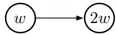

where the expressions inside the two circles indicate the two state's values.

Suppose initially  \(w = 10\)  . The transition will then be from a state of estimated value 10 to a state of estimated value 20. It will look like a good transition, and  \(w\)  will be increased to raise the first state's estimated value. If  \(\gamma\)  is nearly 1, then the TD error will be nearly 10, and, if  \(\alpha = 0.1\)  , then  \(w\)  will be increased to nearly 11 in trying to reduce the TD error. However, the second state's estimated value will also be increased, to nearly 22. If the transition occurs again, then it will be from a state of estimated value  \(\approx 11\)  to a state of estimated value  \(\approx 22\)  , for a TD error of  \(\approx 11\)  larger, not smaller, than before. It will look even more like the first state is undervalued, and its value will be increased again, this time to  \(\approx 12.1\)  . This looks bad, and in fact with further updates  \(w\)  will diverge to infinity.

To see this definitively we have to look more carefully at the sequence of updates. The TD error on a transition between the two states is

$$
\delta_{t} = R_{t + 1} + \gamma \hat{v} (S_{t + 1},\mathbf{w}_{t}) - \hat{v} (S_{t},\mathbf{w}_{t}) = 0 + \gamma 2w_{t} - w_{t} = (2\gamma -1)w_{t},
$$

and the off- policy semi- gradient TD(0) update (from (11.2)) is

$$
w_{t + 1} = w_{t} + \alpha \rho_{t}\delta_{t}\nabla \hat{v} (S_{t},w_{t}) = w_{t} + \alpha \cdot 1\cdot (2\gamma -1)w_{t}\cdot 1 = \big(1 + \alpha (2\gamma -1)\big)w_{t}.
$$

Note that the importance sampling ratio,  \(\rho_{t}\)  , is  \(1\)  on this transition because there is only one action available from the first state, so its probabilities of being taken under the target and behavior policies must both be 1. In the final update above, the new parameter is the old parameter times a scalar constant,  \(1 + \alpha (2\gamma - 1)\)  . If this constant is greater than 1, then the system is unstable and  \(w\)  will go to positive or negative infinity depending on its initial value. Here this constant is greater than 1 whenever  \(\gamma >0.5\)  Note that stability does not depend on the specific step size, as long as  \(\alpha >0\)  . Smaller or larger step sizes would affect the rate at which  \(w\)  goes to infinity, but not whether it goes there or not.

Key to this example is that the one transition occurs repeatedly without  \(w\)  being updated on other transitions. This is possible under off- policy training because the

behavior policy might select actions on those other transitions which the target policy never would. For these transitions,  \(\rho_{t}\)  would be zero and no update would be made. Under on- policy training, however,  \(\rho_{t}\)  is always one. Each time there is a transition from the  \(w\)  state to the  \(2w\)  state, increasing  \(w\) , there would also have to be a transition out of the  \(2w\)  state. That transition would reduce  \(w\) , unless it were to a state whose value was higher (because  \(\gamma < 1\) ) than  \(2w\) , and then that state would have to be followed by a state of even higher value, or else again  \(w\)  would be reduced. Each state can support the one before only by creating a higher expectation. Eventually the piper must be paid. In the on- policy case the promise of future reward must be kept and the system is kept in check. But in the off- policy case, a promise can be made and then, after taking an action that the target policy never would, forgotten and forgiven.

This simple example communicates much of the reason why off- policy training can lead to divergence, but it is not completely convincing because it is not complete—it is just a fragment of a complete MDP. Can there really be a complete system with instability? A simple complete example of divergence is Baird's counterexample. Consider the episodic seven- state, two- action MDP shown in Figure 11.1. The dashed action takes the system to one of the six upper states with equal probability, whereas the solid action takes the system to the seventh state. The behavior policy  \(b\)  selects the dashed and solid actions with probabilities  \(\frac{6}{7}\)  and  \(\frac{1}{7}\) , so that the next- state distribution under it is uniform (the same for all nonterminal states), which is also the starting distribution for each episode. The target policy  \(\pi\)  always takes the solid action, and so the on- policy distribution (for  \(\pi\) ) is concentrated in the seventh state. The reward is zero on all transitions. The discount rate is  \(\gamma = 0.99\) .

Consider estimating the state- value under the linear parameterization indicated by the expression shown in each state circle. For example, the estimated value of the leftmost state is  \(2w_{1} + w_{8}\) , where the subscript corresponds to the component of the

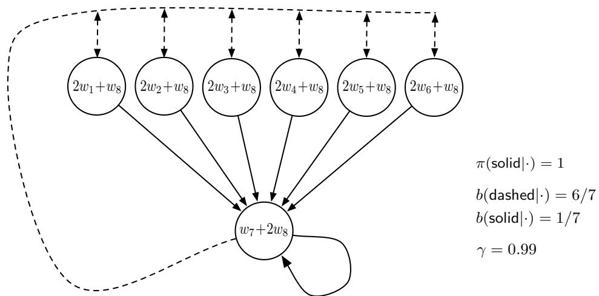  
Figure 11.1: Baird's counterexample. The approximate state-value function for this Markov process is of the form shown by the linear expressions inside each state. The solid action usually results in the seventh state, and the dashed action usually results in one of the other six states, each with equal probability. The reward is always zero.

overall weight vector  \(\mathbf{w} \in \mathbb{R}^{8}\) ; this corresponds to a feature vector for the first state being  \(\mathbf{x}(1) = (2,0,0,0,0,0,0,1)^{- 1}\) . The reward is zero on all transitions, so the true value function is  \(v_{\pi}(s) = 0\) , for all  \(s\) , which can be exactly approximated if  \(\mathbf{w} = \mathbf{0}\) . In fact, there are many solutions, as there are more components to the weight vector (8) than there are nonterminal states (7). Moreover, the set of feature vectors,  \(\{\mathbf{x}(s):s \in \mathbb{S}\}\) , is a linearly independent set. In all these ways this task seems a favorable case for linear function approximation.

If we apply semi- gradient TD(0) to this problem (11.2), then the weights diverge to infinity, as shown in Figure 11.2 (left). The instability occurs for any positive step size, no matter how small. In fact, it even occurs if an expected update is done as in dynamic programming (DP), as shown in Figure 11.2 (right). That is, if the weight vector,  \(\mathbf{w}_{k}\) , is updated for all states at the same time in a semi- gradient way, using the DP (expectation- based) target:

$$
\mathbf{w}_{k + 1} \doteq \mathbf{w}_{k} + \frac{\alpha}{|\mathcal{S}|} \sum_{s} \Big(\mathbb{E}_{\pi} [R_{t + 1} + \gamma \hat{v} (S_{t + 1}, \mathbf{w}_{k}) \mid S_{t} = s] - \hat{v} (s, \mathbf{w}_{k}) \Big) \nabla \hat{v} (s, \mathbf{w}_{k}). \tag{11.9}
$$

In this case, there is no randomness and no asynchrony, just as in a classical DP update. The method is conventional except in its use of semi- gradient function approximation. Yet still the system is unstable.

If we alter just the distribution of DP updates in Baird's counterexample, from the uniform distribution to the on- policy distribution (which generally requires asynchronous updating), then convergence is guaranteed to a solution with error bounded by (9.14). This example is striking because the TD and DP methods used are arguably the simplest

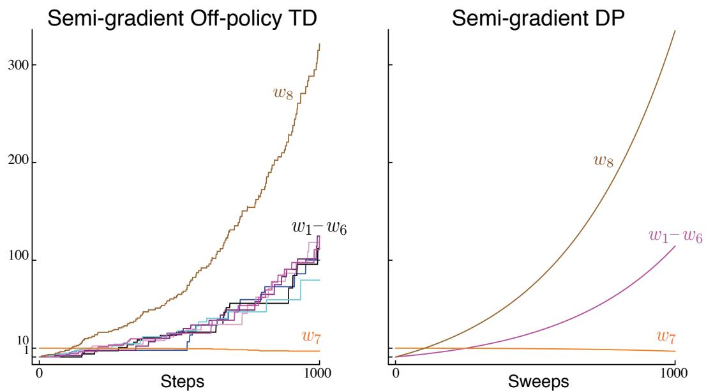  
Figure 11.2: Demonstration of instability on Baird's counterexample. Shown are the evolution of the components of the parameter vector  \(\mathbf{w}\)  of the two semi-gradient algorithms. The step size was  \(\alpha = 0.01\) , and the initial weights were  \(\mathbf{w} = (1,1,1,1,1,1,10,1)^{\top}\) .

and best- understood bootstrapping methods, and the linear, semi- descent method used is arguably the simplest and best- understood kind of function approximation. The example shows that even the simplest combination of bootstrapping and function approximation can be unstable if the updates are not done according to the on- policy distribution.

There are also counterexamples similar to Baird's showing divergence for Q- learning. This is cause for concern because otherwise Q- learning has the best convergence guarantees of all control methods. Considerable effort has gone into trying to find a remedy to this problem or to obtain some weaker, but still workable, guarantee. For example, it may be possible to guarantee convergence of Q- learning as long as the behavior policy is sufficiently close to the target policy, for example, when it is the  \(\epsilon\) - greedy policy. To the best of our knowledge, Q- learning has never been found to diverge in this case, but there has been no theoretical analysis. In the rest of this section we present several other ideas that have been explored.

Suppose that instead of taking just a step toward the expected one- step return on each iteration, as in Baird's counterexample, we actually change the value function all the way to the best, least- squares approximation. Would this solve the instability problem? Of course it would if the feature vectors,  \(\{\mathbf{x}(s):s\in \mathbb{S}\}\) , formed a linearly independent set, as they do in Baird's counterexample, because then exact approximation is possible on each iteration and the method reduces to standard tabular DP. But of course the point here is to consider the case when an exact solution is not possible. In this case stability is not guaranteed even when forming the best approximation at each iteration, as shown in the example.

Example 11.1: Tsitsiklis and Van Roy's Counterexample This example shows that linear function approximation would not work with DP even if the least- squares solution was found at each step. The counterexample is formed

by extending the  \(w\)  to  \(2w\)  example (from earlier in this section) with a terminal state, as shown to the right. As before, the estimated value of the first state is  \(w\) , and the estimated value of the second state is  \(2w\) . The reward is zero on all transitions, so the true values are zero at both states, which is exactly representable with  \(w = 0\) . If we set  \(w_{k + 1}\)  at each step so as to minimize the  \(\overline{\mathrm{VE}}\)  between the estimated value and the expected one- step return, then we have

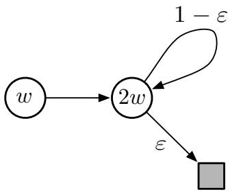

$$
\begin{array}{rcl}{w_{k + 1}} & = & {\underset {w\in \mathbb{R}}{\operatorname{argmin}}\sum_{s\in \mathbb{S}}\Bigl (\hat{v} (s,w) - \mathbb{E}_{\pi}\bigl [R_{t + 1} + \gamma \hat{v} (S_{t + 1},w_k)\bigm |S_t = s\bigr ]\Bigr)^2}\\ {} & = & {\underset {w\in \mathbb{R}}{\operatorname{argmin}}\left(w - \gamma 2w_k\right)^2 +\bigl (2w - (1 - \epsilon)\gamma 2w_k\bigr)^2}\\ {} & = & {\frac{6 - 4\epsilon}{5}\gamma w_k.} \end{array} \tag{11.10}
$$

The sequence  \(\{w_k\}\)  diverges when  \(\gamma >\frac{5}{6 - 4\bar{\epsilon}}\)  and  \(w_0\neq 0\) .

Another way to try to prevent instability is to use special methods for function approximation. In particular, stability is guaranteed for function approximation methods that do not extrapolate from the observed targets. These methods, called averagers, include nearest neighbor methods and locally weighted regression, but not popular methods such as tile coding and artificial neural networks (ANNs).

Exercise 11.3 (programming) Apply one- step semi- gradient Q- learning to Baird's counterexample and show empirically that its weights diverge.  \(\square\)

# 11.3 The Deadly Triad

Our discussion so far can be summarized by saying that the danger of instability and divergence arises whenever we combine all of the following three elements, making up what we call the deadly triad:

Function approximation. A powerful, scalable way of generalizing from a state space much larger than the memory and computational resources (e.g., linear function approximation or ANN).

Bootstrapping Update targets that include existing estimates (as in dynamic programming or TD methods) rather than relying exclusively on actual rewards and complete returns (as in MC methods).

Off- policy training Training on a distribution of transitions other than that produced by the target policy. Sweeping through the state space and updating all states uniformly, as in dynamic programming, does not respect the target policy and is an example of off- policy training.

In particular, note that the danger is not due to control or to generalized policy iteration. Those cases are more complex to analyze, but the instability arises in the simpler prediction case whenever it includes all three elements of the deadly triad. The danger is also not due to learning or to uncertainties about the environment, because it occurs just as strongly in planning methods, such as dynamic programming, in which the environment is completely known.

If any two elements of the deadly triad are present, but not all three, then instability can be avoided. It is natural, then, to go through the three and see if there is any one that can be given up.

Of the three, function approximation most clearly cannot be given up. We need methods that scale to large problems and to great expressive power. We need at least linear function approximation with many features and parameters. State aggregation or nonparametric methods whose complexity grows with data are too weak or too expensive. Least- squares methods such as LSTD are of quadratic complexity and are therefore too expensive for large problems.

Doing without bootstrapping is possible, at the cost of computational and data efficiency. Perhaps most important are the losses in computational efficiency. Monte Carlo (nonbootstrapping) methods require memory to save everything that happens between making

each prediction and obtaining the final return, and all their computation is done once the final return is obtained. The cost of these computational issues is not apparent on serial von Neumann computers, but would be on specialized hardware. With bootstrapping and eligibility traces (Chapter 12), data can be dealt with when and where it is generated, then need never be used again. The savings in communication and memory made possible by bootstrapping are great.

The losses in data efficiency by giving up bootstrapping are also significant. We have seen this repeatedly, such as in Chapters 7 (Figure 7.2) and 9 (Figure 9.2), where some degree of bootstrapping performed much better than Monte Carlo methods on the random- walk prediction task, and in Chapter 10 where the same was seen on the Mountain- Car control task (Figure 10.4). Many other problems show much faster learning with bootstrapping (e.g., see Figure 12.14). Bootstrapping often results in faster learning because it allows learning to take advantage of the state property, the ability to recognize a state upon returning to it. On the other hand, bootstrapping can impair learning on problems where the state representation is poor and causes poor generalization (e.g., this seems to be the case on Tetris, see Simsek, Algorta, and Kothiyal, 2016). A poor state representation can also result in bias; this is the reason for the poorer bound on the asymptotic approximation quality of bootstrapping methods (Equation 9.14). On balance, the ability to bootstrap has to be considered extremely valuable. One may sometimes choose not to use it by selecting long  \(n\) - step updates (or a large bootstrapping parameter,  \(\lambda \approx 1\) ; see Chapter 12) but often bootstrapping greatly increases efficiency. It is an ability that we would very much like to keep in our toolkit.

Finally, there is off- policy learning; can we give that up? On- policy methods are often adequate. For model- free reinforcement learning, one can simply use Sarsa rather than Q- learning. Off- policy methods free behavior from the target policy. This could be considered an appealing convenience but not a necessity. However, off- policy learning is essential to other anticipated use cases, cases that we have not yet mentioned in this book but may be important to the larger goal of creating a powerful intelligent agent.

In these use cases, the agent learns not just a single value function and single policy, but large numbers of them in parallel. There is extensive psychological evidence that people and animals learn to predict many different sensory events, not just rewards. We can be surprised by unusual events, and correct our predictions about them, even if they are of neutral valence (neither good nor bad). This kind of prediction presumably underlies predictive models of the world such as are used in planning. We predict what we will see after eye movements, how long it will take to walk home, the probability of making a jump shot in basketball, and the satisfaction we will get from taking on a new project. In all these cases, the events we would like to predict depend on our acting in a certain way. To learn them all, in parallel, requires learning from the one stream of experience. There are many target policies, and thus the one behavior policy cannot equal all of them. Yet parallel learning is conceptually possible because the behavior policy may overlap in part with many of the target policies. To take full advantage of this requires off- policy learning.

# 11.4 Linear Value-function Geometry

To better understand the stability challenge of off- policy learning, it is helpful to think about value function approximation more abstractly and independently of how learning is done. We can imagine the space of all possible state- value functions- - all functions from states to real numbers  \(v:\mathbb{S}\rightarrow \mathbb{R}\)  . Most of these value functions do not correspond to any policy. More important for our purposes is that most are not representable by the function approximator, which by design has far fewer parameters than there are states.

Given an enumeration of the state space  \(\mathcal{S} = \{s_{1},s_{2},\ldots ,s_{|\mathcal{S}|}\}\)  , any value function  \(v\)  corresponds to a vector listing the value of each state in order  \(\left[v(s_{1}),v(s_{2}),\ldots ,v(s_{|\mathcal{S}|})\right]^{\top}\)  This vector representation of a value function has as many components as there are states. In most cases where we want to use function approximation, this would be far too many components to represent the vector explicitly. Nevertheless, the idea of this vector is conceptually useful. In the following, we treat a value function and its vector representation interchangeably.

To develop intuitions, consider the case with three states  \(\mathcal{S} = \{s_{1},s_{2},s_{3}\}\)  and two parameters  \(\mathbf{w} = (w_{1},w_{2})^{\top}\)  . We can then view all value functions/vectors as points in a three- dimensional space. The parameters provide an alternative coordinate system over a two- dimensional subspace. Any weight vector  \(\mathbf{w} = (w_{1},w_{2})^{\top}\)  is a point in the two- dimensional subspace and thus also a complete value function  \(v_{\mathbf{w}}\)  that assigns values to all three states. With general function approximation the relationship between the full space and the subspace of representable functions could be complex, but in the case of linear value- function approximation the subspace is a simple plane, as suggested by Figure 11.3.

Now consider a single fixed policy  \(\pi\)  . We assume that its true value function,  \(v_{\pi}\)  , is too complex to be represented exactly as an approximation. Thus  \(v_{\pi}\)  is not in the subspace; in the figure it is depicted as being above the planar subspace of representable functions.

If  \(v_{\pi}\)  cannot be represented exactly, what representable value function is closest to it? This turns out to be a subtle question with multiple answers. To begin, we need a measure of the distance between two value functions. Given two value functions  \(v_{1}\)  and  \(v_{2}\)  , we can talk about the vector difference between them,  \(v = v_{1} - v_{2}\)  . If  \(v\)  is small, then the two value functions are close to each other. But how are we to measure the size of this difference vector? The conventional Euclidean norm is not appropriate because, as discussed in Section 9.2, some states are more important than others because they occur more frequently or because we are more interested in them (Section 9.11). As in Section 9.2, let us use the distribution  \(\mu :\mathcal{S}\rightarrow [0,1]\)  to specify the degree to which we care about different states being accurately valued (often taken to be the on- policy distribution). We can then define the distance between value functions using the norm

$$
\| v\|_{\mu}^{2}\doteq \sum_{s\in \mathcal{S}}\mu (s)v(s)^{2}. \tag{11.11}
$$

Note that the  \(\overline{{\mathrm{VE}}}\)  from Section 9.2 can be written simply using this norm as  \(\overline{{\mathrm{VE}}} (\mathbf{w}) =\) \(\| v_{\mathbf{w}} - v_{\pi}\|_{\mu}^{2}\)  . For any value function  \(v\)  , the operation of finding its closest value function in the subspace of representable value functions is a projection operation. We define a

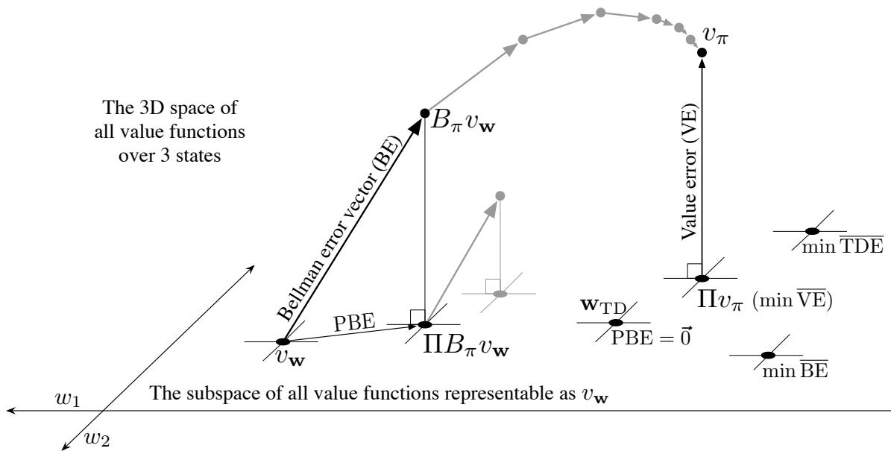  
Figure 11.3: The geometry of linear value-function approximation. Shown is the threedimensional space of all value functions over three states, while shown as a plane is the subspace of all value functions representable by a linear function approximator with parameter  \(\mathbf{w} = (w_{1},w_{2})^{\top}\)  The true value function  \(v_{\pi}\)  is in the larger space and can be projected down (into the subspace, using a projection operator  \(\Pi\)  ) to its best approximation in the value error (VE) sense. The best approximators in the Bellman error (BE), projected Bellman error (PBE), and temporal difference error (TDE) senses are all potentially different and are shown in the lower right. (VE, BE, and PBE are all treated as the corresponding vectors in this figure.) The Bellman operator takes a value function in the plane to one outside, which can then be projected back. If you iteratively applied the Bellman operator outside the space (shown in gray above) you would reach the true value function, as in conventional dynamic programming. If instead you kept projecting back into the subspace at each step, as in the lower step shown in gray, then the fixed point would be the point of vector-zero PBE.

projection operator  \(\Pi\)  that takes an arbitrary value function to the representable function that is closest in our norm:

$$
\Pi v \doteq v_{\mathbf{w}} \text{where} \mathbf{w} = \underset{\mathbf{w} \in \mathbb{R}^{d}}{\arg \min} \| v - v_{\mathbf{w}}\|_{\mu}^{2}. \tag{11.12}
$$

The representable value function that is closest to the true value function  \(v_{\pi}\)  is thus its projection,  \(\Pi v_{\pi}\) , as suggested in Figure 11.3. This is the solution asymptotically found by Monte Carlo methods, albeit often very slowly. The projection operation is discussed more fully in the box on the next page.

TD methods find different solutions. To understand their rationale, recall that the Bellman equation for value function  \(v_{\pi}\)  is

$$
v_{\pi}(s) = \sum_{a} \pi (a|s) \sum_{s', r} p(s', r|s, a) \left[ r + \gamma v_{\pi}(s') \right], \qquad \text{for all} s \in \mathcal{S}. \tag{11.16}
$$

# The projection matrix

For a linear function approximator, the projection operation is linear, which implies that it can be represented as an  \(|\mathcal{S}| \times |\mathcal{S}|\)  matrix:

$$
\mathrm{II} = \mathbf{X}\left(\mathbf{X}^{\top}\mathbf{D}\mathbf{X}\right)^{-1}\mathbf{X}^{\top}\mathbf{D}, \tag{11.13}
$$

where, as in Section 9.4,  \(\mathbf{D}\)  denotes the  \(|\mathcal{S}| \times |\mathcal{S}|\)  diagonal matrix with the  \(\mu (s)\)  on the diagonal, and  \(\mathbf{X}\)  denotes the  \(|\mathcal{S}| \times d\)  matrix whose rows are the feature vectors  \(\mathbf{x}(s)^{\top}\) , one for each state  \(s\) . If the inverse in (11.13) does not exist, then the pseudoinverse is substituted. Using these matrices, the squared norm of a vector can be written

$$
\| v\|_{\mu}^{2} = v^{\top}\mathbf{D}v, \tag{11.14}
$$

and the approximate linear value function can be written

$$
v_{\mathbf{w}} = \mathbf{X}\mathbf{w}. \tag{11.15}
$$

The true value function  \(v_{\pi}\)  is the only value function that solves (11.16) exactly. If an approximate value function  \(v_{\mathbf{w}}\)  were substituted for  \(v_{\pi}\) , the difference between the right and left sides of the modified equation could be used as a measure of how far off  \(v_{\mathbf{w}}\)  is from  \(v_{\pi}\) . We call this the Bellman error at state  \(s\) :

$$
\begin{array}{r l} & {\bar{\delta}_{\mathbf{w}}(s)\doteq \left(\sum_{a}\pi (a|s)\sum_{r^{\prime},r}p(s^{\prime},r|s,a)[r + \gamma v_{\mathbf{w}}(s^{\prime})]\right) - v_{\mathbf{w}}(s)}\\ & {\quad \quad = \mathbb{E}_{\pi}\big[R_{t + 1} + \gamma v_{\mathbf{w}}(S_{t + 1}) - v_{\mathbf{w}}(S_{t})\big|S_{t} = s,A_{t}\sim \pi \big],} \end{array} \tag{11.17}
$$

which shows clearly the relationship of the Bellman error to the TD error (11.3). The Bellman error is the expectation of the TD error.

The vector of all the Bellman errors, at all states,  \(\bar{\delta}_{\mathbf{w}} \in \mathbb{R}^{|\mathcal{S}|}\) , is called the Bellman error vector (shown as BE in Figure 11.3). The overall size of this vector, in the norm, is an overall measure of the error in the value function, called the mean square Bellman error:

$$
\overline{\mathrm{BE}} (\mathbf{w}) = \left\| \bar{\delta}_{\mathbf{w}}\right\|_{\mu}^{2}. \tag{11.19}
$$

It is not possible in general to reduce the  \(\overline{\mathrm{BE}}\)  to zero (at which point  \(v_{\mathbf{w}} = v_{\pi}\) ), but for linear function approximation there is a unique value of  \(\mathbf{w}\)  for which the  \(\overline{\mathrm{BE}}\)  is minimized. This point in the representable- function subspace (labeled min  \(\overline{\mathrm{BE}}\)  in Figure 11.3) is different in general from that which minimizes the  \(\overline{\mathrm{VE}}\)  (shown as  \(\mathrm{H}v_{\pi}\) ). Methods that seek to minimize the  \(\overline{\mathrm{BE}}\)  are discussed in the next two sections.

The Bellman error vector is shown in Figure 11.3 as the result of applying the Bellman operator  \(B_{\pi}: \mathbb{R}^{|\mathcal{S}|} \to \mathbb{R}^{|\mathcal{S}|}\)  to the approximate value function. The Bellman operator is

defined by

$$
(B_{\pi}v)(s) \doteq \sum_{a} \pi (a|s) \sum_{s', r} p(s', r|s, a) \left[ r + \gamma v(s') \right], \tag{11.20}
$$

for all  \(s \in \mathcal{S}\) ,  \(v: \mathcal{S} \to \mathbb{R}\) . The Bellman error vector for  \(v_{\mathbf{w}}\)  can be written  \(\bar{\delta}_{\mathbf{w}} = B_{\pi} v_{\mathbf{w}} - v_{\mathbf{w}}\) .

If the Bellman operator is applied to a value function in the representable subspace, then, in general, it will produce a new value function that is outside the subspace, as suggested in the figure. In dynamic programming (without function approximation), this operator is applied repeatedly to the points outside the representable space, as suggested by the gray arrows in the top of Figure 11.3. Eventually that process converges to the true value function  \(v_{\pi}\) , the only fixed point for the Bellman operator, the only value function for which

$$
v_{\pi} = B_{\pi}v_{\pi}, \tag{11.21}
$$

which is just another way of writing the Bellman equation for  \(\pi\)  (11.16).

With function approximation, however, the intermediate value functions lying outside the subspace cannot be represented. The gray arrows in the upper part of Figure 11.3 cannot be followed because after the first update (dark line) the value function must be projected back into something representable. The next iteration then begins within the subspace; the value function is again taken outside of the subspace by the Bellman operator and then mapped back by the projection operator, as suggested by the lower gray arrow and line. Following these arrows is a DP- like process with approximation.

In this case we are interested in the projection of the Bellman error vector back into the representable space. This is the projected Bellman error vector  \(\Pi \delta_{\mathbf{w}}\) , shown in Figure 11.3 as PBE. The size of this vector, in the norm, is another measure of error in the approximate value function. For any approximate value function  \(v_{\mathbf{w}}\) , we define the mean square Projected Bellman error, denoted  \(\overline{\mathrm{PBE}}\) , as

$$
\overline{\mathrm{PBE}} (\mathbf{w}) = \left\| \Pi \delta_{\mathbf{w}} \right\|_{\mu}^{2}. \tag{11.22}
$$

With linear function approximation there always exists an approximate value function (within the subspace) with zero  \(\overline{\mathrm{PBE}}\) ; this is the TD fixed point,  \(\mathbf{w}_{\mathrm{TD}}\) , introduced in Section 9.4. As we have seen, this point is not always stable under semi- gradient TD methods and off- policy training. As shown in the figure, this value function is generally different from those minimizing  \(\overline{\mathrm{VE}}\)  or  \(\overline{\mathrm{BE}}\) . Methods that are guaranteed to converge to it are discussed in Sections 11.7 and 11.8.

# 11.5 Gradient Descent in the Bellman Error

Armed with a better understanding of value function approximation and its various objectives, we return now to the challenge of stability in off- policy learning. We would like to apply the approach of stochastic gradient descent (SGD, Section 9.3), in which updates are made that in expectation are equal to the negative gradient of an objective

function. These methods always go downhill (in expectation) in the objective and because of this are typically stable with excellent convergence properties. Among the algorithms investigated so far in this book, only the Monte Carlo methods are true SGD methods. These methods converge robustly under both on- policy and off- policy training as well as for general nonlinear (differentiable) function approximators, though they are often slower than semi- gradient methods with bootstrapping, which are not SGD methods. Semi- gradient methods may diverge under off- policy training, as we have seen earlier in this chapter, and under contrived cases of nonlinear function approximation (Tsitsiklis and Van Roy, 1997). With a true SGD method such divergence would not be possible.

The appeal of SGD is so strong that great effort has gone into finding a practical way of harnessing it for reinforcement learning. The starting place of all such efforts is the choice of an error or objective function to optimize. In this and the next section we explore the origins and limits of the most popular proposed objective function, that based on the Bellman error introduced in the previous section. Although this has been a popular and influential approach, the conclusion that we reach here is that it is a misstep and yields no good learning algorithms. On the other hand, this approach fails in an interesting way that offers insight into what might constitute a good approach.

To begin, let us consider not the Bellman error, but something more immediate and naive. Temporal difference learning is driven by the TD error. Why not take the minimization of the expected square of the TD error as the objective? In the general function- approximation case, the one- step TD error with discounting is

$$
\delta_{t} = R_{t + 1} + \gamma \hat{v} (S_{t + 1},\mathbf{w}_{t}) - \hat{v} (S_{t},\mathbf{w}_{t}).
$$

A possible objective function then is what one might call the mean square TD error:

$$
\begin{array}{r l} & {\overline{{\mathrm{TDE}}} (\mathbf{w}) = \sum_{s\in \mathcal{S}}\mu (s)\mathbb{E}\big[\delta_{t}^{2}\big| S_{t} = s,A_{t}\sim \pi \big]}\\ & {\qquad = \sum_{s\in \mathcal{S}}\mu (s)\mathbb{E}\big[\rho_{t}\delta_{t}^{2}\big| S_{t} = s,A_{t}\sim b\big]}\\ & {\qquad = \mathbb{E}_{b}\big[\rho_{t}\delta_{t}^{2}\big].} \end{array}
$$

The last equation is of the form needed for SGD; it gives the objective as an expectation that can be sampled from experience (remember the experience is due to the behavior policy  \(b\) ). Thus, following the standard SGD approach, one can derive the per- step update based on a sample of this expected value:

$$
\begin{array}{l}{{\bf w}_{t + 1} = {\bf w}_{t} - \frac{1}{2}\alpha \nabla (\rho_{t}\delta_{t}^{2})}\\ {= {\bf w}_{t} - \alpha \rho_{t}\delta_{t}\nabla \delta_{t}}\\ {= {\bf w}_{t} + \alpha \rho_{t}\delta_{t}\big(\nabla \hat{v} (S_{t},{\bf w}_{t}) - \gamma \nabla \hat{v} (S_{t + 1},{\bf w}_{t})\big),} \end{array} \tag{11.23}
$$

which you will recognize as the same as the semi- gradient TD algorithm (11.2) except for the additional final term. This term completes the gradient and makes this a true SGD algorithm with excellent convergence guarantees. Let us call this algorithm the naive

residual- gradient algorithm (after Baird, 1995). Although the naive residual- gradient algorithm converges robustly, it does not necessarily converge to a desirable place.

# Example 11.2: A-split example, showing the naive or the naive residual-gradient algorithm

Consider the three- state episodic MRP shown to the right. Episodes begin in state A and then 'split' stochastically, half the time going to B (and then invariably going on to terminate with a reward of 1) and half the time going to state C (and then invariably terminating with a reward of zero). Reward for the first transition, out of A, is always zero whichever way the episode goes. As this is an episodic problem, we can take  \(\gamma\)  to be 1. We also assume on- policy training, so that  \(\rho_{t}\)  is always

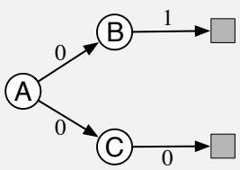

1, and tabular function approximation, so that the learning algorithms are free to give arbitrary, independent values to all three states. Thus, this should be an easy problem.

What should the values be? From A, half the time the return is 1, and half the time the return is 0; A should have value  \(\frac{1}{2}\) . From B the return is always 1, so its value should be 1, and similarly from C the return is always 0, so its value should be 0. These are the true values and, as this is a tabular problem, all the methods presented previously converge to them exactly.

However, the naive residual- gradient algorithm finds different values for B and C. It converges with B having a value of  \(\frac{3}{4}\)  and C having a value of  \(\frac{1}{4}\)  (A converges correctly to  \(\frac{1}{2}\) ). These are in fact the values that minimize the TDE.

Let us compute the TDE for these values. The first transition of each episode is either up from A's  \(\frac{1}{2}\)  to B's  \(\frac{3}{4}\) , a change of  \(\frac{1}{4}\) , or down from A's  \(\frac{1}{2}\)  to C's  \(\frac{1}{4}\) , a change of  \(- \frac{1}{4}\) . Because the reward is zero on these transitions, and  \(\gamma = 1\) , these changes are the TD errors, and thus the squared TD error is always  \(\frac{1}{16}\)  on the first transition. The second transition is similar; it is either up from B's  \(\frac{3}{4}\)  to a reward of 1 (and a terminal state of value 0), or down from C's  \(\frac{1}{4}\)  to a reward of 0 (again with a terminal state of value 0). Thus, the TD error is always  \(\pm \frac{1}{4}\) , for a squared error of  \(\frac{1}{16}\)  on the second step. Thus, for this set of values, the TDE on both steps is  \(\frac{1}{16}\) .

Now let's compute the TDE for the true values (B at 1, C at 0, and A at  \(\frac{1}{2}\) ). In this case the first transition is either from  \(\frac{1}{2}\)  up to 1, at B, or from  \(\frac{1}{2}\)  down to 0, at C; in either case the absolute error is  \(\frac{1}{2}\)  and the squared error is  \(\frac{1}{4}\) . The second transition has zero error because the starting value, either 1 or 0 depending on whether the transition is from B or C, always exactly matches the immediate reward and return. Thus the squared TD error is  \(\frac{1}{4}\)  on the first transition and 0 on the second, for a mean reward over the two transitions of  \(\frac{1}{8}\) . As  \(\frac{1}{8}\)  is bigger that  \(\frac{1}{16}\) , this solution is worse according to the TDE. On this simple problem, the true values do not have the smallest TDE.

A tabular representation is used in the A- split example, so the true state values can be exactly represented, yet the naive residual- gradient algorithm finds different values, and these values have lower TDE than do the true values. Minimizing the TDE is naive; by penalizing all TD errors it achieves something more like temporal smoothing than accurate prediction.

A better idea would seem to be minimizing the mean square Bellman error (BE). If the exact values are learned, the Bellman error is zero everywhere. Thus, a Bellman- error- minimizing algorithm should have no trouble with the A- split example. We cannot expect to achieve zero Bellman error in general, as it would involve finding the true value function, which we presume is outside the space of representable value functions. But getting close to this ideal is a natural- seeming goal. As we have seen, the Bellman error is also closely related to the TD error. The Bellman error for a state is the expected TD error in that state. So let's repeat the derivation above with the expected TD error (all expectations here are implicitly conditional on  \(S_{t}\) ):

$$
\begin{array}{rl} & {\mathbf{w}_{t + 1} = \mathbf{w}_t - \frac{1}{2}\alpha \nabla (\mathbb{E}_\pi [\delta_t]^2)}\\ & {\qquad = \mathbf{w}_t - \frac{1}{2}\alpha \nabla (\mathbb{E}_b[\rho_t\delta_t]^2)}\\ & {\qquad = \mathbf{w}_t - \alpha \mathbb{E}_b[\rho_t\delta_t]\nabla \mathbb{E}_b[\rho_t\delta_t]}\\ & {\qquad = \mathbf{w}_t - \alpha \mathbb{E}_b[\rho_t(R_{t + 1} + \gamma \hat{v} (S_{t + 1},\mathbf{w}) - \hat{v} (S_t,\mathbf{w}))]\mathbb{E}_b[\rho_t\nabla \delta_t]}\\ & {\qquad = \mathbf{w}_t + \alpha [\mathbb{E}_b[\rho_t(R_{t + 1} + \gamma \hat{v} (S_{t + 1},\mathbf{w}))] - \hat{v} (S_t,\mathbf{w})]\Big[\nabla \hat{v} (S_t,\mathbf{w}) - \gamma \mathbb{E}_b[\rho_t\nabla \hat{v} (S_{t + 1},\mathbf{w})]\Big].} \end{array}
$$

This update and various ways of sampling it are referred to as the residual- gradient algorithm. If you simply used the sample values in all the expectations, then the equation above reduces almost exactly to (11.23), the naive residual- gradient algorithm.1 But this is naive, because the equation above involves the next state,  \(S_{t + 1}\) , appearing in two expectations that are multiplied together. To get an unbiased sample of the product, two independent samples of the next state are required, but during normal interaction with an external environment only one is obtained. One expectation or the other can be sampled, but not both.

There are two ways to make the residual- gradient algorithm work. One is in the case of deterministic environments. If the transition to the next state is deterministic, then the two samples will necessarily be the same, and the naive algorithm is valid. The other way is to obtain two independent samples of the next state,  \(S_{t + 1}\) , from  \(S_{t}\) , one for the first expectation and another for the second expectation. In real interaction with an environment, this would not seem possible, but when interacting with a simulated environment, it is. One simply rolls back to the previous state and obtains an alternate next state before proceeding forward from the first next state. In either of these cases the residual- gradient algorithm is guaranteed to converge to a minimum of the  \(\overline{\mathrm{BE}}\)  under the usual conditions on the step- size parameter. As a true SGD method, this convergence is

robust, applying to both linear and nonlinear function approximators. In the linear case, convergence is always to the unique  \(\mathbf{w}\)  that minimizes the  \(\overline{\mathrm{BE}}\) .

However, there remain at least three ways in which the convergence of the residual- gradient method is unsatisfactory. The first of these is that empirically it is slow, much slower than semi- gradient methods. Indeed, proponents of this method have proposed increasing its speed by combining it with faster semi- gradient methods initially, then gradually switching over to residual gradient for the convergence guarantee (Baird and Moore, 1999). The second way in which the residual- gradient algorithm is unsatisfactory is that it still seems to converge to the wrong values. It does get the right values in all tabular cases, such as the A- split example, as for those an exact solution to the Bellman

# Example 11.3: A-presplit example, a counterexample for the BE

Consider the three- state episodic MRP shown to the right: Episodes start in either A1 or A2, with equal probability. These two states look exactly the same to the function approximator, like a single state A whose feature representation is distinct from and unrelated to the feature representation of the other two states, B and C, which are also distinct from each other. Specifically, the parameter of the function approximator has three

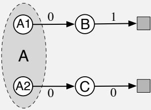

components, one giving the value of state B, one giving the value of state C, and one giving the value of both states A1 and A2. Other than the selection of the initial state, the system is deterministic. If it starts in A1, then it transitions to B with a reward of 0 and then on to termination with a reward of 1. If it starts in A2, then it transitions to C, and then to termination, with both rewards zero.

To a learning algorithm, seeing only the features, the system looks identical to the A- split example. The system seems to always start in A, followed by either B or C with equal probability, and then terminating with a 1 or a 0 depending deterministically on the previous state. As in the A- split example, the true values of B and C are 1 and 0, and the best shared value of A1 and A2 is  \(\frac{1}{2}\) , by symmetry.

Because this problem appears externally identical to the A- split example, we already know what values will be found by the algorithms. Semi- gradient TD converges to the ideal values just mentioned, while the naive residual- gradient algorithm converges to values of  \(\frac{3}{4}\)  and  \(\frac{1}{4}\)  for B and C respectively. All state transitions are deterministic, so the non- naive residual- gradient algorithm will also converge to these values (it is the same algorithm in this case). It follows then that this 'naive' solution must also be the one that minimizes the  \(\overline{\mathrm{BE}}\) , and so it is. On a deterministic problem, the Bellman errors and TD errors are all the same, so the  \(\overline{\mathrm{BE}}\)  is always the same as the TDE. Optimizing the  \(\overline{\mathrm{BE}}\)  on this example gives rise to the same failure mode as with the naive residual- gradient algorithm on the A- split example.

equation is possible. But if we examine examples with genuine function approximation, then the residual- gradient algorithm, and indeed the  \(\overline{\mathrm{BE}}\)  objective, seem to find the wrong value functions. One of the most telling such examples is the variation on the A- split example known as the A- presplit example, shown on the preceding page, in which the residual- gradient algorithm finds the same poor solution as its naive version. This example shows intuitively that minimizing the BE (which the residual- gradient algorithm surely does) may not be a desirable goal.

The third way in which the convergence of the residual- gradient algorithm is not satisfactory is explained in the next section. Like the second way, the third way is also a problem with the  \(\overline{\mathrm{BE}}\)  objective itself rather than with any particular algorithm for achieving it.

# 11.6 The Bellman Error is Not Learnable

The concept of learnability that we introduce in this section is different from that commonly used in machine learning. There, a hypothesis is said to be "learnable" if it is efficiently learnable, meaning that it can be learned within a polynomial rather than an exponential number of examples. Here we use the term in a more basic way, to mean learnable at all, with any amount of experience. It turns out many quantities of apparent interest in reinforcement learning cannot be learned even from an infinite amount of experiential data. These quantities are well defined and can be computed given knowledge of the internal structure of the environment, but cannot be computed or estimated from the observed sequence of feature vectors, actions, and rewards.2 We say that they are not learnable. It will turn out that the Bellman error objective  \((\overline{\mathrm{BE}})\)  introduced in the last two sections is not learnable in this sense. That the Bellman error objective cannot be learned from the observable data is probably the strongest reason not to seek it.

To make the concept of learnability clear, let's start with some simple examples. Consider the two Markov reward processes  \(^3\)  (MRPs) diagrammed below:

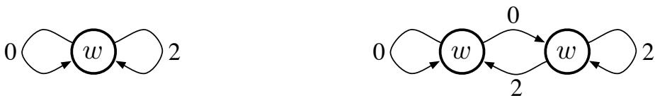

Where two edges leave a state, both transitions are assumed to occur with equal probability, and the numbers indicate the reward received. All the states appear the same; they all produce the same single- component feature vector  \(x = 1\)  and have approximated value  \(w\) . Thus, the only varying part of the data trajectory is the reward sequence. The left MRP stays in the same state and emits an endless stream of 0s and 2s at random, each with 0.5 probability. The right MRP, on every step, either stays in its current state or

switches to the other, with equal probability. The reward is deterministic in this MRP, always a 0 from one state and always a 2 from the other, but because the each state is equally likely on each step, the observable data is again an endless stream of 0s and 2s at random, identical to that produced by the left MRP. (We can assume the right MRP starts in one of two states at random with equal probability.) Thus, even given an infinite amount of data, it would not be possible to tell which of these two MRPs was generating it. In particular, we could not tell if the MRP has one state or two, is stochastic or deterministic. These things are not learnable.

This pair of MRPs also illustrates that the  \(\overline{\mathrm{VE}}\)  objective (9.1) is not learnable. If  \(\gamma = 0\) , then the true values of the three states (in both MRPs), left to right, are 1, 0, and 2. Suppose  \(w = 1\) . Then the  \(\overline{\mathrm{VE}}\)  is 0 for the left MRP and 1 for the right MRP. Because the  \(\overline{\mathrm{VE}}\)  is different in the two problems, yet the data generated has the same distribution, the  \(\overline{\mathrm{VE}}\)  cannot be learned. The  \(\overline{\mathrm{VE}}\)  is not a unique function of the data distribution. And if it cannot be learned, then how could the  \(\overline{\mathrm{VE}}\)  possibly be useful as an objective for learning?

If an objective cannot be learned, it does indeed draw its utility into question. In the case of the  \(\overline{\mathrm{VE}}\) , however, there is a way out. Note that the same solution,  \(w = 1\) , is optimal for both MRPs above (assuming  \(\mu\)  is the same for the two indistinguishable states in the right MRP). Is this a coincidence, or could it be generally true that all MDPs with the same data distribution also have the same optimal parameter vector? If this is true—and we will show next that it is—then the  \(\overline{\mathrm{VE}}\)  remains a usable objective. The  \(\overline{\mathrm{VE}}\)  is not learnable, but the parameter that optimizes it is!

To understand this, it is useful to bring in another natural objective function, this time one that is clearly learnable. One error that is always observable is that between the value estimate at each time and the return from that time. The mean square return error, denoted  \(\overline{\mathrm{RE}}\) , is the expectation, under  \(\mu\) , of the square of this error. In the on- policy case the  \(\overline{\mathrm{RE}}\)  can be written

$$
\begin{array}{rl} & {\overline{\mathrm{RE}} (\mathbf{w}) = \mathbb{E}\Big[\big(G_t - \hat{v} (S_t,\mathbf{w})\big)^2\Big]}\\ & {\qquad = \overline{\mathrm{VE}} (\mathbf{w}) + \mathbb{E}\Big[\big(G_t - v_\pi (S_t)\big)^2\Big].} \end{array} \tag{11.24}
$$

Thus, the two objectives are the same except for a variance term that does not depend on the parameter vector. The two objectives must therefore have the same optimal parameter value  \(\mathbf{w}^*\) . The overall relationships are summarized in the left side of Figure 11.4.

*Exercise 11.4* Prove (11.24). Hint: Write the  \(\overline{\mathrm{RE}}\)  as an expectation over possible states  \(s\)  of the expectation of the squared error given that  \(S_t = s\) . Then add and subtract the true value of state  \(s\)  from the error (before squaring), grouping the subtracted true value with the return and the added true value with the estimated value. Then, if you expand the square, the most complex term will end up being zero, leaving you with (11.24).

Now let us return to the  \(\overline{\mathrm{BE}}\) . The  \(\overline{\mathrm{BE}}\)  is like the  \(\overline{\mathrm{VE}}\)  in that it can be computed from knowledge of the MDP but is not learnable from data. But it is not like the  \(\overline{\mathrm{VE}}\)  in that its minimum solution is not learnable. The box on the next page presents a counterexample—two MRPs that generate the same data distribution but whose minimizing parameter vector is different, proving that the optimal parameter vector is not a function of the

# Example 11.4: Counterexample to the learnability of the Bellman error

To show the full range of possibilities we need a slightly more complex pair of Markov reward processes (MRPs) than those considered earlier. Consider the following two MRPs:

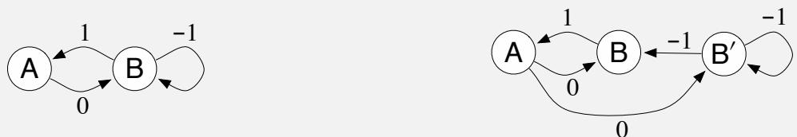

Where two edges leave a state, both transitions are assumed to occur with equal probability, and the numbers indicate the reward received. The MRP on the left has two states that are represented distinctly. The MRP on the right has three states, two of which, B and  \(\mathbf{B}^{\prime}\)  , appear the same and must be given the same approximate value. Specifically, w has two components and the value of state A is given by the first component and the value of B and  \(\mathbf{B}^{\prime}\)  is given by the second. The second MRP has been designed so that equal time is spent in all three states, so we can take  \(\begin{array}{r}{\mu (s) = \frac{1}{3}} \end{array}\)  for all  \(s\)

Note that the observable data distribution is identical for the two MRPs. In both cases the agent will see single occurrences of A followed by a 0, then some number of apparent Bs, each followed by a  \(^{- 1}\)  except the last, which is followed by a 1, then we start all over again with a single A and a 0, etc. All the statistical details are the same as well; in both MRPs, the probability of a string of  \(k\)  Bs is  \(2^{- k}\)

Now suppose  \(\mathbf{w} = \mathbf{0}\)  . In the first MRP, this is an exact solution, and the  \(\overline{\mathrm{BE}}\)  is zero. In the second MRP, this solution produces a squared error in both B and  \(\mathbf{B}^{\prime}\)  of 1, such that  \(\begin{array}{r}{\overline{{\mathrm{BE}}} = \mu (\mathbf{B})1 + \mu (\mathbf{B}^{\prime})1 = \frac{2}{3}} \end{array}\)  . These two MRPs, which generate the same data distribution, have different  \(\overline{\mathrm{BE}}\)  ; the  \(\overline{\mathrm{BE}}\)  is not learnable.

Moreover (and unlike the earlier example for the  \(\overline{\mathrm{VE}}\)  ) the minimizing value of w is different for the two MRPs. For the first MRP,  \(\mathbf{w} = \mathbf{0}\)  minimizes the  \(\overline{\mathrm{BE}}\)  for any  \(\gamma\)  . For the second MRP, the minimizing w is a complicated function of  \(\gamma\)  , but in the limit, as  \(\gamma \rightarrow 1\)  , it is  \((- \textstyle {\frac{1}{2}},0)^{\top}\)  . Thus the solution that minimizes  \(\overline{\mathrm{BE}}\)  cannot be estimated from data alone; knowledge of the MRP beyond what is revealed in the data is required. In this sense, it is impossible in principle to pursue the  \(\overline{\mathrm{BE}}\)  as an objective for learning.

It may be surprising that in the second MRP the  \(\overline{\mathrm{BE}}\)  - minimizing value of A is so far from zero. Recall that A has a dedicated weight and thus its value is unconstrained by function approximation. A is followed by a reward of 0 and transition to a state with a value of nearly 0, which suggests  \(v_{\mathbf{w}}(\mathbf{A})\)  should be 0; why is its optimal value substantially negative rather than 0? The answer is that making  \(v_{\mathbf{w}}(\mathbf{A})\)  negative reduces the error upon arriving in A from B. The reward on this deterministic transition is 1, which implies that B should have a value 1 more than A. Because B's value is approximately zero, A's value is driven toward  \(- 1\)  . The  \(\overline{\mathrm{BE}}\)  - minimizing value of  \(\approx - \frac{1}{2}\)  for A is a compromise between reducing the errors on leaving and on entering A.

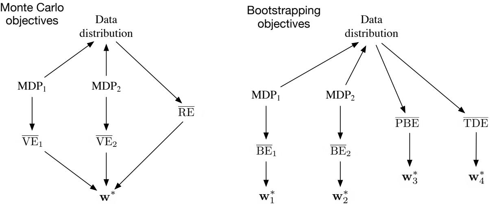  
Figure 11.4: Causal relationships among the data distribution, MDPs, and various objectives. Left, Monte Carlo objectives: Two different MDPs can produce the same data distribution yet also produce different VEs, proving that the  \(\overline{\mathrm{VE}}\)  objective cannot be determined from data and is not learnable. However, all such VEs must have the same optimal parameter vector,  \(\mathbf{w}^{*}\) ! Moreover, this same  \(\mathbf{w}^{*}\)  can be determined from another objective, the  \(\overline{\mathrm{RE}}\) , which is uniquely determined from the data distribution. Thus  \(\mathbf{w}^{*}\)  and the  \(\overline{\mathrm{RE}}\)  are learnable even though the  \(\overline{\mathrm{VE}}\) s are not. Right, Bootstrapping objectives: Two different MDPs can produce the same data distribution yet also produce different BEs and have different minimizing parameter vectors; these are not learnable from the data distribution. The  \(\overline{\mathrm{PBE}}\)  and  \(\overline{\mathrm{TDE}}\)  objectives and their (different) minima can be directly determined from data and thus are learnable.

data and thus cannot be learned from it. The other bootstrapping objectives that we have considered, the  \(\overline{\mathrm{PBE}}\)  and  \(\overline{\mathrm{TDE}}\) , can be determined from data (are learnable) and determine optimal solutions that are in general different from each other and the  \(\overline{\mathrm{BE}}\)  minimums. The general case is summarized in the right side of Figure 11.4.

Thus, the  \(\overline{\mathrm{BE}}\)  is not learnable; it cannot be estimated from feature vectors and other observable data. This limits the  \(\overline{\mathrm{BE}}\)  to model- based settings. There can be no algorithm that minimizes the  \(\overline{\mathrm{BE}}\)  without access to the underlying MDP states beyond the feature vectors. The residual- gradient algorithm is only able to minimize  \(\overline{\mathrm{BE}}\)  because it is allowed to double sample from the same state—not a state that has the same feature vector, but one that is guaranteed to be the same underlying state. We can see now that there is no way around this. Minimizing the  \(\overline{\mathrm{BE}}\)  requires some such access to the nominal, underlying MDP. This is an important limitation of the  \(\overline{\mathrm{BE}}\)  beyond that identified in the A- presplit example on page 273. All this directs more attention toward the  \(\overline{\mathrm{PBE}}\) .

# 11.7 Gradient-TD Methods

We now consider SGD methods for minimizing the PBE. As true SGD methods, these Gradient- TD methods have robust convergence properties even under off- policy training and nonlinear function approximation. Remember that in the linear case there is always an exact solution, the TD fixed point  \(\mathbf{w}_{\mathrm{TD}}\)  , at which the PBE is zero. This solution could be found by least- squares methods (Section 9.8), but only by methods of quadratic  \(O(d^{2})\)  complexity in the number of parameters. We seek instead an SGD method, which should be  \(O(d)\)  and have robust convergence properties. Gradient- TD methods come close to achieving these goals, at the cost of a rough doubling of computational complexity.

To derive an SGD method for the PBE (assuming linear function approximation) we begin by expanding and rewriting the objective (11.22) in matrix terms:

$$
\begin{array}{r l} & {\overline{{\mathrm{PBE}}} (\mathbf{w}) = \left\| \Pi \delta_{\mathbf{w}}\right\|_{\mu}^{2}}\\ & {\qquad = (\Pi \bar{\delta}_{\mathbf{w}})^{\top}\mathbf{D}\Pi \bar{\delta}_{\mathbf{w}}}\\ & {\qquad = \bar{\delta}_{\mathbf{w}}^{\top}\Pi^{\top}\mathbf{D}\Pi \bar{\delta}_{\mathbf{w}}}\\ & {\qquad = \bar{\delta}_{\mathbf{w}}^{\top}\mathbf{D}\mathbf{X}\big(\mathbf{X}^{\top}\mathbf{D}\mathbf{X}\big)^{-1}\mathbf{X}^{\top}\mathbf{D}\bar{\delta}_{\mathbf{w}}} \end{array} \tag{from (11.14)}
$$

(using (11.13) and the identity  \(\Pi^{\top}\mathbf{D}\Pi = \mathbf{D}\mathbf{X}\left(\mathbf{X}^{\top}\mathbf{D}\mathbf{X}\right)^{- 1}\mathbf{X}^{\top}\mathbf{D})\)

$$
= \left(\mathbf{X}^{\top}\mathbf{D}\delta_{\mathbf{w}}\right)^{\top}\left(\mathbf{X}^{\top}\mathbf{D}\mathbf{X}\right)^{-1}\left(\mathbf{X}^{\top}\mathbf{D}\delta_{\mathbf{w}}\right). \tag{11.26}
$$

The gradient with respect to w is

$$
\nabla \overline{{\mathrm{PBE}}} (\mathbf{w}) = 2\nabla \big[\mathbf{X}^{\top}\mathbf{D}\bar{\delta}_{\mathbf{w}}\big]^{\top}\big(\mathbf{X}^{\top}\mathbf{D}\mathbf{X}\big)^{-1}\big(\mathbf{X}^{\top}\mathbf{D}\bar{\delta}_{\mathbf{w}}\big).
$$

To turn this into an SGD method, we have to sample something on every time step that has this quantity as its expected value. Let us take  \(\mu\)  to be the distribution of states visited under the behavior policy. All three of the factors above can then be written in terms of expectations under this distribution. For example, the last factor can be written

$$
\mathbf{X}^{\top}\mathbf{D}\bar{\delta}_{\mathbf{w}} = \sum_{s}\mu (s)\mathbf{x}(s)\bar{\delta}_{\mathbf{w}}(s) = \mathbb{E}[\rho_{t}\delta_{t}\mathbf{x}_{t}],
$$

which is just the expectation of the semi- gradient TD(0) update (11.2). The first factor is the transpose of the gradient of this update:

$$
\begin{array}{r l} & {\nabla \mathbb{E}[\rho_{t}\delta_{t}\mathbf{x}_{t}]^{\top} = \mathbb{E}\big[\rho_{t}\nabla \delta_{t}^{\top}\mathbf{x}_{t}^{\top}\big]}\\ & {\qquad = \mathbb{E}\big[\rho_{t}\nabla (R_{t + 1} + \gamma \mathbf{w}^{\top}\mathbf{x}_{t + 1} - \mathbf{w}^{\top}\mathbf{x}_{t})^{\top}\mathbf{x}_{t}^{\top}\big]}\\ & {\qquad = \mathbb{E}\big[\rho_{t}(\gamma \mathbf{x}_{t + 1} - \mathbf{x}_{t})\mathbf{x}_{t}^{\top}\big].} \end{array} \tag{using episodic \(\delta_{t}\)
$$

Finally, the middle factor is the inverse of the expected outer- product matrix of the feature vectors:

$$
\mathbf{X}^{\top}\mathbf{D}\mathbf{X} = \sum_{s}\mu (s)\mathbf{x}(s)\mathbf{x}(s)^{\top} = \mathbb{E}\left[\mathbf{x}_{t}\mathbf{x}_{t}^{\top}\right].
$$

Substituting these expectations for the three factors in our expression for the gradient of the  \(\overline{\mathrm{PBE}}\) , we get

$$
\nabla \overline{\mathrm{PBE}} (\mathbf{w}) = 2\mathbb{E}\left[\rho_t(\gamma \mathbf{x}_{t + 1} - \mathbf{x}_t)\mathbf{x}_t^\top \right]\mathbb{E}\left[\mathbf{x}_t\mathbf{x}_t^\top \right]^{-1}\mathbb{E}\left[\rho_t\delta_t\mathbf{x}_t\right]. \tag{11.27}
$$

It might not be obvious that we have made any progress by writing the gradient in this form. It is a product of three expressions and the first and last are not independent. They both depend on the next feature vector  \(\mathbf{x}_{t + 1}\) ; we cannot simply sample both of these expectations and then multiply the samples. This would give us a biased estimate of the gradient just as in the residual- gradient algorithm.

Another idea would be to estimate the three expectations separately and then combine them to produce an unbiased estimate of the gradient. This would work, but would require a lot of computational resources, particularly to store the first two expectations, which are  \(d\times d\)  matrices, and to compute the inverse of the second. This idea can be improved. If two of the three expectations are estimated and stored, then the third could be sampled and used in conjunction with the two stored quantities. For example, you could store estimates of the second two quantities (using the increment inverse- updating techniques in Section 9.8) and then sample the first expression. Unfortunately, the overall algorithm would still be of quadratic complexity (of order  \(O(d^2)\) ).

The idea of storing some estimates separately and then combining them with samples is a good one and is also used in Gradient- TD methods. Gradient- TD methods estimate and store the product of the second two factors in (11.27). These factors are a  \(d\times d\)  matrix and a  \(d\) - vector, so their product is just a  \(d\) - vector, like  \(\mathbf{w}\)  itself. We denote this second learned vector as  \(\mathbf{v}\) :

$$
\mathbf{v}\approx \mathbb{E}\big[\mathbf{x}_t\mathbf{x}_t^\top \big]^{-1}\mathbb{E}\big[\rho_t\delta_t\mathbf{x}_t\mathbf{x}_t\big]. \tag{11.28}
$$

This form is familiar to students of linear supervised learning. It is the solution to a linear least- squares problem that tries to approximate  \(\rho_{t}\delta_{t}\)  from the features. The standard SGD method for incrementally finding the vector  \(\mathbf{v}\)  that minimizes the expected squared error  \(\left(\mathbf{v}^\top \mathbf{x}_t - \rho_t\delta_t\right)^2\)  is known as the Least Mean Square (LMS) rule (here augmented with an importance sampling ratio):

$$
\mathbf{v}_{t + 1}\doteq \mathbf{v}_t + \beta \rho_t\left(\delta_t - \mathbf{v}_t^\top \mathbf{x}_t\right)\mathbf{x}_t,
$$

where  \(\beta >0\)  is another step- size parameter. We can use this method to effectively achieve (11.28) with  \(O(d)\)  storage and per- step computation.

Given a stored estimate  \(\mathbf{v}_t\)  approximating (11.28), we can update our main parameter vector  \(\mathbf{w}_t\)  using SGD methods based on (11.27). The simplest such rule is

$$
\begin{array}{r l r}{{\mathbf{w}_{t+1}=\mathbf{w}_{t}-\frac{1}{2}\alpha\nabla\overline{{\mathrm{PBE}}}(\mathbf{w}_{t})}}&{}&{\mathrm{(the~general~SGD~rule)}}}\\ &{=\mathbf{w}_{t}-\frac{1}{2}\alpha 2\mathbb{E}\left[\rho_{t}(\gamma\mathbf{x}_{t+1}-\mathbf{x}_{t})\mathbf{x}_{t}^{\top}\right]\mathbb{E}\left[\mathbf{x}_{t}\mathbf{x}_{t}^{\top}\right]^{-1}\mathbb{E}[\rho_{t}\delta_{t}\mathbf{x}_{t}]}&{\mathrm{(from~(11.27))}}\\ &{=\mathbf{w}_{t}+\alpha\mathbb{E}\left[\rho_{t}(\mathbf{x}_{t}-\gamma\mathbf{x}_{t+1})\mathbf{x}_{t}^{\top}\right]\mathbb{E}\left[\mathbf{x}_{t}\mathbf{x}_{t}^{\top}\right]^{-1}\mathbb{E}[\rho_{t}\delta_{t}\mathbf{x}_{t}]}&{\mathrm{(11.29)}}\\ &{\approx\mathbf{w}_{t}+\alpha\mathbb{E}\left[\rho_{t}(\mathbf{x}_{t}-\gamma\mathbf{x}_{t+1})\mathbf{x}_{t}^{\top}\right]\mathbf{v}_{t}}&{\mathrm{(based~on~(11.28))}}\\ &{\approx\mathbf{w}_{t}+\alpha\rho_{t}\left(\mathbf{x}_{t}-\gamma\mathbf{x}_{t+1}\right)\mathbf{x}_{t}^{\top}\mathbf{v}_{t}.}&{\mathrm{(sampling)}}\end{array} \tag{11.29}
$$

This algorithm is called  \(GTD2\) . Note that if the final inner product  \((\mathbf{x}_t^\top \mathbf{v}_t)\)  is done first, then the entire algorithm is  \(O(d)\)  complexity.

A slightly better algorithm can be derived by doing a few more analytic steps before substituting in  \(\mathbf{v}_t\) . Continuing from (11.29):

$$
\begin{array}{rl} & {\mathbf{w}_{t + 1} = \mathbf{w}_t + \alpha \mathbb{E}\big[\rho_t(\mathbf{x}_t - \gamma \mathbf{x}_{t + 1})\mathbf{x}_t^\top \big]\mathbb{E}\big[\mathbf{x}_t\mathbf{x}_t^\top \big]^{-1}\mathbb{E}[\rho_t\delta_t\mathbf{x}_t]}\\ & {\qquad = \mathbf{w}_t + \alpha \big(\mathbb{E}\big[\rho_t\mathbf{x}_t\mathbf{x}_t^\top \big] - \gamma \mathbb{E}\big[\rho_t\mathbf{x}_{t + 1}\mathbf{x}_t^\top \big]\big)\mathbb{E}\big[\mathbf{x}_t\mathbf{x}_t^\top \big]^{-1}\mathbb{E}[\rho_t\delta_t\mathbf{x}_t]}\\ & {\qquad = \mathbf{w}_t + \alpha \big(\mathbb{E}\big[\mathbf{x}_t\mathbf{x}_t^\top \big] - \gamma \mathbb{E}\big[\rho_t\mathbf{x}_{t + 1}\mathbf{x}_t^\top \big]\big)\mathbb{E}\big[\mathbf{x}_t\mathbf{x}_t^\top \big]^{-1}\mathbb{E}[\rho_t\delta_t\mathbf{x}_t]}\\ & {\q quad = \mathbf{w}_t + \alpha \big(\mathbb{E}[\rho_t\delta_t\mathbf{x}_t] - \gamma \mathbb{E}[\rho_t\mathbf{x}_{t + 1}\mathbf{x}_t^\top ]\mathbb{E}\big[\mathbf{x}_t\mathbf{x}_t^\top \big]^{-1}\mathbb{E}[\rho_t\delta_t\mathbf{x}_t]\big)}\\ & {\qquad \approx \mathbf{w}_t + \alpha \big(\mathbb{E}[\rho_t\delta_t\mathbf{x}_t] - \gamma \mathbb{E}[\rho_t\mathbf{x}_{t + 1}\mathbf{x}_t^\top ]\mathbf{v}_t\big)\qquad \mathrm{(based~on~(11.28))}}\\ & {\qquad \approx \mathbf{w}_t + \alpha \rho_t\big(\delta_t\mathbf{x}_t - \gamma \mathbf{x}_{t + 1}\mathbf{x}_t^\top \mathbf{v}_t\big),\qquad \mathrm{(sampling)}} \end{array}
$$

which again is  \(O(d)\)  if the final product  \((\mathbf{x}_t^\top \mathbf{v}_t)\)  is done first. This algorithm is known as either  \(TD(0)\)  with gradient correction  \((TDC)\)  or, alternatively, as  \(GTD(0)\) .

Figure 11.5 shows a sample and the expected behavior of TDC on Baird's counterexample. As intended, the PBE falls to zero, but note that the individual components of the parameter vector do not approach zero. In fact, these values are still far from

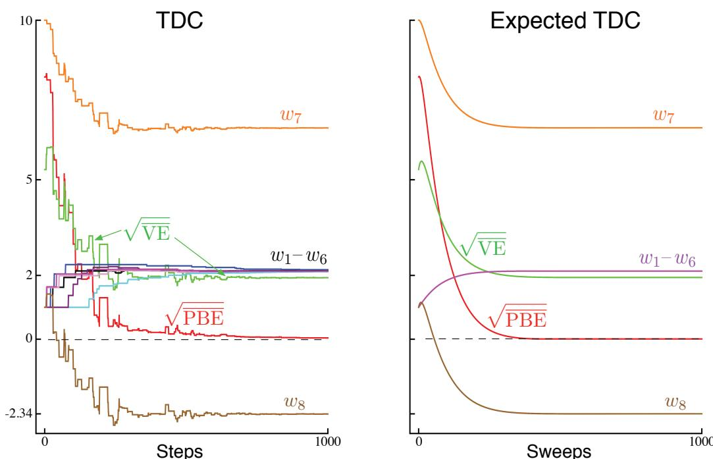  
Figure 11.5: The behavior of the TDC algorithm on Baird's counterexample. On the left is shown a typical single run, and on the right is shown the expected behavior of this algorithm if the updates are done synchronously (analogous to (11.9), except for the two TDC parameter vectors). The step sizes were  \(\alpha = 0.005\)  and  \(\beta = 0.05\) .

an optimal solution,  \(\hat{v} (s) = 0\) , for all  \(s\) , for which  \(\mathbf{w}\)  would have to be proportional to  \((1,1,1,1,1,1,4, - 2)^{\top}\) . After 1000 iterations we are still far from an optimal solution, as we can see from the  \(\overline{\mathbf{V}}\overline{\mathbf{E}}\) , which remains almost 2. The system is actually converging to an optimal solution, but progress is extremely slow because the  \(\overline{\mathbf{PBE}}\)  is already so close to zero.

GTD2 and TDC both involve two learning processes, a primary one for  \(\mathbf{w}\)  and a secondary one for  \(\mathbf{v}\) . The logic of the primary learning process relies on the secondary learning process having finished, at least approximately, whereas the secondary learning process proceeds without being influenced by the first. We call this sort of asymmetrical dependence a cascade. In cascades we often assume that the secondary learning process is proceeding faster and thus is always at its asymptotic value, ready and accurate to assist the primary learning process. The convergence proofs for these methods often make this assumption explicitly. These are called two- time- scale proofs. The fast time scale is that of the secondary learning process, and the slower time scale is that of the primary learning process. If  \(\alpha\)  is the step size of the primary learning process, and  \(\beta\)  is the step size of the secondary learning process, then these convergence proofs will typically require that in the limit  \(\beta \to 0\)  and  \(\frac{\alpha}{\beta} \to 0\) .

Gradient- TD methods are currently the most well understood and widely used stable off- policy methods. There are extensions to action values and control (GQ, Maei et al., 2010), to eligibility traces (GTD( \(\lambda\) ) and GQ( \(\lambda\) ), Maei, 2011; Maei and Sutton, 2010), and to nonlinear function approximation (Maei et al., 2009). There have also been proposed hybrid algorithms midway between semi- gradient TD and gradient TD (Hackman, 2012; White and White, 2016). Hybrid- TD algorithms behave like Gradient- TD algorithms in states where the target and behavior policies are very different, and behave like semi- gradient algorithms in states where the target and behavior policies are the same. Finally, the Gradient- TD idea has been combined with the ideas of proximal methods and control variates to produce more efficient methods (Mahadevan et al., 2014; Du et al., 2017).

# 11.8 Emphatic-TD Methods

We turn now to the second major strategy that has been extensively explored for obtaining a cheap and efficient off- policy learning method with function approximation. Recall that linear semi- gradient TD methods are efficient and stable when trained under the on- policy distribution, and that we showed in Section 9.4 that this has to do with the positive definiteness of the matrix  \(\mathbf{A} \left(9.11\right)^{4}\)  and the match between the on- policy state distribution  \(\mu_{\#}\)  and the state- transition probabilities  \(\rho (s|s,\alpha)\)  under the target policy. In off- policy learning, we reweight the state transitions using importance sampling so that they become appropriate for learning about the target policy, but the state distribution is still that of the behavior policy. There is a mismatch. A natural idea is to somehow reweight the states, emphasizing some and de- emphasizing others, so as to return the distribution of updates to the on- policy distribution. There would then be a match, and stability and convergence would follow from existing results. This is the idea of

Emphatic- TD methods, first introduced for on- policy training in Section 9.11.

Actually, the notion of "the on- policy distribution" is not quite right, as there are many on- policy distributions, and any one of these is sufficient to guarantee stability. Consider an undiscounted episodic problem. The way episodes terminate is fully determined by the transition probabilities, but there may be several different ways the episodes might begin. However the episodes start, if all state transitions are due to the target policy, then the state distribution that results is an on- policy distribution. You might start close to the terminal state and visit only a few states with high probability before ending the episode. Or you might start far away and pass through many states before terminating. Both are on- policy distributions, and training on both with a linear semi- gradient method would be guaranteed to be stable. However the process starts, an on- policy distribution results as long as all states encountered are updated up until termination.

If there is discounting, it can be treated as partial or probabilistic termination for these purposes. If  \(\gamma = 0.9\) , then we can consider that with probability 0.1 the process terminates on every time step and then immediately restarts in the state that is transitioned to. A discounted problem is one that is continually terminating and restarting with probability  \(1 - \gamma\)  on every step. This way of thinking about discounting is an example of a more general notion of pseudo termination—termination that does not affect the sequence of state transitions, but does affect the learning process and the quantities being learned. This kind of pseudo termination is important to off- policy learning because the restarting is optional—remember we can start any way we want to—and the termination relieves the need to keep including encountered states within the on- policy distribution. That is, if we don't consider the new states as restarts, then discounting quickly gives us a limited on- policy distribution.

The one- step Emphatic- TD algorithm for learning episodic state values is defined by:

$$
\delta_{t} = R_{t + 1} + \gamma \hat{v} (S_{t + 1},\mathbf{w}_{t}) - \hat{v} (S_{t},\mathbf{w}_{t}),
$$

$$
\mathbf{w}_{t + 1} = \mathbf{w}_{t} + \alpha M_{t}\rho_{t}\delta_{t}\nabla \hat{v} (S_{t},\mathbf{w}_{t}),
$$

$$
M_{t} = \gamma \rho_{t - 1}M_{t - 1} + I_{t},
$$

with  \(I_{t}\) , the interest, being arbitrary and  \(M_{t}\) , the emphasis, being initialized to  \(M_{- 1} = 0\) . How does this algorithm perform on Baird's counterexample? Figure 11.6 shows the trajectory in expectation of the components of the parameter vector (for the case in which  \(I_{t} = 1\) , for all  \(t\) ). There are some oscillations but eventually everything converges and the  \(\overline{\mathrm{VE}}\)  goes to zero. These trajectories are obtained by iteratively computing the expectation of the parameter vector trajectory without any of the variance due to sampling of transitions and rewards. We do not show the results of applying the Emphatic- TD algorithm directly because its variance on Baird's counterexample is so high that it is high impossible to get consistent results in computational experiments. The algorithm converges to the optimal solution in theory on this problem, but in practice it does not. We turn to the topic of reducing the variance of all these algorithms in the next section.

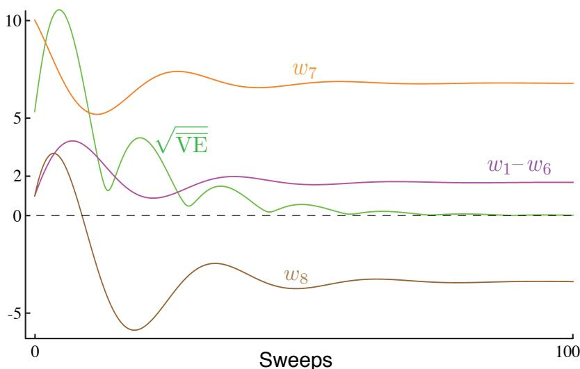  
Figure 11.6: The behavior of the one-step Emphatic-TD algorithm in expectation on Baird's counterexample. The step size was  \(\alpha = 0.03\) .

# 11.9 Reducing Variance

Off- policy learning is inherently of greater variance than on- policy learning. This is not surprising; if you receive data less closely related to a policy, you should expect to learn less about the policy's values. In the extreme, one may be able to learn nothing. You can't expect to learn how to drive by cooking dinner, for example. Only if the target and behavior policies are related, if they visit similar states and take similar actions, should one be able to make significant progress in off- policy training.

On the other hand, any policy has many neighbors, many similar policies with considerable overlap in states visited and actions chosen, and yet which are not identical. The raison d'etre of off- policy learning is to enable generalization to this vast number of related- but- not- identical policies. The problem remains of how to make the best use of the experience. Now that we have some methods that are stable in expected value (if the step sizes are set right), attention naturally turns to reducing the variance of the estimates. There are many possible ideas, and we can just touch on a few of them in this introductory text.

Why is controlling variance especially critical in off- policy methods based on importance sampling? As we have seen, importance sampling often involves products of policy ratios. The ratios are always one in expectation (5.13), but their actual values may be very high or as low as zero. Successive ratios are uncorrelated, so their products are also always one in expected value, but they can be of very high variance. Recall that these ratios multiply the step size in SGD methods, so high variance means taking steps that vary greatly in their sizes. This is problematic for SGD because of the occasional very large steps. They must not be so large as to take the parameter to a part of the space with a very different gradient. SGD methods rely on averaging over multiple steps to get a good sense of the gradient, and if they make large moves from single samples they become unreliable. If the step- size parameter is set small enough to prevent this, then the expected step

can end up being very small, resulting in very slow learning. The notions of momentum (Derthick, 1984), of Polyak- Ruppert averaging (Polyak, 1990; Ruppert, 1988; Polyak and Juditsky, 1992), or further extensions of these ideas may significantly help. Methods for adaptively setting separate step sizes for different components of the parameter vector are also pertinent (e.g., Jacobs, 1988; Sutton, 1992b, c), as are the "importance weight aware" updates of Karampatziakis and Langford (2010).

In Chapter 5 we saw how weighted importance sampling is significantly better behaved, with lower variance updates, than ordinary importance sampling. However, adapting weighted importance sampling to function approximation is challenging and can probably only be done approximately with  \(O(d)\)  complexity (Mahmood and Sutton, 2015).

The Tree Backup algorithm (Section 7.5) shows that it is possible to perform some off- policy learning without using importance sampling. This idea has been extended to the off- policy case to produce stable and more efficient methods by Munos, Stepleton, Harutyunyan, and Bellemare (2016) and by Mahmood, Yu and Sutton (2017).

Another, complementary strategy is to allow the target policy to be determined in part by the behavior policy, in such a way that it never can be so different from it to create large importance sampling ratios. For example, the target policy can be defined by reference to the behavior policy, as in the "recognizers" proposed by Precup et al. (2006).

# 11.10 Summary

Off- policy learning is a tempting challenge, testing our ingenuity in designing stable and efficient learning algorithms. Tabular Q- learning makes off- policy learning seem easy, and it has natural generalizations to Expected Sarsa and to the Tree Backup algorithm. But as we have seen in this chapter, the extension of these ideas to significant function approximation, even linear function approximation, involves new challenges and forces us to deepen our understanding of reinforcement learning algorithms.

Why go to such lengths? One reason to seek off- policy algorithms is to give flexibility in dealing with the tradeoff between exploration and exploitation. Another is to free behavior from learning, and avoid the tyranny of the target policy. TD learning appears to hold out the possibility of learning about multiple things in parallel, of using one stream of experience to solve many tasks simultaneously. We can certainly do this in special cases, just not in every case that we would like to or as efficiently as we would like to.

In this chapter we divided the challenge of off- policy learning into two parts. The first part, correcting the targets of learning for the behavior policy, is straightforwardly dealt with using the techniques devised earlier for the tabular case, albeit at the cost of increasing the variance of the updates and thereby slowing learning. High variance will probably always remain a challenge for off- policy learning.

The second part of the challenge of off- policy learning emerges as the instability of semi- gradient TD methods that involve bootstrapping. We seek powerful function approximation, off- policy learning, and the efficiency and flexibility of bootstrapping

TD methods, but it is challenging to combine all three aspects of this deadly triad in one algorithm without introducing the potential for instability. There have been several attempts. The most popular has been to seek to perform true stochastic gradient descent (SGD) in the Bellman error (a.k.a. the Bellman residual). However, our analysis concludes that this is not an appealing goal in many cases, and that anyway it is impossible to achieve with a learning algorithm—the gradient of the BE is not learnable from experience that reveals only feature vectors and not underlying states. Another approach, Gradient- TD methods, performs SGD in the projected Bellman error. The gradient of the PBE is learnable with  \(O(d)\)  complexity, but at the cost of a second parameter vector with a second step size. The newest family of methods, Emphatic- TD methods, refine an old idea for reweighting updates, emphasizing some and de- emphasizing others. In this way they restore the special properties that make on- policy learning stable with computationally simple semi- gradient methods.The whole area of off- policy learning is relatively new and unsettled. Which methods are best or even adequate is not yet clear. Are the complexities of the new methods introduced at the end of this chapter really necessary? Which of them can be combined effectively with variance reduction methods? The potential for off- policy learning remains tantalizing, the best way to achieve it still a mystery.

The whole area of off- policy learning is relatively new and unsettled. Which methods are best or even adequate is not yet clear. Are the complexities of the new methods introduced at the end of this chapter really necessary? Which of them can be combined effectively with variance reduction methods? The potential for off- policy learning remains tantalizing, the best way to achieve it still a mystery.

# Bibliographical and Historical Remarks

11.1 The first semi- gradient method was linear TD(  \(\lambda\)  ) (Sutton, 1988). The name "semi- gradient" is more recent (Sutton, 2015a). Semi- gradient off- policy TD(0) with general importance- sampling ratio may not have been explicitly stated until Sutton, Mahmood, and White (2016), but the action- value forms were introduced by Precup, Sutton, and Singh (2000), who also did eligibility trace forms of these algorithms (see Chapter 12). Their continuing, undiscounted forms have not been significantly explored. The  \(n\)  - step forms given here are new.

11.2 The earliest  \(w\)  - to-  \(2w\)  example was given by Tsitsiklis and Van Roy (1996), who also introduced the specific counterexample in the box on page 263. Baird's counterexample is due to Baird (1995), though the version we present here is slightly modified. Averaging methods for function approximation were developed by Gordon (1995, 1996b). Other examples of instability with off- policy DP methods and more complex methods of function approximation are given by Boyan and Moore (1995). Bradtke (1993) gives an example in which Q- learning using linear function approximation in a linear quadratic regulation problem converges to a destabilizing policy.

11.3 The deadly triad was first identified by Sutton (1995b) and thoroughly analyzed by Tsitsiklis and Van Roy (1997). The name "deadly triad" is due to Sutton (2015a).

11.4 This kind of linear analysis was pioneered by Tsitsiklis and Van Roy (1996; 1997), including the dynamic programming operator. Diagrams like Figure 11.3 were

introduced by Lagoudakis and Parr (2003).

What we have called the Bellman operator, and denoted  \(B_{\pi}\) , is more commonly denoted  \(T^{\pi}\)  and called a "dynamic programming operator," while a generalized form, denoted  \(T^{(\lambda)}\) , is called the "TD( \(\lambda\) ) operator" (Tsitsiklis and Van Roy, 1996, 1997).

11.5 The BE was first proposed as an objective function for dynamic programming by Schweitzer and Seidmann (1985). Baird (1995, 1999) extended it to TD learning based on stochastic gradient descent. In the literature, BE minimization is often referred to as Bellman residual minimization.

The earliest A- split example is due to Dayan (1992). The two forms given here were introduced by Sutton et al. (2009a).

11.6 The contents of this section are new to this text.

11.7 Gradient- TD methods were introduced by Sutton, Szepesvári, and Maei (2009b). The methods highlighted in this section were introduced by Sutton et al. (2009a) and Mahmood et al. (2014). A major extension to proximal TD methods was developed by Mahadevan et al. (2014). The most sensitive empirical investigations to date of Gradient- TD and related methods are given by Geist and Scherrer (2014), Dann, Neumann, and Peters (2014), White (2015), and Ghiassian, Patterson, White, Sutton, and White (2018). Recent developments in the theory of Gradient- TD methods are presented by Yu (2017).

11.8 Emphatic- TD methods were introduced by Sutton, Mahmood, and White (2016). Full convergence proofs and other theory were later established by Yu (2015; 2016; Yu, Mahmood, and Sutton, 2017), Hallak, Tamar, and Mannor (2015), and Hallak, Tamar, Munos, and Mannor (2016).