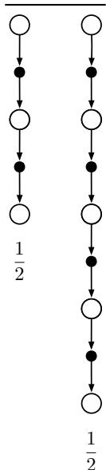

# Chapter 12

# Eligibility Traces

Eligibility traces are one of the basic mechanisms of reinforcement learning. For example, in the popular TD(λ) algorithm, the  \(\lambda\)  refers to the use of an eligibility trace. Almost any temporal- difference (TD) method, such as Q- learning or Sargs, can be combined with eligibility traces to obtain a more general method that may learn more efficiently.

Eligibility traces unify and generalize TD and Monte Carlo methods. When TD methods are augmented with eligibility traces, they produce a family of methods spanning a spectrum that has Monte Carlo methods at one end ( \(\lambda = 1\) ) and one- step TD methods at the other ( \(\lambda = 0\) ). In between are intermediate methods that are often better than either extreme method. Eligibility traces also provide a way of implementing Monte Carlo methods online and on continuing problems without episodes.

Of course, we have already seen one way of unifying TD and Monte Carlo methods: the  \(n\) - step TD methods of Chapter 7. What eligibility traces offer beyond these is an elegant algorithmic mechanism with significant computational advantages. The mechanism is a short- term memory vector, the eligibility trace  \(\mathbf{z}_t \in \mathbb{R}^d\) , that parallels the long- term weight vector  \(\mathbf{w}_t \in \mathbb{R}^d\) . The rough idea is that when a component of  \(\mathbf{w}_t\)  participates in producing an estimated value, then the corresponding component of  \(\mathbf{z}_t\)  is bumped up and then begins to fade away. Learning will then occur in that component of  \(\mathbf{w}_t\)  if a nonzero TD error occurs before the trace falls back to zero. The trace- decay parameter  \(\lambda \in [0,1]\)  determines the rate at which the trace falls.

The primary computational advantage of eligibility traces over  \(n\) - step methods is that only a single trace vector is required rather than a store of the last  \(n\)  feature vectors. Learning also occurs continually and uniformly in time rather than being delayed and then catching up at the end of the episode. In addition learning can occur and affect behavior immediately after a state is encountered rather than being delayed  \(n\)  steps.

Eligibility traces illustrate that a learning algorithm can sometimes be implemented in a different way to obtain computational advantages. Many algorithms are most naturally formulated and understood as an update of a state's value based on events that follow that state over multiple future time steps. For example, Monte Carlo methods (Chapter 5) update a state based on all the future rewards, and  \(n\) - step TD methods (Chapter 7)

update based on the next  \(n\)  rewards and state  \(n\)  steps in the future. Such formulations, based on looking forward from the updated state, are called forward views. Forward views are always somewhat complex to implement because the update depends on later things that are not available at the time. However, as we show in this chapter it is often possible to achieve nearly the same updates—and sometimes exactly the same updates—with an algorithm that uses the current TD error, looking backward to recently visited states using an eligibility trace. These alternate ways of looking at and implementing learning algorithms are called backward views. Backward views, transformations between forward views and backward views, and equivalences between them, date back to the introduction of temporal difference learning but have become much more powerful and sophisticated since 2014. Here we present the basics of the modern view.

As usual, first we fully develop the ideas for state values and prediction, then extend them to action values and control. We develop them first for the on- policy case then extend them to off- policy learning. Our treatment pays special attention to the case of linear function approximation, for which the results with eligibility traces are stronger. All these results apply also to the tabular and state aggregation cases because these are special cases of linear function approximation.

# 12.1 The  \(\lambda\) -return

In Chapter 7 we defined an  \(n\) - step return as the sum of the first  \(n\)  rewards plus the estimated value of the state reached in  \(n\)  steps, each appropriately discounted (7.1). The general form of that equation, for any parameterized function approximator, is

$$
G_{t:t + n} \doteq R_{t + 1} + \gamma R_{t + 2} + \dots + \gamma^{n - 1} R_{t + n} + \gamma^n \hat{v} (S_{t + n}, \mathbf{w}_{t + n - 1}), \quad 0 \leq t \leq T - n, \tag{12.1}
$$

where  \(\hat{v} (s, \mathbf{w})\)  is the approximate value of state  \(s\)  given weight vector  \(\mathbf{w}\)  (Chapter 9), and  \(T\)  is the time of episode termination, if any. We noted in Chapter 7 that each  \(n\) - step return, for  \(n \geq 1\) , is a valid update target for a tabular learning update, just as it is for an approximate SGD learning update such as (9.7).

Now we note that a valid update can be done not just toward any  \(n\) - step return, but toward any average of  \(n\) - step returns for different  \(n\) s. For example, an update can be done toward a target that is half of a two- step return and half of a four- step return:  \(\frac{1}{2} G_{t:t + 2} + \frac{1}{2} G_{t:t + 4}\) . Any set of  \(n\) - step returns can be averaged in this way, even an infinite set, as long as the weights on the component returns are positive and sum to 1. The composite return possesses an error reduction property similar to that of individual  \(n\) - step returns (7.3) and thus can be used to construct updates with guaranteed convergence properties. Averaging produces a substantial new range of algorithms. For example, one could average one- step and infinite- step returns to obtain another way of interrelating TD and Monte Carlo methods. In principle, one could even average experience- based updates with DP updates to get a simple combination of experience- based and model- based methods (cf. Chapter 8).

An update that averages simpler component updates is called a compound update. The backup diagram for a compound update consists of the backup diagrams for each of the component updates with a horizontal line above them and the weighting fractions below.

For example, the compound update for the case mentioned at the start of this section, mixing half of a two- step return and half of a four- step return, has the diagram shown to the right. A compound update can only be done when the longest of its component updates is complete. The update at the right, for example, could only be done at time  \(t + 4\)  for the estimate formed at time  \(t\) . In general one would like to limit the length of the longest component update because of the corresponding delay in the updates.

The  \(\mathrm{TD}(\lambda)\)  algorithm can be understood as one particular way of averaging  \(n\) - step updates. This average contains all the  \(n\) - step updates, each weighted proportionally to  \(\lambda^{n - 1}\)  (where  \(\lambda \in [0,1)\) ), and is normalized by a factor of  \(1 - \lambda\)  to ensure that the weights sum to 1 (Figure 12.1). The resulting update is toward a return, called the  \(\lambda\) - return, defined in its state- based form by

$$
G_{t}^{\lambda} \doteq (1 - \lambda) \sum_{n = 1}^{\infty} \lambda^{n - 1} G_{t:t + n}. \tag{12.2}
$$

Figure 12.2 further illustrates the weighting on the sequence of  \(n\) - step returns in the  \(\lambda\) - return. The one- step return is given the largest weight,  \(1 - \lambda\) ; the two- step return is given the next largest weight,  \((1 - \lambda) \lambda\) ; the three- step return is given the weight  \((1 - \lambda) \lambda^{2}\) ; and so on. The weight fades by  \(\lambda\)  with each additional step. After a terminal state has been reached, all subsequent  \(n\) - step returns are equal to the conventional return,  \(G_{t}\) . If

  
Figure 12.1: The backup diagram for  \(\mathrm{TD}(\lambda)\) . If  \(\lambda = 0\) , then the overall update reduces to its first component, the one-step TD update, whereas if  \(\lambda = 1\) , then the overall update reduces to its last component, the Monte Carlo update.

  
Figure 12.2: Weighting given in the  \(\lambda\) -return to each of the  \(n\) -step returns.

we want, we can separate these post- termination terms from the main sum, yielding

$$
G_{t}^{\lambda} = (1 - \lambda) \sum_{n = 1}^{T - t - 1} \lambda^{n - 1} G_{t:t + n} + \lambda^{T - t - 1} G_{t}, \tag{12.3}
$$

as indicated in the figures. This equation makes it clearer what happens when  \(\lambda = 1\) . In this case the main sum goes to zero, and the remaining term reduces to the conventional return. Thus, for  \(\lambda = 1\) , updating according to the  \(\lambda\) - return is a Monte Carlo algorithm. On the other hand, if  \(\lambda = 0\) , then the  \(\lambda\) - return reduces to  \(G_{t:t + 1}\) , the one- step return. Thus, for  \(\lambda = 0\) , updating according to the  \(\lambda\) - return is a one- step TD method.

Exercise 12.1 Just as the return can be written recursively in terms of the first reward and itself one- step later (3.9), so can the  \(\lambda\) - return. Derive the analogous recursive relationship from (12.2) and (12.1).

Exercise 12.2 The parameter  \(\lambda\)  characterizes how fast the exponential weighting in Figure 12.2 falls off, and thus how far into the future the  \(\lambda\) - return algorithm looks in determining its update. But a rate factor such as  \(\lambda\)  is sometimes an awkward way of characterizing the speed of the decay. For some purposes it is better to specify a time constant, or half- life. What is the equation relating  \(\lambda\)  and the half- life,  \(\tau_{\lambda}\) , the time by which the weighting sequence will have fallen to half of its initial value?

We are now ready to define our first learning algorithm based on the  \(\lambda\) - return: the off- line  \(\lambda\) - return algorithm. As an off- line algorithm, it makes no changes to the weight vector during the episode. Then, at the end of the episode, a whole sequence of off- line updates are made according to our usual semi- gradient rule, using the  \(\lambda\) - return as the target:

$$
\mathbf{w}_{t + 1} \doteq \mathbf{w}_{t} + \alpha \Big[ G_{t}^{\lambda} - \hat{v} (S_{t}, \mathbf{w}_{t}) \Big] \nabla \hat{v} (S_{t}, \mathbf{w}_{t}), \quad t = 0, \ldots , T - 1. \tag{12.4}
$$

The  \(\lambda\) - return gives us an alternative way of moving smoothly between Monte Carlo and one- step TD methods that can be compared with the  \(n\) - step bootstrapping way developed in Chapter 7. There we assessed effectiveness on a 19- state random walk task (Example 7.1, page 144). Figure 12.3 shows the performance of the off- line  \(\lambda\) - return algorithm on this task alongside that of the  \(n\) - step methods (repeated from Figure 7.2). The experiment was just as described earlier except that for the  \(\lambda\) - return algorithm we varied  \(\lambda\)  instead of  \(n\) . The performance measure used is the estimated root- mean- square error between the correct and estimated values of each state measured at the end of the episode, averaged over the first 10 episodes and the 19 states. Note that overall performance of the off- line  \(\lambda\) - return algorithms is comparable to that of the  \(n\) - step algorithms. In both cases we get best performance with an intermediate value of the bootstrapping parameter,  \(n\)  for  \(n\) - step methods and  \(\lambda\)  for the off- line  \(\lambda\) - return algorithm.

  
Figure 12.3: 19-state Random walk results (Example 7.1): Performance of the off-line  \(\lambda\) -return algorithm alongside that of the  \(n\) -step TD methods. In both case, intermediate values of the bootstrapping parameter ( \(\lambda\)  or  \(n\) ) performed best. The results with the off-line  \(\lambda\) -return algorithm are slightly better at the best values of  \(\alpha\)  and  \(\lambda\) , and at high  \(\alpha\) .

The approach that we have been taking so far is what we call the theoretical, or forward, view of a learning algorithm. For each state visited, we look forward in time to all the future rewards and decide how best to combine them. We might imagine ourselves riding the stream of states, looking forward from each state to determine its update, as suggested by Figure 12.4. After looking forward from and updating one state, we move on to the next and never have to work with the preceding state again. Future states, on the other hand, are viewed and processed repeatedly, once from each vantage point preceding them.

  
Figure 12.4: The forward view. We decide how to update each state by looking forward to future rewards and states.

# 12.2  \(\mathbf{TD}(\lambda)\)

\(\mathrm{TD}(\lambda)\)  is one of the oldest and most widely used algorithms in reinforcement learning. It was the first algorithm for which a formal relationship was shown between a more theoretical forward view and a more computationally- congenial backward view using eligibility traces. Here we will show empirically that it approximates the off- line  \(\lambda\) - return algorithm presented in the previous section.

\(\mathrm{TD}(\lambda)\)  improves over the off- line  \(\lambda\) - return algorithm in three ways. First it updates the weight vector on every step of an episode rather than only at the end, and thus its estimates may be better sooner. Second, its computations are equally distributed in time rather than all at the end of the episode. And third, it can be applied to continuing problems rather than just to episodic problems. In this section we present the semi- gradient version of  \(\mathrm{TD}(\lambda)\)  with function approximation.

With function approximation, the eligibility trace is a vector  \(\mathbf{z}_t \in \mathbb{R}^d\)  with the same number of components as the weight vector  \(\mathbf{w}_t\) . Whereas the weight vector is a long- term memory, accumulating over the lifetime of the system, the eligibility trace is a short- term memory, typically lasting less time than the length of an episode. Eligibility traces assist in the learning process; their only consequence is that they affect the weight vector, and then the weight vector determines the estimated value.

In  \(\mathrm{TD}(\lambda)\) , the eligibility trace vector is initialized to zero at the beginning of the episode, is incremented on each time step by the value gradient, and then fades away by  \(\gamma \lambda\) :

$$
\begin{array}{r l} & {\mathbf{z}_{-1}\doteq \mathbf{0},}\\ & {\mathbf{z}_{t} = \gamma \lambda \mathbf{z}_{t - 1} + \nabla v(S_{t},\mathbf{w}_{t}),\quad 0\leq t\leq T,} \end{array} \tag{12.5}
$$

where  \(\gamma\)  is the discount rate and  \(\lambda\)  is the parameter introduced in the previous section, which we henceforth call the trace- decay parameter. The eligibility trace keeps track of which components of the weight vector have contributed, positively or negatively, to recent state valuations, where "recent" is defined in terms of  \(\gamma \lambda\) . (Recall that in linear function approximation,  \(\nabla v(S_t, \mathbf{w}_t)\)  is the feature vector,  \(\mathbf{x}_t\) , in which case the eligibility trace vector is just a sum of past, fading, input vectors.) The trace is said to indicate the eligibility of each component of the weight vector for undergoing learning changes

should a reinforcing event occur. The reinforcing events we are concerned with are the moment- by- moment one- step TD errors. The TD error for state- value prediction is

$$
\delta_{t} \doteq R_{t + 1} + \gamma \hat{v} (S_{t + 1},\mathbf{w}_{t}) - \hat{v} (S_{t},\mathbf{w}_{t}). \tag{12.6}
$$

In  \(\mathrm{TD}(\lambda)\) , the weight vector is updated on each step proportional to the scalar TD error and the vector eligibility trace:

$$
\mathbf{w}_{t + 1} \doteq \mathbf{w}_{t} + \alpha \delta_{t} \mathbf{z}_{t}. \tag{12.7}
$$

# Semi-gradient  \(\mathbf{TD}(\lambda)\)  for estimating  \(\hat{v} \approx v_{\pi}\)

Input: the policy  \(\pi\)  to be evaluated

Input: a differentiable function  \(\hat{v}: \mathbb{S}^{+} \times \mathbb{R}^{d} \to \mathbb{R}\)  such that  \(\hat{v} (\text{terminal}, \cdot) = 0\)

Algorithm parameters: step size  \(\alpha > 0\) , trace decay rate  \(\lambda \in [0, 1]\)

Initialize value- function weights  \(\mathbf{w}\)  arbitrarily (e.g.,  \(\mathbf{w} = \mathbf{0}\) )

Loop for each episode:

Initialize  \(S\)

\(\mathbf{z} \leftarrow \mathbf{0}\)

(a  \(d\) - dimensional vector)

Loop for each step of episode:

Choose  \(A \sim \pi (\cdot | S)\)

Take action  \(A\) , observe  \(R, S'\)

\(\mathbf{z} \leftarrow \gamma \lambda \mathbf{z} + \nabla \hat{v} (S, \mathbf{w})\)

\(\delta \leftarrow R + \gamma \hat{v} (S', \mathbf{w}) - \hat{v} (S, \mathbf{w})\)

\(\mathbf{w} \leftarrow \mathbf{w} + \alpha \delta \mathbf{z}\)

\(S \leftarrow S'\)

until  \(S'\)  is terminal

  
Figure 12.5: The backward or mechanistic view of  \(\mathrm{TD}(\lambda)\) . Each update depends on the current TD error combined with the current eligibility traces of past events.

\(\mathrm{TD}(\lambda)\)  is oriented backward in time. At each moment we look at the current TD error and assign it backward to each prior state according to how much that state contributed to the current eligibility trace at that time. We might imagine ourselves riding along the stream of states, computing TD errors, and shouting them back to the previously visited states, as suggested by Figure 12.5. Where the TD error and traces come together, we get the update given by (12.7), changing the values of those past states for when they occur again in the future.

To better understand the backward view of  \(\mathrm{TD}(\lambda)\) , consider what happens at various values of  \(\lambda\) . If  \(\lambda = 0\) , then by (12.5) the trace at  \(t\)  is exactly the value gradient corresponding to  \(S_{t}\) . Thus the  \(\mathrm{TD}(\lambda)\)  update (12.7) reduces to the one- step semi- gradient TD update treated in Chapter 9 (and, in the tabular case, to the simple TD rule (6.2)). This is why that algorithm was called  \(\mathrm{TD}(0)\) . In terms of Figure 12.5,  \(\mathrm{TD}(0)\)  is the case in which only the one- state preceding the current one is updated by the TD error (other states may have their value estimates changed by generalization due to function approximation). For larger values of  \(\lambda\) , but still  \(\lambda < 1\) , more of the preceding states are updated, but each more temporally distant state is updated less because the corresponding eligibility trace is smaller, as suggested by the figure. We say that the earlier states are given less credit for the TD error.

If  \(\lambda = 1\) , then the credit given to earlier states falls only by  \(\gamma\)  per step. This turns out to be just the right thing to do to achieve Monte Carlo behavior. For example, remember that the TD error,  \(\delta_{t}\) , includes an undiscounted term of  \(R_{t + 1}\) . In passing this back  \(k\)  steps it needs to be discounted, like any reward in a return, by  \(\gamma^{k}\) , which is just what the falling eligibility trace achieves. If  \(\lambda = 1\)  and  \(\gamma = 1\) , then the eligibility traces do not decay at all with time. In this case the method behaves like a Monte Carlo method for an undiscounted, episodic task. If  \(\lambda = 1\) , the algorithm is also known as  \(\mathrm{TD}(1)\) .

\(\mathrm{TD}(1)\)  is a way of implementing Monte Carlo algorithms that is more general than those presented earlier and that significantly increases their range of applicability. Whereas the earlier Monte Carlo methods were limited to episodic tasks,  \(\mathrm{TD}(1)\)  can be applied to discounted continuing tasks as well. Moreover,  \(\mathrm{TD}(1)\)  can be performed incrementally and online. One disadvantage of Monte Carlo methods is that they learn nothing from an episode until it is over. For example, if a Monte Carlo control method takes an action that produces a very poor reward but does not end the episode, then the agent's tendency to repeat the action will be undiminished during the episode. Online  \(\mathrm{TD}(1)\) , on the other hand, learns in an  \(n\) - step TD way from the incomplete ongoing episode, where the  \(n\)  steps are all the way up to the current step. If something unusually good or bad happens during an episode, control methods based on  \(\mathrm{TD}(1)\)  can learn immediately and alter their behavior on that same episode.

It is revealing to revisit the 19- state random walk example (Example 7.1) to see how well  \(\mathrm{TD}(\lambda)\)  does in approximating the off- line  \(\lambda\) - return algorithm. The results for both algorithms are shown in Figure 12.6. For each  \(\lambda\)  value, if  \(\alpha\)  is selected optimally for it (or smaller), then the two algorithms perform virtually identically. If  \(\alpha\)  is chosen larger than is optimal, however, then the  \(\lambda\) - return algorithm is only a little worse whereas  \(\mathrm{TD}(\lambda)\)  is much worse and may even be unstable. This is not catastrophic for  \(\mathrm{TD}(\lambda)\)  on this problem, as these higher parameter values are not what one would want to use anyway, but for other problems it can be a significant weakness.

  
Figure 12.6: 19-state Random walk results (Example 7.1): Performance of  \(\mathrm{TD}(\lambda)\)  alongside that of the off-line  \(\lambda\) -return algorithm. The two algorithms performed virtually identically at low (less than optimal)  \(\alpha\)  values, but  \(\mathrm{TD}(\lambda)\)  was worse at high  \(\alpha\)  values.

Linear  \(\mathrm{TD}(\lambda)\)  has been proved to converge in the on- policy case if the step- size parameter is reduced over time according to the usual conditions (2.7). Just as discussed in Section 9.4, convergence is not to the minimum- error weight vector, but to a nearby weight vector that depends on  \(\lambda\) . The bound on solution quality presented in that section (9.14) can now be generalized to apply for any  \(\lambda\) . For the continuing discounted case,

$$
\overline{\mathrm{VE}} (\mathbf{w}_{\infty}) \leq \frac{1 - \gamma \lambda}{1 - \gamma} \min_{\mathbf{w}} \overline{\mathrm{VE}} (\mathbf{w}). \tag{12.8}
$$

That is, the asymptotic error is no more than  \(\frac{1 - \gamma \lambda}{1 - \gamma}\)  times the smallest possible error. As  \(\lambda\)  approaches 1, the bound approaches the minimum error (and it is loosest at  \(\lambda = 0\) ). In practice, however,  \(\lambda = 1\)  is often the poorest choice, as will be illustrated later in Figure 12.14.

Exercise 12.3 Some insight into how  \(\mathrm{TD}(\lambda)\)  can closely approximate the off- line  \(\lambda\) - return algorithm can be gained by seeing that the latter's error term (in brackets in (12.4)) can be written as the sum of TD errors (12.6) for a single fixed  \(\mathbf{w}\) . Show this, following the pattern of (6.6), and using the recursive relationship for the  \(\lambda\) - return you obtained in Exercise 12.1.

Exercise 12.4 Use your result from the preceding exercise to show that, if the weight updates over an episode were computed on each step but not actually used to change the weights (w remained fixed), then the sum of  \(\mathrm{TD}(\lambda)\) 's weight updates would be the same as the sum of the off- line  \(\lambda\) - return algorithm's updates.

# 12.3  \(n\) -step Truncated  \(\lambda\) -return Methods

The off- line  \(\lambda\) - return algorithm is an important ideal, but it is of limited utility because it uses the  \(\lambda\) - return (12.2), which is not known until the end of the episode. In the

continuing case, the  \(\lambda\) - return is technically never known, as it depends on  \(n\) - step returns for arbitrarily large  \(n\) , and thus on rewards arbitrarily far in the future. However, the dependence becomes weaker for longer- delayed rewards, falling by  \(\gamma \lambda\)  for each step of delay. A natural approximation, then, would be to truncate the sequence after some number of steps. Our existing notion of  \(n\) - step returns provides a natural way to do this in which the missing rewards are replaced with estimated values.In general, we define the truncated  \(\lambda\) - return for time  \(t\) , given data only up to some later horizon,  \(h\) , as

In general, we define the truncated  \(\lambda\)  - return for time  \(t\)  , given data only up to some later horizon,  \(h\)  , as

$$
G_{t:h}^{\lambda} \doteq (1 - \lambda) \sum_{n = 1}^{h - t - 1} \lambda^{n - 1} G_{t:t + n} + \lambda^{h - t - 1} G_{t:h}, \qquad 0 \leq t < h \leq T. \tag{12.9}
$$

If you compare this equation with the  \(\lambda\)  - return (12.3), it is clear that the horizon  \(h\)  is playing the same role as was previously played by  \(T\)  , the time of termination. Whereas in the  \(\lambda\)  - return there is a residual weight given to the conventional return  \(G_{t}\)  , here it is given to the longest available  \(\mathcal{n}\)  - step return,  \(G_{t:h}\)  (Figure 12.2).

The truncated  \(\lambda\)  - return immediately gives rise to a family of  \(n\)  - step  \(\lambda\)  - return algorithms similar to the  \(n\)  - step methods of Chapter 7. In all of these algorithms, updates are delayed by  \(n\)  steps and only take into account the first  \(n\)  rewards, but now all the  \(k\)  - step returns are included for  \(1\leq k\leq n\)  (whereas the earlier  \(n\)  - step algorithms used only the  \(n\)  - step return), weighted geometrically as in Figure 12.2. In the state- value case, this family of algorithms is known as Truncated  \(\operatorname {TD}(\lambda)\)  , or  \(\operatorname {TTD}(\lambda)\)  . The compound backup diagram, shown in Figure 12.7, is similar to that for  \(\operatorname {TD}(\lambda)\)  (Figure 12.1) except that the longest component update is at most  \(n\)  steps rather than always going all the way to the

end of the episode.  \(\mathrm{TTD}(\lambda)\)  is defined by (cf. (9.15)):

$$
\begin{array}{r}{\mathbf{w}_{t + n}\doteq \mathbf{w}_{t + n - 1} + \alpha \left[G_{t:t + n}^{\lambda} - \hat{v} (S_{t},\mathbf{w}_{t + n - 1})\right]\nabla \hat{v} (S_{t},\mathbf{w}_{t + n - 1}),\qquad 0\leq t< T.} \end{array}
$$

This algorithm can be implemented efficiently so that per- step computation does not scale with  \(n\)  (though of course memory must). Much as in  \(n\) - step TD methods, no updates are made on the first  \(n - 1\)  time steps of each episode, and  \(n - 1\)  additional updates are made upon termination. Efficient implementation relies on the fact that the  \(k\) - step  \(\lambda\) - return can be written exactly as

$$
G_{t:t + k}^{\lambda} = \hat{v} (S_{t},\mathbf{w}_{t - 1}) + \sum_{i = t}^{t + k - 1}(\gamma \lambda)^{i - t}\delta_{i}^{\prime}, \tag{12.10}
$$

where

$$
\delta_{t}^{\prime}\doteq R_{t + 1} + \gamma \hat{v} (S_{t + 1},\mathbf{w}_{t}) - \hat{v} (S_{t},\mathbf{w}_{t - 1}).
$$

Exercise 12.5 Several times in this book (often in exercises) we have established that returns can be written as sums of TD errors if the value function is held constant. Why is (12.10) another instance of this? Prove (12.10).

# 12.4 Redoing Updates: Online  \(\lambda\) -return Algorithm

Choosing the truncation parameter  \(n\)  in Truncated  \(\mathrm{TD}(\lambda)\)  involves a tradeoff.  \(n\)  should be large so that the method closely approximates the off- line  \(\lambda\) - return algorithm, but it should also be small so that the updates can be made sooner and can influence behavior sooner. Can we get the best of both? Well, yes, in principle we can, albeit at the cost of computational complexity.

The idea is that, on each time step as you gather a new increment of data, you go back and redo all the updates since the beginning of the current episode. The new updates will be better than the ones you previously made because now they can take into account the time step's new data. That is, the updates are always towards an  \(n\) - step truncated  \(\lambda\) - return target, but they always use the latest horizon. In each pass over that episode you can use a slightly longer horizon and obtain slightly better results. Recall that the truncated  \(\lambda\) - return is defined in (12.9) as

$$
G_{t:h}^{\lambda} \doteq (1 - \lambda)\sum_{n = 1}^{h - t - 1}\lambda^{n - 1}G_{t:t + n} + \lambda^{h - t - 1}G_{t:h}.
$$

Let us step through how this target could ideally be used if computational complexity was not an issue. The episode begins with an estimate at time 0 using the weights  \(\mathbf{w}_{0}\)  from the end of the previous episode. Learning begins when the data horizon is extended to time step 1. The target for the estimate at step 0, given the data up to horizon 1, could only be the one- step return  \(G_{0:1}\) , which includes  \(R_{1}\)  and bootstraps from the estimate  \(\hat{v} (S_{1},\mathbf{w}_{0})\) . Note that this is exactly what  \(G_{0:1}^{\lambda}\)  is, with the sum in the first term of the

equation degenerating to zero. Using this update target, we construct  \(\mathbf{w}_{1}\) . Then, after advancing the data horizon to step 2, what do we do? We have new data in the form of  \(R_{2}\)  and  \(S_{2}\) , as well as the new  \(\mathbf{w}_{1}\) , so now we can construct a better update target  \(G_{0:2}^{\lambda}\)  for the first update from  \(S_{0}\)  as well as a better update target  \(G_{1:2}^{\lambda}\)  for the second update from  \(S_{1}\) . Using these improved targets, we redo the updates at  \(S_{1}\)  and  \(S_{2}\) , starting again from  \(\mathbf{w}_{0}\) , to produce  \(\mathbf{w}_{2}\) . Now we advance the horizon to step 3 and repeat, going all the way back to produce three new targets, redoing all updates starting from the original  \(\mathbf{w}_{0}\)  to produce  \(\mathbf{w}_{3}\) , and so on. Each time the horizon is advanced, all the updates are redone starting from  \(\mathbf{w}_{0}\)  using the weight vector from the preceding horizon.

This conceptual algorithm involves multiple passes over the episode, one at each horizon, each generating a different sequence of weight vectors. To describe it clearly we have to distinguish between the weight vectors computed at the different horizons. Let us use  \(\mathbf{w}_{t}^{h}\)  to denote the weights used to generate the value at time  \(t\)  in the sequence up to horizon  \(h\) . The first weight vector  \(\mathbf{w}_{0}^{h}\)  in each sequence is that inherited from the previous episode (so they are the same for all  \(h\) ), and the last weight vector  \(\mathbf{w}_{h}^{h}\)  in each sequence defines the ultimate weight vector sequence of the algorithm. At the final horizon  \(h = T\)  we obtain the final weights  \(\mathbf{w}_{T}^{T}\)  which will be passed on to form the initial weights of the next episode. With these conventions, the three first sequences described in the previous paragraph can be given explicitly:

$$
h = 1:\quad \mathbf{w}_{1}^{1}\doteq \mathbf{w}_{0}^{1} + \alpha \left[G_{0:1}^{\lambda} - \hat{v} (S_{0},\mathbf{w}_{0}^{1})\right]\nabla \hat{v} (S_{0},\mathbf{w}_{0}^{1}),
$$

$$
\begin{array}{r l}{h = 2:} & {\mathbf{w}_{1}^{2}\doteq \mathbf{w}_{0}^{2} + \alpha \left[G_{0:2}^{\lambda} - \hat{v} (S_{0},\mathbf{w}_{0}^{2})\right]\nabla \hat{v} (S_{0},\mathbf{w}_{0}^{2}),}\\ & {\mathbf{w}_{2}^{2}\doteq \mathbf{w}_{1}^{2} + \alpha \left[G_{1:2}^{\lambda} - \hat{v} (S_{1},\mathbf{w}_{1}^{2})\right]\nabla \hat{v} (S_{1},\mathbf{w}_{1}^{2}),} \end{array}
$$

$$
\begin{array}{r l}{h = 3:} & {\mathbf{w}_{1}^{3}\doteq \mathbf{w}_{0}^{3} + \alpha \left[G_{0:3}^{\lambda} - \hat{v} (S_{0},\mathbf{w}_{0}^{3})\right]\nabla \hat{v} (S_{0},\mathbf{w}_{0}^{3}),}\\ & {\mathbf{w}_{2}^{3}\doteq \mathbf{w}_{1}^{3} + \alpha \left[G_{1:3}^{\lambda} - \hat{v} (S_{1},\mathbf{w}_{1}^{3})\right]\nabla \hat{v} (S_{1},\mathbf{w}_{1}^{3}),}\\ & {\mathbf{w}_{3}^{3}\doteq \mathbf{w}_{2}^{3} + \alpha \left[G_{2:3}^{\lambda} - \hat{v} (S_{2},\mathbf{w}_{2}^{3})\right]\nabla \hat{v} (S_{2},\mathbf{w}_{2}^{3}).} \end{array}
$$

The general form for the update is

$$
\mathbf{w}_{t + 1}^{h}\doteq \mathbf{w}_{t}^{h} + \alpha \left[G_{t:h}^{\lambda} - \hat{v} (S_{t},\mathbf{w}_{t}^{h})\right]\nabla \hat{v} (S_{t},\mathbf{w}_{t}^{h}), 0\leq t< h\leq T.
$$

This update, together with  \(\mathbf{w}_{t}\doteq \mathbf{w}_{t}^{t}\)  defines the online  \(\lambda\) - return algorithm.

The online  \(\lambda\) - return algorithm is fully online, determining a new weight vector  \(\mathbf{w}_{t}\)  at each step  \(t\)  during an episode, using only information available at time  \(t\) . Its main drawback is that it is computationally complex, passing over the portion of the episode experienced so far on every step. Note that it is strictly more complex than the off- line  \(\lambda\) - return algorithm, which passes through all the steps at the time of termination but does not make any updates during the episode. In return, the online algorithm can be expected to perform better than the off- line one, not only during the episode when it makes an update while the off- line algorithm makes none, but also at the end of the episode because the weight vector used in bootstrapping (in  \(G_{t:h}^{\lambda}\) ) has had a larger number of informative

updates. This effect can be seen if one looks carefully at Figure 12.8, which compares the two algorithms on the 19- state random walk task.

  
Figure 12.8: 19-state Random walk results (Example 7.1): Performance of online and off-line  \(\lambda\) -return algorithms. The performance measure here is the  \(\overline{\mathrm{VE}}\)  at the end of the episode, which should be the best case for the off-line algorithm. Nevertheless, the online algorithm performs subtly better. For comparison, the  \(\lambda = 0\)  line is the same for both methods.

# 12.5 True Online  \(\mathbf{TD}(\lambda)\)

The online  \(\lambda\) - return algorithm just presented is currently the best performing temporal- difference algorithm. It is an ideal which online  \(\mathrm{TD}(\lambda)\)  only approximates. As presented, however, the online  \(\lambda\) - return algorithm is very complex. Is there a way to invert this forward- view algorithm to produce an efficient backward- view algorithm using eligibility traces? It turns out that there is indeed an exact computationally congenial implementation of the online  \(\lambda\) - return algorithm for the case of linear function approximation. This implementation is known as the true online  \(\mathrm{TD}(\lambda)\)  algorithm because it is "truer" to the ideal of the online  \(\lambda\) - return algorithm than the  \(\mathrm{TD}(\lambda)\)  algorithm is.

The derivation of true online  \(\mathrm{TD}(\lambda)\)  is a little too complex to present here (see the next section and the appendix to the paper by van Seijen et al., 2016) but its strategy is simple. The sequence of weight vectors produced by the online  \(\lambda\) - return algorithm can be arranged in a triangle:

$$
\begin{array}{l}\mathbf{w}_0^0\\ \mathbf{w}_0^1\\ \mathbf{w}_0^2\\ \mathbf{w}_0^3\\ \vdots \vdots \vdots \vdots \vdots \vdots \vdots \vdots \vdots \vdots \vdots \vdots \vdots \vdots \vdots \vdots \vdots \vdots \vdots \vdots \vdots \vdots \vdots \vdots \vdots \vdots \vdots \vdots \vdots \vdots \vdots \vdots \vdots \vdots \\ \mathbf{w}_0^T\\ \mathbf{w}_1^T\\ \mathbf{w}_2^T\\ \vdots \vdots \vdots \vdots \vdots \vdots \vdots \vdots \vdots \vdots \vdots \vdots \vdots \vdots \vdots \vdots \vdots \vdots \vdots \vdots \vdots \vdots \vdots \vdots \vdots \vdots \vdots \vdots \vdots \vdots \vdots \vdots \vdash \vdots \vdots \vdots \vdots \vdots \vdots \vdots \vdots \vdots \vdots \vdots \vdots \vdots \vdots \vdots \vdots \vdots \vdots \vdots \vdots \vdots \vdots \vdots \vdots \vdots \vdots \vdots \vdots \vdots \vdots \vdots \vdots \vdots}\\ \mathbf{w}_0^T\\ \mathbf{w}_1^T\\ \mathbf{w}_2^T\\ \vdots \vdots \vdots \vdots \vdots \vdots \vdots \vdots \vdots \vdots \vdots \vdots \vdots \vdots \vdots \vdots \vdots \vdots \vdots \vdots \vdots \vdots \vdots \\ \mathbf{w}_0^T \end{array}
$$

One row of this triangle is produced on each time step. It turns out that the weight vectors on the diagonal, the  \(\mathbf{w}_t^t\) , are the only ones really needed. The first,  \(\mathbf{w}_0^0\) , is the initial weight

vector of the episode, the last,  \(\mathbf{w}_{T}^{T}\) , is the final weight vector, and each weight vector along the way,  \(\mathbf{w}_{t}^{t}\) , plays a role in bootstrapping in the  \(n\) - step returns of the updates. In the final algorithm the diagonal weight vectors are renamed without a superscript,  \(\mathbf{w}_{t} = \mathbf{w}_{t}^{t}\) . The strategy then is to find a compact, efficient way of computing each  \(\mathbf{w}_{t}^{t}\)  from the one before. If this is done, for the linear case in which  \(\hat{v} (s,\mathbf{w}) = \mathbf{w}^{\top}\mathbf{x}(s)\) , then we arrive at the true online  \(\mathrm{TD}(\lambda)\)  algorithm:

$$
\mathbf{w}_{t + 1}\doteq \mathbf{w}_{t} + \alpha \delta_{t}\mathbf{z}_{t} + \alpha \left(\mathbf{w}_{t}^{\top}\mathbf{x}_{t} - \mathbf{w}_{t - 1}^{\top}\mathbf{x}_{t}\right)(\mathbf{z}_{t} - \mathbf{x}_{t}),
$$

where we have used the shorthand  \(\mathbf{x}_{t}\doteq \mathbf{x}(S_{t})\) ,  \(\delta_{t}\)  is defined as in  \(\mathrm{TD}(\lambda)\)  (12.6), and  \(\mathbf{z}_{t}\)  is defined by

$$
\mathbf{z}_{t}\doteq \gamma \lambda \mathbf{z}_{t - 1} + \left(1 - \alpha \gamma \lambda \mathbf{z}_{t - 1}^{\top}\mathbf{x}_{t}\right)\mathbf{x}_{t}. \tag{12.11}
$$

This algorithm has been proven to produce exactly the same sequence of weight vectors,  \(\mathbf{w}_{t}\) ,  \(0\leq t\leq T\) , as the online  \(\lambda\) - return algorithm (van Seijen et al. 2016). Thus the results on the random walk task on the left of Figure 12.8 are also its results on that task. Now, however, the algorithm is much less expensive. The memory requirements of true online  \(\mathrm{TD}(\lambda)\)  are identical to those of conventional  \(\mathrm{TD}(\lambda)\) , while the per- step computation is increased by about  \(50\%\)  (there is one more inner product in the eligibility- trace update). Overall, the per- step computational complexity remains of  \(O(d)\) , the same as  \(\mathrm{TD}(\lambda)\) . Pseudocode for the complete algorithm is given in the box.

# True online  \(\mathrm{TD}(\lambda)\)  for estimating  \(\mathbf{w}^{\top}\mathbf{x}\approx v_{\pi}\)

Input: the policy  \(\pi\)  to be evaluated  Input: a feature function  \(\mathbf{x}:\mathbb{S}^{+}\to \mathbb{R}^{d}\)  such that  \(\mathbf{x}(t e r m i n a l,\cdot) = \mathbf{0}\)   Algorithm parameters: step size  \(\alpha >0\) , trace decay rate  \(\lambda \in [0,1]\)   Initialize value- function weights  \(\mathbf{w}\in \mathbb{R}^{d}\)  (e.g.,  \(\mathbf{w} = \mathbf{0}\) )

Loop for each episode:

Initialize state and obtain initial feature vector  \(\mathbf{x}\)

\(\mathbf{z}\gets \mathbf{0}\)

\(V_{old}\gets 0\)

Loop for each step of episode:

Choose  \(A\sim \pi\)

Take action  \(A\) , observe  \(R\) ,  \(\mathbf{x}^{\prime}\)  (feature vector of the next state)

\(V\gets \mathbf{w}^{\top}\mathbf{x}\)

\(V^{\prime}\gets \mathbf{w}^{\top}\mathbf{x}^{\prime}\)

\(\delta \gets R + \gamma V^{\prime} - V\)

\(\mathbf{z}\gets \gamma \lambda \mathbf{z} + \left(1 - \alpha \gamma \lambda \mathbf{z}^{\top}\mathbf{x}\right)\mathbf{x}\)

\(\mathbf{w}\gets \mathbf{w} + \alpha (\delta +V - V_{old})\mathbf{z} - \alpha (V - V_{old})\mathbf{x}\)

\(V_{old}\gets V^{\prime}\)

\(\mathbf{x}\gets \mathbf{x}^{\prime}\)

until  \(\mathbf{x}^{\prime} = \mathbf{0}\)  (signaling arrival at a terminal state)

The eligibility trace (12.11) used in true online  \(\mathrm{TD}(\lambda)\)  is called a dutch trace to distinguish it from the trace (12.5) used in  \(\mathrm{TD}(\lambda)\) , which is called an accumulating trace.

Earlier work often used a third kind of trace called the replacing trace, defined only for the tabular case or for binary feature vectors such as those produced by tile coding. The replacing trace is defined on a component- by- component basis depending on whether the component of the feature vector was 1 or 0:

$$
z_{i,t}\doteq \left\{ \begin{array}{l l}{1\qquad} & {\mathrm{if~}x_{i,t} = 1}\\ {\gamma \lambda z_{i,t - 1}\quad \mathrm{otherwise}.} \end{array} \right. \tag{12.12}
$$

Nowadays, we see replacing traces as crude approximations to dutch traces, which largely supersede them. Dutch traces usually perform better than replacing traces and have a clearer theoretical basis. Accumulating traces remain of interest for nonlinear function approximations where dutch traces are not available.

# 12.6 \*Dutch Traces in Monte Carlo Learning

Although eligibility traces are closely associated historically with TD learning, in fact they have nothing to do with it. In fact, eligibility traces arise even in Monte Carlo learning, as we show in this section. We show that the linear MC algorithm (Chapter 9), taken as a forward view, can be used to derive an equivalent yet computationally cheaper backward- view algorithm using dutch traces. This is the only equivalence of forward- and backward- views that we explicitly demonstrate in this book. It gives some of the flavor of the proof of equivalence of true online TD(  \(\lambda\)  ) and the online  \(\lambda\)  - return algorithm, but is much simpler.

The linear version of the gradient Monte Carlo prediction algorithm (page 202) makes the following sequence of updates, one for each time step of the episode:

$$
\mathbf{w}_{t + 1}\doteq \mathbf{w}_{t} + \alpha \left[G - \mathbf{w}_{t}^{\top}\mathbf{x}_{t}\right]\mathbf{x}_{t},\quad 0\leq t< T. \tag{12.13}
$$

To simplify the example, we assume here that the return  \(G\)  is a single reward received at the end of the episode (this is why  \(G\)  is not subscripted by time) and that there is no discounting. In this case the update is also known as the Least Mean Square (LMS) rule. As a Monte Carlo algorithm, all the updates depend on the final reward/return, so none can be made until the end of the episode. The MC algorithm is an off- line algorithm and we do not seek to improve this aspect of it. Rather we seek merely an implementation of this algorithm with computational advantages. We will still update the weight vector only at the end of the episode, but we will do some computation during each step of the episode and less at its end. This will give a more equal distribution of computation— \(O(d)\)  per step—and also remove the need to store the feature vectors at each step for use later at the end of each episode. Instead, we will introduce an additional vector memory, the eligibility trace, keeping in it a summary of all the feature vectors seen so far. This will be sufficient to efficiently recreate exactly the same overall update as the sequence of MC

updates (12.13), by the end of the episode:

$$
\begin{array}{rl} & {\mathbf{w}_T = \mathbf{w}_{T - 1} + \alpha \left(G - \mathbf{w}_{T - 1}^\top \mathbf{x}_{T - 1}\right)\mathbf{x}_{T - 1}}\\ & {\quad = \mathbf{w}_{T - 1} + \alpha \mathbf{x}_{T - 1}\left(-\mathbf{x}_{T - 1}^\top \mathbf{w}_{T - 1}\right) + \alpha G\mathbf{x}_{T - 1}}\\ & {\quad = \left(\mathbf{I} - \alpha \mathbf{x}_{T - 1}\mathbf{x}_{T - 1}^\top\right)\mathbf{w}_{T - 1} + \alpha G\mathbf{x}_{T - 1}}\\ & {\quad = \mathbf{F}_{T - 1}\mathbf{w}_{T - 1} + \alpha G\mathbf{x}_{T - 1}} \end{array}
$$

where  \(\mathbf{F}_t \doteq \mathbf{I} - \alpha \mathbf{x}_t \mathbf{x}_t^\top\)  is a forgetting, or fading, matrix. Now, recursing,

$$
\begin{array}{r l} & {= \mathbf{F}_{T - 1}\left(\mathbf{F}_{T - 2}\mathbf{w}_{T - 2} + \alpha G\mathbf{x}_{T - 2}\right) + \alpha G\mathbf{x}_{T - 1}}\\ & {= \mathbf{F}_{T - 1}\mathbf{F}_{T - 2}\mathbf{w}_{T - 2} + \alpha G\left(\mathbf{F}_{T - 1}\mathbf{x}_{T - 2} + \mathbf{x}_{T - 1}\right)}\\ & {= \mathbf{F}_{T - 1}\mathbf{F}_{T - 2}\left(\mathbf{F}_{T - 3}\mathbf{w}_{T - 3} + \alpha G\mathbf{x}_{T - 3}\right) + \alpha G\left(\mathbf{F}_{T - 1}\mathbf{x}_{T - 2} + \mathbf{x}_{T - 1}\right)}\\ & {= \mathbf{F}_{T - 1}\mathbf{F}_{T - 2}\mathbf{F}_{T - 3}\mathbf{w}_{T - 3} + \alpha G\left(\mathbf{F}_{T - 1}\mathbf{F}_{T - 2}\mathbf{x}_{T - 3} + \mathbf{F}_{T - 1}\mathbf{x}_{T - 2} + \mathbf{x}_{T - 1}\right)} \end{array}
$$

$$
\begin{array}{l l l}{{}}&{{=\underbrace{{\bf F}_{T-1}{\bf F}_{T-2}\cdots{\bf F}_{0}{\bf w}_{0}}_{\bf a_{T-1}}+}}&{{\alpha G\underbrace{{\bf\sum}_{k=0}^{T-1}{\bf F}_{T-1}{\bf F}_{T-2}\cdots{\bf F}_{k+1}{\bf x}_{k}}_{\bf z_{T-1}}}}\\ {{}}&{{}}&{{}}\\ {{}}&{{={\bf a}_{T-1}+\alpha G{\bf z}_{T-1},}}\end{array} \tag{12.14}
$$

where  \(\mathbf{a}_{T - 1}\)  and  \(\mathbf{z}_{T - 1}\)  are the values at time  \(T - 1\)  of two auxiliary memory vectors that can be updated incrementally without knowledge of  \(G\)  and with  \(O(d)\)  complexity per time step. The  \(\mathbf{z}_t\)  vector is in fact a dutch- style eligibility trace. It is initialized to  \(\mathbf{z}_0 = \mathbf{x}_0\)  and then updated according to

$$
\begin{array}{r l} & {\mathbf{z}_{t}\doteq \sum_{k = 0}^{t}\mathbf{F}_{t}\mathbf{F}_{t - 1}\cdot \cdot \cdot \mathbf{F}_{k + 1}\mathbf{x}_{k},\qquad 1\leq t< T}\\ & {\quad = \sum_{k = 0}^{t - 1}\mathbf{F}_{t}\mathbf{F}_{t - 1}\cdot \cdot \cdot \mathbf{F}_{k + 1}\mathbf{x}_{k} + \mathbf{x}_{t}}\\ & {\quad = \mathbf{F}_{t}\sum_{k = 0}^{t - 1}\mathbf{F}_{t - 1}\mathbf{F}_{t - 2}\cdot \cdot \cdot \mathbf{F}_{k + 1}\mathbf{x}_{k} + \mathbf{x}_{t}}\\ & {\quad = \mathbf{F}_{t}\mathbf{z}_{t - 1} + \mathbf{x}_{t}}\\ & {\quad = \left(\mathbf{I} - \alpha \mathbf{x}_{t}\mathbf{x}_{t}^{\top}\right)\mathbf{z}_{t - 1} + \mathbf{x}_{t}}\\ & {\quad = \mathbf{z}_{t - 1} - \alpha \mathbf{x}_{t}\mathbf{x}_{t}^{\top}\mathbf{z}_{t - 1} + \mathbf{x}_{t}}\\ & {\quad = \mathbf{z}_{t - 1} - \alpha \left(\mathbf{z}_{t - 1}^{\top}\mathbf{x}_{t}\right)\mathbf{x}_{t} + \mathbf{x}_{t}}\\ & {\quad = \mathbf{z}_{t - 1} + \left(1 - \alpha \mathbf{z}_{t - 1}^{\top}\mathbf{x}_{t}\right)\mathbf{x}_{t},} \end{array}
$$

which is the dutch trace for the case of  \(\gamma \lambda = 1\)  (cf. Eq. 12.11). The  \(\mathbf{a}_t\)  auxiliary vector is initialized to  \(\mathbf{a}_0 = \mathbf{w}_0\)  and then updated according to

$$
\mathbf{a}_t \doteq \mathbf{F}_t \mathbf{F}_{t - 1} \dots \mathbf{F}_0 \mathbf{w}_0 = \mathbf{F}_t \mathbf{a}_{t - 1} = \mathbf{a}_{t - 1} - \alpha \mathbf{x}_t \mathbf{x}_t^\top \mathbf{a}_{t - 1}, \quad 1 \leq t < T.
$$

The auxiliary vectors,  \(\mathbf{a}_{t}\)  and  \(\mathbf{z}_{t}\) , are updated on each time step  \(t < T\)  and then, at time  \(T\)  when  \(G\)  is observed, they are used in (12.14) to compute  \(\mathbf{w}_{t}\) . In this way we achieve exactly the same final result as the MC/LMS algorithm that has poor computational properties (12.13), but now with an incremental algorithm whose time and memory complexity per step is  \(O(d)\) . This is surprising and intriguing because the notion of an eligibility trace (and the dutch trace in particular) has arisen in a setting without temporal- difference (TD) learning (in contrast to van Seijen and Sutton, 2014). It seems eligibility traces are not specific to TD learning at all; they are more fundamental than that. The need for eligibility traces seems to arise whenever one tries to learn long- term predictions in an efficient manner.

# 12.7 Sarsa  \((\lambda)\)

Very few changes in the ideas already presented in this chapter are required in order to extend eligibility- traces to action- value methods. To learn approximate action values,  \(\hat{q} (s, a, \mathbf{w})\) , rather than approximate state values,  \(\hat{v} (s, \mathbf{w})\) , we need to use the action- value form of the  \(n\) - step return, from Chapter 10:

$$
G_{t:t + n} \doteq R_{t + 1} + \dots + \gamma^{n - 1} R_{t + n} + \gamma^n \hat{q} (S_{t + n}, A_{t + n}, \mathbf{w}_{t + n - 1}), \qquad t + n < T,
$$

with  \(G_{t:t + n} \doteq G_t\)  if  \(t + n \geq T\) . Using this, we can form the action- value form of the  \(\lambda\) - return, which is otherwise identical to the state- value form (12.3). The action- value form of the off- line  \(\lambda\) - return algorithm (12.4) simply uses  \(\hat{q}\)  rather than  \(\hat{v}\) :

$$
\mathbf{w}_{t + 1} \doteq \mathbf{w}_t + \alpha \Big[ G_t^\lambda - \hat{q} (S_t, A_t, \mathbf{w}_t) \Big] \nabla \hat{q} (S_t, A_t, \mathbf{w}_t), \quad t = 0, \ldots , T - 1, \tag{12.15}
$$

where  \(G_{t}^{\lambda} \doteq G_{t:\infty}^{\lambda}\) . The compound backup diagram for this forward view is shown in Figure 12.9. Notice the similarity to the diagram of the  \(\operatorname {TD}(\lambda)\)  algorithm (Figure 12.1). The first update looks ahead one full step, to the next state- action pair, the second looks ahead two steps, to the second state- action pair, and so on. A final update is based on the complete return. The weighting of each  \(n\) - step update in the  \(\lambda\) - return is just as in  \(\operatorname {TD}(\lambda)\)  and the  \(\lambda\) - return algorithm (12.3).

The temporal- difference method for action values, known as Sarsa  \((\lambda)\) , approximates this forward view. It has the same update rule as given earlier for  \(\operatorname {TD}(\lambda)\) :

$$
\mathbf{w}_{t + 1} \doteq \mathbf{w}_t + \alpha \delta_t \mathbf{z}_t,
$$

except, naturally, using the action- value form of the TD error:

$$
\delta_t \doteq R_{t + 1} + \gamma \hat{q} (S_{t + 1}, A_{t + 1}, \mathbf{w}_t) - \hat{q} (S_t, A_t, \mathbf{w}_t), \tag{12.16}
$$

and the action- value form of the eligibility trace:

$$
\begin{array}{r l} & {\mathbf{z}_{-1}\doteq \mathbf{0},}\\ & {\mathbf{z}_{t}\doteq \gamma \lambda \mathbf{z}_{t - 1} + \nabla \hat{q} (S_{t},A_{t},\mathbf{w}_{t}),\quad 0\leq t\leq T.} \end{array}
$$

  
Figure 12.9: Sarsa( \(\lambda\) )s backup diagram. Compare with Figure 12.1.

Complete pseudocode for Sarsa( \(\lambda\) ) with linear function approximation, binary features, and either accumulating or replacing traces is given in the box on the next page. This pseudocode highlights a few optimizations possible in the special case of binary features (features are either active (=1) or inactive (=0)).

Example 12.1: Traces in Gridworld The use of eligibility traces can substantially increase the efficiency of control algorithms over one- step methods and even over  \(n\) - step methods. The reason for this is illustrated by the gridworld example below.

The first panel shows the path taken by an agent in a single episode. The initial estimated values were zero, and all rewards were zero except for a positive reward at the goal location marked by  \(\mathsf{G}\) . The arrows in the other panels show, for various algorithms, which action- values would be increased, and by how much, upon reaching the goal. A one- step method would increment only the last action value, whereas an  \(n\) - step method would equally increment the last  \(n\)  actions' values (assuming  \(\gamma = 1\) ), and an eligibility trace method would update all the action values up to the beginning of the episode, to different degrees, fading with recency. The fading strategy is often the best.

# Sarsa  \((\lambda)\)  with binary features and linear function approximation for estimating  \(\mathbf{w}\times \mathbf{s}\approx q_{\pi}\)  or  \(q_{*}\)

Input: a function  \(\mathcal{F}(s,a)\)  returning the set of (indices of) active features for  \(s,a\)  Input: a policy  \(\pi\)

Algorithm parameters: step size  \(\alpha >0\)  , trace decay rate  \(\lambda \in [0,1]\)  , small  \(\epsilon >0\)  Initialize:  \(\mathbf{w} = (w_{1},\ldots ,w_{d})^{\top}\in \mathbb{R}^{d}\)  (e.g.,  \(\mathbf{w} = \mathbf{0}\)  ),  \(\mathbf{z} = (z_{1},\ldots ,z_{d})^{\top}\in \mathbb{R}^{d}\)

Loop for each episode:

Initialize  \(S\)

Choose  \(A\sim \pi (\cdot |S)\)  or  \(\epsilon\)  - greedy according to  \(\hat{q} (S,\cdot ,\mathbf{w})\)

\(\mathbf{z}\gets \mathbf{0}\)

Loop for each step of episode:

Take action  \(A\)  , observe  \(R,S^{\prime}\)

\(\delta \gets R\)

Loop for  \(i\)  in  \(\mathcal{F}(S,A)\)

\(\delta \gets \delta - w_{i}\)

\(z_{i}\gets z_{i} + 1\)

or  \(z_{i}\gets 1\)

(accumulating traces)

(replacing traces)

If  \(S^{\prime}\)  is terminal then:

\(\mathbf{w}\gets \mathbf{w} + \alpha \delta \mathbf{z}\)

Go to next episode

Choose  \(A\sim \pi (\cdot |S^{\prime})\)  or  \(\epsilon\)  - greedy according to  \(\hat{q} (S^{\prime},\cdot ,\mathbf{w})\)

Loop for  \(i\)  in  \(\mathcal{F}(S^{\prime},A^{\prime})\)  ..  \(\delta \gets \delta +\gamma w_{i}\)

\(\mathbf{w}\gets \mathbf{w} + \alpha \delta \mathbf{z}\)

\(\mathbf{z}\gets \gamma \lambda \mathbf{z}\)

\(S\gets S^{\prime};A\gets A^{\prime}\)

Exercise 12.6 Modify the pseudocode for Sarsa  \((\lambda)\)  to use dutch traces (12.11) without the other distinctive features of a true online algorithm. Assume linear function approximation and binary features.

Example 12.2: Sarsa  \((\lambda)\)  on Mountain Car Figure 12.10 (left) on the next page shows results with Sarsa  \((\lambda)\)  on the Mountain Car task introduced in Example 10.1. The function approximation, action selection, and environmental details were exactly as in Chapter 10, and thus it is appropriate to numerically compare these results with the Chapter 10 results for  \(n\)  - step Sarsa (right side of the figure). The earlier results varied the update length  \(n\)  whereas here for Sarsa  \((\lambda)\)  we vary the trace parameter  \(\lambda\)  , which plays a similar role. The fading- trace bootstrapping strategy of Sarsa  \((\lambda)\)  appears to result in more efficient learning on this problem.

There is also an action- value version of our ideal TD method, the online  \(\lambda\)  - return algorithm (Section 12.4) and its efficient implementation as true online  \(\mathrm{TD}(\lambda)\)  (Section 12.5). Everything in Section 12.4 goes through without change other than to use the action- value form of the  \(n\)  - step return given at the beginning of the current section. The analyses in Sections 12.5 and 12.6 also carry through for action values, the only change being the use

  
Figure 12.10: Early performance on the Mountain Car task of Sarsa( \(\lambda\) ) with replacing traces and  \(n\) -step Sarsa (copied from Figure 10.4) as a function of the step size,  \(\alpha\) .

of state- action feature vectors  \(\mathbf{x}_t = \mathbf{x}(S_t, A_t)\)  instead of state feature vectors  \(\mathbf{x}_t = \mathbf{x}(S_t)\) . Pseudocode for the resulting efficient algorithm, called true online Sarsa( \(\lambda\) ) is given in the box on the next page. The figure below compares the performance of various versions of Sarsa( \(\lambda\) ) on the Mountain Car example.

  
Figure 12.11: Summary comparison of Sarsa( \(\lambda\) ) algorithms on the Mountain Car task. True online Sarsa( \(\lambda\) ) performed better than regular Sarsa( \(\lambda\) ) with both accumulating and replacing traces. Also included is a version of Sarsa( \(\lambda\) ) with replacing traces in which, on each time step, the traces for the state and the actions not selected were set to zero.

# True online Sarsa() for estimating  \(\mathbf{w}^{\top}\mathbf{x} \approx q_{\pi}\)  or  \(q_{\epsilon}\)

Input: a feature function  \(\mathbf{x}: \mathcal{S}^{+} \times \mathcal{A} \rightarrow \mathbb{R}^{d}\)  such that  \(\mathbf{x}(terminal, \cdot) = \mathbf{0}\)

Input: a policy  \(\pi\)  (if estimating  \(q_{\pi}\)

Algorithm parameters: step size  \(\alpha > 0\) , trace decay rate  \(\lambda \in [0,1]\) , small  \(\epsilon > 0\)

Initialize:  \(\mathbf{w} \in \mathbb{R}^{d}\)  (e.g.,  \(\mathbf{w} = \mathbf{0}\) )

Loop for each episode:

Initialize  \(S\)

Choose  \(A \sim \pi (\cdot |S)\)  or  \(\epsilon\) - greedy according to  \(\hat{q} (S, \cdot , \mathbf{w})\)

\(\mathbf{x} \leftarrow \mathbf{x}(S, A)\)

\(\mathbf{z} \leftarrow \mathbf{0}\)

\(Q_{old} \leftarrow 0\)

Loop for each step of episode:

Take action  \(A\) , observe  \(R\) ,  \(S^{\prime}\)

Choose  \(A \sim \pi (\cdot |S^{\prime})\)  or  \(\epsilon\) - greedy according to  \(\hat{q} (S^{\prime}, \cdot , \mathbf{w})\)

\(\mathbf{x}^{\prime} \leftarrow \mathbf{x}(S^{\prime}, A^{\prime})\)

\(Q \leftarrow \mathbf{w}^{\top} \mathbf{x}^{\prime}\)

\(Q^{\prime} \leftarrow \mathbf{w}^{\top} \mathbf{x}^{\prime}\)

\(\delta \leftarrow R + \gamma Q^{\prime} - Q\)

\(\mathbf{z} \leftarrow \gamma \lambda \mathbf{z} + \left(1 - \alpha \gamma \lambda \mathbf{z}^{\top} \mathbf{x}\right) \mathbf{x}\)

\(\mathbf{w} \leftarrow \mathbf{w} + \alpha (\delta + Q - Q_{old}) \mathbf{z} - \alpha (Q - Q_{old}) \mathbf{x}\)

\(Q_{old} \leftarrow Q^{\prime}\)

\(\mathbf{x} \leftarrow \mathbf{x}^{\prime}\)

\(A \leftarrow A^{\prime}\)

until  \(S^{\prime}\)  is terminal

Finally, there is also a truncated version of Sarsa() called forward Sarsa() (van Seijen, 2016), which appears to be a particularly effective model- free control method for use in conjunction with multi- layer artificial neural networks.

# 12.8 Variable  \(\lambda\)  and  \(\gamma\)

We are starting now to reach the end of our development of fundamental TD learning algorithms. To present the final algorithms in their most general forms, it is useful to generalize the degree of bootstrapping and discounting beyond constant parameters to functions potentially dependent on the state and action. That is, each time step will have a different  \(\lambda\)  and  \(\gamma\) , denoted  \(\lambda_{t}\)  and  \(\gamma_{t}\) . We change notation now so that  \(\lambda : \mathcal{S} \times \mathcal{A} \rightarrow [0,1]\)  is now a function from states and actions to the unit interval such that  \(\lambda_{t} \doteq \lambda (S_{t}, A_{t})\) , and similarly,  \(\gamma : \mathcal{S} \rightarrow [0,1]\)  is a function from states to the unit interval such that  \(\gamma_{t} \doteq \gamma (S_{t})\) .

Introducing the function  \(\gamma\) , the termination function, is particularly significant because it changes the return, the fundamental random variable whose expectation we seek to

estimate. Now the return is defined more generally as

$$
\begin{array}{l}{{G_{t}\doteq R_{t+1}+\gamma_{t+1}G_{t+1}}}\\ {{\quad=R_{t+1}+\gamma_{t+1}R_{t+2}+\gamma_{t+1}\gamma_{t+2}R_{t+3}+\gamma_{t+1}\gamma_{t+2}\gamma_{t+3}R_{t+4}+\cdots}}\\ {{\quad=\sum_{k=t}^{\infty}\left(\prod_{i=t+1}^{k}\gamma_{i}\right)R_{k+1},}}\end{array} \tag{12.17}
$$

where, to assure the sums are finite, we require that  \(\textstyle \prod_{k = t}^{\infty}\gamma_{k} = 0\)  with probability one for all  \(t\)  . One convenient aspect of this definition is that it enables the episodic setting and its algorithms to be presented in terms of a single stream of experience, without special terminal states, start distributions, or termination times. An erstwhile terminal state becomes a state at which  \(\gamma (s) = 0\)  and which transitions to the start distribution. In that way (and by choosing  \(\gamma (\cdot)\)  as a constant in all other states) we can recover the classical episodic setting as a special case. State dependent termination includes other prediction cases such as pseudo termination, in which we seek to predict a quantity without altering the flow of the Markov process. Discounted returns can be thought of as such a quantity, in which case state- dependent termination unifies the episodic and discounted- continuing cases. (The undiscounted- continuing case still needs some special treatment.)

The generalization to variable bootstrapping is not a change in the problem, like discounting, but a change in the solution strategy. The generalization affects the  \(\lambda\)  returns for states and actions. The new state- based  \(\lambda\)  - return can be written recursively as

$$
G_{t}^{\lambda s}\doteq R_{t + 1} + \gamma_{t + 1}\left((1 - \lambda_{t + 1})\hat{v} (S_{t + 1},\mathbf{w}_{t}) + \lambda_{t + 1}G_{t + 1}^{\lambda s}\right), \tag{12.18}
$$

where now we have added the "  \(s\)  " to the superscript  \(\lambda\)  to remind us that this is a return that bootstraps from state values, distinguishing it from returns that bootstrap from action values, which we present below with "  \(a\)  " in the superscript. This equation says that the  \(\lambda\)  - return is the first reward, undiscounted and unaffected by bootstrapping, plus possibly a second term to the extent that we are not discounting at the next state (that is, according to  \(\gamma_{t + 1}\)  ; recall that this is zero if the next state is terminal). To the extent that we aren't terminating at the next state, we have a second term which is itself divided into two cases depending on the degree of bootstrapping in the state. To the extent we are bootstrapping, this term is the estimated value at the state, whereas, to the extent that we are not bootstrapping, the term is the  \(\lambda\)  - return for the next time step. The action- based  \(\lambda\)  - return is either the Sarsa form

$$
G_{t}^{\lambda a}\doteq R_{t + 1} + \gamma_{t + 1}\Big((1 - \lambda_{t + 1})\hat{q} (S_{t + 1},A_{t + 1},\mathbf{w}_{t}) + \lambda_{t + 1}G_{t + 1}^{\lambda a}\Big), \tag{12.19}
$$

or the Expected Sarsa form,

$$
G_{t}^{\lambda a}\doteq R_{t + 1} + \gamma_{t + 1}\Big((1 - \lambda_{t + 1})\bar{V}_{t}(S_{t + 1}) + \lambda_{t + 1}G_{t + 1}^{\lambda a}\Big), \tag{12.20}
$$

where (7.8) is generalized to function approximation as

$$
\bar{V}_{t}(s)\doteq \sum_{a}\pi (a|s)\hat{q} (s,a,\mathbf{w}_{t}). \tag{12.21}
$$

Exercise 12.7 Generalize the three recursive equations above to their truncated versions, defining  \(G_{t:h}^{\lambda s}\)  and  \(G_{t:h}^{\lambda g}\) .  \(\square\)

# 12.9 Off-policy Traces with Control Variates

The final step is to incorporate importance sampling. For methods using non- truncated  \(\lambda\) - returns, there is not a practical option in which the importance- sampling weighting is applied to the target return (as there is for  \(n\) - step methods as explained in Section 7.3). Instead, we move directly to the bootstrapping generalization of per- decision importance sampling with control variates (Section 7.4).

In the state case, our final definition of the  \(\lambda\) - return generalizes (12.18), after the model of (7.13), to

$$
G_{t}^{\lambda s}\doteq \rho_{t}\Big(R_{t + 1} + \gamma_{t + 1}\big((1 - \lambda_{t + 1})\hat{v} (S_{t + 1},\mathbf{w}_{t}) + \lambda_{t + 1}G_{t + 1}^{\lambda s}\big)\Big) + (1 - \rho_{t})\hat{v} (S_{t},\mathbf{w}_{t}), \tag{12.22}
$$

where  \(\rho_{t} = \frac{\pi(A_{t}|S_{t})}{b(A_{t}|S_{t})}\)  is the usual single- step importance sampling ratio. Much like the other returns we have seen in this book, this final  \(\lambda\) - return can be approximated simply in terms of sums of the state- based TD error,

$$
\delta_{t}^{s}\doteq R_{t + 1} + \gamma_{t + 1}\hat{v} (S_{t + 1},\mathbf{w}_{t}) - \hat{v} (S_{t},\mathbf{w}_{t}), \tag{12.23}
$$

as

$$
G_{t}^{\lambda s}\approx \hat{v} (S_{t},\mathbf{w}_{t}) + \rho_{t}\sum_{k = t}^{\infty}\delta_{k}^{s}\prod_{i = t + 1}^{k}\gamma_{i}\lambda_{i}\rho_{i}, \tag{12.24}
$$

with the approximation becoming exact if the approximate value function does not change.

Exercise 12.8 Prove that (12.24) becomes exact if the value function does not change. To save writing, consider the case of  \(t = 0\) , and use the notation  \(V_{k}\doteq \hat{v} (S_{k},\mathbf{w})\) .  \(\square\)

Exercise 12.9 The truncated version of the general off- policy return is denoted  \(G_{t:h}^{\lambda s}\) . Guess the correct equation, based on (12.24).  \(\square\)

The above form of the  \(\lambda\) - return (12.24) is convenient to use in a forward- view update,

$$
\begin{array}{r l} & {{\bf w}_{t + 1} = {\bf w}_{t} + \alpha \left(G_{t}^{\lambda s} - \hat{v}\left(S_{t},{\bf w}_{t}\right)\right)\nabla \hat{v}\left(S_{t},{\bf w}_{t}\right)}\\ & {\quad \quad \approx {\bf w}_{t} + \alpha \rho_{t}\left(\sum_{k = t}^{\infty}\delta_{k}^{s}\prod_{i = t + 1}^{k}\gamma_{i}\lambda_{i}\rho_{i}\right)\nabla \hat{v}\left(S_{t},{\bf w}_{t}\right),} \end{array}
$$

which to the experienced eye looks like an eligibility- based TD update—the product is like an eligibility trace and it is multiplied by TD errors. But this is just one time step of a forward view. The relationship that we are looking for is that the forward- view update, summed over time, is approximately equal to a backward- view update, summed over time (this relationship is only approximate because again we ignore changes in the value

function). The sum of the forward- view update over time is

$$
\begin{array}{r l} & {\sum_{t = 0}^{\infty}(\mathbf{w}_{t + 1} - \mathbf{w}_{t})\approx \sum_{t = 0}^{\infty}\sum_{k = t}^{\infty}\alpha \rho_{t}\delta_{k}^{s}\nabla \hat{v} (S_{t},\mathbf{w}_{t})\prod_{i = t + 1}^{k}\gamma_{i}\lambda_{i}\rho_{i}}\\ & {\qquad = \sum_{k = 0}^{\infty}\sum_{t = 0}^{k}\alpha \rho_{t}\nabla \hat{v} (S_{t},\mathbf{w}_{t})\delta_{k}^{s}\prod_{i = t + 1}^{k}\gamma_{i}\lambda_{i}\rho_{i}}\\ & {\qquad \mathrm{(using~the~summation~rule:~}\sum_{t = x}^{y}\sum_{k = t}^{y} = \sum_{k = x}^{y}\sum_{t = x}^{k})}\\ & {\qquad = \sum_{k = 0}^{\infty}\alpha \delta_{k}^{s}\sum_{t = 0}^{k}\rho_{t}\nabla \hat{v} (S_{t},\mathbf{w}_{t})\prod_{i = t + 1}^{k}\gamma_{i}\lambda_{i}\rho_{i},} \end{array}
$$

which would be in the form of the sum of a backward- view TD update if the entire expression from the second sum on could be written and updated incrementally as an eligibility trace, which we now show can be done. That is, we show that if this expression was the trace at time  \(k\) , then we could update it from its value at time  \(k - 1\)  by:

$$
\begin{array}{r l} & {\mathbf{z}_{k} = \sum_{t = 0}^{k}\rho_{t}\nabla \hat{v} (S_{t},\mathbf{w}_{t})\prod_{i = t + 1}^{k}\gamma_{i}\lambda_{i}\rho_{i}}\\ & {\quad = \sum_{t = 0}^{k - 1}\rho_{t}\nabla \hat{v} (S_{t},\mathbf{w}_{t})\prod_{i = t + 1}^{k}\gamma_{i}\lambda_{i}\rho_{i}\quad +\quad \rho_{k}\nabla \hat{v} (S_{k},\mathbf{w}_{k})}\\ & {\quad = \gamma_{k}\lambda_{k}\rho_{k}\sum_{t = 0}^{k - 1}\rho_{t}\nabla \hat{v} (S_{t},\mathbf{w}_{t})\prod_{i = t + 1}^{k - 1}\gamma_{i}\lambda_{i}\rho_{i}\quad +\quad \rho_{k}\nabla \hat{v} (S_{k},\mathbf{w}_{k})}\\ & {\quad = \rho_{k}\big(\gamma_{k}\lambda_{k}\mathbf{z}_{k - 1} + \nabla \hat{v} (S_{k},\mathbf{w}_{k})\big),} \end{array}
$$

which, changing the index from  \(k\)  to  \(t\) , is the general accumulating trace update for state values:

$$
\mathbf{z}_{t} \doteq \rho_{t} \big(\gamma_{t} \lambda_{t} \mathbf{z}_{t - 1} + \nabla \hat{v} (S_{t}, \mathbf{w}_{t}) \big), \tag{12.25}
$$

This eligibility trace, together with the usual semi- gradient parameter- update rule for  \(\mathrm{TD}(\lambda)\)  (12.7), forms a general  \(\mathrm{TD}(\lambda)\)  algorithm that can be applied to either on- policy or off- policy data. In the on- policy case, the algorithm is exactly  \(\mathrm{TD}(\lambda)\)  because  \(\rho_{t}\)  is always 1 and (12.25) becomes the usual accumulating trace (12.5) (extended to variable  \(\lambda\)  and  \(\gamma\) ). In the off- policy case, the algorithm often works well but, as a semi- gradient method, is not guaranteed to be stable. In the next few sections we will consider extensions of it that do guarantee stability.

A very similar series of steps can be followed to derive the off- policy eligibility traces for action- value methods and corresponding general Sarsa( \(\lambda\) ) algorithms. One could start with either recursive form for the general action- based  \(\lambda\) - return, (12.19) or (12.20), but the latter (the Expected Sarsa form) works out to be simpler. We extend (12.20) to the

off- policy case after the model of (7.14) to produce

$$
\begin{array}{r l} & {G_{t}^{\lambda a}\doteq R_{t + 1} + \gamma_{t + 1}\Big((1 - \lambda_{t + 1})\bar{V}_{t}(S_{t + 1}) + \lambda_{t + 1}\big[\rho_{t + 1}G_{t + 1}^{\lambda a} + \bar{V}_{t}(S_{t + 1}) - \rho_{t + 1}\hat{q} (S_{t + 1},A_{t + 1},\mathbf{w}_{t})\big]\Big)}\\ & {\qquad = R_{t + 1} + \gamma_{t + 1}\Big(\bar{V}_{t}(S_{t + 1}) + \lambda_{t + 1}\rho_{t + 1}\big[G_{t + 1}^{\lambda a} - \hat{q} (S_{t + 1},A_{t + 1},\mathbf{w}_{t})\big]\Big)} \end{array} \tag{12.26}
$$

where  \(\bar{V}_{t}(S_{t + 1})\)  is as given by (12.21). Again the  \(\lambda\) - return can be written approximately as the sum of TD errors,

$$
G_{t}^{\lambda a} \approx \hat{q} (S_{t}, A_{t}, \mathbf{w}_{t}) + \sum_{k = t}^{\infty} \delta_{k}^{a} \prod_{i = t + 1}^{k} \gamma_{i} \lambda_{i} \rho_{i}, \tag{12.27}
$$

using the expectation form of the action- based TD error:

$$
\delta_{t}^{a} = R_{t + 1} + \gamma_{t + 1} \bar{V}_{t}(S_{t + 1}) - \hat{q} (S_{t}, A_{t}, \mathbf{w}_{t}). \tag{12.28}
$$

As before, the approximation becomes exact if the approximate value function does not change.

Exercise 12.10 Prove that (12.27) becomes exact if the value function does not change. To save writing, consider the case of  \(t = 0\) , and use the notation  \(Q_{k} = \hat{q} (S_{k}, A_{k}, \mathbf{w})\) . Hint: Start by writing out  \(\delta_{0}^{a}\)  and  \(G_{0}^{\lambda a}\) , then  \(G_{0}^{\lambda a} - Q_{0}\) .

Exercise 12.11 The truncated version of the general off- policy return is denoted  \(G_{t;h}^{\lambda a}\) . Guess the correct equation for it, based on (12.27).

Using steps entirely analogous to those for the state case, one can write a forward- view update based on (12.27), transform the sum of the updates using the summation rule, and finally derive the following form for the eligibility trace for action values:

$$
\mathbf{z}_{t} \doteq \gamma_{t} \lambda_{t} \rho_{t} \mathbf{z}_{t - 1} + \nabla \hat{q} (S_{t}, A_{t}, \mathbf{w}_{t}). \tag{12.29}
$$

This eligibility trace, together with the expectation- based TD error (12.28) and the usual semi- gradient parameter- update rule (12.7), forms an elegant, efficient Expected Sarsa( \(\lambda\) ) algorithm that can be applied to either on- policy or off- policy data. It is probably the best algorithm of this type at the current time (though of course it is not guaranteed to be stable until combined in some way with one of the methods presented in the following sections). In the on- policy case with constant  \(\lambda\)  and  \(\gamma\) , and the usual state- action TD error (12.16), the algorithm would be identical to the Sarsa( \(\lambda\) ) algorithm presented in Section 12.7.

Exercise 12.12 Show in detail the steps outlined above for deriving (12.29) from (12.27). Start with the update (12.15), substitute  \(G_{t}^{\lambda a}\)  from (12.26) for  \(G_{t}^{\lambda}\) , then follow similar steps as led to (12.25).

At  \(\lambda = 1\) , these algorithms become closely related to corresponding Monte Carlo algorithms. One might expect that an exact equivalence would hold for episodic problems and off- line updating, but in fact the relationship is subtler and slightly weaker than that. Under these most favorable conditions still there is not an episode by episode equivalence of updates, only of their expectations. This should not be surprising as these methods

make irrevocable updates as a trajectory unfolds, whereas true Monte Carlo methods would make no update for a trajectory if any action within it has zero probability under the target policy. In particular, all of these methods, even at  \(\lambda = 1\) , still bootstrap in the sense that their targets depend on the current value estimates—it's just that the dependence cancels out in expected value. Whether this is a good or bad property in practice is another question. Recently, methods have been proposed that do achieve an exact equivalence (Sutton, Mahmood, Precup and van Hasselt, 2014). These methods require an additional vector of "provisional weights" that keep track of updates which have been made but may need to be retracted (or emphasized) depending on the actions taken later. The state and state- action versions of these methods are called  \(\mathrm{PTD}(\lambda)\)  and  \(\mathrm{PQ}(\lambda)\)  respectively, where the 'P' stands for Provisional.

The practical consequences of all these new off- policy methods have not yet been established. Undoubtedly, issues of high variance will arise as they do in all off- policy methods using importance sampling (Section 11.9).

If  \(\lambda < 1\) , then all these off- policy algorithms involve bootstrapping and the deadly triad applies (Section 11.3), meaning that they can be guaranteed stable only for the tabular case, for state aggregation, and for other limited forms of function approximation. For linear and more- general forms of function approximation the parameter vector may diverge to infinity as in the examples in Chapter 11. As we discussed there, the challenge of off- policy learning has two parts. Off- policy eligibility traces deal effectively with the first part of the challenge, correcting for the expected value of the targets, but not at all with the second part of the challenge, having to do with the distribution of updates. Algorithmic strategies for meeting the second part of the challenge of off- policy learning with eligibility traces are summarized in Section 12.11.

Exercise 12.13 What are the dutch- trace and replacing- trace versions of off- policy eligibility traces for state- value and action- value methods?

# 12.10 Watkins's  \(\mathbf{Q}(\lambda)\)  to Tree-Backup  \((\lambda)\)

Several methods have been proposed over the years to extend Q- learning to eligibility traces. The original is Watkins's  \(Q(\lambda)\) , which decays its eligibility traces in the usual way as long as a greedy action was taken, then cuts the traces to zero after the first non- greedy action. The backup diagram for Watkins's  \(Q(\lambda)\)  is shown in Figure 12.12. In Chapter 6, we unified Q- learning and Expected Sarsa in the off- policy version of the latter, which includes Q- learning as a special case, and generalizes it to arbitrary target policies, and in the previous section of this chapter we completed our treatment of Expected Sarsa by generalizing it to off- policy eligibility traces. In Chapter 7, however, we distinguished  \(n\) - step Expected Sarsa from  \(n\) - step Tree Backup, where the latter retained the property of not using importance sampling. It remains then to present the eligibility trace version of Tree Backup, which we will call Tree- Backup  \((\lambda)\) , or  \(TB(\lambda)\)  for short. This is arguably the true successor to Q- learning because it retains its appealing absence of importance sampling even though it can be applied to off- policy data.

  
Figure 12.12: The backup diagram for Watkins's  \(\mathsf{Q}(\lambda)\) . The series of component updates ends either with the end of the episode or with the first nongreedy action, whichever comes first.

The concept of  \(\mathrm{TB}(\lambda)\)  is straightforward. As shown in its backup diagram in Figure 12.13, the tree- backup updates of each length (from Section 7.5) are weighted in the usual way dependent on the bootstrapping parameter  \(\lambda\) . To get the detailed equations, with the right indices on the general bootstrapping and discounting parameters, it is best to start with a recursive form (12.20) for the  \(\lambda\) - return using action values, and then expand the bootstrapping case of the target after the model of (7.16):

$$
\begin{array}{l}{{G_{t}^{\lambda a}\doteq R_{t+1}+\gamma_{t+1}\biggl((1-\lambda_{t+1})\bar{V}_{t}(S_{t+1})+\lambda_{t+1}\biggl[\sum_{a\not=A_{t+1}}\pi(a|S_{t+1})\hat{q}(S_{t+1},a,{\bf w}_{t})+\pi(A_{t+1}|S_{t+1})G_{t+1}^{\lambda a}\biggr]\biggr)}}\\ {{\qquad=R_{t+1}+\gamma_{t+1}\biggl(\bar{V}_{t}(S_{t+1})+\lambda_{t+1}\pi(A_{t+1}|S_{t+1})\biggl(G_{t+1}^{\lambda a}-\hat{q}(S_{t+1},A_{t+1},{\bf w}_{t})\biggr)\biggr)}}\end{array}
$$

As per the usual pattern, it can also be written approximately (ignoring changes in the approximate value function) as a sum of TD errors,

$$
G_{t}^{\lambda a} \approx \hat{q} (S_{t}, A_{t}, \mathbf{w}_{t}) + \sum_{k = t}^{\infty} \delta_{k}^{a} \prod_{i = t + 1}^{k} \gamma_{i} \lambda_{i} \pi (A_{i} | S_{i}),
$$

using the expectation form of the action- based TD error (12.28).

Following the same steps as in the previous section, we arrive at a special eligibility trace update involving the target- policy probabilities of the selected actions,

$$
\mathbf{z}_{t} \doteq \gamma_{t} \lambda_{t} \pi (A_{t} | S_{t}) \mathbf{z}_{t - 1} + \nabla \hat{q} (S_{t}, A_{t}, \mathbf{w}_{t}).
$$

  
Figure 12.13: The backup diagram for the  \(\lambda\)  version of the Tree Backup algorithm.

This, together with the usual parameter- update rule (12.7), defines the  \(\mathrm{TB}(\lambda)\)  algorithm. Like all semi- gradient algorithms,  \(\mathrm{TB}(\lambda)\)  is not guaranteed to be stable when used with off- policy data and with a powerful function approximator. To obtain those assurances,  \(\mathrm{TB}(\lambda)\)  would have to be combined with one of the methods presented in the next section.

*Exercise 12.14 How might Double Expected Sarsa be extended to eligibility traces?  \(\square\)

# 12.11 Stable Off-policy Methods with Traces

Several methods using eligibility traces have been proposed that achieve guarantees of stability under off- policy training, and here we present four of the most important using this book's standard notation, including general bootstrapping and discounting functions. All are based on either the Gradient- TD or the Emphatic- TD ideas presented in Sections 11.7 and 11.8. All the algorithms assume linear function approximation, though extensions to nonlinear function approximation can also be found in the literature.

\(G T D(\lambda)\)  is the eligibility- trace algorithm analogous to TDC, the better of the two state- value Gradient- TD prediction algorithms discussed in Section 11.7. Its goal is to learn a parameter  \(\mathbf{w}_{t}\)  such that  \(\hat{v} (s,\mathbf{w})\doteq \mathbf{w}_{t}^{\top}\mathbf{x}(s)\approx v_{\pi}(s)\) , even from data that is due to following another policy  \(b\) . Its update is

$$
\mathbf{w}_{t + 1}\doteq \mathbf{w}_{t} + \alpha \delta_{t}^{s}\mathbf{z}_{t} - \alpha \gamma_{t + 1}(1 - \lambda_{t + 1})\left(\mathbf{z}_{t}^{\top}\mathbf{v}_{t}\right)\mathbf{x}_{t + 1},
$$

with  \(\delta_t^s\) ,  \(\mathbf{z}_t\) , and  \(\rho_t\)  defined in the usual ways for state values (12.23) (12.25) (11.1), and

$$
\mathbf{v}_{t + 1}\doteq \mathbf{v}_t + \beta \delta_t^s\mathbf{z}_t - \beta \left(\mathbf{v}_t^\top \mathbf{x}_t\right)\mathbf{x}_t, \tag{12.30}
$$

where, as in Section 11.7,  \(\mathbf{v}\in \mathbb{R}^{d}\)  is a vector of the same dimension as  \(\mathbf{w}\) , initialized to  \(\mathbf{v}_0 = \mathbf{0}\) , and  \(\beta >0\)  is a second step- size parameter.

\(GQ(\lambda)\)  is the Gradient- TD algorithm for action values with eligibility traces. Its goal is to learn a parameter  \(\mathbf{w}_t\)  such that  \(\hat{q} (s,a,\mathbf{w}_t)\doteq \mathbf{w}_t^\top \mathbf{x}(s,a)\approx q_\pi (s,a)\)  from off- policy data. If the target policy is  \(\epsilon\) - greedy, or otherwise biased toward the greedy policy for  \(\hat{q}\) , then  \(\mathrm{GQ}(\lambda)\)  can be used as a control algorithm. Its update is

$$
\mathbf{w}_{t + 1}\doteq \mathbf{w}_t + \alpha \delta_t^a\mathbf{z}_t - \alpha \gamma_{t + 1}(1 - \lambda_{t + 1})\left(\mathbf{z}_t^\top \mathbf{v}_t\right)\bar{\mathbf{x}}_{t + 1},
$$

where  \(\bar{\mathbf{x}}_t\)  is the average feature vector for  \(S_t\)  under the target policy,

$$
\bar{\mathbf{x}}_t\doteq \sum_a\pi (a|S_t)\mathbf{x}(S_t,a),
$$

\(\delta_t^a\)  is the expectation form of the TD error, which can be written

$$
\delta_t^a\doteq R_{t + 1} + \gamma_{t + 1}\mathbf{w}_t^\top \bar{\mathbf{x}}_{t + 1} - \mathbf{w}_t^\top \mathbf{x}_t,
$$

\(\mathbf{z}_t\)  is defined in the usual way for action values (12.29), and the rest is as in  \(\mathrm{GTD}(\lambda)\) , including the update for  \(\mathbf{v}_t\)  (12.30).

\(HTD(\lambda)\)  is a hybrid state- value algorithm combining aspects of  \(\mathrm{GTD}(\lambda)\)  and  \(\mathrm{TD}(\lambda)\) . Its most appealing feature is that it is a strict generalization of  \(\mathrm{TD}(\lambda)\)  to off- policy learning, meaning that if the behavior policy happens to be the same as the target policy, then  \(\mathrm{HTD}(\lambda)\)  becomes the same as  \(\mathrm{TD}(\lambda)\) , which is not true for  \(\mathrm{GTD}(\lambda)\) . This is appealing because  \(\mathrm{TD}(\lambda)\)  is often faster than  \(\mathrm{GTD}(\lambda)\)  when both algorithms converge, and  \(\mathrm{TD}(\lambda)\)  requires setting only a single step size.  \(\mathrm{HTD}(\lambda)\)  is defined by

$$
\begin{array}{r l} & {\mathbf{w}_{t + 1}\doteq \mathbf{w}_{t} + \alpha \delta_{t}^{s}\mathbf{z}_{t} + \alpha \left((\mathbf{z}_{t} - \mathbf{z}_{t}^{b})^{\top}\mathbf{v}_{t}\right)(\mathbf{x}_{t} - \gamma_{t + 1}\mathbf{x}_{t + 1}),}\\ & {\mathbf{v}_{t + 1}\doteq \mathbf{v}_{t} + \beta \delta_{t}^{s}\mathbf{z}_{t} - \beta \left(\mathbf{z}_{t}^{b}^{\top}\mathbf{v}_{t}\right)(\mathbf{x}_{t} - \gamma_{t + 1}\mathbf{x}_{t + 1}),\quad \mathrm{with~}\mathbf{v}_{0}\doteq \mathbf{0},}\\ & {\quad \mathbf{z}_{t}\doteq \rho_{t}(\gamma_{t}\lambda_{t}\mathbf{z}_{t - 1} + \mathbf{x}_{t}),\quad \mathrm{with~}\mathbf{z}_{-1}\doteq \mathbf{0},}\\ & {\quad \mathbf{z}_{t}^{b}\doteq \gamma_{t}\lambda_{t}\mathbf{z}_{t - 1}^{b} + \mathbf{x}_{t},\quad \mathrm{with~}\mathbf{z}_{-1}^{b}\doteq \mathbf{0},} \end{array}
$$

where  \(\beta >0\)  again is a second step- size parameter. In addition to the second set of weights,  \(\mathbf{v}_t\) ,  \(\mathrm{HTD}(\lambda)\)  also has a second set of eligibility traces,  \(\mathbf{z}_t^b\) . These are conventional accumulating eligibility traces for the behavior policy and become equal to  \(\mathbf{z}_t\)  if all the  \(\rho_t\)  are 1, which causes the last term in the  \(\mathbf{w}_t\)  update to be zero and the overall update to reduce to  \(\mathrm{TD}(\lambda)\) .

Emphatic  \(TD(\lambda)\)  is the extension of the one- step Emphatic- TD algorithm (Sections 9.11 and 11.8) to eligibility traces. The resultant algorithm retains strong off- policy convergence guarantees while enabling any degree of bootstrapping, albeit at the cost of

high variance and potentially slow convergence. Emphatic  \(\mathrm{TD}(\lambda)\)  is defined by

$$
\begin{array}{r l} & {\mathbf{w}_{t + 1}\doteq \mathbf{w}_{t} + \alpha \delta_{t}\mathbf{z}_{t}}\\ & {\quad \delta_{t}\doteq R_{t + 1} + \gamma_{t + 1}\mathbf{w}_{t}^{\top}\mathbf{x}_{t + 1} - \mathbf{w}_{t}^{\top}\mathbf{x}_{t}}\\ & {\quad \mathbf{z}_{t} = \rho_{t}\big(\gamma_{t}\lambda_{t}\mathbf{z}_{t - 1} + M_{t}\mathbf{x}_{t}\big),\quad \mathrm{with~}\mathbf{z}_{-1} = \mathbf{0},}\\ & {M_{t}\doteq \lambda_{t}I_{t} + (1 - \lambda_{t})F_{t}}\\ & {F_{t}\doteq \rho_{t - 1}\gamma_{t}F_{t - 1} + I_{t},\quad \mathrm{with~}F_{0}\doteq i(S_{0}),} \end{array}
$$

where  \(M_{t}\geq 0\)  is the general form of emphasis,  \(F_{t}\geq 0\)  is termed the followon trace, and  \(I_{t}\geq 0\)  is the interest, as described in Section 11.8. Note that  \(M_{t}\)  , like  \(\delta_{t}\)  , is not really an additional memory variable. It can be removed from the algorithm by substituting its definition into the eligibility- trace equation. Pseudocode and software for the true online version of Emphatic-  \(\mathrm{TD}(\lambda)\)  are available on the web (Sutton, 2015b).

In the on- policy case (  \(\rho_{t} = 1\)  , for all  \(t\)  ), Emphatic-  \(\mathrm{TD}(\lambda)\)  is similar to conventional  \(\mathrm{TD}(\lambda)\)  , but still significantly different. In fact, whereas Emphatic-  \(\mathrm{TD}(\lambda)\)  is guaranteed to converge for all state- dependent  \(\lambda\)  functions,  \(\mathrm{TD}(\lambda)\)  is not.  \(\mathrm{TD}(\lambda)\)  is guaranteed convergent only for all constant  \(\lambda\)  . See Yu's counterexample (Ghiassian, Rafiee, and Sutton, 2016).

# 12.12 Implementation Issues

It might at first appear that tabular methods using eligibility traces are much more complex than one- step methods. A naive implementation would require every state (or state- action pair) to update both its value estimate and its eligibility trace on every time step. This would not be a problem for implementations on single- instruction, multiple- data, parallel computers or in plausible artificial neural network (ANN) implementations, but it is a problem for implementations on conventional serial computers. Fortunately, for typical values of  \(\lambda\)  and  \(\gamma\)  the eligibility traces of almost all states are almost always nearly zero; only those states that have recently been visited will have traces significantly greater than zero and only these few states need to be updated to closely approximate these algorithms.

In practice, then, implementations on conventional computers may keep track of and update only the few traces that are significantly greater than zero. Using this trick, the computational expense of using traces in tabular methods is typically just a few times that of a one- step method. The exact multiple of course depends on  \(\lambda\)  and  \(\gamma\)  and on the expense of the other computations. Note that the tabular case is in some sense the worst case for the computational complexity of eligibility traces. When function approximation is used, the computational advantages of not using traces generally decrease. For example, if ANNs and backpropagation are used, then eligibility traces generally cause only a doubling of the required memory and computation per step. Truncated  \(\lambda\) - return methods (Section 12.3) can be computationally efficient on conventional computers though they always require some additional memory.

# 12.13 Conclusions

12.13 ConclusionsEligibility traces in conjunction with TD errors provide an efficient, incremental way of shifting and choosing between Monte Carlo and TD methods. The  \(n\) - step methods of Chapter 7 also enabled this, but eligibility trace methods are more general, often faster to learn, and offer different computational complexity tradeoffs. This chapter has offered an introduction to the elegant, emerging theoretical understanding of eligibility traces for on- and off- policy learning and for variable bootstrapping and discounting. One aspect of this elegant theory is true online methods, which exactly reproduce the behavior of expensive ideal methods while retaining the computational congeniality of conventional TD methods. Another aspect is the possibility of derivations that automatically convert from intuitive forward- view methods to more efficient incremental backward- view algorithms. We illustrated this general idea in a derivation that started with a classical, expensive Monte Carlo algorithm and ended with a cheap incremental non- TD implementation using the same novel eligibility trace used in true online TD methods.

As we mentioned in Chapter 5, Monte Carlo methods may have advantages in non- Markov tasks because they do not bootstrap. Because eligibility traces make TD methods more like Monte Carlo methods, they also can have advantages in these cases. If one wants to use TD methods because of their other advantages, but the task is at least partially non- Markov, then the use of an eligibility trace method is indicated. Eligibility traces are the first line of defense against both long- delayed rewards and non- Markov tasks.

By adjusting  \(\lambda\) , we can place eligibility trace methods anywhere along a continuum from Monte Carlo to one- step TD methods. Where shall we place them? We do not yet have a good theoretical answer to this question, but a clear empirical answer appears to be emerging. On tasks with many steps per episode, or many steps within the half- life of discounting, it appears significantly better to use eligibility traces than not to (e.g., see Figure 12.14). On the other hand, if the traces are so long as to produce a pure Monte Carlo method, or nearly so, then performance degrades sharply. An intermediate mixture appears to be the best choice. Eligibility traces should be used to bring us toward Monte Carlo methods, but not all the way there. In the future it may be possible to more finely vary the trade- off between TD and Monte Carlo methods by using variable  \(\lambda\) , but at present it is not clear how this can be done reliably and usefully.

Methods using eligibility traces require more computation than one- step methods, but in return they offer significantly faster learning, particularly when rewards are delayed by many steps. Thus it often makes sense to use eligibility traces when data are scarce and cannot be repeatedly processed, as is often the case in online applications. On the other hand, in off- line applications in which data can be generated cheaply, perhaps from an inexpensive simulation, then it often does not pay to use eligibility traces. In these cases the objective is not to get more out of a limited amount of data, but simply to process as much data as possible as quickly as possible. In these cases the speedup per datum due to traces is typically not worth their computational cost, and one- step methods are favored.

  
Figure 12.14: The effect of  \(\lambda\)  on reinforcement learning performance in four different test problems. In all cases, performance is generally best (a lower number in the graph) at an intermediate value of  \(\lambda\) . The two left panels are applications to simple continuous-state control tasks using the Sarsa( \(\lambda\) ) algorithm and tile coding, with either replacing or accumulating traces (Sutton, 1996). The upper-right panel is for policy evaluation on a random walk task using TD( \(\lambda\) ) (Singh and Sutton, 1996). The lower right panel is unpublished data for the pole-balancing task (Example 3.4) from an earlier study (Sutton, 1984).

# Bibliographical and Historical Remarks

Bibliographical and Historical RemarksEligibility traces came into reinforcement learning via the fecund ideas of Klopf (1972). Our use of eligibility traces is based on Klopf's work (Sutton, 1978a, 1978b, 1978c; Barto and Sutton, 1981a, 1981b; Sutton and Barto, 1981a; Barto, Sutton, and Anderson, 1983; Sutton, 1984). We may have been the first to use the term "eligibility trace" (Sutton and Barto, 1981a). The idea that stimuli produce after effects in the nervous system that are important for learning is very old (see Chapter 14). Some of the earliest uses of eligibility traces were in the actor- critic methods discussed in Chapter 13 (Barto, Sutton, and Anderson, 1983; Sutton, 1984).

12.1 Compound updates were called "complex backups" in the first edition of this book.

12.1 Compound updates were called "complex backups" in the first edition of this book.The  \(\lambda\) - return and its error- reduction properties were introduced by Watkins (1989) and further developed by Jaakkola, Jordan, and Singh (1994). The random walk results in this and subsequent sections are new to this text, as are the terms "forward view" and "backward view." The notion of a  \(\lambda\) - return algorithm was introduced in the first edition of this text. The more refined treatment presented here was developed in conjunction with Harm van Seijen (e.g., van Seijen and Sutton, 2014).

12.2  \(\mathrm{TD}(\lambda)\)  with accumulating traces was introduced by Sutton (1988, 1984). Convergence in the mean was proved by Dayan (1992), and with probability 1 by many researchers, including Peng (1993), Dayan and Sejnowski (1994), Tsitsiklis (1994), and Gurvits, Lin, and Hanson (1994). The bound on the error of the asymptotic  \(\lambda\) - dependent solution of linear  \(\mathrm{TD}(\lambda)\)  is due to Tsitsiklis and Van Roy (1997).

12.3 Truncated TD methods were developed by Cichosz (1995) and van Seijen (2016).

12.4 The idea of redoing updates was extensively developed by van Seijen, originally under the name "best- match learning" (van Seijen, 2011; van Seijen, Whiteson, van Hasselt, and Weiring, 2011).

12.5 True online  \(\mathrm{TD}(\lambda)\)  is primarily due to Harm van Seijen (van Seijen and Sutton, 2014; van Seijen et al., 2016) though some of its key ideas were discovered independently by Hado van Hasselt (personal communication). The name "dutch traces" is in recognition of the contributions of both scientists. Replacing traces are due to Singh and Sutton (1996).

12.6 The material in this section is from van Hasselt and Sutton (2015).

12.7 Sarsa  \((\lambda)\)  with accumulating traces was first explored as a control method by Rummery and Niranjan (1994; Rummery, 1995). True Online Sarsa  \((\lambda)\)  was

introduced by van Seijen and Sutton (2014). The algorithm on page 307 was adapted from van Seijen et al. (2016). The Mountain Car results were made for this text, except for Figure 12.11 which is adapted from van Seijen and Sutton (2014).

12.8 Perhaps the first published discussion of variable  \(\lambda\)  was by Watkins (1989), who pointed out that the cutting off of the update sequence (Figure 12.12) in his  \(\mathsf{Q}(\lambda)\)  when a nongreedy action was selected could be implemented by temporarily setting  \(\lambda\)  to 0.

Variable  \(\lambda\)  was introduced in the first edition of this text. The roots of variable  \(\gamma\)  are in the work on options (Sutton, Precup, and Singh, 1999) and its precursors (Sutton, 1995a), becoming explicit in the  \(\mathsf{GQ}(\lambda)\)  paper (Maei and Sutton, 2010), which also introduced some of these recursive forms for the  \(\lambda\) - returns.

A different notion of variable  \(\lambda\)  has been developed by Yu (2012).

12.9 Off- policy eligibility traces were introduced by Precup et al. (2000, 2001), then further developed by Bertsekas and Yu (2009), Maei (2011; Maei and Sutton, 2010), Yu (2012), and by Sutton, Mahmood, Precup, and van Hasselt (2014). The last reference in particular gives a powerful forward view for off- policy TD methods with general state- dependent  \(\lambda\)  and  \(\gamma\) . The presentation here seems to be new.

This section ends with an elegant Expected Sarsa( \(\lambda\) ) algorithm. Although it is a natural algorithm, to our knowledge it has not previously been described or tested in the literature.

12.10 Watkins's  \(\mathsf{Q}(\lambda)\)  is due to Watkins (1989). The tabular, episodic, off- line version has been proven convergent by Munos, Stepleton, Harutyunyan, and Bellemare (2016). Alternative  \(\mathsf{Q}(\lambda)\)  algorithms were proposed by Peng and Williams (1994, 1996) and by Sutton, Mahmood, Precup, and van Hasselt (2014). Tree Backup( \(\lambda\) ) is due to Precup, Sutton, and Singh (2000).

12.11 GTD( \(\lambda\) ) is due to Maei (2011).  \(\mathsf{GQ}(\lambda)\)  is due to Maei and Sutton (2010).  \(\mathrm{HTD}(\lambda)\)  is due to White and White (2016) based on the one- step HTD algorithm introduced by Hackman (2012). The latest developments in the theory of Gradient- TD methods are by Yu (2017). Emphatic  \(\mathrm{TD}(\lambda)\)  was introduced by Sutton, Mahmood, and White (2016), who proved its stability. Yu (2015, 2016) proved its convergence, and the algorithm was developed further by Hallak et al. (2015, 2016).