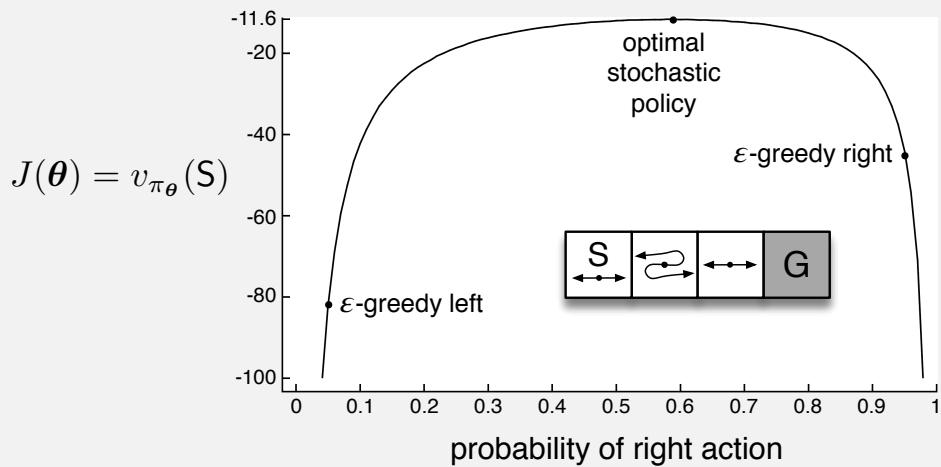

---
_build:
  render: never
  list: never
---

# Chapter 13

# Policy Gradient Methods

In this chapter we consider something new. So far in this book almost all the methods have been action- value methods; they learned the values of actions and then selected actions based on their estimated action values1; their policies would not even exist without the action- value estimates. In this chapter we consider methods that instead learn a parameterized policy that can select actions without consulting a value function. A value function may still be used to learn the policy parameter, but is not required for action selection. We use the notation  \(\pmb{\theta} \in \mathbb{R}^{d'}\)  for the policy's parameter vector. Thus we write  \(\pi (a | s, \pmb {\theta}) = \operatorname *{Pr}\{A_t = a \mid S_t = s, \pmb {\theta}_t = \pmb {\theta}\}\)  for the probability that action  \(a\)  is taken at time  \(t\)  given that the environment is in state  \(s\)  at time  \(t\)  with parameter  \(\pmb{\theta}\) . If a method uses a learned value function as well, then the value function's weight vector is denoted  \(\mathbf{w} \in \mathbb{R}^{d}\)  as usual, as in  \(\hat{v} (s, \mathbf{w})\) .In this chapter we consider methods for learning the policy parameter based on the gradient of some scalar performance measure  \(J(\pmb {\theta})\)  with respect to the policy parameter. These methods seek to maximize performance, so their updates approximate gradient ascent in  \(J\) :

In this chapter we consider methods for learning the policy parameter based on the gradient of some scalar performance measure  \(J(\pmb {\theta})\)  with respect to the policy parameter. These methods seek to maximize performance, so their updates approximate gradient ascent in  \(J\)  ..

$$
\pmb{\theta}_{t + 1} = \pmb {\theta}_t + \alpha \widehat{\nabla J(\pmb{\theta}_t)}, \tag{13.1}
$$

where  \(\widehat{\nabla J(\pmb{\theta}_t)} \in \mathbb{R}^{d'}\)  is a stochastic estimate whose expectation approximates the gradient of the performance measure with respect to its argument  \(\pmb {\theta}_t\) . All methods that follow this general schema we call policy gradient methods, whether or not they also learn an approximate value function. Methods that learn approximations to both policy and value functions are often called actor- critic methods, where 'actor' is a reference to the learned policy, and 'critic' refers to the learned value function, usually a state- value function. First we treat the episodic case, in which performance is defined as the value of the start state under the parameterized policy, before going on to consider the continuing case, in

which performance is defined as the average reward rate, as in Section 10.3. In the end, we are able to express the algorithms for both cases in very similar terms.

# 13.1 Policy Approximation and its Advantages

In policy gradient methods, the policy can be parameterized in any way, as long as  \(\pi (a|s,\pmb \theta)\)  is differentiable with respect to its parameters, that is, as long as  \(\nabla \pi (a|s,\pmb \theta)\)  (the column vector of partial derivatives of  \(\pi (a|s,\pmb \theta)\)  with respect to the components of  \(\pmb \theta\) ) exists and is finite for all  \(s\in \mathcal{S}\) ,  \(a\in \mathcal{A}(s)\) , and  \(\pmb \theta \in \mathbb{R}^{d^{\prime}}\) . In practice, to ensure exploration we generally require that the policy never becomes deterministic (i.e., that  \(\pi (a|s,\pmb \theta)\in (0,1)\) , for all  \(s,a,\pmb \theta\) ). In this section we introduce the most common parameterization for discrete action spaces and point out the advantages it offers over action- value methods. Policy- based methods also offer useful ways of dealing with continuous action spaces, as we describe later in Section 13.7.

If the action space is discrete and not too large, then a natural and common kind of parameterization is to form parameterized numerical preferences  \(h(s,a,\pmb \theta)\in \mathbb{R}\)  for each state- action pair. The actions with the highest preferences in each state are given the highest probabilities of being selected, for example, according to an exponential soft- max distribution:

$$
\pi (a|s,\pmb \theta)\doteq \frac{e^{h(s,a,\pmb\theta)}}{\sum_{b}e^{h(s,b,\pmb\theta)}}, \tag{13.2}
$$

where  \(e\approx 2.71828\)  is the base of the natural logarithm. Note that the denominator here is just what is required so that the action probabilities in each state sum to one. We call this kind of policy parameterization soft- max in action preferences.

The action preferences themselves can be parameterized arbitrarily. For example, they might be computed by a deep artificial neural network (ANN), where  \(\pmb \theta\)  is the vector of all the connection weights of the network (as in the AlphaGo system described in Section 16.6). Or the preferences could simply be linear in features,

$$
h(s,a,\pmb \theta) = \pmb \theta^{\top}\mathbf{x}(s,a), \tag{13.3}
$$

using feature vectors  \(\mathbf{x}(s,a)\in \mathbb{R}^{d^{\prime}}\)  constructed by any of the methods described in Section 9.5.

One advantage of parameterizing policies according to the soft- max in action preferences is that the approximate policy can approach a deterministic policy, whereas with  \(\epsilon\) - greedy action selection over action values there is always an  \(\epsilon\)  probability of selecting a random action. Of course, one could select according to a soft- max distribution based on action values, but this alone would not allow the policy to approach a deterministic policy. Instead, the action- value estimates would converge to their corresponding true values, which would differ by a finite amount, translating to specific probabilities other than 0 and 1. If the soft- max distribution included a temperature parameter, then the temperature could be reduced over time to approach determinism, but in practice it would be difficult to choose the reduction schedule, or even the initial temperature, without more prior knowledge of the true action values than we would like to assume. Action preferences

are different because they do not approach specific values; instead they are driven to produce the optimal stochastic policy. If the optimal policy is deterministic, then the preferences of the optimal actions will be driven infinitely higher than all suboptimal actions (if permitted by the parameterization).

A second advantage of parameterizing policies according to the soft- max in action preferences is that it enables the selection of actions with arbitrary probabilities. In problems with significant function approximation, the best approximate policy may be stochastic. For example, in card games with imperfect information the optimal play is often to do two different things with specific probabilities, such as when bluffing in Poker. Action- value methods have no natural way of finding stochastic optimal policies, whereas policy approximating methods can, as shown in Example 13.1.

# Example 13.1 Short corridor with switched actions

Consider the small corridor gridworld shown inset in the graph below. The reward is  \(- 1\)  per step, as usual. In each of the three nonterminal states there are only two actions, right and left. These actions have their usual consequences in the first and third states (left causes no movement in the first state), but in the second state they are reversed, so that right moves to the left and left moves to the right. The problem is difficult because all the states appear identical under the function approximation. In particular, we define  \(\mathbf{x}(s, \text{right}) = [1, 0]^{\top}\)  and  \(\mathbf{x}(s, \text{left}) = [0, 1]^{\top}\) , for all  \(s\) . An action- value method with  \(\epsilon\) - greedy action selection is forced to choose between just two policies: choosing right with high probability  \(1 - \epsilon /2\)  on all steps or choosing left with the same high probability on all time steps. If  \(\epsilon = 0.1\) , then these two policies achieve a value (at the start state) of less than  \(- 44\)  and  \(- 82\) , respectively, as shown in the graph. A method can do significantly better if it can learn a specific probability with which to select right. The best probability is about 0.59, which achieves a value of about  \(- 11.6\) .

Perhaps the simplest advantage that policy parameterization may have over action- value parameterization is that the policy may be a simpler function to approximate. Problems vary in the complexity of their policies and action- value functions. For some, the action- value function is simpler and thus easier to approximate. For others, the policy is simpler. In the latter case a policy- based method will typically learn faster and yield a superior asymptotic policy (as in Tetris; see Şimşek, Algorta, and Kothiyal, 2016).

Finally, we note that the choice of policy parameterization is sometimes a good way of injecting prior knowledge about the desired form of the policy into the reinforcement learning system. This is often the most important reason for using a policy- based learning method.

Exercise 13.1 Use your knowledge of the gridworld and its dynamics to determine an exact symbolic expression for the optimal probability of selecting the right action in Example 13.1.  \(\square\)

# 13.2 The Policy Gradient Theorem

In addition to the practical advantages of policy parameterization over  \(\epsilon\) - greedy action selection, there is also an important theoretical advantage. With continuous policy parameterization the action probabilities change smoothly as a function of the learned parameter, whereas in  \(\epsilon\) - greedy selection the action probabilities may change dramatically for an arbitrarily small change in the estimated action values, if that change results in a different action having the maximal value. Largely because of this, stronger convergence guarantees are available for policy- gradient methods than for action- value methods. In particular, it is the continuity of the policy dependence on the parameters that enables policy- gradient methods to approximate gradient ascent (13.1).

The episodic and continuing cases define the performance measure,  \(J(\pmb \theta)\) , differently and thus have to be treated separately to some extent. Nevertheless, we will try to present both cases uniformly, and we develop a notation so that the major theoretical results can be described with a single set of equations.

In this section we treat the episodic case, for which we define the performance measure as the value of the start state of the episode. We can simplify the notation without losing any meaningful generality by assuming that every episode starts in some particular (non- random) state  \(s_0\) . Then, in the episodic case we define performance as

$$
J(\pmb \theta) \doteq v_{\pi_{\pmb \theta}}(s_0), \tag{13.4}
$$

where  \(v_{\pi_{\theta}}\)  is the true value function for  \(\pi_{\theta}\) , the policy determined by  \(\pmb \theta\) . From here on in our discussion we will assume no discounting ( \(\gamma = 1\) ) for the episodic case, although for completeness we do include the possibility of discounting in the boxed algorithms.

With function approximation it may seem challenging to change the policy parameter in a way that ensures improvement. The problem is that performance depends on both the action selections and the distribution of states in which those selections are made, and that both of these are affected by the policy parameter. Given a state, the effect of the policy parameter on the actions, and thus on reward, can be computed in a relatively straightforward way from knowledge of the parameterization. But the effect of the policy

# Proof of the Policy Gradient Theorem (episodic case)

With just elementary calculus and re- arranging of terms, we can prove the policy gradient theorem from first principles. To keep the notation simple, we leave it implicit in all cases that  \(\pi\)  is a function of  \(\pmb{\theta}\) , and all gradients are also implicitly with respect to  \(\pmb{\theta}\) . First note that the gradient of the state- value function can be written in terms of the action- value function as

$$
\nabla v_{\pi}(s) = \nabla \left[\sum_{a}\pi (a|s)q_{\pi}(s,a)\right],\quad \mathrm{for~all~}s\in \mathcal{S} \tag{Exercise 3.18}
$$

$$
\begin{array}{rl} & {= \sum_{a}\Big[\nabla \pi (a|s)q_{\pi}(s,a) + \pi (a|s)\nabla q_{\pi}(s,a)\Big]\quad (\mathrm{product~rule~of~calculus})}\\ & {= \sum_{a}\Big[\nabla \pi (a|s)q_{\pi}(s,a) + \pi (a|s)\nabla \sum_{s^{\prime},r}p(s^{\prime},r|s,a)\big(r + v_{\pi}(s^{\prime})\big)\Big]} \end{array}
$$

Exercise 3.19 and Equation 3.2)

$$
\begin{array}{rl} & {= \sum_{a}\Big[\nabla \pi (a|s)q_{\pi}(s,a) + \pi (a|s)\sum_{s^{\prime}}p(s^{\prime}|s,a)\nabla v_{\pi}(s^{\prime})\Big]}\\ & {= \sum_{a}\Big[\nabla \pi (a|s)q_{\pi}(s,a) + \pi (a|s)\sum_{s}p(s^{\prime}|s,a)} \end{array} \tag{Eq. 3.4}
$$

$$
\sum_{a^{\prime}}\bigl [\nabla \pi (a^{\prime}|s^{\prime})q_{\pi}(s^{\prime},a^{\prime}) + \pi (a^{\prime}|s^{\prime})\sum_{s^{\prime \prime}}p(s^{\prime \prime}|s^{\prime},a^{\prime})\nabla v_{\pi}(s^{\prime \prime})\bigr ]\biggr ]
$$

$$
= \sum_{x\in \mathcal{S}}\sum_{k = 0}^{\infty}\operatorname *{Pr}(s\to x,k,\pi)\sum_{a}\nabla \pi (a|x)q_{\pi}(x,a),
$$

after repeated unrolling, where  \(\operatorname *{Pr}(s\to x,k,\pi)\)  is the probability of transitioning from state  \(s\)  to state  \(x\)  in  \(k\)  steps under policy  \(\pi\) . It is then immediate that

$$
\begin{array}{rl} & {\nabla J(\pmb {\theta}) = \nabla v_{\pi}(s_0)}\\ & {\quad \quad = \sum_s\left(\sum_{k = 0}^{\infty}\operatorname *{Pr}(s_0\to s,k,\pi)\right)\sum_a\nabla \pi (a|s)q_{\pi}(s,a)}\\ & {\quad \quad = \sum_s\eta (s)\sum_a\nabla \pi (a|s)q_{\pi}(s,a)}\\ & {\quad \quad = \sum_s\eta (s')\sum_s\frac{\eta(s)}{\sum_{s'}\eta(s')}\sum_a\nabla \pi (a|s)q_{\pi}(s,a)}\\ & {\quad \quad = \sum_s\eta (s')\sum_s\mu (s)\sum_a\nabla \pi (a|s)q_{\pi}(s,a)}\\ & {\quad \quad \propto \sum_s\mu (s)\sum_a\nabla \pi (a|s)q_{\pi}(s,a)} \end{array} \tag{Eq. 9.3}
$$

on the state distribution is a function of the environment and is typically unknown. How can we estimate the performance gradient with respect to the policy parameter when the gradient depends on the unknown effect of policy changes on the state distribution?

Fortunately, there is an excellent theoretical answer to this challenge in the form of the policy gradient theorem, which provides an analytic expression for the gradient of performance with respect to the policy parameter (which is what we need to approximate for gradient ascent (13.1)) that does not involve the derivative of the state distribution. The policy gradient theorem for the episodic case establishes that

$$
\nabla J(\pmb {\theta})\propto \sum_{s}\mu (s)\sum_{a}q_{\pi}(s,a)\nabla \pi (a|s,\pmb {\theta}), \tag{13.5}
$$

where the gradients are column vectors of partial derivatives with respect to the components of  \(\pmb{\theta}\) , and  \(\pi\)  denotes the policy corresponding to parameter vector  \(\pmb{\theta}\) . The symbol  \(\propto\)  here means "proportional to". In the episodic case, the constant of proportionality is the average length of an episode, and in the continuing case it is 1, so that the relationship is actually an equality. The distribution  \(\mu\)  here (as in Chapters 9 and 10) is the on- policy distribution under  \(\pi\)  (see page 199). The policy gradient theorem is proved for the episodic case in the box on the previous page.

# 13.3 REINFORCE: Monte Carlo Policy Gradient

We are now ready to derive our first policy- gradient learning algorithm. Recall our overall strategy of stochastic gradient ascent (13.1), which requires a way to obtain samples such that the expectation of the sample gradient is proportional to the actual gradient of the performance measure as a function of the parameter. The sample gradients need only be proportional to the gradient because any constant of proportionality can be absorbed into the step size  \(\alpha\) , which is otherwise arbitrary. The policy gradient theorem gives an exact expression proportional to the gradient; all that is needed is some way of sampling whose expectation equals or approximates this expression. Notice that the right- hand side of the policy gradient theorem is a sum over states weighted by how often the states occur under the target policy  \(\pi\) ; if  \(\pi\)  is followed, then states will be encountered in these proportions. Thus

$$
\begin{array}{l}{{\nabla J(\pmb{\theta})\propto\sum_{s}\mu(s)\sum_{a}q_{\pi}(s,a)\nabla\pi(a|s,\pmb{\theta})}}\\ {{\qquad=\mathbb{E}_{\pi}\biggl[\sum_{a}q_{\pi}(S_{t},a)\nabla\pi(a|S_{t},\pmb{\theta})\biggr].}}\end{array} \tag{13.6}
$$

We could stop here and instantiate our stochastic gradient- ascent algorithm (13.1) as

$$
\pmb{\theta}_{t + 1}\doteq \pmb {\theta}_t + \alpha \sum_a\hat{q} (S_t,a,\mathbf{w})\nabla \pi (a|S_t,\pmb {\theta}), \tag{13.7}
$$

where  \(\hat{q}\)  is some learned approximation to  \(q_{\pi}\) . This algorithm, which has been called an all- actions method because its update involves all of the actions, is promising and

deserving of further study, but our current interest is the classical REINFORCE algorithm (Willams, 1992) whose update at time  \(t\)  involves just  \(A_{t}\) , the one action actually taken at time  \(t\) .

We continue our derivation of REINFORCE by introducing  \(A_{t}\)  in the same way as we introduced  \(S_{t}\)  in (13.6)—by replacing a sum over the random variable's possible values by an expectation under  \(\pi\) , and then sampling the expectation. Equation (13.6) involves an appropriate sum over actions, but each term is not weighted by  \(\pi (a|S_{t},\pmb {\theta})\)  as is needed for an expectation under  \(\pi\) . So we introduce such a weighting, without changing the equality, by multiplying and then dividing the summed terms by  \(\pi (a|S_{t},\pmb {\theta})\) . Continuing from (13.6), we have

$$
\begin{array}{rlr}\nabla J(\pmb {\theta})\propto \mathbb{E}_{\pi}[\sum_{a}\pi (a|S_{t},\pmb {\theta})q_{\pi}(S_{t},a)\frac{\nabla\pi(a|S_{t},\pmb{\theta})}{\pi(a|S_{t},\pmb{\theta})}] & \\ = \mathbb{E}_{\pi}[q_{\pi}(S_{t},A_{t})\frac{\nabla\pi(A_{t}|S_{t},\pmb{\theta})}{\pi(A_{t}|S_{t},\pmb{\theta})}] & \mathrm{(replacing~}a\mathrm{~by~the~sample~}A_{t}\sim \pi)\\ = \mathbb{E}_{\pi}[G_{t}\frac{\nabla\pi(A_{t}|S_{t},\pmb{\theta})}{\pi(A_{t}|S_{t},\pmb{\theta})}], & \mathrm{(because~}\mathbb{E}_{\pi}[G_{t}|S_{t},A_{t}] = q_{\pi}(S_{t},A_{t})) \end{array}
$$

where  \(G_{t}\)  is the return as usual. The final expression in brackets is exactly what is needed, a quantity that can be sampled on each time step whose expectation is proportional to the gradient. Using this sample to instantiate our generic stochastic gradient ascent algorithm (13.1) yields the REINFORCE update:

$$
\pmb{\theta}_{t + 1}\doteq \pmb {\theta}_t + \alpha_{t}G_t\frac{\nabla\pi(A_t|S_t,\pmb{\theta}_t)}{\pi(A_t|S_t,\pmb{\theta}_t)}. \tag{13.8}
$$

This update has an intuitive appeal. Each increment is proportional to the product of a return  \(G_{t}\)  and a vector, the gradient of the probability of taking the action actually taken divided by the probability of taking that action. The vector is the direction in parameter space that most increases the probability of repeating the action  \(A_{t}\)  on future visits to state  \(S_{t}\) . The update increases the parameter vector in this direction proportional to the return, and inversely proportional to the action probability. The former makes sense because it causes the parameter to move most in the directions that favor actions that yield the highest return. The latter makes sense because otherwise actions that are selected frequently are at an advantage (the updates will be more often in their direction) and might win out even if they do not yield the highest return.

Note that REINFORCE uses the complete return from time  \(t\) , which includes all future rewards up until the end of the episode. In this sense REINFORCE is a Monte Carlo algorithm and is well defined only for the episodic case with all updates made in retrospect after the episode is completed (like the Monte Carlo algorithms in Chapter 5). This is shown explicitly in the boxed algorithm on the next page.

Notice that the update in the last line of pseudocode appears rather different from the REINFORCE update rule (13.8). One difference is that the pseudocode uses the compact expression  \(\nabla \ln \pi (A_t|S_t,\pmb {\theta}_t)\)  for the fractional vector  \(\frac{\nabla\pi(A_t|S_t,\pmb{\theta}_t)}{\pi(A_t|S_t,\pmb{\theta}_t)}\)  in (13.8). That these two expressions for the vector are equivalent follows from the identity  \(\nabla \ln x = \frac{\nabla x}{x}\) .

This vector has been given several names and notations in the literature; we will refer to it simply as the eligibility vector. Note that it is the only place that the policy parameterization appears in the algorithm.

REINFORCE: Monte- Carlo Policy- Gradient Control (episodic) for  \(\pi_{*}\)

Input: a differentiable policy parameterization  \(\pi (a|s,\pmb \theta)\)

Algorithm parameter: step size  \(\alpha >0\)

Initialize policy parameter  \(\pmb \theta \in \mathbb{R}^{d^{\prime}}\)  (e.g., to 0)

Loop forever (for each episode):

Generate an episode  \(S_{0},A_{0},R_{1},\ldots ,S_{T - 1},A_{T - 1},R_{T}\)  , following  \(\pi (\cdot |\cdot ,\pmb \theta)\)

Loop for each step of the episode  \(t = 0,1,\ldots ,T - 1\)

\(\begin{array}{r}{G\leftarrow \sum_{k = t + 1}^{T}\gamma^{k - t - 1}R_{k}} \end{array}\) \(\pmb{\theta}\leftarrow \pmb {\theta} + \alpha \gamma^{t}G\pmb {\nabla}\ln \pi (A_{t}|S_{t},\pmb {\theta})\)

The second difference between the pseudocode update and the REINFORCE update equation (13.8) is that the former includes a factor of  \(\gamma^{t}\)  . This is because, as mentioned earlier, in the text we are treating the non- discounted case (  \(\gamma = 1\)  ) while in the boxed algorithms we are giving the algorithms for the general discounted case. All of the ideas go through in the discounted case with appropriate adjustments (including to the box on page 199) but involve additional complexity that distracts from the main ideas.

\*Exercise 13.2 Generalize the box on page 199, the policy gradient theorem (13.5), the proof of the policy gradient theorem (page 325), and the steps leading to the REINFORCE update equation (13.8), so that (13.8) ends up with a factor of  \(\gamma^{t}\)  and thus aligns with the general algorithm given in the pseudocode.

Figure 13.1 shows the performance of REINFORCE on the short- corridor gridworld from Example 13.1.

  
Figure 13.1: REINFORCE on the short-corridor gridworld (Example 13.1). With a good step size, the total reward per episode approaches the optimal value of the start state.

As a stochastic gradient method, REINFORCE has good theoretical convergence properties. By construction, the expected update over an episode is in the same direction as the performance gradient. This assures an improvement in expected performance for sufficiently small  \(\alpha\) , and convergence to a local optimum under standard stochastic approximation conditions for decreasing  \(\alpha\) . However, as a Monte Carlo method REINFORCE may be of high variance and thus produce slow learning.

Exercise 13.3 In Section 13.1 we considered policy parameterizations using the soft- max in action preferences (13.2) with linear action preferences (13.3). For this parameterization, prove that the eligibility vector is

$$
\nabla \ln \pi (a|s,\pmb \theta) = \mathbf{x}(s,a) - \sum_{b}\pi (b|s,\pmb \theta)\mathbf{x}(s,b), \tag{13.9}
$$

using the definitions and elementary calculus.

# 13.4 REINFORCE with Baseline

The policy gradient theorem (13.5) can be generalized to include a comparison of the action value to an arbitrary baseline  \(b(s)\) :

$$
\nabla J(\pmb \theta)\propto \sum_{s}\mu (s)\sum_{a}\Bigl (q_{s}(s,a) - b(s)\Bigr)\nabla \pi (a|s,\pmb \theta). \tag{13.10}
$$

The baseline can be any function, even a random variable, as long as it does not vary with  \(a\) ; the equation remains valid because the subtracted quantity is zero:

$$
\sum_{a}b(s)\nabla \pi (a|s,\pmb \theta) = b(s)\nabla \sum_{a}\pi (a|s,\pmb \theta) = b(s)\nabla 1 = 0.
$$

The policy gradient theorem with baseline (13.10) can be used to derive an update rule using similar steps as in the previous section. The update rule that we end up with is a new version of REINFORCE that includes a general baseline:

$$
\pmb{\theta}_{t + 1}\doteq \pmb {\theta}_t + a\Big(G_t - b(S_t)\Big)\frac{\nabla\pi(A_t|S_t,\pmb{\theta}_t)}{\pi(A_t|S_t,\pmb{\theta}_t)}. \tag{13.11}
$$

Because the baseline could be uniformly zero, this update is a strict generalization of REINFORCE. In general, the baseline leaves the expected value of the update unchanged, but it can have a large effect on its variance. For example, we saw in Section 2.8 that an analogous baseline can significantly reduce the variance (and thus speed the learning) of gradient bandit algorithms. In the bandit algorithms the baseline was just a number (the average of the rewards seen so far), but for MDPs the baseline should vary with state. In some states all actions have high values and we need a high baseline to differentiate the higher valued actions from the less highly valued ones; in other states all actions will have low values and a low baseline is appropriate.

One natural choice for the baseline is an estimate of the state value,  \(\hat{v} (S_t,\mathbf{w})\) , where  \(\mathbf{w} \in \mathbb{R}^d\)  is a weight vector learned by one of the methods presented in previous chapters.

Because REINFORCE is a Monte Carlo method for learning the policy parameter,  \(\pmb{\theta}\) , it seems natural to also use a Monte Carlo method to learn the state- value weights,  \(\mathbf{w}\) . A complete pseudocode algorithm for REINFORCE with baseline using such a learned state- value function as the baseline is given in the box below.

# REINFORCE with Baseline (episodic), for estimating  \(\pi_{\theta} \approx \pi_{*}\)

Input: a differentiable policy parameterization  \(\pi (a|s, \theta)\)

Input: a differentiable state- value function parameterization  \(\hat{v} (s, \mathbf{w})\)

Algorithm parameters: step sizes  \(\alpha^{\theta} > 0\) ,  \(\alpha^{\mathbf{w}} > 0\)

Initialize policy parameter  \(\pmb{\theta} \in \mathbb{R}^{d'}\)  and state- value weights  \(\mathbf{w} \in \mathbb{R}^{d}\)  (e.g., to 0)

Loop forever (for each episode):

Generate an episode  \(S_{0}, A_{0}, R_{1}, \ldots , S_{T - 1}, A_{T - 1}, R_{T}\) , following  \(\pi (\cdot |\cdot , \theta)\)

Loop for each step of the episode  \(t = 0, 1, \ldots , T - 1\) :

$$
\begin{array}{r l} & {G\leftarrow \sum_{k = t + 1}^{T}\gamma^{k - t - 1}R_{k}}\\ & {\delta \leftarrow G - \hat{v} (S_{t},\mathbf{w})}\\ & {\mathbf{w}\leftarrow \mathbf{w} + \alpha^{\mathbf{w}}\delta \nabla \hat{v} (S_{t},\mathbf{w})}\\ & {\pmb {\theta}\leftarrow \pmb {\theta} + \alpha^{\pmb{\theta}}\gamma^{t}\delta \nabla \ln \pi (A_{t}|S_{t},\pmb {\theta})} \end{array} \tag{G_t}
$$

This algorithm has two step sizes, denoted  \(\alpha^{\theta}\)  and  \(\alpha^{\mathbf{w}}\)  (where  \(\alpha^{\theta}\)  is the  \(\alpha\)  in (13.11)). Choosing the step size for values (here  \(\alpha^{\mathbf{w}}\) ) is relatively easy; in the linear case we have rules of thumb for setting it, such as  \(\alpha^{\mathbf{w}} = 0.1 / \mathbb{E}[\| \nabla \hat{v} (S_{t}, \mathbf{w})\|_{\mu}^{2}]\)  (see Section 9.6). It is much less clear how to set the step size for the policy parameters,  \(\alpha^{\theta}\) , whose best value depends on the range of variation of the rewards and on the policy parameterization.

  
Figure 13.2: Adding a baseline to REINFORCE can make it learn much faster, as illustrated here on the short-corridor gridworld (Example 13.1). The step size used here for plain REINFORCE is that at which it performs best (to the nearest power of two; see Figure 13.1).

Figure 13.2 compares the behavior of REINFORCE with and without a baseline on the short- corridor grid/word (Example 13.1). Here the approximate state- value function used in the baseline is  \(\hat{v} (s,\mathbf{w}) = w\) . That is,  \(\mathbf{w}\)  is a single component,  \(w\) .

# 13.5 Actor-Critic Methods

In REINFORCE with baseline, the learned state- value function estimates the value of the first state of each state transition. This estimate sets a baseline for the subsequent return, but is made prior to the transition's action and thus cannot be used to assess that action. In actor- critic methods, on the other hand, the state- value function is applied also to the second state of the transition. The estimated value of the second state, when discounted and added to the reward, constitutes the one- step return,  \(G_{t:t + 1}\) , which is a useful estimate of the actual return and thus is a way of assessing the action. As we have seen in the TD learning of value functions throughout this book, the one- step return is often superior to the actual return in terms of its variance and computational congeniality, even though it introduces bias. We also know how we can flexibly modulate the extent of the bias with  \(n\) - step returns and eligibility traces (Chapters 7 and 12). When the state- value function is used to assess actions in this way it is called a critic, and the overall policy- gradient method is termed an actor- critic method. Note that the bias in the gradient estimate is not due to bootstrapping as such; the actor would be biased even if the critic was learned by a Monte Carlo method.

First consider one- step actor- critic methods, the analog of the TD methods introduced in Chapter 6 such as TD(0), Sarsa(0), and Q- learning. The main appeal of one- step methods is that they are fully online and incremental, yet avoid the complexities of eligibility traces. They are a special case of the eligibility trace methods, but easier to understand. One- step actor- critic methods replace the full return of REINFORCE (13.11) with the one- step return (and use a learned state- value function as the baseline) as follows:

$$
\begin{array}{l}{\pmb{\theta}_{t + 1}\dot{=}\pmb {\theta}_t + \alpha \Big(G_{t:t + 1} - \hat{v} (S_t,\mathbf{w})\Big)\frac{\nabla\pi(A_t|S_t,\pmb{\theta}_t)}{\pi(A_t|S_t,\pmb{\theta}_t)}}\\ {= \pmb {\theta}_t + \alpha \Big(R_{t + 1} + \gamma \hat{v} (S_{t + 1},\mathbf{w}) - \hat{v} (S_t,\mathbf{w})\Big)\frac{\nabla\pi(A_t|S_t,\pmb{\theta}_t)}{\pi(A_t|S_t,\pmb{\theta}_t)}}\\ {= \pmb {\theta}_t + \alpha \delta_t\frac{\nabla\pi(A_t|S_t,\pmb{\theta}_t)}{\pi(A_t|S_t,\pmb{\theta}_t)}.} \end{array} \tag{13.14}
$$

The natural state- value- function learning method to pair with this is semi- gradient TD(0). Pseudocode for the complete algorithm is given in the box at the top of the next page. Note that it is now a fully online, incremental algorithm, with states, actions, and rewards processed as they occur and then never revisited.

# One-step Actor-Critic (episodic), for estimating  \(\pi_{\theta} \approx \pi_{*}\)

Input: a differentiable policy parameterization  \(\pi (a|s, \theta)\)

Input: a differentiable state- value function parameterization  \(\hat{v} (s, \mathbf{w})\)

Parameters: step sizes  \(\alpha^{\theta} > 0\) ,  \(\alpha^{\mathbf{w}} > 0\)

Initialize policy parameter  \(\theta \in \mathbb{R}^{d^{\prime}}\)  and state- value weights  \(\mathbf{w} \in \mathbb{R}^{d}\)  (e.g., to 0)

Loop forever (for each episode):

Initialize  \(S\)  (first state of episode)

\(I \leftarrow 1\)

Loop while  \(S\)  is not terminal (for each time step):

\(A \sim \pi (\cdot |S, \theta)\)

Take action  \(A\) , observe  \(S^{\prime}, R\)

\(\delta \leftarrow R + \gamma \hat{v} (S^{\prime}, \mathbf{w}) - \hat{v} (S, \mathbf{w})\)  (if  \(S^{\prime}\)  is terminal, then  \(\hat{v} (S^{\prime}, \mathbf{w}) \doteq 0\) )

\(\mathbf{w} \leftarrow \mathbf{w} + \alpha^{\mathbf{w}} \delta \nabla \hat{v} (S, \mathbf{w})\)

\(\theta \leftarrow \theta + \alpha^{\theta} I \delta \nabla \ln \pi (A | S, \theta)\)

\(I \leftarrow \gamma I\)

\(S \leftarrow S^{\prime}\)

The generalizations to the forward view of  \(n\) - step methods and then to a  \(\lambda\) - return algorithm are straightforward. The one- step return in (13.12) is merely replaced by  \(G_{t:t + n}\)  or  \(G_{t}^{\lambda}\)  respectively. The backward view of the  \(\lambda\) - return algorithm is also straightforward, using separate eligibility traces for the actor and critic, each after the patterns in Chapter 12. Pseudocode for the complete algorithm is given in the box below.

# Actor-Critic with Eligibility Traces (episodic), for estimating  \(\pi_{\theta} \approx \pi_{*}\)

Input: a differentiable policy parameterization  \(\pi (a|s, \theta)\)

Input: a differentiable state- value function parameterization  \(\hat{v} (s, \mathbf{w})\)

Parameters: trace- decay rates  \(\lambda^{\theta} \in [0, 1]\) ,  \(\lambda^{\mathbf{w}} \in [0, 1]\) ; step sizes  \(\alpha^{\theta} > 0\) ,  \(\alpha^{\mathbf{w}} > 0\)

Initialize policy parameter  \(\theta \in \mathbb{R}^{d^{\prime}}\)  and state- value weights  \(\mathbf{w} \in \mathbb{R}^{d}\)  (e.g., to 0)

Loop forever (for each episode):

Initialize  \(S\)  (first state of episode)

\(\mathbf{z}^{\theta} \leftarrow \mathbf{0}\)  ( \(d^{\prime}\) - component eligibility trace vector)

\(\mathbf{z}^{\mathbf{w}} \leftarrow \mathbf{0}\)  ( \(d\) - component eligibility trace vector)

\(I \leftarrow 1\)

Loop while  \(S\)  is not terminal (for each time step):

\(A \sim \pi (\cdot |S, \theta)\)

Take action  \(A\) , observe  \(S^{\prime}, R\)

\(\delta \leftarrow R + \gamma \hat{v} (S^{\prime}, \mathbf{w}) - \hat{v} (S, \mathbf{w})\)  (if  \(S^{\prime}\)  is terminal, then  \(\hat{v} (S^{\prime}, \mathbf{w}) \doteq 0\) )

\(\mathbf{z}^{\mathbf{w}} \leftarrow \gamma \lambda^{\mathbf{w}} \mathbf{z}^{\mathbf{w}} + \nabla \hat{v} (S, \mathbf{w})\)

\(\mathbf{z}^{\theta} \leftarrow \gamma \lambda^{\theta} \mathbf{z}^{\theta} + I \nabla \ln \pi (A | S, \theta)\)

\(\mathbf{w} \leftarrow \mathbf{w} + \alpha^{\mathbf{w}} \delta \mathbf{z}^{\mathbf{w}}\)

\(\theta \leftarrow \theta + \alpha^{\theta} \delta \mathbf{z}^{\theta}\)

\(I \leftarrow \gamma I\)

\(S \leftarrow S^{\prime}\)

# 13.6 Policy Gradient for Continuing Problems

As discussed in Section 10.3, for continuing problems without episode boundaries we need to define performance in terms of the average rate of reward per time step:

$$
\begin{array}{l}{{J(\pmb\theta)\doteq r(\pi)\doteq\lim _{h\rightarrow\infty}\frac{1}{h}\sum_{t=1}^{h}\mathbb{E}[R_{t}\mid S_{0},A_{0:t-1}\sim\pi]}}\\ {{\qquad=\lim _{t\rightarrow\infty}\mathbb{E}[R_{t}\mid S_{0},A_{0:t-1}\sim\pi]}}\\ {{\qquad=\sum_{s}\mu(s)\sum_{a}\pi(a|s)\sum_{s^{\prime},r}p(s^{\prime},r|s,a)r,}}\end{array} \tag{13.15}
$$

where  \(\mu\)  is the steady- state distribution under  \(\pi\) \(\begin{array}{r}{\mu (s)\doteq \lim_{t\to \infty}\operatorname *{Pr}\{S_{t} = s|A_{0:t}\sim \pi \}} \end{array}\)  which is assumed to exist and to be independent of  \(S_{0}\)  (an ergodicity assumption). Remember that this is the special distribution under which, if you select actions according to  \(\pi\)  , you remain in the same distribution:

$$
\sum_{s} \mu (s) \sum_{a} \pi (a | s, \theta) p(s' | s, a) = \mu (s'), \text{for all} s' \in \mathcal{S}. \tag{13.16}
$$

Complete pseudocode for the actor- critic algorithm in the continuing case (backward view) is given in the box below.

# Actor-Critic with Eligibility Traces (continuing), for estimating  \(\pi_{\theta} \approx \pi_{*}\)

Input: a differentiable policy parameterization  \(\pi (a | s, \theta)\)

Input: a differentiable state- value function parameterization  \(\hat{v} (s, \mathbf{w})\)

Algorithm parameters:  \(\lambda^{\mathbf{w}} \in [0, 1]\) ,  \(\lambda^{\theta} \in [0, 1]\) ,  \(\alpha^{\mathbf{w}} > 0\) ,  \(\alpha^{\theta} > 0\) ,  \(\alpha^{\bar{R}} > 0\)

Initialize  \(\bar{R} \in \mathbb{R}^d\)  (e.g., to 0)

Initialize state- value weights  \(\mathbf{w} \in \mathbb{R}^d\)  and policy parameter  \(\theta \in \mathbb{R}^{d'}\)  (e.g., to 0)

Initialize  \(S \in \mathcal{S}\)  (e.g., to  \(s_0\) )

\(\mathbf{z}^{\mathbf{w}} \leftarrow \mathbf{0}\)  (d- component eligibility trace vector)

\(\mathbf{z}^{\theta} \leftarrow \mathbf{0}\)  (d'- component eligibility trace vector)

Loop forever (for each time step):

\(A \sim \pi (\cdot | S, \theta)\)

Take action  \(A\) , observe  \(S', R\)

\(\delta \leftarrow R - \bar{R} + \hat{v} (S', \mathbf{w}) - \hat{v} (S, \mathbf{w})\)

\(\bar{R} \leftarrow \bar{R} + \alpha^{\bar{R}} \delta\)

\(\mathbf{z}^{\mathbf{w}} \leftarrow \lambda^{\mathbf{w}} \mathbf{z}^{\mathbf{w}} + \nabla \hat{v} (S, \mathbf{w})\)

\(\mathbf{z}^{\theta} \leftarrow \lambda^{\theta} \mathbf{z}^{\theta} + \nabla \ln \pi (A | S, \theta)\)

\(\mathbf{w} \leftarrow \mathbf{w} + \alpha^{\mathbf{w}} \delta \mathbf{z}^{\mathbf{w}}\)

\(\theta \leftarrow \theta + \alpha^{\theta} \delta \mathbf{z}^{\theta}\)

\(S \leftarrow S'\)

Naturally, in the continuing case, we define values,  \(v_{\pi}(s) \doteq \mathbb{E}_{\pi}[G_{t}|S_{t} = s]\)  and  \(q_{\pi}(s,a) \doteq \mathbb{E}_{\pi}[G_{t}|S_{t} = s, A_{t} = a]\) , with respect to the differential return:

$$
G_{t} \doteq R_{t + 1} - r(\pi) + R_{t + 2} - r(\pi) + R_{t + 3} - r(\pi) + \dots . \tag{13.17}
$$

With these alternate definitions, the policy gradient theorem as given for the episodic case (13.5) remains true for the continuing case. A proof is given in the box on the next page. The forward and backward view equations also remain the same.

Proof of the Policy Gradient Theorem (continuing case)

The proof of the policy gradient theorem for the continuing case begins similarly to the episodic case. Again we leave it implicit in all cases that  \(\pi\)  is a function of  \(\theta\)  and that the gradients are with respect to  \(\theta\) . Recall that in the continuing case  \(J(\theta) = r(\pi)\)  (13.15) and that  \(v_{\pi}\)  and  \(q_{\pi}\)  denote values with respect to the differential return (13.17). The gradient of the state- value function can be written, for any  \(s \in \mathbb{S}\) , as

$$
\begin{array}{r l} & {\nabla v_{\pi}(s) = \nabla \left[\sum_{a}\pi (a|s)q_{\pi}(s,a)\right],\quad \mathrm{for~all~}s\in \mathcal{S}}\\ & {\qquad = \sum_{a}\left[\nabla \pi (a|s)q_{\pi}(s,a) + \pi (a|s)\nabla q_{\pi}(s,a)\right]\qquad \mathrm{(product~rule~of~cal{c u l u s})}}\\ & {\qquad = \sum_{a}\left[\nabla \pi (a|s)q_{\pi}(s,a) + \pi (a|s)\nabla \sum_{s^{\prime},r}p(s^{\prime},r|s,a)\big(r - r(\pmb {\theta}) + v_{\pi}(s^{\prime})\big)\right]}\\ & {\qquad = \sum_{a}\left[\nabla \pi (a|s)q_{\pi}(s,a) + \pi (a|s)\big[-\nabla r(\pmb {\theta}) + \sum_{s^{\prime}}p(s^{\prime}|s,a)\nabla v_{\pi}(s^{\prime})\big]\right].} \end{array} \tag{Exercise 3.18}
$$

After re- arranging terms, we obtain

$$
\nabla r(\pmb {\theta}) = \sum_{a}\left[\nabla \pi (a|s)q_{\pi}(s,a) + \pi (a|s)\sum_{s^{\prime}}p(s^{\prime}|s,a)\nabla v_{\pi}(s^{\prime})\right] - \nabla v_{\pi}(s).
$$

Notice that the left- hand side can be written  \(\nabla J(\theta)\) , and that it does not depend on  \(s\) . Thus the right- hand side does not depend on  \(s\)  either, and we can safely sum it over all  \(s \in \mathbb{S}\) , weighted by  \(\mu (s)\) , without changing it (because  \(\sum_{s} \mu (s) = 1\) ):

$$
\begin{array}{l}{\nabla J(\pmb {\theta}) = \sum_{s}\mu (s)\left(\sum_{a}\left[\nabla \pi (a|s)q_{\pi}(s,a) + \pi (a|s)\sum_{s^{\prime}}p(s^{\prime}|s,a)\nabla v_{\pi}(s^{\prime})\right] - \nabla v_{\pi}(s)\right)}\\ {= \sum_{s}\mu (s)\sum_{a}\nabla \tau (a|s)q_{\pi}(s,a)}\\ {\qquad +\sum_{s}\mu (s)\sum_{a}\pi (a|s)\sum_{s^{\prime}}p(s^{\prime}|s,a)\nabla v_{\pi}(s^{\prime}) - \sum_{s}\mu (s)\nabla v_{\pi}(s)} \end{array}
$$

$$
\begin{array}{r l} & {\quad = \sum_{s}\mu (s)\sum_{a}\nabla \pi (a|s)q_{\pi}(s,a)}\\ & {\qquad +\sum_{s}\sum_{s}\mu (s)\sum_{a}\pi (a|s)p(s^{\prime}|s,a)\nabla v_{\pi}(s^{\prime}) - \sum_{a}\mu (s)\nabla v_{\pi}(s)}\\ & {\qquad \quad \mu (s^{\prime})\mathrm{~(13.16)}}\\ & {\quad = \sum_{s}\mu (s)\sum_{a}\nabla \pi (a|s)q_{\pi}(s,a) + \sum_{s^{\prime}}\mu (s^{\prime})\nabla v_{\pi}(s^{\prime}) - \sum_{s}\mu (s)\nabla v_{\pi}(s)}\\ & {\quad = \sum_{s}\mu (s)\sum_{a}\nabla \pi (a|s)q_{\pi}(s,a).\qquad \mathrm{Q.E.D.}} \end{array}
$$

# 13.7 Policy Parameterization for Continuous Actions

Policy- based methods offer practical ways of dealing with large action spaces, even continuous spaces with an infinite number of actions. Instead of computing learned probabilities for each of the many actions, we instead learn statistics of the probability distribution. For example, the action set might be the real numbers, with actions chosen from a normal (Gaussian) distribution.

The probability density function for the normal distribution is conventionally written

$$
p(x) \doteq \frac{1}{\sigma\sqrt{2\pi}} \exp \left(-\frac{(x - \mu)^2}{2\sigma^2}\right), \tag{13.18}
$$

where  \(\mu\)  and  \(\sigma\)  here are the mean and standard deviation of the normal distribution, and of course  \(\pi\)  here is just the number  \(\pi \approx 3.14159\) . The probability density functions for several different means and standard deviations are shown to the right. The value  \(p(x)\)  is the density of the probability at  \(x\) , not the probability. It can be greater than 1; it is the total area under  \(p(x)\)  that must sum to 1. In general, one can take the integral under  \(p(x)\)  for any range of  \(x\)  values to get the probability of  \(x\)  falling within that range.

To produce a policy parameterization, the policy can be defined as the normal probability density over a real- valued scalar action, with mean and standard deviation given by parametric function approximators that depend on the state. That is,

$$
\pi (a|s, \theta) \doteq \frac{1}{\sigma(s, \theta)\sqrt{2\pi}} \exp \left(-\frac{(a - \mu(s, \theta))^2}{2\sigma(s, \theta)^2}\right), \tag{13.19}
$$

where  \(\mu : \mathcal{S} \times \mathbb{R}^{d'} \to \mathbb{R}\)  and  \(\sigma : \mathcal{S} \times \mathbb{R}^{d'} \to \mathbb{R}^+\)  are two parameterized function approximators.

To complete the example we need only give a form for these approximators. For this we divide the policy's parameter vector into two parts,  \(\pmb {\theta} = [\pmb{\theta}_{\mu},\pmb{\theta}_{\sigma}]^{\top}\) , one part to be used for the approximation of the mean and one part for the approximation of the standard deviation. The mean can be approximated as a linear function. The standard deviation must always be positive and is better approximated as the exponential of a linear function. Thus

$$
\mu (s,\pmb {\theta})\doteq \pmb{\theta}_{\mu}^{\top}\mathbf{x}_{\mu}(s)\quad \mathrm{and}\quad \sigma (s,\pmb {\theta})\doteq \exp \Big(\pmb{\theta}_{\sigma}^{\top}\mathbf{x}_{\sigma}(s)\Big), \tag{13.20}
$$

where  \(\mathbf{x}_{\mu}(s)\)  and  \(\mathbf{x}_{\sigma}(s)\)  are state feature vectors perhaps constructed by one of the methods described in Section 9.5. With these definitions, all the algorithms described in the rest of this chapter can be applied to learn to select real- valued actions.

Exercise 13.4 Show that for the Gaussian policy parameterization (Equations 13.19 and 13.20) the eligibility vector has the following two parts:

$$
\nabla \ln \pi (a|s,\pmb{\theta}_{\mu}) = \frac{\nabla\pi(a|s,\pmb{\theta}_{\mu})}{\pi(a|s,\pmb{\theta})} = \frac{1}{\sigma(s,\pmb{\theta})^{2}} (a - \mu (s,\pmb {\theta}))\mathbf{x}_{\mu}(s),\mathrm{and}
$$

$$
\nabla \ln \pi (a|s,\pmb{\theta}_{\sigma}) = \frac{\nabla\pi(a|s,\pmb{\theta}_{\sigma})}{\pi(a|s,\pmb{\theta})} = \left(\frac{(a - \mu(s,\pmb{\theta}))^{2}}{\sigma(s,\pmb{\theta})^{2}} -1\right)\mathbf{x}_{\sigma}(s).
$$

Exercise 13.5 A Bernoulli- logistic unit is a stochastic neuron- like unit used in some ANNs (Section 9.7). Its input at time  \(t\)  is a feature vector  \(\mathbf{x}(S_{t})\) ; its output,  \(A_{t}\) , is a random variable having two values, 0 and 1, with  \(\operatorname *{Pr}\{A_{t} = 1\} = P_{t}\)  and  \(\operatorname *{Pr}\{A_{t} = 0\} = 1 - P_{t}\)  (the Bernoulli distribution). Let  \(h(s,0,\pmb {\theta})\)  and  \(h(s,1,\pmb {\theta})\)  be the preferences in state  \(s\)  for the unit's two actions given policy parameter  \(\pmb{\theta}\) . Assume that the difference between the action preferences is given by a weighted sum of the unit's input vector, that is, assume that  \(h(s,1,\pmb {\theta}) - h(s,0,\pmb {\theta}) = \pmb{\theta}^{\top}\mathbf{x}(s)\) , where  \(\pmb{\theta}\)  is the unit's weight vector.

(a) Show that if the exponential soft-max distribution (13.2) is used to convert action preferences to policies, then  \(P_{t} = \pi (1|S_{t},\pmb{\theta}_{t}) = 1 / (1 + \exp (-\pmb{\theta}_{t}^{\top}\mathbf{x}(S_{t})))\)  (the logistic function).

(b) What is the Monte-Carlo REINFORCE update of  \(\pmb{\theta}_{t}\)  to  \(\pmb{\theta}_{t + 1}\)  upon receipt of return  \(G_{t}\) ?

(c) Express the eligibility  \(\nabla \ln \pi (a|s,\pmb {\theta})\)  for a Bernoulli-logistic unit, in terms of  \(a\) ,  \(\mathbf{x}(s)\) , and  \(\pi (a|s,\pmb {\theta})\)  by calculating the gradient.

Hint for part (c): Define  \(P = \pi (1|s,\pmb {\theta})\)  and compute the derivative of the logarithm, for each action, using the chain rule on  \(P\) . Combine the two results into one expression that depends on  \(a\)  and  \(P\) , and then use the chain rule again, this time on  \(\pmb{\theta}^{\top}\mathbf{x}(s)\) , noting that the derivative of the logistic function  \(f(x) = 1 / (1 + e^{- x})\)  is  \(f(x)(1 - f(x))\) .

# 13.8 Summary

Prior to this chapter, this book focused on action- value methods- meaning methods that learn action values and then use them to determine action selections. In this chapter, on the other hand, we considered methods that learn a parameterized policy that enables actions to be taken without consulting action- value estimates. In particular, we have considered policy- gradient methods- meaning methods that update the policy parameter on each step in the direction of an estimate of the gradient of performance with respect to the policy parameter.

Methods that learn and store a policy parameter have many advantages. They can learn specific probabilities for taking the actions. They can learn appropriate levels of exploration and approach deterministic policies asymptotically. They can naturally handle continuous action spaces. All these things are easy for policy- based methods but awkward or impossible for  \(\epsilon\)  - greedy methods and for action- value methods in general. In addition, on some problems the policy is just simpler to represent parametrically than the value function; these problems are more suited to parameterized policy methods.

Parameterized policy methods also have an important theoretical advantage over action- value methods in the form of the policy gradient theorem, which gives an exact formula for how performance is affected by the policy parameter that does not involve derivatives of the state distribution. This theorem provides a theoretical foundation for all policy gradient methods.

The REINFORCE method follows directly from the policy gradient theorem. Adding a state- value function as a baseline reduces REINFORCE's variance without introducing bias. If the state- value function is also used to assess or criticize the policy's action selections, then the value function is called a critic and the policy is called an actor; the overall method is called an actor- critic method. The critic introduces bias into the actor's gradient estimates, but is often desirable for the same reason that bootstrapping TD methods are often superior to Monte Carlo methods (substantially reduced variance).

Overall, policy- gradient methods provide a significantly different set of strengths and weaknesses than action- value methods. Today they are less well understood in some respects, but a subject of excitement and ongoing research.

# Bibliographical and Historical Remarks

Bibliographical and Historical RemarksMethods that we now see as related to policy gradients were actually some of the earliest to be studied in reinforcement learning (Witten, 1977; Barto, Sutton, and Anderson, 1983; Sutton, 1984; Williams, 1987, 1992) and in predecessor fields (see Phansalkar and Thathachar, 1995). They were largely supplanted in the 1990s by the action- value methods that are the focus of the other chapters of this book. In recent years, however, attention has returned to actor- critic methods and to policy- gradient methods in general. Among the further developments beyond what we cover here are natural- gradient methods (Amari, 1998; Kakade, 2002, Peters, Vijayakumar and Schaal, 2005; Peters and Schaal, 2008; Park, Kim and Kang, 2005; Bhatnagar, Sutton, Ghawamzadeh and Lee, 2009; see Grondman, Busontu, Lopes and Babuska, 2012), deterministic policy- gradient methods

(Silver et al., 2014), off- policy policy- gradient methods (Degris, White, and Sutton, 2012; Maei, 2018), and entropy regularization (see Schulman, Chen, and Abbed, 2017). Major applications include acrobatic helicopter autopilots and AlphaGo (Section 16.6).

Our presentation in this chapter is based primarily on that by Sutton, McAllester, Singh, and Mansour (2000), who introduced the term "policy gradient methods." A useful overview is provided by Bhatnagar et al. (2009). One of the earliest related works is by Aleksandrov, Sysoyev, and Shemeneva (1968). Thomas (2014) first realized that the factor of  \(\gamma^{t}\) , as specified in the boxed algorithms of this chapter, was needed in the case of discounted episodic problems.

13.1 Example 13.1 and the results with it in this chapter were developed with Eric Graves.

13.2 The policy gradient theorem here and on page 334 was first obtained by Marbach and Tsitsiklis (1998, 2001) and then independently by Sutton et al. (2000). A similar expression was obtained by Cao and Chen (1997). Other early results are due to Konda and Tsitsiklis (2000, 2003), Baxter and Bartlett (2001), and Baxter, Bartlett, and Weaver (2001). Some additional results are developed by Sutton, Singh, and McAllester (2000).

13.3 REINFORCE is due to Williams (1987, 1992). Phansalkar and Thathachar (1995) proved both local and global convergence theorems for modified versions of REINFORCE algorithms.

The all- actions algorithm was first presented in an unpublished but widely circulated incomplete paper (Sutton, Singh, and McAllester, 2000) and then developed further by Ciosek and Whiteson (2017, 2018), who termed it "expected policy gradients," and by Asadi, Allen, Roderick, Mohamed, Konidaris, and Littman (2017), who called it "mean actor critic."

13.4 The baseline was introduced in Williams's (1987, 1992) original work. Greensmith, Bartlett, and Baxter (2004) analyzed an arguably better baseline (see Dick, 2015). Thomas and Brunskill (2017) argue that an action- dependent baseline can be used without incurring bias.

13.5- 6 Actor- critic methods were among the earliest to be investigated in reinforcement learning (Witten, 1977; Barto, Sutton, and Anderson, 1983; Sutton, 1984). The algorithms presented here are based on the work of Degris, White, and Sutton (2012). Actor- critic methods are sometimes referred to as advantage actor- critic ("A2C") methods in the literature.

13.7 The first to show how continuous actions could be handled this way appears to have been Williams (1987, 1992). The figure on page 335 is adapted from Wikipedia.