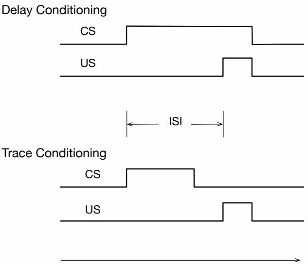
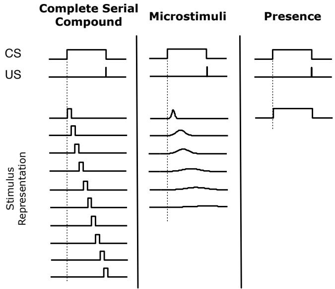
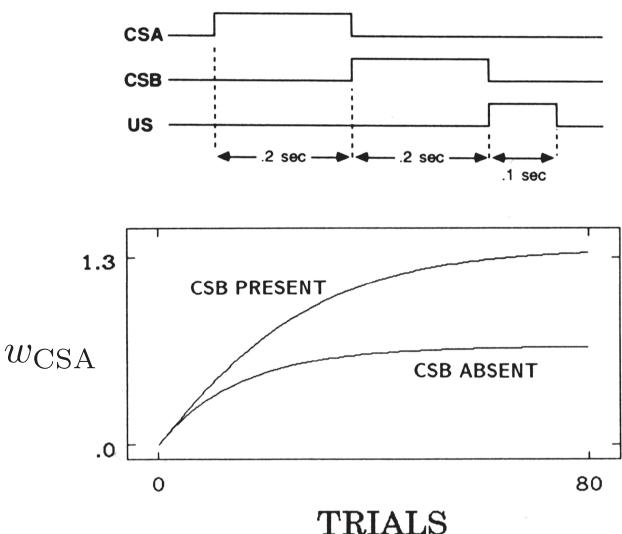
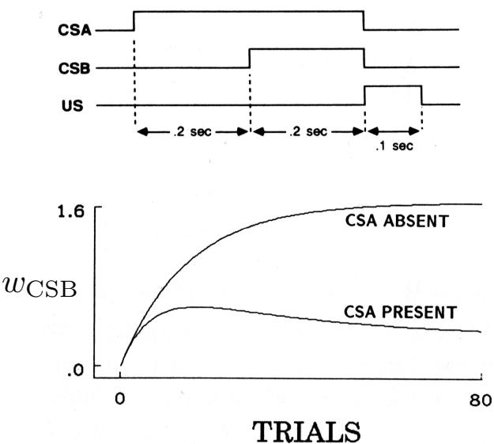
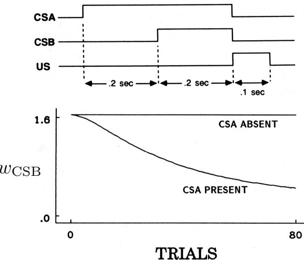
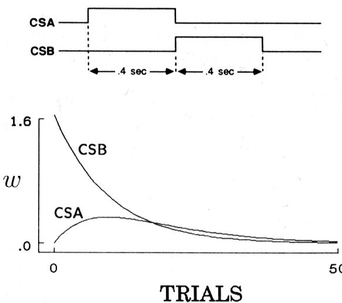
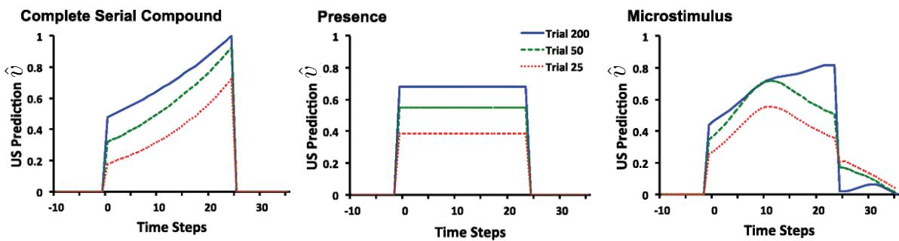
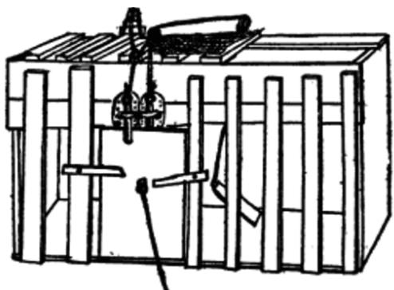
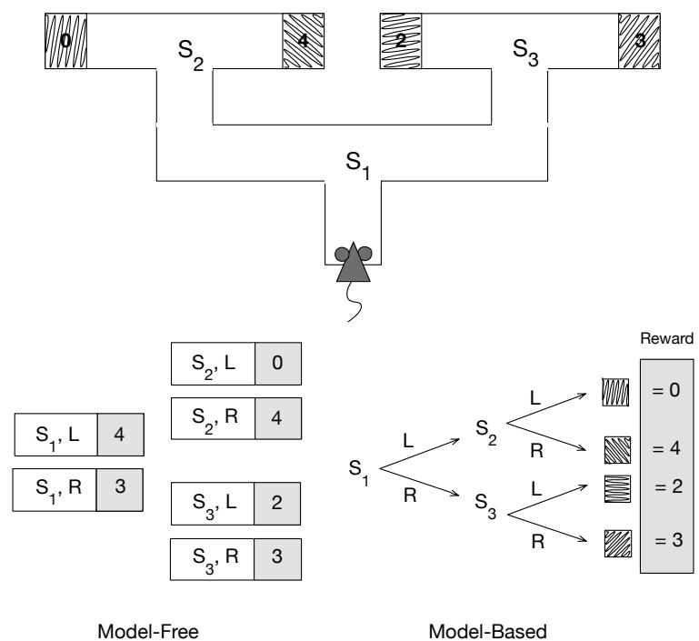

# Chapter 14

# Psychology

In previous chapters we developed ideas for algorithms based on computational considerations alone. In this chapter we look at some of these algorithms from another perspective: the perspective of psychology and its study of how animals learn. The goals of this chapter are, first, to discuss ways that reinforcement learning ideas and algorithms correspond to what psychologists have discovered about animal learning, and second, to explain the influence reinforcement learning is having on the study of animal learning. The clear formalism provided by reinforcement learning that systemizes tasks, returns, and algorithms is proving to be enormously useful in making sense of experimental data, in suggesting new kinds of experiments, and in pointing to factors that may be critical to manipulate and to measure. The idea of optimizing return over the long term that is at the core of reinforcement learning is contributing to our understanding of otherwise puzzling features of animal learning and behavior.

Some of the correspondences between reinforcement learning and psychological theories are not surprising because the development of reinforcement learning drew inspiration from psychological learning theories. However, as developed in this book, reinforcement learning explores idealized situations from the perspective of an artificial intelligence researcher or engineer, with the goal of solving computational problems with efficient algorithms, rather than to replicate or explain in detail how animals learn. As a result, some of the correspondences we describe connect ideas that arose independently in their respective fields. We believe these points of contact are specially meaningful because they expose computational principles important to learning, whether it is learning by artificial or by natural systems.

For the most part, we describe correspondences between reinforcement learning and learning theories developed to explain how animals like rats, pigeons, and rabbits learn in controlled laboratory experiments. Thousands of these experiments were conducted throughout the 20th century, and many are still being conducted today. Although sometimes dismissed as irrelevant to wider issues in psychology, these experiments probe subtle properties of animal learning, often motivated by precise theoretical questions. As psychology shifted its focus to more cognitive aspects of behavior, that is, to mental

processes such as thought and reasoning, animal learning experiments came to play less of a role in psychology than they once did. But this experimentation led to the discovery of learning principles that are elemental and widespread throughout the animal kingdom, principles that should not be neglected in designing artificial learning systems. In addition, as we shall see, some aspects of cognitive processing connect naturally to the computational perspective provided by reinforcement learning.

This chapter's final section includes references relevant to the connections we discuss as well as to connections we neglect. We hope this chapter encourages readers to probe all of these connections more deeply. Also included in this final section is a discussion of how the terminology used in reinforcement learning relates to that of psychology. Many of the terms and phrases used in reinforcement learning are borrowed from animal learning theories, but the computational/engineering meanings of these terms and phrases do not always coincide with their meanings in psychology.

# 14.1 Prediction and Control

The algorithms we describe in this book fall into two broad categories: algorithms for prediction and algorithms for control.1 These categories arise naturally in solution methods for the reinforcement learning problem presented in Chapter 3. In many ways these categories respectively correspond to categories of learning extensively studied by psychologists: classical, or Pavlovian, conditioning and instrumental, or operant, conditioning. These correspondences are not completely accidental because of psychology's influence on reinforcement learning, but they are nevertheless striking because they connect ideas arising from different objectives.

The prediction algorithms presented in this book estimate quantities that depend on how features of an agent's environment are expected to unfold over the future. We specifically focus on estimating the amount of reward an agent can expect to receive over the future while it interacts with its environment. In this role, prediction algorithms are policy evaluation algorithms, which are integral components of algorithms for improving policies. But prediction algorithms are not limited to predicting future reward; they can predict any feature of the environment (see, for example, Modayil, White, and Sutton, 2014). The correspondence between prediction algorithms and classical conditioning rests on their common property of predicting upcoming stimuli, whether or not those stimuli are rewarding (or punishing).

The situation in an instrumental, or operant, conditioning experiment is different. Here, the experimental apparatus is set up so that an animal is given something it likes (a reward) or something it dislikes (a penalty) depending on what the animal did. The animal learns to increase its tendency to produce rewarded behavior and to decrease its tendency to produce penalized behavior. The reinforcing stimulus is said to be contingent on the animal's behavior, whereas in classical conditioning it is not (although it is difficult to remove all behavior contingencies in a classical conditioning experiment). Instrumental

conditioning experiments are like those that inspired Thorndike's Law of Effect that we briefly discuss in Chapter 1. Control is at the core of this form of learning, which corresponds to the operation of reinforcement learning's policy- improvement algorithms.

Thinking of classical conditioning in terms of prediction, and instrumental conditioning in terms of control, is a starting point for connecting our computational view of reinforcement learning to animal learning, but in reality, the situation is more complicated than this. There is more to classical conditioning than prediction; it also involves action, and so is a mode of control, sometimes called Pavlovian control. Further, classical and instrumental conditioning interact in interesting ways, with both sorts of learning likely being engaged in most experimental situations. Despite these complications, aligning the classical/instrumental distinction with the prediction/control distinction is a convenient first approximation in connecting reinforcement learning to animal learning.

In psychology, the term reinforcement is used to describe learning in both classical and instrumental conditioning. Originally referring only to the strengthening of a pattern of behavior, it is frequently also used for the weakening of a pattern of behavior. A stimulus considered to be the cause of the change in behavior is called a reinforcer, whether or not it is contingent on the animal's previous behavior. At the end of this chapter we discuss this terminology in more detail and how it relates to terminology used in machine learning.

# 14.2 Classical Conditioning

While studying the activity of the digestive system, the celebrated Russian physiologist Ivan Pavlov found that an animal's innate responses to certain triggering stimuli can come to be triggered by other stimuli that are quite unrelated to the inborn triggers. His experimental subjects were dogs that had undergone minor surgery to allow the intensity of their salivary reflex to be accurately measured. In one case he describes, the dog did not salivate under most circumstances, but about 5 seconds after being presented with food it produced about six drops of saliva over the next several seconds. After several repetitions of presenting another stimulus, one not related to food, in this case the sound of a metronome, shortly before the introduction of food, the dog salivated in response to the sound of the metronome in the same way it did to the food. "The activity of the salivary gland has thus been called into play by impulses of sound—a stimulus quite alien to food" (Pavlov, 1927, p. 22). Summarizing the significance of this finding, Pavlov wrote:

It is pretty evident that under natural conditions the normal animal must respond not only to stimuli which themselves bring immediate benefit or harm, but also to other physical or chemical agencies—waves of sound, light, and the like—which in themselves only signal the approach of these stimuli; though it is not the sight and sound of the beast of prey which is in itself harmful to the smaller animal, but its teeth and claws. (Pavlov, 1927, p. 14)

Connecting new stimuli to innate reflexes in this way is now called classical, or Pavlovian, conditioning. Pavlov (or more exactly, his translators) called inborn responses (e.g.,

salivation in his demonstration described above) "unconditioned responses" (URs), their natural triggering stimuli (e.g., food) "unconditioned stimuli" (USs), and new responses triggered by predictive stimuli (e.g., here also salivation) "conditioned responses" (CRs). A stimulus that is initially neutral, meaning that it does not normally elicit strong responses (e.g., the metronome sound), becomes a "conditioned stimulus" (CS) as the animal learns that it predicts the US and so comes to produce a CR in response to the CS. These terms are still used in describing classical conditioning experiments (though better translations would have been "conditional" and "unconditional" instead of conditioned and unconditioned). The US is called a reinforcer because it reinforces producing a CR in response to the CS.

The arrangement of stimuli in two common types of classical conditioning experiments is shown to the right. In delay conditioning, the CS extends throughout the interstimulus interval, or ISI, which is the time interval between the CS onset and the US onset (with the CS ending when the US ends in a common version shown here). In trace conditioning, the US begins after the CS ends, and the time interval between CS offset and US onset is called the trace interval.

The salivation of Pavlov's dogs to the sound of a metronome is just one example of classical conditioning, which has been intensively studied across many response systems of many species of animals. URs are often preparatory in some way, like the salivation of Pavlov's dog, or protective in some way, like an eye blink in response to something irritating to the eye, or freezing in response to seeing a predator. Experiencing the CS- US predictive relationship over a series of trials causes the animal to learn that the CS predicts the US so that the animal can respond to the CS with a CR that prepares the animal for, or protects it from, the predicted US. Some CRs are similar to the UR but begin earlier and differ in ways that increase their effectiveness. In one intensively studied type of experiment, for example, a tone CS reliably predicts a puff of air (the US) to a rabbit's eye, triggering a UR consisting of the closure of a protective inner eyelid called the nictitating membrane. After one or more trials, the tone comes to trigger a CR consisting of membrane closure that begins before the air puff and eventually becomes timed so that peak closure occurs just when the air puff is likely to occur. This CR, being initiated in anticipation of the air puff and appropriately timed, offers better protection than simply initiating closure as a reaction to the irritating US. The ability to act in anticipation of important events by learning about predictive relationships among stimuli is so beneficial that it is widely present across the animal kingdom.

# 14.2.1 Blocking and Higher-order Conditioning

Many interesting properties of classical conditioning have been observed in experiments. Beyond the anticipatory nature of CRs, two widely observed properties figured prominently in the development of classical conditioning models: blocking and higher- order conditioning. Blocking occurs when an animal fails to learn a CR when a potential CS is presented along with another CS that had been used previously to condition the animal to produce that CR. For example, in the first stage of a blocking experiment involving rabbit nictitating membrane conditioning, a rabbit is first conditioned with a tone CS and an air puff US to produce the CR of closing its nictitating membrane in anticipation of the air puff. The experiment's second stage consists of additional trials in which a second stimulus, say a light, is added to the tone to form a compound tone/light CS followed by the same air puff US. In the experiment's third phase, the second stimulus alone- - the light- - is presented to the rabbit to see if the rabbit has learned to respond to it with a CR. It turns out that the rabbit produces very few, or no, CRs in response to the light: learning to the light had been blocked by the previous learning to the tone.2 Blocking results like this challenged the idea that conditioning depends only on simple temporal contiguity, that is, that a necessary and sufficient condition for conditioning is that a US frequently follows a CS closely in time. In the next section we describe the Rescorla- Wagner model (Rescorla and Wagner, 1972) that offered an influential explanation for blocking.

Higher- order conditioning occurs when a previously- conditioned CS acts as a US in conditioning another initially neutral stimulus. Pavlov described an experiment in which his assistant first conditioned a dog to salivate to the sound of a metronome that predicted a food US, as described above. After this stage of conditioning, a number of trials were conducted in which a black square, to which the dog was initially indifferent, was placed in the dog's line of vision followed by the sound of the metronome- - and this was not followed by food. In just ten trials, the dog began to salivate merely upon seeing the black square, despite the fact that the sight of it had never been followed by food. The sound of the metronome itself acted as a US in conditioning a salivation CR to the black square CS. This was second- order conditioning. If the black square had been used as a US to establish salivation CRs to another otherwise neutral CS, it would have been third- order conditioning, and so on. Higher- order conditioning is difficult to demonstrate, especially above the second order, in part because a higher- order reinforcer loses its reinforcing value due to not being repeatedly followed by the original US during higher- order conditioning trials. But under the right conditions, such as intermixing first- order trials with higher- order trials or by providing a general energizing stimulus, higher- order conditioning beyond the second order can be demonstrated. As we describe below, the TD model of classical conditioning uses the bootstrapping idea that is central to our approach to extend the Rescorla- Wagner model's account of blocking to include both the anticipatory nature of CRs and higher- order conditioning.

Higher- order instrumental conditioning occurs as well. In this case, a stimulus that consistently predicts primary reinforcement becomes a reinforcer itself, where reinforcement is primary if its rewarding or penalizing quality has been built into the animal by evolution. The predicting stimulus becomes a secondary reinforcer, or more generally, a higher- order or conditioned reinforcer—the latter being a better term when the predicted reinforcing stimulus is itself a secondary, or an even higher- order, reinforcer. A conditioned reinforcer delivers conditioned reinforcement: conditioned reward or conditioned penalty. Conditioned reinforcement acts like primary reinforcement in increasing an animal's tendency to produce behavior that leads to conditioned reward, and to decrease an animal's tendency to produce behavior that leads to conditioned penalty. (See our comments at the end of this chapter that explain how our terminology sometimes differs, as it does here, from terminology used in psychology.)

Conditioned reinforcement is a key phenomenon that explains, for instance, why we work for the conditioned reinforcer money, whose worth derives solely from what is predicted by having it. In actor- critic methods described in Section 13.5 (and discussed in the context of neuroscience in Sections 15.7 and 15.8), the critic uses a TD method to evaluate the actor's policy, and its value estimates provide conditioned reinforcement to the actor, allowing the actor to improve its policy. This analog of higher- order instrumental conditioning helps address the credit- assignment problem mentioned in Section 1.7 because the critic gives moment- by- moment reinforcement to the actor when the primary reward signal is delayed. We discuss this more below in Section 14.4.

# 14.2.2 The Rescorla-Wagner Model

Rescorla and Wagner created their model mainly to account for blocking. The core idea of the Rescorla- Wagner model is that an animal only learns when events violate its expectations, in other words, only when the animal is surprised (although without necessarily implying any conscious expectation or emotion). We first present Rescorla and Wagner's model using their terminology and notation before shifting to the terminology and notation we use to describe the TD model.

Here is how Rescorla and Wagner described their model. The model adjusts the "associative strength" of each component stimulus of a compound CS, which is a number representing how strongly or reliably that component is predictive of a US. When a compound CS consisting of several component stimuli is presented in a classical conditioning trial, the associative strength of each component stimulus changes in a way that depends on an associative strength associated with the entire stimulus compound, called the "aggregate associative strength," and not just on the associative strength of each component itself.

Rescorla and Wagner considered a compound CS AX, consisting of component stimuli A and X, where the animal may have already experienced stimulus A, and stimulus X might be new to the animal. Let  \(V_{\mathrm{A}}\) ,  \(V_{\mathrm{X}}\) , and  \(V_{\mathrm{AX}}\)  respectively denote the associative strengths of stimuli A, X, and the compound AX. Suppose that on a trial the compound CS AX is followed by a US, which we label stimulus Y. Then the associative strengths of

the stimulus components change according to these expressions:

$$
\begin{array}{r}\Delta V_{\mathrm{A}} = \alpha_{\mathrm{A}}\beta_{\mathrm{Y}}(R_{\mathrm{Y}} - V_{\mathrm{AX}})\\ \Delta V_{\mathrm{X}} = \alpha_{\mathrm{X}}\beta_{\mathrm{Y}}(R_{\mathrm{Y}} - V_{\mathrm{AX}}), \end{array}
$$

where  \(\alpha_{\mathrm{A}}\beta_{\mathrm{Y}}\)  and  \(\alpha_{\mathrm{X}}\beta_{\mathrm{Y}}\)  are the step- size parameters, which depend on the identities of the CS components and the US, and  \(R_{\mathrm{Y}}\)  is the asymptotic level of associative strength that the US Y can support. (Rescorla and Wagner used  \(\lambda\)  here instead of  \(R\) , but we use  \(R\)  to avoid confusion with our use of  \(\lambda\)  and because we usually think of this as the magnitude of a reward signal, with the caveat that the US in classical conditioning is not necessarily rewarding or penalizing.) A key assumption of the model is that the aggregate associative strength  \(V_{\mathrm{AX}}\)  is equal to  \(V_{\mathrm{A}} + V_{\mathrm{X}}\) . The associative strengths as changed by these  \(\Delta \mathrm{s}\)  become the associative strengths at the beginning of the next trial.

To be complete, the model needs a response- generation mechanism, which is a way of mapping values of  \(V\mathrm{s}\)  to CRs. Because this mapping would depend on details of the experimental situation, Rescorla and Wagner did not specify a mapping but simply assumed that larger  \(V\mathrm{s}\)  would produce stronger or more likely CRs, and that negative  \(V\mathrm{s}\)  would mean that there would be no CRs.

The Rescorla- Wagner model accounts for the acquisition of CRs in a way that explains blocking. As long as the aggregate associative strength,  \(V_{\mathrm{AX}}\) , of the stimulus compound is below the asymptotic level of associative strength,  \(R_{\mathrm{Y}}\) , that the US Y can support, the prediction error  \(R_{\mathrm{Y}} - V_{\mathrm{AX}}\)  is positive. This means that over successive trials the associative strengths  \(V_{\mathrm{A}}\)  and  \(V_{\mathrm{X}}\)  of the component stimuli increase until the aggregate associative strength  \(V_{\mathrm{AX}}\)  equals  \(R_{\mathrm{Y}}\) , at which point the associative strengths stop changing (unless the US changes). When a new component is added to a compound CS to which the animal has already been conditioned, further conditioning with the augmented compound produces little or no increase in the associative strength of the added CS component because the error has already been reduced to zero, or to a low value. The occurrence of the US is already predicted nearly perfectly, so little or no error—or surprise—is introduced by the new CS component. Prior learning blocks learning to the new component.

To transition from Rescorla and Wagner's model to the TD model of classical conditioning (which we just call the TD model), we first recast their model in terms of the concepts that we are using throughout this book. Specifically, we match the notation we use for learning with linear function approximation (Section 9.4), and we think of the conditioning process as one of learning to predict the "magnitude of the US" on a trial on the basis of the compound CS presented on that trial, where the magnitude of a US Y is the  \(R_{\mathrm{Y}}\)  of the Rescorla- Wagner model as given above. We also introduce states. Because the Rescorla- Wagner model is a trial- level model, meaning that it deals with how associative strengths change from trial to trial without considering any details about what happens within and between trials, we do not have to consider how states change during a trial until we present the full TD model in the following section. Instead, here we simply think of a state as a way of labeling a trial in terms of the collection of component CSs that are present on the trial.

Therefore, assume that trial- type, or state,  \(s\)  is described by a real- valued vector of features  \(\mathbf{x}(s) = (x_{1}(s), x_{2}(s), \ldots , x_{d}(s))^{\top}\)  where  \(x_{i}(s) = 1\)  if  \(\mathrm{CS}_{i}\) , the  \(i^{\mathrm{th}}\)  component of a

compound CS, is present on the trial and 0 otherwise. Then if the  \(d\) - dimensional vector of associative strengths is  \(\mathbf{w}\) , the aggregate associative strength for trial- type  \(s\)  is

$$
\hat{v} (s,\mathbf{w}) = \mathbf{w}^{\top}\mathbf{x}(s). \tag{14.1}
$$

This corresponds to a value estimate in reinforcement learning, and we think of it as the US prediction.

Now temporally let  \(t\)  denote the number of a complete trial and not its usual meaning as a time step (we revert to  \(t\) 's usual meaning when we extend this to the TD model below), and assume that  \(S_{t}\)  is the state corresponding to trial  \(t\) . Conditioning trial  \(t\)  updates the associative strength vector  \(\mathbf{w}_{t}\)  to  \(\mathbf{w}_{t + 1}\)  as follows:

$$
\mathbf{w}_{t + 1} = \mathbf{w}_t + \alpha \delta_t\mathbf{x}(S_t), \tag{14.2}
$$

where  \(\alpha\)  is the step- size parameter, and—because here we are describing the Rescorla- Wagner model— \(\delta_{t}\)  is the prediction error

$$
\delta_{t} = R_{t} - \hat{v} (S_{t},\mathbf{w}_{t}). \tag{14.3}
$$

\(R_{t}\)  is the target of the prediction on trial  \(t\) , that is, the magnitude of the US, or in Rescorla and Wagner's terms, the associative strength that the US on the trial can support. Note that because of the factor  \(\mathbf{x}(S_{t})\)  in (14.2), only the associative strengths of CS components present on a trial are adjusted as a result of that trial. You can think of the prediction error as a measure of surprise, and the aggregate associative strength as the animal's expectation that is violated when it does not match the target US magnitude.

From the perspective of machine learning, the Rescorla- Wagner model is an error- correction supervised learning rule. It is essentially the same as the Least Mean Square (LMS), or Widrow- Hoff, learning rule (Widrow and Hoff, 1960) that finds the weights—here the associative strengths—that make the average of the squares of all the errors as close to zero as possible. It is a "curve- fitting," or regression, algorithm that is widely used in engineering and scientific applications (see Section 9.4).3

The Rescorla- Wagner model was very influential in the history of animal learning theory because it showed that a "mechanistic" theory could account for the main facts about blocking without resorting to more complex cognitive theories involving, for example, an animal's explicit recognition that another stimulus component had been added and then scanning its short- term memory backward to reassess the predictive relationships involving the US. The Rescorla- Wagner model showed how traditional contiguity theories of conditioning—that temporal contiguity of stimuli was a necessary and sufficient condition for learning—could be adjusted in a simple way to account for blocking (Moore and Schmajuk, 2008).

The Rescorla- Wagner model provides a simple account of blocking and some other features of classical conditioning, but it is not a complete or perfect model of classical

conditioning. Different ideas account for a variety of other observed effects, and progress is still being made toward understanding the many subtleties of classical conditioning. The TD model, which we describe next, though also not a complete or perfect model model of classical conditioning, extends the Rescorla- Wagner model to address how within- trial and between- trial timing relationships among stimuli can influence learning and how higher- order conditioning might arise.

# 14.2.3 The TD Model

The TD model is a real- time model, as opposed to a trial- level model like the Rescorla- Wagner model. A single step  \(t\)  in the Rescorla- Wagner model represents an entire conditioning trial. The model does not apply to details about what happens during the time a trial is taking place, or what might happen between trials. Within each trial an animal might experience various stimuli whose onsets occur at particular times and that have particular durations. These timing relationships strongly influence learning. The Rescorla- Wagner model also does not include a mechanism for higher- order conditioning, whereas for the TD model, higher- order conditioning is a natural consequence of the bootstrapping idea that is at the base of TD algorithms.

To describe the TD model we begin with the formulation of the Rescorla- Wagner model above, but  \(t\)  now labels time steps within or between trials instead of complete trials. Think of the time between  \(t\)  and  \(t + 1\)  as a small time interval, say .01 second, and think of a trial as a sequences of states, one associated with each time step, where the state at step  \(t\)  now represents details of how stimuli are represented at  \(t\)  instead of just a label for the CS components present on a trial. In fact, we can completely abandon the idea of trials. From the point of view of the animal, a trial is just a fragment of its continuing experience interacting with its world. Following our usual view of an agent interacting with its environment, imagine that the animal is experiencing an endless sequence of states  \(x\) , each represented by a feature vector  \(\mathbf{x}(x)\) . That said, it is still often convenient to refer to trials as fragments of time during which patterns of stimuli repeat in an experiment.

State features are not restricted to describing the external stimuli that an animal experiences; they can describe neural activity patterns that external stimuli produce in an animal's brain, and these patterns can be history- dependent, meaning that they can be persistent patterns produced by sequences of external stimuli. Of course, we do not know exactly what these neural activity patterns are, but a real- time model like the TD model allows one to explore the consequences on learning of different hypotheses about the internal representations of external stimuli. For these reasons, the TD model does not commit to any particular state representation. In addition, because the TD model includes discounting and eligibility traces that span time intervals between stimuli, the model also makes it possible to explore how discounting and eligibility traces interact with stimulus representations in making predictions about the results of classical conditioning experiments.

Below we describe some of the state representations that have been used with the TD model and some of their implications, but for the moment we stay agnostic about

the representation and just assume that each state  \(s\)  is represented by a feature vector  \(\mathbf{x}(s) = (x_{1}(s),x_{2}(s),\ldots ,x_{n}(s))^{T}\) . Then the aggregate associative strength corresponding to a state  \(s\)  is given by (14.1), the same as for the Rescorla- Wagner model, but the TD model updates the associative strength vector,  \(\mathbf{w}\) , differently. With  \(t\)  now labeling a time step instead of a complete trial, the TD model governs learning according to this update:

$$
\mathbf{w}_{t + 1} = \mathbf{w}_{t} + \alpha \delta_{t}\mathbf{z}_{t}, \tag{14.4}
$$

which replaces  \(\mathbf{x}_{t}(S_{t})\)  in the Rescorla- Wagner update (14.2) with  \(\mathbf{z}_{t}\) , a vector of eligibility traces, and instead of the  \(\delta_{t}\)  of (14.3), here  \(\delta_{t}\)  is a TD error:

$$
\delta_{t} = R_{t + 1} + \gamma \hat{v} (S_{t + 1},\mathbf{w}_{t}) - \hat{v} (S_{t},\mathbf{w}_{t}), \tag{14.5}
$$

where  \(\gamma\)  is a discount factor (between 0 and 1),  \(R_{t}\)  is the prediction target at time  \(t\) , and  \(\hat{v} (S_{t + 1},\mathbf{w}_{t})\)  and  \(\hat{v} (S_{t},\mathbf{w}_{t})\)  are aggregate associative strengths at  \(t + 1\)  and  \(t\)  as defined by (14.1).

Each component  \(i\)  of the eligibility- trace vector  \(\mathbf{z}_{t}\)  increments or decrements according to the component  \(x_{i}(S_{t})\)  of the feature vector  \(\mathbf{x}(S_{t})\) , and otherwise decays with a rate determined by  \(\gamma \lambda\) :

$$
\mathbf{z}_{t} = \gamma \lambda \mathbf{z}_{t - 1} + \mathbf{x}(S_{t}). \tag{14.6}
$$

Here  \(\lambda\)  is the usual eligibility trace decay parameter.

Note that if  \(\gamma = 0\) , the TD model reduces to the Rescorla- Wagner model with the exceptions that: the meaning of  \(t\)  is different in each case (a trial number for the Rescorla- Wagner model and a time step for the TD model), and in the TD model there is a one- time- step lead in the prediction target  \(R\) . The TD model is equivalent to the backward view of the semi- gradient  \(\mathrm{TD}(\lambda)\)  algorithm with linear function approximation (Chapter 12), except that  \(R_{t}\)  in the model does not have to be a reward signal as it does when the TD algorithm is used to learn a value function for policy- improvement.

# 14.2.4 TD Model Simulations

Real- time conditioning models like the TD model are interesting primarily because they make predictions for a wide range of situations that cannot be represented by trial- level models. These situations involve the timing and durations of conditionable stimuli, the timing of these stimuli in relation to the timing of the US, and the timing and shapes of CRs. For example, the US generally must begin after the onset of a neutral stimulus for conditioning to occur, with the rate and effectiveness of learning depending on the inter- stimulus interval, or ISI, the interval between the onsets of the CS and the US. When CRs appear, they generally begin before the appearance of the US and their temporal profiles change during learning. In conditioning with compound CSs, the component stimuli of the compound CSs may not all begin and end at the same time, sometimes forming what is called a serial compound in which the component stimuli occur in a sequence over time. Timing considerations like these make it important to consider how

  
Figure 14.1: Three stimulus representations (in columns) sometimes used with the TD model. Each row represents one element of the stimulus representation. The three representations vary along a temporal generalization gradient, with no generalization between nearby time points in the complete serial compound (left column) and complete generalization between nearby time points in the presence representation (right column). The microstimulus representation occupies a middle ground. The degree of temporal generalization determines the temporal granularity with which US predictions are learned. Adapted with minor changes from Learning & Behavior, Evaluating the TD Model of Classical Conditioning, volume 40, 2012, p. 311, E. A. Ludvig, R. S. Sutton, E. J. Kehoe. With permission of Springer.

stimuli are represented, how these representations unfold over time during and between trials, and how they interact with discounting and eligibility traces.

Figure 14.1 shows three of the stimulus representations that have been used in exploring the behavior of the TD model: the complete serial compound (CSC), the microstimulus (MS), and the presence representations (Ludvig, Sutton, and Kehoe, 2012). These representations differ in the degree to which they force generalization among nearby time points during which a stimulus is present.

The simplest of the representations shown in Figure 14.1 is the presence representation in the figure's right column. This representation has a single feature for each component CS present on a trial, where the feature has value 1 whenever that component is present, and 0 otherwise.4 The presence representation is not a realistic hypothesis about how stimuli are represented in an animal's brain, but as we describe below, the TD model with this representation can produce many of the timing phenomena seen in classical conditioning.

For the CSC representation (left column of Figure 14.1), the onset of each external stimulus initiates a sequence of precisely- timed short- duration internal signals that continues until the external stimulus ends.5 This is like assuming the animal's nervous system has a clock that keeps precise track of time during stimulus presentations; it is what engineers call a "tapped delay line." Like the presence representation, the CSC representation is unrealistic as a hypothesis about how the brain internally represents stimuli, but Ludvig et al. (2012) call it a "useful fiction" because it can reveal details of how the TD model works when relatively unconstrained by the stimulus representation. The CSC representation is also used in most TD models of dopamine- producing neurons in the brain, a topic we take up in Chapter 15. The CSC representation is often viewed as an essential part of the TD model, although this view is mistaken.

The MS representation (center column of Figure 14.1) is like the CSC representation in that each external stimulus initiates a cascade of internal stimuli, but in this case the internal stimuli—the microstimuli—are not of such limited and non- overlapping form; they are extended over time and overlap. As time elapses from stimulus onset, different sets of microstimuli become more or less active, and each subsequent microstimulus becomes progressively wider in time and reaches a lower maximal level. Of course, there are many MS representations depending on the nature of the microstimuli, and a number of examples of MS representations have been studied in the literature, in some cases along with proposals for how an animal's brain might generate them (see the Bibliographic and Historical Comments at the end of this chapter). MS representations are more realistic than the presence or CSC representations as hypotheses about neural representations of stimuli, and they allow the behavior of the TD model to be related to a broader collection of phenomena observed in animal experiments. In particular, by assuming that cascades of microstimuli are initiated by USs as well as by CSs, and by studying the significant effects on learning of interactions between microstimuli, eligibility traces, and discounting, the TD model is helping to frame hypotheses to account for many of the subtle phenomena of classical conditioning and how an animal's brain might produce them. We say more about this below, particularly in Chapter 15 where we discuss reinforcement learning and neuroscience.

Even with the simple presence representation, however, the TD model produces all the basic properties of classical conditioning that are accounted for by the Rescorla- Wagner model, plus features of conditioning that are beyond the scope of trial- level models. For example, as we have already mentioned, a conspicuous feature of classical conditioning is that the US generally must begin after the onset of a neutral stimulus for conditioning to occur, and that after conditioning, the CR begins before the appearance of the US. In other words, conditioning generally requires a positive ISI, and the CR generally anticipates the US. How the strength of conditioning (e.g., the percentage of CRs elicited by a CS) depends on the ISI varies substantially across species and response systems, but it typically has the following properties: it is negligible for a zero or negative ISI, i.e., when

the US onset occurs simultaneously with, or earlier than, the CS onset (although research has found that associative strengths sometimes increase slightly or become negative with negative ISIs); it increases to a maximum at a positive ISI where conditioning is most effective; and it then decreases to zero after an interval that varies widely with response systems. The precise shape of this dependency for the TD model depends on the values of its parameters and details of the stimulus representation, but these basic features of ISI- dependency are core properties of the TD model.

One of the theoretical issues arising with serial- compound conditioning, that is, conditioning with a compound CS whose components occur in a sequence, concerns the facilitation of remote associations. It has been found that if the empty trace interval between a first CS (CSA) and the US is filled with a second CS (CSB) to form a serial- compound stimulus, then conditioning to CSA is facilitated. Shown to the right is the behavior of the TD model with the presence representation in a simulation of such an experiment whose timing details are shown above. Consistent with the experimental results (Kehoe, 1982), the model shows facilitation of both the rate of conditioning and the asymptotic level of conditioning of the first CS due to the presence of the second CS.

A well- known demonstration of the effects on conditioning of temporal relationships among stimuli within a trial is an experiment by Egger and Miller (1962) that involved two overlapping CSs in a delay configuration as shown to the right (top). Although CSB was in a better temporal relationship with the US, the presence of CSA substantially reduced conditioning to CSB as compared to controls in which CSA was absent. Directly to the right is shown the same result being generated by the TD model in a simulation of this experiment with the presence representation.

The TD model accounts for blocking because it is an error- correcting learning

Facilitation of remote associations in the TD model

The Egger- Miller effect in the TD model

rule like the Rescorla- Wagner model. Beyond accounting for basic blocking results, however, the TD model predicts (with the presence representation and more complex representations as well) that blocking is reversed if the blocked stimulus is moved earlier

rule like the Rescorla- Wagner model. Beyond accounting for basic blocking results, however, the TD model predicts (with the presence representation and more complex representations as well) that blocking is reversed if the blocked stimulus is moved earlier in time (like CSA in the diagram to the right) so that its onset occurs before the onset of the blocking stimulus. This feature of the TD model's behavior deserves attention because it had not been observed at the time of the model's introduction. Recall that in blocking, if an animal has already learned that one CS predicts a US, then learning that a newly- added second CS also predicts the US is much reduced, i.e., is blocked. But if the newly- added second CS begins earlier than the pretrained CS, then—according to the TD model—learning to the newly- added CS is not blocked. In fact, as training continues and the newly- added CS gains associative strength, the pretrained CS loses associative strength. The behavior of the TD model under these conditions is shown in the lower part of Figure 14.2.

  
Figure 14.2: Temporal primacy overriding blocking in the TD model.

This simulation experiment differed from the Egger- Miller experiment (bottom of the preceding page) in that the shorter CS with the later onset was given prior training until it was fully associated with the US. This surprising prediction led Kehoe, Schreurs, and Graham (1987) to conduct the experiment using the well- studied rabbit nictitating membrane preparation. Their results confirmed the model's prediction, and they noted that non- TD models have considerable difficulty explaining their data.

With the TD model, an earlier predictive stimulus takes precedence over a later predictive stimulus because, like all the prediction methods described in this book, the TD model is based on the backing- up or bootstrapping idea: updates to associative strengths shift the strengths at a particular state toward the strength at later states. Another consequence of bootstrapping is that the TD model provides an account of higher- order conditioning, a feature of classical conditioning that is beyond the scope of the Rescorla- Wagner and similar models. As we described above, higher- order conditioning is the phenomenon in which a previously- conditioned CS can act as a US in conditioning another initially neutral stimulus. Figure 14.3 shows the behavior of the TD model (again with the presence representation) in a higher- order conditioning experiment—in this case it is second- order conditioning. In the first phase (not shown in the figure), CSB is trained to predict a US so that its associative strength increases, here to 1.65. In the second phase, CSA is paired with CSB in the absence of the US, in the sequential arrangement shown at the top of the figure. CSA acquires associative strength even though it is never paired with the US. With continued training, CSA's associative strength reaches a peak and then decreases because the associative strength of CSB, the secondary reinforcer, decreases so that it loses its ability to provide secondary reinforcement. CSB's associative

  
Figure 14.3: Second-order conditioning with the TD model.

strength decreases because the US does not occur in these higher- order conditioning trials. These are extinction trials for CSB because its predictive relationship to the US is disrupted so that its ability to act as a reinforcer decreases. This same pattern is seen in animal experiments. This extinction of conditioned reinforcement in higher- order conditioning trials makes it difficult to demonstrate higher- order conditioning unless the original predictive relationships are periodically refreshed by occasionally inserting first- order trials.

The TD model produces an analog of second- and higher- order conditioning because  \(\gamma \hat{v} (S_{t + 1},\mathbf{w}_t) - \hat{v} (S_t,\mathbf{w}_t)\)  appears in the TD error  \(\delta_t\)  (14.5). Due to the first phase of learning,  \(\gamma \hat{v} (S_{t + 1},\mathbf{w}_t)\)  may differ from  \(\hat{v} (S_t,\mathbf{w}_t)\) , making  \(\delta_t\)  non- zero (a temporal difference). This difference has the same status as  \(R_{t + 1}\)  in (14.5), implying that as far as learning is concerned there is no difference between a temporal difference and the occurrence of a US. In fact, this feature of the TD algorithm is one of the major reasons for its development, which we now understand through its connection to dynamic programming as described in Chapter 6. Bootstrapping values is intimately related to second- order, and higher- order, conditioning.

In the examples of the TD model's behavior described above, we examined only the changes in the associative strengths of the CS components; we did not look at what the model predicts about properties of an animal's conditioned responses (CRs): their timing, shape, and how they develop over conditioning trials. These properties depend on the species, the response system being observed, and parameters of the conditioning trials, but in many experiments with different animals and different response systems, the magnitude of the CR, or the probability of a CR, increases as the expected time of the US approaches. For example, in classical conditioning of a rabbit's nictitating membrane response that we mentioned above, over conditioning trials the delay from CS onset to when the nictitating membrane begins to move across the eye decreases over trials, and the amplitude of this anticipatory closure gradually increases over the interval between the CS and the US until the membrane reaches maximal closure at the expected time of the US. The timing and shape of this CR is critical to its adaptive significance—covering the eye too early reduces vision (even though the nictitating membrane is translucent), while covering it too late is of little protective value. Capturing CR features like these is challenging for models of classical conditioning.

The TD model does not include as part of its definition any mechanism for translating the time course of the US prediction,  \(\hat{v} (S_t,\mathbf{w}_t)\) , into a profile that can be compared

with the properties of an animal's CR. The simplest choice is to let the time course of a simulated CR equal the time course of the US prediction. In this case, features of simulated CRs and how they change over trials depend only on the stimulus representation chosen and the values of the model's parameters  \(\alpha\) ,  \(\gamma\) , and  \(\lambda\) .

Figure 14.4 shows the time courses of US predictions at different points during learning with the three representations shown in Figure 14.1. For these simulations the US occurred 25 time steps after the onset of the CS, and  \(\alpha = .05\) ,  \(\lambda = .95\)  and  \(\gamma = .97\) . With the CSC representation (Figure 14.4 left), the curve of the US prediction formed by the TD model increases exponentially throughout the interval between the CS and the US until it reaches a maximum exactly when the US occurs (at time step 25). This exponential increase is the result of discounting in the TD model learning rule. With the presence representation (Figure 14.4 middle), the US prediction is nearly constant while the stimulus is present because there is only one weight, or associative strength, to be learned for each stimulus. Consequently, the TD model with the presence representation cannot recreate many features of CR timing. With an MS representation (Figure 14.4 right), the development of the TD model's US prediction is more complicated. After 200 trials the prediction's profile is a reasonable approximation of the US prediction curve produced with the CSC representation.

  
Figure 14.4: Time course of US prediction over the course of acquisition for the TD model with three different stimulus representations. Left: With the complete serial compound (CSC), the US prediction increases exponentially through the interval, peaking at the time of the US. At asymptote (trial 200), the US prediction peaks at the US intensity (1 in these simulations). Middle: With the presence representation, the US prediction converges to an almost constant level. This constant level is determined by the US intensity and the length of the CS-US interval. Right: With the microstimulus representation, at asymptote, the TD model approximates the exponentially increasing time course depicted with the CSC through a linear combination of the different microstimuli. Adapted with minor changes from Learning & Behavior, Evaluating the TD Model of Classical Conditioning, volume 40, 2012, E. A. Ludvig, R. S. Sutton, E. J. Kehoe. With permission of Springer.

The US prediction curves shown in Figure 14.4 were not intended to precisely match profiles of CRs as they develop during conditioning in any particular animal experiment, but they illustrate the strong influence that the stimulus representation has on predictions derived from the TD model. Further, although we can only mention it here, how the

stimulus representation interacts with discounting and eligibility traces is important in determining properties of the US prediction profiles produced by the TD model. Another dimension beyond what we can discuss here is the influence of different response- generation mechanisms that translate US predictions into CR profiles; the profiles shown in Figure 14.4 are "raw" US prediction profiles. Even without any special assumption about how an animal's brain might produce overt responses from US predictions, however, the profiles in Figure 14.4 for the CSC and MS representations increase as the time of the US approaches and reach a maximum at the time of the US, as is seen in many animal conditioning experiments.

The TD model, when combined with particular stimulus representations and response- generation mechanisms, is able to account for a surprisingly wide range of phenomena observed in animal classical conditioning experiments, but it is far from being a perfect model. To generate other details of classical conditioning the model needs to be extended, perhaps by adding model- based elements and mechanisms for adaptively altering some of its parameters. Other approaches to modeling classical conditioning depart significantly from the Rescorla- Wagner- style error- correction process. Bayesian models, for example, work within a probabilistic framework in which experience revises probability estimates. All of these models usefully contribute to our understanding of classical conditioning.

Perhaps the most notable feature of the TD model is that it is based on a theory—the theory we have described in this book—that suggests an account of what an animal's nervous system is trying to do while undergoing conditioning: it is trying to form accurate long- term predictions, consistent with the limitations imposed by the way stimuli are represented and how the nervous system works. In other words, it suggests a normative account of classical conditioning in which long- term, instead of immediate, prediction is a key feature.

The development of the TD model of classical conditioning is one instance in which the explicit goal was to model some of the details of animal learning behavior. In addition to its standing as an algorithm, then, TD learning is also the basis of this model of aspects of biological learning. As we discuss in Chapter 15, TD learning has also turned out to underlie an influential model of the activity of neurons that produce dopamine, a chemical in the brain of mammals that is deeply involved in reward processing. These are instances in which reinforcement learning theory makes detailed contact with animal behavioral and neural data.

We now turn to considering correspondences between reinforcement learning and animal behavior in instrumental conditioning experiments, the other major type of laboratory experiment studied by animal learning psychologists.

# 14.3 Instrumental Conditioning

In instrumental conditioning experiments learning depends on the consequences of behavior: the delivery of a reinforcing stimulus is contingent on what the animal does. In classical conditioning experiments, in contrast, the reinforcing stimulus—the US—is delivered independently of the animal's behavior. Instrumental conditioning is usually considered to be the same as operant conditioning, the term B. F. Skinner (1938, 1963)

introduced for experiments with behavior- contingent reinforcement, though the experiments and theories of those who use these two terms differ in a number of ways, some of which we touch on below. We will exclusively use the term instrumental conditioning for experiments in which reinforcement is contingent upon behavior. The roots of instrumental conditioning go back to experiments performed by the American psychologist Edward Thorndike one hundred years before publication of the first edition of this book.

Thorndike observed the behavior of cats when they were placed in "puzzle boxes," such as the one at the right, from which they could escape by appropriate actions. For example, a cat could open the door of one box by performing a sequence of three separate actions: depressing a platform at the back of the box, pulling a string by clawing at it, and pushing a bar up or down. When first placed in a puzzle box, with food visible outside, all but a few of Thorndike's cats displayed "evident signs of discomfort" and extraordinarily vigorous activity "to strive instinctively to escape from confinement" (Thorndike, 1898).

In experiments with different cats and boxes with different escape mechanisms, Thorndike recorded the amounts of time each cat took to escape over multiple experiences in each box. He observed that the time almost invariably decreased with successive experiences, for example, from 300 seconds to 6 or 7 seconds. He described cats' behavior in a puzzle box like this:

One of Thorndike's puzzle boxes.

Reprinted from Thorndike, Animal Intelligence: An Experimental Study of the Associative Processes in Animals, The Psychological Review, Series of Monographs Supplements H(4), Macmillan, New York, 1988.

The cat that is clawing all over the box in her impulsive struggle will probably claw the string or loop or button so as to open the door. And gradually all the other non- successful impulses will be stamped out and the particular impulse leading to the successful act will be stamped in by the resulting pleasure, until, after many trials, the cat will, when put in the box, immediately claw the button or loop in a definite way. (Thorndike 1898, p. 13)

These and other experiments (some with dogs, chicks, monkeys, and even fish) led Thorndike to formulate a number of "laws" of learning, the most influential being the Law of Effect. This law describes what is generally known as learning by trial and error. As we mentioned in Chapter 1, many aspects of the Law of Effect have generated controversy, and its details have been modified over the years. Still the law—in one form or another—expresses an enduring principle of learning.

Essential features of reinforcement learning algorithms correspond to features of animal learning described by the Law of Effect. First, reinforcement learning algorithms are selectional, meaning that they try alternatives and select among them by comparing their consequences. Second, reinforcement learning algorithms are associative, meaning that the alternatives found by selection are associated with particular situations, or states, to form the agent's policy. Like learning described by the Law of Effect, reinforcement

learning is not just the process of finding actions that produce a lot of reward, but also of connecting these actions to situations or states. Thorndike used the phrase learning by "selecting and connecting" (Hilgard, 1956). Natural selection in evolution is a prime example of a selectional process, but it is not associative (at least as it is commonly understood); supervised learning is associative, but it is not selectional because it relies on instructions that directly tell the agent how to change its behavior.

In computational terms, the Law of Effect describes an elementary way of combining search and memory: search in the form of trying and selecting among many actions in each situation, and memory in the form of associations linking situations with the actions found—so far—to work best in those situations. Search and memory are essential components of all reinforcement learning algorithms, whether memory takes the form of an agent's policy, value function, or environment model.

A reinforcement learning algorithm's need to search means that it has to explore in some way. Animals clearly explore as well, and early animal learning researchers disagreed about the degree of guidance an animal uses in selecting its actions in situations like Thorndike's puzzle boxes. Are actions the result of "absolutely random, blind groping" (Woodworth, 1938, p. 777), or is there some degree of guidance, either from prior learning, reasoning, or other means? Although some thinkers, including Thorndike, seem to have taken the former position, others favored more deliberate exploration. Reinforcement learning algorithms allow wide latitude for how much guidance an agent can employ in selecting actions. The forms of exploration we have used in the algorithms presented in this book, such as  \(\epsilon\) - greedy and upper- confidence- bound action selection, are merely among the simplest. More sophisticated methods are possible, with the only stipulation being that there has to be some form of exploration for the algorithms to work effectively.

The feature of our treatment of reinforcement learning allowing the set of actions available at any time to depend on the environment's current state echoes something Thorndike observed in his cats' puzzle- box behaviors. The cats selected actions from those that they instinctively perform in their current situation, which Thorndike called their "instinctual impulses." First placed in a puzzle box, a cat instinctively scratches, claws, and bites with great energy: a cat's instinctual responses to finding itself in a confined space. Successful actions are selected from these and not from every possible action or activity. This is like the feature of our formalism where the action selected from a state  \(s\)  belongs to a set of admissible actions,  \(\mathcal{A}(s)\) . Specifying these sets is an important aspect of reinforcement learning because it can radically simplify learning. They are like an animal's instinctual impulses. On the other hand, Thorndike's cats might have been exploring according to an instinctual context- specific ordering over actions rather than by just selecting from a set of instinctual impulses. This is another way to make reinforcement learning easier.

Among the most prominent animal learning researchers influenced by the Law of Effect were Clark Hull (e.g., Hull, 1943) and B. F. Skinner (e.g., Skinner, 1938). At the center of their research was the idea of selecting behavior on the basis of its consequences. Reinforcement learning has features in common with Hull's theory, which included eligibility- like mechanisms and secondary reinforcement to account for the ability to learn when there is a significant time interval between an action and the consequent reinforcing

stimulus (see Section 14.4). Randomness also played a role in Hull's theory through what he called "behavioral oscillation" to introduce exploratory behavior.

Skinner did not fully subscribe to the memory aspect of the Law of Effect. Being averse to the idea of associative linkages, he instead emphasized selection from spontaneously- emitted behavior. He introduced the term "operant" to emphasize the key role of an action's effects on an animal's environment. Unlike the experiments of Thorndike and others, which consisted of sequences of separate trials, Skinner's operant conditioning experiments allowed animal subjects to behave for extended periods of time without interruption. He invented the operant conditioning chamber, now called a "Skinner box," the most basic version of which contains a lever or key that an animal can press to obtain a reward, such as food or water, which would be delivered according to a well- defined rule, called a reinforcement schedule. By recording the cumulative number of lever presses as a function of time, Skinner and his followers could investigate the effect of different reinforcement schedules on the animal's rate of lever- pressing. Modeling results from experiments like these using the reinforcement learning principles we present in this book is not well developed, but we mention some exceptions in the Bibliographic and Historical Remarks section at the end of this chapter.

Another of Skinner's contributions resulted from his recognition of the effectiveness of training an animal by reinforcing successive approximations of the desired behavior, a process he called shaping. Although this technique had been used by others, including Skinner himself, its significance was impressed upon him when he and colleagues were attempting to train a pigeon to bowl by swiping a wooden ball with its beak. After waiting for a long time without seeing any swipe that they could reinforce, they

... decided to reinforce any response that had the slightest resemblance to a swipe—perhaps, at first, merely the behavior of looking at the ball—and then to select responses which more closely approximated the final form. The result amazed us. In a few minutes, the ball was caroming off the walls of the box as if the pigeon had been a champion squash player. (Skinner, 1958, p. 94)

Not only did the pigeon learn a behavior that is unusual for pigeons, it learned quickly through an interactive process in which its behavior and the reinforcement contingencies changed in response to each other. Skinner compared the process of altering reinforcement contingencies to the work of a sculptor shaping clay into a desired form. Shaping is a powerful technique for computational reinforcement learning systems as well. When it is difficult for an agent to receive any non- zero reward signal at all, either due to sparseness of rewarding situations or their inaccessibility given initial behavior, starting with an easier problem and incrementally increasing its difficulty as the agent learns can be an effective, and sometimes indispensable, strategy.

A concept from psychology that is especially relevant in the context of instrumental conditioning is motivation, which refers to processes that influence the direction and strength, or vigor, of behavior. Thorndike's cats, for example, were motivated to escape from puzzle boxes because they wanted the food that was sitting just outside. Obtaining this goal was rewarding to them and reinforced the actions allowing them to escape. It is difficult to link the concept of motivation, which has many dimensions, in a precise

way to reinforcement learning's computational perspective, but there are clear links with some of its dimensions.

In one sense, a reinforcement learning agent's reward signal is at the base of its motivation: the agent is motivated to maximize the total reward it receives over the long run. A key facet of motivation, then, is what makes an agent's experience rewarding. In reinforcement learning, reward signals depend on the state of the reinforcement learning agent's environment and the agent's actions. Further, as pointed out in Chapter 1, the state of the agent's environment not only includes information about what is external to the machine, like an organism or a robot, that houses the agent, but also what is internal to this machine. Some internal state components correspond to what psychologists call an animal's motivational state, which influences what is rewarding to the animal. For example, an animal will be more rewarded by eating when it is hungry than when it has just finished a satisfying meal. The concept of state dependence is broad enough to allow for many types of modulating influences on the generation of reward signals.

Value functions provide a further link to psychologists' concept of motivation. If the most basic motive for selecting an action is to obtain as much reward as possible, for a reinforcement learning agent that selects actions using a value function, a more proximal motive is to ascend the gradient of its value function, that is, to select actions expected to lead to the most highly- valued next states (or what is essentially the same thing, to select actions with the greatest action- values). For these agents, value functions are the main driving force determining the direction of their behavior.

Another dimension of motivation is that an animal's motivational state not only influences learning, but also influences the strength, or vigor, of the animal's behavior after learning. For example, after learning to find food in the goal box of a maze, a hungry rat will run faster to the goal box than one that is not hungry. This aspect of motivation does not link so cleanly to the reinforcement learning framework we present here, but in the Bibliographical and Historical Remarks section at the end of this chapter we cite several publications that propose theories of behavioral vigor based on reinforcement learning.

We turn now to the subject of learning when reinforcing stimuli occur well after the events they reinforce. The mechanisms used by reinforcement learning algorithms to enable learning with delayed reinforcement—eligibility traces and TD learning—closely correspond to psychologists' hypotheses about how animals can learn under these conditions.

# 14.4 Delayed Reinforcement

The Law of Effect requires a backward effect on connections, and some early critics of the law could not conceive of how the present could affect something that was in the past. This concern was amplified by the fact that learning can even occur when there is a considerable delay between an action and the consequent reward or penalty. Similarly, in classical conditioning, learning can occur when US onset follows CS offset by a non- negligible time interval. We call this the problem of delayed reinforcement, which is related to what Minsky (1961) called the "credit- assignment problem for learning systems": how do you

distribute credit for success among the many decisions that may have been involved in producing it? The reinforcement learning algorithms presented in this book include two basic mechanisms for addressing this problem. The first is the use of eligibility traces, and the second is the use of TD methods to learn value functions that provide nearly immediate evaluations of actions (in tasks like instrumental conditioning experiments) or that provide immediate prediction targets (in tasks like classical conditioning experiments). Both of these methods correspond to similar mechanisms proposed in theories of animal learning.

Pavlov (1927) pointed out that every stimulus must leave a trace in the nervous system that persists for some time after the stimulus ends, and he proposed that stimulus traces make learning possible when there is a temporal gap between the CS offset and the US onset. To this day, conditioning under these conditions is called trace conditioning (page 344). Assuming a trace of the CS remains when the US arrives, learning occurs through the simultaneous presence of the trace and the US. We discuss some proposals for trace mechanisms in the nervous system in Chapter 15.

Stimulus traces were also proposed as a means for bridging the time interval between actions and consequent rewards or penalties in instrumental conditioning. In Hull's influential learning theory, for example, "molar stimulus traces" accounted for what he called an animal's goal gradient, a description of how the maximum strength of an instrumentally- conditioned response decreases with increasing delay of reinforcement (Hull, 1932, 1943). Hull hypothesized that an animal's actions leave internal stimuli whose traces decay exponentially as functions of time since an action was taken. Looking at the animal learning data available at the time, he hypothesized that the traces effectively reach zero after 30 to 40 seconds.

The eligibility traces used in the algorithms described in this book are like Hull's traces: they are decaying traces of past state visitations, or of past state- action pairs. Eligibility traces were introduced by Klopf (1972) in his neuronal theory in which they are temporally- extended traces of past activity at synapses, the connections between neurons. Klopf's traces are more complex than the exponentially- decaying traces our algorithms use, and we discuss this more when we take up his theory in Section 15.9.

To account for goal gradients that extend over longer time periods than spanned by stimulus traces, Hull (1943) proposed that longer gradients result from conditioned reinforcement passing backwards from the goal, a process acting in conjunction with his molar stimulus traces. Animal experiments showed that if conditions favor the development of conditioned reinforcement during a delay period, learning does not decrease with increased delay as much as it does under conditions that obstruct secondary reinforcement. Conditioned reinforcement is favored if there are stimuli that regularly occur during the delay interval. Then it is as if reward is not actually delayed because there is more immediate conditioned reinforcement. Hull therefore envisioned that there is a primary gradient based on the delay of the primary reinforcement mediated by stimulus traces, and that this is progressively modified, and lengthened, by conditioned reinforcement.

Algorithms presented in this book that use both eligibility traces and value functions to enable learning with delayed reinforcement correspond to Hull's hypothesis about how animals are able to learn under these conditions. The actor- critic architecture discussed

in Sections 13.5, 15.7, and 15.8 illustrates this correspondence most clearly. The critic uses a TD algorithm to learn a value function associated with the system's current behavior, that is, to predict the current policy's return. The actor updates the current policy based on the critic's predictions, or more exactly, on changes in the critic's predictions. The TD error produced by the critic acts as a conditioned reinforcement signal for the actor, providing an immediate evaluation of performance even when the primary reward signal itself is considerably delayed. Algorithms that estimate action- value functions, such as Q- learning and Sarsa, similarly use TD learning principles to enable learning with delayed reinforcement by means of conditioned reinforcement. The close parallel between TD learning and the activity of dopamine producing neurons that we discuss in Chapter 15 lends additional support to links between reinforcement learning algorithms and this aspect of Hull's learning theory.

# 14.5 Cognitive Maps

Model- based reinforcement learning algorithms use environment models that have elements in common with what psychologists call cognitive maps. Recall from our discussion of planning and learning in Chapter 8 that by an environment model we mean anything an agent can use to predict how its environment will respond to its actions in terms of state transitions and rewards, and by planning we mean any process that computes a policy from such a model. Environment models consist of two parts: the state- transition part encodes knowledge about the effect of actions on state changes, and the reward- model part encodes knowledge about the reward signals expected for each state or each state- action pair. A model- based algorithm selects actions by using a model to predict the consequences of possible courses of action in terms of future states and the reward signals expected to arise from those states. The simplest kind of planning is to compare the predicted consequences of collections of "imagined" sequences of decisions.

Questions about whether or not animals use environment models, and if so, what are the models like and how are they learned, have played influential roles in the history of animal learning research. Some researchers challenged the then- prevailing stimulus- response (S- R) view of learning and behavior, which corresponds to the simplest model- free way of learning policies, by demonstrating latent learning. In the earliest latent learning experiment, two groups of rats were run in a maze. For the experimental group, there was no reward during the first stage of the experiment, but food was suddenly introduced into the goal box of the maze at the start of the second stage. For the control group, food was in the goal box throughout both stages. The question was whether or not rats in the experimental group would have learned anything during the first stage in the absence of food reward. Although the experimental rats did not appear to learn much during the first, unrewarded, stage, as soon as they discovered the food that was introduced in the second stage, they rapidly caught up with the rats in the control group. It was concluded that "during the non- reward period, the rats [in the experimental group] were developing a latent learning of the maze which they were able to utilize as soon as reward was introduced" (Blodgett, 1929).

Latent learning is most closely associated with the psychologist Edward Tolman, who interpreted this result, and others like it, as showing that animals could learn a "cognitive map of the environment" in the absence of rewards or penalties, and that they could use the map later when they were motivated to reach a goal (Tolman, 1948). A cognitive map could also allow a rat to plan a route to the goal that was different from the route the rat had used in its initial exploration. Explanations of results like these led to the enduring controversy lying at the heart of the behaviorist/cognitive dichotomy in psychology. In modern terms, cognitive maps are not restricted to models of spatial layouts but are more generally environment models, or models of an animal's "task space" (e.g., Wilson, Takahashi, Schoenbaum, and Niv, 2014). The cognitive map explanation of latent learning experiments is analogous to the claim that animals use model- based algorithms, and that environment models can be learned even without explicit rewards or penalties. Models are then used for planning when the animal is motivated by the appearance of rewards or penalties.

Tolman's account of how animals learn cognitive maps was that they learn stimulus- stimulus, or S- S, associations by experiencing successions of stimuli as they explore an environment. In psychology this is called expectancy theory: given S- S associations, the occurrence of a stimulus generates an expectation about the stimulus to come next. This is much like what control engineers call system identification, in which a model of a system with unknown dynamics is learned from labeled training examples. In the simplest discrete- time versions, training examples are S- S' pairs, where S is a state and S', the subsequent state, is the label. When S is observed, the model creates the "expectation" that S' will be observed next. Models more useful for planning involve actions as well, so that examples look like SA- S', where S' is expected when action A is executed in state S. It is also useful to learn how the environment generates rewards. In this case, examples are of the form S- R or SA- R, where R is a reward signal associated with S or the SA pair. These are all forms of supervised learning by which an agent can acquire cognitive- like maps whether or not it receives any non- zero reward signals while exploring its environment.

# 14.6 Habitual and Goal-directed Behavior

The distinction between model- free and model- based reinforcement learning algorithms corresponds to the distinction psychologists make between habitual and goal- directed control of learned behavioral patterns. Habits are behavior patterns triggered by appropriate stimuli and then performed more- or less automatically. Goal- directed behavior, according to how psychologists use the phrase, is purposeful in the sense that it is controlled by knowledge of the value of goals and the relationship between actions and their consequences. Habits are sometimes said to be controlled by antecedent stimuli, whereas goal- directed behavior is said to be controlled by its consequences (Dickinson, 1980, 1985). Goal- directed control has the advantage that it can rapidly change an animal's behavior when the environment changes its way of reacting to the animal's actions. While habitual behavior responds quickly to input from an accustomed environment, it is unable

to quickly adjust to changes in the environment. The development of goal- directed behavioral control was likely a major advance in the evolution of animal intelligence.

Figure 14.5 illustrates the difference between model- free and model- based decision strategies in a hypothetical task in which a rat has to navigate a maze that has distinctive goal boxes, each delivering an associated reward of the magnitude shown (Figure 14.5 top). Starting at  \(\mathrm{S_1}\) , the rat has to first select left (L) or right (R) and then has to select L or R again at  \(\mathrm{S_2}\)  or  \(\mathrm{S_3}\)  to reach one of the goal boxes. The goal boxes are the terminal states of each episode of the rat's episodic task. A model- free strategy (Figure 14.5 lower left) relies on stored values for state- action pairs. These action values are estimates of the highest return the rat can expect for each action taken from each (nonterminal) state. They are obtained over many trials of running the maze from start to finish. When the action values have become good enough estimates of the optimal returns, the rat just has

  
Figure 14.5: Model-based and model-free strategies to solve a hypothetical sequential action-selection problem. Top: a rat navigates a maze with distinctive goal boxes, each associated with a reward having the value shown. Lower left: a model-free strategy relies on stored action values for all the state-action pairs obtained over many learning trials. To make decisions the rat just has to select at each state the action with the largest action value for that state. Lower right: in a model-based strategy, the rat learns an environment model, consisting of knowledge of state-action-next-state transitions and a reward model consisting of knowledge of the reward associated with each distinctive goal box. The rat can decide which way to turn at each state by using the model to simulate sequences of action choices to find a path yielding the highest return. Adapted from Trends in Cognitive Science, volume 10, number 8, Y. Niv, D. Joel, and P. Dayan, A Normative Perspective on Motivation, p. 376, 2006, with permission from Elsevier.

to select at each state the action with the largest action value in order to make optimal decisions. In this case, when the action- value estimates become accurate enough, the rat selects L from  \(\mathrm{S_{1}}\)  and R from  \(\mathrm{S_{2}}\)  to obtain the maximum return of 4. A different model- free strategy might simply rely on a cached policy instead of action values, making direct links from  \(\mathrm{S_{1}}\)  to L and from  \(\mathrm{S_{2}}\)  to R. In neither of these strategies do decisions rely on an environment model. There is no need to consult a state- transition model, and no connection is required between the features of the goal boxes and the rewards they deliver.

Figure 14.5 (lower right) illustrates a model- based strategy. It uses an environment model consisting of a state- transition model and a reward model. The state- transition model is shown as a decision tree, and the reward model associates the distinctive features of the goal boxes with the rewards to be found in each. (The rewards associated with states  \(\mathrm{S_{1}}\) ,  \(\mathrm{S_{2}}\) , and  \(\mathrm{S_{3}}\)  are also part of the reward model, but here they are zero and are not shown.) A model- based agent can decide which way to turn at each state by using the model to simulate sequences of action choices to find a path yielding the highest return. In this case the return is the reward obtained from the outcome at the end of the path. Here, with a sufficiently accurate model, the rat would select L and then R to obtain a return of 4. Comparing the predicted returns of simulated paths is a simple form of planning, which can be done in a variety of ways as discussed in Chapter 8.

When the environment of a model- free agent changes the way it reacts to the agent's actions, the agent has to acquire new experience in the changed environment during which it can update its policy and/or value function. In the model- free strategy shown in Figure 14.5 (lower left), for example, if one of the goal boxes were to somehow shift to delivering a different reward, the rat would have to traverse the maze, possibly many times, to experience the new reward upon reaching that goal box, all the while updating either its policy or its action- value function (or both) based on this experience. The key point is that for a model- free agent to change the action its policy specifies for a state, or to change an action value associated with a state, it has to move to that state, act from it, possibly many times, and experience the consequences of its actions.

A model- based agent can accommodate changes in its environment without this kind of 'personal experience' with the states and actions affected by the change. A change in its model automatically (through planning) changes its policy. Planning can determine the consequences of changes in the environment that have never been linked together in the agent's own experience. For example, again referring to the maze task of Figure 14.5, imagine that a rat with a previously learned transition and reward model is placed directly in the goal box to the right of  \(\mathrm{S_{2}}\)  to find that the reward available there now has value 1 instead of 4. The rat's reward model will change even though the action choices required to find that goal box in the maze were not involved. The planning process will bring knowledge of the new reward to bear on maze running without the need for additional experience in the maze; in this case changing the policy to right turns at both  \(\mathrm{S_{1}}\)  and  \(\mathrm{S_{3}}\)  to obtain a return of 3.

Exactly this logic is the basis of outcome- devaluation experiments with animals. Results from these experiments provide insight into whether an animal has learned a habit or if its behavior is under goal- directed control. Outcome- devaluation experiments are like latent- learning experiments in that the reward changes from one stage to the next. After

an initial rewarded stage of learning, the reward value of an outcome is changed, including being shifted to zero or even to a negative value.

An early important experiment of this type was conducted by Adams and Dickinson (1981). They trained rats via instrumental conditioning until the rats energetically pressed a lever for sucrose pellets in a training chamber. The rats were then placed in the same chamber with the lever retracted and allowed non- contingent food, meaning that pellets were made available to them independently of their actions. After 15- minutes of this free- access to the pellets, rats in one group were injected with the nausea- inducing poison lithium chloride. This was repeated for three sessions, in the last of which none of the injected rats consumed any of the non- contingent pellets, indicating that the reward value of the pellets had been decreased—the pellets had been devalued. In the next stage taking place a day later, the rats were again placed in the chamber and given a session of extinction training, meaning that the response lever was back in place but disconnected from the pellet dispenser so that pressing it did not release pellets. The question was whether the rats that had the reward value of the pellets decreased would lever- press less than rats that did not have the reward value of the pellets decreased, even without experiencing the devalued reward as a result of lever- pressing. It turned out that the injected rats had significantly lower response rates than the non- injected rats right from the start of the extinction trials.

Adams and Dickinson concluded that the injected rats associated lever pressing with consequent nausea by means of a cognitive map linking lever pressing to pellets, and pellets to nausea. Hence, in the extinction trials, the rats "knew" that the consequences of pressing the lever would be something they did not want, and so they reduced their lever- pressing right from the start. The important point is that they reduced lever- pressing without ever having experienced lever- pressing directly followed by being sick: no lever was present when they were made sick. They seemed able to combine knowledge of the outcome of a behavioral choice (pressing the lever will be followed by getting a pellet) with the reward value of the outcome (pellets are to be avoided) and hence could alter their behavior accordingly. Not every psychologist agrees with this "cognitive" account of this kind of experiment, and it is not the only possible way to explain these results, but the model- based planning explanation is widely accepted.

Nothing prevents an agent from using both model- free and model- based algorithms, and there are good reasons for using both. We know from our own experience that with enough repetition, goal- directed behavior tends to turn into habitual behavior. Experiments show that this happens for rats too. Adams (1982) conducted an experiment to see if extended training would convert goal- directed behavior into habitual behavior. He did this by comparing the effect of outcome devaluation on rats that experienced different amounts of training. If extended training made the rats less sensitive to devaluation compared to rats that received less training, this would be evidence that extended training made the behavior more habitual. Adams' experiment closely followed the Adams and Dickinson (1981) experiment just described. Simplifying a bit, rats in one group were trained until they made 100 rewarded lever- presses, and rats in the other group—the overtrained group—were trained until they made 500 rewarded lever- presses. After this training, the reward value of the pellets was decreased (using lithium chloride injections) for rats

in both groups. Then both groups of rats were given a session of extinction training. Adams' question was whether devaluation would effect the rate of lever- pressing for the overtrained rats less than it would for the non- overtrained rats, which would be evidence that extended training reduces sensitivity to outcome devaluation. It turned out that devaluation strongly decreased the lever- pressing rate of the non- overtrained rats. For the overtrained rats, in contrast, devaluation had little effect on their lever- pressing; in fact, if anything, it made it more vigorous. (The full experiment included control groups showing that the different amounts of training did not by themselves significantly effect lever- pressing rates after learning.) This result suggested that while the non- overtrained rats were acting in a goal- directed manner sensitive to their knowledge of the outcome of their actions, the overtrained rats had developed a lever- pressing habit.

Viewing this and other results like it from a computational perspective provides insight as to why one might expect animals to behave habitually in some circumstances but in a goal- directed way in others, and why they shift from one mode of control to another as they continue to learn. While animals undoubtedly use algorithms that do not exactly match those we have presented in this book, one can gain insight into animal behavior by considering the tradeoffs that various reinforcement learning algorithms imply. An idea developed by computational neuroscientists Daw, Niv, and Dayan (2003) is that animals use both model- free and model- based processes. Each process proposes an action, and the action chosen for execution is the one proposed by the process judged to be the more trustworthy of the two as determined by measures of confidence that are maintained throughout learning. Early in learning the planning process of a model- based system is more trustworthy because it chains together short- term predictions which can become accurate with less experience than long- term predictions of the model- free process. But with continued experience, the model- free process becomes more trustworthy because planning is prone to making mistakes due to model inaccuracies and short- cuts necessary to make planning feasible, such as various forms of "tree- pruning": the removal of unpromising search tree branches. According to this idea one would expect a shift from goal- directed behavior to habitual behavior as more experience accumulates. Other ideas have been proposed for how animals arbitrate between goal- directed and habitual control, and both behavioral and neuroscience research continues to examine this and related questions.

The distinction between model- free and model- based algorithms is proving to be useful for this research. One can examine the computational implications of these types of algorithms in abstract settings that expose basic advantages and limitations of each type. This serves both to suggest and to sharpen questions that guide the design of experiments necessary for increasing psychologists' understanding of habitual and goal- directed behavioral control.

# 14.7 Summary

Our goal in this chapter has been to discuss correspondences between reinforcement learning and the experimental study of animal learning in psychology. We emphasized at the outset that reinforcement learning as described in this book is not intended

to model details of animal behavior. It is an abstract computational framework that explores idealized situations from the perspective of artificial intelligence and engineering. But many of the basic reinforcement learning algorithms were inspired by psychological theories, and in some cases, these algorithms have contributed to the development of new animal learning models. This chapter described the most conspicuous of these correspondences.

The distinction in reinforcement learning between algorithms for prediction and algorithms for control parallels animal learning theory's distinction between classical, or Pavlovian, conditioning and instrumental conditioning. The key difference between instrumental and classical conditioning experiments is that in the former the reinforcing stimulus is contingent upon the animal's behavior, whereas in the latter it is not. Learning to predict via a TD algorithm corresponds to classical conditioning, and we described the TD model of classical conditioning as one instance in which reinforcement learning principles account for some details of animal learning behavior. This model generalizes the influential Rescorla- Wagner model by including the temporal dimension where events within individual trials influence learning, and it provides an account of second- order conditioning, where predictors of reinforcing stimuli become reinforcing themselves. It also is the basis of an influential view of the activity of dopamine neurons in the brain, something we take up in Chapter 15.

Learning by trial and error is at the base of the control aspect of reinforcement learning. We presented some details about Thorndike's experiments with cats and other animals that led to his Law of Effect, which we discussed here and in Chapter 1 (page 15). We pointed out that in reinforcement learning, exploration does not have to be limited to "blind groping"; trials can be generated by sophisticated methods using innate and previously learned knowledge as long as there is some exploration. We discussed the training method B. F. Skinner called shaping in which reward contingencies are progressively altered to train an animal to successively approximate a desired behavior. Shaping is not only indispensable for animal training, it is also an effective tool for training reinforcement learning agents. There is also a connection to the idea of an animal's motivational state, which influences what an animal will approach or avoid and what events are rewarding or punishing for the animal.

The reinforcement learning algorithms presented in this book include two basic mechanisms for addressing the problem of delayed reinforcement: eligibility traces and value functions learned via TD algorithms. Both mechanisms have antecedents in theories of animal learning. Eligibility traces are similar to stimulus traces of early theories, and value functions correspond to the role of secondary reinforcement in providing nearly immediate evaluative feedback.

The next correspondence the chapter addressed is that between reinforcement learning's environment models and what psychologists call cognitive maps. Experiments conducted in the mid 20th century purported to demonstrate the ability of animals to learn cognitive maps as alternatives to, or as additions to, state- action associations, and later use them to guide behavior, especially when the environment changes unexpectedly. Environment models in reinforcement learning are like cognitive maps in that they can be learned by supervised learning methods without relying on reward signals, and then they can be used later to plan behavior.

Reinforcement learning's distinction between model- free and model- based algorithms corresponds to the distinction in psychology between habitual and goal- directed behavior. Model- free algorithms make decisions by accessing information that has been stored in a policy or an action- value function, whereas model- based methods select actions as the result of planning ahead using a model of the agent's environment. Outcome- devaluation experiments provide information about whether an animal's behavior is habitual or under goal- directed control. Reinforcement learning theory has helped clarify thinking about these issues.

Animal learning clearly informs reinforcement learning, but as a type of machine learning, reinforcement learning is directed toward designing and understanding effective learning algorithms, not toward replicating or explaining details of animal behavior. We focused on aspects of animal learning that relate in clear ways to methods for solving prediction and control problems, highlighting the fruitful two- way flow of ideas between reinforcement learning and psychology without venturing deeply into many of the behavioral details and controversies that have occupied the attention of animal learning researchers. Future development of reinforcement learning theory and algorithms will likely exploit links to many other features of animal learning as the computational utility of these features becomes better appreciated. We expect that a flow of ideas between reinforcement learning and psychology will continue to bear fruit for both disciplines.

Many connections between reinforcement learning and areas of psychology and other behavioral sciences are beyond the scope of this chapter. We largely omit discussing links to the psychology of decision making, which focuses on how actions are selected, or how decisions are made, after learning has taken place. We also do not discuss links to ecological and evolutionary aspects of behavior studied by ethologists and behavioral ecologists: how animals relate to one another and to their physical surroundings, and how their behavior contributes to evolutionary fitness. Optimization, MDPs, and dynamic programming figure prominently in these fields, and our emphasis on agent interaction with dynamic environments connects to the study of agent behavior in complex "ecologies." Multi- agent reinforcement learning, omitted in this book, has connections to social aspects of behavior. Despite the lack of treatment here, reinforcement learning should by no means be interpreted as dismissing evolutionary perspectives. Nothing about reinforcement learning implies a tabula rasa view of learning and behavior. Indeed, experience with engineering applications has highlighted the importance of building into reinforcement learning systems knowledge that is analogous to what evolution provides to animals.

# Bibliographical and Historical Remarks

Ludvig, Bellemare, and Pearson (2011) and Shah (2012) review reinforcement learning in the contexts of psychology and neuroscience. These publications are useful companions to this chapter and the following chapter on reinforcement learning and neuroscience.

14.1 Dayan, Niv, Seymour, and Daw (2006) focused on interactions between classical and instrumental conditioning, particularly situations where classically- conditioned and instrumental responses are in conflict. They proposed a Q- learning framework for modeling aspects of this interaction. Modayil and Sutton (2014) used a mobile robot to demonstrate the effectiveness of a control method combining a fixed response with online prediction learning. Calling this Pavlovian control, they emphasized that it differs from the usual control methods of reinforcement learning, being based on predictively executing fixed responses and not on reward maximization. The electro- mechanical machine of Ross (1933) and especially the learning version of Walter's turtle (Walter, 1951) were very early illustrations of Pavlovian control.

14.2.1 Kamin (1968) first reported blocking, now commonly known as Kamin blocking, in classical conditioning. Moore and Schmajuk (2008) provide an excellent summary of the blocking phenomenon, the research it stimulated, and its lasting influence on animal learning theory. Gibbs, Cool, Land, Kehoe, and Gormezano (1991) describe second- order conditioning of the rabbit's nictitating membrane response and its relationship to conditioning with serial- compound stimuli. Finch and Culler (1934) reported obtaining fifth- order conditioning of a dog's foreleg withdrawal "when the motivation of the animal is maintained through the various orders."

14.2.2 The idea built into the Rescorla- Wagner model that learning occurs when animals are surprised is derived from Kamin (1969). Models of classical conditioning other than Rescorla and Wagner's include the models of Klopf (1988), Grossberg (1975), Mackintosh (1975), Moore and Stickney (1980), Pearce and Hall (1980), and Courville, Daw, and Touretzky (2006). Schmajuk (2008) reviews models of classical conditioning. Wagner (2008) provides a modern psychological perspective on the Rescorla- Wagner model and similar elemental theories of learning.

14.2.3 An early version of the TD model of classical conditioning appeared in Sutton and Barto (1981a), which also included the early model's prediction that temporal primacy overrides blocking, later shown by Kehoe, Schreurs, and Graham (1987) to occur in the rabbit nictitating membrane preparation. Sutton and Barto (1981a) contains the earliest recognition of the near identity between the Rescorla- Wagner model and the Least- Mean- Square (LMS), or Widrow- Hoff, learning rule (Widrow and Hoff, 1960). This early model was revised following Sutton's development of the TD algorithm (Sutton, 1984, 1988) and was first presented as the TD model in Sutton and Barto (1987) and more completely in Sutton and Barto (1990), upon which this section is largely based. Additional exploration

of the TD model and its possible neural implementation was conducted by Moore and colleagues (Moore, Desmond, Berthier, Blazis, Sutton, and Barto, 1986; Moore and Blazis, 1989; Moore, Choi, and Brunzell, 1998; Moore, Marks, Castagna, and Polewan, 2001). Klopf's (1988) drive- reinforcement theory of classical conditioning extends the TD model to address additional experimental details, such as the S- shape of acquisition curves. In some of these publications TD is taken to mean Time Derivative instead of Temporal Difference.

14.2.4 Ludvig, Sutton, and Kehoe (2012) evaluated the performance of the TD model in previously unexplored tasks involving classical conditioning and examined the influence of various stimulus representations, including the microstimulus representation that they introduced earlier (Ludvig, Sutton, and Kehoe, 2008). Earlier investigations of the influence of various stimulus representations and their possible neural implementations on response timing and topography in the context of the TD model are those of Moore and colleagues cited above. Although not in the context of the TD model, representations like the microstimulus representation of Ludvig et al. (2012) have been proposed and studied by Grossberg and Schmajuk (1989), Brown, Bullock, and Grossberg (1999), Buhuii and Schmajuk (1999), and Machado (1997). The figures on pages 353- 355 are adapted from Sutton and Barto (1990).

14.3 Section 1.7 includes comments on the history of trial- and- error learning and the Law of Effect. The idea that Thorndike's cats might have been exploring according to an instinctual context- specific ordering over actions rather than by just selecting from a set of instinctual impulses was suggested by Peter Dayan (personal communication). Selfridge, Sutton, and Barto (1985) illustrated the effectiveness of shaping in a pole- balancing reinforcement learning task. Other examples of shaping in reinforcement learning are Gullapalli and Barto (1992), Mahadevan and Connell (1992), Mataric (1994), Dorigo and Colombette (1994), Saksida, Raymond, and Touretzky (1997), and Randlov and Alstrom (1998). Ng (2003) and Ng, Harada, and Russell (1999) used the term shaping in a sense somewhat different from Skinner's, focusing on the problem of how to alter the reward signal without altering the set of optimal policies.

Dickinson and Baléine (2002) discuss the complexity of the interaction between learning and motivation. Wise (2004) provides an overview of reinforcement learning and its relation to motivation. Daw and Shohamy (2008) link motivation and learning to aspects of reinforcement learning theory. See also McClure, Daw, and Montague (2003), Niv, Joel, and Dayan (2006), Rangel, Camerer, and Montague (2008), and Dayan and Berridge (2014). McClure et al. (2003), Niv, Daw, and Dayan (2006), and Niv, Daw, Joel, and Dayan (2007) present theories of behavioral vigor related to the reinforcement learning framework.

14.4 Spence, Hull's student and collaborator at Yale, elaborated the role of higher- order reinforcement in addressing the problem of delayed reinforcement (Spence, 1947). Learning over very long delays, as in taste- aversion conditioning with

delays up to several hours, led to interference theories as alternatives to decaying- trace theories (e.g., Revusky and Garcia, 1970; Boakes and Costa, 2014). Other views of learning under delayed reinforcement invoke roles for awareness and working memory (e.g., Clark and Squire, 1998; Seo, Barraclough, and Lee, 2007).

14.5 Thistlethwaite (1951) provides an extensive review of latent learning experiments up to the time of its publication. Ljung (1998) provides an overview of model learning, or system identification, techniques in engineering. Gopnik, Glymour, Sobel, Schulz, Kushnir, and Danks (2004) present a Bayesian theory about how children learn models.

14.6 Connections between habitual and goal- directed behavior and model- free and model- based reinforcement learning were first proposed by Daw, Niv, and Dayan (2005). The hypothetical maze task used to explain habitual and goal- directed behavioral control is based on the explanation of Niv, Joel, and Dayan (2006). Dolan and Dayan (2013) review four generations of experimental research related to this issue and discuss how it can move forward on the basis of reinforcement learning's model- free/model- based distinction. Dickinson (1980, 1985) and Dickinson and Balleine (2002) discuss experimental evidence related to this distinction. Donahoe and Burgos (2000) alternatively argue that model- free processes can account for the results of outcome- devaluation experiments. Dayan and Berridge (2014) argue that classical conditioning involves model- based processes. Rangel, Camerer, and Montague (2008) review many of the outstanding issues involving habitual, goal- directed, and Pavlovian modes of control.

Comments on Terminology- The traditional meaning of reinforcement in psychology is the strengthening of a pattern of behavior (by increasing either its intensity or frequency) as a result of an animal receiving a stimulus (or experiencing the omission of a stimulus) in an appropriate temporal relationship with another stimulus or with a response. Reinforcement produces changes that remain in future behavior. Sometimes in psychology reinforcement refers to the process of producing lasting changes in behavior, whether the changes strengthen or weaken a behavior pattern (Mackintosh, 1983). Letting reinforcement refer to weakening in addition to strengthening is at odds with the everyday meaning of reinforce, and its traditional use in psychology, but it is a useful extension that we have adopted here. In either case, a stimulus considered to be the cause of the behavioral change is called a reinforcer.

Psychologists do not generally use the specific phrase reinforcement learning as we do. Animal learning pioneers probably regarded reinforcement and learning as being synonymous, so it would be redundant to use both words. Our use of the phrase follows its use in computational and engineering research, influenced mostly by Minsky (1961). But the phrase is lately gaining currency in psychology and neuroscience, likely because strong parallels have surfaced between reinforcement learning algorithms and animal learning—parallels described in this chapter and the next.

According to common usage, a reward is an object or event that an animal will approach and work for. A reward may be given to an animal in recognition of its 'good'

behavior, or given in order to make the animal's behavior 'better.' Similarly, a penalty is an object or event that the animal usually avoids and that is given as a consequence of 'bad' behavior, usually in order to change that behavior. Primary reward is reward due to machinery built into an animal's nervous system by evolution to improve its chances of survival and reproduction, for example, reward produced by the taste of nourishing food, sexual contact, successful escape, and many other stimuli and events that predicted reproductive success over the animal's ancestral history. As explained in Section 14.2.1, higher- order reward is reward delivered by stimuli that predict primary reward, either directly or indirectly by predicting other stimuli that predict primary reward. Reward is secondary if its rewarding quality is the result of directly predicting primary reward.

In this book we call  \(R_{t}\)  the 'reward signal at time  \(t\) ,' or sometimes just the 'reward at time  \(t\) ,' but we do not think of it as an object or event in the agent's environment. Because  \(R_{t}\)  is a number—not an object or an event—it is more like a reward signal in neuroscience, which is a signal internal to the brain, like the activity of neurons, that influences decision making and learning. This signal might be triggered when the animal perceives an attractive (or an aversive) object, but it can also be triggered by things that do not physically exist in the animal's external environment, such as memories, ideas, or hallucinations. Because our  \(R_{t}\)  can be positive, negative, or zero, it might be better to call a negative  \(R_{t}\)  a penalty, and an  \(R_{t}\)  equal to zero a neutral signal, but for simplicity we generally avoid these terms.

In reinforcement learning, the process that generates all the  \(R_{t}\) s defines the problem the agent is trying to solve. The agent's objective is to keep the magnitude of  \(R_{t}\)  as large as possible over time. In this respect,  \(R_{t}\)  is like primary reward for an animal if we think of the problem the animal faces as the problem of obtaining as much primary reward as possible over its lifetime (and thereby, through the prospective "wisdom" of evolution, improve its chances of solving its real problem, which is to pass its genes on to future generations). However, as we suggest in Chapter 15, it is unlikely that there is a single "master" reward signal like  \(R_{t}\)  in an animal's brain.

Not all reinforcers are rewards or penalties. Sometimes reinforcement is not the result of an animal receiving a stimulus that evaluates its behavior by labeling the behavior good or bad. A behavior pattern can be reinforced by a stimulus that arrives to an animal no matter how the animal behaved. As described in Section 14.1, whether the delivery of reinforcement depends, or does not depend, on preceding behavior is the defining difference between instrumental, or operant, conditioning experiments and classical, or Pavlovian, conditioning experiments. Reinforcement is at work in both types of experiments, but only in the former is it feedback that evaluates past behavior. (Though it has often been pointed out that even when the reinforcing US in a classical conditioning experiment is not contingent on the subject's preceding behavior, its reinforcing value can be influenced by this behavior, an example being that a closed eye makes an air puff to the eye less aversive.)

The distinction between reward signals and reinforcement signals is a crucial point when we discuss neural correlates of these signals in the next chapter. Like a reward signal, for us, the reinforcement signal at any specific time is a positive or negative number, or zero. A reinforcement signal is the major factor directing changes a learning algorithm

makes in an agent's policy, value estimates, or environment models. The definition that makes the most sense to us is that a reinforcement signal at any time is a number that multiplies (possibly along with some constants) a vector to determine parameter updates in some learning algorithm.

For some algorithms, the reward signal alone is the critical multiplier in the parameterupdate equation. For these algorithms the reinforcement signal is the same as the reward signal. But for most of the algorithms we discuss in this book, reinforcement signals include terms in addition to the reward signal, an example being a TD error  \(\delta_{t} = R_{t + 1} + \gamma V(S_{t + 1}) - V(S_{t})\)  , which is the reinforcement signal for TD state- value learning (and analogous TD errors for action- value learning). In this reinforcement signal,  \(R_{t + 1}\)  is the primary reinforcement contribution, and the temporal difference in predicted values,  \(\gamma V(S_{t + 1}) - V(S_{t})\)  (or an analogous temporal difference for action values), is the conditioned reinforcement contribution. Thus, whenever  \(\gamma V(S_{t + 1}) - V(S_{t}) = 0\) \(\delta_{t}\)  signals 'pure' primary reinforcement; and whenever  \(R_{t + 1} = 0\)  , it signals 'pure' conditioned reinforcement, but it often signals a mixture of these. Note as we mentioned in Section 6.1, this  \(\delta_{t}\)  is not available until time  \(t + 1\)  . We therefore think of  \(\delta_{t}\)  as the reinforcement signal at time  \(t + 1\)  , which is fitting because it reinforces predictions and/or actions made earlier at step  \(t\)

A possible source of confusion is the terminology used by the famous psychologist B. F. Skinner and his followers. For Skinner, positive reinforcement occurs when the consequences of an animal's behavior increase the frequency of that behavior: punishment occurs when the behavior's consequences decrease that behavior's frequency. Negative reinforcement occurs when behavior leads to the removal of an aversive stimulus (that is, a stimulus the animal does not like), thereby increasing the frequency of that behavior. Negative punishment, on the other hand, occurs when behavior leads to the removal of an appetitive stimulus (that is, a stimulus the animal likes), thereby decreasing the frequency of that behavior. We find no critical need for these distinctions because our approach is more abstract than this, with both reward and reinforcement signals allowed to take on both positive and negative values. (But note especially that when our reinforcement signal is negative, it is not the same as Skinner's negative reinforcement.)

On the other hand, it has often been pointed out that using a single number as a reward or a penalty signal, depending only on its sign, is at odds with the fact that animals' appetitive and aversive systems have qualitatively different properties and involve different brain mechanisms. This points to a direction in which the reinforcement learning framework might be developed in the future to exploit computational advantages of separate appetitive and aversive systems, but for now we are passing over these possibilities.

Another discrepancy in terminology is how we use the word action. To many cognitive scientists, an action is purposeful in the sense of being the result of an animal's knowledge about the relationship between the behavior in question and the consequences of that behavior. An action is goal- directed and the result of a decision, whereas a response is triggered by a stimulus and is the result of a reflex or a habit. We use the word action without differentiating among what others call actions, decisions, and responses. These are important distinctions, but for us they are encompassed by differences between

model- free and model- based reinforcement learning algorithms, which we discussed above in relation to habitual and goal- directed behavior in Section 14.6. Dickinson (1985) discusses the distinction between responses and actions.

A term used a lot in this book is control. What we mean by control is entirely different from what it means to animal learning psychologists. By control we mean that an agent influences its environment to bring about states or events that the agent prefers: the agent exerts control over its environment. This is the sense of control used by control engineers. In psychology, on the other hand, control typically means that an animal's behavior is influenced by—is controlled by—the stimuli the animal receives (stimulus control) or the reinforcement schedule it experiences. Here the environment is controlling the agent. Control in this sense is the basis of behavior modification therapy. Of course, both of these directions of control are at play when an agent interacts with its environment, but our focus is on the agent as controller, not the environment as controller. A view equivalent to ours, and perhaps more illuminating, is that the agent is actually controlling the input it receives from its environment (Powers, 1973). This is not what psychologists mean by stimulus control.

Sometimes reinforcement learning is understood to refer solely to learning policies directly from rewards (and penalties) without the involvement of value functions or environment models. This is what psychologists call stimulus- response, or S- R, learning. But for us, along with most of today's psychologists, reinforcement learning is much broader than this, including in addition to S- R learning, methods involving value functions, environment models, planning, and other processes that are commonly thought to belong to the more cognitive side of mental functioning.