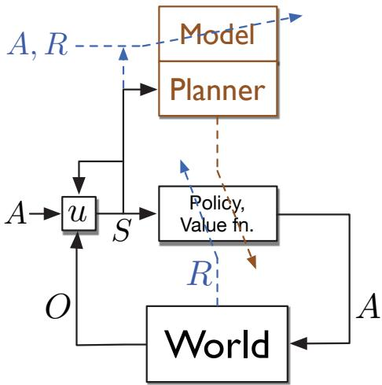

# Chapter 17

# Frontiers

In this final chapter we touch on some topics that are beyond the scope of this book but that we see as particularly important for the future of reinforcement learning. Many of these topics bring us beyond what is reliably known, and some bring us beyond the MDP framework.

# 17.1 General Value Functions and Auxiliary Tasks

Over the course of this book, our notion of value function has become quite general. With off- policy learning we allowed a value function to be conditional on an arbitrary target policy. Then in Section 12.8 we generalized discounting to a termination function  \(\gamma : \mathcal{S} \mapsto [0,1]\) , so that a different discount rate could be applied at each time step in determining the return (12.17). This allowed us to express predictions about how much reward we will get over an arbitrary, state- dependent horizon. The next, and perhaps final, step is to generalize beyond rewards to permit predictions about arbitrary signals. Rather than predicting the sum of future rewards, we might predict the sum of the future values of a sound or color sensation, or of an internal, highly processed signal such as another prediction. Whatever signal is added up in this way in a value- function- like prediction, we call it the cumulant of that prediction. We formalize it in a cumulant signal  \(C_t \in \mathbb{R}\) . Using this, a general value function, or GVF, is written

$$
v_{\pi ,\gamma ,C}(s) = \mathbb{E}\left[\sum_{k = t}^{\infty}\left(\prod_{i = t + 1}^{k}\gamma (S_{i})\right)C_{k + 1}\bigg|S_{t} = s,A_{t:\infty}\sim \eta \right]. \tag{17.1}
$$

As with conventional value functions (such as  \(v_{\pi}\)  or  \(q_{*}\)  ) this is an ideal function that we seek to approximate with a parameterized form, which we might continue to denote  \(\hat{v} (s,\mathbf{w})\)  , although of course there would have to be a different w for each prediction, that is, for each choice of  \(\pi\) \(\gamma\)  , and  \(C\)  . Because a GVF has no necessary connection to reward, it is perhaps a misnomer to call it a value function. You might simply call it a prediction or, to make it more distinctive, a forecast (Ring, in preparation). Whatever it is called, it

is in the form of a value function and thus can be learned in the usual ways using the methods developed in this book for learning approximate value functions. Along with the learned predictions, we might also learn policies to maximize the predictions in the usual ways by Generalized Policy Iteration (Section 4.6) or by actor- critic methods. In this way an agent could learn to predict and control great numbers of signals, not just long- term reward.

Why might it be useful to predict and control signals other than long- term reward? These are auxiliary tasks in that they are extra (in addition to) the main task of maximizing reward. One answer is that the ability to predict and control a diverse multitude of signals can constitute a powerful kind of environmental model. As we saw in Chapter 8, a good model can enable the agent to get reward more efficiently. It takes a couple of further concepts to develop this answer clearly, so we postpone it to the next section. First let's consider two simpler ways in which a multitude of diverse predictions can be helpful to a reinforcement learning agent.

One simple way in which auxiliary tasks can help on the main task is that they may require some of the same representations as are needed on the main task. Some of the auxiliary tasks may be easier, with less delay and a clearer connection between actions and outcomes. If good features can be found early on easy auxiliary tasks, then those features may significantly speed learning on the main task. There is no necessary reason why this has to be true, but in many cases it seems plausible. For example, if you learn to predict and control your sensors over short time scales, say seconds, then you might plausibly come up with part of the idea of physical objects, which would then greatly help with the prediction and control of long- term reward.

We might imagine an artificial neural network (ANN) in which the last layer is split into multiple parts, or heads, each working on a different task. One head might produce the approximate value function for the main task (with reward as its cumulant) whereas the others would produce solutions to various auxiliary tasks. All heads could propagate errors by stochastic gradient descent into the same body—the shared preceding part of the network—which would then try to form representations, in its next- to- last layer, to support all the heads. Researchers have experimented with auxiliary tasks such as predicting change in pixels, predicting the next time step's reward, and predicting the distribution of the return. In many cases this approach has been shown to greatly accelerate learning on the main task (Jaderberg et al., 2017). Multiple predictions have similarly been repeatedly proposed as a way of directing the construction of state estimates (see Section 17.3).

Another simple way in which the learning of auxiliary tasks can improve performance is best explained by analogy to the psychological phenomena of classical conditioning (Section 14.2). One way of understanding classical conditioning is that evolution has built in a reflexive (non- learned) association to a particular action from the prediction of a particular signal. For example, humans and many other animals appear to have a built- in reflex to blink whenever their prediction of being poked in the eye exceeds some threshold. The prediction is learned, but the association from prediction to eye closure is built in, and thus the animal is saved many unprotected pokes in its eye. Similarly, the association from fear to increased heart rate, or to freezing, may be built in. Agent

designers can do something similar, connecting by design (without learning) predictions of specific events to predetermined actions. For example, a self- driving car that learns to predict whether going forward will produce a collision could be given a built- in reflex to stop, or to turn away, whenever the prediction is above some threshold. Or consider a vacuum- cleaning robot that learned to predict whether it might run out of battery power before returning to the charger and that reflexively headed back to the charger whenever the prediction became non- zero. The correct prediction would depend on the size of the house, the room the robot was in, and the age of the battery, all of which would be hard for the robot designer to know. It would be difficult for the designer to build in a reliable algorithm for deciding whether to head back to the charger in sensory terms, but it might be easy to do this in terms of the learned prediction. We foresee many possible ways like this in which learned predictions might combine usefully with built- in algorithms for controlling behavior.

Finally, perhaps the most important role for auxiliary tasks is in moving beyond the assumption we have made throughout this book that the state representation is fixed and given to the agent. To explain this role, we first have to take a few steps back to appreciate the magnitude of this assumption and the implications of removing it. We do that in Section 17.3. .

# 17.2 Temporal Abstraction via Options

An appealing aspect of the MDP formalism is that it can be applied usefully to tasks at many different time scales. It can be used to formalize the task of deciding which muscles to twitch to grasp an object, which airplane flight to take to arrive conveniently at a distant city, and which job to take to lead a satisfying life. These tasks differ greatly in their time scales, yet each can be usefully formulated as an MDP that can be solved by planning or learning processes as described in this book. All involve interaction with the world, sequential decision making, and a goal usefully conceived of as accumulating rewards over time, and so all can be formulated as MDPs.

Although all these tasks can be formulated as MDPs, you might think that they cannot be formulated as a single MDP. They involve such different time scales, such different notions of choice and action! It would be no good, for example, to plan a flight across a continent at the level of muscle twitches. Yet for other tasks- such as grasping objects, throwing darts, or hitting a baseball- low- level muscle twitches may be just the right level. People do all these things seamlessly without appearing to switch between levels. Can the MDP framework be stretched to cover all the levels simultaneously?

Perhaps it can. One popular idea is to formalize an MDP at a detailed level, with a small time step, yet enable planning at higher levels using extended courses of action that correspond to many base- level time steps. To do this we need a notion of course of action that extends over many time steps and includes a notion of termination. A general way to formulate these two ideas is as a policy,  \(\pi\)  , and a state- dependent termination function,  \(\gamma\)  as in GVFs. We define a pair of these as a generalized notion of action termed an option. To execute an option  \(\omega = \langle \pi_{\omega},\gamma_{\omega}\rangle\)  at time  \(t\)  is to obtain the action to take,  \(A_{t}\)  , from  \(\pi_{\omega}(\cdot |S_{t})\)  , then terminate at time  \(t + 1\)  with probability  \(1 - \gamma_{\omega}(S_{t + 1})\)  . If the option does

not terminate at  \(t + 1\)  , then  \(A_{t + 1}\)  is selected from  \(\pi_{\omega}(\cdot |S_{t + 1})\)  , and the option terminates at  \(t + 2\)  with probability  \(1 - \gamma_{\omega}(S_{t + 2})\)  , and so on until eventual termination. It is convenient to consider low- level actions to be special cases of options- each action  \(a\)  corresponds to an option  \(\langle \pi_{\omega},\gamma_{\omega}\rangle\)  whose policy picks the action  \((\pi_{\omega}(s) = a\)  for all  \(s\in \mathcal{S}\)  ) and whose termination function is zero  \((\gamma_{\omega}(s) = 0\)  for all  \(s\in \mathcal{S}^{+}\)  ). Options effectively extend the action space. The agent can either select a low- level action/option, terminating after one time step, or select an extended option that might execute for many time steps before terminating.

Options are designed so that they are interchangeable with low- level actions. For example, the notion of an action- value function  \(q_{\pi}\)  naturally generalizes to an optionvalue function that takes a state and option as input and returns the expected return starting from that state, executing that option to termination, and thereafter following the policy,  \(\pi\)  . We can also generalize the notion of policy to a hierarchical policy that selects from options rather than actions, where options, when selected, execute until termination. With these ideas, many of the algorithms in this book can be generalized to learn approximate option- value functions and hierarchical policies. In the simplest case, the learning process jumps from option initiation to option termination, with an update only occurring when an option terminates. More subtly, updates can be made on each time step, using "intra- option" learning algorithms, which in general require off- policy learning.

Perhaps the most important generalization made possible by option ideas is that of the environmental model as developed in Chapters 3, 4, and 8. The conventional model of an action is the state- transition probabilities and the expected immediate reward for taking the action in each state. How do conventional action models generalise to option models? For options, the appropriate model is again of two parts, one corresponding to the state transition resulting from executing the option and one corresponding to the expected cumulative reward along the way. The reward part of an option model, analogous to the expected reward for state- action pairs (3.5), is

$$
r(s,\omega)\doteq \mathbb{E}\big[R_{1} + \gamma R_{2} + \gamma^{2}R_{3} + \dots +\gamma^{\tau -1}R_{\tau}\big| S_{0} = s,A_{0:\tau -1}\sim \pi_{\omega},\tau \sim \gamma_{\omega}\big], \tag{17.2}
$$

for all options  \(\omega\)  and all states  \(s\in \mathcal{S}\)  , where  \(\tau\)  is the random time step at which the option terminates according to  \(\gamma_{\omega}\)  . Note the role of the overall discounting parameter  \(\gamma\)  in this equation- discounting is according to  \(\gamma\)  , but termination of the option is according to  \(\gamma_{\omega}\)  . The state- transition part of an option model is a little more subtle. This part of the model characterizes the probability of each possible resulting state (as in (3.4)), but now this state may result after various numbers of time steps, each of which must be discounted differently. The model for option  \(\omega\)  specifies, for each state  \(s\)  that  \(\omega\)  might start executing in, and for each state  \(s^{\prime}\)  that  \(\omega\)  might terminate in,

$$
p(s^{\prime}|s,\omega)\doteq \sum_{k = 1}^{\infty}\gamma^{k}\mathrm{Pr}\{S_{k} = s^{\prime},\tau = k\mid S_{0} = s,A_{0:k - 1}\sim \pi_{\omega},\tau \sim \gamma_{\omega}\} . \tag{17.3}
$$

Note that, because of the factor of  \(\gamma^{k}\)  , this  \(p(s^{\prime}|s,\omega)\)  is no longer a transition probability and no longer sums to one over all values of  \(s^{\prime}\)  . (Nevertheless, we continue to use the  \(\langle \mid \rangle\)  notation in  \(p\)  .)

The above definition of the transition part of an option model allows us to formulate Bellman equations and dynamic programming algorithms that apply to all options, including low- level actions as a special case. For example, the general Bellman equation for the state values of a hierarchical policy  \(\pi\)  is

$$
v_{\pi}(s) = \sum_{\omega \in \Omega (s)}\pi (\omega |s)\left[r(s,\omega) + \sum_{s^{\prime}}p(s^{\prime}|s,\omega)v_{\pi}(s^{\prime})\right], \tag{17.4}
$$

where  \(\Omega (s)\)  denotes the set of options available in state  \(s\) . If  \(\Omega (s)\)  includes only the low- level actions, then this equation reduces to a version of the usual Bellman equation (3.14), except of course  \(\gamma\)  is included in the new  \(p\)  (17.3) and thus does not appear. Similarly, the corresponding planning algorithms also have no  \(\gamma\) . For example, the value iteration algorithm with options, analogous to (4.10), is

$$
v_{k + 1}(s) \doteq \max_{\omega \in \Omega (s)}\left[r(s,\omega) + \sum_{s^{\prime}}p(s^{\prime}|s,\omega)v_{k}(s^{\prime})\right], \text{for all} s \in \mathcal{S}.
$$

If  \(\Omega (s)\)  includes all the low- level actions available in each state  \(s\) , then this algorithm converges to the conventional  \(v_{*}\) , from which the optimal policy can be computed. However, it is particularly useful to plan with options when only a subset of the possible options are considered (in  \(\Omega (s)\) ) in each state. Value iteration will then converge to the best hierarchical policy limited to the restricted set of options. Although this policy may be sub- optimal, convergence can be much faster because fewer options are considered and because each option can jump over many time steps.

To plan with options, the agent must either be given the option models, or learn them. One natural way to learn an option model is to formulate it as a collection of GVFs (as defined in the preceding section) and then learn the GVFs using the methods presented in this book. It is not difficult to see how this could be done for the reward part of the option model. You merely choose one GVF's cumulant to be the reward ( \(C_{t} = R_{t}\) ), its policy to be the option's policy ( \(\pi = \pi_{\omega}\) ), and its termination function to be the discount rate times the option's termination function ( \(\gamma (s) = \gamma \cdot \gamma_{\omega}(s)\) ). The true GVF then equals the reward part of the option model,  \(v_{\pi ,\gamma ,C}(s) = r(s,\omega)\) , and the learning methods described in this book can be used to approximate it. The state- transition part of the option model is a little more complicated. You need to allocate one GVF for each state that the option might terminate in. We don't want these GVFs to accumulate anything except when the option terminates, and then only when termination is in the appropriate state. This can be achieved by choosing the cumulant of the GVF that predicts transition to state  \(s^{\prime}\)  to be  \(C_{t} = (1 - \gamma_{\omega}(S_{t}))\mathbb{1}_{S_{t} = s^{\prime}}\) . The GVF's policy and termination functions are chosen the same as for the reward part of the option model. The true GVF then equals the  \(s^{\prime}\)  portion of the option's state- transition model,  \(v_{\pi ,\gamma ,C}(s) = p(s^{\prime}|s,\omega)\) , and again this book's methods could be employed to learn it. Although each of these steps is seemingly natural, putting them all together (including function approximation and other essential components) is quite challenging and beyond the current state of the art.

Exercise 17.1 This section has presented options for the discounted case, but discounting is arguably inappropriate for control when using function approximation (Section 10.4). What is the natural Bellman equation for a hierarchical policy, analogous to (17.4), but for the average reward setting (Section 10.3)? What are the two parts of the option model, analogous to (17.2) and (17.3), for the average reward setting?  \(\square\)

# 17.3 Observations and State

Throughout this book we have written the learned approximate value functions (and the policies in Chapter 13) as functions of the environment's state. This is a significant limitation of the methods presented in Part I, in which the learned value function was implemented as a table such that any value function could be exactly approximated; that case is tantamount to assuming that the state of the environment is completely observed by the agent. But in many cases of interest, and certainly in the lives of all natural intelligences, the sensory input gives only partial information about the state of the world. Some objects may be occluded by others, or behind the agent, or miles away. In these cases, potentially important aspects of the environment's state are not directly observable, and it is a strong, unrealistic, and limiting assumption to assume that the learned value function is implemented as a table over the environment's state space.

The framework of parametric function approximation that we developed in Part II is far less restrictive and, arguably, no limitation at all. In Part II we retained the assumption that the learned value functions (and policies) are functions of the environment's state, but allowed these functions to be arbitrarily restricted by the parameterization. It is somewhat surprising and not widely recognized that function approximation includes important aspects of partial observability. For example, if there is a state variable that is not observable, then the parameterization can be chosen such that the approximate value does not depend on that state variable. The effect is just as if the state variable were not observable. Because of this, all the results obtained for the parameterized case apply to partial observability without change. In this sense, the case of parameterized function approximation includes the case of partial observability.

Nevertheless, there are many issues that cannot be investigated without a more explicit treatment of partial observability. Although we cannot give them a full treatment here, we can outline the changes that would be needed to do so. There are four steps.

First, we would change the problem. The environment would emit not its states, but only observations—signals that depend on its state but, like a robot's sensors, provide only partial information about it. For convenience, without loss of generality, we assume that the reward is a direct, known function of the observation (perhaps the observation is a vector, and the reward is one of its components). The environmental interaction would then have no explicit states or rewards, but could simply be an alternating sequence of actions  \(A_{t} \in \mathcal{A}\)  and observations  \(O_{t} \in \mathcal{O}\) :

$$
A_{0}, O_{1}, A_{1}, O_{2}, A_{2}, O_{3}, A_{3}, O_{4}, \ldots ,
$$

going on forever (cf. Equation 3.1) or forming episodes each ending with a special terminal observation.

Second, we can recover the idea of state as used in this book from the sequence of observations and actions. Let us use the word history, and the notation  \(H_{t}\) , for an initial portion of the trajectory up to an observation:  \(H_{t} \doteq A_{0}, O_{1}, \ldots , A_{t - 1}, O_{t}\) . The history represents the most that we can know about the past without looking outside of the data stream (because the history is the whole past data stream). Of course, the history grows with  \(t\)  and can become large and unwieldy. The idea of state is that of a compact summary of the history that is useful for predicting future sequences. To be a summary of the history, a state must be a function of history,  \(S_{t} = f(H_{t})\) . The summary would be informationally perfect if it retained all information about the history (and thus could be used to predict futures as accurately as could be done from the full history). In this case, the state  \(S_{t}\)  and the function  \(f\)  are said to have the Markov property, and  \(S_{t}\)  is a state as we have used the term in this book. Let us henceforth call it a Markov state to distinguish it from states that are summaries of the history but are not sufficient to predict all futures. In practice, the states of real agents will not be Markov but may approach it as an ideal.

To be more explicit about the Markov property it is useful to formalize possible futures. Let a test be any specific sequence of alternating actions and observations that might occur in the future. For example, a three- step test might be denoted  \(\tau = a_{1}o_{1}a_{2}o_{2}a_{3}o_{3}\) . The probability of this test given a specific history  \(h\)  is defined as

$$
p(\tau |h) \doteq \operatorname *{Pr}\{O_{t + 1} = o_{1}, O_{t + 2} = o_{2}, O_{t + 3} = o_{3} \mid H_{t} = h, A_{t} = a_{1}, A_{t + 1} = a_{2}, A_{t + 2} = a_{3}\} . \tag{17.5}
$$

Formally,  \(f\)  is Markov if and only if, for any test  \(\tau\) , and for any histories  \(h\)  and  \(h'\)  that map to the same state under  \(f\) , the test's probabilities given the two histories are equal:

$$
f(h) = f(h^{\prime}) \Rightarrow p(\tau |h) = p(\tau |h^{\prime}), \qquad \text{for all} h, h^{\prime}, \tau \in \{\mathcal{A} \times \mathcal{O}\}^{*}. \tag{17.6}
$$

A Markov state summarizes all the information in the history necessary for determining any test's probability. In fact, it summarizes all that is necessary for making any prediction, including any GVR. It also summarizes all that is necessary for optimal behavior: if  \(f\)  is Markov, then there is always a deterministic function  \(\pi\)  such that choosing  \(A_{t} \doteq \pi (f(H_{t}))\)  is an optimal policy.

The third step in extending reinforcement learning to partial observability is to deal with certain computational considerations. As mentioned earlier, we want the state to be compact—relatively small compared to the history. (The identity function, for example, is not a good  \(f\)  even though it is Markov, because the corresponding state  \(S_{t} = H_{t}\)  would grow unboundedly with time.) In addition, we don't really want a function  \(f\)  that takes whole histories. Instead, we want an  \(f\)  that can be compactly implemented with an incremental, recursive update that computes  \(S_{t + 1}\)  from  \(S_{t}\) , incorporating only the next increment of data,  \(A_{t}\)  and  \(O_{t + 1}\) :

$$
S_{t + 1} \doteq u(S_{t}, A_{t}, O_{t + 1}), \text{for all} t \geq 0, \tag{17.7}
$$

with the first state  \(S_{0}\)  given. The function  \(u\)  is called the state- update function. For example, if  \(f\)  were the identity (  \(S_{t} = H_{t}\)  ), then  \(u\)  would merely extend  \(S_{t}\)  by appending  \(A_{t}\)  and  \(O_{t + 1}\)  to it. Given  \(f\)  , it is always possible to construct a corresponding  \(u\)  , but it may

  
Figure 17.1: A conceptual agent architecture including a model, a planner, and a state-update function. The world in this case receives actions  \(A\)  and emits observations  \(O\) . The observations and a copy of the action are used by the state-update function  \(u\)  to produce the new state. The new state is input to the policy and value function, producing the next action, and is also input to the planner (and to  \(u\) ). The information flows most responsible for learning are shown by dashed lines that pass diagonally across the boxes that they change. The reward  \(R\)  directly changes the policy and value function. The action, reward, and state change the model, which works closely with the planner to also change the policy and value function. Note that the operation of the planner can be decoupled from the agent-environment interaction, whereas the other processes should operate in lock step with this interaction to keep up with the arrival of new data. Also note that the model and planner do not deal with observations directly, but only with the states produced by  \(u\) , which can act as targets for model learning.

not be computationally convenient and, as in the identity example, it may not produce a compact state. The state- update function is a central part of any agent architecture that handles partial observability. It must be efficiently computable, as no actions or predictions can be made until the state is available. An overall diagram of such an agent architecture is given in Figure 17.1.

A common strategy for finding a Markov state is to look for something compact that is recursively updatable and enables accurate short- term predictions. In fact, it is only necessary to make accurate one- step predictions. An important fact is that, if an  \(f\)  is incrementally updatable, then it is Markov if and only if all one- step tests can be accurately predicted, that is, if and only if

$$
f(h) = f(h^{\prime}) \Rightarrow \operatorname *{Pr}\{O_{t + 1} = o|H_{t} = h,A_{t} = a\} = \operatorname *{Pr}\{O_{t + 1} = o|H_{t} = h^{\prime},A_{t} = a\} , \tag{17.8}
$$

for all  \(h, h^{\prime} \in \{A \times \mathcal{O}\}^{*}\) ,  \(o \in \mathcal{O}\)  and  \(a \in \mathcal{A}\) . Accurate one- step predictions are informationally sufficient, together with the state- update function, to accurately predict the probability of any test of any length. This can be done by iteratively and alternately making one- step predictions and applying the state- update function. From the whole tree of possibilities the exact probability of any test or the expectation of any GVF can be determined. These observations have led many researchers to focus on one- step predictions rather than directly on multi- step predictions such as GVFs. However, note

that determining long- term predictions from single- step predictions is exponentially complex in the length of the predictions. Moreover, one- step predictions can be iterated to give accurate long- term predictions only if they are exact. If there is any error or approximation in the one- step predictions, then it can compound to make the long- term predictions wildly inaccurate. In practice this is often what happens.

An example of obtaining Markov states through a state- update function is provided by the popular Bayesian approach known as Partially Observable  \(MDPs\) , or  \(POMDPs\) . In this approach the environment is assumed to have a well defined latent state  \(X_{t}\)  that underlies and produces the environment's observations, but is never available to the agent (and is not to be confused with the state  \(S_{t}\)  used by the agent to make predictions and decisions). The natural Markov state,  \(S_{t}\) , for a POMDP is the distribution over the latent states given the history, called the belief state. For concreteness, assume the usual case in which there are a finite number of hidden states,  \(X_{t} \in \{1,2,\ldots ,d\}\) . Then the belief state is the vector  \(S_{t} \doteq s_{t} \in [0,1]^{d}\)  with components

$$
\mathbf{s}_t[i]\doteq \operatorname *{Pr}\{X_t = i\mid H_t\} \mathrm{,~for~all~possible~latent~states~}i\in \{1,2,\ldots ,d\} . \tag{17.9}
$$

The belief state remains the same size (same number of components) even as  \(t\)  grows. It can also be incrementally updated by Bayes' rule, assuming complete knowledge of the internal workings of the environment. Specifically, the  \(i\) th component of the belief- state update function is

$$
u(\mathbf{s},a,o)[i]\doteq \frac{\sum_{x = 1}^{d}\mathbf{s}[x]p(i,o|x,a)}{\sum_{x = 1}^{d}\sum_{x' = 1}^{d}\mathbf{s}[x]p(x',o|x,a)},\quad \mathrm{for~all~}a\in \mathcal{A},o\in \mathcal{O}, \tag{17.10}
$$

and for all belief states  \(\mathbf{s}\)  with components  \(\mathbf{s}[x]\) , where the four- argument  \(p\)  function here is not the usual one for MDPs (as in Chapter 3), but the analogous one for POMDPs, in terms of the latent state:  \(p(x',o|x,a) \doteq \operatorname *{Pr}\{X_{t} = x',O_{t} = o\mid X_{t - 1} = x,A_{t - 1} = a\}\) . This approach is popular in theoretical work and has many significant applications, but its assumptions and computational complexity scale poorly, and we do not recommend it as an approach to artificial intelligence.

Another example of Markov states is provided by Predictive State Representations, or PSRs. PSRs address the weakness of the POMDP approach that the semantics of its agent state  \(S_{t}\)  are grounded in the environment state,  \(X_{t}\) , which is never observed and thus is difficult to learn about. In PSRs and related approaches, the semantics of the agent state is instead grounded in predictions about future observations and actions, which are readily observable. In PSRs, a Markov state is defined as a  \(d\) - vector of the probabilities of  \(d\)  specially chosen "core" tests as defined above (17.5). The vector is then updated by a state- update function  \(u\)  that is analogous to Bayes rule, but with a semantics grounded in observable data, which arguably makes it easier to learn. This approach has been extended in many ways, including end- tests, compositional tests, powerful "spectral" methods, and closed- loop and temporally abstract tests learned by TD methods. Some of the best theoretical developments are for systems known as Observable Operator Models (OOMs) and Sequential Systems (Thon, 2017).

The fourth and final step in our brief outline of how to handle partial observability in reinforcement learning is to re- introduce approximation. As discussed in the introduction

to Part II, to approach artificial intelligence ambitiously we must embrace approximation. This is just as true for states as it is for value functions. We must accept and work with an approximate notion of state. The approximate state will play the same role in our algorithms as before, so we continue to use the notation  \(S_{t}\)  for the state used by the agent, even though it may not be Markov.

Perhaps the simplest example of an approximate state is just the latest observation,  \(S_{t} \doteq O_{t}\) . Of course this approach cannot handle any hidden state information. It would be better to use the last  \(k\)  observations and actions,  \(S_{t} \doteq O_{t}\) ,  \(A_{t - 1}\) ,  \(O_{t - 1}, \ldots , A_{t - k}\) , for some  \(k \geq 1\) , which can be achieved by a state- update function that just shifts the new data in and the oldest data out. This  \(k\) th- order history approach is still very simple, but can greatly increase the agent's capabilities compared to trying to use the single immediate observation directly as the state.

What happens when the Markov property (17.8) is only approximately satisfied? Unfortunately, long- term prediction performance can degrade dramatically when one- step predictions become even slightly inaccurate. Longer- term tests, GVFs, and state- update functions may or may not approximate better. The short- term and long- term approximation objectives are just different, and there are no useful theoretical guarantees at present.

Nevertheless, there are still reasons to think that the general idea outlined in this section applies to the approximate case. The general idea is that a state that is good for some predictions is also good for others—in particular, that a Markov state, sufficient for one- step predictions, is also sufficient for all others. If we step back from that specific result for the Markov case, the general idea is similar to what we discussed in Section 17.1 with multi- headed learning and auxiliary tasks. We discussed how representations that were good for the auxiliary tasks were often also good for the main task. Taken together, these suggest an approach to both partial observability and representation learning in which multiple predictions are pursued and used to direct the construction of state features. The guarantee provided by the perfect- but- impractical Markov property is replaced by the heuristic that what's good for some predictions may be good for others. This approach scales well with computational resources. With a powerful computer we could experiment with large numbers of predictions, perhaps favoring those that are most similar to the ones of ultimate interest, that are easiest to learn reliably, or that satisfy other criteria. It is important here to move beyond selecting the predictions manually. The agent should do it. This would require a general language for predictions, so that the agent can systematically explore a large space of possible predictions, sifting through them for the ones that are most useful.

In particular, both POMDP and PSR approaches can be applied with approximate states. The semantics of the state is often useful in forming the state- update function, as it is in these two approaches and in the  \(k\) th- order history approach. However, there is not a strong need for the state to be accurate with respect to its semantics in order to retain useful information. Some approaches to state augmentation, such as Echo state networks (Jaeger, 2002), keep almost arbitrary information about the history and can nevertheless perform well. There are many possibilities, and we expect more work and ideas in this area. Learning the state- update function for an approximate state is a major part of the representation learning problem as it arises in reinforcement learning.

# 17.4 Designing Reward Signals

A major advantage of reinforcement learning over supervised learning is that reinforcement learning does not rely on detailed instructional information; generating a reward signal does not depend on knowledge of what the agent's correct actions should be. But the success of a reinforcement learning application strongly depends on how well the reward signal frames the goal of the application's designer and how well the signal assesses progress in reaching that goal. For these reasons, designing a reward signal is a critical part of any application of reinforcement learning.

By designing a reward signal we mean designing the part of an agent's environment that is responsible for computing each scalar reward  \(R_{t}\)  and sending it to the agent at each time  \(t\)  . In our discussion of terminology at the end of Chapter 14, we said that  \(R_{t}\)  is more like a signal generated inside an animal's brain than it is like an object or event in the animal's external environment. The parts of our brains that generate these signals for us evolved over millions of years to be well suited to the challenges our ancestors had to face in their struggles to propagate their genes to future generations. We should therefore not think that designing a good reward signal is always an easy thing to do!

One challenge is to design a reward signal so that as an agent learns, its behavior approaches, and ideally eventually achieves, what the application's designer actually desires. This can be easy if the designer's goal is simple and easy to identify, such as finding the solution to a well- defined problem or earning a high score in a well- defined game. In cases like these, it is usual to reward the agent according to its success in solving the problem or its success in improving its score. But some problems involve goals that are difficult to translate into reward signals. This is especially true when the problem requires the agent to skillfully perform a complex task or set of tasks, such as would be required of a useful household robotic assistant. Further, reinforcement learning agents can discover unexpected ways to make their environments deliver reward, some of which might be undesirable, or even dangerous. This is a longstanding and critical challenge for any method, like reinforcement learning, that is based on optimization. We discuss this issue more in Section 17.6, the final section of this book.

Even when there is a simple and easily identifiable goal, the problem of sparse reward often arises. Delivering non- zero reward frequently enough to allow the agent to achieve the goal once, let alone to learn to achieve it efficiently from multiple initial conditions, can be a daunting challenge. State- action pairs that clearly deserve to trigger reward may be few and far between, and rewards that mark progress toward a goal can be infrequent because progress is difficult or even impossible to detect. The agent may wander aimlessly for long periods of time (what Minsky, 1961, called the "plateau problem").

In practice, designing a reward signal is often left to an informal trial- and- error search for a signal that produces acceptable results. If the agent fails to learn, learns too slowly, or learns the wrong thing, then the designer tweaks the reward signal and tries again. To do this, the designer judges the agent's performance by criteria that he or she is attempting to translate into a reward signal so that the agent's goal matches his or her own. And if learning is too slow, the designer may try to design a non- sparse reward signal that effectively guides learning throughout the agent's interaction with its environment.

It is tempting to address the sparse reward problem by rewarding the agent for achieving subgoals that the designer thinks are important way stations to the overall goal. But augmenting the reward signal with well- intentioned supplemental rewards may lead the agent to behave differently from what is intended; the agent may end up not achieving the overall goal. A better way to provide such guidance is to leave the reward signal alone and instead augment the value- function approximation with an initial guess of what it should ultimately be, or augment it with initial guesses as to what certain parts of it should be. For example, suppose we wants to offer  \(v_{0}: \mathcal{S} \to \mathbb{R}\)  as an initial guess at the true optimal value function  \(v_{*}\) , and that we are using linear function approximation with features  \(\mathbf{x}: \mathcal{S} \to \mathbb{R}^{d}\) . Then we would define the initial value function approximation as

$$
\hat{v} (s, \mathbf{w}) \doteq \mathbf{w}^{\top} \mathbf{x}(s) + v_{0}(s), \tag{17.11}
$$

and update the weights  \(\mathbf{w}\)  as usual. If the initial weight vector is  \(\mathbf{0}\) , then the initial value function will be  \(v_{0}\) , but the asymptotic solution quality will be determined by the feature vectors as usual. This initialization can also be done for arbitrary nonlinear approximators and arbitrary forms of  \(v_{0}\) , though it is not guaranteed to always accelerate learning.

A particularly effective approach to the sparse reward problem is the shaping technique introduced by the psychologist B. F. Skinner and described in Section 14.3. The effectiveness of this technique relies on the fact that sparse reward problems are not just problems with the reward signal; they are also problems with an agent's policy in that it prevents the agent from frequently encountering rewarding states. Shaping involves changing the reward signal as learning proceeds, starting from a reward signal that is not sparse given the agent's initial behavior, and gradually modifying it toward a reward signal suited to the problem of original interest. Shaping might also involve modifying the dynamics of the task as learning proceeds. Each modification is made so that the agent is frequently rewarded given its current behavior. The agent faces a sequence of increasingly- difficult reinforcement learning problems, where what is learned at each stage makes the next- harder problem relatively easy because the agent now encounters reward more frequently than it would if it did not have prior experience with easier problems. This kind of shaping is an essential technique in training animals, and it is effective in computational reinforcement learning as well.

What if you have no idea what the rewards should be, but there is another agent, perhaps a person, who is already expert at the task and whose behavior can be observed? In this case you could use methods known variously as "imitation learning," "learning from demonstration," and "apprenticeship learning." The idea here is to benefit from the expert agent but leave open the possibility of eventually performing better. Learning from an expert's behavior can be done either by learning directly by supervised learning or by extracting a reward signal using what is known as "inverse reinforcement learning" and then using a reinforcement learning algorithm with that reward signal to learn a policy. The task of inverse reinforcement learning as explored by Ng and Russell (2000) is to try to recover the expert's reward signal from the expert's behavior alone. This cannot be done exactly because a policy can be optimal with respect to many different reward signals (for example, all policies are optimal with respect to a constant reward signal), but it is possible to find plausible reward signal candidates. Unfortunately, strong

assumptions are required, including knowledge of the environment's dynamics and of the feature vectors in which the reward signal is linear. The method also requires completely solving the problem (e.g., by dynamic programming methods) multiple times. These difficulties notwithstanding, Abbeel and Ng (2004) argue that the inverse reinforcement learning approach can sometimes be more effective than supervised learning for benefiting from the behavior of an expert.

Another approach to finding a good reward signal is to automate the trial- and- error search for a good signal that we mentioned above. From an application perspective, the reward signal is a parameter of the learning algorithm. As is true for other algorithm parameters, the search for a good reward signal can be automated by defining a space of feasible candidates and applying an optimization algorithm. The optimization algorithm evaluates each candidate reward signal by running the reinforcement learning system with that signal for some number of steps, and then scoring the overall result by a "high- level" objective function intended to encode the designer's true goal, ignoring the limitations of the agent. Reward signals can even be improved via online gradient ascent, where the gradient is that of the high- level objective function (Sorg, Lewis, and Singh, 2010). Relating this approach to the natural world, the algorithm for optimizing the high- level objective function is analogous to evolution, where the high- level objective function is an animal's evolutionary fitness determined by the number of its offspring that survive to reproductive age.

Computational experiments with this bilevel optimization approach—one level analogous to evolution, and the other due to reinforcement learning by individual agents—have confirmed that intuition alone is not always adequate to devise a good reward signal (Singh, Lewis, and Barto, 2009). The performance of a reinforcement learning agent as evaluated by the high- level objective function can be very sensitive to details of the agent's reward signal in subtle ways determined by the agent's limitations and the environment in which it acts and learns. These experiments have also demonstrated that an agent's goal should not always be the same as the goal of the agent's designer.

At first this seems counterintuitive, but it may be impossible for the agent to achieve the designer's goal no matter what its reward signal is. The agent has to learn under various kinds of constraints, such as limited computational power, limited access to information about its environment, or limited time to learn. When there are constraints like these, learning to achieve a goal that is different from the designer's goal can sometimes end up getting closer to the designer's goal than if that goal were pursued directly (Sorg, Singh, and Lewis, 2010; Sorg, 2011). Examples of this in the natural world are easy to find. Because we cannot directly assess the nutritional value of most foods, evolution—the designer of our reward signal—gave us a reward signal that makes us seek certain tastes. Though certainly not infallible (indeed, possibly detrimental in environments that differ in certain ways from ancestral environments), this compensates for many of our limitations: our limited sensory abilities, the limited time over which we can learn, and the risks involved in finding a healthy diet through personal experimentation. Similarly, because an animal cannot always observe its own evolutionary fitness, that objective function does not work as a reward signal for learning. Evolution instead provides reward signals that are sensitive to observable predictors of evolutionary fitness.

Finally, remember that a reinforcement learning agent is not necessarily like a complete

organism or robot; it can be a component of a larger behaving system. This means that reward signals may be influenced by things inside the larger behaving agent, such as motivational states, memories, ideas, or even hallucinations. Reward signals may also depend on properties of the learning process itself, such as measures of how much progress learning is making. Making reward signals sensitive to information about internal factors such as these makes it possible for an agent to learn how to control the "cognitive architecture" of which it is a part, as well as to acquire knowledge and skills that would be difficult to learn from a reward signal that depended only on external events. Possibilities like these led to the idea of "intrinsically- motivated reinforcement learning" that we briefly discuss further at the end of the following section.

# 17.5 Remaining Issues

In this book we have presented the foundations of a reinforcement learning approach to artificial intelligence. Roughly speaking, that approach is based on model- free and model- based methods working together, as in the Dyna architecture of Chapter 8, combined with function approximation as developed in Part II. The focus has been on online and incremental algorithms, which we see as fundamental even to model- based methods, and on how these can be applied in off- policy training situations. The full rationale for the latter has been presented only in this last chapter. That is, we have all along presented off- policy learning as an appealing way to deal with the explore/exploit dilemma, but only in this chapter have we discussed learning about many diverse auxiliary tasks simultaneously with GVFs and learning about the world hierarchically in terms of temporally- abstract option models, both of which involve off- policy learning. Much remains to be worked out, as we have indicated throughout the book and as evidenced by the directions for additional research discussed in this chapter. But suppose we are generous and grant the broad outlines of everything that we have done in the book and everything that has been outlined so far in this chapter. What would remain after that? Of course we can't know for sure what will be required, but we can make some guesses. In this section we highlight six further issues which it seems to us will still need to be addressed by future research.

First, we still need powerful parametric function approximation methods that work well in fully incremental and online settings. Methods based on deep learning and ANNs are a major step in this direction but, still, only work well with batch training on large data sets, with training from extensive off- line self play, or with learning from the interleaved experience of multiple agents on the same task. These and other settings are ways of working around a basic limitation of today's deep learning methods, which struggle to learn rapidly in the incremental, online settings that are most natural for the reinforcement learning algorithms emphasized in this book. The problem is sometimes described as one of "catastrophic interference" or "correlated data." When something new is learned it tends to replace what has previously been learned rather than adding to it, with the result that the benefit of the older learning is lost. Techniques such as "replay buffers" are often used to retain and replay old data so that its benefits are not permanently lost. An honest assessment has to be that current deep learning methods are not well suited to online learning. We see no reason that this limitation is insurmountable, but algorithms

that address it, while at the same time retaining the advantages of deep learning, have not yet been devised. Most current deep learning research is directed toward working around this limitation rather than removing it.

Second (and perhaps closely related), we still need methods for learning features such that subsequent learning generalizes well. This issue is an instance of a general problem variously called "representation learning," "constructive induction," and "meta- learning"—how can we use experience not just to learn a given desired function, but to learn inductive biases such that future learning generalizes better and is thus faster? This is an old problem, dating back to the origins of artificial intelligence and pattern recognition in the 1950s and 1960s.1 Such age should give one pause. Perhaps there is no solution. But it is equally likely that the time for finding a solution and demonstrating its effectiveness has not yet arrived. Today machine learning is conducted at a far larger scale than it has been in the past, and the potential benefits of a good representation learning method have become much more apparent. We note that a new annual conference—the International Conference on Learning Representations—has been exploring this and related topics every year since 2013. It is also less common to explore representation learning within a reinforcement learning context. Reinforcement learning brings some new possibilities to this old issue, such as the auxiliary tasks discussed in Section 17.1. In reinforcement learning, the problem of representation learning can be identified with the problem of learning the state- update function discussed in Section 17.3.

Third, we still need scalable methods for planning with learned environment models. Planning methods have proven extremely effective in applications such as AlphaGo Zero and computer chess in which the model of the environment is known from the rules of the game or can otherwise be supplied by human designers. But cases of full model- based reinforcement learning, in which the environment model is learned from data and then used for planning, are rare. The Dyna system described in Chapter 8 is one example, but as described there and in most subsequent work it uses a tabular model without function approximation, which greatly limits its applicability. Only a few studies have included learned linear models, and even fewer have also explored the inclusion of temporally- abstract models using options as discussed in Section 17.2.

More work is needed before planning with learned models can be effective. For example, the learning of the model needs to be selective because the scope of a model strongly affects planning efficiency. If a model focuses on the key consequences of the most important options, then planning can be efficient and rapid, but if a model includes details of unimportant consequences of options that are unlikely to be selected, then planning may be almost useless. Environment models should be constructed judiciously with regard to both their states and dynamics with the goal of optimizing the planning process. The various parts of the model should be continually monitored as to the degree to which they contribute to, or detract from, planning efficiency. The field has not yet addressed this complex of issues or designed model- learning methods that take into account their implications.

A fourth issue that needs to be addressed in future research is that of automating the choice of tasks on which an agent works and uses to structure its developing competence. It is usual in machine learning for human designers to set the tasks that the learning agent is expected to master. Because these tasks are known in advance and remain fixed, they can be built into the learning algorithm code. However, looking ahead, we will want the agent to make its own choices about what tasks it should try to master. These might be subtasks of a specific overall task that is already known, or they might be intended to create building blocks that permit more efficient learning of many different tasks that the agent is likely to face in the future but which are currently unknown.

These tasks may be like the auxiliary tasks or the GVFs discussed in Section 17.1, or tasks solved by options as discussed in Section 17.2. In forming a GVF, for example, what should the cumulant, the policy, and the termination function be? The current state of the art is to select these manually, but far greater power and generality would come from making these task choices automatically, particularly when they derive from what the agent has previously constructed as a result of representation learning or experience with previous subproblems. If GVF design is automated, then the design choices themselves will have to be explicitly represented. Rather than the task choices being in the mind of the designer and built into the code, they will have to be in the machine itself in such a way that they can be set and changed, monitored, filtered, and searched among automatically. Tasks could then be built hierarchically upon others much like features are in an ANN. The tasks are the questions, and the contents of the ANN are the answers to those questions. We expect there will need to be a full hierarchy of questions to match the hierarchy of answers provided by modern deep learning methods.

The fifth issue that we would like to highlight for future research is that of the interaction between behavior and learning via some computational analog of curiosity. In this chapter we have been imagining a setting in which many tasks are being learned simultaneously, using off- policy methods, from the same stream of experience. The actions taken will of course influence this stream of experience, which in turn will determine how much learning occurs and which tasks are learned. When reward is not available, or not strongly influenced by behavior, the agent is free to choose actions that maximize in some sense the learning on the tasks, that is, to use some measure of learning progress as an internal or "intrinsic" reward, implementing a computational form of curiosity. In addition to measuring learning progress, intrinsic reward can, among other possibilities, signal the receipt of unexpected, novel, or otherwise interesting input, or can assess the agent's ability to cause changes in its environment. Intrinsic reward signals generated in these ways can be used by an agent to pose tasks for itself by defining auxiliary tasks, GVFs, or options, as discussed above, so that skills learned in this way can contribute to the agent's ability to master future tasks. The result is a computational analog of something like play. Many preliminary studies of such uses of intrinsic reward signals have been conducted, and exciting topics for future research remain in this general area.

A final issue that demands attention in future research is that of developing methods to make it acceptably safe to embed reinforcement learning agents into physical environments. This is one of the most pressing areas for future research, and we discuss it further in the following section.

# 17.6 Reinforcement Learning and the Future of Artificial Intelligence

When we were writing the first edition of this book in the mid- 1990s, artificial intelligence was making significant progress and was having an impact on society, though it was mostly still the promise of artificial intelligence that was inspiring developments. Machine learning was part of that outlook, but it had not yet become indispensable to artificial intelligence. By today that promise has transitioned to applications that are changing the lives of millions of people, and machine learning has come into its own as a key technology. As we write this second edition, some of the most remarkable developments in artificial intelligence have involved reinforcement learning, most notably "deep reinforcement learning"—reinforcement learning with function approximation by deep artificial neural networks. We are at the beginning of a wave of real- world applications of artificial intelligence, many of which will include reinforcement learning, deep and otherwise, that will impact our lives in ways that are hard to predict.

But an abundance of successful real- world applications does not mean that true artificial intelligence has arrived. Despite great progress in many areas, the gulf between artificial intelligence and the intelligence of humans, and other animals, remains great. Superhuman performance can be achieved in some domains, even formidable domains like Go, but it remains a significant challenge to develop systems that are like us in being complete, interactive agents having general adaptability and problem- solving skills, emotional sophistication, creativity, and the ability to learn quickly from experience. With its focus on learning by interacting with dynamic environments, reinforcement learning, as it develops over the future, will be a critical component of agents with these abilities.

Reinforcement learning's connections to psychology and neuroscience (Chapters 14 and 15) underscore its relevance to another longstanding goal of artificial intelligence: shedding light on fundamental questions about the mind and how it emerges from the brain. Reinforcement learning theory is already contributing to our understanding of the brain's reward, motivation, and decision- making processes, and there is good reason to believe that through its links to computational psychiatry, reinforcement learning theory will contribute to methods for treating mental disorders, including drug abuse and addiction.

Another contribution that reinforcement learning can make over the future is as an aid to human decision making. Policies derived by reinforcement learning in simulated environments can advise human decision makers in such areas as education, healthcare, transportation, energy, and public- sector resource allocation. Particularly relevant is the key feature of reinforcement learning that it takes long- term consequences of decisions into account. This is very clear in games like backgammon and Go, where some of the most impressive results of reinforcement learning have been demonstrated, but it is also a property of many high- stakes decisions that affect our lives and our planet. Reinforcement learning follows related methods for advising human decision making that have been developed in the past by decision analysts in many disciplines. With advanced function approximation methods and massive computational power, reinforcement learning

methods have the potential to overcome some of the difficulties of scaling up traditional decision- support methods to larger and more complex problems.

The rapid pace of advances in artificial intelligence has led to warnings that artificial intelligence poses serious threats to our societies, even to humanity itself. The renowned scientist and artificial intelligence pioneer Herbert Simon anticipated the warnings we are hearing today in a presentation at the Earthware Symposium at CMU in 2000 (Simon, 2000). He spoke of the eternal conflict between the promise and perils of any new knowledge, reminding us of the Greek myths of Prometheus, the idealized hero of modern science, who stole fire from the gods for the benefit of mankind, and of Pandora, whose mythical box could be opened by a small and innocent action to release untold perils on the world. While accepting that this conflict is inevitable, Simon urged us to recognize that as designers of our future and not mere spectators, the decisions we make can tilt the scale in Prometheus' favor. This is certainly true for reinforcement learning, which can benefit society but can also produce undesirable outcomes if it is carelessly deployed. Thus, the safety of artificial intelligence applications involving reinforcement learning is a topic that deserves careful attention.

A reinforcement learning agent can learn by interacting with either the real world or with a simulation of some piece of the real world, or by a mixture of these two sources of experience. Simulators provide safe environments in which an agent can explore and learn without risking real damage to itself or to its environment. In most current applications, policies are learned from simulated experience instead of direct interaction with the real world. In addition to avoiding undesirable real- world consequences, learning from simulated experience can make virtually unlimited data available for learning, generally at less cost than needed to obtain real experience, and because simulations typically run much faster than real time, learning can often occur more quickly than if it relied on real experience.

Nevertheless, the full potential of reinforcement learning requires reinforcement learning agents to be embedded into the flow of real- world experience, where they act, explore, and learn in our world, and not just in their worlds. After all, reinforcement learning algorithms—at least those upon which we focus in this book—are designed to learn online, and they emulate many aspects of how animals are able to survive in nonstationary and hostile environments. Embedding reinforcement learning agents in the real world can be transformative in realizing the promises of artificial intelligence to amplify and extend human abilities.

A major reason for wanting a reinforcement learning agent to act and learn in the real world is that it is often difficult, sometimes impossible, to simulate real- world experience with enough fidelity to make the resulting policies, whether derived by reinforcement learning or by other methods, work well—and safely—when directing real actions. This is especially true for environments whose dynamics depend on the behavior of humans, such as in education, healthcare, transportation, and public policy—domains that can surely benefit from improved decision making. However, it is for real- world embedded agents that warnings about potential dangers of artificial intelligence need to be heeded.

Some of these warnings are particularly relevant to reinforcement learning. Because reinforcement learning is based on optimization, it inherits the plusses and minuses of all optimization methods. On the minus side is the problem of devising objective functions,

or reward signals in the case of reinforcement learning, so that optimization produces the desired results while avoiding undesirable results. We said in Section 17.4 that reinforcement learning agents can discover unexpected ways to make their environments deliver reward, some of which might be undesirable, or even dangerous. When we specify what we want a system to learn only indirectly, as we do in designing a reinforcement learning system's reward signal, we will not know how closely the agent will fulfill our desire until its learning is complete. This is hardly a new problem with reinforcement learning; recognition of it has a long history in both literature and engineering. For example, in Goethe's poem "The Sorcerer's Apprentice" (Goethe, 1878), the apprentice uses magic to enchant a broom to do his job of fetching water, but the result is an unintended flood due to the apprentice's inadequate knowledge of magic. In the engineering context, Norbert Wiener, the founder of cybernetics, warned of this problem more than half a century ago by relating the supernatural story of "The Monkey's Paw" (Wiener, 1964): "... it grants what you ask for, not what you should have asked for or what you intend" (p. 59). The problem has also been discussed at length in a modern context by Nick Bostrom (2014). Anyone having experience with reinforcement learning has likely seen their systems discover unexpected ways to obtain a lot of reward. Sometimes the unexpected behavior is good: it solves a problem in a nice new way. In other instances, what the agent learns violates considerations that the system designer may never have thought about. Careful design of reward signals is essential if an agent is to act in the real world with no opportunity for human vetting of its actions or means to easily interrupt its behavior.

Despite the possibility of unintended negative consequences, optimization has been used for hundreds of years by engineers, architects, and others whose designs have positively impacted the world. We owe much that is good in our environment to the application of optimization methods. Many approaches have been developed to mitigate the risk of optimization, such as adding hard and soft constraints, restricting optimization to robust and risk- sensitive policies, and optimizing with multiple objective functions. Some of these approaches have been adapted to reinforcement learning, and more research is needed to address these concerns. The problem of ensuring that a reinforcement learning agent's goal is attuned to our own remains a challenge.

Another challenge if reinforcement learning agents are to act and learn in the real world is not just about what they might learn eventually, but about how they will behave while they are learning. How do you make sure that an agent gets enough experience to learn a high- performing policy, all the while not harming its environment, other agents, or itself (or more realistically, while keeping the probability of harm acceptably low)? This problem is also not novel or unique to reinforcement learning. Risk management and mitigation for embedded reinforcement learning is similar to what control engineers have had to confront from the beginning of using automatic control in situations where a controller's behavior can have unacceptable, possibly catastrophic, consequences, as in the control of an aircraft or a delicate chemical process. Control applications rely on careful system modeling, model validation, and extensive testing, and there is a highly- developed body of theory aimed at ensuring convergence and stability of adaptive controllers designed for use when the dynamics of the system to be controlled are not fully known. Theoretical guarantees are never iron- clad because they depend on the validity of the assumptions underlying the mathematics, but without this theory, combined with risk- management

and mitigation practices, automatic control—adaptive and otherwise—would not be as beneficial as it is today in improving the quality, efficiency, and cost- effectiveness of processes on which we have come to rely. One of the most pressing areas for future reinforcement learning research is to adapt and extend methods developed in control engineering with the goal of making it acceptably safe to fully embed reinforcement learning agents into physical environments.

In closing, we return to Simon's call for us to recognize that we are designers of our future and not simply spectators. By decisions we make as individuals, and by the influence we can exert on how our societies are governed, we can work toward ensuring that the benefits made possible by a new technology outweigh the harm it can cause. There is ample opportunity to do this in the case of reinforcement learning, which can help improve the quality, fairness, and sustainability of life on our planet, but which can also release new perils. A threat already here is the displacement of jobs caused by applications of artificial intelligence. Still there are good reasons to believe that the benefits of artificial intelligence can outweigh the disruption it causes. As to safety, hazards possible with reinforcement learning are not completely different from those that have been managed successfully for related applications of optimization and control methods. As reinforcement learning moves out into the real world in future applications, developers have an obligation to follow best practices that have evolved for similar technologies, while at the same time extending them to make sure that Prometheus keeps the upper hand.

# Bibliographical and Historical Remarks

17.1 General value functions were first explicitly identified by Sutton and colleagues (Sutton, 1995a; Sutton et al., 2011; Modayil, White, and Sutton, 2013). Ring (in preparation) developed an extensive thought experiment with GVFs ("forecasts") that has been influential despite not yet having been published.

The first demonstrations of multi- headed learning in reinforcement learning were by Jaderberg et al. (2017). Bellemare, Dabney, and Munos (2017) showed that predicting more things about the distribution of reward could significantly accelerate learning to optimize its expectation, an instance of auxiliary tasks. Many others have since taken up this line of research.

The general theory of classical conditioning as learned predictions together with built- in, reflexive reactions to the predictions has not to our knowledge been clearly articulated in the psychological literature. Modayil and Sutton (2014) describe it as an approach to the engineering of robots and other agents, calling it "Pavlovian control" to allude to its roots in classical conditioning.

17.2 The formalization of temporally abstract courses of action as options was introduced by Sutton, Precup, and Singh (1999), building on prior work by Parr (1998) and Sutton (1995a), and on classical work on Semi- MDPs (e.g., see Puterman, 1994). Precup's (2000) PhD thesis developed option ideas fully. An important limitation of these early works is that they did not treat the off- policy case

with function approximation. Intra- option learning in general requires off- policy learning, which could not be done reliably with function approximation at that time. Although now we have a variety of stable off- policy learning methods using function approximation, their combination with option ideas had not been significantly explored at the time of publication of this book. Barto and Mahadevan (2003) and Hengst (2012) review the options formalism and other approaches to temporal abstraction.

Using GVs to implement option models has not previously been described. Our presentation uses the trick introduced by Modayil, White, and Sutton (2014) for predicting signals at the termination of policies.

Among the few works that have learned option models with function approximation are those by Sorg and Singh (2010), and by Bacon, Harb, and Precup (2017).

The extension of options and option models to the average- reward setting has not yet been developed in the literature.

17.3 A good presentation of the POMDP approach is given by Monahan (1982). PSRs and tests were introduced by Littman, Sutton, and Singh (2002). OOMs were introduced by Jaeger (1997, 1998, 2000). Sequential Systems, which unify PSRs, OOMs, and many other works, were introduced in the PhD thesis of Michael Thon (2017; Thon and Jaeger, 2015). Extensions to networks of temporal relationships were developed by Tanner (2006; Sutton and Tanner, 2005) and then extended to options (Sutton, Rafols, and Koop, 2006).

The theory of reinforcement learning with a non- Markov state representation was developed explicitly by Singh, Jaakkola, and Jordan (1994; Jaakkola, Singh, and Jordan, 1995). Early reinforcement learning approaches to partial observability were developed by Chrisman (1992), McCallum (1993, 1995), Parr and Russell (1995), Littman, Cassandra, and Kaelbling (1995), and by Lin and Mitchell (1992).

17.4 Early efforts to include advice and teaching in reinforcement learning include those by Lin (1992), Maclin and Shavlik (1994), Clouse (1996), and Clouse and Utgoff (1992).

Skinner's shaping should not be confused with the "potential- based shaping" technique introduced by Ng, Harada, and Russell (1999). Their technique has been shown by Wiewiora (2003) to be equivalent to the simpler idea of providing an initial approximation to the value function, as in (17.11).

17.5 We recommend the book by Goodfellow, Bengio, and Courville (2016) for discussion of today's deep learning techniques. The problem of catastrophic interference in ANNs was developed by McCloskey and Cohen (1989), Ratcliff (1990), and French (1999). The idea of a replay buffer was introduced by Lin (1992) and used prominently in deep learning in the Atari game playing system (Section 16.5, Mnih et al., 2013, 2015).

Minsky (1961) was one of the first to identify the problem of representation learning.

Among the few works to consider planning with learned, approximate models are those by Kuvayev and Sutton (1996), Sutton, Szepesvari, Geramifard, and Bowling (2008), Nouri and Littman (2009), and Hester and Stone (2012).

The need to be selective in model construction to avoid slowing planning is well known in artificial intelligence. Some of the classic work is by Minton (1990) and Tambe, Newell, and Rosenbloom (1990). Hauskrecht, Meuleau, Kaelbling, Dean, and Boutilier (1998) showed this effect in MDPs with deterministic options.

Schmidhuber (1991a, b) proposed how something like curiosity would result if reward signals were a function of how quickly an agent's environment model is improving. The empowerment function proposed by Klyubin, Polani, and Nehaniv (2005) is an information- theoretic measure of an agent's ability to control its environment that can function as an intrinsic reward signal. Baldassarre and Mirolli (2013) is a collection of contributions by researchers studying intrinsic reward and motivation from both biological and computational perspectives, including a perspective on "intrinsically- motivated reinforcement learning," to use the term introduced by Singh, Barto, and Chentenez (2004). See also Oudeyer and Kaplan (2007), Oudeyer, Kaplan, and Hafner (2007), and Barto (2013).