---
_build:
  render: never
  list: never
---

# Chapter 3

# Finite Markov Decision Processes

In this chapter we introduce the formal problem of finite Markov decision processes, or finite MDPs, which we try to solve in the rest of the book. This problem involves evaluative feedback, as in bandits, but also an associative aspect—choosing different actions in different situations. MDPs are a classical formalization of sequential decision making, where actions influence not just immediate rewards, but also subsequent situations, or states, and through those future rewards. Thus MDPs involve delayed reward and the need to trade off immediate and delayed reward. Whereas in bandit problems we estimated the value  \(q_{*}(a)\)  of each action  \(a\) , in MDPs we estimate the value  \(q_{*}(s,a)\)  of each action  \(a\)  in each state  \(s\) , or we estimate the value  \(v_{*}(s)\)  of each state given optimal action selections. These state- dependent quantities are essential to accurately assigning credit for long- term consequences to individual action selections.

MDPs are a mathematically idealized form of the reinforcement learning problem for which precise theoretical statements can be made. We introduce key elements of the problem's mathematical structure, such as returns, value functions, and Bellman equations. We try to convey the wide range of applications that can be formulated as finite MDPs. As in all of artificial intelligence, there is a tension between breadth of applicability and mathematical tractability. In this chapter we introduce this tension and discuss some of the trade- offs and challenges that it implies. Some ways in which reinforcement learning can be taken beyond MDPs are treated in Chapter 17.

# 3.1 The Agent-Environment Interface

MDPs are meant to be a straightforward framing of the problem of learning from interaction to achieve a goal. The learner and decision maker is called the agent. The thing it interacts with, comprising everything outside the agent, is called the environment. These interact continually, the agent selecting actions and the environment responding to

these actions and presenting new situations to the agent. \(^{1}\)  The environment also gives rise to rewards, special numerical values that the agent seeks to maximize over time through its choice of actions.

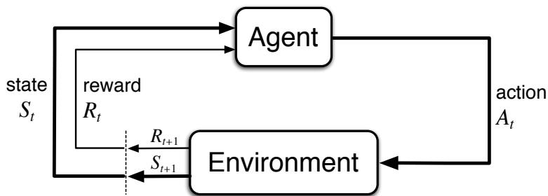  
Figure 3.1: The agent-environment interaction in a Markov decision process.

More specifically, the agent and environment interact at each of a sequence of discrete time steps,  \(t = 0,1,2,3,\ldots\) \(\mathcal{Z}\)  At each time step  \(t\)  , the agent receives some representation of the environment's state,  \(S_{t}\in \mathcal{S}\)  , and on that basis selects an action,  \(A_{t}\in \mathcal{A}(s)\)  .3 One time step later, in part as a consequence of its action, the agent receives a numerical reward,  \(R_{t + 1}\in \mathcal{R}\subset \mathbb{R}\)  , and finds itself in a new state,  \(S_{t + 1}\)  .4 The MDP and agent together thereby give rise to a sequence or trajectory that begins like this:

$$
S_{0},A_{0},R_{1},S_{1},A_{1},R_{2},S_{2},A_{2},R_{3},\ldots \tag{3.1}
$$

In a finite MDP, the sets of states, actions, and rewards  \((\mathcal{S},\mathcal{A}\)  , and  \(\mathcal{R}\)  ) all have a finite number of elements. In this case, the random variables  \(R_{t}\)  and  \(S_{t}\)  have well defined discrete probability distributions dependent only on the preceding state and action. That is, for particular values of these random variables,  \(s^{\prime}\in \mathcal{S}\)  and  \(r\in \mathcal{R}\)  , there is a probability of those values occurring at time  \(t\)  , given particular values of the preceding state and action:

$$
p(s^{\prime},r|s,a) \doteq \operatorname *{Pr}\{S_{t} = s^{\prime},R_{t} = r\mid S_{t - 1} = s,A_{t - 1} = a\} , \tag{3.2}
$$

for all  \(s^{\prime},s\in \mathcal{S}\) \(r\in \mathcal{R}\)  , and  \(a\in \mathcal{A}(s)\)  . The function  \(p\)  defines the dynamics of the MDP. The dot over the equals sign is the equation reminds us that it is a definition (in this case of the function  \(p\)  ) rather than a fact that follows from previous definitions. The dynamics function  \(p:\mathcal{S}\times \mathcal{R}\times \mathcal{S}\times \mathcal{A}\rightarrow [0,1]\)  is an ordinary deterministic function of four arguments. The  \(^{\ast}\)  in the middle of it comes from the notation for conditional probability,

but here it just reminds us that  \(p\)  specifies a probability distribution for each choice of  \(s\)  and  \(a\) , that is, that

$$
\sum_{s^{\prime}\in \mathcal{S}}\sum_{r\in \mathcal{R}}p(s^{\prime},r|s,a) = 1,\mathrm{~for~all~}s\in \mathcal{S},a\in \mathcal{A}(s). \tag{3.3}
$$

In a Markov decision process, the probabilities given by  \(p\)  completely characterize the environment's dynamics. That is, the probability of each possible value for  \(S_{t}\)  and  \(R_{t}\)  depends on the immediately preceding state and action,  \(S_{t - 1}\)  and  \(A_{t - 1}\) , and, given them, not at all on earlier states and actions. This is best viewed as a restriction not on the decision process, but on the state. The state must include information about all aspects of the past agent- environment interaction that make a difference for the future. If it does, then the state is said to have the Markov property. We will assume the Markov property throughout this book, though starting in Part II we will consider approximation methods that do not rely on it, and in Chapter 17 we consider how a Markov state can be efficiently learned and constructed from non- Markov observations.

From the four- argument dynamics function,  \(p\) , one can compute anything else one might want to know about the environment, such as the state- transition probabilities (which we denote, with a slight abuse of notation, as a three- argument function  \(p: \mathcal{S} \times \mathcal{S} \times \mathcal{A} \to [0, 1]\) ),

$$
p(s^{\prime}|s,a) \doteq \operatorname *{Pr}\{S_{t} = s^{\prime}\mid S_{t - 1} = s,A_{t - 1} = a\} = \sum_{r\in \mathcal{R}}p(s^{\prime},r|s,a). \tag{3.4}
$$

We can also compute the expected rewards for state- action pairs as a two- argument function  \(r: \mathcal{S} \times \mathcal{A} \to \mathbb{R}\) :

$$
r(s,a) \doteq \mathbb{E}[R_t \mid S_{t - 1} = s, A_{t - 1} = a] = \sum_{r \in \mathcal{R}} r \sum_{s' \in \mathcal{S}} p(s', r|s,a), \tag{3.5}
$$

and the expected rewards for state- action- next- state triples as a three- argument function  \(r: \mathcal{S} \times \mathcal{A} \times \mathcal{S} \to \mathbb{R}\) ,

$$
r(s,a,s^{\prime}) \doteq \mathbb{E}[R_t \mid S_{t - 1} = s, A_{t - 1} = a, S_t = s^{\prime}] = \sum_{r \in \mathcal{R}} r \frac{p(s^{\prime}, r|s,a)}{p(s^{\prime}|s,a)}. \tag{3.6}
$$

In this book, we usually use the four- argument  \(p\)  function (3.2), but each of these other notations are also occasionally convenient.

The MDP framework is abstract and flexible and can be applied to many different problems in many different ways. For example, the time steps need not refer to fixed intervals of real time; they can refer to arbitrary successive stages of decision making and acting. The actions can be low- level controls, such as the voltages applied to the motors of a robot arm, or high- level decisions, such as whether or not to have lunch or to go to graduate school. Similarly, the states can take a wide variety of forms. They can be completely determined by low- level sensations, such as direct sensor readings, or they can be more high- level and abstract, such as symbolic descriptions of objects in a room. Some of what makes up a state could be based on memory of past sensations or

even be entirely mental or subjective. For example, an agent could be in the state of not being sure where an object is, or of having just been surprised in some clearly defined sense. Similarly, some actions might be totally mental or computational. For example, some actions might control what an agent chooses to think about, or where it focuses its attention. In general, actions can be any decisions we want to learn how to make, and states can be anything we can know that might be useful in making them.

In particular, the boundary between agent and environment is typically not the same as the physical boundary of a robot's or an animal's body. Usually, the boundary is drawn closer to the agent than that. For example, the motors and mechanical linkages of a robot and its sensing hardware should usually be considered parts of the environment rather than parts of the agent. Similarly, if we apply the MDP framework to a person or animal, the muscles, skeleton, and sensory organs should be considered part of the environment. Rewards, too, presumably are computed inside the physical bodies of natural and artificial learning systems, but are considered external to the agent.

The general rule we follow is that anything that cannot be changed arbitrarily by the agent is considered to be outside of it and thus part of its environment. We do not assume that everything in the environment is unknown to the agent. For example, the agent often knows quite a bit about how its rewards are computed as a function of its actions and the states in which they are taken. But we always consider the reward computation to be external to the agent because it defines the task facing the agent and thus must be beyond its ability to change arbitrarily. In fact, in some cases the agent may know everything about how its environment works and still face a difficult reinforcement learning task, just as we may know exactly how a puzzle like Rubik's cube works, but still be unable to solve it. The agent- environment boundary represents the limit of the agent's absolute control, not of its knowledge.

The agent- environment boundary can be located at different places for different purposes. In a complicated robot, many different agents may be operating at once, each with its own boundary. For example, one agent may make high- level decisions which form part of the states faced by a lower- level agent that implements the high- level decisions. In practice, the agent- environment boundary is determined once one has selected particular states, actions, and rewards, and thus has identified a specific decision- making task of interest.

The MDP framework is a considerable abstraction of the problem of goal- directed learning from interaction. It proposes that whatever the details of the sensory, memory, and control apparatus, and whatever objective one is trying to achieve, any problem of learning goal- directed behavior can be reduced to three signals passing back and forth between an agent and its environment: one signal to represent the choices made by the agent (the actions), one signal to represent the basis on which the choices are made (the states), and one signal to define the agent's goal (the rewards). This framework may not be sufficient to represent all decision- learning problems usefully, but it has proved to be widely useful and applicable.

Of course, the particular states and actions vary greatly from task to task, and how they are represented can strongly affect performance. In reinforcement learning, as in other kinds of learning, such representational choices are at present more art than science.

In this book we offer some advice and examples regarding good ways of representing states and actions, but our primary focus is on general principles for learning how to behave once the representations have been selected.

Example 3.1: Bioreactor Suppose reinforcement learning is being applied to determine moment- by- moment temperatures and stirring rates for a bioreactor (a large vat of nutrients and bacteria used to produce useful chemicals). The actions in such an application might be target temperatures and target stirring rates that are passed to lower- level control systems that, in turn, directly activate heating elements and motors to attain the targets. The states are likely to be thermocouple and other sensory readings, perhaps filtered and delayed, plus symbolic inputs representing the ingredients in the vat and the target chemical. The rewards might be moment- by- moment measures of the rate at which the useful chemical is produced by the bioreactor. Notice that here each state is a list, or vector, of sensor readings and symbolic inputs, and each action is a vector consisting of a target temperature and a stirring rate. It is typical of reinforcement learning tasks to have states and actions with such structured representations. Rewards, on the other hand, are always single numbers.

Example 3.2: Pick- and- Place Robot Consider using reinforcement learning to control the motion of a robot arm in a repetitive pick- and- place task. If we want to learn movements that are fast and smooth, the learning agent will have to control the motors directly and have low- latency information about the current positions and velocities of the mechanical linkages. The actions in this case might be the voltages applied to each motor at each joint, and the states might be the latest readings of joint angles and velocities. The reward might be +1 for each object successfully picked up and placed. To encourage smooth movements, on each time step a small, negative reward could be given as a function of the moment- to- moment jerkiness of the motion.

Exercise 3.1 Device three example tasks of your own that fit into the MDP framework, identifying for each its states, actions, and rewards. Make the three examples as different from each other as possible. The framework is abstract and flexible and can be applied in many different ways. Stretch its limits in some way in at least one of your examples.

Exercise 3.2 Is the MDP framework adequate to usefully represent all goal- directed learning tasks? Can you think of any clear exceptions?

Exercise 3.3 Consider the problem of driving. You could define the actions in terms of the accelerator, steering wheel, and brake, that is, where your body meets the machine. Or you could define them farther out—say, where the rubber meets the road, considering your actions to be tire torques. Or you could define them farther in—say, where your brain meets your body, the actions being muscle twitches to control your limbs. Or you could go to a really high level and say that your actions are your choices of where to drive. What is the right level, the right place to draw the line between agent and environment? On what basis is one location of the line to be preferred over another? Is there any fundamental reason for preferring one location over another, or is it a free choice?

# Example 3.3 Recycling Robot

A mobile robot has the job of collecting empty soda cans in an office environment. It has sensors for detecting cans, and an arm and gripper that can pick them up and place them in an onboard bin; it runs on a rechargeable battery. The robot's control system has components for interpreting sensory information, for navigating, and for controlling the arm and gripper. High- level decisions about how to search for cans are made by a reinforcement learning agent based on the current charge level of the battery. To make a simple example, we assume that only two charge levels can be distinguished, comprising a small state set  \(\mathcal{S} = \{\mathrm{high},\mathrm{low}\}\) . In each state, the agent can decide whether to (1) actively search for a can for a certain period of time, (2) remain stationary and wait for someone to bring it a can, or (3) head back to its home base to recharge its battery. When the energy level is high, recharging would always be foolish, so we do not include it in the action set for this state. The action sets are then  \(\mathcal{A}(\mathrm{high}) = \{\mathrm{search},\mathrm{wait}\}\)  and  \(\mathcal{A}(\mathrm{low}) = \{\mathrm{search},\mathrm{wait},\mathrm{recharge}\}\) .

The rewards are zero most of the time, but become positive when the robot secures an empty can, or large and negative if the battery runs all the way down. The best way to find cans is to actively search for them, but this runs down the robot's battery, whereas waiting does not. Whenever the robot is searching, the possibility exists that its battery will become depleted. In this case the robot must shut down and wait to be rescued (producing a low reward). If the energy level is high, then a period of active search can always be completed without risk of depleting the battery. A period of searching that begins with a high energy level leaves the energy level high with probability  \(\alpha\)  and reduces it to low with probability  \(1 - \alpha\) . On the other hand, a period of searching undertaken when the energy level is low leaves it low with probability  \(\beta\)  and depletes the battery with probability  \(1 - \beta\) . In the latter case, the robot must be rescued, and the battery is then recharged back to high. Each can collected by the robot counts as a unit reward, whereas a reward of  \(- 3\)  results whenever the robot has to be rescued. Let  \(r_{\mathrm{search}}\)  and  \(r_{\mathrm{wait}}\) , with  \(r_{\mathrm{search}} > r_{\mathrm{wait}}\) , denote the expected number of cans the robot will collect (and hence the expected reward) while searching and while waiting respectively. Finally, suppose that no cans can be collected during a run home for recharging, and that no cans can be collected on a step in which the battery is depleted. This system is then a finite MDP, and we can write down the transition probabilities and the expected rewards, with dynamics as indicated in the table on the left:

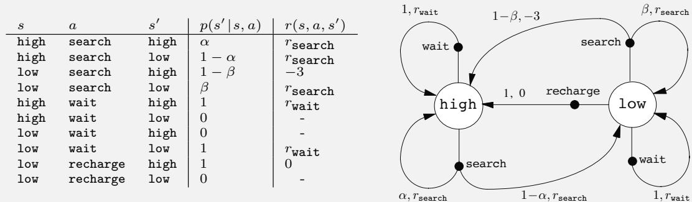

Note that there is a row in the table for each possible combination of current state,  \(s\) , action,  \(a \in \mathcal{A}(s)\) , and next state,  \(s'\) . Some transitions have zero probability of occurring, so no expected reward is specified for them. Shown on the right is another useful way of

summarizing the dynamics of a finite MDP, as a transition graph. There are two kinds of nodes: state nodes and action nodes. There is a state node for each possible state (a large open circle labeled by the name of the state), and an action node for each state- action pair (a small solid circle labeled by the name of the action and connected by a line to the state node). Starting in state  \(s\)  and taking action  \(a\)  moves you along the line from state node  \(s\)  to action node  \((s,a)\) . Then the environment responds with a transition to the next state's node via one of the arrows leaving action node  \((s,a)\) . Each arrow corresponds to a triple  \((s,s',a)\) , where  \(s'\)  is the next state, and we label the arrow with the transition probability,  \(p(s'|s,a)\) , and the expected reward for that transition,  \(r(s,a,s')\) . Note that the transition probabilities labeling the arrows leaving an action node always sum to 1.

Exercise 3.4 Give a table analogous to that in Example 3.3, but for  \(p(s',r|s,a)\) . It should have columns for  \(s\) ,  \(a\) ,  \(s'\) ,  \(r\) , and  \(p(s',r|s,a)\) , and a row for every 4- tuple for which  \(p(s',r|s,a) > 0\) .

# 3.2 Goals and Rewards

In reinforcement learning, the purpose or goal of the agent is formalized in terms of a special signal, called the reward, passing from the environment to the agent. At each time step, the reward is a simple number,  \(R_t \in \mathbb{R}\) . Informally, the agent's goal is to maximize the total amount of reward it receives. This means maximizing not immediate reward, but cumulative reward in the long run. We can clearly state this informal idea as the reward hypothesis:

That all of what we mean by goals and purposes can be well thought of as the maximization of the expected value of the cumulative sum of a received scalar signal (called reward).

The use of a reward signal to formalize the idea of a goal is one of the most distinctive features of reinforcement learning.

Although formulating goals in terms of reward signals might at first appear limiting, in practice it has proved to be flexible and widely applicable. The best way to see this is to consider examples of how it has been, or could be, used. For example, to make a robot learn to walk, researchers have provided reward on each time step proportional to the robot's forward motion. In making a robot learn how to escape from a maze, the reward is often  \(- 1\)  for every time step that passes prior to escape; this encourages the agent to escape as quickly as possible. To make a robot learn to find and collect empty soda cans for recycling, one might give it a reward of zero most of the time, and then a reward of  \(+1\)  for each can collected. One might also want to give the robot negative rewards when it bumps into things or when somebody yells at it. For an agent to learn to play checkers or chess, the natural rewards are  \(+1\)  for winning,  \(- 1\)  for losing, and  \(0\)  for drawing and for all nonterminal positions.

You can see what is happening in all of these examples. The agent always learns to maximize its reward. If we want it to do something for us, we must provide rewards to it in such a way that in maximizing them the agent will also achieve our goals. It

is thus critical that the rewards we set up truly indicate what we want accomplished. In particular, the reward signal is not the place to impart to the agent prior knowledge about how to achieve what we want it to do.5 For example, a chess- playing agent should be rewarded only for actually winning, not for achieving subgoals such as taking its opponent's pieces or aiming control of the center of the board. If achieving these sorts of subgoals were rewarded, then the agent might find a way to achieve them without achieving the real goal. For example, it might find a way to take the opponent's pieces even at the cost of losing the game. The reward signal is your way of communicating to the agent what you want achieved, not how you want it achieved.6

# 3.3 Returns and Episodes

So far we have discussed informally the objective of learning. We have said that the agent's goal is to maximize the cumulative reward it receives in the long run. How might this be defined formally? If the sequence of rewards received after time step  \(t\)  is denoted  \(R_{t + 1}, R_{t + 2}, R_{t + 3}, \ldots\) , then what precise aspect of this sequence do we wish to maximize? In general, we seek to maximize the expected return, where the return, denoted  \(G_{t}\) , is defined as some specific function of the reward sequence. In the simplest case the return is the sum of the rewards:

$$
G_{t} = R_{t + 1} + R_{t + 2} + R_{t + 3} + \dots + R_{T}, \tag{3.7}
$$

where  \(T\)  is a final time step. This approach makes sense in applications in which there is a natural notion of final time step, that is, when the agent- environment interaction breaks naturally into subsequences, which we call episodes,7 such as plays of a game, trips through a maze, or any sort of repeated interaction. Each episode ends in a special state called the terminal state, followed by a reset to a standard starting state or to a sample from a standard distribution of starting states. Even if you think of episodes as ending in different ways, such as winning and losing a game, the next episode begins independently of how the previous one ended. Thus the episodes can all be considered to end in the same terminal state, with different rewards for the different outcomes. Tasks with episodes of this kind are called episodic tasks. In episodic tasks we sometimes need to distinguish the set of all nonterminal states, denoted  \(S\) , from the set of all states plus the terminal state, denoted  \(S^{+}\) . The time of termination,  \(T\) , is a random variable that normally varies from episode to episode.

On the other hand, in many cases the agent- environment interaction does not break naturally into identifiable episodes, but goes on continually without limit. For example, this would be the natural way to formulate an on- going process- control task, or an application to a robot with a long life span. We call these continuing tasks. The return formulation (3.7) is problematic for continuing tasks because the final time step would be  \(T = \infty\) , and the return, which is what we are trying to maximize, could easily be infinite.

(For example, suppose the agent receives a reward of  \(+1\)  at each time step.) Thus, in this book we usually use a definition of return that is slightly more complex conceptually but much simpler mathematically.

The additional concept that we need is that of discounting. According to this approach, the agent tries to select actions so that the sum of the discounted rewards it receives over the future is maximized. In particular, it chooses  \(A_{t}\)  to maximize the expected discounted return:

$$
G_{t} \doteq R_{t + 1} + \gamma R_{t + 2} + \gamma^{2}R_{t + 3} + \dots = \sum_{k = 0}^{\infty} \gamma^{k} R_{t + k + 1}, \tag{3.8}
$$

where  \(\gamma\)  is a parameter,  \(0 \leq \gamma \leq 1\) , called the discount rate.

The discount rate determines the present value of future rewards: a reward received  \(k\)  time steps in the future is worth only  \(\gamma^{k - 1}\)  times what it would be worth if it were received immediately. If  \(\gamma < 1\) , the infinite sum in (3.8) has a finite value as long as the reward sequence  \(\{R_{k}\}\)  is bounded. If  \(\gamma = 0\) , the agent is "myopic" in being concerned only with maximizing immediate rewards: its objective in this case is to learn how to choose  \(A_{t}\)  so as to maximize only  \(R_{t + 1}\) . If each of the agent's actions happened to influence only the immediate reward, not future rewards as well, then a myopic agent could maximize (3.8) by separately maximizing each immediate reward. But in general, acting to maximize immediate reward can reduce access to future rewards so that the return is reduced. As  \(\gamma\)  approaches 1, the return objective takes future rewards into account more strongly; the agent becomes more farsighted.

Returns at successive time steps are related to each other in a way that is important for the theory and algorithms of reinforcement learning:

$$
\begin{array}{l}{{G_{t}\doteq R_{t+1}+\gamma R_{t+2}+\gamma^{2}R_{t+3}+\gamma^{3}R_{t+4}+\cdots}}\\ {{\mathrm{~}=R_{t+1}+\gamma\big(R_{t+2}+\gamma R_{t+3}+\gamma^{2}R_{t+4}+\cdots\big)}}\\ {{\mathrm{~}=R_{t+1}+\gamma G_{t+1}}}\end{array} \tag{3.9}
$$

Note that this works for all time steps  \(t < T\) , even if termination occurs at  \(t + 1\) , provided we define  \(G_{T} = 0\) . This often makes it easy to compute returns from reward sequences.

Note that although the return (3.8) is a sum of an infinite number of terms, it is still finite if the reward is nonzero and constant—if  \(\gamma < 1\) . For example, if the reward is a constant  \(+1\) , then the return is

$$
G_{t} = \sum_{k = 0}^{\infty} \gamma^{k} = \frac{1}{1 - \gamma}. \tag{3.10}
$$

Exercise 3.5 The equations in Section 3.1 are for the continuing case and need to be modified (very slightly) to apply to episodic tasks. Show that you know the modifications needed by giving the modified version of (3.3).

# Example 3.4: Pole-Balancing

The objective in this task is to apply forces to a cart moving along a track so as to keep a pole hinged to the cart from falling over: A failure is said to occur if the pole falls past a given angle from vertical or if the cart runs off the track. The pole is reset to vertical after each failure. This task could be treated as episodic, where the natural

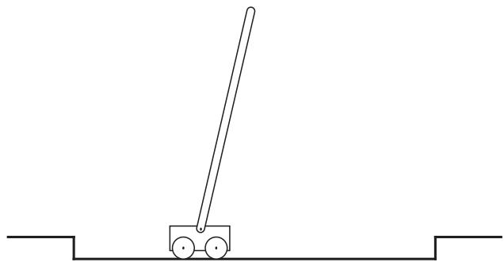

episodes are the repeated attempts to balance the pole. The reward in this case could be  \(+1\)  for every time step on which failure did not occur, so that the return at each time would be the number of steps until failure. In this case, successful balancing forever would mean a return of infinity. Alternatively, we could treat pole- balancing as a continuing task, using discounting. In this case the reward would be  \(- 1\)  on each failure and zero at all other times. The return at each time would then be related to  \(- \gamma^{K - 1}\) , where  \(K\)  is the number of time steps before failure (as well as to the times of later failures). In either case, the return is maximized by keeping the pole balanced for as long as possible.

Exercise 3.6 Suppose you treated pole- balancing as an episodic task but also used discounting, with all rewards zero except for  \(- 1\)  upon failure. What then would the return be at each time? How does this return differ from that in the discounted, continuing formulation of this task?

Exercise 3.7 Imagine that you are designing a robot to run a maze. You decide to give it a reward of  \(+1\)  for escaping from the maze and a reward of zero at all other times. The task seems to break down naturally into episodes—the successive runs through the maze—so you decide to treat it as an episodic task, where the goal is to maximize expected total reward (3.7). After running the learning agent for a while, you find that it is showing no improvement in escaping from the maze. What is going wrong? Have you effectively communicated to the agent what you want it to achieve?

Exercise 3.8 Suppose  \(\gamma = 0.5\)  and the following sequence of rewards is received  \(R_{1} = - 1\) ,  \(R_{2} = 2\) ,  \(R_{3} = 6\) ,  \(R_{4} = 3\) , and  \(R_{5} = 2\) , with  \(T = 5\) . What are  \(G_{0}\) ,  \(G_{1}\) , ...,  \(G_{5}\) ? Hint: Work backwards.

Exercise 3.9 Suppose  \(\gamma = 0.9\)  and the reward sequence is  \(R_{1} = 2\)  followed by an infinite sequence of 7s. What are  \(G_{1}\)  and  \(G_{0}\) ?

Exercise 3.10 Prove the second equality in (3.10).

# 3.4 Unified Notation for Episodic and Continuing Tasks

In the preceding section we described two kinds of reinforcement learning tasks, one in which the agent- environment interaction naturally breaks down into a sequence of separate episodes (episodic tasks), and one in which it does not (continuing tasks). The former case is mathematically easier because each action affects only the finite number of rewards subsequently received during the episode. In this book we consider sometimes one kind of problem and sometimes the other, but often both. It is therefore useful to establish one notation that enables us to talk precisely about both cases simultaneously.

To be precise about episodic tasks requires some additional notation. Rather than one long sequence of time steps, we need to consider a series of episodes, each of which consists of a finite sequence of time steps. We number the time steps of each episode starting anew from zero. Therefore, we have to refer not just to  \(S_{t,i}\)  the state representation at time  \(t\)  , but to  \(S_{t,i}\)  , the state representation at time  \(t\)  of episode  \(i\)  (and similarly for  \(A_{t,i}\) \(R_{t,i}\) \(\pi_{t,i}\) \(T_{i}\)  , etc.). However, it turns out that when we discuss episodic tasks we almost never have to distinguish between different episodes. We are almost always considering a particular episode, or stating something that is true for all episodes. Accordingly, in practice we almost always abuse notation slightly by dropping the explicit reference to episode number. That is, we write  \(S_{t}\)  to refer to  \(S_{t,i}\)  , and so on.

We need one other convention to obtain a single notation that covers both episodic and continuing tasks. We have defined the return as a sum over a finite number of terms in one case (3.7) and as a sum over an infinite number of terms in the other (3.8). These two can be unified by considering episode termination to be the entering of a special absorbing state that transitions only to itself and that generates only rewards of zero. For example, consider the state transition diagram:

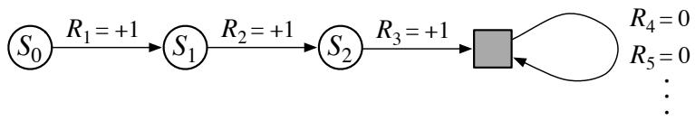

Here the solid square represents the special absorbing state corresponding to the end of an episode. Starting from  \(S_{0}\)  , we get the reward sequence  \(+1, + 1, + 1,0,0,0,\ldots\)  Summing these, we get the same return whether we sum over the first  \(T\)  rewards (here  \(T = 3\)  ) or over the full infinite sequence. This remains true even if we introduce discounting. Thus, we can define the return, in general, according to (3.8), using the convention of omitting episode numbers when they are not needed, and including the possibility that  \(\gamma = 1\)  if the sum remains defined (e.g., because all episodes terminate). Alternatively, we can write

$$
G_{t}\doteq \sum_{k = t + 1}^{T}\gamma^{k - t - 1}R_{k}, \tag{3.11}
$$

including the possibility that  \(T = \infty\)  or  \(\gamma = 1\)  (but not both). We use these conventions throughout the rest of the book to simplify notation and to express the close parallels

between episodic and continuing tasks. (Later, in Chapter 10, we will introduce a formulation that is both continuing and undiscounted.)

# 3.5 Policies and Value Functions

Almost all reinforcement learning algorithms involve estimating value functions—functions of states (or of state- action pairs) that estimate how good it is for the agent to be in a given state (or how good it is to perform a given action in a given state). The notion of "how good" here is defined in terms of future rewards that can be expected, or, to be precise, in terms of expected return. Of course the rewards the agent can expect to receive in the future depend on what actions it will take. Accordingly, value functions are defined with respect to particular ways of acting, called policies.

Formally, a policy is a mapping from states to probabilities of selecting each possible action. If the agent is following policy  \(\pi\)  at time  \(t\) , then  \(\pi (a|s)\)  is the probability that  \(A_{t} = a\)  if  \(S_{t} = s\) . Like  \(p\) ,  \(\pi\)  is an ordinary function; the "i" in the middle of  \(\pi (a|s)\)  merely reminds us that it defines a probability distribution over  \(a \in \mathcal{A}(s)\)  for each  \(s \in \mathcal{S}\) . Reinforcement learning methods specify how the agent's policy is changed as a result of its experience.

Exercise 3.11 If the current state is  \(S_{t}\) , and actions are selected according to a stochastic policy  \(\pi\) , then what is the expectation of  \(R_{t + 1}\)  in terms of  \(\pi\)  and the four- argument function  \(p\)  (3.2)?

The value function of a state  \(s\)  under a policy  \(\pi\) , denoted  \(v_{\pi}(s)\) , is the expected return when starting in  \(s\)  and following  \(\pi\)  thereafter. For MDPs, we can define  \(v_{\pi}\)  formally by

$$
v_{\pi}(s) \doteq \mathbb{E}_{\pi}[G_{t} \mid S_{t} = s] = \mathbb{E}_{\pi}\left[\sum_{k = 0}^{\infty} \gamma^{k} R_{t + k + 1} \mid S_{t} = s\right], \text{for all} s \in \mathcal{S}, \tag{3.12}
$$

where  \(\mathbb{E}_{\pi}[\cdot ]\)  denotes the expected value of a random variable given that the agent follows policy  \(\pi\) , and  \(t\)  is any time step. Note that the value of the terminal state, if any, is always zero. We call the function  \(v_{\pi}\)  the state- value function for policy  \(\pi\) .

Similarly, we define the value of taking action  \(a\)  in state  \(s\)  under a policy  \(\pi\) , denoted  \(q_{\pi}(s,a)\) , as the expected return starting from  \(s\) , taking the action  \(a\) , and thereafter following policy  \(\pi\) :

$$
q_{\pi}(s,a) \doteq \mathbb{E}_{\pi}[G_{t} \mid S_{t} = s, A_{t} = a] = \mathbb{E}_{\pi}\left[\sum_{k = 0}^{\infty} \gamma^{k} R_{t + k + 1} \mid S_{t} = s, A_{t} = a\right]. \tag{3.13}
$$

We call  \(q_{\pi}\)  the action- value function for policy  \(\pi\) .

Exercise 3.12 Give an equation for  \(v_{\pi}\)  in terms of  \(q_{\pi}\)  and  \(\pi\) .

Exercise 3.13 Give an equation for  \(q_{\pi}\)  in terms of  \(v_{\pi}\)  and the four- argument  \(p\) .

The value functions  \(v_{\pi}\)  and  \(q_{\pi}\)  can be estimated from experience. For example, if an agent follows policy  \(\pi\)  and maintains an average, for each state encountered, of the actual returns that have followed that state, then the average will converge to the state's value,  \(v_{\pi}(s)\) , as the number of times that state is encountered approaches infinity. If separate

averages are kept for each action taken in each state, then these averages will similarly converge to the action values,  \(q_{\pi}(s,a)\) . We call estimation methods of this kind Monte Carlo methods because they involve averaging over many random samples of actual returns. These kinds of methods are presented in Chapter 5. Of course, if there are very many states, then it may not be practical to keep separate averages for each state individually. Instead, the agent would have to maintain  \(v_{\pi}\)  and  \(q_{\pi}\)  as parameterized functions (with fewer parameters than states) and adjust the parameters to better match the observed returns. This can also produce accurate estimates, although much depends on the nature of the parameterized function approximator. These possibilities are discussed in Part II of the book.

A fundamental property of value functions used throughout reinforcement learning and dynamic programming is that they satisfy recursive relationships similar to that which we have already established for the return (3.9). For any policy  \(\pi\)  and any state  \(s\) , the following consistency condition holds between the value of  \(s\)  and the value of its possible successor states:

$$
\begin{array}{r l} & {v_{\pi}(s)\doteq \mathbb{E}_{\pi}[G_{t}\mid S_{t} = s]}\\ & {\qquad = \mathbb{E}_{\pi}[R_{t + 1} + \gamma G_{t + 1}\mid S_{t} = s]}\\ & {\qquad = \sum_{a}\pi (a|s)\sum_{s^{\prime}}\sum_{r}p(s^{\prime},r|s,a)\Big[r + \gamma \mathbb{E}_{\pi}[G_{t + 1}|S_{t + 1} = s^{\prime}]\Big]}\\ & {\qquad = \sum_{a}\pi (a|s)\sum_{s^{\prime},r}p(s^{\prime},r|s,a)\Big[r + \gamma v_{\pi}(s^{\prime})\Big],\quad \mathrm{for~all~}s\in \mathbb{S},} \end{array} \tag{by (3.9)}
$$

where it is implicit that the actions,  \(a\) , are taken from the set  \(\mathcal{A}(s)\) , that the next states,  \(s^{\prime}\) , are taken from the set  \(\mathcal{S}\)  (or from  \(\mathbb{S}^{+}\)  in the case of an episodic problem), and that the rewards,  \(r\) , are taken from the set  \(\mathcal{R}\) . Note also how in the last equation we have merged the two sums, one over all the values of  \(s^{\prime}\)  and the other over all the values of  \(r\) , into one sum over all the possible values of both. We use this kind of merged sum often to simplify formulas. Note how the final expression can be read easily as an expected value. It is really a sum over all values of the three variables,  \(a\) ,  \(s^{\prime}\) , and  \(r\) . For each triple, we compute its probability,  \(\pi (a|s)p(s^{\prime},r|s,a)\) , weight the quantity in brackets by that probability, then sum over all possibilities to get an expected value.

Equation (3.14) is the Bellman equation for  \(v_{\pi}\) . It expresses a relationship between the value of a state and the values of its successor states. Think of looking ahead from a state to its possible successor states, as suggested by the diagram to the right. Each open circle represents a state and each solid circle represents a state- action pair. Starting from state  \(s\) , the root node at the top, the agent could take any of some set of actions—three are shown in the diagram—based on its policy  \(\pi\) . From each of these, the environment could respond with one of several next states,  \(s^{\prime}\)  (two are shown in the figure), along with a reward,  \(r\) , depending on its dynamics given by the function  \(p\) . The Bellman equation (3.14) averages over all the possibilities, weighting each by its probability of occurring. It states that the value of the start state must equal the (discounted) value of the expected next state, plus the reward expected along the way.

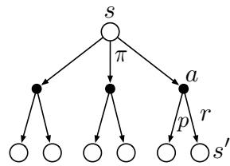

Backup diagram for  \(v_{\pi}\)

each of these, the environment could respond with one of several next states,  \(s^{\prime}\)  (two are shown in the figure), along with a reward,  \(r\)  , depending on its dynamics given by the function  \(p\)  . The Bellman equation (3.14) averages over all the possibilities, weighting each by its probability of occurring. It states that the value of the start state must equal the (discounted) value of the expected next state, plus the reward expected along the way.

The value function  \(v_{\pi}\)  is the unique solution to its Bellman equation. We show in subsequent chapters how this Bellman equation forms the basis of a number of ways to compute, approximate, and learn  \(v_{\pi}\) . We call diagrams like that above backup diagrams because they diagram relationships that form the basis of the update or backup operations that are at the heart of reinforcement learning methods. These operations transfer value information back to a state (or a state- action pair) from its successor states (or state- action pairs). We use backup diagrams throughout the book to provide graphical summaries of the algorithms we discuss. (Note that, unlike transition graphs, the state nodes of backup diagrams do not necessarily represent distinct states; for example, a state might be its own successor.)

Example 3.5: Gridworld Figure 3.2 (left) shows a rectangular gridworld representation of a simple finite MDP. The cells of the grid correspond to the states of the environment. At each cell, four actions are possible: north, south, east, and west, which deterministically cause the agent to move one cell in the respective direction on the grid. Actions that would take the agent off the grid leave its location unchanged, but also result in a reward of  \(- 1\) . Other actions result in a reward of 0, except those that move the agent out of the special states A and B. From state A, all four actions yield a reward of  \(+10\)  and take the agent to  \(A'\) . From state B, all actions yield a reward of  \(+5\)  and take the agent to  \(B'\) .

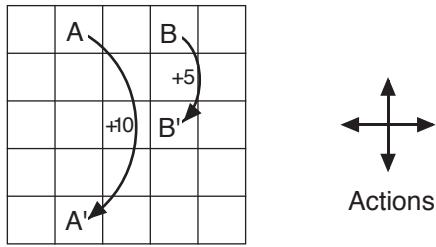  
Figure 3.2: Gridworld example: exceptional reward dynamics (left) and state-value function for the equiprobable random policy (right).

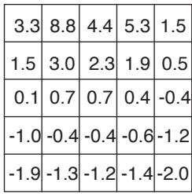

Suppose the agent selects all four actions with equal probability in all states. Figure 3.2 (right) shows the value function,  \(v_{\pi}\) , for this policy, for the discounted reward case with  \(\gamma = 0.9\) . This value function was computed by solving the system of linear equations (3.14). Notice the negative values near the lower edge; these are the result of the high probability of hitting the edge of the grid there under the random policy. State A is the best state to be in under this policy. Note that A's expected return is less than its immediate reward of 10, because from A the agent is taken to state  \(A'\)  from which it is likely to run into the edge of the grid. State B, on the other hand, is valued more than its immediate reward of 5, because from B the agent is taken to  \(B'\)  which has a positive value. From  \(B'\)  the expected penalty (negative reward) for possibly running into an edge is more than compensated for by the expected gain for possibly stumbling onto A or B.

Exercise 3.14 The Bellman equation (3.14) must hold for each state for the value function  \(v_{\pi}\)  shown in Figure 3.2 (right) of Example 3.5. Show numerically that this equation holds for the center state, valued at  \(+0.7\) , with respect to its four neighboring states, valued at  \(+2.3\) ,  \(+0.4\) ,  \(- 0.4\) , and  \(+0.7\) . (These numbers are accurate only to one decimal place.)  \(\square\)

Exercise 3.15 In the gridworld example, rewards are positive for goals, negative for running into the edge of the world, and zero the rest of the time. Are the signs of these rewards important, or only the intervals between them? Prove, using (3.8), that adding a constant  \(c\)  to all the rewards adds a constant,  \(v_{c}\) , to the values of all states, and thus does not affect the relative values of any states under any policies. What is  \(v_{c}\)  in terms of  \(c\)  and  \(\gamma\) ?

Exercise 3.16 Now consider adding a constant  \(c\)  to all the rewards in an episodic task, such as maze running. Would this have any effect, or would it leave the task unchanged as in the continuing task above? Why or why not? Give an example.

Example 3.6: Golf To formulate playing a hole of golf as a reinforcement learning task, we count a penalty (negative reward) of  \(- 1\)  for each stroke until we hit the ball into the hole. The state is the location of the ball. The value of a state is the negative of the number of strokes to the hole from that location. Our actions are how we aim and swing at the ball, of course, and which club we select. Let us take the former as given and consider just the choice of club, which we assume is either a putter or a driver. The upper part of Figure 3.3 shows a possible state- value function,  \(v_{\mathrm{putt}}(s)\) , for the policy that always uses the putter. The terminal state in- the- hole has a value of 0. From anywhere on the green we assume we can make a putt; these states have value  \(- 1\) . Off the green we cannot reach the hole by putting, and the value is lower. If we can reach the green from a state by putting, then that state must have value one less than the green's value, that is,  \(- 2\) . For simplicity, let us assume we can putt very precisely and deterministically, but with a limited range. This gives us the sharp contour line labeled  \(- 2\)  in the figure; all locations between that line and the green require exactly two strokes to complete the hole. Similarly, any location within putting range of the  \(- 2\)  contour line must have a value of  \(- 3\) , and so on to get all the contour lines shown in the figure. Putting doesn't get us out of sand traps, so they have a value of  \(- \infty\) . Overall, it takes us six strokes to get from the tee to the hole by putting.

always uses the putter. The terminal state in- the- hole has a value of 0. From anywhere on the green we assume we can make a putt; these states have value  \(- 1\)  Off the green we cannot reach the hole by putting, and the value is lower. If we can reach the green from a state by putting, then that state must have value one less than the green's value, that is,  \(- 2\)  . For simplicity, let us assume we can putt very precisely and deterministically, but with a limited range. This gives us the sharp contour line labeled  \(- 2\)  in the figure; all locations between that line and the green require exactly two strokes to complete the hole. Similarly, any location within putting range of the  \(- 2\)  contour line must have a value of  \(- 3\)  , and so on to get all the contour lines shown in the figure. Putting doesn't get us out of sand traps, so they have a value of  \(- \infty\)  . Overall, it takes us six strokes to get from the tee to the hole by putting.

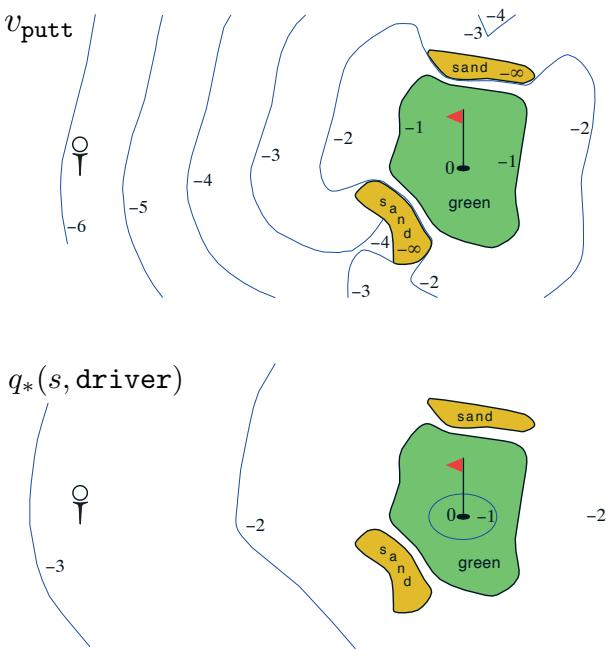  
Figure 3.3: A golf example: the state-value function for putting (upper) and the optimal action-value function for using the driver (lower).

Exercise 3.17 What is the Bellman equation for action values, that is, for  \(q_{\pi}\) ? It must give the action value  \(q_{\pi}(s, a)\)  in terms of the action values,  \(q_{\pi}(s', a')\) , of possible successors to the state- action pair  \((s, a)\) . Hint: The backup diagram to the right corresponds to this equation. Show the sequence of equations analogous to (3.14), but for action values.

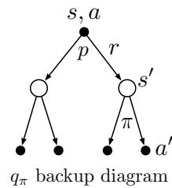

Exercise 3.18 The value of a state depends on the values of the actions possible in that state and on how likely each action is to be taken under the current policy. We can think of this in terms of a small backup diagram rooted at the state and considering each possible action:

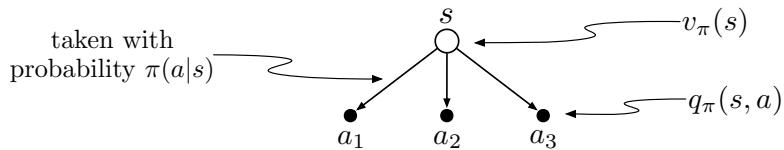

Give the equation corresponding to this intuition and diagram for the value at the root node,  \(v_{\pi}(s)\)  , in terms of the value at the expected leaf node,  \(q_{\pi}(s,a)\)  , given  \(S_{t} = s\)  . This equation should include an expectation conditioned on following the policy,  \(\pi\)  . Then give a second equation in which the expected value is written out explicitly in terms of  \(\pi (a|s)\)  such that no expected value notation appears in the equation.

Exercise 3.19 The value of an action,  \(q_{\pi}(s,a)\)  , depends on the expected next reward and the expected sum of the remaining rewards. Again we can think of this in terms of a small backup diagram, this one rooted at an action (state- action pair) and branching to the possible next states:

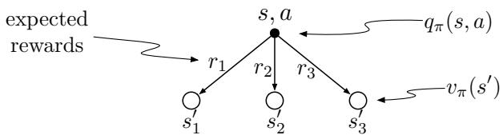

Give the equation corresponding to this intuition and diagram for the action value,  \(q_{\pi}(s,a)\)  , in terms of the expected next reward,  \(R_{t + 1}\)  , and the expected next state value,  \(v_{\pi}(S_{t + 1})\)  , given that  \(S_{t} = s\)  and  \(A_{t} = a\)  . This equation should include an expectation but not one conditioned on following the policy. Then give a second equation, writing out the expected value explicitly in terms of  \(p(s^{\prime},r|s,a)\)  defined by (3.2), such that no expected value notation appears in the equation.

# 3.6 Optimal Policies and Optimal Value Functions

Solving a reinforcement learning task means, roughly, finding a policy that achieves a lot of reward over the long run. For finite MDPs, we can precisely define an optimal policy in the following way. Value functions define a partial ordering over policies. A policy  \(\pi\)  is defined to be better than or equal to a policy  \(\pi^{\prime}\)  if its expected return is greater than or equal to that of  \(\pi^{\prime}\)  for all states. In other words,  \(\pi \geq \pi^{\prime}\)  if and only if  \(v_{\pi}(s)\geq v_{\pi^{\prime}}(s)\)  for all  \(s\in \mathcal{S}\)  . There is always at least one policy that is better than or equal to all other policies. This is an optimal policy. Although there may be more than one, we denote all the optimal policies by  \(\pi_{*}\)  . They share the same state- value function, called the optimal state- value function, denoted  \(v_{*}\)  , and defined as

$$
v_{*}(s)\doteq \max_{\pi}v_{\pi}(s), \tag{3.15}
$$

for all  \(s\in \mathcal{S}\)

Optimal policies also share the same optimal action- value function, denoted  \(q_{*}\) , and defined as

$$
q_{*}(s,a) \doteq \max_{\pi} q_{\pi}(s,a), \tag{3.16}
$$

for all  \(s \in \mathcal{S}\)  and  \(a \in \mathcal{A}(s)\) . For the state- action pair  \((s,a)\) , this function gives the expected return for taking action  \(a\)  in state  \(s\)  and thereafter following an optimal policy. Thus, we can write  \(q_{*}\)  in terms of  \(v_{*}\)  as follows:

$$
q_{*}(s,a) = \mathbb{E}[R_{t + 1} + \gamma v_{*}(S_{t + 1}) \mid S_{t} = s, A_{t} = a]. \tag{3.17}
$$

Example 3.7: Optimal Value Functions for Golf The lower part of Figure 3.3 shows the contours of a possible optimal action- value function  \(q_{*}(s, \text{driver})\) . These are the values of each state if we first play a stroke with the driver and afterward select either the driver or the putter, whichever is better. The driver enables us to hit the ball farther, but with less accuracy. We can reach the hole in one shot using the driver only if we are already very close; thus the  \(- 1\)  contour for  \(q_{*}(s, \text{driver})\)  covers only a small portion of the green. If we have two strokes, however, then we can reach the hole from much farther away, as shown by the  \(- 2\)  contour. In this case we don't have to drive all the way to within the small  \(- 1\)  contour, but only to anywhere on the green; from there we can use the putter. The optimal action- value function gives the values after committing to a particular first action, in this case, to the driver, but afterward using whichever actions are best. The  \(- 3\)  contour is still farther out and includes the starting tee. From the tee, the best sequence of actions is two drives and one putt, sinking the ball in three strokes.

Because  \(v_{*}\)  is the value function for a policy, it must satisfy the self- consistency condition given by the Bellman equation for state values (3.14). Because it is the optimal value function, however,  \(v_{*}\) 's consistency condition can be written in a special form without reference to any specific policy. This is the Bellman equation for  \(v_{*}\) , or the Bellman optimality equation. Intuitively, the Bellman optimality equation expresses the fact that the value of a state under an optimal policy must equal the expected return for the best action from that state:

$$
\begin{array}{r l} & {v_{*}(s) = \underset {a\in \mathcal{A}(s)}{\max}q_{\pi_{*}}(s,a)}\\ & {\qquad = \underset {a}{\max}E_{\pi_{*}}[G_{t}\mid S_{t} = s,A_{t} = a]}\\ & {\qquad = \underset {a}{\max}E_{\pi_{*}}[R_{t + 1} + \gamma G_{t + 1}\mid S_{t} = s,A_{t} = a]}\\ & {\qquad = \underset {a}{\max}E[R_{t + 1} + \gamma v_{*}(S_{t + 1})\mid S_{t} = s,A_{t} = a]}\\ & {\qquad = \underset {a}{\max}\sum_{r}p(s^{\prime},r\mid s,a)[r + \gamma v_{*}(s^{\prime})].} \end{array} \tag{by (3.9)
$$

The last two equations are two forms of the Bellman optimality equation for  \(v_{*}\) . The Bellman optimality equation for  \(q_{*}\)  is

$$
\begin{array}{rcl}{q_{*}(s,a)} & = & {\mathbb{E}\Big[R_{t + 1} + \gamma \max_{a^{\prime}}q_{*}(S_{t + 1},a^{\prime})\Big|S_{t} = s,A_{t} = a\Big]}\\ {} & = & {\sum_{s^{\prime},r}p(s^{\prime},r|s,a)\Big[r + \gamma \max_{a^{\prime}}q_{*}(s^{\prime},a^{\prime})\Big].} \end{array} \tag{3.20}
$$

The backup diagrams in the figure below show graphically the spans of future states and actions considered in the Bellman optimality equations for  \(v_{*}\)  and  \(q_{*}\) . These are the same as the backup diagrams for  \(v_{\pi}\)  and  \(q_{\pi}\)  presented earlier except that arcs have been added at the agent's choice points to represent that the maximum over that choice is taken rather than the expected value given some policy. The backup diagram on the left graphically represents the Bellman optimality equation (3.19) and the backup diagram on the right graphically represents (3.20).

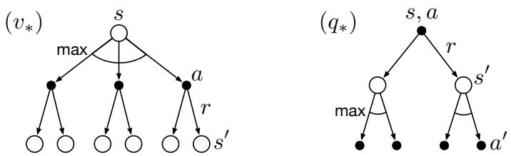  
Figure 3.4: Backup diagrams for  \(v_{*}\)  and  \(q_{*}\)

For finite MDPs, the Bellman optimality equation for  \(v_{*}\)  (3.19) has a unique solution. The Bellman optimality equation is actually a system of equations, one for each state, so if there are  \(n\)  states, then there are  \(n\)  equations in  \(n\)  unknowns. If the dynamics  \(p\)  of the environment are known, then in principle one can solve this system of equations for  \(v_{*}\)  using any one of a variety of methods for solving systems of nonlinear equations. One can solve a related set of equations for  \(q_{*}\) .

Once one has  \(v_{*}\) , it is relatively easy to determine an optimal policy. For each state  \(s\) , there will be one or more actions at which the maximum is obtained in the Bellman optimality equation. Any policy that assigns nonzero probability only to these actions is an optimal policy. You can think of this as a one- step search. If you have the optimal value function,  \(v_{*}\) , then the actions that appear best after a one- step search will be optimal actions. Another way of saying this is that any policy that is greedy with respect to the optimal evaluation function  \(v_{*}\)  is an optimal policy. The term greedy is used in computer science to describe any search or decision procedure that selects alternatives based only on local or immediate considerations, without considering the possibility that such a selection may prevent future access to even better alternatives. Consequently, it describes policies that select actions based only on their short- term consequences. The beauty of  \(v_{*}\)  is that if one uses it to evaluate the short- term consequences of actions—specifically, the one- step consequences—then a greedy policy is actually optimal in the long- term sense in which we are interested because  \(v_{*}\)  already takes into account the reward consequences of all possible future behavior. By means of  \(v_{*}\) , the optimal expected long- term return is

turned into a quantity that is locally and immediately available for each state. Hence, a one- step- ahead search yields the long- term optimal actions.

Having  \(q_{*}\)  makes choosing optimal actions even easier. With  \(q_{*}\) , the agent does not even have to do a one- step- ahead search: for any state  \(s\) , it can simply find any action that maximizes  \(q_{*}(s, a)\) . The action- value function effectively caches the results of all one- step- ahead searches. It provides the optimal expected long- term return as a value that is locally and immediately available for each state- action pair. Hence, at the cost of representing a function of state- action pairs, instead of just of states, the optimal action- value function allows optimal actions to be selected without having to know anything about possible successor states and their values, that is, without having to know anything about the environment's dynamics.

Example 3.8: Solving the Gridworld Suppose we solve the Bellman equation for  \(v_{*}\)  for the simple grid task introduced in Example 3.5 and shown again in Figure 3.5 (left). Recall that state A is followed by a reward of  \(+10\)  and transition to state  \(\mathsf{A}^{\prime}\) , while state B is followed by a reward of  \(+5\)  and transition to state  \(\mathsf{B}^{\prime}\) . Figure 3.5 (middle) shows the optimal value function, and Figure 3.5 (right) shows the corresponding optimal policies. Where there are multiple arrows in a cell, all of the corresponding actions are optimal.

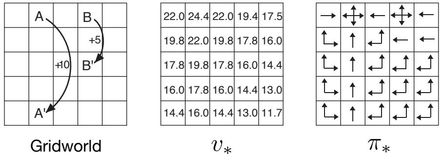  
Figure 3.5: Optimal solutions to the gridworld example.

Example 3.9: Bellman Optimality Equations for the Recycling Robot Using (3.19), we can explicitly give the Bellman optimality equation for the recycling robot example. To make things more compact, we abbreviate the states high and low, and the actions search, wait, and recharge respectively by h, l, s, w, and re. Because there are only two states, the Bellman optimality equation consists of two equations. The equation for  \(v_{*}(\mathbf{h})\)  can be written as follows:

$$
\begin{array}{r l r}{v_{*}(\mathbf{h})} & = & {\max \left\{ \begin{array}{l}{p(\mathbf{h}|\mathbf{h},\mathbf{s})[r(\mathbf{h},\mathbf{s},\mathbf{h}) + \gamma v_{*}(\mathbf{h})] + p(\mathbf{l}|\mathbf{h},\mathbf{s})[r(\mathbf{h},\mathbf{s},\mathbf{l}) + \gamma v_{*}(\mathbf{l})],}\\ {p(\mathbf{h}|\mathbf{h},\mathbf{w})[r(\mathbf{h},\mathbf{w},\mathbf{h}) + \gamma v_{*}(\mathbf{h})] + p(\mathbf{l}|\mathbf{h},\mathbf{w})[r(\mathbf{h},\mathbf{w},\mathbf{l}) + \gamma v_{*}(\mathbf{l})]} \end{array} \right\}}\\ & = & {\max \left\{ \begin{array}{l}{\alpha [r_{\mathbf{s}} + \gamma v_{*}(\mathbf{h})] + (1 - \alpha)[r_{\mathbf{s}} + \gamma v_{*}(\mathbf{l})],}\\ {1[r_{\mathbf{w}} + \gamma v_{*}(\mathbf{h})] + 0[r_{\mathbf{w}} + \gamma v_{*}(\mathbf{l})]} \end{array} \right\}}\\ & = & {\max \left\{ \begin{array}{l}{r_{\mathbf{s}} + \gamma [\alpha v_{*}(\mathbf{h}) + (1 - \alpha)v_{*}(\mathbf{l})],}\\ {r_{\mathbf{w}} + \gamma v_{*}(\mathbf{h})} \end{array} \right\} .} \end{array}
$$

Following the same procedure for  \(v_{*}(1)\)  yields the equation

$$
v_{*}(1) = \max \left\{ \begin{array}{l l}{\beta r_{\mathbf{s}} - 3(1 - \beta) + \gamma [(1 - \beta)v_{*}(\mathbf{h}) + \beta v_{*}(1)],}\\ {r_{\mathbf{w}} + \gamma v_{*}(1),}\\ {\gamma v_{*}(\mathbf{h})} \end{array} \right\} .
$$

For any choice of  \(r_{\mathrm{s}}\) \(r_{\mathrm{w}}\) \(\alpha\) \(\beta\)  , and  \(\gamma\)  , with  \(0\leq \gamma < 1\) \(0\leq \alpha ,\beta \leq 1\)  , there is exactly one pair of numbers,  \(v_{*}(\mathbf{h})\)  and  \(v_{*}(1)\)  , that simultaneously satisfy these two nonlinear equations.

Explicitly solving the Bellman optimality equation provides one route to finding an optimal policy, and thus to solving the reinforcement learning problem. However, this solution is rarely directly useful. It is akin to an exhaustive search, looking ahead at all possibilities, computing their probabilities of occurrence and their desirabilities in terms of expected rewards. This solution relies on at least three assumptions that are rarely true in practice: (1) the dynamics of the environment are accurately known; (2) computational resources are sufficient to complete the calculation; and (3) the states have the Markov property. For the kinds of tasks in which we are interested, one is generally not able to implement this solution exactly because various combinations of these assumptions are violated. For example, although the first and third assumptions present no problems for the game of backgammon, the second is a major impediment. Because the game has about  \(10^{20}\)  states, it would take thousands of years on today's fastest computers to solve the Bellman equation for  \(v_{*}\) , and the same is true for finding  \(q_{*}\) . In reinforcement learning one typically has to settle for approximate solutions.

Many different decision- making methods can be viewed as ways of approximately solving the Bellman optimality equation. For example, heuristic search methods can be viewed as expanding the right- hand side of (3.19) several times, up to some depth, forming a "tree" of possibilities, and then using a heuristic evaluation function to approximate  \(v_{*}\)  at the "leaf" nodes. (Heuristic search methods such as  \(\mathrm{A}^{*}\)  are almost always based on the episodic case.) The methods of dynamic programming can be related even more closely to the Bellman optimality equation. Many reinforcement learning methods can be clearly understood as approximately solving the Bellman optimality equation, using actual experienced transitions in place of knowledge of the expected transitions. We consider a variety of such methods in the following chapters.

Exercise 3.20 Draw or describe the optimal state- value function for the golf example.  \(\square\)

Exercise 3.21 Draw or describe the contours of the optimal action- value function for putting,  \(q_{*}(s, \text{putter})\) , for the golf example.  \(\square\)

Exercise 3.22 Consider the continuing MDP shown to the right. The only decision to be made is that in the top state, where two actions are available, left and right. The numbers show the rewards that are received deterministically after each action. There are exactly two deterministic policies,  \(\pi_{\text{left}}\)  and  \(\pi_{\text{right}}\) . What policy is optimal if  \(\gamma = 0\) ? If  \(\gamma = 0.9\) ? If  \(\gamma = 0.5\) ?  \(\square\)

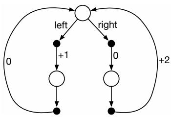

Exercise 3.23 Give the Bellman equation for  \(q_{*}\)  for the recycling robot.  \(\square\)

Exercise 3.24 Figure 3.5 gives the optimal value of the best state of the gridworld as 24.4, to one decimal place. Use your knowledge of the optimal policy and (3.8) to express this value symbolically, and then to compute it to three decimal places.  \(\square\)

Exercise 3.25 Give an equation for  \(v_{*}\)  in terms of  \(q_{*}\) .  \(\square\)

Exercise 3.26 Give an equation for  \(q_{*}\)  in terms of  \(v_{*}\)  and the four- argument  \(p\) .  \(\square\)

Exercise 3.27 Give an equation for  \(\pi_{*}\)  in terms of  \(q_{*}\) .  \(\square\)

Exercise 3.28 Give an equation for  \(\pi_{*}\)  in terms of  \(v_{*}\)  and the four- argument  \(p\) .  \(\square\)

Exercise 3.29 Rewrite the four Bellman equations for the four value functions  \((v_{\pi}, v_{*}, q_{\pi}\) , and  \(q_{*}\) ) in terms of the three argument function  \(p\)  (3.4) and the two- argument function  \(r\)  (3.5).  \(\square\)

# 3.7 Optimality and Approximation

We have defined optimal value functions and optimal policies. Clearly, an agent that learns an optimal policy has done very well, but in practice this rarely happens. For the kinds of tasks in which we are interested, optimal policies can be generated only with extreme computational cost. A well- defined notion of optimality organizes the approach to learning we describe in this book and provides a way to understand the theoretical properties of various learning algorithms, but it is an ideal that agents can only approximate. As we discussed above, even if we have a complete and accurate model of the environment's dynamics, it is usually not possible to simply compute an optimal policy by solving the Bellman optimality equation. For example, board games such as chess are a tiny fraction of human experience, yet large, custom- designed computers still cannot compute the optimal moves. A critical aspect of the problem facing the agent is always the computational power available to it, in particular, the amount of computation it can perform in a single time step.

The memory available is also an important constraint. A large amount of memory is often required to build up approximations of value functions, policies, and models. In tasks with small, finite state sets, it is possible to form these approximations using arrays or tables with one entry for each state (or state- action pair). This we call the tabular case, and the corresponding methods we call tabular methods. In many cases of practical interest, however, there are far more states than could possibly be entries in a table. In these cases the functions must be approximated, using some sort of more compact parameterized function representation.

Our framing of the reinforcement learning problem forces us to settle for approximations. However, it also presents us with some unique opportunities for achieving useful approximations. For example, in approximating optimal behavior, there may be many states that the agent faces with such a low probability that selecting suboptimal actions for them has little impact on the amount of reward the agent receives. Tesauro's backgammon player, for example, plays with exceptional skill even though it might make

very bad decisions on board configurations that never occur in games against experts. In fact, it is possible that TD- Gammon makes bad decisions for a large fraction of the game's state set. The online nature of reinforcement learning makes it possible to approximate optimal policies in ways that put more effort into learning to make good decisions for frequently encountered states, at the expense of less effort for infrequently encountered states. This is one key property that distinguishes reinforcement learning from other approaches to approximately solving MDPs.

# 3.8 Summary

Let us summarize the elements of the reinforcement learning problem that we have presented in this chapter. Reinforcement learning is about learning from interaction how to behave in order to achieve a goal. The reinforcement learning agent and its environment interact over a sequence of discrete time steps. The specification of their interface defines a particular task: the actions are the choices made by the agent; the states are the basis for making the choices; and the rewards are the basis for evaluating the choices. Everything inside the agent is known and controllable. Its environment, on the other hand, is incompletely controllable and may or may not be completely known. A policy is a stochastic rule by which the agent selects actions as a function of states. The agent's objective is to maximize the amount of reward it receives over time.

When the reinforcement learning setup described above is formulated with well defined transition probabilities it constitutes a Markov decision process (MDP). A finite MDP is an MDP with finite state, action, and (as we formulate it here) reward sets. Much of the current theory of reinforcement learning is restricted to finite MDPs, but the methods and ideas apply more generally.

The return is the function of future rewards that the agent seeks to maximize (in expected value). It has several different definitions depending upon the nature of the task and whether one wishes to discount delayed reward. The undiscounted formulation is appropriate for episodic tasks, in which the agent- environment interaction breaks naturally into episodes; the discounted formulation is appropriate for tabular continuing tasks, in which the interaction does not naturally break into episodes but continues without limit (but see Sections 10.3- 4). We try to define the returns for the two kinds of tasks such that one set of equations can apply to both the episodic and continuing cases.

A policy's value functions (  \(v_{\pi}\)  and  \(q_{\pi}\)  ) assign to each state, or state- action pair, the expected return from that state, or state- action pair, given that the agent uses the policy. The optimal value functions (  \(v_{*}\)  and  \(q_{*}\)  ) assign to each state, or state- action pair, the largest expected return achievable by any policy. A policy whose value functions are optimal is an optimal policy. Whereas the optimal value functions for states and state- action pairs are unique for a given MDP, there can be many optimal policies. Any policy that is greedy with respect to the optimal value functions must be an optimal policy. The Bellman optimality equations are special consistency conditions that the optimal value functions must satisfy and that can, in principle, be solved for the optimal value functions, from which an optimal policy can be determined with relative ease.

A reinforcement learning problem can be posed in a variety of different ways depending on assumptions about the level of knowledge initially available to the agent. In problems of complete knowledge, the agent has a complete and accurate model of the environment's dynamics. If the environment is an MDP, then such a model consists of the complete four- argument dynamics function  \(p\)  (3.2). In problems of incomplete knowledge, a complete and perfect model of the environment is not available.

Even if the agent had a complete and accurate environment model, the agent would typically be unable to fully use it because of limitations on its memory and computation per time step. In particular, extensive memory may be required to build up accurate approximations of value functions, policies, and models. In most cases of practical interest there are far more states than could possibly be entries in a table, and approximations must be made.

A well- defined notion of optimality organizes the approach to learning we describe in this book and provides a way to understand the theoretical properties of various learning algorithms, but it is an ideal that reinforcement learning agents can only approximate to varying degrees. In reinforcement learning we are very much concerned with cases in which optimal solutions cannot be found but must be approximated in some way.

# Bibliographical and Historical Remarks

The reinforcement learning problem is deeply indebted to the idea of Markov decision processes (MDPs) from the field of optimal control. These historical influences and other major influences from psychology are described in the brief history given in Chapter 1. Reinforcement learning adds to MDPs a focus on approximation and incomplete information for realistically large problems. MDPs and the reinforcement learning problem are only weakly linked to traditional learning and decision- making problems in artificial intelligence. However, artificial intelligence is now vigorously exploring MDP formulations for planning and decision making from a variety of perspectives. MDPs are more general than previous formulations used in artificial intelligence in that they permit more general kinds of goals and uncertainty.

The theory of MDPs is treated by, for example, Bertsekas (2005), White (1969), Whittle (1982, 1983), and Puterman (1994). A particularly compact treatment of the finite case is given by Ross (1985). MDPs are also studied under the heading of stochastic optimal control, where adaptive optimal control methods are most closely related to reinforcement learning (e.g., Kumar, 1985; Kumar and Varaiya, 1986).

The theory of MDPs evolved from efforts to understand the problem of making sequences of decisions under uncertainty, where each decision can depend on the previous decisions and their outcomes. It is sometimes called the theory of multistage decision processes, or sequential decision processes, and has roots in the statistical literature on sequential sampling beginning with the papers by Thompson (1933, 1934) and Robbins (1952) that we cited in Chapter 2 in connection with bandit problems (which are prototypical MDPs if formulated as multiple- situation problems).

The earliest instance (that we are aware of) in which reinforcement learning was discussed using the MDP formalism is Andreae's (1969) description of a unified view of

learning machines. Witten and Corbin (1973) experimented with a reinforcement learning system later analyzed by Witten (1977, 1976a) using the MDP formalism. Although he did not explicitly mention MDPs, Werbos (1977) suggested approximate solution methods for stochastic optimal control problems that are related to modern reinforcement learning methods (see also Werbos, 1982, 1987, 1988, 1989, 1992). Although Werbos's ideas were not widely recognized at the time, they were prescient in emphasizing the importance of approximately solving optimal control problems in a variety of domains, including artificial intelligence. The most influential integration of reinforcement learning and MDPs is due to Watkins (1989).

3.1 Our characterization of the dynamics of an MDP in terms of  \(p(s^{\prime},r|s,a)\)  is slightly unusual. It is more common in the MDP literature to describe the dynamics in terms of the state transition probabilities  \(p(s^{\prime}|s,a)\)  and expected next rewards  \(r(s,a)\) . In reinforcement learning, however, we more often have to refer to individual actual or sample rewards (rather than just their expected values). Our notation also makes it plainer that  \(S_{t}\)  and  \(R_{t}\)  are in general jointly determined, and thus must have the same time index. In teaching reinforcement learning, we have found our notation to be more straightforward conceptually and easier to understand.

For a good intuitive discussion of the system- theoretic concept of state, see Minsky (1967).

The bioreactor example is based on the work of Ungar (1990) and Miller and Williams (1992). The recycling robot example was inspired by the can- collecting robot built by Jonathan Connell (1989). Kober and Peters (2012) present a collection of robotics applications of reinforcement learning.

3.2 An explicit statement of the reward hypothesis was suggested by Michael Littman (personal communication).

3.3- 4 The terminology of episodic and continuing tasks is different from that usually used in the MDP literature. In that literature it is common to distinguish three types of tasks: (1) finite- horizon tasks, in which interaction terminates after a particular fixed number of time steps; (2) indefinite- horizon tasks, in which interaction can last arbitrarily long but must eventually terminate; and (3) infinite- horizon tasks, in which interaction does not terminate. Our episodic and continuing tasks are similar to indefinite- horizon and infinite- horizon tasks, respectively, but we prefer to emphasize the difference in the nature of the interaction. This difference seems more fundamental than the difference in the objective functions emphasized by the usual terms. Often episodic tasks use an indefinite- horizon objective function and continuing tasks an infinite- horizon objective function, but we see this as a common coincidence rather than a fundamental difference.

The pole- balancing example is from Michie and Chambers (1968) and Barto, Sutton, and Anderson (1983).

3.5- 6 Assigning value on the basis of what is good or bad in the long run has ancient roots. In control theory, mapping states to numerical values representing the long- term consequences of control decisions is a key part of optimal control theory, which was developed in the 1950s by extending nineteenth century state- function theories of classical mechanics (see, for example, Schultz and Melsa, 1967). In describing how a computer could be programmed to play chess, Shannon (1950) suggested using an evaluation function that took into account the long- term advantages and disadvantages of chess positions.

Watkins's (1989) Q- learning algorithm for estimating  \(q_{*}\)  (Chapter 6) made action- value functions an important part of reinforcement learning, and consequently these functions are often called "Q- functions." But the idea of an action- value function is much older than this. Shannon (1950) suggested that a function  \(h(P, M)\)  could be used by a chess- playing program to decide whether a move  \(M\)  in position  \(P\)  is worth exploring. Michie's (1961, 1963) MENACE system and Michie and Chambers's (1968) BOXES system can be understood as estimating action- value functions. In classical physics, Hamilton's principal function is an action- value function; Newtonian dynamics are greedy with respect to this function (e.g., Goldstein, 1957). Action- value functions also played a central role in Denardo's (1967) theoretical treatment of dynamic programming in terms of contraction mappings.

The Bellman optimality equation (for  \(v_{*}\) ) was popularized by Richard Bellman (1957a), who called it the "basic functional equation." The counterpart of the Bellman optimality equation for continuous time and state problems is known as the Hamilton- Jacobi- Bellman equation (or often just the Hamilton- Jacobi equation), indicating its roots in classical physics (e.g., Schultz and Melsa, 1967). The golf example was suggested by Chris Watkins.