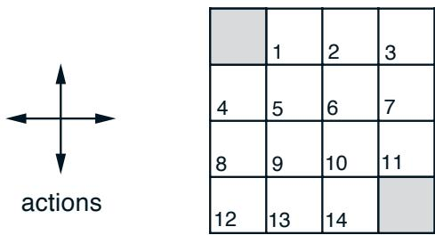
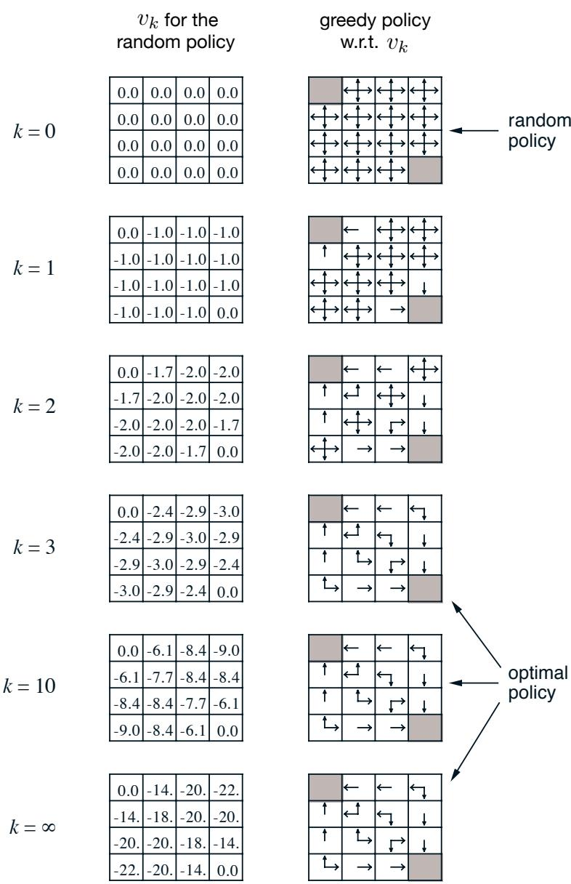
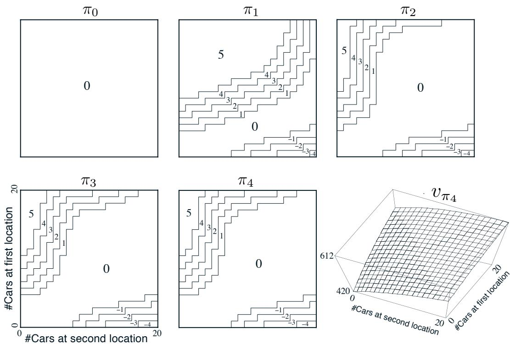
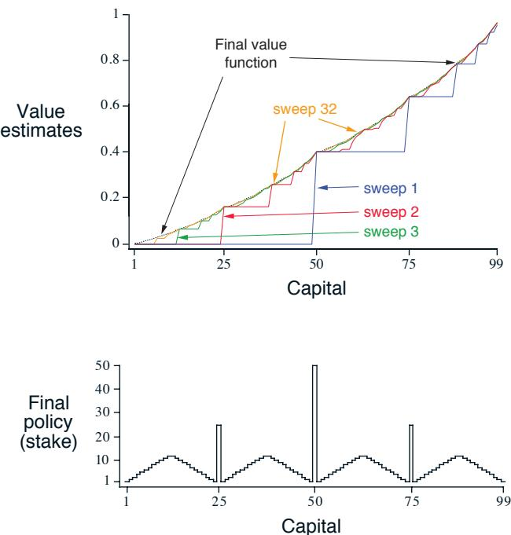
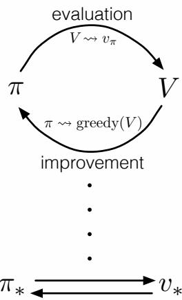
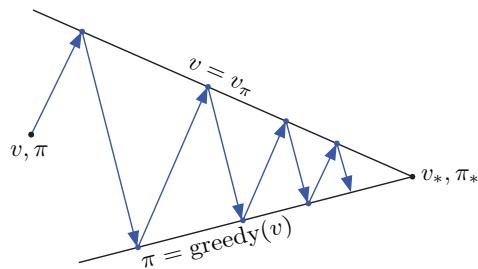

# Chapter 4

# Dynamic Programming

The term dynamic programming (DP) refers to a collection of algorithms that can be used to compute optimal policies given a perfect model of the environment as a Markov decision process (MDP). Classical DP algorithms are of limited utility in reinforcement learning both because of their assumption of a perfect model and because of their great computational expense, but they are still important theoretically. DP provides an essential foundation for the understanding of the methods presented in the rest of this book. In fact, all of these methods can be viewed as attempts to achieve much the same effect as DP, only with less computation and without assuming a perfect model of the environment.

Starting with this chapter, we usually assume that the environment is a finite MDP. That is, we assume that its state, action, and reward sets,  $\mathcal{S}$ $\mathcal{A}$  , and  $\mathcal{R}$  , are finite, and that its dynamics are given by a set of probabilities  $p(s^{\prime},r|s,a)$  , for all  $s\in \mathcal{S}$ $a\in \mathcal{A}(s)$ $r\in \mathcal{R}$  , and  $s^{\prime}\in \mathcal{S}^{+}$  -  $\mathcal{S}^{+}$  is S plus a terminal state if the problem is episodic). Although DP ideas can be applied to problems with continuous state and action spaces, exact solutions are possible only in special cases. A common way of obtaining approximate solutions for tasks with continuous states and actions is to quantize the state and action spaces and then apply finite- state DP methods. The methods we explore in Part II are applicable to continuous problems and are a significant extension of that approach.

The key idea of DP, and of reinforcement learning generally, is the use of value functions to organize and structure the search for good policies. In this chapter we show how DP can be used to compute the value functions defined in Chapter 3. As discussed there, we can easily obtain optimal policies once we have found the optimal value functions,  $v_{*}$  or  $q_{*}$  , which satisfy the Bellman optimality equations:

$$
\begin{array}{l}{{v_{*}(s)=\max _{t}\mathbb{E}[R_{t+1}+\gamma v_{*}(S_{t+1})\mid S_{t}=s,A_{t}=a]}}\\ {{\mathrm{~}=\max _{a}\sum_{s^{\prime},r}p(s^{\prime},r\mid s,a)\Big[r+\gamma v_{*}(s^{\prime})\Big],}}\end{array} \tag{4.1}
$$

or

$$
\begin{array}{l}{{q_{*}(s,a)=\mathbb{E}\Big[R_{t+1}+\gamma\max _{a^{\prime}}q_{*}(S_{t+1},a^{\prime})\Big|S_{t}=s,A_{t}=a\Big]}}\\ {{=\sum_{s^{\prime},r}p(s^{\prime},r\mid s,a)\Big[r+\gamma\max _{a^{\prime}}q_{*}(s^{\prime},a^{\prime})\Big],}}\end{array} \tag{4.2}
$$

for all  $s \in \mathcal{S}$ ,  $a \in \mathcal{A}(s)$ , and  $s' \in \mathcal{S}^+$ . As we shall see, DP algorithms are obtained by turning Bellman equations such as these into assignments, that is, into update rules for improving approximations of the desired value functions.

# 4.1 Policy Evaluation (Prediction)

First we consider how to compute the state- value function  $v_{\pi}$  for an arbitrary policy  $\pi$ . This is called policy evaluation in the DP literature. We also refer to it as the prediction problem. Recall from Chapter 3 that, for all  $s \in \mathcal{S}$ ,

$$
\begin{array}{r l} & {v_{\pi}(s)\doteq \mathbb{E}_{\pi}[G_{t}\mid S_{t} = s]}\\ & {\qquad = \mathbb{E}_{\pi}[R_{t + 1} + \gamma G_{t + 1}\mid S_{t} = s]}\\ & {\qquad = \mathbb{E}_{\pi}[R_{t + 1} + \gamma v_{\pi}(S_{t + 1})\mid S_{t} = s]}\\ & {\qquad = \sum_{a}\pi (a|s)\sum_{s',r}p(s',r|s,a)\Big[r + \gamma v_{\pi}(s')\Big],} \end{array} \tag{4.3}
$$

(from (3.9))

where  $\pi (a|s)$  is the probability of taking action  $a$  in state  $s$  under policy  $\pi$  , and the expectations are subscripted by  $\pi$  to indicate that they are conditional on  $\pi$  being followed. The existence and uniqueness of  $v_{\pi}$  are guaranteed as long as either  $\gamma < 1$  or eventual termination is guaranteed from all states under the policy  $\pi$

If the environment's dynamics are completely known, then (4.4) is a system of  $|\mathcal{S}|$  simultaneous linear equations in  $|\mathcal{S}|$  unknowns (the  $v_{\pi}(s)$ ,  $s \in \mathcal{S}$ ). In principle, its solution is a straightforward, if tedious, computation. For our purposes, iterative solution methods are most suitable. Consider a sequence of approximate value functions  $v_{0}, v_{1}, v_{2}, \ldots$ , each mapping  $\mathcal{S}^+$  to  $\mathbb{R}$  (the real numbers). The initial approximation,  $v_{0}$ , is chosen arbitrarily (except that the terminal state, if any, must be given value 0), and each successive approximation is obtained by using the Bellman equation for  $v_{\pi}$  (4.4) as an update rule:

$$
\begin{array}{r c l}{{v_{k+1}(s)}}&{{\doteq}}&{{\mathbb{E}_{\pi}[R_{t+1}+\gamma v_{k}(S_{t+1})\mid S_{t}=s]}}\\ {{}}&{{=}}&{{\sum_{a}\pi(a|s)\sum_{s,r}p(s^{\prime},r|s,a)\Big[r+\gamma v_{k}(s^{\prime})\Big],}}\end{array} \tag{4.5}
$$

for all  $s\in \mathcal{S}$  . Clearly,  $v_{k} = v_{\pi}$  is a fixed point for this update rule because the Bellman equation for  $v_{\pi}$  assures us of equality in this case. Indeed, the sequence  $\{v_{k}\}$  can be shown in general to converge to  $v_{\pi}$  as  $k\rightarrow \infty$  under the same conditions that guarantee the existence of  $v_{\pi}$  . This algorithm is called iterative policy evaluation.

To produce each successive approximation,  $v_{k + 1}$  from  $v_{k}$  , iterative policy evaluation applies the same operation to each state  $s$  : it replaces the old value of  $s$  with a new value obtained from the old values of the successor states of  $s$  , and the expected immediate rewards, along all the one- step transitions possible under the policy being evaluated. We call this kind of operation an expected update. Each iteration of iterative policy evaluation updates the value of every state once to produce the new approximate value function

$v_{k + 1}$ . There are several different kinds of expected updates, depending on whether a state (as here) or a state- action pair is being updated, and depending on the precise way the estimated values of the successor states are combined. All the updates done in DP algorithms are called expected updates because they are based on an expectation over all possible next states rather than on a sample next state. The nature of an update can be expressed in an equation, as above, or in a backup diagram like those introduced in Chapter 3. For example, the backup diagram corresponding to the expected update used in iterative policy evaluation is shown on page 59.

To write a sequential computer program to implement iterative policy evaluation as given by (4.5) you would have to use two arrays, one for the old values,  $v_{k}(s)$ , and one for the new values,  $v_{k + 1}(s)$ . With two arrays, the new values can be computed one by one from the old values without the old values being changed. Alternatively, you could use one array and update the values "in place," that is, with each new value immediately overwriting the old one. Then, depending on the order in which the states are updated, sometimes new values are used instead of old ones on the right- hand side of (4.5). This in- place algorithm also converges to  $v_{\pi}$ ; in fact, it usually converges faster than the two- array version, as you might expect, because it uses new data as soon as they are available. We think of the updates as being done in a sweep through the state space. For the in- place algorithm, the order in which states have their values updated during the sweep has a significant influence on the rate of convergence. We usually have the in- place version in mind when we think of DP algorithms.

A complete in- place version of iterative policy evaluation is shown in pseudocode in the box below. Note how it handles termination. Formally, iterative policy evaluation converges only in the limit, but in practice it must be halted short of this. The pseudocode tests the quantity  $\max_{s \in \mathbb{S}} |v_{k + 1}(s) - v_{k}(s)|$  after each sweep and stops when it is sufficiently small.

# Iterative Policy Evaluation, for estimating  $V \approx v_{\pi}$

Input  $\pi$ , the policy to be evaluated

Algorithm parameter: a small threshold  $\theta > 0$  determining accuracy of estimation Initialize  $V(s)$  arbitrarily, for  $s \in \mathbb{S}$ , and  $V(\text{terminal})$  to 0

Loop:

$\Delta \leftarrow 0$

Loop for each  $s \in \mathbb{S}$ :

$$
\begin{array}{r l} & {v\leftarrow V(s)}\\ & {V(s)\leftarrow \sum_{a}\pi (a|s)\sum_{s^{\prime},r}p(s^{\prime},r|s,a)\left[r + \gamma V(s^{\prime})\right]}\\ & {\Delta \leftarrow \max (\Delta ,|v - V(s)|)} \end{array}
$$

until  $\Delta < \theta$

Example 4.1 Consider the  $4 \times 4$  gridworld shown below.

$R_{t} = - 1$  on all transitions

The nonterminal states are  $\mathcal{S} = \{1,2,\ldots ,14\}$ . There are four actions possible in each state,  $\mathcal{A} = \{\mathrm{up}, \mathrm{down}, \mathrm{right}, \mathrm{left}\}$ , which deterministically cause the corresponding state transitions, except that actions that would take the agent off the grid in fact leave the state unchanged. Thus, for instance,  $p(6, - 1|5, \mathrm{right}) = 1$ ,  $p(7, - 1|7, \mathrm{right}) = 1$ , and  $p(10, r|5, \mathrm{right}) = 0$  for all  $r \in \mathcal{R}$ . This is an undiscounted, episodic task. The reward is  $- 1$  on all transitions until the terminal state is reached. The terminal state is shaded in the figure (although it is shown in two places, it is formally one state). The expected reward function is thus  $r(s, a, s') = - 1$  for all states  $s, s'$  and actions  $a$ . Suppose the agent follows the equiprobable random policy (all actions equally likely). The left side of Figure 4.1 shows the sequence of value functions  $\{v_{k}\}$  computed by iterative policy evaluation. The final estimate is in fact  $v_{\pi}$ , which in this case gives for each state the negation of the expected number of steps from that state until termination.

Exercise 4.1 In Example 4.1, if  $\pi$  is the equiprobable random policy, what is  $q_{\pi}(11, \mathrm{down})$ ? What is  $q_{\pi}(7, \mathrm{down})$ ?

Exercise 4.2 In Example 4.1, suppose a new state 15 is added to the gridworld just below state 13, and its actions, left, up, right, and down, take the agent to states 12, 13, 14, and 15, respectively. Assume that the transitions from the original states are unchanged. What, then, is  $v_{\pi}(15)$  for the equiprobable random policy? Now suppose the dynamics of state 13 are also changed, such that action down from state 13 takes the agent to the new state 15. What is  $v_{\pi}(15)$  for the equiprobable random policy in this case?

Exercise 4.3 What are the equations analogous to (4.3), (4.4), and (4.5), but for action- value functions instead of state- value functions?

# 4.2 Policy Improvement

Our reason for computing the value function for a policy is to help find better policies. Suppose we have determined the value function  $v_{\pi}$  for an arbitrary deterministic policy  $\pi$ . For some state  $s$  we would like to know whether or not we should change the policy to deterministically choose an action  $a \neq \pi (s)$ . We know how good it is to follow the current policy from  $s$ —that is  $v_{\pi}(s)$ —but would it be better or worse to change to the new policy? One way to answer this question is to consider selecting  $a$  in  $s$  and thereafter

  
Figure 4.1: Convergence of iterative policy evaluation on a small gridworld. The left column is the sequence of approximations of the state-value function for the random policy (all actions equally likely). The right column is the sequence of greedy policies corresponding to the value function estimates (arrows are shown for all actions achieving the maximum, and the numbers shown are rounded to two significant digits). The last policy is guaranteed only to be an improvement over the random policy, but in this case it, and all policies after the third iteration, are optimal.

following the existing policy,  $\pi$ . The value of this way of behaving is

$$
\begin{array}{l l l}{{q_{\pi}(s,a)}}&{{\doteq}}&{{\mathbb{E}[R_{t+1}+\gamma v_{\pi}(S_{t+1})\mid S_{t}=s,A_{t}=a]}}\\ {{}}&{{}}&{{}}\\ {{}}&{{=}}&{{\sum_{s^{\prime},r}p(s^{\prime},r\mid s,a)\Big[r+\gamma v_{\pi}(s^{\prime})\Big].}}\end{array} \tag{4.6}
$$

The key criterion is whether this is greater than or less than  $v_{\pi}(s)$ . If it is greater—that is, if it is better to select  $a$  once in  $s$  and thereafter follow  $\pi$  than it would be to follow  $\pi$  all the time—then one would expect it to be better still to select  $a$  every time  $s$  is encountered, and that the new policy would in fact be a better one overall.

That this is true is a special case of a general result called the policy improvement theorem. Let  $\pi$  and  $\pi '$  be any pair of deterministic policies such that, for all  $s \in \mathcal{S}$ ,

$$
q_{\pi}(s, \pi '(s)) \geq v_{\pi}(s). \tag{4.7}
$$

Then the policy  $\pi '$  must be as good as, or better than,  $\pi$ . That is, it must obtain greater or equal expected return from all states  $s \in \mathcal{S}$ :

$$
v_{\pi^{\prime}}(s)\geq v_{\pi}(s). \tag{4.8}
$$

Moreover, if there is strict inequality of (4.7) at any state, then there must be strict inequality of (4.8) at that state.

The policy improvement theorem applies to the two policies that we considered at the beginning of this section: an original deterministic policy,  $\pi$ , and a changed policy,  $\pi '$ , that is identical to  $\pi$  except that  $\pi '(s) = a \neq \pi (s)$ . For states other than  $s$ , (4.7) holds because the two sides are equal. Thus, if  $q_{\pi}(s, a) > v_{\pi}(s)$ , then the changed policy is indeed better than  $\pi$ .

The idea behind the proof of the policy improvement theorem is easy to understand. Starting from (4.7), we keep expanding the  $q_{\pi}$  side with (4.6) and reapplying (4.7) until we get  $v_{\pi '}(s)$ :

$$
\begin{array}{r l} & {v_{\pi}(s)\leq q_{\pi}(s,\pi^{\prime}(s))}\\ & {\qquad = \mathbb{E}[R_{t + 1} + \gamma v_{\pi}(S_{t + 1})\mid S_{t} = s,A_{t} = \pi^{\prime}(s)]}\\ & {\qquad = \mathbb{E}_{\pi^{\prime}}[R_{t + 1} + \gamma v_{\pi}(S_{t + 1})\mid S_{t} = s]}\\ & {\qquad \leq \mathbb{E}_{\pi^{\prime}}[R_{t + 1} + \gamma q_{\pi}(S_{t + 1},\pi^{\prime}(S_{t + 1}))\mid S_{t} = s]}\\ & {\qquad = \mathbb{E}_{\pi^{\prime}}[R_{t + 1} + \gamma \mathbb{E}[R_{t + 2} + \gamma v_{\pi}(S_{t + 2})|S_{t + 1},A_{t + 1} = \pi^{\prime}(S_{t + 1})]\mid S_{t} = s]}\\ & {\qquad = \mathbb{E}_{\pi^{\prime}}[R_{t + 1} + \gamma R_{t + 2} + \gamma^{2}v_{\pi}(S_{t + 2})\mid S_{t} = s]}\\ & {\qquad \leq \mathbb{E}_{\pi^{\prime}}[R_{t + 1} + \gamma R_{t + 2} + \gamma^{2}R_{t + 3} + \gamma^{3}v_{\pi}(S_{t + 3})\mid S_{t} = s]}\\ & {\qquad \vdots}\\ & {\qquad \leq \mathbb{E}_{\pi^{\prime}}[R_{t + 1} + \gamma R_{t + 2} + \gamma^{2}R_{t + 3} + \gamma^{3}R_{t + 4} + \dots \mid S_{t} = s]}\\ & {\qquad = v_{\pi^{\prime}}(s).} \end{array} \tag{by (4.6)
$$

So far we have seen how, given a policy and its value function, we can easily evaluate a change in the policy at a single state. It is a natural extension to consider changes at

all states, selecting at each state the action that appears best according to  $q_{\pi}(s,a)$ . In other words, to consider the new greedy policy,  $\pi '$ , given by

$$
\begin{array}{l l l}{{\pi^{\prime}(s)}}&{{\doteq}}&{{\arg\max _{a}q_{\pi}(s,a)}}\\ {{}}&{{}}&{{}}\\ {{}}&{{=}}&{{\arg\max _{a}\mathbb{E}[R_{t+1}+\gamma v_{\pi}(S_{t+1})\mid S_{t}=s,A_{t}=a]}}\\ {{}}&{{}}&{{}}\\ {{}}&{{=}}&{{\arg\max _{a}\sum_{s^{\prime},r}p(s^{\prime},r\mid s,a)\Big[r+\gamma v_{\pi}(s^{\prime})\Big],}}\end{array} \tag{4.9}
$$

where  $\arg \max_{a}$  denotes the value of  $a$  at which the expression that follows is maximized (with ties broken arbitrarily). The greedy policy takes the action that looks best in the short term—after one step of lookahead—according to  $v_{\pi}$ . By construction, the greedy policy meets the conditions of the policy improvement theorem (4.7), so we know that it is as good as, or better than, the original policy. The process of making a new policy that improves on an original policy, by making it greedy with respect to the value function of the original policy, is called policy improvement.

Suppose the new greedy policy,  $\pi '$ , is as good as, but not better than, the old policy  $\pi$ . Then  $v_{\pi} = v_{\pi '}$ , and from (4.9) it follows that for all  $s \in \mathbb{S}$ :

$$
\begin{array}{r c l}{{v_{\pi^{\prime}}(s)}}&{{=}}&{{\max _{a}\mathbb{E}[R_{t+1}+\gamma v_{\pi^{\prime}}(S_{t+1})\mid S_{t}=s,A_{t}=a]}}\\ {{}}&{{=}}&{{\max _{a}\sum_{s^{\prime},r}p(s^{\prime},r\mid s,a)\Big[r+\gamma v_{\pi^{\prime}}(s^{\prime})\Big].}}\end{array}
$$

But this is the same as the Bellman optimality equation (4.1), and therefore,  $v_{\pi '}$  must be  $v_{*}$ , and both  $\pi$  and  $\pi '$  must be optimal policies. Policy improvement thus must give us a strictly better policy except when the original policy is already optimal.

So far in this section we have considered the special case of deterministic policies. In the general case, a stochastic policy  $\pi$  specifies probabilities,  $\pi (a|s)$ , for taking each action,  $a$ , in each state,  $s$ . We will not go through the details, but in fact all the ideas of this section extend easily to stochastic policies. In particular, the policy improvement theorem carries through as stated for the stochastic case. In addition, if there are ties in policy improvement steps such as (4.9)—that is, if there are several actions at which the maximum is achieved—then in the stochastic case we need not select a single action from among them. Instead, each maximizing action can be given a portion of the probability of being selected in the new greedy policy. Any apportioning scheme is allowed as long as all submaximal actions are given zero probability.

The last row of Figure 4.1 shows an example of policy improvement for stochastic policies. Here the original policy,  $\pi$ , is the equiprobable random policy, and the new policy,  $\pi '$ , is greedy with respect to  $v_{\pi}$ . The value function  $v_{\pi}$  is shown in the bottom- left diagram and the set of possible  $\pi '$  is shown in the bottom- right diagram. The states with multiple arrows in the  $\pi '$  diagram are those in which several actions achieve the maximum in (4.9); any apportionment of probability among these actions is permitted. For any such policy, its state values  $v_{\pi '(s)}$  can be seen by inspection to be either  $- 1$ ,  $- 2$ , or  $- 3$ , for all states  $s \in \mathbb{S}$ , whereas  $v_{\pi}(s)$  is at most  $- 14$ . Thus,  $v_{\pi '(s)} \geq v_{\pi}(s)$ , for all

$s \in \mathcal{S}$ , illustrating policy improvement. Although in this case the new policy  $\pi '$  happens to be optimal, in general only an improvement is guaranteed.

# 4.3 Policy Iteration

Once a policy,  $\pi$ , has been improved using  $v_{\pi}$  to yield a better policy,  $\pi '$ , we can then compute  $v_{\pi '}$  and improve it again to yield an even better  $\pi ''$ . We can thus obtain a sequence of monotonically improving policies and value functions:

$$
\pi_{0} \xrightarrow{\mathrm{~E~}} v_{\pi_{0}} \xrightarrow{\mathrm{~I~}} \pi_{1} \xrightarrow{\mathrm{~E~}} v_{\pi_{1}} \xrightarrow{\mathrm{~I~}} \pi_{2} \xrightarrow{\mathrm{~E~}} \dots \xrightarrow{\mathrm{~I~}} \pi_{*} \xrightarrow{\mathrm{~E~}} v_{*},
$$

where  $\xrightarrow{\mathrm{~E~}}$  denotes a policy evaluation and  $\xrightarrow{\mathrm{~I~}}$  denotes a policy improvement. Each policy is guaranteed to be a strict improvement over the previous one (unless it is already optimal). Because a finite MDP has only a finite number of deterministic policies, this process must converge to an optimal policy and the optimal value function in a finite number of iterations.

This way of finding an optimal policy is called policy iteration. A complete algorithm is given in the box below. Note that each policy evaluation, itself an iterative computation, is started with the value function for the previous policy. This typically results in a great increase in the speed of convergence of policy evaluation (presumably because the value function changes little from one policy to the next).

# Policy Iteration (using iterative policy evaluation) for estimating  $\pi \approx \pi_{*}$

1. Initialization

$V(s) \in \mathbb{R}$  and  $\pi (s) \in \mathcal{A}(s)$  arbitrarily for all  $s \in \mathcal{S}$ ;  $V(\text{terminal}) \doteq 0$

2. Policy Evaluation

Loop:

$\Delta \leftarrow 0$

Loop for each  $s \in \mathcal{S}$ :

$$
\begin{array}{r l} & {V(s)\leftarrow \sum_{s^{\prime},r}p(s^{\prime},r|s,\pi (s))[r + \gamma V(s^{\prime})]}\\ & {\Delta \leftarrow \max (\Delta ,|v - V(s)|)} \end{array}
$$

until  $\Delta < \theta$  (a small positive number determining the accuracy of estimation)

3. Policy Improvement

policy- stable  $\leftarrow$  true

For each  $s \in \mathcal{S}$ :

old- action  $\leftarrow \pi (s)$

$\pi (s) \leftarrow \arg \max_{a} \sum_{s', r} p(s', r | s, a) \left[r + \gamma V(s') \right]$

If old- action  $\neq \pi (s)$ , then policy- stable  $\leftarrow$  false

If policy- stable, then stop and return  $V \approx v_{*}$  and  $\pi \approx \pi_{*}$ ; else go to 2

Example 4.2: Jack's Car Rental Jack manages two locations for a nationwide car rental company. Each day, some number of customers arrive at each location to rent cars. If Jack has a car available, he rents it out and is credited  $\) 10\(by the national company. If he is out of cars at that location, then the business is lost. Cars become available for renting the day after they are returned. To help ensure that cars are available where they are needed, Jack can move them between the two locations overnight, at a cost of$ \ $2$  per car moved. We assume that the number of cars requested and returned at each location are Poisson random variables, meaning that the probability that the number is  $n$  is  $\frac{\lambda^n}{n!} e^{- \lambda}$ , where  $\lambda$  is the expected number. Suppose  $\lambda$  is 3 and 4 for rental requests at the first and second locations and 3 and 2 for returns. To simplify the problem slightly, we assume that there can be no more than 20 cars at each location (any additional cars are returned to the nationwide company, and thus disappear from the problem) and a maximum of five cars can be moved from one location to the other in one night. We take the discount rate to be  $\gamma = 0.9$  and formulate this as a continuing finite MDP, where the time steps are days, the state is the number of cars at each location at the end of the day, and the actions are the net numbers of cars moved between the two locations overnight. Figure 4.2 shows the sequence of policies found by policy iteration starting from the policy that never moves any cars.

  
Figure 4.2: The sequence of policies found by policy iteration on Jack's car rental problem, and the final state-value function. The first five diagrams show, for each number of cars at each location at the end of the day, the number of cars to be moved from the first location to the second (negative numbers indicate transfers from the second location to the first). Each successive policy is a strict improvement over the previous policy, and the last policy is optimal.

Policy iteration often converges in surprisingly few iterations, as illustrated in the example of Jack's car rental and in the example in Figure 4.1. The bottom- left diagram of Figure 4.1 shows the value function for the equiprobable random policy, and the bottom- right diagram shows a greedy policy for this value function. The policy improvement theorem assures us that these policies are better than the original random policy. In this case, however, these policies are not just better, but optimal, proceeding to the terminal states in the minimum number of steps. In this example, policy iteration would find the optimal policy after just one iteration.

Exercise 4.4 The policy iteration algorithm on page 80 has a subtle bug in that it may never terminate if the policy continually switches between two or more policies that are equally good. This is okay for pedagogy, but not for actual use. Modify the pseudocode so that convergence is guaranteed.

Exercise 4.5 How would policy iteration be defined for action values? Give a complete algorithm for computing  $q_{*}$ , analogous to that on page 80 for computing  $v_{*}$ . Please pay special attention to this exercise, because the ideas involved will be used throughout the rest of the book.

Exercise 4.6 Suppose you are restricted to considering only policies that are  $\epsilon$ - soft, meaning that the probability of selecting each action in each state,  $s$ , is at least  $\epsilon /|\mathcal{A}(s)|$ . Describe qualitatively the changes that would be required in each of the steps 3, 2, and 1, in that order, of the policy iteration algorithm for  $v_{*}$  on page 80.

Exercise 4.7 (programming). Write a program for policy iteration and re- solve Jack's car rental problem with the following changes. One of Jack's employees at the first location rides a bus home each night and lives near the second location. She is happy to shuttle one car to the second location for free. Each additional car still costs  $2, as do all cars moved in the other direction. In addition, Jack has limited parking space at each location. If more than 10 cars are kept overnight at a location (after any moving of cars), then an additional cost of$ 4 must be incurred to use a second parking lot (independent of how many cars are kept there). These sorts of nonlinearities and arbitrary dynamics often occur in real problems and cannot easily be handled by optimization methods other than dynamic programming. To check your program, first replicate the results given for the original problem.

# 4.4 Value Iteration

One drawback to policy iteration is that each of its iterations involves policy evaluation, which may itself be a protracted iterative computation requiring multiple sweeps through the state set. If policy evaluation is done iteratively, then convergence exactly to  $v_{\pi}$  occurs only in the limit. Must we wait for exact convergence, or can we stop short of that? The example in Figure 4.1 certainly suggests that it may be possible to truncate policy evaluation. In that example, policy evaluation iterations beyond the first three have no effect on the corresponding greedy policy.

In fact, the policy evaluation step of policy iteration can be truncated in several ways without losing the convergence guarantees of policy iteration. One important special

case is when policy evaluation is stopped after just one sweep (one update of each state). This algorithm is called value iteration. It can be written as a particularly simple update operation that combines the policy improvement and truncated policy evaluation steps:

$$
\begin{array}{r c l}{{v_{k+1}(s)}}&{{\doteq}}&{{\max _{a}\mathbb{E}[R_{t+1}+\gamma v_{k}(S_{t+1})\mid S_{t}=s,A_{t}=a]}}\\ {{}}&{{}}&{{}}\\ {{}}&{{=}}&{{\max _{a}\sum_{s^{\prime},r}p(s^{\prime},r\mid s,a)\Big[r+\gamma v_{k}(s^{\prime})\Big],}}\end{array} \tag{4.10}
$$

for all  $s\in \mathcal{S}$  . For arbitrary  $v_{0}$  , the sequence  $\{v_{k}\}$  can be shown to converge to  $v_{*}$  under the same conditions that guarantee the existence of  $v_{*}$

Another way of understanding value iteration is by reference to the Bellman optimality equation (4.1). Note that value iteration is obtained simply by turning the Bellman optimality equation into an update rule. Also note how the value iteration update is identical to the policy evaluation update (4.5) except that it requires the maximum to be taken over all actions. Another way of seeing this close relationship is to compare the backup diagrams for these algorithms on page 59 (policy evaluation) and on the left of Figure 3.4 (value iteration). These two are the natural backup operations for computing  $v_{\pi}$  and  $v_{*}$

Finally, let us consider how value iteration terminates. Like policy evaluation, value iteration formally requires an infinite number of iterations to converge exactly to  $v_{*}$  . In practice, we stop once the value function changes by only a small amount in a sweep. The box below shows a complete algorithm with this kind of termination condition.

# Value Iteration, for estimating  $\pi \approx \pi_{*}$

Algorithm parameter: a small threshold  $\theta >0$  determining accuracy of estimation Initialize  $V(s)$  , for all  $s\in \mathcal{S}^{+}$  , arbitrarily except that  $V(t e r m i n a l) = 0$

Loop:

$\Delta \leftarrow 0$

Loop for each  $s\in \mathcal{S}$

$$
\begin{array}{r l} & {v\leftarrow V(s)}\\ & {V(s)\leftarrow \max_{a}\sum_{s^{\prime},r}p(s^{\prime},r|s,a)\left[r + \gamma V(s^{\prime})\right]}\\ & {\Delta \leftarrow \max (\Delta ,|v - V(s)|)} \end{array}
$$

until  $\Delta < \theta$

Output a deterministic policy,  $\pi \approx \pi_{*}$  , such that  $\begin{array}{r}{\pi (s) = \arg \max_{a}\sum_{s^{\prime},r}p(s^{\prime},r|s,a)\left[r + \gamma V(s^{\prime})\right]} \end{array}$

Value iteration effectively combines, in each of its sweeps, one sweep of policy evaluation and one sweep of policy improvement. Faster convergence is often achieved by interposing multiple policy evaluation sweeps between each policy improvement sweep. In general, the entire class of truncated policy iteration algorithms can be thought of as sequences of sweeps, some of which use policy evaluation updates and some of which use value iteration updates. Because the max operation in (4.10) is the only difference between

these updates, this just means that the max operation is added to some sweeps of policy evaluation. All of these algorithms converge to an optimal policy for discounted finite MDPs.

Example 4.3: Gambler's Problem A gambler has the opportunity to make bets on the outcomes of a sequence of coin flips. If the coin comes up heads, he wins as many dollars as he has staked on that flip; if it is tails, he loses his stake. The game ends when the gambler wins by reaching his goal of \(\) 100\(, or loses by running out of money. On each flip, the gambler must decide what portion of his capital to stake, in integer numbers of dollars. This problem can be formulated as an undiscounted, episodic, finite MDP. The state is the gambler's capital,\)s\in\{1,2,\ldots,99\}\(and the actions are stakes,\)a\in\{0,1,\ldots,\min (s,100- s)\}\(. The reward is zero on all transitions except those on which the gambler reaches his goal, when it is\)+1\(. The state - value function then gives the probability of winning from each state. A policy is a mapping from levels of capital to stakes. The optimal policy maximizes the probability of reaching the goal. Let\)p_{h}\(denote the probability of the coin coming up heads. If\)p_{h}\(is known, then the entire problem is known and it can be solved, for instance, by value iteration. Figure 4.3 shows the change in the value function over successive sweeps of value iteration, and the final policy found, for the case of\)p_{h}=0.4\(. This policy is optimal, but not unique. In fact, there is a whole family of optimal policies, all corresponding to ties for the argmax action selection with respect to the optimal value function. Can you guess what the entire family looks like?

The reward is zero on all transitions except those on which the gambler reaches his goal, when it is  $+1$  The state- value function then gives the probability of winning from each state. A policy is a mapping from levels of capital to stakes. The optimal policy maximizes the probability of reaching the goal. Let  $p_{h}$  denote the probability of the coin coming up heads. If  $p_{h}$  is known, then the entire problem is known and it can be solved, for instance, by value iteration. Figure 4.3 shows the change in the value function over successive sweeps of value iteration, and the final policy found, for the case of  $p_{h} = 0.4$  . This policy is optimal, but not unique. In fact, there is a whole family of optimal policies, all corresponding to ties for the argmax action selection with respect to the optimal value function. Can you guess what the entire family looks like?

  
Figure 4.3: The solution to the gambler's problem for  $p_{h} = 0.4$  . The upper graph shows the value function found by successive sweeps of value iteration. The lower graph shows the final policy.

Exercise 4.8 Why does the optimal policy for the gambler's problem have such a curious form? In particular, for capital of 50 it bets it all on one flip, but for capital of 51 it does not. Why is this a good policy?

Exercise 4.9 (programming) Implement value iteration for the gambler's problem and solve it for  $p_{h} = 0.25$  and  $p_{h} = 0.55$  . In programming, you may find it convenient to introduce two dummy states corresponding to termination with capital of 0 and 100, giving them values of 0 and 1 respectively. Show your results graphically, as in Figure 4.3. Are your results stable as  $6\rightarrow 0$ $\boxed{ \begin{array}{r l} \end{array} }$

Exercise 4.10 What is the analog of the value iteration update (4.10) for action values,  $q_{k + 1}(s,a)$ ?

# 4.5 Asynchronous Dynamic Programming

A major drawback to the DP methods that we have discussed so far is that they involve operations over the entire state set of the MDP, that is, they require sweeps of the state set. If the state set is very large, then even a single sweep can be prohibitively expensive. For example, the game of backgammon has over  $10^{20}$  states. Even if we could perform the value iteration update on a million states per second, it would take over a thousand years to complete a single sweep.

Asynchronous DP algorithms are in- place iterative DP algorithms that are not organized in terms of systematic sweeps of the state set. These algorithms update the values of states in any order whatsoever, using whatever values of other states happen to be available. The values of some states may be updated several times before the values of others are updated once. To converge correctly, however, an asynchronous algorithm must continue to update the values of all the states: it can't ignore any state after some point in the computation. Asynchronous DP algorithms allow great flexibility in selecting states to update.

For example, one version of asynchronous value iteration updates the value, in place, of only one state,  $s_k$  , on each step,  $k$  , using the value iteration update (4.10). If  $0\leq \gamma < 1$  asymptotic convergence to  $v_{*}$  is guaranteed given only that all states occur in the sequence  $\{s_{k}\}$  an infinite number of times (the sequence could even be random).1 Similarly, it is possible to intermix policy evaluation and value iteration updates to produce a kind of asynchronous truncated policy iteration. Although the details of this and other more unusual DP algorithms are beyond the scope of this book, it is clear that a few different updates form building blocks that can be used flexibly in a wide variety of sweepless DP algorithms.

Of course, avoiding sweeps does not necessarily mean that we can get away with less computation. It just means that an algorithm does not need to get locked into any hopelessly long sweep before it can make progress improving a policy. We can try to take advantage of this flexibility by selecting the states to which we apply updates so as to improve the algorithm's rate of progress. We can try to order the updates to let value information propagate from state to state in an efficient way. Some states may not need their values updated as often as others. We might even try to skip updating some states entirely if they are not relevant to optimal behavior. Some ideas for doing this are discussed in Chapter 8.

Asynchronous algorithms also make it easier to intermix computation with real- time interaction. To solve a given MDP, we can run an iterative DP algorithm at the same time that an agent is actually experiencing the MDP. The agent's experience can be used to determine the states to which the DP algorithm applies its updates. At the same time, the latest value and policy information from the DP algorithm can guide the agent's decision making. For example, we can apply updates to states as the agent visits them. This makes it possible to focus the DP algorithm's updates onto parts of the state set

that are most relevant to the agent. This kind of focusing is a repeated theme in reinforcement learning.

# 4.6 Generalized Policy Iteration

Policy iteration consists of two simultaneous, interacting processes, one making the value function consistent with the current policy (policy evaluation), and the other making the policy greedy with respect to the current value function (policy improvement). In policy iteration, these two processes alternate, each completing before the other begins, but this is not really necessary. In value iteration, for example, only a single iteration of policy evaluation is performed in between each policy improvement. In asynchronous DP methods, the evaluation and improvement processes are interleaved at an even finer grain. In some cases a single state is updated in one process before returning to the other. As long as both processes continue to update all states, the ultimate result is typically the same—convergence to the optimal value function and an optimal policy.

We use the term generalized policy iteration (GPI) to refer to the general idea of letting policy- evaluation and policy- improvement processes interact, independent of the granularity and other details of the two processes. Almost all reinforcement learning methods are well described as GPI. That is, all have identifiable policies and value functions, with the policy always being improved with respect to the value function and the value function always being driven toward the value function for the policy, as suggested by the diagram to the right. If both the evaluation process and the improvement process stabilize, that is, no longer produce changes, then the value function and policy must be optimal. The value function stabilizes only when it is consistent with the current policy, and the policy stabilizes only when it is greedy with respect to the current value function. Thus, both processes stabilize only when a policy has been found that is greedy with respect to its own evaluation function. This implies that the Bellman optimality equation (4.1) holds, and thus that the policy and the value function are optimal.

Thus, both processes stabilize only when a policy has been found that is greedy with respect to its own evaluation function. This implies that the Bellman optimality equation (4.1) holds, and thus that the policy and the value function are optimal.

The evaluation and improvement processes in GPI can be viewed as both competing and cooperating. They compete in the sense that they pull in opposing directions. Making the policy greedy with respect to the value function typically makes the value function incorrect for the changed policy, and making the value function consistent with the policy typically causes that policy no longer to be greedy. In the long run, however, these two processes interact to find a single joint solution: the optimal value function and an optimal policy.

One might also think of the interaction between the evaluation and improvement processes in GPI in terms of two constraints or goals—for example, as two lines in

a two- dimensional space as suggested by the diagram to the right. Although the real geometry is much more complicated than this, the diagram suggests what happens in the real case. Each process drives the value function or policy toward one of the lines representing a solution to one of the two goals. The goals interact because the two lines are not orthogonal. Driving directly toward one goal causes some movement away from the other goal.

Inevitably, however, the joint process is brought closer to the overall goal of optimality. The arrows in this diagram correspond to the behavior of policy iteration in that each takes the system all the way to achieving one of the two goals completely. In GPI one could also take smaller, incomplete steps toward each goal. In either case, the two processes together achieve the overall goal of optimality even though neither is attempting to achieve it directly.

# 4.7 Efficiency of Dynamic Programming

DP may not be practical for very large problems, but compared with other methods for solving MDPs, DP methods are actually quite efficient. If we ignore a few technical details, then, in the worst case, the time that DP methods take to find an optimal policy is polynomial in the number of states and actions. If  $n$  and  $k$  denote the number of states and actions, this means that a DP method takes a number of computational operations that is less than some polynomial function of  $n$  and  $k$ . A DP method is guaranteed to find an optimal policy in polynomial time even though the total number of (deterministic) policies is  $k^n$ . In this sense, DP is exponentially faster than any direct search in policy space could be, because direct search would have to exhaustively examine each policy to provide the same guarantee. Linear programming methods can also be used to solve MDPs, and in some cases their worst- case convergence guarantees are better than those of DP methods. But linear programming methods become impractical at a much smaller number of states than do DP methods (by a factor of about 100). For the largest problems, only DP methods are feasible.

DP is sometimes thought to be of limited applicability because of the curse of dimensionality, the fact that the number of states often grows exponentially with the number of state variables. Large state sets do create difficulties, but these are inherent difficulties of the problem, not of DP as a solution method. In fact, DP is comparatively better suited to handling large state spaces than competing methods such as direct search and linear programming.

In practice, DP methods can be used with today's computers to solve MDPs with millions of states. Both policy iteration and value iteration are widely used, and it is not clear which, if either, is better in general. In practice, these methods usually converge much faster than their theoretical worst- case run times, particularly if they are started with good initial value functions or policies.

On problems with large state spaces, asynchronous DP methods are often preferred. To complete even one sweep of a synchronous method requires computation and memory for every state. For some problems, even this much memory and computation is impractical, yet the problem is still potentially solvable because relatively few states occur along optimal solution trajectories. Asynchronous methods and other variations of GPI can be applied in such cases and may find good or optimal policies much faster than synchronous methods can.

# 4.8 Summary

In this chapter we have become familiar with the basic ideas and algorithms of dynamic programming as they relate to solving finite MDPs. Policy evaluation refers to the (typically) iterative computation of the value function for a given policy. Policy improvement refers to the computation of an improved policy given the value function for that policy. Putting these two computations together, we obtain policy iteration and value iteration, the two most popular DP methods. Either of these can be used to reliably compute optimal policies and value functions for finite MDPs given complete knowledge of the MDP.

Classical DP methods operate in sweeps through the state set, performing an expected update operation on each state. Each such operation updates the value of one state based on the values of all possible successor states and their probabilities of occurring. Expected updates are closely related to Bellman equations: they are little more than these equations turned into assignment statements. When the updates no longer result in any changes in value, convergence has occurred to values that satisfy the corresponding Bellman equation. Just as there are four primary value functions  $(v_{\pi}, v_{*}, q_{\pi}$ , and  $q_{*}$ ), there are four corresponding Bellman equations and four corresponding expected updates. An intuitive view of the operation of DP updates is given by their backup diagrams.

Insight into DP methods and, in fact, into almost all reinforcement learning methods, can be gained by viewing them as generalized policy iteration (GPI). GPI is the general idea of two interacting processes revolving around an approximate policy and an approximate value function. One process takes the policy as given and performs some form of policy evaluation, changing the value function to be more like the true value function for the policy. The other process takes the value function as given and performs some form of policy improvement, changing the policy to make it better, assuming that the value function is its value function. Although each process changes the basis for the other, overall they work together to find a joint solution: a policy and value function that are unchanged by either process and, consequently, are optimal. In some cases, GPI can be proved to converge, most notably for the classical DP methods that we have presented in this chapter. In other cases convergence has not been proved, but still the idea of GPI improves our understanding of the methods.

It is not necessary to perform DP methods in complete sweeps through the state set. Asynchronous DP methods are in- place iterative methods that update states in an arbitrary order, perhaps stochastically determined and using out- of- date information. Many of these methods can be viewed as fine- grained forms of GPI.

Finally, we note one last special property of DP methods. All of them update estimates of the values of states based on estimates of the values of successor states. That is, they update estimates on the basis of other estimates. We call this general idea bootstrapping. Many reinforcement learning methods perform bootstrapping, even those that do not require, as DP requires, a complete and accurate model of the environment. In the next chapter we explore reinforcement learning methods that do not require a model and do not bootstrap. In the chapter after that we explore methods that do not require a model but do bootstrap. These key features and properties are separable, yet can be mixed in interesting combinations.

# Bibliographical and Historical Remarks

The term "dynamic programming" is due to Bellman (1957a), who showed how these methods could be applied to a wide range of problems. Extensive treatments of DP can be found in many texts, including Bertsekas (2005, 2012), Bertsekas and Tsitsiklis (1996), Dreyfus and Law (1977), Ross (1983), White (1969), and Whittle (1982, 1983). Our interest in DP is restricted to its use in solving MDPs, but DP also applies to other types of problems. Kumar and Kanal (1988) provide a more general look at DP.

To the best of our knowledge, the first connection between DP and reinforcement learning was made by Minsky (1961) in commenting on Samuel's checkers player. In a footnote, Minsky mentioned that it is possible to apply DP to problems in which Samuel's backing- up process can be handled in closed analytic form. This remark may have misled artificial intelligence researchers into believing that DP was restricted to analytically tractable problems and therefore largely irrelevant to artificial intelligence. Andreae (1969) mentioned DP in the context of reinforcement learning. Werbos (1977) suggested an approach to approximating DP called "heuristic dynamic programming" that emphasizes gradient- descent methods for continuous- state problems (Werbos, 1982, 1987, 1988, 1989, 1992). These methods are closely related to the reinforcement learning algorithms that we discuss in this book. Watkins (1989) was explicit in connecting reinforcement learning to DP, characterizing a class of reinforcement learning methods as "incremental dynamic programming."

4.1- 4 These sections describe well- established DP algorithms that are covered in any of the general DP references cited above. The policy improvement theorem and the policy iteration algorithm are due to Bellman (1957a) and Howard (1960). Our presentation was influenced by the local view of policy improvement taken by Watkins (1989). Our discussion of value iteration as a form of truncated policy iteration is based on the approach of Puterman and Shin (1978), who presented a class of algorithms called modified policy iteration, which includes policy iteration and value iteration as special cases. An analysis showing how value iteration can be made to find an optimal policy in finite time is given by Bertsekas (1987).

Iterative policy evaluation is an example of a classical successive approximation algorithm for solving a system of linear equations. The version of the algorithm

that uses two arrays, one holding the old values while the other is updated, is often called a Jacobi- style algorithm, after Jacobi's classical use of this method. It is also sometimes called a synchronous algorithm because the effect is as if all the values are updated at the same time. The second array is needed to simulate this parallel computation sequentially. The in- place version of the algorithm is often called a Gauss- Seidel- style algorithm after the classical Gauss- Seidel algorithm for solving systems of linear equations. In addition to iterative policy evaluation, other DP algorithms can be implemented in these different versions. Bertsekas and Tsitsiklis (1989) provide excellent coverage of these variations and their performance differences.

4.5 Asynchronous DP algorithms are due to Bertsekas (1982, 1983), who also called them distributed DP algorithms. The original motivation for asynchronous DP was its implementation on a multiprocessor system with communication delays between processors and no global synchronizing clock. These algorithms are extensively discussed by Bertsekas and Tsitsiklis (1989). Jacobi- style and Gauss- Seidel- style DP algorithms are special cases of the asynchronous version. Williams and Baird (1990) presented DP algorithms that are asynchronous at a finer grain than the ones we have discussed: the update operations themselves are broken into steps that can be performed asynchronously.

4.7 This section, written with the help of Michael Littman, is based on Littman, Dean, and Kaelbling (1995). The phrase "curse of dimensionality" is due to Bellman (1957a).

Foundational work on the linear programming approach to reinforcement learning was done by Daniela de Farias (de Farias, 2002; de Farias and Van Roy, 2003).