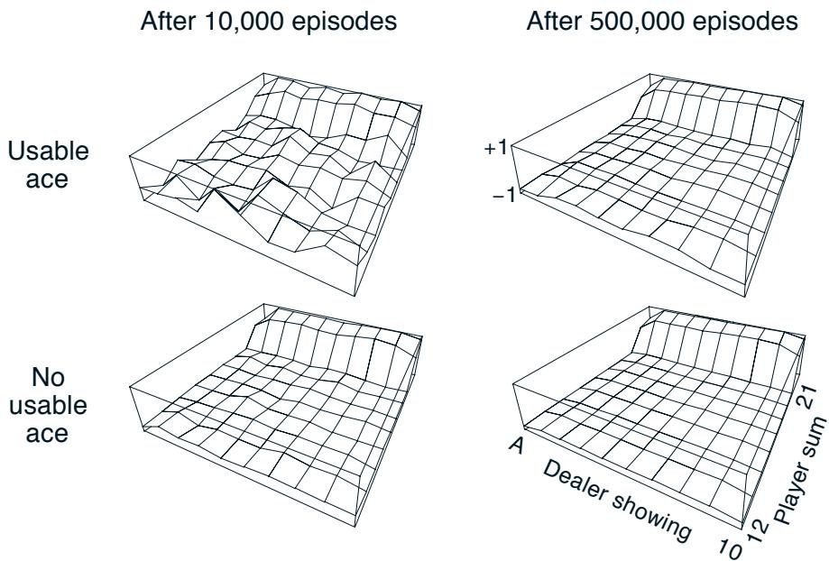
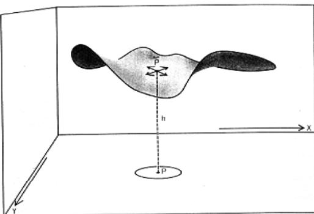
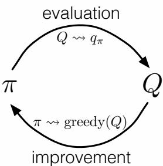
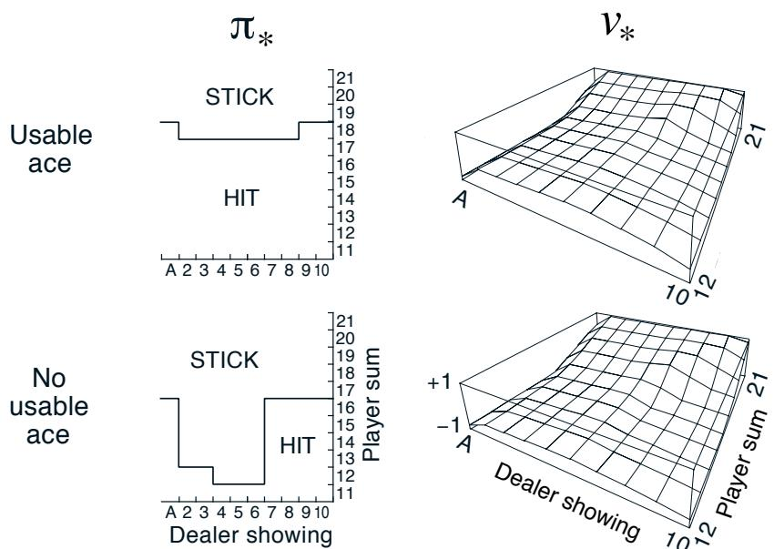
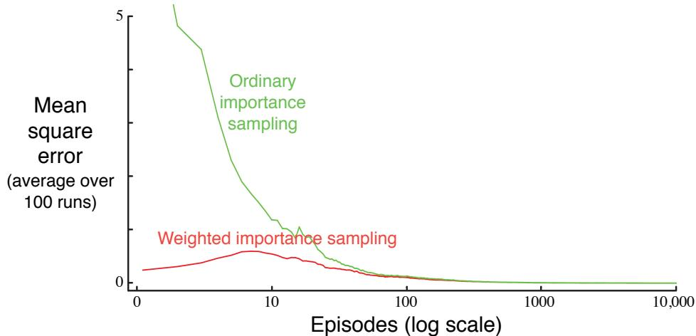
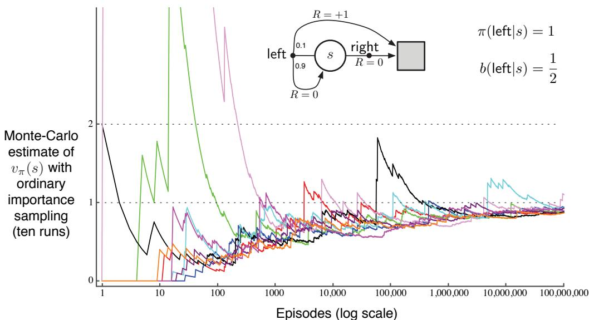
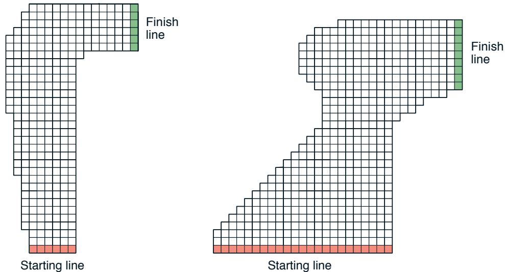

# Chapter 5

# Monte Carlo Methods

In this chapter we consider our first learning methods for estimating value functions and discovering optimal policies. Unlike the previous chapter, here we do not assume complete knowledge of the environment. Monte Carlo methods require only experience- sample sequences of states, actions, and rewards from actual or simulated interaction with an environment. Learning from actual experience is striking because it requires no prior knowledge of the environment's dynamics, yet can still attain optimal behavior. Learning from simulated experience is also powerful. Although a model is required, the model need only generate sample transitions, not the complete probability distributions of all possible transitions that is required for dynamic programming (DP). In surprisingly many cases it is easy to generate experience sampled according to the desired probability distributions, but infeasible to obtain the distributions in explicit form.

Monte Carlo methods are ways of solving the reinforcement learning problem based on averaging sample returns. To ensure that well- defined returns are available, here we define Monte Carlo methods only for episodic tasks. That is, we assume experience is divided into episodes, and that all episodes eventually terminate no matter what actions are selected. Only on the completion of an episode are value estimates and policies changed. Monte Carlo methods can thus be incremental in an episode- by- episode sense, but not in a step- by- step (online) sense. The term "Monte Carlo" is often used more broadly for any estimation method whose operation involves a significant random component. Here we use it specifically for methods based on averaging complete returns (as opposed to methods that learn from partial returns, considered in the next chapter).

Monte Carlo methods sample and average returns for each state- action pair much like the bandit methods we explored in Chapter 2 sample and average rewards for each action. The main difference is that now there are multiple states, each acting like a different bandit problem (like an associative- search or contextual bandit) and the different bandit problems are interrelated. That is, the return after taking an action in one state depends on the actions taken in later states in the same episode. Because all the action selections are undergoing learning, the problem becomes nonstationary from the point of view of the earlier state.

To handle the nonstationarity, we adapt the idea of general policy iteration (GPI) developed in Chapter 4 for DP. Whereas there we computed value functions from knowledge of the MDP, here we learn value functions from sample returns with the MDP. The value functions and corresponding policies still interact to attain optimality in essentially the same way (GPI). As in the DP chapter, first we consider the prediction problem (the computation of  $v_{\pi}$  and  $q_{\pi}$  for a fixed arbitrary policy  $\pi$ ) then policy improvement, and, finally, the control problem and its solution by GPI. Each of these ideas taken from DP is extended to the Monte Carlo case in which only sample experience is available.

# 5.1 Monte Carlo Prediction

We begin by considering Monte Carlo methods for learning the state- value function for a given policy. Recall that the value of a state is the expected return—expected cumulative future discounted reward—starting from that state. An obvious way to estimate it from experience, then, is simply to average the returns observed after visits to that state. As more returns are observed, the average should converge to the expected value. This idea underlies all Monte Carlo methods.

In particular, suppose we wish to estimate  $v_{\pi}(s)$ , the value of a state  $s$  under policy  $\pi$ , given a set of episodes obtained by following  $\pi$  and passing through  $s$ . Each occurrence of state  $s$  in an episode is called a visit to  $s$ . Of course,  $s$  may be visited multiple times in the same episode; let us call the first time it is visited in an episode the first visit to  $s$ . The first- visit MC method estimates  $v_{\pi}(s)$  as the average of the returns following first visits to  $s$ , whereas the every- visit MC method averages the returns following all visits to  $s$ . These two Monte Carlo (MC) methods are very similar but have slightly different theoretical properties. First- visit MC has been most widely studied, dating back to the 1940s, and is the one we focus on in this chapter. Every- visit MC extends more naturally to function approximation and eligibility traces, as discussed in Chapters 9 and 12. First- visit MC is shown in procedural form in the box. Every- visit MC would be the same except without the check for  $S_{t}$  having occurred earlier in the episode.

First- visit MC prediction, for estimating  $V \approx v_{\pi}$

Input: a policy  $\pi$  to be evaluated

Initialize:

$V(s) \in \mathbb{R}$ , arbitrarily, for all  $s \in \mathbb{S}$

Returns  $(s) \leftarrow$  an empty list, for all  $s \in \mathbb{S}$

Loop forever (for each episode):

Generate an episode following  $\pi$ :  $S_{0}, A_{0}, R_{1}, S_{1}, A_{1}, R_{2}, \ldots , S_{T - 1}, A_{T - 1}, R_{T}$ $G \leftarrow 0$

Loop for each step of episode,  $t = T - 1, T - 2, \ldots , 0$ :

$G \leftarrow \gamma G + R_{t + 1}$

Unless  $S_{t}$  appears in  $S_{0}, S_{1}, \ldots , S_{t - 1}$ :

Append  $G$  to  $Returns(S_{t})$

$V(S_{t}) \leftarrow$  average(Returns(St))

Both first- visit MC and every- visit MC converge to  $v_{\pi}(s)$  as the number of visits (or first visits) to  $s$  goes to infinity. This is easy to see for the case of first- visit MC. In this case each return is an independent, identically distributed estimate of  $v_{\pi}(s)$  with finite variance. By the law of large numbers the sequence of averages of these estimates converges to their expected value. Each average is itself an unbiased estimate, and the standard deviation of its error falls as  $1 / \sqrt{n}$ , where  $n$  is the number of returns averaged. Every- visit MC is less straightforward, but its estimates also converge quadratically to  $v_{\pi}(s)$  (Singh and Sutton, 1996).

The use of Monte Carlo methods is best illustrated through an example.

Example 5.1: Blackjack The object of the popular casino card game of blackjack is to obtain cards the sum of whose numerical values is as great as possible without exceeding 21. All face cards count as 10, and an ace can count either as 1 or as 11. We consider the version in which each player competes independently against the dealer. The game begins with two cards dealt to both dealer and player. One of the dealer's cards is face up and the other is face down. If the player has 21 immediately (an ace and a 10- card), it is called a natural. He then wins unless the dealer also has a natural, in which case the game is a draw. If the player does not have a natural, then he can request additional cards, one by one (hits), until he either stops (sticks) or exceeds 21 (goes bust). If he goes bust, he loses; if he sticks, then it becomes the dealer's turn. The dealer hits or sticks according to a fixed strategy without choice: he sticks on any sum of 17 or greater, and hits otherwise. If the dealer goes bust, then the player wins; otherwise, the outcome—win, lose, or draw—is determined by whose final sum is closer to 21.

Playing blackjack is naturally formulated as an episodic finite MDP. Each game of blackjack is an episode. Rewards of  $+1$ ,  $- 1$ , and 0 are given for winning, losing, and drawing, respectively. All rewards within a game are zero, and we do not discount  $(\gamma = 1)$ ; therefore these terminal rewards are also the returns. The player's actions are to hit or to stick. The states depend on the player's cards and the dealer's showing card. We assume that cards are dealt from an infinite deck (i.e., with replacement) so that there is no advantage to keeping track of the cards already dealt. If the player holds an ace that he could count as 11 without going bust, then the ace is said to be usable. In this case it is always counted as 11 because counting it as 1 would make the sum 11 or less, in which case there is no decision to be made because, obviously, the player should always hit. Thus, the player makes decisions on the basis of three variables: his current sum (12- 21), the dealer's one showing card (ace- 10), and whether or not he holds a usable ace. This makes for a total of 200 states.

Consider the policy that sticks if the player's sum is 20 or 21, and otherwise hits. To find the state- value function for this policy by a Monte Carlo approach, one simulates many blackjack games using the policy and averages the returns following each state. In this way, we obtained the estimates of the state- value function shown in Figure 5.1. The estimates for states with a usable ace are less certain and less regular because these states are less common. In any event, after 500,000 games the value function is very well approximated.

  
Figure 5.1: Approximate state-value functions for the blackjack policy that sticks only on 20 or 21, computed by Monte Carlo policy evaluation.

Exercise 5.1 Consider the diagrams on the right in Figure 5.1. Why does the estimated value function jump up for the last two rows in the rear? Why does it drop off for the whole last row on the left? Why are the frontmost values higher in the upper diagrams than in the lower?

Exercise 5.2 Suppose every- visit MC was used instead of first- visit MC on the blackjack task. Would you expect the results to be very different? Why or why not?

Although we have complete knowledge of the environment in the blackjack task, it would not be easy to apply DP methods to compute the value function. DP methods require the distribution of next events—in particular, they require the environments dynamics as given by the four- argument function  $p$ —and it is not easy to determine this for blackjack. For example, suppose the player's sum is 14 and he chooses to stick. What is his probability of terminating with a reward of  $+1$  as a function of the dealer's showing card? All of the probabilities must be computed before DP can be applied, and such computations are often complex and error- prone. In contrast, generating the sample games required by Monte Carlo methods is easy. This is the case surprisingly often; the ability of Monte Carlo methods to work with sample episodes alone can be a significant advantage even when one has complete knowledge of the environment's dynamics.

Can we generalize the idea of backup diagrams to Monte Carlo algorithms? The general idea of a backup diagram is to show at the top the root node to be updated and to show below all the transitions and leaf nodes whose rewards and estimated values contribute to the update. For Monte Carlo estimation of  $v_{\pi}$ , the root is a state node, and below it is the entire trajectory of transitions along a particular single episode, ending

at the terminal state, as shown to the right. Whereas the DP diagram (page 59) shows all possible transitions, the Monte Carlo diagram shows only those sampled on the one episode. Whereas the DP diagram includes only one- step transitions, the Monte Carlo diagram goes all the way to the end of the episode. These differences in the diagrams accurately reflect the fundamental differences between the algorithms.

An important fact about Monte Carlo methods is that the estimates for each state are independent. The estimate for one state does not build upon the estimate of any other state, as is the case in DP. In other words, Monte Carlo methods do not bootstrap as we defined it in the previous chapter.

In particular, note that the computational expense of estimating the value of a single state is independent of the number of states. This can make Monte Carlo methods particularly attractive when one requires the value of only one or a subset of states. One can generate many sample episodes starting from the states of interest, averaging returns from only these states, ignoring all others. This is a third advantage Monte Carlo methods can have over DP methods (after the ability to learn from actual experience and from simulated experience).

Example 5.2: Soap Bubble Suppose a wire frame forming a closed loop is dunked in soapy water to form a soap surface or bubble conforming at its edges to the wire frame. If the geometry of the wire frame is irregular but known, how can you compute the shape of the surface? The shape has the property that the total force on each point exerted by neighboring points is zero (or else the shape would change). This means that the surface's height at any point is the average of its heights at points in a small circle around that point. In addition, the surface must meet at its boundaries with the wire frame. The usual approach to problems of this kind is to put a grid over the area covered by

  
A bubble on a wire loop.

From Hersh and Griego (1969). Reproduced with permission. © 1969 Scientific American, a division of Nature America, Inc. All rights reserved.

the surface and solve for its height at the grid points by an iterative computation. Grid points at the boundary are forced to the wire frame, and all others are adjusted toward the average of the heights of their four nearest neighbors. This process then iterates, much like DP's iterative policy evaluation, and ultimately converges to a close approximation to the desired surface.

This is similar to the kind of problem for which Monte Carlo methods were originally designed. Instead of the iterative computation described above, imagine standing on the surface and taking a random walk, stepping randomly from grid point to neighboring grid point, with equal probability, until you reach the boundary. It turns out that the expected value of the height at the boundary is a close approximation to the height of the desired surface at the starting point (in fact, it is exactly the value computed by the iterative method described above). Thus, one can closely approximate the height of the

surface at a point by simply averaging the boundary heights of many walks started at the point. If one is interested in only the value at one point, or any fixed small set of points, then this Monte Carlo method can be far more efficient than the iterative method based on local consistency.

# 5.2 Monte Carlo Estimation of Action Values

If a model is not available, then it is particularly useful to estimate action values (the values of state- action pairs) rather than state values. With a model, state values alone are sufficient to determine a policy; one simply looks ahead one step and chooses whichever action leads to the best combination of reward and next state, as we did in the chapter on DP. Without a model, however, state values alone are not sufficient. One must explicitly estimate the value of each action in order for the values to be useful in suggesting a policy. Thus, one of our primary goals for Monte Carlo methods is to estimate  $q_{*}$ . To achieve this, we first consider the policy evaluation problem for action values.

The policy evaluation problem for action values is to estimate  $q_{\pi}(s,a)$ , the expected return when starting in state  $s$ , taking action  $a$ , and thereafter following policy  $\pi$ . The Monte Carlo methods for this are essentially the same as just presented for state values, except now we talk about visits to a state- action pair rather than to a state. A state- action pair  $s,a$  is said to be visited in an episode if ever the state  $s$  is visited and action  $a$  is taken in it. The every- visit MC method estimates the value of a state- action pair as the average of the returns that have followed all the visits to it. The first- visit MC method averages the returns following the first time in each episode that the state was visited and the action was selected. These methods converge quadratically, as before, to the true expected values as the number of visits to each state- action pair approaches infinity.

The only complication is that many state- action pairs may never be visited. If  $\pi$  is a deterministic policy, then in following  $\pi$  one will observe returns only for one of the actions from each state. With no returns to average, the Monte Carlo estimates of the other actions will not improve with experience. This is a serious problem because the purpose of learning action values is to help in choosing among the actions available in each state. To compare alternatives we need to estimate the value of all the actions from each state, not just the one we currently favor.

This is the general problem of maintaining exploration, as discussed in the context of the  $k$ - armed bandit problem in Chapter 2. For policy evaluation to work for action values, we must assure continual exploration. One way to do this is by specifying that the episodes start in a state- action pair, and that every pair has a nonzero probability of being selected as the start. This guarantees that all state- action pairs will be visited an infinite number of times in the limit of an infinite number of episodes. We call this the assumption of exploring starts.

The assumption of exploring starts is sometimes useful, but of course it cannot be relied upon in general, particularly when learning directly from actual interaction with an environment. In that case the starting conditions are unlikely to be so helpful. The most common alternative approach to assuring that all state- action pairs are encountered is

to consider only policies that are stochastic with a nonzero probability of selecting all actions in each state. We discuss two important variants of this approach in later sections. For now, we retain the assumption of exploring starts and complete the presentation of a full Monte Carlo control method.

Exercise 5.3 What is the backup diagram for Monte Carlo estimation of  $q_{\pi}$ ?

# 5.3 Monte Carlo Control

We are now ready to consider how Monte Carlo estimation can be used in control, that is, to approximate optimal policies. The overall idea is to proceed according to the same pattern as in the DP chapter, that is, according to the idea of generalized policy iteration

(GPI). In GPI one maintains both an approximate policy and an approximate value function. The value function is repeatedly altered to more closely approximate the value function for the current policy, and the policy is repeatedly improved with respect to the current value function, as suggested by the diagram to the right. These two kinds of changes work against each other to some extent, as each creates a moving target for the other, but together they cause both policy and value function to approach optimality.

To begin, let us consider a Monte Carlo version of classical policy iteration. In this method, we perform alternating complete steps of policy evaluation and policy improvement, beginning with an arbitrary policy  $\pi_{0}$  and ending with the optimal policy and optimal action- value function:

$$
\pi_{0}\xrightarrow{\mathrm{~E~}}q_{\pi_{0}}\xrightarrow{\mathrm{~I~}}\pi_{1}\xrightarrow{\mathrm{~E~}}q_{\pi_{1}}\xrightarrow{\mathrm{~I~}}\pi_{2}\xrightarrow{\mathrm{~E~}}\cdots\xrightarrow{\mathrm{~I~}}\pi_{*}\xrightarrow{\mathrm{~E~}}q_{*},
$$

where  $\xrightarrow{\mathrm{~E~}}$  denotes a complete policy evaluation and  $\xrightarrow{\mathrm{~I~}}$  denotes a complete policy improvement. Policy evaluation is done exactly as described in the preceding section. Many episodes are experienced, with the approximate action- value function approaching the true function asymptotically. For the moment, let us assume that we do indeed observe an infinite number of episodes and that, in addition, the episodes are generated with exploring starts. Under these assumptions, the Monte Carlo methods will compute each  $q_{\pi_{k}}$  exactly, for arbitrary  $\pi_{k}$ .

Policy improvement is done by making the policy greedy with respect to the current value function. In this case we have an action- value function, and therefore no model is needed to construct the greedy policy. For any action- value function  $q$ , the corresponding greedy policy is the one that, for each  $s \in \mathbb{S}$ , deterministically chooses an action with maximal action- value:

$$
\pi (s) \doteq \arg \max_{q} q(s, a). \tag{5.1}
$$

Policy improvement then can be done by constructing each  $\pi_{k + 1}$  as the greedy policy with respect to  $q_{\pi_{k}}$ . The policy improvement theorem (Section 4.2) then applies to  $\pi_{k}$

and  $\pi_{k + 1}$  because, for all  $s \in \mathbb{S}$ ,

$$
\begin{array}{l c l}{{q_{\pi_{k}}(s,\pi_{k+1}(s))}}&{{=}}&{{q_{\pi_{k}}(s,\arg\max _{a}q_{\pi_{k}}(s,a))}}\\ {{}}&{{=}}&{{\max _{a}q_{\pi_{k}}(s,a)}}\\ {{}}&{{\geq}}&{{q_{\pi_{k}}(s,\pi_{k}(s))}}\\ {{}}&{{\geq}}&{{v_{\pi_{k}}(s).}}\end{array}
$$

As we discussed in the previous chapter, the theorem assures us that each  $\pi_{k + 1}$  is uniformly better than  $\pi_{k}$ , or just as good as  $\pi_{k}$ , in which case they are both optimal policies. This in turn assures us that the overall process converges to the optimal policy and optimal value function. In this way Monte Carlo methods can be used to find optimal policies given only sample episodes and no other knowledge of the environment's dynamics.

We made two unlikely assumptions above in order to easily obtain this guarantee of convergence for the Monte Carlo method. One was that the episodes have exploring starts, and the other was that policy evaluation could be done with an infinite number of episodes. To obtain a practical algorithm we will have to remove both assumptions. We postpone consideration of the first assumption until later in this chapter.

For now we focus on the assumption that policy evaluation operates on an infinite number of episodes. This assumption is relatively easy to remove. In fact, the same issue arises even in classical DP methods such as iterative policy evaluation, which also converge only asymptotically to the true value function. In both DP and Monte Carlo cases there are two ways to solve the problem. One is to hold firm to the idea of approximating  $q_{\pi_{k}}$  in each policy evaluation. Measurements and assumptions are made to obtain bounds on the magnitude and probability of error in the estimates, and then sufficient steps are taken during each policy evaluation to assure that these bounds are sufficiently small. This approach can probably be made completely satisfactory in the sense of guaranteeing correct convergence up to some level of approximation. However, it is also likely to require far too many episodes to be useful in practice on any but the smallest problems.

There is a second approach to avoiding the infinite number of episodes nominally required for policy evaluation, in which we give up trying to complete policy evaluation before returning to policy improvement. On each evaluation step we move the value function toward  $q_{\pi_{k}}$ , but we do not expect to actually get close except over many steps. We used this idea when we first introduced the idea of GPI in Section 4.6. One extreme form of the idea is value iteration, in which only one iteration of iterative policy evaluation is performed between each step of policy improvement. The in- place version of value iteration is even more extreme; there we alternate between improvement and evaluation steps for single states.

For Monte Carlo policy iteration it is natural to alternate between evaluation and improvement on an episode- by- episode basis. After each episode, the observed returns are used for policy evaluation, and then the policy is improved at all the states visited in the episode. A complete simple algorithm along these lines, which we call Monte Carlo ES, for Monte Carlo with Exploring Starts, is given in pseudocode in the box on the next page.

# Monte Carlo ES (Exploring Starts), for estimating  $\pi \approx \pi_{*}$

Initialize:

$\pi (s) \in \mathcal{A}(s)$  (arbitrarily), for all  $s \in \mathcal{S}$

$Q(s, a) \in \mathbb{R}$  (arbitrarily), for all  $s \in \mathcal{S}$ ,  $a \in \mathcal{A}(s)$

$Returns(s, a) \leftarrow$  empty list, for all  $s \in \mathcal{S}$ ,  $a \in \mathcal{A}(s)$

Loop forever (for each episode):

Choose  $S_{0} \in \mathcal{S}$ ,  $A_{0} \in \mathcal{A}(S_{0})$  randomly such that all pairs have probability  $> 0$  Generate an episode from  $S_{0}$ ,  $A_{0}$ , following  $\pi \colon S_{0}, A_{0}, R_{1}, \ldots , S_{T - 1}, A_{T - 1}, R_{T}$

$G \leftarrow 0$

Loop for each step of episode,  $t = T - 1, T - 2, \ldots , 0$ :

$G \leftarrow \gamma G + R_{t + 1}$

Unless the pair  $S_{t}, A_{t}$  appears in  $S_{0}, A_{0}, S_{1}, A_{1}, \ldots , S_{t - 1}, A_{t - 1}$ :

Append  $G$  to  $Returns(S_{t}, A_{t})$

\(Q(S_{t}, A_{t}) \leftarrow\) average(Returns(S_{t}, A_{t}))\)

$\pi (S_{t}) \leftarrow \arg \max_{a} Q(S_{t}, a)$

Exercise 5.4 The pseudocode for Monte Carlo ES is inefficient because, for each state- action pair, it maintains a list of all returns and repeatedly calculates their mean. It would be more efficient to use techniques similar to those explained in Section 2.4 to maintain just the mean and a count (for each state- action pair) and update them incrementally. Describe how the pseudocode would be altered to achieve this.

In Monte Carlo ES, all the returns for each state- action pair are accumulated and averaged, irrespective of what policy was in force when they were observed. It is easy to see that Monte Carlo ES cannot converge to any suboptimal policy. If it did, then the value function would eventually converge to the value function for that policy, and that in turn would cause the policy to change. Stability is achieved only when both the policy and the value function are optimal. Convergence to this optimal fixed point seems inevitable as the changes to the action- value function decrease over time, but has not yet been formally proved. In our opinion, this is one of the most fundamental open theoretical questions in reinforcement learning (for a partial solution, see Tsitsiklis, 2002).

Example 5.3: Solving Blackjack It is straightforward to apply Monte Carlo ES to blackjack. Because the episodes are all simulated games, it is easy to arrange for exploring starts that include all possibilities. In this case one simply picks the dealer's cards, the player's sum, and whether or not the player has a usable ace, all at random with equal probability. As the initial policy we use the policy evaluated in the previous blackjack example, that which sticks only on 20 or 21. The initial action- value function can be zero for all state- action pairs. Figure 5.2 shows the optimal policy for blackjack found by Monte Carlo ES. This policy is the same as the "basic" strategy of Thorp (1966) with the sole exception of the leftmost notch in the policy for a usable ace, which is not present in Thorp's strategy. We are uncertain of the reason for this discrepancy, but confident that what is shown here is indeed the optimal policy for the version of blackjack we have described.

  
Figure 5.2: The optimal policy and state-value function for blackjack, found by Monte Carlo ES. The state-value function shown was computed from the action-value function found by Monte Carlo ES.

# 5.4 Monte Carlo Control without Exploring Starts

How can we avoid the unlikely assumption of exploring starts? The only general way to ensure that all actions are selected infinitely often is for the agent to continue to select them. There are two approaches to ensuring this, resulting in what we call on- policy methods and off- policy methods. On- policy methods attempt to evaluate or improve the policy that is used to make decisions, whereas off- policy methods evaluate or improve a policy different from that used to generate the data. The Monte Carlo ES method developed above is an example of an on- policy method. In this section we show how an on- policy Monte Carlo control method can be designed that does not use the unrealistic assumption of exploring starts. Off- policy methods are considered in the next section.

In on- policy control methods the policy is generally soft, meaning that  $\pi (a|s) > 0$  for all  $s\in \mathcal{S}$  and all  $a\in A(s)$  , but gradually shifted closer and closer to a deterministic optimal policy. Many of the methods discussed in Chapter 2 provide mechanisms for this. The on- policy method we present in this section uses  $\epsilon$  - greedy policies, meaning that most of the time they choose an action that has maximal estimated action value, but with probability  $\epsilon$  they instead select an action at random. That is, all nongreedy actions are given the minimal probability of selection,  $\frac{\epsilon}{|\mathcal{A}(s)|}$  , and the remaining bulk of the probability,  $1 - \epsilon +\frac{\epsilon}{|\mathcal{A}(s)|}$  , is given to the greedy action. The  $\epsilon$  greedy policies are examples of  $\epsilon$  soft policies, defined as policies for which  $\pi (a|s)\geq \frac{\epsilon}{|\mathcal{A}(s)|}$  for all states and actions, for some  $\epsilon >0$  . Among  $\epsilon$  soft policies,  $\epsilon$  greedy policies are in some sense those that are closest to greedy.

The overall idea of on- policy Monte Carlo control is still that of GPI. As in Monte Carlo ES, we use first- visit MC methods to estimate the action- value function for the current policy. Without the assumption of exploring starts, however, we cannot simply improve the policy by making it greedy with respect to the current value function, because that would prevent further exploration of nongreedy actions. Fortunately, GPI does not require that the policy be taken all the way to a greedy policy, only that it be moved toward a greedy policy. In our on- policy method we will move it only to an  $\epsilon$ - greedy policy. For any  $\epsilon$ - soft policy,  $\pi$ , any  $\epsilon$ - greedy policy with respect to  $q_{\pi}$  is guaranteed to be better than or equal to  $\pi$ . The complete algorithm is given in the box below.

# On-policy first-visit MC control (for  $\epsilon$ -soft policies), estimates  $\pi \approx \pi_{*}$

Algorithm parameter: small  $\epsilon > 0$

Initialize:

$\pi \leftarrow$  an arbitrary  $\epsilon$ - soft policy

$Q(s, a) \in \mathbb{R}$  (arbitrarily), for all  $s \in \mathbb{S}$ ,  $a \in \mathcal{A}(s)$

$Returns(s, a) \leftarrow$  empty list, for all  $s \in \mathbb{S}$ ,  $a \in \mathcal{A}(s)$

Repeat forever (for each episode):

Generate an episode following  $\pi$ :  $S_{0}, A_{0}, R_{1}, \ldots , S_{T - 1}, A_{T - 1}, R_{T}$

$G \leftarrow 0$

Loop for each step of episode,  $t = T - 1, T - 2, \ldots , 0$

$G \leftarrow \gamma G + R_{t + 1}$

Unless the pair  $S_{t}, A_{t}$  appears in  $S_{0}, A_{0}, S_{1}, A_{1} \ldots , S_{t - 1}, A_{t - 1}$ :

Append  $G$  to  $Returns(S_{t}, A_{t})$

$Q(S_{t}, A_{t}) \leftarrow$  average  $Returns(S_{t}, A_{t})$

$A^{*} \leftarrow \arg \max_{a} Q(S_{t}, a)$  (with ties broken arbitrarily)

For all  $a \in \mathcal{A}(S_{t})$

$$
\pi (a|S_{t}) \leftarrow \left\{ \begin{array}{ll} 1 - \epsilon + \epsilon / |\mathcal{A}(S_{t})| & \text{if} a = A^{*} \\ \epsilon / |\mathcal{A}(S_{t})| & \text{if} a \neq A^{*} \end{array} \right.
$$

That any  $\epsilon$ - greedy policy with respect to  $q_{\pi}$  is an improvement over any  $\epsilon$ - soft policy  $\pi$  is assured by the policy improvement theorem. Let  $\pi '$  be the  $\epsilon$ - greedy policy. The conditions of the policy improvement theorem apply because for any  $s \in \mathbb{S}$ :

$$
\begin{array}{r c l}{q_{\pi}(s,\pi^{\prime}(s))} & = & {\sum_{a}\pi^{\prime}(a|s)q_{\pi}(s,a)}\\ & = & {\frac{\epsilon}{|\mathcal{A}(s)|}\sum_{a}q_{\pi}(s,a) + (1 - \epsilon)\max_{a}q_{\pi}(s,a)}\\ & \geq & {\frac{\epsilon}{|\mathcal{A}(s)|}\sum_{a}q_{\pi}(s,a) + (1 - \epsilon)\sum_{a}\frac{\pi(a|s) - \frac{\epsilon}{|\mathcal{A}(s)|}}{1 - \epsilon} q_{\pi}(s,a)} \end{array} \tag{5.2}
$$

(the sum is a weighted average with nonnegative weights summing to 1, and as such it must be less than or equal to the largest number averaged)

$$
\begin{array}{l}{{=\frac{\epsilon}{|\mathcal{A}(s)|}\sum_{a}q_{\pi}(s,a)~-~\frac{\epsilon}{|\mathcal{A}(s)|}\sum_{a}q_{\pi}(s,a)~+~\sum_{a}\pi(a|s)q_{\pi}(s,a)}}\\ {{~=~v_{\pi}(s)~.}}\end{array}
$$

Thus, by the policy improvement theorem,  $\pi^{\prime}\geq \pi$  (i.e.,  $v_{\pi^{\prime}}(s)\geq v_{\pi}(s)$  , for all  $s\in S$  ). We now prove that equality can hold only when both  $\pi^{\prime}$  and  $\pi$  are optimal among the  $\epsilon$  - soft policies, that is, when they are better than or equal to all other  $\epsilon$  - soft policies.

Consider a new environment that is just like the original environment, except with the requirement that policies be  $\epsilon$  - soft "moved inside" the environment. The new environment has the same action and state set as the original and behaves as follows. If in state  $s$  and taking action  $a$  , then with probability  $1 - \epsilon$  the new environment behaves exactly like the old environment. With probability  $\epsilon$  it repicks the action at random, with equal probabilities, and then behaves like the old environment with the new, random action. The best one can do in this new environment with general policies is the same as the best one could do in the original environment with  $\epsilon$  - soft policies. Let  $\widetilde{v}_{*}$  and  $\widetilde{q}_{*}$  denote the optimal value functions for the new environment. Then a policy  $\pi$  is optimal among  $\epsilon$  - soft policies if and only if  $v_{\pi} = \widetilde{v}_{*}$  . We know that  $\widetilde{v}_{*}$  is the unique solution to the Bellman optimality equation (3.19) with altered transition probabilities:

$$
\begin{array}{l}{\widetilde{v}_{*}(s) = \max_{a}\sum_{s^{\prime},r}\Big[(1 - \epsilon)p(s^{\prime},r|s,a) + \sum_{a^{\prime}}\frac{\epsilon}{|\mathcal{A}(s)|} p(s^{\prime},r|s,a^{\prime})\Big]\Big[r + \gamma \widetilde{v}_{*}(s^{\prime})\Big]}\\ {= (1 - \epsilon)\max_{a}\sum_{s^{\prime},r}p(s^{\prime},r|s,a)\Big[r + \gamma \widetilde{v}_{*}(s^{\prime})\Big]}\\ {+ \frac{\epsilon}{|\mathcal{A}(s)|}\sum_{a}\sum_{s^{\prime},r}p(s^{\prime},r|s,a)\Big[r + \gamma \widetilde{v}_{*}(s^{\prime})\Big].} \end{array}
$$

When equality holds and the  $\epsilon$  - soft policy  $\pi$  is no longer improved, then we also know, from (5.2), that

$$
\begin{array}{r c l}{{v_{\pi}(s)}}&{{=}}&{{(1-\epsilon)\max _{a}q_{\pi}(s,a)+\frac{\epsilon}{|\mathcal{A}(s)|}\sum_{a}q_{\pi}(s,a)}}\\ {{}}&{{=}}&{{(1-\epsilon)\max _{a}\sum_{s^{\prime},r}p(s^{\prime},r|s,a)\Big[r+\gamma v_{\pi}(s^{\prime})\Big]}}\\ {{}}&{{+}}&{{\frac{\epsilon}{|\mathcal{A}(s)|}\sum_{a}\sum_{s^{\prime},r}p(s^{\prime},r|s,a)\Big[r+\gamma v_{\pi}(s^{\prime})\Big].}}\end{array}
$$

However, this equation is the same as the previous one, except for the substitution of  $v_{\pi}$  for  $\widetilde{v}_{*}$  . Because  $\widetilde{v}_{*}$  is the unique solution, it must be that  $v_{\pi} = \widetilde{v}_{*}$

In essence, we have shown in the last few pages that policy iteration works for  $\epsilon$  - soft policies. Using the natural notion of greedy policy for  $\epsilon$  - soft policies, one is assured of improvement on every step, except when the best policy has been found among the  $\epsilon$  - soft policies. This analysis is independent of how the action- value functions are determined

at each stage, but it does assume that they are computed exactly. This brings us to roughly the same point as in the previous section. Now we only achieve the best policy among the  $\epsilon$ - soft policies, but on the other hand, we have eliminated the assumption of exploring starts.

# 5.5 Off-policy Prediction via Importance Sampling

All learning control methods face a dilemma: They seek to learn action values conditional on subsequent optimal behavior, but they need to behave non- optimally in order to explore all actions (to find the optimal actions). How can they learn about the optimal policy while behaving according to an exploratory policy? The on- policy approach in the preceding section is actually a compromise—it learns action values not for the optimal policy, but for a near- optimal policy that still explores. A more straightforward approach is to use two policies, one that is learned about and that becomes the optimal policy, and one that is more exploratory and is used to generate behavior. The policy being learned about is called the target policy, and the policy used to generate behavior is called the behavior policy. In this case we say that learning is from data "off" the target policy, and the overall process is termed off- policy learning.

Throughout the rest of this book we consider both on- policy and off- policy methods. On- policy methods are generally simpler and are considered first. Off- policy methods require additional concepts and notation, and because the data is due to a different policy, off- policy methods are often of greater variance and are slower to converge. On the other hand, off- policy methods are more powerful and general. They include on- policy methods as the special case in which the target and behavior policies are the same. Off- policy methods also have a variety of additional uses in applications. For example, they can often be applied to learn from data generated by a conventional non- learning controller, or from a human expert. Off- policy learning is also seen by some as key to learning multi- step predictive models of the world's dynamics (see Section 17.2; Sutton, 2009; Sutton et al., 2011).

In this section we begin the study of off- policy methods by considering the prediction problem, in which both target and behavior policies are fixed. That is, suppose we wish to estimate  $v_{\pi}$  or  $q_{\pi}$ , but all we have are episodes following another policy  $b$ , where  $b \neq \pi$ . In this case,  $\pi$  is the target policy,  $b$  is the behavior policy, and both policies are considered fixed and given.

In order to use episodes from  $b$  to estimate values for  $\pi$ , we require that every action taken under  $\pi$  is also taken, at least occasionally, under  $b$ . That is, we require that  $\pi (a|s) > 0$  implies  $b(a|s) > 0$ . This is called the assumption of coverage. It follows from coverage that  $b$  must be stochastic in states where it is not identical to  $\pi$ . The target policy  $\pi$ , on the other hand, may be deterministic, and, in fact, this is a case of particular interest in control applications. In control, the target policy is typically the deterministic greedy policy with respect to the current estimate of the action- value function. This policy becomes a deterministic optimal policy while the behavior policy remains stochastic and more exploratory, for example, an  $\epsilon$ - greedy policy. In this section, however, we consider the prediction problem, in which  $\pi$  is unchanging and given.

Almost all off- policy methods utilize importance sampling, a general technique for estimating expected values under one distribution given samples from another. We apply importance sampling to off- policy learning by weighting returns according to the relative probability of their trajectories occurring under the target and behavior policies, called the importance- sampling ratio. Given a starting state  $S_{t}$ , the probability of the subsequent state- action trajectory,  $A_{t}, S_{t + 1}, A_{t + 1}, \ldots , S_{T}$ , occurring under any policy  $\pi$  is

$$
\begin{array}{r l} & {\operatorname *{Pr}\{A_{t},S_{t + 1},A_{t + 1},\dots ,S_{T}\mid S_{t},A_{t:T - 1}\sim \pi \}}\\ & {\quad = \pi (A_{t}|S_{t})p(S_{t + 1}|S_{t},A_{t})\pi (A_{t + 1}|S_{t + 1})\dots p(S_{T}|S_{T - 1},A_{T - 1})}\\ & {\quad = \prod_{k = t}^{T - 1}\pi (A_{k}|S_{k})p(S_{k + 1}|S_{k},A_{k}),} \end{array}
$$

where  $p$  here is the state- transition probability function defined by (3.4). Thus, the relative probability of the trajectory under the target and behavior policies (the importance- sampling ratio) is

$$
\rho_{t:T - 1}\doteq \frac{\prod_{k = t}^{T - 1}\pi(A_k|S_k)p(S_{k + 1}|S_k,A_k)}{\prod_{k = t}^{T - 1}b(A_k|S_k)p(S_{k + 1}|S_k,A_k)} = \prod_{k = t}^{T - 1}\frac{\pi(A_k|S_k)}{b(A_k|S_k)}. \tag{5.3}
$$

Although the trajectory probabilities depend on the MDP's transition probabilities, which are generally unknown, they appear identically in both the numerator and denominator, and thus cancel. The importance sampling ratio ends up depending only on the two policies and the sequence, not on the MDP.

Recall that we wish to estimate the expected returns (values) under the target policy, but all we have are returns  $G_{t}$  due to the behavior policy. These returns have the wrong expectation  $\mathbb{E}[G_t|S_t = s] = v_b(s)$  and so cannot be averaged to obtain  $v_{\pi}$ . This is where importance sampling comes in. The ratio  $\rho_{t:T - 1}$  transforms the returns to have the right expected value:

$$
\mathbb{E}[\rho_{t:T - 1}G_t\mid S_t = s] = v_{\pi}(s). \tag{5.4}
$$

Now we are ready to give a Monte Carlo algorithm that averages returns from a batch of observed episodes following policy  $b$  to estimate  $v_{\pi}(s)$ . It is convenient here to number time steps in a way that increases across episode boundaries. That is, if the first episode of the batch ends in a terminal state at time 100, then the next episode begins at time  $t = 101$ . This enables us to use time- step numbers to refer to particular steps in particular episodes. In particular, we can define the set of all time steps in which state  $s$  is visited, denoted  $\mathcal{T}(s)$ . This is for an every- visit method; for a first- visit method,  $\mathcal{T}(s)$  would only include time steps that were first visits to  $s$  within their episodes. Also, let  $T(t)$  denote the first time of termination following time  $t$ , and  $G_{t}$  denote the return after  $t$  up through  $T(t)$ . Then  $\{G_{t}\}_{t \in \mathcal{T}(s)}$  are the returns that pertain to state  $s$ , and  $\{\rho_{t:T(t) - 1}\}_{t \in \mathcal{T}(s)}$  are the corresponding importance- sampling ratios. To estimate  $v_{\pi}(s)$ , we simply scale the returns by the ratios and average the results:

$$
V(s)\doteq \frac{\sum_{t\in\mathcal{T}(s)}\rho_{t:T(t) - 1}G_t}{|\mathcal{T}(s)|}. \tag{5.5}
$$

When importance sampling is done as a simple average in this way it is called ordinary importance sampling.

An important alternative is weighted importance sampling, which uses a weighted average, defined as

$$
V(s)\doteq \frac{\sum_{t\in T(s)}\rho_{t:T(t) - 1}G_{t}}{\sum_{t\in T(s)}\rho_{t:T(t) - 1}}, \tag{5.6}
$$

or zero if the denominator is zero. To understand these two varieties of importance sampling, consider the estimates of their first- visit methods after observing a single return from state  $s$ . In the weighted- average estimate, the ratio  $\rho_{t:T(t) - 1}$  for the single return cancels in the numerator and denominator, so that the estimate is equal to the observed return independent of the ratio (assuming the ratio is nonzero). Given that this return was the only one observed, this is a reasonable estimate, but its expectation is  $v_{b}(s)$  rather than  $v_{\pi}(s)$ , and in this statistical sense it is biased. In contrast, the first- visit version of the ordinary importance- sampling estimator (5.5) is always  $v_{\pi}(s)$  in expectation (it is unbiased), but it can be extreme. Suppose the ratio were ten, indicating that the trajectory observed is ten times as likely under the target policy as under the behavior policy. In this case the ordinary importance- sampling estimate would be ten times the observed return. That is, it would be quite far from the observed return even though the episode's trajectory is considered very representative of the target policy.

Formally, the difference between the first- visit methods of the two kinds of importance sampling is expressed in their biases and variances. Ordinary importance sampling is unbiased whereas weighted importance sampling is biased (though the bias converges asymptotically to zero). On the other hand, the variance of ordinary importance sampling is in general unbounded because the variance of the ratios can be unbounded, whereas in the weighted estimator the largest weight on any single return is one. In fact, assuming bounded returns, the variance of the weighted importance- sampling estimator converges to zero even if the variance of the ratios themselves is infinite (Precup, Sutton, and Dasgupta 2001). In practice, the weighted estimator usually has dramatically lower variance and is strongly preferred. Nevertheless, we will not totally abandon ordinary importance sampling as it is easier to extend to the approximate methods using function approximation that we explore in the second part of this book.

The every- visit methods for ordinary and weighed importance sampling are both biased, though, again, the bias falls asymptotically to zero as the number of samples increases. In practice, every- visit methods are often preferred because they remove the need to keep track of which states have been visited and because they are much easier to extend to approximations. A complete every- visit MC algorithm for off- policy policy evaluation using weighted importance sampling is given in the next section on page 110.

Exercise 5.5 Consider an MDP with a single nonterminal state and a single action that transitions back to the nonterminal state with probability  $p$  and transitions to the terminal state with probability  $1 - p$ . Let the reward be  $+1$  on all transitions, and let  $\gamma = 1$ . Suppose you observe one episode that lasts 10 steps, with a return of 10. What are the first- visit and every- visit estimators of the value of the nonterminal state?  $\square$

Example 5.4: Off- policy Estimation of a Blackjack State Value We applied both ordinary and weighted importance- sampling methods to estimate the value of a single blackjack state (Example 5.1) from off- policy data. Recall that one of the advantages of Monte Carlo methods is that they can be used to evaluate a single state without forming estimates for any other states. In this example, we evaluated the state in which the dealer is showing a deuce, the sum of the player's cards is 13, and the player has a usable ace (that is, the player holds an ace and a deuce, or equivalently three aces). The data was generated by starting in this state then choosing to hit or stick at random with equal probability (the behavior policy). The target policy was to stick only on a sum of 20 or 21, as in Example 5.1. The value of this state under the target policy is approximately  $- 0.27726$  (this was determined by separately generating one- hundred million episodes using the target policy and averaging their returns). Both off- policy methods closely approximated this value after 1000 off- policy episodes using the random policy. To make sure they did this reliably, we performed 100 independent runs, each starting from estimates of zero and learning for 10,000 episodes. Figure 5.3 shows the resultant learning curves—the squared error of the estimates of each method as a function of number of episodes, averaged over the 100 runs. The error approaches zero for both algorithms, but the weighted importance- sampling method has much lower error at the beginning, as is typical in practice.

  
Figure 5.3: Weighted importance sampling produces lower error estimates of the value of a single blackjack state from off-policy episodes.

Example 5.5: Infinite Variance The estimates of ordinary importance sampling will typically have infinite variance, and thus unsatisfactory convergence properties, whenever the scaled returns have infinite variance—and this can easily happen in off- policy learning when trajectories contain loops. A simple example is shown inset in Figure 5.4. There is only one nonterminal state  $s$  and two actions, right and left. The right action causes a deterministic transition to termination, whereas the left action transitions, with probability 0.9, back to  $s$  or, with probability 0.1, on to termination. The rewards are  $+1$  on the latter transition and otherwise zero. Consider the target policy that always selects left. All episodes under this policy consist of some number (possibly zero) of transitions back

to  $s$  followed by termination with a reward and return of  $+1$ . Thus the value of  $s$  under the target policy is  $1 (s = 1)$ . Suppose we are estimating this value from off- policy data using the behavior policy that selects right and left with equal probability.

  
Figure 5.4: Ordinary importance sampling produces surprisingly unstable estimates on the one-state MDP shown inset (Example 5.5). The correct estimate here is  $1 (\gamma = 1)$ , and, even though this is the expected value of a sample return (after importance sampling), the variance of the samples is infinite, and the estimates do not converge to this value. These results are for off-policy first-visit MC.

The lower part of Figure 5.4 shows ten independent runs of the first- visit MC algorithm using ordinary importance sampling. Even after millions of episodes, the estimates fail to converge to the correct value of 1. In contrast, the weighted importance- sampling algorithm would give an estimate of exactly 1 forever after the first episode that ended with the left action. All returns not equal to 1 (that is, ending with the right action) would be inconsistent with the target policy and thus would have a  $\rho_{t:T(t) - 1}$  of zero and contribute neither to the numerator nor denominator of (5.6). The weighted importance- sampling algorithm produces a weighted average of only the returns consistent with the target policy, and all of these would be exactly 1.

We can verify that the variance of the importance- sampling- scaled returns is infinite in this example by a simple calculation. The variance of any random variable  $X$  is the expected value of the deviation from its mean  $\bar{X}$ , which can be written

$$
\operatorname {Var}[X]\doteq \mathbb{E}\Big[\big(X - \bar{X}\big)^2\Big] = \mathbb{E}\big[X^2 -2X\bar{X} +\bar{X}^2\big] = \mathbb{E}\big[X^2\big] - \bar{X}^2.
$$

Thus, if the mean is finite, as it is in our case, the variance is infinite if and only if the expectation of the square of the random variable is infinite. Thus, we need only show

that the expected square of the importance- sampling- scaled return is infinite:

$$
\mathbb{E}\left[\left(\prod_{t = 0}^{T - 1}\frac{\pi(A_t|S_t)}{b(A_t|S_t)} G_0\right)^2\right].
$$

To compute this expectation, we break it down into cases based on episode length and termination. First note that, for any episode ending with the right action, the importance sampling ratio is zero, because the target policy would never take this action; these episodes thus contribute nothing to the expectation (the quantity in parenthesis will be zero) and can be ignored. We need only consider episodes that involve some number (possibly zero) of left actions that transition back to the nonterminal state, followed by a left action transitioning to termination. All of these episodes have a return of 1, so the  $G_{0}$  factor can be ignored. To get the expected square we need only consider each length of episode, multiplying the probability of the episode's occurrence by the square of its importance- sampling ratio, and add these up:

$$
\begin{array}{l}{{=\frac{1}{2}\cdot0.1\left(\frac{1}{0.5}\right)^{2}}}\\ {{+\frac{1}{2}\cdot0.9\cdot\frac{1}{2}\cdot0.1\left(\frac{1}{0.5}\frac{1}{0.5}\right)^{2}}}\\ {{+\frac{1}{2}\cdot0.9\cdot\frac{1}{2}\cdot0.9\cdot\frac{1}{2}\cdot0.1\left(\frac{1}{0.5}\frac{1}{0.5}\frac{1}{0.5}\right)^{2}}}\\ {{+\cdots}}\\ {{=0.1\sum_{k=0}^{\infty}0.9^{k}\cdot2^{k}\cdot2=0.2\sum_{k=0}^{\infty}1.8^{k}=\infty.}}\end{array}
$$

Exercise 5.6 What is the equation analogous to (5.6) for action values  $Q(s,a)$  instead of state values  $V(s)$ , again given returns generated using  $b$ ?

Exercise 5.7 In learning curves such as those shown in Figure 5.3 error generally decreases with training, as indeed happened for the ordinary importance- sampling method. But for the weighted importance- sampling method error first increased and then decreased. Why do you think this happened?

Exercise 5.8 The results with Example 5.5 and shown in Figure 5.4 used a first- visit MC method. Suppose that instead an every- visit MC method was used on the same problem. Would the variance of the estimator still be infinite? Why or why not?

# 5.6 Incremental Implementation

Monte Carlo prediction methods can be implemented incrementally, on an episode- byepisode basis, using extensions of the techniques described in Chapter 2 (Section 2.4). Whereas in Chapter 2 we averaged rewards, in Monte Carlo methods we average returns. In all other respects exactly the same methods as used in Chapter 2 can be used for onpolicy Monte Carlo methods. For off- policy Monte Carlo methods, we need to separately consider those that use ordinary importance sampling and those that use weighted importance sampling.

In ordinary importance sampling, the returns are scaled by the importance sampling ratio  $\rho_{t:T(t) - 1}$  (5.3), then simply averaged, as in (5.5). For these methods we can again use the incremental methods of Chapter 2, but using the scaled returns in place of the rewards of that chapter. This leaves the case of off- policy methods using weighted importance sampling. Here we have to form a weighted average of the returns, and a slightly different incremental algorithm is required.

Suppose we have a sequence of returns  $G_{1},G_{2},\ldots ,G_{n - 1}$  , all starting in the same state and each with a corresponding random weight  $W_{i}$  (e.g.,  $W_{i} = \rho_{t_{i}:T(t_{i}) - 1})$  . We wish to form the estimate

$$
V_{n}\doteq \frac{\sum_{k = 1}^{n - 1}W_{k}G_{k}}{\sum_{k = 1}^{n - 1}W_{k}},\qquad n\geq 2, \tag{5.7}
$$

and keep it up- to- date as we obtain a single additional return  $G_{n}$  . In addition to keeping track of  $V_{n}$  , we must maintain for each state the cumulative sum  $C_{n}$  of the weights given to the first  $n$  returns. The update rule for  $V_{n}$  is

$$
V_{n + 1}\doteq V_{n} + \frac{W_{n}}{C_{n}}\Big[G_{n} - V_{n}\Big],\qquad n\geq 1, \tag{5.8}
$$

and

$$
C_{n + 1}\doteq C_{n} + W_{n + 1},
$$

where  $C_0\stackrel {\cdot}{=}0$  (and  $V_{1}$  is arbitrary and thus need not be specified). The box on the next page contains a complete episode- by- episode incremental algorithm for Monte Carlo policy evaluation. The algorithm is nominally for the off- policy case, using weighted importance sampling, but applies as well to the on- policy case just by choosing the target and behavior policies as the same (in which case (  $\pi = b$  ),  $W$  is always 1). The approximation  $Q$  converges to  $q_{\pi}$  (for all encountered state- action pairs) while actions are selected according to a potentially different policy,  $b$  .

Exercise 5.9 Modify the algorithm for first- visit MC policy evaluation (Section 5.1) to use the incremental implementation for sample averages described in Section 2.4.

Exercise 5.10 Derive the weighted- average update rule (5.8) from (5.7). Follow the pattern of the derivation of the unweighted rule (2.3).

# Off-policy MC prediction (policy evaluation) for estimating  $Q \approx q_{\pi}$

Input: an arbitrary target policy  $\pi$

Initialize, for all  $s \in \mathcal{S}$ ,  $a \in \mathcal{A}(s)$ :

$Q(s, a) \in \mathbb{R}$  (arbitrarily)

$C(s, a) \leftarrow 0$

Loop forever (for each episode):

$b \leftarrow$  any policy with coverage of  $\pi$

Generate an episode following  $b$ :  $S_{0}, A_{0}, R_{1}, \ldots , S_{T - 1}, A_{T - 1}, R_{T}$

$G \leftarrow 0$

$W \leftarrow 1$

Loop for each step of episode,  $t = T - 1, T - 2, \ldots , 0$ , while  $W \neq 0$ :

$G \leftarrow \gamma G + R_{t + 1}$

$C(S_{t}, A_{t}) \leftarrow C(S_{t}, A_{t}) + W$

$Q(S_{t}, A_{t}) \leftarrow Q(S_{t}, A_{t}) + \frac{W}{C(S_{t}, A_{t})} [G - Q(S_{t}, A_{t})]$

$W \leftarrow W \frac{\pi(A_{t} | S_{t})}{b(A_{t} | S_{t})}$

# 5.7 Off-policy Monte Carlo Control

We are now ready to present an example of the second class of learning control methods we consider in this book: off- policy methods. Recall that the distinguishing feature of on- policy methods is that they estimate the value of a policy while using it for control. In off- policy methods these two functions are separated. The policy used to generate behavior, called the behavior policy, may in fact be unrelated to the policy that is evaluated and improved, called the target policy. An advantage of this separation is that the target policy may be deterministic (e.g., greedy), while the behavior policy can continue to sample all possible actions.

Off- policy Monte Carlo control methods use one of the techniques presented in the preceding two sections. They follow the behavior policy while learning about and improving the target policy. These techniques require that the behavior policy has a nonzero probability of selecting all actions that might be selected by the target policy (coverage). To explore all possibilities, we require that the behavior policy be soft (i.e., that it select all actions in all states with nonzero probability).

The box on the next page shows an off- policy Monte Carlo control method, based on GPI and weighted importance sampling, for estimating  $\pi_{*}$  and  $q_{*}$ . The target policy  $\pi \approx \pi_{*}$  is the greedy policy with respect to  $Q$ , which is an estimate of  $q_{\pi}$ . The behavior policy  $b$  can be anything, but in order to assure convergence of  $\pi$  to the optimal policy, an infinite number of returns must be obtained for each pair of state and action. This can be assured by choosing  $b$  to be  $\epsilon$ - soft. The policy  $\pi$  converges to optimal at all encountered states even though actions are selected according to a different soft policy  $b$ , which may change between or even within episodes.

# Off-policy MC control, for estimating  $\pi \approx \pi_{*}$

Initialize, for all  $s\in S$ $a\in \mathcal{A}(s)$

$Q(s,a)\in \mathbb{R}$  (arbitrarily)

$C(s,a)\leftarrow 0$

$\pi (s)\leftarrow \arg \max_{a}Q(s,a)$  (with ties broken consistently)

Loop forever (for each episode):

$b\gets$  any soft policy

Generate an episode using  $b$  ..  $S_{0},A_{0},R_{1},\ldots ,S_{T - 1},A_{T - 1},R_{T}$

$G\gets 0$

$W\gets 1$

Loop for each step of episode,  $t = T - 1,T - 2,\ldots ,0$

$G\gets \gamma G + R_{t + 1}$

$C(S_{t},A_{t})\leftarrow C(S_{t},A_{t}) + W$

$Q(S_{t},A_{t})\leftarrow Q(S_{t},A_{t}) + \frac{W}{C(S_{t},A_{t})}\left[G - Q(S_{t},A_{t})\right]$

$\pi (S_{t})\leftarrow \arg \max_{a}Q(S_{t},a)$  (with ties broken consistently)

If  $A_{t}\neq \pi (S_{t})$  then exit inner Loop (proceed to next episode)

$W\gets W\overline{b(C(S_{t})}$

A potential problem is that this method learns only from the tails of episodes, when all of the remaining actions in the episode are greedy. If nongreedy actions are common, then learning will be slow, particularly for states appearing in the early portions of long episodes. Potentially, this could greatly slow learning. There has been insufficient experience with off- policy Monte Carlo methods to assess how serious this problem is. If it is serious, the most important way to address it is probably by incorporating temporal- difference learning, the algorithmic idea developed in the next chapter. Alternatively, if  $\gamma$  is less than 1, then the idea developed in the next section may also help significantly.

Exercise 5.11 In the boxed algorithm for off- policy MC control, you may have been expecting the  $W$  update to have involved the importance- sampling ratio  $\frac{\pi(A_t|S_t)}{b(A_t|S_t)}$ , but instead it involves  $\frac{1}{b(A_t|S_t)}$ . Why is this nevertheless correct?

Exercise 5.12: Racetrack (programming) Consider driving a race car around a turn like those shown in Figure 5.5. You want to go as fast as possible, but not so fast as to run off the track. In our simplified racetrack, the car is at one of a discrete set of grid positions, the cells in the diagram. The velocity is also discrete, a number of grid cells moved horizontally and vertically per time step. The actions are increments to the velocity components. Each may be changed by  $+1$ ,  $- 1$ , or  $0$  in each step, for a total of nine  $(3 \times 3)$  actions. Both velocity components are restricted to be nonnegative and less than 5, and they cannot both be zero except at the starting line. Each episode begins in one of the randomly selected start states with both velocity components zero and ends when the car crosses the finish line. The rewards are  $- 1$  for each step until the car crosses the finish line. If the car hits the track boundary, it is moved back to a random position on the starting line, both velocity components are reduced to zero, and the

  
Figure 5.5: A couple of right turns for the racetrack task.

episode continues. Before updating the car's location at each time step, check to see if the projected path of the car intersects the track boundary. If it intersects the finish line, the episode ends; if it intersects anywhere else, the car is considered to have hit the track boundary and is sent back to the starting line. To make the task more challenging, with probability 0.1 at each time step the velocity increments are both zero, independently of the intended increments. Apply a Monte Carlo control method to this task to compute the optimal policy from each starting state. Exhibit several trajectories following the optimal policy (but turn the noise off for these trajectories).

# 5.8 *Discounting-aware Importance Sampling

The off- policy methods that we have considered so far are based on forming importance- sampling weights for returns considered as unitary wholes, without taking into account the returns' internal structures as sums of discounted rewards. We now briefly consider cutting- edge research ideas for using this structure to significantly reduce the variance of off- policy estimators.

For example, consider the case where episodes are long and  $\gamma$  is significantly less than 1. For concreteness, say that episodes last 100 steps and that  $\gamma = 0$ . The return from time 0 will then be just  $G_{0} = R_{1}$ , but its importance sampling ratio will be a product of 100 factors,  $\frac{\pi(A_{0}|S_{0})}{b(A_{0}|S_{0})} \frac{\pi(A_{1}|S_{1})}{b(A_{1}|S_{1})} \dots \frac{\pi(A_{99}|S_{99})}{b(A_{99}|S_{99})}$ . In ordinary importance sampling, the return will be scaled by the entire product, but it is really only necessary to scale by the first factor, by  $\frac{\pi(A_{0}|S_{0})}{b(A_{0}|S_{0})}$ . The other 99 factors  $\frac{\pi(A_{1}|S_{1})}{b(A_{1}|S_{1})} \dots \frac{\pi(A_{99}|S_{99})}{b(A_{99}|S_{99})}$  are irrelevant because after the first reward the return has already been determined. These later factors are all independent of the return and of expected value 1; they do not change the expected update, but they add enormously to its variance. In some cases they could even make the variance infinite. Let us now consider an idea for avoiding this large extraneous variance.

The essence of the idea is to think of discounting as determining a probability of termination or, equivalently, a degree of partial termination. For any  $\gamma \in [0,1)$ , we can think of the return  $G_{0}$  as partly terminating in one step, to the degree  $1 - \gamma$ , producing a return of just the first reward,  $R_{1}$ , and as partly terminating after two steps, to the degree  $(1 - \gamma)\gamma$ , producing a return of  $R_{1} + R_{2}$ , and so on. The latter degree corresponds to terminating on the second step,  $1 - \gamma$ , and not having already terminated on the first step,  $\gamma$ . The degree of termination on the third step is thus  $(1 - \gamma)\gamma^{2}$ , with the  $\gamma^{2}$  reflecting that termination did not occur on either of the first two steps. The partial returns here are called flat partial returns:

$$
\bar{G}_{t:h} \doteq R_{t + 1} + R_{t + 2} + \dots + R_{h}, \qquad 0 \leq t < h \leq T,
$$

where "flat" denotes the absence of discounting, and "partial" denotes that these returns do not extend all the way to termination but instead stop at  $h$ , called the horizon (and  $T$  is the time of termination of the episode). The conventional full return  $G_{t}$  can be viewed as a sum of flat partial returns as suggested above as follows:

$$
\begin{array}{r l} & {G_{t}\doteq R_{t + 1} + \gamma R_{t + 2} + \gamma^{2}R_{t + 3} + \dots +\gamma^{T - t - 1}R_{T}}\\ & {\quad = (1 - \gamma)R_{t + 1}}\\ & {\qquad +(1 - \gamma)\gamma (R_{t + 1} + R_{t + 2})}\\ & {\qquad +(1 - \gamma)\gamma^{2}(R_{t + 1} + R_{t + 2} + R_{t + 3})}\\ & {\qquad \vdots}\\ & {\qquad +(1 - \gamma)\gamma^{T - t - 2}(R_{t + 1} + R_{t + 2} + \dots +R_{T - 1})}\\ & {\qquad +\gamma^{T - t - 1}(R_{t + 1} + R_{t + 2} + \dots +R_{T})}\\ & {\qquad = (1 - \gamma)\sum_{h = t + 1}^{T - 1}\gamma^{h - t - 1}\bar{G}_{t:h} + \gamma^{T - t - 1}\bar{G}_{t:T}.} \end{array}
$$

Now we need to scale the flat partial returns by an importance sampling ratio that is similarly truncated. As  $\bar{G}_{t:h}$  only involves rewards up to a horizon  $h$ , we only need the ratio of the probabilities up to  $h - 1$ . We define an ordinary importance- sampling estimator, analogous to (5.5), as

$$
V(s) \doteq \frac{\sum_{t \in \mathcal{T}(s)} \left((1 - \gamma) \sum_{h = t + 1}^{T(t) - 1} \gamma^{h - t - 1} \rho_{t:h - 1} \bar{G}_{t:h} + \gamma^{T(t) - t - 1} \rho_{t:T(t) - 1} \bar{G}_{t:T(t)}\right)}{|\mathcal{T}(s)|}, \tag{5.9}
$$

and a weighted importance- sampling estimator, analogous to (5.6), as

$$
V(s) \doteq \frac{\sum_{t \in \mathcal{T}(s)} \left((1 - \gamma) \sum_{h = t + 1}^{T(t) - 1} \gamma^{h - t - 1} \rho_{t:h - 1} \bar{G}_{t:h} + \gamma^{T(t) - t - 1} \rho_{T:T(t) - 1} \bar{G}_{t:T(t)}\right)}{\sum_{t \in \mathcal{T}(s)} \left((1 - \gamma) \sum_{h = t + 1}^{T(t) - 1} \gamma^{h - t - 1} \rho_{t:h - 1} + \gamma^{T(t) - t - 1} \rho_{T:T(t) - 1}\right)}. \tag{5.10}
$$

We call these two estimators discounting- aware importance sampling estimators. They take into account the discount rate but have no effect (are the same as the off- policy estimators from Section 5.5) if  $\gamma = 1$ .

# 5.9 \*Per-decision Importance Sampling

There is one more way in which the structure of the return as a sum of rewards can be taken into account in off- policy importance sampling, a way that may be able to reduce variance even in the absence of discounting (that is, even if  $\gamma = 1$  ). In the off- policy estimators (5.5) and (5.6), each term of the sum in the numerator is itself a sum:

$$
\begin{array}{r l} & {\rho_{t:T - 1}G_{t} = \rho_{t:T - 1}\left(R_{t + 1} + \gamma R_{t + 2} + \dots +\gamma^{T - t - 1}R_{T}\right)}\\ & {\qquad = \rho_{t:T - 1}R_{t + 1} + \gamma \rho_{t:T - 1}R_{t + 2} + \dots +\gamma^{T - t - 1}\rho_{t:T - 1}R_{T}.} \end{array} \tag{5.11}
$$

The off- policy estimators rely on the expected values of these terms, which can be written in a simpler way. Note that each sub- term of (5.11) is a product of a random reward and a random importance- sampling ratio. For example, the first sub- term can be written, using (5.3), as

$$
\rho_{t:T - 1}R_{t + 1} = \frac{\pi(A_{t}|S_{k})}{b(A_{t}|S_{k})}\frac{\pi(A_{t + 1}|S_{t + 1})}{b(A_{t + 1}|S_{t + 1})}\frac{\pi(A_{t + 2}|S_{t + 2})}{b(A_{t + 2}|S_{t + 2})}\dots \frac{\pi(A_{T - 1}|S_{T - 1})}{b(A_{T - 1}|S_{T - 1})} R_{t + 1}. \tag{5.12}
$$

Of all these factors, one might suspect that only the first and the last (the reward) are related; all the others are for events that occurred after the reward. Moreover, the expected value of all these other factors is one:

$$
\mathbb{E}\bigg[\frac{\pi(A_{k}|S_{k})}{b(A_{k}|S_{k})}\bigg]\doteq \sum_{a}b(a|S_{k})\frac{\pi(a|S_{k})}{b(a|S_{k})} = \sum_{a}\pi (a|S_{k}) = 1. \tag{5.13}
$$

With a few more steps, one can show that, as suspected, all of these other factors have no effect in expectation, in other words, that

$$
\mathbb{E}[\rho_{t:T - 1}R_{t + 1}] = \mathbb{E}[\rho_{t:t}R_{t + 1}]. \tag{5.14}
$$

If we repeat this process for the  $k$  th sub- term of (5.11), we get

$$
\mathbb{E}[\rho_{t:T - 1}R_{t + k}] = \mathbb{E}[\rho_{t:t + k - 1}R_{t + k}].
$$

It follows then that the expectation of our original term (5.11) can be written

$$
\mathbb{E}[\rho_{t:T - 1}G_{t}] = \mathbb{E}\left[\tilde{G}_{t}\right],
$$

where

$$
\tilde{G}_{t} = \rho_{t:t}R_{t + 1} + \gamma \rho_{t:t + 1}R_{t + 2} + \gamma^{2}\rho_{t:t + 2}R_{t + 3} + \dots +\gamma^{T - t - 1}\rho_{t:T - 1}R_{T}.
$$

We call this idea per- decision importance sampling.

It follows immediately that there is an alternate importance- sampling estimator, with the same unbiased expectation (in the first- visit case) as the ordinary- importance- sampling estimator (5.5), using  $G_{t}$ :

$$
V(s)\triangleq \frac{\sum_{t\in\mathcal{T}(s)}\tilde{G}_t}{|\mathcal{T}(s)|}, \tag{5.15}
$$

which we might expect to sometimes be of lower variance.

Is there a per- decision version of weighted importance sampling? This is less clear. So far, all the estimators that have been proposed for this that we know of are not consistent (that is, they do not converge to the true value with infinite data).

*Exercise 5.13 Show the steps to derive (5.14) from (5.12).

*Exercise 5.14 Modify the algorithm for off- policy Monte Carlo control (page 111) to use the idea of the truncated weighted- average estimator (5.10). Note that you will first need to convert this equation to action values.

# 5.10 Summary

The Monte Carlo methods presented in this chapter learn value functions and optimal policies from experience in the form of sample episodes. This gives them at least three kinds of advantages over DP methods. First, they can be used to learn optimal behavior directly from interaction with the environment, with no model of the environment's dynamics. Second, they can be used with simulation or sample models. For surprisingly many applications it is easy to simulate sample episodes even though it is difficult to construct the kind of explicit model of transition probabilities required by DP methods. Third, it is easy and efficient to focus Monte Carlo methods on a small subset of the states. A region of special interest can be accurately evaluated without going to the expense of accurately evaluating the rest of the state set (we explore this further in Chapter 8).

A fourth advantage of Monte Carlo methods, which we discuss later in the book, is that they may be less harmed by violations of the Markov property. This is because they do not update their value estimates on the basis of the value estimates of successor states. In other words, it is because they do not bootstrap.

In designing Monte Carlo control methods we have followed the overall schema of generalized policy iteration (GPI) introduced in Chapter 4. GPI involves interacting processes of policy evaluation and policy improvement. Monte Carlo methods provide an alternative policy evaluation process. Rather than use a model to compute the value of each state, they simply average many returns that start in the state. Because a state's value is the expected return, this average can become a good approximation to the value. In control methods we are particularly interested in approximating action- value functions, because these can be used to improve the policy without requiring a model of the environment's transition dynamics. Monte Carlo methods intermix policy evaluation and policy improvement steps on an episode- by- episode basis, and can be incrementally implemented on an episode- by- episode basis.

Maintaining sufficient exploration is an issue in Monte Carlo control methods. It is not enough just to select the actions currently estimated to be best, because then no returns will be obtained for alternative actions, and it may never be learned that they are actually better. One approach is to ignore this problem by assuming that episodes begin with state- action pairs randomly selected to cover all possibilities. Such exploring starts can sometimes be arranged in applications with simulated episodes, but are unlikely in learning from real experience. In on- policy methods, the agent commits to always exploring and tries to find the best policy that still explores. In off- policy methods, the agent also explores, but learns a deterministic optimal policy that may be unrelated to the policy followed.

Off- policy prediction refers to learning the value function of a target policy from data generated by a different behavior policy. Such learning methods are based on some form of importance sampling, that is, on weighting returns by the ratio of the probabilities of taking the observed actions under the two policies, thereby transforming their expectations from the behavior policy to the target policy. Ordinary importance sampling uses a simple average of the weighted returns, whereas weighted importance sampling uses a weighted average. Ordinary importance sampling produces unbiased estimates, but has larger, possibly infinite, variance, whereas weighted importance sampling always has finite variance and is preferred in practice. Despite their conceptual simplicity, off- policy Monte Carlo methods for both prediction and control remain unsettled and are a subject of ongoing research.

The Monte Carlo methods treated in this chapter differ from the DP methods treated in the previous chapter in two major ways. First, they operate on sample experience, and thus can be used for direct learning without a model. Second, they do not bootstrap. That is, they do not update their value estimates on the basis of other value estimates. These two differences are not tightly linked, and can be separated. In the next chapter we consider methods that learn from experience, like Monte Carlo methods, but also bootstrap, like DP methods.

# Bibliographical and Historical Remarks

The term "Monte Carlo" dates from the 1940s, when physicists at Los Alamos devised games of chance that they could study to help understand complex physical phenomena relating to the atom bomb. Coverage of Monte Carlo methods in this sense can be found in several textbooks (e.g., Kalos and Whitlock, 1986; Rubinstein, 1981).

5.1- 2 Singh and Sutton (1996) distinguished between every- visit and first- visit MC methods and proved results relating these methods to reinforcement learning algorithms. The blackjack example is based on an example used by Widrow, Gupta, and Maitra (1973). The soap bubble example is a classical Dirichlet problem whose Monte Carlo solution was first proposed by Kakutani (1945; see Hersh and Griego, 1969; Doyle and Snell, 1984).

Barto and Duff (1994) discussed policy evaluation in the context of classical Monte Carlo algorithms for solving systems of linear equations. They used the

analysis of Curtiss (1954) to point out the computational advantages of Monte Carlo policy evaluation for large problems.

5.3- 4 Monte Carlo ES was introduced in the 1998 edition of this book. That may have been the first explicit connection between Monte Carlo estimation and control methods based on policy iteration. An early use of Monte Carlo methods to estimate action values in a reinforcement learning context was by Michie and Chambers (1968). In pole balancing (page 56), they used averages of episode durations to assess the worth (expected balancing "life") of each possible action in each state, and then used these assessments to control action selections. Their method is similar in spirit to Monte Carlo ES with every- visit MC estimates. Narendra and Wheeler (1986) studied a Monte Carlo method for ergodic finite Markov chains that used the return accumulated between successive visits to the same state as a reward for adjusting a learning automaton's action probabilities.

5.5 Efficient off- policy learning has become recognized as an important challenge that arises in several fields. For example, it is closely related to the idea of "interventions" and "counterfactuals" in probabilistic graphical (Bayesian) models (e.g., Pearl, 1995; Balke and Pearl, 1994). Off- policy methods using importance sampling have a long history and yet still are not well understood. Weighted importance sampling, which is also sometimes called normalized importance sampling (e.g., Koller and Friedman, 2009), is discussed by Rubinstein (1981), Hesterberg (1988), Shelton (2001), and Liu (2001) among others.

The target policy in off- policy learning is sometimes referred to in the literature as the "estimation" policy, as it was in the first edition of this book.

5.7 The racetrack exercise is adapted from Barto, Braktke, and Singh (1995), and from Gardner (1973).

5.8 Our treatment of the idea of discounting- aware importance sampling is based on the analysis of Sutton, Mahmood, Precup, and van Hasselt (2014). It has been worked out most fully to date by Mahmood (2017; Mahmood, van Hasselt, and Sutton, 2014).

5.9 Per- decision importance sampling was introduced by Precup, Sutton, and Singh (2000). They also combined off- policy learning with temporal- difference learning, eligibility traces, and approximation methods, introducing subtle issues that we consider in later chapters.

Exercise 5.15 Make new equations analogous to the importance- sampling Monte Carlo estimates (5.5) and (5.6), but for action value estimates  $Q(s, a)$ . You will need new notation  $\mathcal{T}(s, a)$  for the time steps on which the state- action pair  $s, a$  is visited on the episode. Do these estimates involve more or less importance- sampling correction?