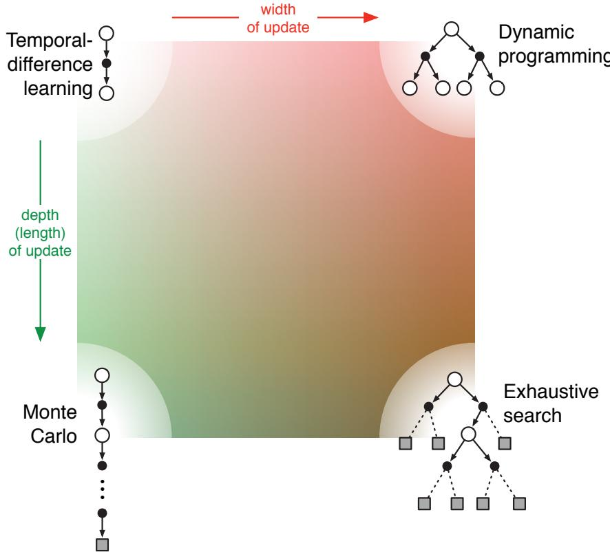

# Chapter 8

# Planning and Learning with Tabular Methods

In this chapter we develop a unified view of reinforcement learning methods that require a model of the environment, such as dynamic programming and heuristic search, and methods that can be used without a model, such as Monte Carlo and temporal- difference methods. These are respectively called model- based and model- free reinforcement learning methods. Model- based methods rely on planning as their primary component, while model- free methods primarily rely on learning. Although there are real differences between these two kinds of methods, there are also great similarities. In particular, the heart of both kinds of methods is the computation of value functions. Moreover, all the methods are based on looking ahead to future events, computing a backed- up value, and then using it as an update target for an approximate value function. Earlier in this book we presented Monte Carlo and temporal- difference methods as distinct alternatives, then showed how they can be unified by  \(n\) - step methods. Our goal in this chapter is a similar integration of model- based and model- free methods. Having established these as distinct in earlier chapters, we now explore the extent to which they can be intermixed.

# 8.1 Models and Planning

By a model of the environment we mean anything that an agent can use to predict how the environment will respond to its actions. Given a state and an action, a model produces a prediction of the resultant next state and next reward. If the model is stochastic, then there are several possible next states and next rewards, each with some probability of occurring. Some models produce a description of all possibilities and their probabilities; these we call distribution models. Other models produce just one of the possibilities, sampled according to the probabilities; these we call sample models. For example, consider modeling the sum of a dozen dice. A distribution model would produce all possible sums and their probabilities of occurring, whereas a sample model would produce an individual

sum drawn according to this probability distribution. The kind of model assumed in dynamic programming- estimates of the MDP's dynamics,  \(p(s^{\prime},r|s,a)\)  is a distribution model. The kind of model used in the blackjack example in Chapter 5 is a sample model. Distribution models are stronger than sample models in that they can always be used to produce samples. However, in many applications it is much easier to obtain sample models than distribution models. The dozen dice are a simple example of this. It would be easy to write a computer program to simulate the dice rolls and return the sum, but harder and more error- prone to figure out all the possible sums and their probabilities.

Models can be used to mimic or simulate experience. Given a starting state and action, a sample model produces a possible transition, and a distribution model generates all possible transitions weighted by their probabilities of occurring. Given a starting state and a policy, a sample model could produce an entire episode, and a distribution model could generate all possible episodes and their probabilities. In either case, we say the model is used to simulate the environment and produce simulated experience.

The word planning is used in several different ways in different fields. We use the term to refer to any computational process that takes a model as input and produces or improves a policy for interacting with the modeled environment:

In artificial intelligence, there are two distinct approaches to planning according to our definition. State- space planning, which includes the approach we take in this book, is viewed primarily as a search through the state space for an optimal policy or an optimal path to a goal. Actions cause transitions from state to state, and value functions are computed over states. In what we call plan- space planning, planning is instead a search through the space of plans. Operators transform one plan into another, and value functions, if any, are defined over the space of plans. Plan- space planning includes evolutionary methods and "partial- order planning," a common kind of planning in artificial intelligence in which the ordering of steps is not completely determined at all stages of planning. Plan- space methods are difficult to apply efficiently to the stochastic sequential decision problems that are the focus in reinforcement learning, and we do not consider them further (but see, e.g., Russell and Norvig, 2010).

The unified view we present in this chapter is that all state- space planning methods share a common structure, a structure that is also present in the learning methods presented in this book. It takes the rest of the chapter to develop this view, but there are two basic ideas: (1) all state- space planning methods involve computing value functions as a key intermediate step toward improving the policy, and (2) they compute value functions by updates or backup operations applied to simulated experience. This common structure can be diagrammed as follows:

Dynamic programming methods clearly fit this structure: they make sweeps through the space of states, generating for each state the distribution of possible transitions. Each distribution is then used to compute a backed- up value (update target) and update the

state's estimated value. In this chapter we argue that various other state- space planning methods also fit this structure, with individual methods differing only in the kinds of updates they do, the order in which they do them, and in how long the backed- up information is retained.

state's estimated value. In this chapter we argue that various other state- space planning methods also fit this structure, with individual methods differing only in the kinds of updates they do, the order in which they do them, and in how long the backed- up information is retained.Viewing planning methods in this way emphasizes their relationship to the learning methods that we have described in this book. The heart of both learning and planning methods is the estimation of value functions by backing- up update operations. The difference is that whereas planning uses simulated experience generated by a model, learning methods use real experience generated by the environment. Of course this difference leads to a number of other differences, for example, in how performance is assessed and in how flexibly experience can be generated. But the common structure means that many ideas and algorithms can be transferred between planning and learning. In particular, in many cases a learning algorithm can be substituted for the key update step of a planning method. Learning methods require only experience as input, and in many cases they can be applied to simulated experience just as well as to real experience. The box below shows a simple example of a planning method based on one- step tabular Q- learning and on random samples from a sample model. This method, which we call random- sample one- step tabular  \(Q\) - planning, converges to the optimal policy for the model under the same conditions that one- step tabular Q- learning converges to the optimal policy for the real environment (each state- action pair must be selected an infinite number of times in Step 1, and  \(\alpha\)  must decrease appropriately over time).

# Random-sample one-step tabular Q-planning

Loop forever:

1. Select a state,  \(S\in S\)  , and an action,  \(A\in {\mathcal{A}}(S)\)  , at random

2. Send  \(S,A\)  to a sample model, and obtain

a sample next reward,  \(R\)  , and a sample next state,  \(S^{\prime}\)

3. Apply one-step tabular Q-learning to  \(S,A,R,S^{\prime}\)  ..

$$
Q(S,A)\leftarrow Q(S,A) + \alpha \big[R + \gamma \max_{a}Q(S^{\prime},a) - Q(S,A)\big]
$$

In addition to the unified view of planning and learning methods, a second theme in this chapter is the benefits of planning in small, incremental steps. This enables planning to be interrupted or redirected at any time with little wasted computation, which appears to be a key requirement for efficiently intermixing planning with acting and with learning of the model. Planning in very small steps may be the most efficient approach even on pure planning problems if the problem is too large to be solved exactly.

# 8.2 Dyna: Integrated Planning, Acting, and Learning

8.2 Dyna: Integrated Planning, Acting, and LearningWhen planning is done online, while interacting with the environment, a number of interesting issues arise. New information gained from the interaction may change the model and thereby interact with planning. It may be desirable to customize the planning process in some way to the states or decisions currently under consideration, or expected

in the near future. If decision making and model learning are both computation- intensive processes, then the available computational resources may need to be divided between them. To begin exploring these issues, in this section we present Dyna- Q, a simple architecture integrating the major functions needed in an online planning agent. Each function appears in Dyna- Q in a simple, almost trivial, form. In subsequent sections we elaborate some of the alternate ways of achieving each function and the trade- offs between them. For now, we seek merely to illustrate the ideas and stimulate your intuition.

Within a planning agent, there are at least two roles for real experience: it can be used to improve the model (to make it more accurately match the real environment) and it can be used to directly improve the value function and policy using the kinds of

reinforcement learning methods we have discussed in previous chapters. The former we call model- learning, and the latter we call direct reinforcement learning (direct RL). The possible relationships between experience, model, values, and policy are summarized in the diagram to the right. Each arrow shows a relationship of influence and presumed improvement. Note how experience can improve value functions and policies either directly or indirectly via the model. It is the latter, which is sometimes called indirect reinforcement learning, that is involved in planning.

Both direct and indirect methods have advantages and disadvantages. Indirect methods often make fuller use of a limited amount of experience and thus achieve a better policy with fewer environmental interactions. On the other hand, direct methods are much simpler and are not affected by biases in the design of the model. Some have argued that indirect methods are always superior to direct ones, while others have argued that direct methods are responsible for most human and animal learning. Related debates in psychology and artificial intelligence concern the relative importance of cognition as opposed to trial- and- error learning, and of deliberative planning as opposed to reactive decision making (see Chapter 14 for discussion of some of these issues from the perspective of psychology). Our view is that the contrast between the alternatives in all these debates has been exaggerated, that more insight can be gained by recognizing the similarities between these two sides than by opposing them. For example, in this book we have emphasized the deep similarities between dynamic programming and temporal- difference methods, even though one was designed for planning and the other for model- free learning.

Dyna- Q includes all of the processes shown in the diagram above—planning, acting, model- learning, and direct RL—all occurring continually. The planning method is the random- sample one- step tabular Q- planning method on page 161. The direct RL method is one- step tabular Q- learning. The model- learning method is also table- based and assumes the environment is deterministic. After each transition  \(S_{t}, A_{t} \to R_{t + 1}, S_{t + 1}\) , the model records in its table entry for  \(S_{t}, A_{t}\)  the prediction that  \(R_{t + 1}, S_{t + 1}\)  will deterministically follow. Thus, if the model is queried with a state- action pair that has been experienced before, it simply returns the last- observed next state and next reward as its prediction.

During planning, the Q- planning algorithm randomly samples only from state- action pairs that have previously been experienced (in Step 1), so the model is never queried with a pair about which it has no information.

The overall architecture of Dyna agents, of which the Dyna- Q algorithm is one example, is shown in Figure 8.1. The central column represents the basic interaction between agent and environment, giving rise to a trajectory of real experience. The arrow on the left of the figure represents direct reinforcement learning operating on real experience to improve the value function and the policy. On the right are model- based processes. The model is learned from real experience and gives rise to simulated experience. We use the term search control to refer to the process that selects the starting states and actions for the simulated experiences generated by the model. Finally, planning is achieved by applying reinforcement learning methods to the simulated experiences just as if they had really happened. Typically, as in Dyna- Q, the same reinforcement learning method is used both for learning from real experience and for planning from simulated experience. The reinforcement learning method is thus the "final common path" for both learning and planning. Learning and planning are deeply integrated in the sense that they share almost all the same machinery, differing only in the source of their experience.

  
Figure 8.1: The general Dyna Architecture. Real experience, passing back and forth between the environment and the policy, affects policy and value functions in much the same way as does simulated experience generated by the model of the environment.

Conceptually, planning, acting, model- learning, and direct RL occur simultaneously and in parallel in Dyna agents. For concreteness and implementation on a serial computer, however, we fully specify the order in which they occur within a time step. In Dyna- Q, the acting, model- learning, and direct RL processes require little computation, and we assume they consume just a fraction of the time. The remaining time in each step can be devoted to the planning process, which is inherently computation- intensive. Let us assume that there is time in each step, after acting, model- learning, and direct RL, to complete

\(n\)  iterations (Steps 1- 3) of the Q- planning algorithm. In the pseudocode algorithm for Dyna- Q in the box below,  \(Model(s,a)\)  denotes the contents of the model (predicted next state and reward) for state- action pair  \((s,a)\) . Direct reinforcement learning, model- learning, and planning are implemented by steps (d), (e), and (f), respectively. If (e) and (f) were omitted, the remaining algorithm would be one- step tabular Q- learning.

# Tabular Dyna-Q

Initialize  \(Q(s,a)\)  and  \(Model(s,a)\)  for all  \(s\in \mathcal{S}\)  and  \(a\in \mathcal{A}(s)\)

Loop forever:

(a)  \(S\gets\)  current (nonterminal) state

(b)  \(A\gets \epsilon\)  greedy  \((S,Q)\)

(c) Take action  \(A\) ; observe resultant reward,  \(R\) , and state,  \(S'\)

(d)  \(Q(S,A)\gets Q(S,A) + \alpha \big[R + \gamma \max_{a}Q(S^{\prime},a) - Q(S,A)\big]\)

(e)  \(Model(S,A)\gets R,S'\)  (assuming deterministic environment)

(f) Loop repeat  \(n\)  times:

\(S\gets\)  random previously observed state

\(A\gets\)  random action previously taken in  \(S\)

\(R,S^{\prime}\gets M o d e l(S,A)\)

$$
Q(S,A)\gets Q(S,A) + \alpha \big[R + \gamma \max_{a}Q(S^{\prime},a) - Q(S,A)\big]
$$

Example 8.1: Dyna Maze Consider the simple maze shown inset in Figure 8.2. In each of the 47 states there are four actions, up, down, right, and left, which take the agent deterministically to the corresponding neighboring states, except when movement is blocked by an obstacle or the edge of the maze, in which case the agent remains where it is. Reward is zero on all transitions, except those into the goal state, on which it is  \(+1\) . After reaching the goal state (G), the agent returns to the start state (S) to begin a new episode. This is a discounted, episodic task with  \(\gamma = 0.95\)

The main part of Figure 8.2 shows average learning curves from an experiment in which Dyna- Q agents were applied to the maze task. The initial action values were zero, the step- size parameter was  \(\alpha = 0.1\) , and the exploration parameter was  \(\epsilon = 0.1\) . When selecting greedily among actions, ties were broken randomly. The agents varied in the number of planning steps,  \(n\) , they performed per real step. For each  \(n\) , the curves show the number of steps taken by the agent to reach the goal in each episode, averaged over 30 repetitions of the experiment. In each repetition, the initial seed for the random number generator was held constant across algorithms. Because of this, the first episode was exactly the same (about 1700 steps) for all values of  \(n\) , and its data are not shown in the figure. After the first episode, performance improved for all values of  \(n\) , but much more rapidly for larger values. Recall that the  \(n = 0\)  agent is a nonplanning agent, using only direct reinforcement learning (one- step tabular Q- learning). This was by far the slowest agent on this problem, despite the fact that the parameter values ( \(\alpha\)  and  \(\epsilon\) ) were optimized for it. The nonplanning agent took about 25 episodes to reach ( \(\epsilon\) - optimal performance, whereas the  \(n = 5\)  agent took about five episodes, and the  \(n = 50\)  agent took only three episodes.

  
Figure 8.2: A simple maze (inset) and the average learning curves for Dyna-Q agents varying in their number of planning steps  \((n)\)  per real step. The task is to travel from S to G as quickly as possible.

Figure 8.3 shows why the planning agents found the solution so much faster than the nonplanning agent. Shown are the policies found by the  \(n = 0\)  and  \(n = 50\)  agents halfway through the second episode. Without planning  \((n = 0)\) , each episode adds only one additional step to the policy, and so only one step (the last) has been learned so far. With planning, again only one step is learned during the first episode, but here during the second episode an extensive policy has been developed that by the end of the episode will reach almost back to the start state. This policy is built by the planning process while the agent is still wandering near the start state. By the end of the third episode a complete optimal policy will have been found and perfect performance attained.

  
Figure 8.3: Policies found by planning and nonplanning Dyna-Q agents halfway through the second episode. The arrows indicate the greedy action in each state; if no arrow is shown for a state, then all of its action values were equal. The black square indicates the location of the agent.

In Dyna- Q, learning and planning are accomplished by exactly the same algorithm, operating on real experience for learning and on simulated experience for planning. Because planning proceeds incrementally, it is trivial to intermix planning and acting. Both proceed as fast as they can. The agent is always reactive and always deliberative, responding instantly to the latest sensory information and yet always planning in the background. Also ongoing in the background is the model- learning process. As new information is gained, the model is updated to better match reality. As the model changes, the ongoing planning process will gradually compute a different way of behaving to match the new model.

Exercise 8.1 The nonplanning method looks particularly poor in Figure 8.3 because it is a one- step method; a method using multi- step bootstrapping would do better. Do you think one of the multi- step bootstrapping methods from Chapter 7 could do as well as the Dyna method? Explain why or why not.

# 8.3 When the Model Is Wrong

In the maze example presented in the previous section, the changes in the model were relatively modest. The model started out empty, and was then filled only with exactly correct information. In general, we cannot expect to be so fortunate. Models may be incorrect because the environment is stochastic and only a limited number of samples have been observed, or because the model was learned using function approximation that has generalized imperfectly, or simply because the environment has changed and its new behavior has not yet been observed. When the model is incorrect, the planning process is likely to compute a suboptimal policy.

In some cases, the suboptimal policy computed by planning quickly leads to the discovery and correction of the modeling error. This tends to happen when the model is optimistic in the sense of predicting greater reward or better state transitions than are actually possible. The planned policy attempts to exploit these opportunities and in doing so discovers that they do not exist.

Example 8.2: Blocking Maze A maze example illustrating this relatively minor kind of modeling error and recovery from it is shown in Figure 8.4. Initially, there is a short path from start to goal, to the right of the barrier, as shown in the upper left of the figure. After 1000 time steps, the short path is "blocked," and a longer path is opened up along the left- hand side of the barrier, as shown in upper right of the figure. The graph shows average cumulative reward for a Dyna- Q agent and an enhanced Dyna- Q+ agent to be described shortly. The first part of the graph shows that both Dyna agents found the short path within 1000 steps. When the environment changed, the graphs become flat, indicating a period during which the agents obtained no reward because they were wandering around behind the barrier. After a while, however, they were able to find the new opening and the new optimal behavior.

Greater difficulties arise when the environment changes to become better than it was before, and yet the formerly correct policy does not reveal the improvement. In these cases the modeling error may not be detected for a long time, if ever.

  
Figure 8.4: Average performance of Dyna agents on a blocking task. The left environment was used for the first 1000 steps, the right environment for the rest. Dyna-Q+ is Dyna-Q with an exploration bonus that encourages exploration.

# Example 8.3: Shortcut Maze

The problem caused by this kind of environmental change is illustrated by the maze example shown in Figure 8.5. Initially, the optimal path is to go around the left side of the barrier (upper left). After 3000 steps, however, a shorter path is opened up along the right side, without disturbing the longer path (upper right). The graph shows that the regular Dyna- Q agent never switched to the shortcut. In fact, it never realized that it existed. Its model said that there was no shortcut, so the more it planned, the less likely it was to step to the right and discover it. Even with an  \(\epsilon\) - greedy policy, it is very unlikely that an agent will take so many exploratory actions as to discover the shortcut.

  
Figure 8.5: Average performance of Dyna agents on a shortcut task. The left environment was used for the first 3000 steps, the right environment for the rest.

The general problem here is another version of the conflict between exploration and exploitation. In a planning context, exploration means trying actions that improve the model, whereas exploitation means behaving in the optimal way given the current model.

We want the agent to explore to find changes in the environment, but not so much that performance is greatly degraded. As in the earlier exploration/exploitation conflict, there probably is no solution that is both perfect and practical, but simple heuristics are often effective.

The Dyna- Q+ agent that did solve the shortcut maze uses one such heuristic. This agent keeps track for each state- action pair of how many time steps have elapsed since the pair was last tried in a real interaction with the environment. The more time that has elapsed, the greater (we might presume) the chance that the dynamics of this pair has changed and that the model of it is incorrect. To encourage behavior that tests long- untried actions, a special "bonus reward" is given on simulated experiences involving these actions. In particular, if the modeled reward for a transition is  \(r\) , and the transition has not been tried in  \(r\)  time steps, then planning updates are done as if that transition produced a reward of  \(r + \kappa \sqrt{\tau}\) , for some small  \(\kappa\) . This encourages the agent to keep testing all accessible state transitions and even to find long sequences of actions in order to carry out such tests.1 Of course all this testing has its cost, but in many cases, as in the shortcut maze, this kind of computational curiosity is well worth the extra exploration.

Exercise 8.2 Why did the Dyna agent with exploration bonus, Dyna- Q+, perform better in the first phase as well as in the second phase of the blocking and shortcut experiments?

Exercise 8.3 Careful inspection of Figure 8.5 reveals that the difference between Dyna- Q+ and Dyna- Q narrowed slightly over the first part of the experiment. What is the reason for this?

Exercise 8.4 (programming) The exploration bonus described above actually changes the estimated values of states and actions. Is this necessary? Suppose the bonus  \(\kappa \sqrt{\tau}\)  was used not in updates, but solely in action selection. That is, suppose the action selected was always that for which  \(Q(S_t, a) + \kappa \sqrt{\tau} (S_t, a)\)  was maximal. Carry out a gridworld experiment that tests and illustrates the strengths and weaknesses of this alternate approach.

Exercise 8.5 How might the tabular Dyna- Q algorithm shown on page 164 be modified to handle stochastic environments? How might this modification perform poorly on changing environments such as considered in this section? How could the algorithm be modified to handle stochastic environments and changing environments?

# 8.4 Prioritized Sweeping

In the Dyna agents presented in the preceding sections, simulated transitions are started in state- action pairs selected uniformly at random from all previously experienced pairs. But a uniform selection is usually not the best; planning can be much more efficient if simulated transitions and updates are focused on particular state- action pairs. For example, consider

what happens during the second episode of the first maze task (Figure 8.3). At the beginning of the second episode, only the state- action pair leading directly into the goal has a positive value; the values of all other pairs are still zero. This means that it is pointless to perform updates along almost all transitions, because they take the agent from one zero- valued state to another, and thus the updates would have no effect. Only an update along a transition into the state just prior to the goal, or from it, will change any values. If simulated transitions are generated uniformly, then many wasteful updates will be made before stumbling onto one of these useful ones. As planning progresses, the region of useful updates grows, but planning is still far less efficient than it would be if focused where it would do the most good. In the much larger problems that are our real objective, the number of states is so large that an unfocused search would be extremely inefficient.

This example suggests that search might be usefully focused by working backward from goal states. Of course, we do not really want to use any methods specific to the idea of "goal state." We want methods that work for general reward functions. Goal states are just a special case, convenient for stimulating intuition. In general, we want to work back not just from goal states but from any state whose value has changed. Suppose that the values are initially correct given the model, as they were in the maze example prior to discovering the goal. Suppose now that the agent discovers a change in the environment and changes its estimated value of one state, either up or down. Typically, this will imply that the values of many other states should also be changed, but the only useful one- step updates are those of actions that lead directly into the one state whose value has been changed. If the values of these actions are updated, then the values of the predecessor states may change in turn. If so, then actions leading into them need to be updated, and then their predecessor states may have changed. In this way one can work backward from arbitrary states that have changed in value, either performing useful updates or terminating the propagation. This general idea might be termed backward focusing of planning computations.

As the frontier of useful updates propagates backward, it often grows rapidly, producing many state- action pairs that could usefully be updated. But not all of these will be equally useful. The values of some states may have changed a lot, whereas others may have changed little. The predecessor pairs of those that have changed a lot are more likely to also change a lot. In a stochastic environment, variations in estimated transition probabilities also contribute to variations in the sizes of changes and in the urgency with which pairs need to be updated. It is natural to prioritize the updates according to a measure of their urgency, and perform them in order of priority. This is the idea behind prioritized sweeping. A queue is maintained of every state- action pair whose estimated value would change nontrivially if updated, prioritized by the size of the change. When the top pair in the queue is updated, the effect on each of its predecessor pairs is computed. If the effect is greater than some small threshold, then the pair is inserted in the queue with the new priority (if there is a previous entry of the pair in the queue, then insertion results in only the higher priority entry remaining in the queue). In this way the effects of changes are efficiently propagated backward until quiescence. The full algorithm for the case of deterministic environments is given in the box on the next page.

# Prioritized sweeping for a deterministic environment

Initialize  \(Q(s,a)\)  , Model  \((s,a)\)  , for all  \(s,a\)  , and PQueue to empty Loop forever:

(a)  \(S\gets\)  current (nonterminal) state

(b)  \(A\gets p o t i c g(S,Q)\)

(c) Take action  \(A\)  ; observe resultant reward,  \(R\)  , and state,  \(S^{\prime}\)

(d)  \(M o d e l(S,A)\gets R,S^{\prime}\)

(e)  \(P\gets |R + \gamma \max_{a}Q(S^{\prime},a) - Q(S,A)|\)

(f) if  \(P > \theta\)  , then insert  \(S,A\)  into PQueue with priority  \(P\)

(g) Loop repeat  \(n\)  times, while PQueue is not empty:

\(S,A\gets f i r s t(P Q u e u e)\)

\(R,S^{\prime}\gets M o d e l(S,A)\)

$$
Q(S,A)\gets Q(S,A) + \alpha \left[R + \gamma \max_{a}Q(S^{\prime},a) - Q(S,A)\right]
$$

Loop for all  \(S,A\)  predicted to lead to  \(S\)

\(\bar{R}\gets\)  predicted reward for  \(\bar{S},\bar{A},S\)

\(P\gets |\bar{R} +\gamma \max_{a}Q(S,a) - Q(\bar{S},\bar{A})|\)

if  \(P > \theta\)  then insert  \(S,A\)  into PQueue with priority  \(P\)

Example 8.4: Prioritized Sweeping on Mazes Prioritized sweeping has been found to dramatically increase the speed at which optimal solutions are found in maze tasks, often by a factor of 5 to 10. A typical example is shown to the right. These data are for a sequence of maze tasks of exactly the same structure as the one shown in Figure 8.2, except that they vary in the grid resolution. Prioritized sweeping maintained a decisive advantage over unprioritized Dyna- Q. Both systems made at most  \(n = 5\)  updates per environmental interaction. Adapted from Peng and Williams (1993).

Extensions of prioritized sweeping to stochastic environments are straightforward. The model is maintained by keeping counts of the number of times each state- action pair has been experienced and of what the next states were. It is natural then to update each pair not with a sample update, as we have been using so far, but with an expected update, taking into account all possible next states and their probabilities of occurring.

Prioritized sweeping is just one way of distributing computations to improve planning efficiency, and probably not the best way. One of prioritized sweeping's limitations is that it uses expected updates, which in stochastic environments may waste lots of computation on low- probability transitions. As we show in the following section, sample updates

# Example 8.5 Prioritized Sweeping for Rod Maneuvering

The objective in this task is to maneuver a rod around some awkwardly placed obstacles within a limited rectangular work space to a goal position in the fewest number of steps. The rod can be translated along its long axis or perpendicular to that axis, or it can be rotated in either direction around its center. The distance of each movement is approximately  \(1 / 20\)  of the work space, and the rotation increment is 10 degrees. Translations are deterministic and quantized to one of  \(20\times 20\)  positions. To the right is shown the obstacles and the shortest solution from start to goal,

found by prioritized sweeping. This problem is deterministic, but has four actions and 14,400 potential states (some of these are unreachable because of the obstacles). This problem is probably too large to be solved with unprioritized methods. Figure reprinted from Moore and Atkeson (1993).

can in many cases get closer to the true value function with less computation despite the variance introduced by sampling. Sample updates can win because they break the overall backing- up computation into smaller pieces- those corresponding to individual transitions- which then enables it to be focused more narrowly on the pieces that will have the largest impact. This idea was taken to what may be its logical limit in the "small backups" introduced by van Seijen and Sutton (2013). These are updates along a single transition, like a sample update, but based on the probability of the transition without sampling, as in an expected update. By selecting the order in which small updates are done it is possible to greatly improve planning efficiency beyond that possible with prioritized sweeping.

We have suggested in this chapter that all kinds of state- space planning can be viewed as sequences of value updates, varying only in the type of update, expected or sample, large or small, and in the order in which the updates are done. In this section we have emphasized backward focusing, but this is just one strategy. For example, another would be to focus on states according to how easily they can be reached from the states that are visited frequently under the current policy, which might be called forward focusing. Peng and Williams (1993) and Barto, Bradtke and Singh (1995) have explored versions of forward focusing, and the methods introduced in the next few sections take it to an extreme form.

# 8.5 Expected vs. Sample Updates

The examples in the previous sections give some idea of the range of possibilities for combining methods of learning and planning. In the rest of this chapter, we analyze some of the component ideas involved, starting with the relative advantages of expected and sample updates.

Much of this book has been about different kinds of value- function updates, and we have considered a great many varieties. Focusing for the moment on one- step updates, they vary primarily along three binary dimensions. The first two dimensions are whether they update state values or action values and whether they estimate the value for the optimal policy or for an arbitrary given policy. These two dimensions give rise to four classes of updates for approximating the four value functions,  \(q_{*}\) \(v_{*}\) \(q_{\pi}\)  , and  \(v_{\pi}\)  . The

other binary dimension is whether the updates are expected updates, considering all possible events that might happen, or sample updates, considering a single sample of what might happen. These three binary dimensions give rise to eight cases, seven of which correspond to specific algorithms, as shown in the figure to the right. (The eighth case does not seem to correspond to any useful update.) Any of these onestep updates can be used in planning methods. The Dyna- Q agents discussed earlier use  \(q_{*}\)  sample updates, but they could just as well use  \(q_{*}\)  expected updates, or either expected or sample  \(q_{\pi}\)  updates. The Dyna- AC system uses  \(v_{\pi}\)  sample updates together with a learning policy structure (as in Chapter 13). For stochastic problems, prioritized sweeping is always done using one of the expected updates.

When we introduced one- step sample updates in Chapter 6, we presented them as substitutes for expected updates. In the absence of a distribution model, expected updates are not possible, but sample updates can be done using sample transitions from the environment or a sample model. Implicit in that point of view is that expected updates, if possible, are preferable to sample updates. But are they? Expected

  
Figure 8.6: Backup diagrams for all the one-step updates considered in this book.

updates certainly yield a better estimate because they are uncorrupted by sampling error, but they also require more computation, and computation is often the limiting resource in planning. To properly assess the relative merits of expected and sample updates for planning we must control for their different computational requirements.

For concreteness, consider the expected and sample updates for approximating  \(q_{*}\)  and the special case of discrete states and actions, a table- lookup representation of the approximate value function,  \(Q\) , and a model in the form of estimated dynamics,  \(\hat{p} (s', r | s, a)\) . The expected update for a state- action pair,  \(s, a\) , is:

$$
Q(s,a)\leftarrow \sum_{s^{\prime},a}\hat{p} (s^{\prime},r|s,a)\Big[r + \gamma \max_{a^{\prime}}Q(s^{\prime},a^{\prime})\Big]. \tag{8.1}
$$

The corresponding sample update for  \(s, a\) , given a sample next state and reward,  \(S'\)  and  \(R\)  (from the model), is the  \(Q\) - learning- like update:

$$
Q(s,a)\leftarrow Q(s,a) + \alpha \Big[R + \gamma \max_{a^{\prime}}Q(S^{\prime},a^{\prime}) - Q(s,a)\Big], \tag{8.2}
$$

where  \(\alpha\)  is the usual positive step- size parameter.

The difference between these expected and sample updates is significant to the extent that the environment is stochastic, specifically, to the extent that, given a state and action, many possible next states may occur with various probabilities. If only one next state is possible, then the expected and sample updates given above are identical (taking  \(\alpha = 1\) ). If there are many possible next states, then there may be significant differences. In favor of the expected update is that it is an exact computation, resulting in a new  \(Q(s, a)\)  whose correctness is limited only by the correctness of the  \(Q(s', a')\)  at successor states. The sample update is in addition affected by sampling error. On the other hand, the sample update is cheaper computationally because it considers only one next state, not all possible next states. In practice, the computation required by update operations is usually dominated by the number of state- action pairs at which  \(Q\)  is evaluated. For a particular starting pair,  \(s, a\) , let  \(b\)  be the branching factor (i.e., the number of possible next states,  \(s'\) , for which  \(\hat{p} (s'|s, a) > 0\) ). Then an expected update of this pair requires roughly  \(b\)  times as much computation as a sample update.

If there is enough time to complete an expected update, then the resulting estimate is generally better than that of  \(b\)  sample updates because of the absence of sampling error. But if there is insufficient time to complete an expected update, then sample updates are always preferable because they at least make some improvement in the value estimate with fewer than  \(b\)  updates. In a large problem with many state- action pairs, we are often in the latter situation. With so many state- action pairs, expected updates of all of them would take a very long time. Before that we may be much better off with a few sample updates at many state- action pairs than with expected updates at a few pairs. Given a unit of computational effort, is it better devoted to a few expected updates or to  \(b\)  times as many sample updates?

Figure 8.7 shows the results of an analysis that suggests an answer to this question. It shows the estimation error as a function of computation time for expected and sample updates for a variety of branching factors,  \(b\) . The case considered is that in which all

  
Figure 8.7: Comparison of efficiency of expected and sample updates.

\(b\)  successor states are equally likely and in which the error in the initial estimate is 1. The values at the next states are assumed correct, so the expected update reduces the error to zero upon its completion. In this case, sample updates reduce the error according to  \(\sqrt{\frac{b - 1}{b t}}\)  where  \(t\)  is the number of sample updates that have been performed (assuming sample averages, i.e.,  \(\alpha = 1 / t\) ). The key observation is that for moderately large  \(b\)  the error falls dramatically with a tiny fraction of  \(b\)  updates. For these cases, many state- action pairs could have their values improved dramatically, to within a few percent of the effect of an expected update, in the same time that a single state- action pair could undergo an expected update.

The advantage of sample updates shown in Figure 8.7 is probably an underestimate of the real effect. In a real problem, the values of the successor states would be estimates that are themselves updated. By causing estimates to be more accurate sooner, sample updates will have a second advantage in that the values backed up from the successor states will be more accurate. These results suggest that sample updates are likely to be superior to expected updates on problems with large stochastic branching factors and too many states to be solved exactly.

Exercise 8.6 The analysis above assumed that all of the  \(b\)  possible next states were equally likely to occur. Suppose instead that the distribution was highly skewed, that some of the  \(b\)  states were much more likely to occur than most. Would this strengthen or weaken the case for sample updates over expected updates? Support your answer.  \(\square\)

# 8.6 Trajectory Sampling

In this section we compare two ways of distributing updates. The classical approach, from dynamic programming, is to perform sweeps through the entire state (or state- action) space, updating each state (or state- action pair) once per sweep. This is problematic

on large tasks because there may not be time to complete even one sweep. In many tasks the vast majority of the states are irrelevant because they are visited only under very poor policies or with very low probability. Exhaustive sweeps implicitly devote equal time to all parts of the state space rather than focusing where it is needed. As we discussed in Chapter 4, exhaustive sweeps and the equal treatment of all states that they imply are not necessary properties of dynamic programming. In principle, updates can be distributed any way one likes (to assure convergence, all states or state- action pairs must be visited in the limit an infinite number of times; although an exception to this is discussed in Section 8.7 below), but in practice exhaustive sweeps are often used.

The second approach is to sample from the state or state- action space according to some distribution. One could sample uniformly, as in the Dyna- Q agent, but this would suffer from some of the same problems as exhaustive sweeps. More appealing is to distribute updates according to the on- policy distribution, that is, according to the distribution observed when following the current policy. One advantage of this distribution is that it is easily generated; one simply interacts with the model, following the current policy. In an episodic task, one starts in a start state (or according to the starting- state distribution) and simulates until the terminal state. In a continuing task, one starts anywhere and just keeps simulating. In either case, sample state transitions and rewards are given by the model, and sample actions are given by the current policy. In other words, one simulates explicit individual trajectories and performs updates at the state or state- action pairs encountered along the way. We call this way of generating experience and updates trajectory sampling.

It is hard to imagine any efficient way of distributing updates according to the on- policy distribution other than by trajectory sampling. If one had an explicit representation of the on- policy distribution, then one could sweep through all states, weighting the update of each according to the on- policy distribution, but this leaves us again with all the computational costs of exhaustive sweeps. Possibly one could sample and update individual state- action pairs from the distribution, but even if this could be done efficiently, what benefit would this provide over simulating trajectories? Even knowing the on- policy distribution in an explicit form is unlikely. The distribution changes whenever the policy changes, and computing the distribution requires computation comparable to a complete policy evaluation. Consideration of such other possibilities makes trajectory sampling seem both efficient and elegant.

Is the on- policy distribution of updates a good one? Intuitively it seems like a good choice, at least better than the uniform distribution. For example, if you are learning to play chess, you study positions that might arise in real games, not random positions of chess pieces. The latter may be valid states, but to be able to accurately value them is a different skill from evaluating positions in real games. We will also see in Part II that the on- policy distribution has significant advantages when function approximation is used. Whether or not function approximation is used, one might expect on- policy focusing to significantly improve the speed of planning.

Focusing on the on- policy distribution could be beneficial because it causes vast, uninteresting parts of the space to be ignored, or it could be detrimental because it causes the same old parts of the space to be updated over and over. We conducted a small

experiment to assess the effect empirically. To isolate the effect of the update distribution, we used entirely one- step expected tabular updates, as defined by (8.1). In the uniform case, we cycled through all state- action pairs, updating each in place, and in the on- policy case we simulated episodes, all starting in the same state, updating each state- action pair that occurred under the current  \(\epsilon\) - greedy policy ( \(\epsilon = 0.1\) ). The tasks were undiscounted episodic tasks, generated randomly as follows. From each of the  \(|\mathcal{S}|\)  states, two actions were possible, each of which resulted in one of  \(b\)  next states, all equally likely, with a different random selection of  \(b\)  states for each state- action pair. The branching factor,  \(b\) , was the same for all state- action pairs. In addition, on all transitions there was a 0.1 probability of transition to the terminal state, ending the episode. The expected reward on each transition was selected from a Gaussian distribution with mean 0 and variance 1. At any point in the planning process one can stop and exhaustively compute  \(v_{\tilde{\pi}}(s_0)\) , the true value of the start state under the greedy policy,  \(\tilde{\pi}\) , given the current action- value function  \(Q\) , as an indication of how well the agent would do on a new episode on which it acted greedily (all the while assuming the model is correct).

At any point in the planning process one can stop and exhaustively compute  \(v_{\tilde{\pi}}(s_0)\)  , the true value of the start state under the greedy policy,  \(\tilde{\pi}\)  , given the current action- value function  \(Q\)  , as an indication of how well the agent would do on a new episode on which it acted greedily (all the while assuming the model is correct).

The upper part of the figure to the right shows results averaged over 200 sample tasks with 1000 states and branching factors of 1, 3, and 10. The quality of the policies found is plotted as a function of the number of expected updates completed. In all cases, sampling according to the on- policy distribution resulted in faster planning initially and retarded planning in the long run. The effect was stronger, and the initial period of faster planning was longer, at smaller branching factors. In other experiments, we found that these effects also became stronger as the number of states increased. For example, the lower part of the figure shows results for a branching factor of 1 for tasks with 10,000 states. In this case the advantage of on- policy focusing is large and long- lasting.

All of these results make sense. In the short term, sampling according to the on- policy distribution helps by focusing on states that are near descendants of

  
Figure 8.8: Relative efficiency of updates distributed uniformly across the state space versus focused on simulated on-policy trajectories, each starting in the same state. Results are for randomly generated tasks of two sizes and various branching factors,  \(b\) .

the start state. If there are many states and a small branching factor, this effect will be large and long- lasting. In the long run, focusing on the on- policy distribution may hurt because the commonly occurring states all already have their correct values. Sampling them is useless, whereas sampling other states may actually perform some useful work. This presumably is why the exhaustive, unfocused approach does better in the long run, at least for small problems. These results are not conclusive because they are only for problems generated in a particular, random way, but they do suggest that sampling according to the on- policy distribution can be a great advantage for large problems, in particular for problems in which a small subset of the state- action space is visited under the on- policy distribution.

Exercise 8.7 Some of the graphs in Figure 8.8 seem to be scalloped in their early portions, particularly the upper graph for  \(b = 1\)  and the uniform distribution. Why do you think this is? What aspects of the data shown support your hypothesis?

Exercise 8.8 (programming) Replicate the experiment whose results are shown in the lower part of Figure 8.8, then try the same experiment but with  \(b = 3\) . Discuss the meaning of your results.

# 8.7 Real-time Dynamic Programming

Real- time dynamic programming, or RTDP, is an on- policy trajectory- sampling version of the value- iteration algorithm of dynamic programming (DP). Because it is closely related to conventional sweep- based policy iteration, RTDP illustrates in a particularly clear way some of the advantages that on- policy trajectory sampling can provide. RTDP updates the values of states visited in actual or simulated trajectories by means of expected tabular value- iteration updates as defined by (4.10). It is basically the algorithm that produced the on- policy results shown in Figure 8.8.

The close connection between RTDP and conventional DP makes it possible to derive some theoretical results by adapting existing theory. RTDP is an example of an asynchronous DP algorithm as described in Section 4.5. Asynchronous DP algorithms are not organized in terms of systematic sweeps of the state set; they update state values in any order whatsoever, using whatever values of other states happen to be available. In RTDP, the update order is dictated by the order states are visited in real or simulated trajectories.

If trajectories can start only from a designated set of start states, and if you are interested in the prediction problem for a given policy, then on- policy trajectory sampling allows the algorithm to completely skip states that cannot be reached by the given policy from any of the start states: such states are irrelevant to the prediction problem. For a control problem, where the goal is to find an optimal policy instead of evaluating a given policy, there might well be states that cannot be

  
Irrelevant States: unreachable from any start state under any optimal policy

Relevant States reachable from some start state under some optimal policy

reached by any optimal policy from any of the start states, and there is no need to specify optimal actions for these irrelevant states. What is needed is an optimal partial policy, meaning a policy that is optimal for the relevant states but can specify arbitrary actions, or even be undefined, for the irrelevant states.

But finding such an optimal partial policy with an on- policy trajectory- sampling control method, such as Sarsa (Section 6.4), in general requires visiting all state- action pairs—even those that will turn out to be irrelevant—an infinite number of times. This can be done, for example, by using exploring starts (Section 5.3). This is true for RTDP as well: for episodic tasks with exploring starts, RTDP is an asynchronous value- iteration algorithm that converges to optimal policies for discounted finite MDPs (and for the undiscounted case under certain conditions). Unlike the situation for a prediction problem, it is generally not possible to stop updating any state or state- action pair if convergence to an optimal policy is important.

The most interesting result for RTDP is that for certain types of problems satisfying reasonable conditions, RTDP is guaranteed to find a policy that is optimal on the relevant states without visiting every state infinitely often, or even without visiting some states at all. Indeed, in some problems, only a small fraction of the states need to be visited. This can be a great advantage for problems with very large state sets, where even a single sweep may not be feasible.

The tasks for which this result holds are undiscounted episodic tasks for MDPs with absorbing goal states that generate zero rewards, as described in Section 3.4. At every step of a real or simulated trajectory, RTDP selects a greedy action (breaking ties randomly) and applies the expected value- iteration update operation to the current state. It can also update the values of an arbitrary collection of other states at each step; for example, it can update the values of states visited in a limited- horizon look- ahead search from the current state.

For these problems, with each episode beginning in a state randomly chosen from the set of start states and ending at a goal state, RTDP converges with probability one to a policy that is optimal for all the relevant states provided: (1) the initial value of every goal state is zero, (2) there exists at least one policy that guarantees that a goal state will be reached with probability one from any start state, (3) all rewards for transitions from non- goal states are strictly negative, and (4) all the initial values are equal to, or greater than, their optimal values (which can be satisfied by simply setting the initial values of all states to zero). This result was proved by Barto, Bradtke, and Singh (1995) by combining results for asynchronous DP with results about a heuristic search algorithm known as learning real- time  \(A^{*}\)  due to Korf (1990).

Tasks having these properties are examples of stochastic optimal path problems, which are usually stated in terms of cost minimization instead of as reward maximization as we do here. Maximizing the negative returns in our version is equivalent to minimizing the costs of paths from a start state to a goal state. Examples of this kind of task are minimum- time control tasks, where each time step required to reach a goal produces a reward of  \(- 1\) , or problems like the Golf example in Section 3.5, whose objective is to hit the hole with the fewest strokes.

Example 8.6: RTDP on the Racetrack The racetrack problem of Exercise 5.12 (page 111) is a stochastic optimal path problem. Comparing RTDP and the conventional DP value iteration algorithm on an example racetrack problem illustrates some of the advantages of on- policy trajectory sampling.

Recall from the exercise that an agent has to learn how to drive a car around a turn like those shown in Figure 5.5 and cross the finish line as quickly as possible while staying on the track. Start states are all the zero- speed states on the starting line; the goal states are all the states that can be reached in one time step by crossing the finish line from inside the track. Unlike Exercise 5.12, here there is no limit on the car's speed, so the state set is potentially infinite. However, the set of states that can be reached from the set of start states via any policy is finite and can be considered to be the state set of the problem. Each episode begins in a randomly selected start state and ends when the car crosses the finish line. The rewards are  \(- 1\)  for each step until the car crosses the finish line. If the car hits the track boundary, it is moved back to a random start state, and the episode continues.

A racetrack similar to the small racetrack on the left of Figure 5.5 has 9,115 states reachable from start states by any policy, only 599 of which are relevant, meaning that they are reachable from some start state via some optimal policy. (The number of relevant states was estimated by counting the states visited while executing optimal actions for  \(10^{7}\)  episodes.)

The table below compares solving this task by conventional DP and by RTDP. These results are averages over 25 runs, each begun with a different random number seed. Conventional DP in this case is value iteration using exhaustive sweeps of the state set, with values updated one state at a time in place, meaning that the update for each state uses the most recent values of the other states (This is the Gauss- Seidel version of value iteration, which was found to be approximately twice as fast as the Jacobi version on this problem. See Section 4.8. ) No special attention was paid to the ordering of the updates; other orderings could have produced faster convergence. Initial values were all zero for each run of both methods. DP was judged to have converged when the maximum change in a state value over a sweep was less than  \(10^{- 4}\) , and RTDP was judged to have converged when the average time to cross the finish line over 20 episodes appeared to stabilize at an asymptotic number of steps. This version of RTDP updated only the value of the current state on each step.

<table><tr><td></td><td>DP</td><td>RTDP</td></tr><tr><td>Average computation to convergence</td><td>28 sweeps</td><td>4000 episodes</td></tr><tr><td>Average number of updates to convergence</td><td>252,784</td><td>127,600</td></tr><tr><td>Average number of updates per episode</td><td>—</td><td>31.9</td></tr><tr><td>% of states updated ≤ 100 times</td><td>—</td><td>98.45</td></tr><tr><td>% of states updated ≤ 10 times</td><td>—</td><td>80.51</td></tr><tr><td>% of states updated 0 times</td><td>—</td><td>3.18</td></tr></table>

Both methods produced policies averaging between 14 and 15 steps to cross the finish line, but RTDP required only roughly half of the updates that DP did. This is the result of RTDP's on- policy trajectory sampling. Whereas the value of every state was updated

in each sweep of DP, RTDP focused updates on fewer states. In an average run, RTDP updated the values of  \(98.45\%\) , of the states no more than 100 times and  \(80.51\%\)  of the states no more than 10 times; the values of about 290 states were not updated at all in an average run.

Another advantage of RTDP is that as the value function approaches the optimal value function  \(v_{*}\) , the policy used by the agent to generate trajectories approaches an optimal policy because it is always greedy with respect to the current value function. This is in contrast to the situation in conventional value iteration. In practice, value iteration terminates when the value function changes by only a small amount in a sweep, which is how we terminated it to obtain the results in the table above. At this point, the value function closely approximates  \(v_{*}\) , and a greedy policy is close to an optimal policy. However, it is possible that policies that are greedy with respect to the latest value function were optimal, or nearly so, long before value iteration terminates. (Recall from Chapter 4 that optimal policies can be greedy with respect to many different value functions, not just  \(v_{*}\) .) Checking for the emergence of an optimal policy before value iteration converges is not a part of the conventional DP algorithm and requires considerable additional computation.

In the racetrack example, by running many test episodes after each DP sweep, with actions selected greedily according to the result of that sweep, it was possible to estimate the earliest point in the DP computation at which the approximated optimal evaluation function was good enough so that the corresponding greedy policy was nearly optimal. For this racetrack, a close- to- optimal policy emerged after 15 sweeps of value iteration, or after 136,725 value- iteration updates. This is considerably less than the 252,784 updates DP needed to converge to  \(v_{*}\) , but still more than the 127,600 updates RTDP required.

Although these simulations are certainly not definitive comparisons of the RTDP with conventional sweep- based value iteration, they illustrate some of advantages of on- policy trajectory sampling. Whereas conventional value iteration continued to update the value of all the states, RTDP strongly focused on subsets of the states that were relevant to the problem's objective. This focus became increasingly narrow as learning continued. Because the convergence theorem for RTDP applies to the simulations, we know that RTDP eventually would have focused only on relevant states, i.e., on states making up optimal paths. RTDP achieved nearly optimal control with about  \(50\%\)  of the computation required by sweep- based value iteration.

# 8.8 Planning at Decision Time

Planning can be used in at least two ways. The one we have considered so far in this chapter, typified by dynamic programming and Dyna, is to use planning to gradually improve a policy or value function on the basis of simulated experience obtained from a model (either a sample or a distribution model). Selecting actions is then a matter of comparing the current state's action values obtained from a table in the tabular case we have thus far considered, or by evaluating a mathematical expression in the approximate methods we consider in Part II below. Well before an action is selected for any current state  \(S_{t}\) , planning has played a part in improving the table entries, or the function

approximation parameters, needed to select actions for many states, including  \(S_{t}\) . Used this way, planning is not focused on the current state. We call planning used in this way background planning.

The other way to use planning is to begin and complete it after encountering each new state  \(S_{t}\) , as a computation whose output is the selection of a single action  \(A_{t}\) ; on the next step planning begins anew with  \(S_{t + 1}\)  to produce  \(A_{t + 1}\) , and so on. The simplest, and almost degenerate, example of this use of planning is when only state values are available, and an action is selected by comparing the values of model- predicted next states for each action (or by comparing the values of afterstates as in the tic- tac- toe example in Chapter 1). More generally, planning used in this way can look much deeper than one- step- ahead and evaluate action choices leading to many different predicted state and reward trajectories. Unlike the first use of planning, here planning focuses on a particular state. We call this decision- time planning.

These two ways of thinking about planning—using simulated experience to gradually improve a policy or value function, or using simulated experience to select an action for the current state—can blend together in natural and interesting ways, but they have tended to be studied separately, and that is a good way to first understand them. Let us now take a closer look at decision- time planning.

Even when planning is only done at decision time, we can still view it, as we did in Section 8.1, as proceeding from simulated experience to updates and values, and ultimately to a policy. It is just that now the values and policy are specific to the current state and the action choices available there, so much so that the values and policy created by the planning process are typically discarded after being used to select the current action. In many applications this is not a great loss because there are very many states and we are unlikely to return to the same state for a long time. In general, one may want to do a mix of both: focus planning on the current state and store the results of planning so as to be that much farther along should one return to the same state later. Decision- time planning is most useful in applications in which fast responses are not required. In chess playing programs, for example, one may be permitted seconds or minutes of computation for each move, and strong programs may plan dozens of moves ahead within this time. On the other hand, if low latency action selection is the priority, then one is generally better off doing planning in the background to compute a policy that can then be rapidly applied to each newly encountered state.

# 8.9 Heuristic Search

The classical state- space planning methods in artificial intelligence are decision- time planning methods collectively known as heuristic search. In heuristic search, for each state encountered, a large tree of possible continuations is considered. The approximate value function is applied to the leaf nodes and then backed up toward the current state at the root. The backing up within the search tree is just the same as in the expected updates with maxes (those for  \(v_{*}\)  and  \(q_{*}\) ) discussed throughout this book. The backing up stops at the state- action nodes for the current state. Once the backed- up values of these nodes are computed, the best of them is chosen as the current action, and then all backed- up values are discarded.

In conventional heuristic search no effort is made to save the backed- up values by changing the approximate value function. In fact, the value function is generally designed by people and never changed as a result of search. However, it is natural to consider allowing the value function to be improved over time, using either the backed- up values computed during heuristic search or any of the other methods presented throughout this book. In a sense we have taken this approach all along. Our greedy,  \(\epsilon\) - greedy, and UCB (Section 2.7) action- selection methods are not unlike heuristic search, albeit on a smaller scale. For example, to compute the greedy action given a model and a state- value function, we must look ahead from each possible action to each possible next state, take into account the rewards and estimated values, and then pick the best action. Just as in conventional heuristic search, this process computes backed- up values of the possible actions, but does not attempt to save them. Thus, heuristic search can be viewed as an extension of the idea of a greedy policy beyond a single step.

The point of searching deeper than one step is to obtain better action selections. If one has a perfect model and an imperfect action- value function, then in fact deeper search will usually yield better policies.2 Certainly, if the search is all the way to the end of the episode, then the effect of the imperfect value function is eliminated, and the action determined in this way must be optimal. If the search is of sufficient depth  \(k\)  such that  \(\gamma^{k}\)  is very small, then the actions will be correspondingly near optimal. On the other hand, the deeper the search, the more computation is required, usually resulting in a slower response time. A good example is provided by Tesauro's grandmaster- level backgammon player, TD- Gammon (Section 16.1). This system used TD learning to learn an afterstate value function through many games of self- play, using a form of heuristic search to make its moves. As a model, TD- Gammon used a priori knowledge of the probabilities of dice rolls and the assumption that the opponent always selected the actions that TD- Gammon rated as best for it. Tesauro found that the deeper the heuristic search, the better the moves made by TD- Gammon, but the longer it took to make each move. Backgammon has a large branching factor, yet moves must be made within a few seconds. It was only feasible to search ahead selectively a few steps, but even so the search resulted in significantly better action selections.

We should not overlook the most obvious way in which heuristic search focuses updates: on the current state. Much of the effectiveness of heuristic search is due to its search tree being tightly focused on the states and actions that might immediately follow the current state. You may spend more of your life playing chess than checkers, but when you play checkers, it pays to think about checkers and about your particular checkers position, your likely next moves, and successor positions. No matter how you select actions, it is these states and actions that are of highest priority for updates and where you most urgently want your approximate value function to be accurate. Not only should your computation be preferentially devoted to imminent events, but so should your limited memory resources. In chess, for example, there are far too many possible positions to store distinct value estimates for each of them, but chess programs based on heuristic search can easily store distinct estimates for the millions of positions they encounter

looking ahead from a single position. This great focusing of memory and computational resources on the current decision is presumably the reason why heuristic search can be so effective.

The distribution of updates can be altered in similar ways to focus on the current state and its likely successors. As a limiting case we might use exactly the methods of heuristic search to construct a search tree, and then perform the individual, one- step updates from bottom up, as suggested by Figure 8.9. If the updates are ordered in this way and a tabular representation is used, then exactly the same overall update would be achieved as in depth- first heuristic search. Any state- space search can be viewed in this way as the piecing together of a large number of individual one- step updates. Thus, the performance improvement observed with deeper searches is not due to the use of multistep updates as such. Instead, it is due to the focus and concentration of updates on states and actions immediately downstream from the current state. By devoting a large amount of computation specifically relevant to the candidate actions, decision- time planning can produce better decisions than can be produced by relying on unfocused updates.

  
Figure 8.9: Heuristic search can be implemented as a sequence of one-step updates (shown here outlined in blue) backing up values from the leaf nodes toward the root. The ordering shown here is for a selective depth-first search.

# 8.10 Rollout Algorithms

Rollout algorithms are decision- time planning algorithms based on Monte Carlo control applied to simulated trajectories that all begin at the current environment state. They estimate action values for a given policy by averaging the returns of many simulated trajectories that start with each possible action and then follow the given policy. When the action- value estimates are considered to be accurate enough, the action (or one of the

actions) having the highest estimated value is executed, after which the process is carried out anew from the resulting next state. As explained by Tesauro and Galperin (1997), who experimented with rollout algorithms for playing backgammon, the term "rollout" comes from estimating the value of a backgammon position by playing out, i.e., "rolling out," the position many times to the game's end with randomly generated sequences of dice rolls, where the moves of both players are made by some fixed policy.

Unlike the Monte Carlo control algorithms described in Chapter 5, the goal of a rollout algorithm is not to estimate a complete optimal action- value function,  \(q_{*}\) , or a complete action- value function,  \(q_{\pi}\) , for a given policy  \(\pi\) . Instead, they produce Monte Carlo estimates of action values only for each current state and for a given policy usually called the rollout policy. As decision- time planning algorithms, rollout algorithms make immediate use of these action- value estimates, then discard them. This makes rollout algorithms relatively simple to implement because there is no need to sample outcomes for every state- action pair, and there is no need to approximate a function over either the state space or the state- action space.

What then do rollout algorithms accomplish? The policy improvement theorem described in Section 4.2 tells us that given any two policies  \(\pi\)  and  \(\pi^{\prime}\)  that are identical except that  \(\pi^{\prime}(s) = a\neq \pi (s)\)  for some state  \(s\)  , if  \(q_{\pi}(s,a)\geq v_{\pi}(s)\)  , then policy  \(\pi^{\prime}\)  is as good as, or better, than  \(\pi\)  . Moreover, if the inequality is strict, then  \(\pi^{\prime}\)  is in fact better than  \(\pi\)  This applies to rollout algorithms where  \(s\)  is the current state and  \(\pi\)  is the rollout policy. Averaging the returns of the simulated trajectories produces estimates of  \(q_{\pi}(s,a^{\prime})\)  for each action  \(a^{\prime}\in \mathcal{A}(s)\)  . Then the policy that selects an action in  \(s\)  that maximizes these estimates and thereafter follows  \(\pi\)  is a good candidate for a policy that improves over  \(\pi\)  . The result is like one step of the policy- iteration algorithm of dynamic programming discussed in Section 4.3 (though it is more like one step of asynchronous value iteration described in Section 4.5 because it changes the action for just the current state).

In other words, the aim of a rollout algorithm is to improve upon the rollout policy; not to find an optimal policy. Experience has shown that rollout algorithms can be surprisingly effective. For example, Tesauro and Galperin (1997) were surprised by the dramatic improvements in backgammon playing ability produced by the rollout method. In some applications, a rollout algorithm can produce good performance even if the rollout policy is completely random. But the performance of the improved policy depends on properties of the rollout policy and the ranking of actions produced by the Monte Carlo value estimates. Intuition suggests that the better the rollout policy and the more accurate the value estimates, the better the policy produced by a rollout algorithm is likely be (but see Gelly and Silver, 2007).

This involves important tradeoffs because better rollout policies typically mean that more time is needed to simulate enough trajectories to obtain good value estimates. As decision- time planning methods, rollout algorithms usually have to meet strict time constraints. The computation time needed by a rollout algorithm depends on the number of actions that have to be evaluated for each decision, the number of time steps in the simulated trajectories needed to obtain useful sample returns, the time it takes the rollout policy to make decisions, and the number of simulated trajectories needed to obtain good Monte Carlo action- value estimates.

Balancing these factors is important in any application of rollout methods, though there are several ways to ease the challenge. Because the Monte Carlo trials are independent of one another, it is possible to run many trials in parallel on separate processors. Another approach is to truncate the simulated trajectories short of complete episodes, correcting the truncated returns by means of a stored evaluation function (which brings into play all that we have said about truncated returns and updates in the preceding chapters). It is also possible, as Tesauro and Galperin (1997) suggest, to monitor the Monte Carlo simulations and prune away candidate actions that are unlikely to turn out to be the best, or whose values are close enough to that of the current best that choosing them instead would make no real difference (though Tesauro and Galperin point out that this would complicate a parallel implementation).

We do not ordinarily think of rollout algorithms as learning algorithms because they do not maintain long- term memories of values or policies. However, these algorithms take advantage of some of the features of reinforcement learning that we have emphasized in this book. As instances of Monte Carlo control, they estimate action values by averaging the returns of a collection of sample trajectories, in this case trajectories of simulated interactions with a sample model of the environment. In this way they are like reinforcement learning algorithms in avoiding the exhaustive sweeps of dynamic programming by trajectory sampling, and in avoiding the need for distribution models by relying on sample, instead of expected, updates. Finally, rollout algorithms take advantage of the policy improvement property by acting greedily with respect to the estimated action values.

# 8.11 Monte Carlo Tree Search

Monte Carlo Tree Search (MCTS) is a recent and strikingly successful example of decision- time planning. At its base, MCTS is a rollout algorithm as described above, but enhanced by the addition of a means for accumulating value estimates obtained from the Monte Carlo simulations in order to successively direct simulations toward more highly- rewarding trajectories. MCTS is largely responsible for the improvement in computer Go from a weak amateur level in 2005 to a grandmaster level (6 dan or more) in 2015. Many variations of the basic algorithm have been developed, including a variant that we discuss in Section 16.6 that was critical for the stunning 2016 victories of the program AlphaGo over an 18- time world champion Go player. MCTS has proved to be effective in a wide variety of competitive settings, including general game playing (e.g., see Finnsson and Björnsson, 2008; Genesereth and Thielscher, 2014), but it is not limited to games; it can be effective for single- agent sequential decision problems if there is an environment model simple enough for fast multistep simulation.

MCTS is executed after encountering each new state to select the agent's action for that state; it is executed again to select the action for the next state, and so on. As in a rollout algorithm, each execution is an iterative process that simulates many trajectories starting from the current state and running to a terminal state (or until discounting makes any further reward negligible as a contribution to the return). The core idea of MCTS is to successively focus multiple simulations starting at the current state by

extending the initial portions of trajectories that have received high evaluations from earlier simulations. MCTS does not have to retain approximate value functions or policies from one action selection to the next, though in many implementations it retains selected action values likely to be useful for its next execution.

For the most part, the actions in the simulated trajectories are generated using a simple policy, usually called a rollout policy as it is for simpler rollout algorithms. When both the rollout policy and the model do not require a lot of computation, many simulated trajectories can be generated in a short period of time. As in any tabular Monte Carlo method, the value of a state- action pair is estimated as the average of the (simulated) returns from that pair. Monte Carlo value estimates are maintained only for the subset of state- action pairs that are most likely to be reached in a few steps, which form a tree rooted at the current state, as illustrated in Figure 8.10. MCTS incrementally extends the tree by adding nodes representing states that look promising based on the results of the simulated trajectories. Any simulated trajectory will pass through the tree and then exit it at some leaf node. Outside the tree and at the leaf nodes the rollout policy is used for action selections, but at the states inside the tree something better is possible. For these states we have value estimates for at least some of the actions, so we can pick among them using an informed policy, called the tree policy, that balances exploration

  
Figure 8.10: Monte Carlo Tree Search. When the environment changes to a new state, MCTS executes as many iterations as possible before an action needs to be selected, incrementally building a tree whose root node represents the current state. Each iteration consists of the four operations Selection, Expansion (though possibly skipped on some iterations), Simulation, and Backup, as explained in the text and illustrated by the bold arrows in the trees. Adapted from Chaslot, Bakkes, Szita, and Spronck (2008).

and exploitation. For example, the tree policy could select actions using an  \(\epsilon\) - greedy or UCB selection rule (Chapter 2).

In more detail, each iteration of a basic version of MCTS consists of the following four steps as illustrated in Figure 8.10:

1. **Selection.** Starting at the root node, a tree policy based on the action values attached to the edges of the tree traverses the tree to select a leaf node.

2. **Expansion.** On some iterations (depending on details of the application), the tree is expanded from the selected leaf node by adding one or more child nodes reached from the selected node via unexplored actions.

3. **Simulation.** From the selected node, or from one of its newly-added child nodes (if any), simulation of a complete episode is run with actions selected by the rollout policy. The result is a Monte Carlo trial with actions selected first by the tree policy and beyond the tree by the rollout policy.

4. **Backup.** The return generated by the simulated episode is backed up to update, or to initialize, the action values attached to the edges of the tree traversed by the tree policy in this iteration of MCTS. No values are saved for the states and actions visited by the rollout policy beyond the tree. Figure 8.10 illustrates this by showing a backup from the terminal state of the simulated trajectory directly to the state-action node in the tree where the rollout policy began (though in general, the entire return over the simulated trajectory is backed up to this state-action node).

MCTS continues executing these four steps, starting each time at the tree's root node, until no more time is left, or some other computational resource is exhausted. Then, finally, an action from the root node (which still represents the current state of the environment) is selected according to some mechanism that depends on the accumulated statistics in the tree; for example, it may be an action having the largest action value of all the actions available from the root state, or perhaps the action with the largest visit count to avoid selecting outliers. This is the action MCTS actually selects. After the environment transitions to a new state, MCTS is run again, sometimes starting with a tree of a single root node representing the new state, but often starting with a tree containing any descendants of this node left over from the tree constructed by the previous execution of MCTS; all the remaining nodes are discarded, along with the action values associated with them.

MCTS was first proposed to select moves in programs playing two- person competitive games, such as Go. For game playing, each simulated episode is one complete play of the game in which both players select actions by the tree and rollout policies. Section 16.6 describes an extension of MCTS used in the AlphaGo program that combines the Monte Carlo evaluations of MCTS with action values learned by a deep artificial neural network via self- play reinforcement learning.

Relating MCTS to the reinforcement learning principles we describe in this book provides some insight into how it achieves such impressive results. At its base, MCTS is a decision- time planning algorithm based on Monte Carlo control applied to simulations

that start from the root state; that is, it is a kind of rollout algorithm as described in the previous section. It therefore benefits from online, incremental, sample- based value estimation and policy improvement. Beyond this, it saves action- value estimates attached to the tree edges and updates them using reinforcement learning's sample updates. This has the effect of focusing the Monte Carlo trials on trajectories whose initial segments are common to high- return trajectories previously simulated. Further, by incrementally expanding the tree, MCTS effectively grows a lookup table to store a partial action- value function, with memory allocated to the estimated values of state- action pairs visited in the initial segments of high- yielding sample trajectories. MCTS thus avoids the problem of globally approximating an action- value function while it retains the benefit of using past experience to guide exploration.The striking success of decision- time planning by MCTS has deeply influenced artificial intelligence, and many researchers are studying modifications and extensions of the basic procedure for use in both games and single- agent applications.

The striking success of decision- time planning by MCTS has deeply influenced artificial intelligence, and many researchers are studying modifications and extensions of the basic procedure for use in both games and single- agent applications.

# 8.12 Summary of the Chapter

Planning requires a model of the environment. A distribution model consists of the probabilities of next states and rewards for possible actions; a sample model produces single transitions and rewards generated according to these probabilities. Dynamic programming requires a distribution model because it uses expected updates, which involve computing expectations over all the possible next states and rewards. A sample model, on the other hand, is what is needed to simulate interacting with the environment during which sample updates, like those used by many reinforcement learning algorithms, can be used. Sample models are generally much easier to obtain than distribution models.

We have presented a perspective emphasizing the surprisingly close relationships between planning optimal behavior and learning optimal behavior. Both involve estimating the same value functions, and in both cases it is natural to update the estimates incrementally, in a long series of small backing- up operations. This makes it straightforward to integrate learning and planning processes simply by allowing both to update the same estimated value function. In addition, any of the learning methods can be converted into planning methods simply by applying them to simulated (model- generated) experience rather than to real experience. In this case learning and planning become even more similar; they are possibly identical algorithms operating on two different sources of experience.

It is straightforward to integrate incremental planning methods with acting and modellearning. Planning, acting, and model- learning interact in a circular fashion (as in the diagram on page 162), each producing what the other needs to improve; no other interaction among them is either required or prohibited. The most natural approach is for all processes to proceed asynchronously and in parallel. If the processes must share computational resources, then the division can be handled almost arbitrarily- by whatever organization is most convenient and efficient for the task at hand.

In this chapter we have touched upon a number of dimensions of variation among state- space planning methods. One dimension is the variation in the size of updates. The

smaller the updates, the more incremental the planning methods can be. Among the smallest updates are one- step sample updates, as in Dyna. Another important dimension is the distribution of updates, that is, of the focus of search. Prioritized sweeping focuses backward on the predecessors of states whose values have recently changed. On- policy trajectory sampling focuses on states or state- action pairs that the agent is likely to encounter when controlling its environment. This can allow computation to skip over parts of the state space that are irrelevant to the prediction or control problem. Real- time dynamic programming, an on- policy trajectory sampling version of value iteration, illustrates some of the advantages this strategy has over conventional sweep- based policy iteration.

Planning can also focus forward from pertinent states, such as states actually encountered during an agent- environment interaction. The most important form of this is when planning is done at decision time, that is, as part of the action- selection process. Classical heuristic search as studied in artificial intelligence is an example of this. Other examples are rollout algorithms and Monte Carlo Tree Search that benefit from online, incremental, sample- based value estimation and policy improvement.

# 8.13 Summary of Part I: Dimensions

This chapter concludes Part I of this book. In it we have tried to present reinforcement learning not as a collection of individual methods, but as a coherent set of ideas cutting across methods. Each idea can be viewed as a dimension along which methods vary. The set of such dimensions spans a large space of possible methods. By exploring this space at the level of dimensions we hope to obtain the broadest and most lasting understanding. In this section we use the concept of dimensions in method space to recapitulate the view of reinforcement learning developed so far in this book.

All of the methods we have explored so far in this book have three key ideas in common: first, they all seek to estimate value functions; second, they all operate by backing up values along actual or possible state trajectories; and third, they all follow the general strategy of generalized policy iteration (GPI), meaning that they maintain an approximate value function and an approximate policy, and they continually try to improve each on the basis of the other. These three ideas are central to the subjects covered in this book. We suggest that value functions, backing up value updates, and GPI are powerful organizing principles potentially relevant to any model of intelligence, whether artificial or natural.

Two of the most important dimensions along which the methods vary are shown in Figure 8.11. These dimensions have to do with the kind of update used to improve the value function. The horizontal dimension is whether they are sample updates (based on a sample trajectory) or expected updates (based on a distribution of possible trajectories). Expected updates require a distribution model, whereas sample updates need only a sample model, or can be done from actual experience with no model at all (another dimension of variation). The vertical dimension of Figure 8.11 corresponds to the depth of updates, that is, to the degree of bootstrapping. At three of the four corners of the space are the three primary methods for estimating values: dynamic programming, TD, and Monte Carlo. Along the left edge of the space are the sample- update methods,

  
Figure 8.11: A slice through the space of reinforcement learning methods, highlighting the two of the most important dimensions explored in Part I of this book: the depth and width of the updates.

ranging from one- step TD updates to full- return Monte Carlo updates. Between these is a spectrum including methods based on  \(n\) - step updates (and in Chapter 12 we will extend this to mixtures of  \(n\) - step updates such as the  \(\lambda\) - updates implemented by eligibility traces).

Dynamic programming methods are shown in the extreme upper- right corner of the space because they involve one- step expected updates. The lower- right corner is the extreme case of expected updates so deep that they run all the way to terminal states (or, in a continuing task, until discounting has reduced the contribution of any further rewards to a negligible level). This is the case of exhaustive search. Intermediate methods along this dimension include heuristic search and related methods that search and update up to a limited depth, perhaps selectively. There are also methods that are intermediate along the horizontal dimension. These include methods that mix expected and sample updates, as well as the possibility of methods that mix samples and distributions within a single update. The interior of the square is filled in to represent the space of all such intermediate methods.

A third dimension that we have emphasized in this book is the binary distinction between on- policy and off- policy methods. In the former case, the agent learns the value function for the policy it is currently following, whereas in the latter case it learns the

value function for the policy for a different policy, often the one that the agent currently thinks is best. The policy generating behavior is typically different from what is currently thought best because of the need to explore. This third dimension might be visualized as perpendicular to the plane of the page in Figure 8.11. In addition to the three dimensions just discussed, we have identified a number of others throughout the book:

In addition to the three dimensions just discussed, we have identified a number of others throughout the book:

Definition of return Is the task episodic or continuing, discounted or undiscounted?

Action values vs. state values vs. afterstate values What kind of values should be estimated? If only state values are estimated, then either a model or a separate policy (as in actor- critic methods) is required for action selection.

Action selection/exploration How are actions selected to ensure a suitable trade- off between exploration and exploitation? We have considered only the simplest ways to do this:  \(\epsilon\) - greedy, optimistic initialization of values, soft- max, and upper confidence bound.

Synchronous vs. asynchronous Are the updates for all states performed simultaneously or one by one in some order?

Real vs. simulated Should one update based on real experience or simulated experience? If both, how much of each?

Location of updates What states or state- action pairs should be updated? Model- free methods can choose only among the states and state- action pairs actually encountered, but model- based methods can choose arbitrarily. There are many possibilities here.

Timing of updates Should updates be done as part of selecting actions, or only afterward?

Memory for updates How long should updated values be retained? Should they be retained permanently, or only while computing an action selection, as in heuristic search?

Of course, these dimensions are neither exhaustive nor mutually exclusive. Individual algorithms differ in many other ways as well, and many algorithms lie in several places along several dimensions. For example, Dyna methods use both real and simulated experience to affect the same value function. It is also perfectly sensible to maintain multiple value functions computed in different ways or over different state and action representations. These dimensions do, however, constitute a coherent set of ideas for describing and exploring a wide space of possible methods.

The most important dimension not mentioned here, and not covered in Part I of this book, is that of function approximation. Function approximation can be viewed as an orthogonal spectrum of possibilities ranging from tabular methods at one extreme through state aggregation, a variety of linear methods, and then a diverse set of nonlinear methods. This dimension is explored in Part II.

# Bibliographical and Historical Remarks

8.1 The overall view of planning and learning presented here has developed gradually over a number of years, in part by the authors (Sutton, 1990, 1991a, 1991b; Barto, Bradtke, and Singh, 1991, 1995; Sutton and Pinette, 1985; Sutton and Barto, 1981b); it has been strongly influenced by Agre and Chapman (1990; Agre 1988), Bertsekas and Tsitsiklis (1989), Singh (1993), and others. The authors were also strongly influenced by psychological studies of latent learning (Tolman, 1932) and by psychological views of the nature of thought (e.g., Galanter and Gerstenhaber, 1956; Craik, 1943; Campbell, 1960; Dennett, 1978). In Part III of the book, Section 14.6 relates model- based and model- free methods to psychological theories of learning and behavior, and Section 15.11 discusses ideas about how the brain might implement these types of methods.

8.2 The terms direct and indirect, which we use to describe different kinds of reinforcement learning, are from the adaptive control literature (e.g., Goodwin and Sin, 1984), where they are used to make the same kind of distinction. The term system identification is used in adaptive control for what we call model- learning (e.g., Goodwin and Sin, 1984; Ljung and Söders Strom, 1983; Young, 1984). The Dyna architecture is due to Sutton (1990), and the results in this and the next section are based on results reported there. Barto and Singh (1990) consider some of the issues in comparing direct and indirect reinforcement learning methods. Early work extending Dyna to linear function approximation was done by Sutton, Szepesvári, Geramifard, and Bowling (2008) and by Parr, Li, Taylor, Painter- Wakefield, and Littman (2008).

8.3 There have been several works with model- based reinforcement learning that take the idea of exploration bonuses and optimistic initialization to its logical extreme, in which all incompletely explored choices are assumed maximally rewarding and optimal paths are computed to test them. The  \(\mathrm{E^{3}}\)  algorithm of Kearns and Singh (2002) and the R- max algorithm of Brafman and Tennenholtz (2003) are guaranteed to find a near- optimal solution in time polynomial in the number of states and actions. This is usually too slow for practical algorithms but is probably the best that can be done in the worst case.

8.4 Prioritized sweeping was developed simultaneously and independently by Moore and Atkeson (1993) and Peng and Williams (1993). The results in the box on page 170 are due to Peng and Williams (1993). The results in the box on page 171 are due to Moore and Atkeson. Key subsequent work in this area includes that by McMahan and Gordon (2005) and by van Seijen and Sutton (2013).

8.5 This section was strongly influenced by the experiments of Singh (1993).

8.6- 7 Trajectory sampling has implicitly been a part of reinforcement learning from the outset, but it was most explicitly emphasized by Barto, Bradtke, and Singh (1995) in their introduction of RTDP. They recognized that Korf's (1990) learning

real- time  \(A^{*}\)  (LRTA*) algorithm is an asynchronous DP algorithm that applies to stochastic problems as well as the deterministic problems on which Korf focused. Beyond LRTA*, RTDP includes the option of updating the values of many states in the time intervals between the execution of actions. Barto et al. (1995) proved the convergence result described here by combining Korf's (1990) convergence proof for LRTA* with the result of Bertsekas (1982) (also Bertsekas and Tsitsiklis, 1989) ensuring convergence of asynchronous DP for stochastic shortest path problems in the undiscounted case. Combining model- learning with RTDP is called *Adaptive RTDP*, also presented by Barto et al. (1995) and discussed by Barto (2011).

8.9 For further reading on heuristic search, the reader is encouraged to consult texts and surveys such as those by Russell and Norvig (2009) and Korf (1988). Peng and Williams (1993) explored a forward focusing of updates much as is suggested in this section.

8.10 Abramson's (1990) expected- outcome model is a rollout algorithm applied to two- person games in which the play of both simulated players is random. He argued that even with random play, it is a "powerful heuristic" that is "precise, accurate, easily estimable, efficiently calculable, and domain- independent." Tesauro and Galperin (1997) demonstrated the effectiveness of rollout algorithms for improving the play of backgammon programs, adopting the term "rollout" from its use in evaluating backgammon positions by playing out positions with different randomly generating sequences of dice rolls. Bertsekas, Tsitsiklis, and Wu (1997) examine rollout algorithms applied to combinatorial optimization problems, and Bertsekas (2013) surveys their use in discrete deterministic optimization problems, remarking that they are "often surprisingly effective."

8.11 The central ideas of MCTS were introduced by Coulom (2006) and by Kocsis and Szepesvari (2006). They built upon previous research with Monte Carlo planning algorithms as reviewed by these authors. Browne, Powley, Whitehouse, Lucas, Cowling, Rohlfshagen, Tavener, Perez, Samothrakis, and Colton (2012) is an excellent survey of MCTS methods and their applications. David Silver contributed to the ideas and presentation in this section.