# Chapter 9

# On-policy Prediction with Approximation

In this chapter, we begin our study of function approximation in reinforcement learning by considering its use in estimating the state- value function from on- policy data, that is, in approximating  $v_{\pi}$  from experience generated using a known policy  $\pi$ . The novelty in this chapter is that the approximate value function is represented not as a table but as a parameterized functional form with weight vector  $\mathbf{w} \in \mathbb{R}^{d}$ . We will write  $\hat{v} (s, \mathbf{w}) \approx v_{\pi}(s)$  for the approximate value of state  $s$  given weight vector  $\mathbf{w}$ . For example,  $\hat{v}$  might be a linear function in features of the state, with  $\mathbf{w}$  the vector of feature weights. More generally,  $\hat{v}$  might be the function computed by a multi- layer artificial neural network, with  $\mathbf{w}$  the vector of connection weights in all the layers. By adjusting the weights, any of a wide range of different functions can be implemented by the network. Or  $\hat{v}$  might be the function computed by a decision tree, where  $\mathbf{w}$  is all the numbers defining the split points and leaf values of the tree. Typically, the number of weights (the dimensionality of  $\mathbf{w}$ ) is much less than the number of states  $(d \ll |\mathbf{s}|)$ , and changing one weight changes the estimated value of many states. Consequently, when a single state is updated, the change generalizes from that state to affect the values of many other states. Such generalization makes the learning potentially more powerful but also potentially more difficult to manage and understand.

Perhaps surprisingly, extending reinforcement learning to function approximation also makes it applicable to partially observable problems, in which the full state is not available to the agent. If the parameterized function form for  $\hat{v}$  does not allow the estimated value to depend on certain aspects of the state, then it is just as if those aspects are unobservable. In fact, all the theoretical results for methods using function approximation presented in this part of the book apply equally well to cases of partial observability. What function approximation can't do, however, is augment the state representation with memories of past observations. Some such possible further extensions are discussed briefly in Section 17.3.

# 9.1 Value-function Approximation

All of the prediction methods covered in this book have been described as updates to an estimated value function that shift its value at particular states toward a "backed- up value," or update target, for that state. Let us refer to an individual update by the notation  $s\mapsto u$  where  $s$  is the state updated and  $u$  is the update target that  $s$  's estimated value is shifted toward. For example, the Monte Carlo update for value prediction is  $S_{t}\mapsto G_{t}$  , the  $\mathrm{TD}(0)$  update is  $S_{t}\mapsto R_{t + 1} + \gamma \delta (S_{t + 1},\mathbf{w}_{t})$  , and the  $n$  step TD update is  $S_{t}\mapsto G_{t:t + n}$  . In the DP (dynamic programming) policy- evaluation update,  $s\mapsto \mathbb{E}_{\pi}[R_{t + 1} + \gamma \delta (S_{t + 1},\mathbf{w}_{t})\mid S_{t} = s]$  an arbitrary state  $s$  is updated, whereas in the other cases the state encountered in actual experience,  $S_{t}$  , is updated.

It is natural to interpret each update as specifying an example of the desired inputoutput behavior of the value function. In a sense, the update  $s\mapsto u$  means that the estimated value for state  $s$  should be more like the update target  $u$  .Up to now, the actual update has been trivial: the table entry for  $s$  's estimated value has simply been shifted a fraction of the way toward  $u$  , and the estimated values of all other states were left unchanged. Now we permit arbitrarily complex and sophisticated methods to implement the update, and updating at  $s$  generalizes so that the estimated values of many other states are changed as well. Machine learning methods that learn to mimic input- output examples in this way are called supervised learning methods, and when the outputs are numbers, like  $u$  , the process is often called function approximation. Function approximation methods expect to receive examples of the desired input- output behavior of the function they are trying to approximate. We use these methods for value prediction simply by passing to them the  $s\mapsto u$  of each update as a training example. We then interpret the approximate function they produce as an estimated value function.

Viewing each update as a conventional training example in this way enables us to use any of a wide range of existing function approximation methods for value prediction. In principle, we can use any method for supervised learning from examples, including artificial neural networks, decision trees, and various kinds of multivariate regression. However, not all function approximation methods are equally well suited for use in reinforcement learning. The most sophisticated artificial neural network and statistical methods all assume a static training set over which multiple passes are made. In reinforcement learning, however, it is important that learning be able to occur online, while the agent interacts with its environment or with a model of its environment. To do this requires methods that are able to learn efficiently from incrementally acquired data. In addition, reinforcement learning generally requires function approximation methods able to handle nonstationary target functions (target functions that change over time). For example, in control methods based on GPI (generalized policy iteration) we often seek to learn  $q_{\pi}$  while  $\pi$  changes. Even if the policy remains the same, the target values of training examples are nonstationary if they are generated by bootstrapping methods (DP and TD learning). Methods that cannot easily handle such nonstationarity are less suitable for reinforcement learning.

# 9.2 The Prediction Objective (VE)

Up to now we have not specified an explicit objective for prediction. In the tabular case a continuous measure of prediction quality was not necessary because the learned value function could come to equal the true value function exactly. Moreover, the learned values at each state were decoupled—an update at one state affected no other. But with genuine approximation, an update at one state affects many others, and it is not possible to get the values of all states exactly correct. By assumption we have far more states than weights, so making one state's estimate more accurate invariably means making others' less accurate. We are obligated then to say which states we care most about. We must specify a state distribution  $\mu (s) \geq 0$ ,  $\sum_{s} \mu (s) = 1$ , representing how much we care about the error in each state  $s$ . By the error in a state  $s$  we mean the square of the difference between the approximate value  $\hat{v} (s, \mathbf{w})$  and the true value  $v_{\pi}(s)$ . Weighting this over the state space by  $\mu$ , we obtain a natural objective function, the mean square value error, denoted  $\overline{\mathrm{VE}}$ :

$$
\overline{\mathrm{VE}} (\mathbf{w}) \doteq \sum_{s \in \mathcal{S}} \mu (s) \left[ v_{\pi}(s) - \hat{v} (s, \mathbf{w}) \right]^2. \tag{9.1}
$$

The square root of this measure, the root  $\overline{\mathrm{VE}}$ , gives a rough measure of how much the approximate values differ from the true values and is often used in plots. Often  $\mu (s)$  is chosen to be the fraction of time spent in  $s$ . Under on- policy training this is called the on- policy distribution; we focus entirely on this case in this chapter. In continuing tasks, the on- policy distribution is the stationary distribution under  $\pi$ .

# The on-policy distribution in episodic tasks

In an episodic task, the on- policy distribution is a little different in that it depends on how the initial states of episodes are chosen. Let  $h(s)$  denote the probability that an episode begins in each state  $s$ , and let  $\eta (s)$  denote the number of time steps spent, on average, in state  $s$  in a single episode. Time is spent in a state  $s$  if episodes start in  $s$ , or if transitions are made into  $s$  from a preceding state  $\bar{s}$  in which time is spent:

$$
\eta (s) = h(s) + \sum_{s} \eta (\bar{s}) \sum_{a} \pi (a | \bar{s}) p(s | \bar{s}, a), \quad \text{for all} s \in \mathcal{S}. \tag{9.2}
$$

This system of equations can be solved for the expected number of visits  $\eta (s)$ . The on- policy distribution is then the fraction of time spent in each state normalized to sum to one:

$$
\mu (s) = \frac{\eta(s)}{\sum_{a'} \eta(s')} \quad \text{for all} s \in \mathcal{S}. \tag{9.3}
$$

This is the natural choice without discounting. If there is discounting  $(\gamma < 1)$  it should be treated as a form of termination, which can be done simply by including a factor of  $\gamma$  in the second term of (9.2).

The two cases, continuing and episodic, behave similarly, but with approximation they must be treated separately in formal analyses, as we will see repeatedly in this part of the book. This completes the specification of the learning objective.

It is not completely clear that the  $\overline{\mathrm{VE}}$  is the right performance objective for reinforcement learning. Remember that our ultimate purpose—the reason we are learning a value function—is to find a better policy. The best value function for this purpose is not necessarily the best for minimizing  $\overline{\mathrm{VE}}$ . Nevertheless, it is not yet clear what a more useful alternative goal for value prediction might be. For now, we will focus on  $\overline{\mathrm{VE}}$ .

An ideal goal in terms of  $\overline{\mathrm{VE}}$  would be to find a global optimum, a weight vector  $\mathbf{w}^{*}$  for which  $\overline{\mathrm{VE}} (\mathbf{w}^{*}) \leq \overline{\mathrm{VE}} (\mathbf{w})$  for all possible  $\mathbf{w}$ . Reaching this goal is sometimes possible for simple function approximators such as linear ones, but is rarely possible for complex function approximators such as artificial neural networks and decision trees. Short of this, complex function approximators may seek to converge instead to a local optimum, a weight vector  $\mathbf{w}^{*}$  for which  $\overline{\mathrm{VE}} (\mathbf{w}^{*}) \leq \overline{\mathrm{VE}} (\mathbf{w})$  for all  $\mathbf{w}$  in some neighborhood of  $\mathbf{w}^{*}$ . Although this guarantee is only slightly reassuring, it is typically the best that can be said for nonlinear function approximators, and often it is enough. Still, for many cases of interest in reinforcement learning there is no guarantee of convergence to an optimum, or even to within a bounded distance of an optimum. Some methods may in fact diverge, with their  $\overline{\mathrm{VE}}$  approaching infinity in the limit.

In the last two sections we outlined a framework for combining a wide range of reinforcement learning methods for value prediction with a wide range of function approximation methods, using the updates of the former to generate training examples for the latter. We also described a  $\overline{\mathrm{VE}}$  performance measure which these methods may aspire to minimize. The range of possible function approximation methods is far too large to cover all, and anyway too little is known about most of them to make a reliable evaluation or recommendation. Of necessity, we consider only a few possibilities. In the rest of this chapter we focus on function approximation methods based on gradient principles, and on linear gradient- descent methods in particular. We focus on these methods in part because we consider them to be particularly promising and because they reveal key theoretical issues, but also because they are simple and our space is limited.

# 9.3 Stochastic-gradient and Semi-gradient Methods

We now develop in detail one class of learning methods for function approximation in value prediction, those based on stochastic gradient descent (SGD). SGD methods are among the most widely used of all function approximation methods and are particularly well suited to online reinforcement learning.

In gradient- descent methods, the weight vector is a column vector with a fixed number of real valued components,  $\mathbf{w} \doteq (w_{1}, w_{2}, \ldots , w_{d})^{\top}$ , and the approximate value function  $\hat{v} (s, \mathbf{w})$  is a differentiable function of  $\mathbf{w}$  for all  $s \in \mathbb{S}$ . We will be updating  $\mathbf{w}$  at each of a series of discrete time steps,  $t = 0, 1, 2, 3, \ldots$ , so we will need a notation  $\mathbf{w}_{t}$  for the

weight vector at each step. For now, let us assume that, on each step, we observe a new example  $S_{t} \mapsto v_{\pi}(S_{t})$  consisting of a (possibly randomly selected) state  $S_{t}$  and its true value under the policy. These states might be successive states from an interaction with the environment, but for now we do not assume so. Even though we are given the exact, correct values,  $v_{\pi}(S_{t})$  for each  $S_{t}$ , there is still a difficult problem because our function approximator has limited resources and thus limited resolution. In particular, there is generally no  $\mathbf{w}$  that gets all the states, or even all the examples, exactly correct. In addition, we must generalize to all the other states that have not appeared in examples.

We assume that states appear in examples with the same distribution,  $\mu$ , over which we are trying to minimize the  $\overline{\mathbf{V}\mathbf{E}}$  as given by (9.1). A good strategy in this case is to try to minimize error on the observed examples. Stochastic gradient- descent (SGD) methods do this by adjusting the weight vector after each example by a small amount in the direction that would most reduce the error on that example:

$$
\begin{array}{l}\mathbf{w}_{t + 1}\doteq \mathbf{w}_t - \frac{1}{2}\alpha \nabla \Big[v_\pi (S_t) - \hat{v} (S_t,\mathbf{w}_t)\Big]^2\\ \displaystyle = \mathbf{w}_t + \alpha \Big[v_\pi (S_t) - \hat{v} (S_t,\mathbf{w}_t)\Big]\nabla \hat{v} (S_t,\mathbf{w}_t), \end{array} \tag{9.4}
$$

where  $\alpha$  is a positive step- size parameter, and  $\nabla f(\mathbf{w})$ , for any scalar expression  $f(\mathbf{w})$  that is a function of a vector (here  $\mathbf{w}$ ), denotes the column vector of partial derivatives of the expression with respect to the components of the vector:

$$
\nabla f(\mathbf{w})\doteq \left(\frac{\partial f(\mathbf{w})}{\partial w_1},\frac{\partial f(\mathbf{w})}{\partial w_2},\ldots ,\frac{\partial f(\mathbf{w})}{\partial w_d}\right)^\top . \tag{9.6}
$$

This derivative vector is the gradient of  $f$  with respect to  $\mathbf{w}$ . SGD methods are "gradient descent" methods because the overall step in  $\mathbf{w}_{t}$  is proportional to the negative gradient of the example's squared error (9.4). This is the direction in which the error falls most rapidly. Gradient descent methods are called "stochastic" when the update is done, as here, on only a single example, which might have been selected stochastically. Over many examples, making small steps, the overall effect is to minimize an average performance measure such as the  $\overline{\mathbf{V}\mathbf{E}}$ .

It may not be immediately apparent why SGD takes only a small step in the direction of the gradient. Could we not move all the way in this direction and completely eliminate the error on the example? In many cases this could be done, but usually it is not desirable. Remember that we do not seek or expect to find a value function that has zero error for all states, but only an approximation that balances the errors in different states. If we completely corrected each example in one step, then we would not find such a balance. In fact, the convergence results for SGD methods assume that  $\alpha$  decreases over time. If it decreases in such a way as to satisfy the standard stochastic approximation conditions (2.7), then the SGD method (9.5) is guaranteed to converge to a local optimum.

We turn now to the case in which the target output, here denoted  $U_{t} \in \mathbb{R}$ , of the  $t$ th training example,  $S_{t} \mapsto U_{t}$ , is not the true value,  $v_{\pi}(S_{t})$ , but some, possibly random, approximation to it. For example,  $U_{t}$  might be a noise- corrupted version of  $v_{\pi}(S_{t})$ , or it might be one of the bootstrapping targets using  $\hat{v}$  mentioned in the previous section. In

these cases we cannot perform the exact update (9.5) because  $v_{\pi}(S_{t})$  is unknown, but we can approximate it by substituting  $U_{t}$  in place of  $v_{\pi}(S_{t})$ . This yields the following general SGD method for state- value prediction:

$$
\mathbf{w}_{t + 1}\doteq \mathbf{w}_t + \alpha \Big[U_t - \hat{v} (S_t,\mathbf{w}_t)\Big]\nabla \hat{v} (S_t,\mathbf{w}_t). \tag{9.7}
$$

If  $U_{t}$  is an unbiased estimate, that is, if  $\mathbb{E}[U_t|S_t = s] = v_{\pi}(s)$ , for each  $t$ , then  $\mathbf{w}_t$  is guaranteed to converge to a local optimum under the usual stochastic approximation conditions (2.7) for decreasing  $\alpha$ .

For example, suppose the states in the examples are the states generated by interaction (or simulated interaction) with the environment using policy  $\pi$ . Because the true value of a state is the expected value of the return following it, the Monte Carlo target  $U_{t}\doteq G_{t}$  is by definition an unbiased estimate of  $v_{\pi}(S_{t})$ . With this choice, the general SGD method (9.7) converges to a locally optimal approximation to  $v_{\pi}(S_{t})$ . Thus, the gradient- descent version of Monte Carlo state- value prediction is guaranteed to find a locally optimal solution. Pseudocode for a complete algorithm is shown in the box below.

# Gradient Monte Carlo Algorithm for Estimating  $\hat{v}\approx v_{\pi}$

Input: the policy  $\pi$  to be evaluated  Input: a differentiable function  $\hat{v}:\mathcal{S}\times \mathbb{R}^{d}\rightarrow \mathbb{R}$   Algorithm parameter: step size  $\alpha >0$   Initialize value- function weights  $\mathbf{w}\in \mathbb{R}^{d}$  arbitrarily (e.g.,  $\mathbf{w} = \mathbf{0}$

Loop forever (for each episode):

Generate an episode  $S_{0},A_{0},R_{1},S_{1},A_{1},\ldots ,R_{T},S_{T}$  using  $\pi$   Loop for each step of episode,  $t = 0,1,\ldots ,T - 1$ $\mathbf{w}\leftarrow \mathbf{w} + \alpha \big[G_t - \hat{v} (S_t,\mathbf{w})\big]\nabla \hat{v} (S_t,\mathbf{w})$

One does not obtain the same guarantees if a bootstrapping estimate of  $v_{\pi}(S_{t})$  is used as the target  $U_{t}$  in (9.7). Bootstrapping targets such as  $n$ - step returns  $G_{t:t + n}$  or the DP target  $\sum_{a,s',r}\pi (a|S_t)p(s',r|S_t,a)[r + \gamma \hat{v} (s',\mathbf{w}_t)]$  all depend on the current value of the weight vector  $\mathbf{w}_t$ , which implies that they will be biased and that they will not produce a true gradient- descent method. One way to look at this is that the key step from (9.4) to (9.5) relies on the target being independent of  $\mathbf{w}_t$ . This step would not be valid if a bootstrapping estimate were used in place of  $v_{\pi}(S_{t})$ . Bootstrapping methods are not in fact instances of true gradient descent (Barnard, 1993). They take into account the effect of changing the weight vector  $\mathbf{w}_t$  on the estimate, but ignore its effect on the target. They include only a part of the gradient and, accordingly, we call them semi- gradient methods.

Although semi- gradient (bootstrapping) methods do not converge as robustly as gradient methods, they do converge reliably in important cases such as the linear case discussed in the next section. Moreover, they offer important advantages that make them often clearly preferred. One reason for this is that they typically enable significantly faster learning, as we have seen in Chapters 6 and 7. Another is that they enable learning to

be continual and online, without waiting for the end of an episode. This enables them to be used on continuing problems and provides computational advantages. A prototypical semi- gradient method is semi- gradient TD(0), which uses  $U_{t} \doteq R_{t + 1} + \gamma \hat{v} (S_{t + 1},\mathbf{w})$  as its target. Complete pseudocode for this method is given in the box below.

# Semi-gradient TD(0) for estimating  $\hat{v} \approx v_{\pi}$

Input: the policy  $\pi$  to be evaluated

Input: a differentiable function  $\hat{v}: S^{+} \times \mathbb{R}^{d} \to \mathbb{R}$  such that  $\hat{v} (\text{terminal}, \cdot) = 0$

Algorithm parameter: step size  $\alpha > 0$

Initialize value- function weights  $\mathbf{w} \in \mathbb{R}^{d}$  arbitrarily (e.g.,  $\mathbf{w} = \mathbf{0}$ )

Loop for each episode:

Initialize  $S$

Loop for each step of episode:

Choose  $A \sim \pi (\cdot |S)$

Take action  $A$ , observe  $R, S'$

$$
\mathbf{w} \leftarrow \mathbf{w} + \alpha \big[R + \gamma \hat{v} (S', \mathbf{w}) - \hat{v} (S, \mathbf{w})\big] \nabla \hat{v} (S, \mathbf{w})
$$

$S \leftarrow S'$

until  $S$  is terminal

State aggregation is a simple form of generalizing function approximation in which states are grouped together, with one estimated value (one component of the weight vector  $\mathbf{w}$ ) for each group. The value of a state is estimated as its group's component, and when the state is updated, that component alone is updated. State aggregation is a special case of SGD (9.7) in which the gradient,  $\nabla \hat{v} (S_{t}, \mathbf{w}_{t})$ , is 1 for  $S_{t}$ 's group's component and 0 for the other components.

Example 9.1: State Aggregation on the 1000- state Random Walk Consider a 1000- state version of the random walk task (Examples 6.2 and 7.1 on pages 125 and 144). The states are numbered from 1 to 1000, left to right, and all episodes begin near the center, in state 500. State transitions are from the current state to one of the 100 neighboring states to its left, or to one of the 100 neighboring states to its right, all with equal probability. Of course, if the current state is near an edge, then there may be fewer than 100 neighbors on that side of it. In this case, all the probability that would have gone into those missing neighbors goes into the probability of terminating on that side (thus, state 1 has a 0.5 chance of terminating on the left, and state 950 has a 0.25 chance of terminating on the right). As usual, termination on the left produces a reward of  $- 1$ , and termination on the right produces a reward of  $+1$ . All other transitions have a reward of zero. We use this task as a running example throughout this section.

Figure 9.1 shows the true value function  $v_{\pi}$  for this task. It is nearly a straight line, curving very slightly toward the horizontal for the last 100 states at each end. Also shown is the final approximate value function learned by the gradient Monte- Carlo algorithm with state aggregation after 100,000 episodes with a step size of  $\alpha = 2 \times 10^{- 5}$ . For the state aggregation, the 1000 states were partitioned into 10 groups of 100 states each (i.e., states 1- 100 were one group, states 101- 200 were another, and so on). The staircase effect

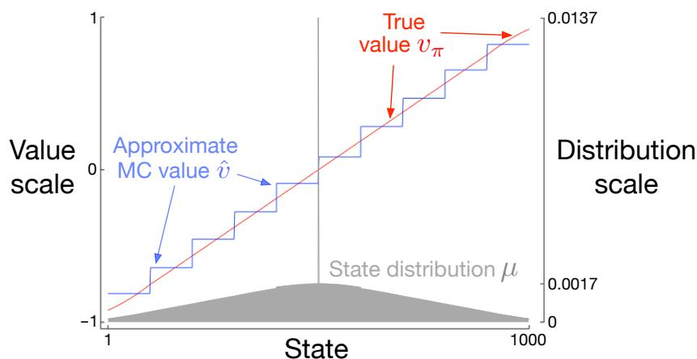  
Figure 9.1: Function approximation by state aggregation on the 1000-state random walk task, using the gradient Monte Carlo algorithm (page 202).

shown in the figure is typical of state aggregation; within each group, the approximate value is constant, and it changes abruptly from one group to the next. These approximate values are close to the global minimum of the  $\overline{\mathrm{VE}}$  (9.1).

Some of the details of the approximate values are best appreciated by reference to the state distribution  $\mu$  for this task, shown in the lower portion of the figure with a right- side scale. State 500, in the center, is the first state of every episode, but is rarely visited again. On average, about  $1.37\%$  of the time steps are spent in the start state. The states reachable in one step from the start state are the second most visited, with about  $0.17\%$  of the time steps being spent in each of them. From there  $\mu$  falls off almost linearly, reaching about  $0.0147\%$  at the extreme states 1 and 1000. The most visible effect of the distribution is on the leftmost groups, whose values are clearly shifted higher than the unweighted average of the true values of states within the group, and on the rightmost groups, whose values are clearly shifted lower. This is due to the states in these areas having the greatest asymmetry in their weightings by  $\mu$ . For example, in the leftmost group, state 100 is weighted more than 3 times more strongly than state 1. Thus the estimate for the group is based toward the true value of state 100, which is higher than the true value of state 1.

# 9.4 Linear Methods

One of the most important special cases of function approximation is that in which the approximate function,  $\hat{v} (\cdot ,\mathbf{w})$ , is a linear function of the weight vector,  $\mathbf{w}$ . Corresponding to every state  $s$ , there is a real- valued vector  $\mathbf{x}(s) \doteq (x_{1}(s), x_{2}(s), \ldots , x_{d}(s))^{\top}$ , with the same number of components as  $\mathbf{w}$ . Linear methods approximate the state- value function

by the inner product between  $\mathbf{w}$  and  $\mathbf{x}(s)$ :

$$
\hat{v} (s,\mathbf{w})\doteq \mathbf{w}^{\top}\mathbf{x}(s)\doteq \sum_{i = 1}^{d}w_{i}x_{i}(s). \tag{9.8}
$$

In this case the approximate value function is said to be linear in the weights, or simply linear.

The vector  $\mathbf{x}(s)$  is called a feature vector representing state  $s$ . Each component  $x_{i}(s)$  of  $\mathbf{x}(s)$  is the value of a function  $x_{i}:\mathcal{S}\rightarrow \mathbb{R}$ . We think of a feature as the entirety of one of these functions, and we call its value for a state  $s$  a feature of  $s$ . For linear methods, features are basis functions because they form a linear basis for the set of approximate functions. Constructing  $d$ - dimensional feature vectors to represent states is the same as selecting a set of  $d$  basis functions. Features may be defined in many different ways; we cover a few possibilities in the next sections.

It is natural to use SGD updates with linear function approximation. The gradient of the approximate value function with respect to  $\mathbf{w}$  in this case is

$$
\nabla \hat{v} (s,\mathbf{w}) = \mathbf{x}(s).
$$

Thus, in the linear case the general SGD update (9.7) reduces to a particularly simple form:

$$
\mathbf{w}_{t + 1}\doteq \mathbf{w}_t + \alpha \Big[U_t - \epsilon (S_t,\mathbf{w}_t)\Big]\mathbf{x}(S_t).
$$

Because it is so simple, the linear SGD case is one of the most favorable for mathematical analysis. Almost all useful convergence results for learning systems of all kinds are for linear (or simpler) function approximation methods.

In particular, in the linear case there is only one optimum (or, in degenerate cases, one set of equally good optima), and thus any method that is guaranteed to converge to or near a local optimum is automatically guaranteed to converge to or near the global optimum. For example, the gradient Monte Carlo algorithm presented in the previous section converges to the global optimum of the  $\overline{\mathrm{VE}}$  under linear function approximation if  $\alpha$  is reduced over time according to the usual conditions.

The semi- gradient  $\mathrm{TD}(0)$  algorithm presented in the previous section also converges under linear function approximation, but this does not follow from general results on SGD; a separate theorem is necessary. The weight vector converged to is also not the global optimum, but rather a point near the local optimum. It is useful to consider this important case in more detail, specifically for the continuing case. The update at each time  $t$  is

$$
\begin{array}{rl} & {\mathbf{w}_{t + 1}\doteq \mathbf{w}_t + \alpha \Big(R_{t + 1} + \gamma \mathbf{w}_t^{\top}\mathbf{x}_{t + 1} - \mathbf{w}_t^{\top}\mathbf{x}_t\Big)\mathbf{x}_t}\\ & {\qquad = \mathbf{w}_t + \alpha \Big(R_{t + 1}\mathbf{x}_t - \mathbf{x}_t\big(\mathbf{x}_t - \gamma \mathbf{x}_{t + 1}\big)^{\top}\mathbf{w}_t\Big),} \end{array} \tag{9.9}
$$

where here we have used the notational shorthand  $\mathbf{x}_t = \mathbf{x}(S_t)$ . Once the system has reached steady state, for any given  $\mathbf{w}_t$ , the expected next weight vector can be written

$$
\mathbb{E}[\mathbf{w}_{t + 1}|\mathbf{w}_t] = \mathbf{w}_t + \alpha (\mathbf{b} - \mathbf{A}\mathbf{w}_t), \tag{9.10}
$$

where

$$
\mathbf{b} \doteq \mathbb{E}[R_{t + 1} \mathbf{x}_t] \in \mathbb{R}^d \quad \text{and} \quad \mathbf{A} \doteq \mathbb{E}\left[\mathbf{x}_t \left(\mathbf{x}_t - \gamma \mathbf{x}_{t + 1}\right)^\top \right] \in \mathbb{R}^{d \times d} \tag{9.11}
$$

From (9.10) it is clear that, if the system converges, it must converge to the weight vector  $\mathbf{w}_{\mathrm{TD}}$  at which

$$
\begin{array}{r l} & {\mathbf{b} - \mathbf{A}\mathbf{w}_{\mathrm{TD}} = \mathbf{0}}\\ & {\Rightarrow \mathbf{b} = \mathbf{A}\mathbf{w}_{\mathrm{TD}}}\\ & {\Rightarrow \mathbf{w}_{\mathrm{TD}}\doteq \mathbf{A}^{-1}\mathbf{b}.} \end{array} \tag{9.12}
$$

This quantity is called the  $TD$  fixed point. In fact linear semi- gradient  $\mathrm{TD}(0)$  converges to this point. Some of the theory proving its convergence, and the existence of the inverse above, is given in the box.

# Proof of Convergence of Linear  $\mathrm{TD}(0)$

What properties assure convergence of the linear  $\mathrm{TD}(0)$  algorithm (9.9)? Some insight can be gained by rewriting (9.10) as

$$
\mathbb{E}[\mathbf{w}_{t + 1}|\mathbf{w}_t] = (\mathbf{I} - \alpha \mathbf{A})\mathbf{w}_t + \alpha \mathbf{b}. \tag{9.13}
$$

Note that the matrix  $\mathbf{A}$  multiplies the weight vector  $\mathbf{w}_t$  and not  $\mathbf{b}$ ; only  $\mathbf{A}$  is important to convergence. To develop intuition, consider the special case in which  $\mathbf{A}$  is a diagonal matrix. If any of the diagonal elements are negative, then the corresponding diagonal element of  $\mathbf{I} - \alpha \mathbf{A}$  will be greater than one, and the corresponding component of  $\mathbf{w}_t$  will be amplified, which will lead to divergence if continued. On the other hand, if the diagonal elements of  $\mathbf{A}$  are all positive, then  $\alpha$  can be chosen smaller than one over the largest of them, such that  $\mathbf{I} - \alpha \mathbf{A}$  is diagonal with all diagonal elements between 0 and 1. In this case the first term of the update tends to shrink  $\mathbf{w}_t$ , and stability is assured. In general,  $\mathbf{w}_t$  will be reduced toward zero whenever  $\mathbf{A}$  is positive definite, meaning  $y^\top \mathbf{A}y > 0$  for any real vector  $y \neq 0$ . Positive definiteness also ensures that the inverse  $\mathbf{A}^{- 1}$  exists.

For linear  $\mathrm{TD}(0)$ , in the continuing case with  $\gamma < 1$ , the  $\mathbf{A}$  matrix (9.11) can be written

$$
\begin{array}{l}{{\bf A} = \sum_{s}\mu (s)\sum_{a}\pi (a|s)\sum_{r,s^{\prime}}p(r,s^{\prime}|s,a){\bf x}(s)\big({\bf x}(s) - \gamma{\bf x}(s^{\prime})\big)^{\top}}\\ {= \sum_{s}\mu (s)\sum_{s^{\prime}}p(s^{\prime}|s){\bf x}(s)\big({\bf x}(s) - \gamma{\bf x}(s^{\prime})\big)^{\top}}\\ {= \sum_{s}\mu (s){\bf x}(s)\bigg({\bf x}(s) - \gamma \sum_{s^{\prime}}p(s^{\prime}|s){\bf x}(s^{\prime})\bigg)^{\top}}\\ {= {\bf X}^{\top}{\bf D}({\bf I} - \gamma{\bf P}){\bf X},} \end{array}
$$

where  $\mu (s)$  is the stationary distribution under  $\pi$ ,  $p(s' | s)$  is the probability of transition from  $s$  to  $s'$  under policy  $\pi$ ,  $\mathbf{P}$  is the  $|S| \times |S|$  matrix of these probabilities,

$\mathbf{D}$  is the  $|\mathcal{S}|\times |\mathcal{S}|$  diagonal matrix with the  $\mu (s)$  on its diagonal, and  $\mathbf{X}$  is the  $|\mathcal{S}|\times d$  matrix with  $\mathbf{x}(s)$  as its rows. From here it is clear that the inner matrix  $\mathbf{D}(\mathbf{I} - \gamma \mathbf{P})$  is key to determining the positive definiteness of  $\mathbf{A}$ .

For a key matrix of this form, positive definiteness is assured if all of its columns sum to a nonnegative number. This was shown by Sutton (1988, p. 27) based on two previously established theorems. One theorem says that any matrix  $\mathbf{M}$  is positive definite if and only if the symmetric matrix  $\mathbf{S} = \mathbf{M} + \mathbf{M}^{\top}$  is positive definite (Sutton 1988, appendix). The second theorem says that any symmetric real matrix  $\mathbf{S}$  is positive definite if all of its diagonal entries are positive and greater than the sum of the absolute values of the corresponding off- diagonal entries (Varga 1962, p. 23). For our key matrix,  $\mathbf{D}(\mathbf{I} - \gamma \mathbf{P})$ , the diagonal entries are positive and the off- diagonal entries are negative, so all we have to show is that each row sum plus the corresponding column sum is positive. The row sums are all positive because  $\mathbf{P}$  is a stochastic matrix and  $\gamma < 1$ . Thus it only remains to show that the column sums are nonnegative. Note that the row vector of the column sums of any matrix  $\mathbf{M}$  can be written as  $\mathbf{1}^{\top}\mathbf{M}$ , where  $\mathbf{1}$  is the column vector with all components equal to 1. Let  $\mu$  denote the  $|\mathcal{S}|$ - vector of the  $\mu (s)$ , where  $\mu = \mathbf{P}^{\top}\mu$  by virtue of  $\mu$  being the stationary distribution. The column sums of our key matrix, then, are:

$$
\begin{array}{rl}\mathbf{1}^{\top}\mathbf{D}(\mathbf{I} - \gamma \mathbf{P}) = \pmb{\mu}^{\top}(\mathbf{I} - \gamma \mathbf{P}) & \\ = \pmb{\mu}^{\top} - \gamma \pmb{\mu}^{\top}\mathbf{P} & \\ = \pmb{\mu}^{\top} - \gamma \pmb{\mu}^{\top} & \mathrm{(because~}\pmb {\mu}\mathrm{~is~the~stationary~distribution)}\\ = (1 - \gamma)\pmb{\mu}^{\top}, & \end{array}
$$

all components of which are positive. Thus, the key matrix and its  $\mathbf{A}$  matrix are positive definite, and on- policy  $\mathrm{TD}(0)$  is stable. (Additional conditions and a schedule for reducing  $\alpha$  over time are needed to prove convergence with probability one.)

At the TD fixed point, it has also been proven (in the continuing case) that the  $\overline{\mathrm{VE}}$  is within a bounded expansion of the lowest possible error:

$$
\overline{\mathrm{VE}} (\mathbf{w}_{\mathrm{TD}})\leq \frac{1}{1 - \gamma}\min_{\mathbf{w}}\overline{\mathrm{VE}} (\mathbf{w}). \tag{9.14}
$$

That is, the asymptotic error of the TD method is no more than  $\frac{1}{1 - \gamma}$  times the smallest possible error, that attained in the limit by the Monte Carlo method. Because  $\gamma$  is often near one, this expansion factor can be quite large, so there is substantial potential loss in asymptotic performance with the TD method. On the other hand, recall that the TD methods are often of vastly reduced variance compared to Monte Carlo methods, and thus faster, as we saw in Chapters 6 and 7. Which method will be best depends on the nature of the approximation and problem, and on how long learning continues.

A bound analogous to (9.14) applies to other on- policy bootstrapping methods as well. For example, linear semi- gradient DP (Eq. 9.7 with  $U_{t} \doteq \sum_{a} \pi (a|S_{t}) \sum_{s^{\prime} s} p(s^{\prime}, r|S_{t}, a) [r + \gamma \hat{v} (s^{\prime}, \mathbf{w}_{t})]$ ) with updates according to the on- policy distribution will also converge to the TD fixed point. One- step semi- gradient action- value methods, such as semi- gradient Sarsa(0) covered in the next chapter converge to an analogous fixed point and an analogous bound. For episodic tasks, there is a slightly different but related bound (see Bertsekas and Tsitsiklis, 1996). There are also a few technical conditions on the rewards, features, and decrease in the step- size parameter, which we have omitted here. The full details can be found in the original paper (Tsitsiklis and Van Roy, 1997).

Critical to these convergence results is that states are updated according to the on- policy distribution. For other update distributions, bootstrapping methods using function approximation may actually diverge to infinity. Examples of this and a discussion of possible solution methods are given in Chapter 11.

Example 9.2: Bootstrapping on the 1000- state Random Walk State aggregation is a special case of linear function approximation, so let's return to the 1000- state random walk to illustrate some of the observations made in this chapter. The left panel of Figure 9.2 shows the final value function learned by the semi- gradient TD(0) algorithm (page 203) using the same state aggregation as in Example 9.1. We see that the near- asymptotic TD approximation is indeed farther from the true values than the Monte Carlo approximation shown in Figure 9.1.

Nevertheless, TD methods retain large potential advantages in learning rate, and generalize Monte Carlo methods, as we investigated fully with  $n$ - step TD methods in Chapter 7. The right panel of Figure 9.2 shows results with an  $n$ - step semi- gradient TD method using state aggregation on the 1000- state random walk that are strikingly similar to those we obtained earlier with tabular methods and the 19- state random walk (Figure 7.2). To obtain such quantitatively similar results we switched the state aggregation to 20 groups of 50 states each. The 20 groups were then quantitatively close

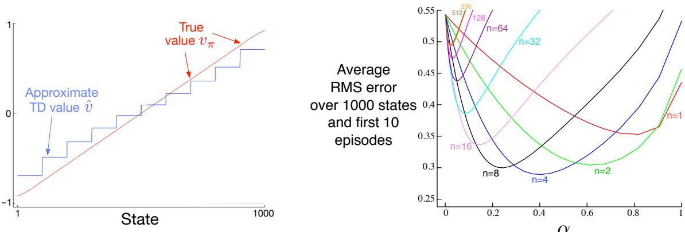  
Figure 9.2: Bootstrapping with state aggregation on the 1000-state random walk task. Left: Asymptotic values of semi-gradient TD are worse than the asymptotic Monte Carlo values in Figure 9.1. Right: Performance of  $n$ -step methods with state-aggregation are strikingly similar to those with tabular representations (cf. Figure 7.2). These data are averages over 100 runs.

to the 19 states of the tabular problem. In particular, recall that state transitions were up to 100 states to the left or right. A typical transition would then be of 50 states to the right or left, which is quantitatively analogous to the single- state state transitions of the 19- state tabular system. To complete the match, we use here the same performance measure—an unweighted average of the RMS error over all states and over the first 10 episodes—rather than a VE objective as is otherwise more appropriate when using function approximation.

The semi- gradient  $n$ - step TD algorithm used in the example above is the natural extension of the tabular  $n$ - step TD algorithm presented in Chapter 7 to semi- gradient function approximation. Pseudocode is given in the box below.

# $n$ -step semi-gradient TD for estimating  $\hat{v} \approx v_{\pi}$

Input: the policy  $\pi$  to be evaluated

Input: a differentiable function  $\hat{v}: \mathbb{S}^{+} \times \mathbb{R}^{d} \to \mathbb{R}$  such that  $\hat{v} (\text{terminal}, \cdot) = 0$

Algorithm parameters: step size  $\alpha > 0$ , a positive integer  $n$

Initialize value- function weights  $\mathbf{w}$  arbitrarily (e.g.,  $\mathbf{w} = \mathbf{0}$

All store and access operations ( $S_{t}$  and  $R_{t}$ ) can take their index mod  $n + 1$

Loop for each episode:

Initialize and store  $S_{0} \neq$  terminal

$T \leftarrow \infty$

Loop for  $t = 0, 1, 2, \ldots$

If  $t < T$ , then:

Take an action according to  $\pi (\cdot | S_{t})$

Observe and store the next reward as  $R_{t + 1}$  and the next state as  $S_{t + 1}$

If  $S_{t + 1}$  is terminal, then  $T \leftarrow t + 1$

$\tau \leftarrow t - n + 1$  ( $\tau$  is the time whose state's estimate is being updated)

If  $\tau \geq 0$

$$
G \leftarrow \sum_{i = \tau + 1}^{\min (\tau + n, T)} \gamma^{i - \tau - 1} R_{i}
$$

If  $\tau + n < T$ , then:  $G \leftarrow G + \gamma^{n} \hat{v} (S_{\tau + n}, \mathbf{w})$

$\mathbf{w} \leftarrow \mathbf{w} + \alpha \left[ G - \hat{v} (S_{\tau}, \mathbf{w}) \right] \nabla \hat{v} (S_{\tau}, \mathbf{w})$

Until  $\tau = T - 1$

The key equation of this algorithm, analogous to (7.2), is

$$
\mathbf{w}_{t + n} \doteq \mathbf{w}_{t + n - 1} + \alpha \left[ G_{t:t + n} - \hat{v} (S_{t}, \mathbf{w}_{t + n - 1}) \right] \nabla \hat{v} (S_{t}, \mathbf{w}_{t + n - 1}), \qquad 0 \leq t < T, \tag{9.15}
$$

where the  $n$ - step return is generalized from (7.1) to

$$
G_{t:t + n} \doteq R_{t + 1} + \gamma R_{t + 2} + \dots + \gamma^{n - 1} R_{t + n} + \gamma^{n} \hat{v} (S_{t + n}, \mathbf{w}_{t + n - 1}), \quad 0 \leq t \leq T - n. \tag{9.16}
$$

Exercise 9.1 Show that tabular methods such as presented in Part I of this book are a special case of linear function approximation. What would the feature vectors be?

# 9.5 Feature Construction for Linear Methods

Linear methods are interesting because of their convergence guarantees, but also because in practice they can be very efficient in terms of both data and computation. Whether or not this is so depends critically on how the states are represented in terms of features, which we investigate in this large section. Choosing features appropriate to the task is an important way of adding prior domain knowledge to reinforcement learning systems. Intuitively, the features should correspond to the aspects of the state space along which generalization may be appropriate. If we are valuing geometric objects, for example, we might want to have features for each possible shape, color, size, or function. If we are valuing states of a mobile robot, then we might want to have features for locations, degrees of remaining battery power, recent sonar readings, and so on.

A limitation of the linear form is that it cannot take into account any interactions between features, such as the presence of feature  $i$  being good only in the absence of feature  $j$  . For example, in the pole- balancing task (Example 3.4), high angular velocity can be either good or bad depending on the angle. If the angle is high, then high angular velocity means an imminent danger of falling a bad state- whereas if the angle is low, then high angular velocity means the pole is righting itself a good state. A linear value function could not represent this if its features coded separately for the angle and the angular velocity. It needs instead, or in addition, features for combinations of these two underlying state dimensions. In the following subsections we consider a variety of general ways of doing this.

# 9.5.1 Polynomials

The states of many problems are initially expressed as numbers, such as positions and velocities in the pole- balancing task (Example 3.4), the number of cars in each lot in the Jack's car rental problem (Example 4.2), or the gambler's capital in the gambler problem (Example 4.3). In these types of problems, function approximation for reinforcement learning has much in common with the familiar tasks of interpolation and regression. Various families of features commonly used for interpolation and regression can also be used in reinforcement learning. Polynomials make up one of the simplest families of features used for interpolation and regression. While the basic polynomial features we discuss here do not work as well as other types of features in reinforcement learning, they serve as a good introduction because they are simple and familiar.

As an example, suppose a reinforcement learning problem has states with two numerical dimensions. For a single representative state  $s$  , let its two numbers be  $s_{1}\in \mathbb{R}$  and  $s_{2}\in \mathbb{R}$  You might choose to represent  $s$  simply by its two state dimensions, so that  $\mathbf{x}(s) =$ $(s_{1},s_{2})^{\top}$  , but then you would not be able to take into account any interactions between these dimensions. In addition, if both  $s_{1}$  and  $s_{2}$  were zero, then the approximate value would have to also be zero. Both limitations can be overcome by instead representing  $s$  by the four- dimensional feature vector  $\mathbf{x}(s) = (1,s_{1},s_{2},s_{1}s_{2})^{\top}$  . The initial 1 feature allows the representation of affine functions in the original state numbers, and the final product feature,  $s_{1}s_{2}$  , enables interactions to be taken into account. Or you might choose to use higher- dimensional feature vectors like  $\mathbf{x}(s) = (1,s_{1},s_{2},s_{1}s_{2},s_{1}^{2},s_{2}^{2},s_{1}s_{2}^{2},s_{1}^{2}s_{2},s_{1}^{2}s_{2}^{2})^{\top}$  to

take more complex interactions into account. Such feature vectors enable approximations as arbitrary quadratic functions of the state numbers—even though the approximation is still linear in the weights that have to be learned. Generalizing this example from two to  $k$  numbers, we can represent highly- complex interactions among a problem's state dimensions:

Suppose each state  $s$  corresponds to  $k$  numbers,  $s_1, s_2, \ldots , s_k$ , with each  $s_i \in \mathbb{R}$ . For this  $k$ - dimensional state space, each order-  $n$  polynomial- basis feature  $x_i$  can be written as

$$
x_{i}(s) = \Pi_{j = 1}^{k}s_{j}^{c_{i,j}}, \tag{9.17}
$$

where each  $c_{i,j}$  is an integer in the set  $\{0,1,\ldots ,n\}$  for an integer  $n\geq 0$  . These features make up the order-  $n$  polynomial basis for dimension  $k$  , which contains  $(n + 1)^{k}$  different features.

Higher- order polynomial bases allow for more accurate approximations of more complicated functions. But because the number of features in an order-  $n$  polynomial basis grows exponentially with the dimension  $k$  of the natural state space (if  $n > 0$ ), it is generally necessary to select a subset of them for function approximation. This can be done using prior beliefs about the nature of the function to be approximated, and some automated selection methods developed for polynomial regression can be adapted to deal with the incremental and nonstationary nature of reinforcement learning.

Exercise 9.2 Why does (9.17) define  $(n + 1)^k$  distinct features for dimension  $k$ ?

Exercise 9.3 What  $n$  and  $c_{i,j}$  produce the feature vectors  $\mathbf{x}(s) = (1, s_1, s_2, s_1 s_2, s_1^2, s_2^2, s_1 s_2^2, s_1^2 s_2, s_1^2 s_2^2)^\top$ ?

# 9.5.2 Fourier Basis

Another linear function approximation method is based on the time- honored Fourier series, which expresses periodic functions as weighted sums of sine and cosine basis functions (features) of different frequencies. (A function  $f$  is periodic if  $f(x) = f(x + \tau)$  for all  $x$  and some period  $\tau$ .) The Fourier series and the more general Fourier transform are widely used in applied sciences in part because if a function to be approximated is known, then the basis function weights are given by simple formulae and, further, with enough basis functions essentially any function can be approximated as accurately as desired. In reinforcement learning, where the functions to be approximated are unknown, Fourier basis functions are of interest because they are easy to use and can perform well in a range of reinforcement learning problems.

First consider the one- dimensional case. The usual Fourier series representation of a function of one dimension having period  $\tau$  represents the function as a linear combination of sine and cosine functions that are each periodic with periods that evenly divide  $\tau$  (in other words, whose frequencies are integer multiples of a fundamental frequency  $1 / \tau$ ). But if you are interested in approximating an aperiodic function defined over a bounded

interval, then you can use these Fourier basis features with  $\tau$  set to the length of the interval. The function of interest is then just one period of the periodic linear combination of the sine and cosine features.

Furthermore, if you set  $\tau$  to twice the length of the interval of interest and restrict attention to the approximation over the half interval  $[0, \tau /2]$ , then you can use just the cosine features. This is possible because you can represent any even function, that is, any function that is symmetric about the origin, with just the cosine basis. So any function over the half- period  $[0, \tau /2]$  can be approximated as closely as desired with enough cosine features. (Saying "any function" is not exactly correct because the function has to be mathematically well- behaved, but we skip this technicality here.) Alternatively, it is possible to use just sine features, linear combinations of which are always odd functions, that is functions that are anti- symmetric about the origin. But it is generally better to keep just the cosine features because "half- even" functions tend to be easier to approximate than "half- odd" functions because the latter are often discontinuous at the origin. Of course, this does not rule out using both sine and cosine features to approximate over the interval  $[0, \tau /2]$ , which might be advantageous in some circumstances.

Following this logic and letting  $\tau = 2$  so that the features are defined over the half-  $\tau$  interval  $[0,1]$ , the one- dimensional order-  $n$  Fourier cosine basis consists of the  $n + 1$  features

$$
x_{i}(s) = \cos (i\pi s), s \in [0,1],
$$

for  $i = 0, \ldots , n$ . Figure 9.3 shows one- dimensional Fourier cosine features  $x_{i}$ , for  $i = 1, 2, 3, 4$ ;  $x_{0}$  is a constant function.

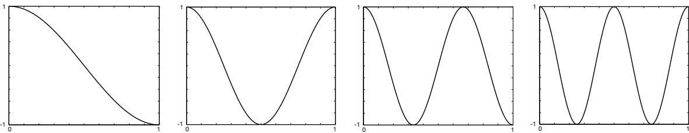  
Figure 9.3: One-dimensional Fourier cosine-basis features  $x_{i}$ ,  $i = 1, 2, 3, 4$ , for approximating functions over the interval  $[0, 1]$ . After Konidaris et al. (2011).

This same reasoning applies to the Fourier cosine series approximation in the multidimensional case as described in the box below.

Suppose each state  $s$  corresponds to a vector of  $k$  numbers,  $\mathbf{s} = (s_{1}, s_{2}, \ldots , s_{k})^{\top}$ , with each  $s_{i} \in [0, 1]$ . The  $i$ th feature in the order-  $n$  Fourier cosine basis can then be written

$$
x_{i}(s) = \cos \left(\pi \mathbf{s}^{\top} \mathbf{c}^{i}\right), \tag{9.18}
$$

where  $\mathbf{c}^{i} = (c_{1}^{i}, \ldots , c_{k}^{i})^{\top}$ , with  $c_{j}^{i} \in \{0, \ldots , n\}$  for  $j = 1, \ldots , k$  and  $i = 1, \ldots , (n + 1)^{k}$ . This defines a feature for each of the  $(n + 1)^{k}$  possible integer vectors  $\mathbf{c}^{i}$ . The inner

product  $\mathbf{s}^{\top}\mathbf{c}^{i}$  has the effect of assigning an integer in  $\{0,\ldots ,n\}$  to each dimension of  $\mathbf{s}$ . As in the one- dimensional case, this integer determines the feature's frequency along that dimension. The features can of course be shifted and scaled to suit the bounded state space of a particular application.

As an example, consider the  $k = 2$  case in which  $\mathbf{s} = (s_{1},s_{2})^{\top}$ , where each  $\mathbf{c}^{i} = (c_{1}^{i},c_{2}^{i})^{\top}$ . Figure 9.4 shows a selection of six Fourier cosine features, each labeled by the vector  $\mathbf{c}^{i}$  that defines it ( $s_{1}$  is the horizontal axis and  $\mathbf{c}^{i}$  is shown as a row vector with the index  $i$  omitted). Any zero in  $\mathbf{c}$  means the feature is constant along that state dimension. So if  $\mathbf{c} = (0,0)^{\top}$ , the feature is constant over both dimensions; if  $\mathbf{c} = (c_{1},0)^{\top}$  the feature is constant over the second dimension and varies over the first with frequency depending on  $c_{1}$ ; and similarly, for  $\mathbf{c} = (0,c_{2})^{\top}$ . When  $\mathbf{c} = (c_{1},c_{2})^{\top}$  with neither  $c_{j} = 0$ , the feature varies along both dimensions and represents an interaction between the two state variables. The values of  $c_{1}$  and  $c_{2}$  determine the frequency along each dimension, and their ratio gives the direction of the interaction.

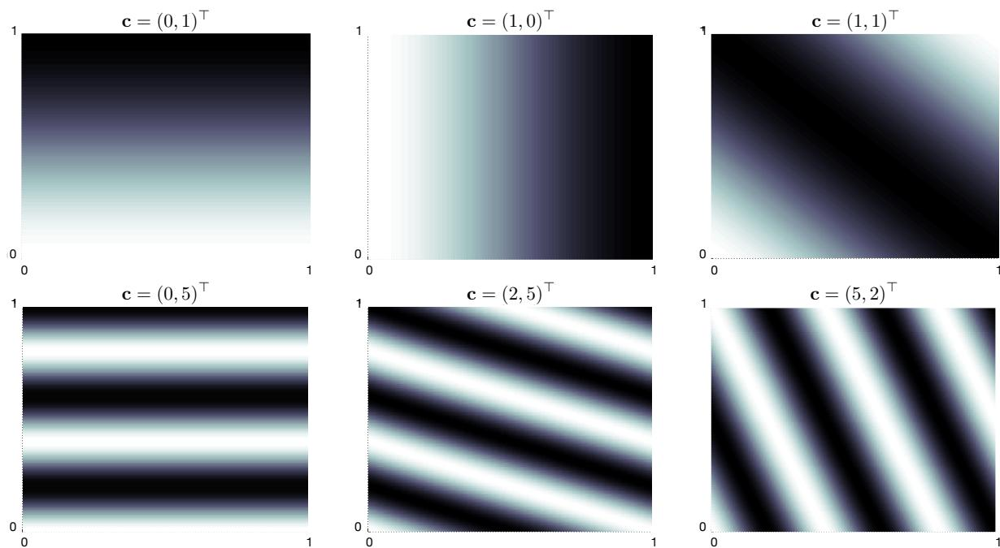  
Figure 9.4: A selection of six two-dimensional Fourier cosine features, each labeled by the vector  $\mathbf{c}^{i}$  that defines it ( $s_{1}$  is the horizontal axis, and  $\mathbf{c}^{i}$  is shown with the index  $i$  omitted). After Konidaris et al. (2011).

When using Fourier cosine features with a learning algorithm such as (9.7), semigradient  $\mathrm{TD}(0)$ , or semi- gradient Sarsa, it may be helpful to use a different step- size parameter for each feature. If  $\alpha$  is the basic step- size parameter, then Konidaris, Osentoski, and Thomas (2011) suggest setting the step- size parameter for feature  $x_{i}$  to  $\alpha_{i} = \alpha /\sqrt{(c_{1}^{i})^{2} + \cdots + (c_{k}^{i})^{2}}$  (except when each  $c_{j}^{i} = 0$ , in which case  $\alpha_{i} = \alpha$ ).

Fourier cosine features with Sarsa can produce good performance compared to several other collections of basis functions, including polynomial and radial basis functions. Not surprisingly, however, Fourier features have trouble with discontinuities because it is difficult to avoid "ringing" around points of discontinuity unless very high frequency basis functions are included.

The number of features in the order-  $n$  Fourier basis grows exponentially with the dimension of the state space, but if that dimension is small enough (e.g.,  $k \leq 5$ ), then one can select  $n$  so that all of the order-  $n$  Fourier features can be used. This makes the selection of features more or less automatic. For high dimension state spaces, however, it is necessary to select a subset of these features. This can be done using prior beliefs about the nature of the function to be approximated, and some automated selection methods can be adapted to deal with the incremental and nonstationary nature of reinforcement learning. An advantage of Fourier basis features in this regard is that it is easy to select features by setting the  $\mathbf{c}^i$  vectors to account for suspected interactions among the state variables and by limiting the values in the  $\mathbf{c}^j$  vectors so that the approximation can filter out high frequency components considered to be noise. On the other hand, because Fourier features are non- zero over the entire state space (with the few zeros excepted), they represent global properties of states, which can make it difficult to find good ways to represent local properties.

Figure 9.5 shows learning curves comparing the Fourier and polynomial bases on the 1000- state random walk example. In general, we do not recommend using polynomials for online learning. $^2$

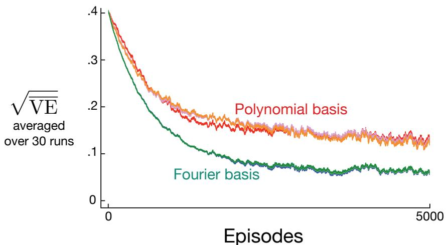  
Figure 9.5: Fourier basis vs polynomials on the 1000-state random walk. Shown are learning curves for the gradient Monte Carlo method with Fourier and polynomial bases of order 5, 10, and 20. The step-size parameters were roughly optimized for each case:  $\alpha = 0.0001$  for the polynomial basis and  $\alpha = 0.00005$  for the Fourier basis. The performance measure (y-axis) is the root mean square value error (9.1).

# 9.5.3 Coarse Coding

Consider a task in which the natural representation of the state set is a continuous twodimensional space. One kind of representation for this case is made up of features corresponding to circles in state space, as shown to the right. If the state is inside a circle, then the corresponding feature has the value 1 and is said to be present; otherwise the feature is 0 and is said to be absent. This kind of 1- 0- valued feature is called a binary feature. Given a state, which binary features are present indicate within which circles the state lies, and thus coarsely code for its location. Representing a state with features that overlap in this way (although they need not be circles or binary) is known as coarse coding.

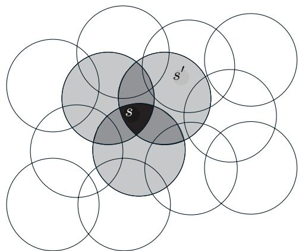

Assuming linear gradient- descent function approximation, consider the effect of the size and density of the circles. Corresponding to each circle is a single weight (a component of  $\mathbf{w}$  ) that is affected by learning. If we train at one state, a point in the space, then the weights of all circles

Figure 9.6: Coarse coding. Generalization from state  $s$  to state  $s^{\prime}$  depends on the number of their features whose receptive fields (in this case, circles) overlap. These states have one feature in common, so there will be slight generalization between them.

intersecting that state will be affected. Thus, by (9.8), the approximate value function will be affected at all states within the union of the circles, with a greater effect the more circles a point has "in common" with the state, as shown in Figure 9.6. If the circles are small, then the generalization will be over a short distance, as in Figure 9.7 (left), whereas if they are large, it will be over a large distance, as in Figure 9.7 (middle). Moreover,

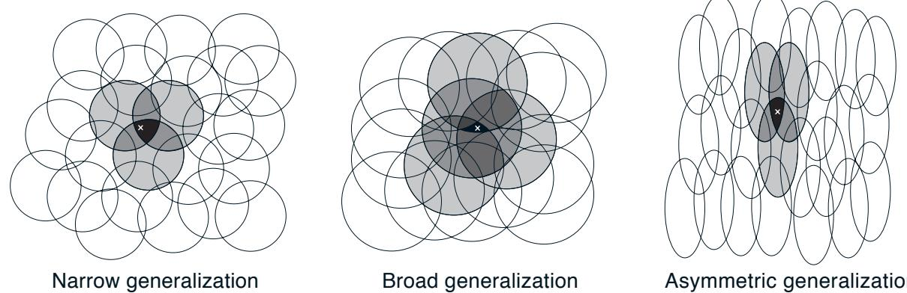  
Figure 9.7: Generalization in linear function approximation methods is determined by the sizes and shapes of the features' receptive fields. All three of these cases have roughly the same number and density of features.

the shape of the features will determine the nature of the generalization. For example, if they are not strictly circular, but are elongated in one direction, then generalization will be similarly affected, as in Figure 9.7 (right).

Features with large receptive fields give broad generalization, but might also seem to limit the learned function to a coarse approximation, unable to make discriminations much finer than the width of the receptive fields. Happily, this is not the case. Initial generalization from one point to another is indeed controlled by the size and shape of the receptive fields, but actually, the finest discrimination ultimately possible, is controlled more by the total number of features.

Example 9.3: Coarseness of Coarse Coding This example illustrates the effect on learning of the size of the receptive fields in coarse coding. Linear function approximation based on coarse coding and (9.7) was used to learn a one- dimensional square- wave function (shown at the top of Figure 9.8). The values of this function were used as the targets,  $U_{t}$ . With just one dimension, the receptive fields were intervals rather than circles. Learning was repeated with three different sizes of the intervals: narrow, medium, and broad, as shown at the bottom of the figure. All three cases had the same density of features, about 50 over the extent of the function being learned. Training examples were generated uniformly at random over this extent. The step- size parameter was  $\alpha = \frac{0.2}{n}$ , where  $n$  is the number of features that were present at one time. Figure 9.8 shows the functions learned in all three cases over the course of learning. Note that the width of the features had a strong effect early in learning. With broad features, the generalization tended to be broad; with narrow features, only the close neighbors of each trained point were changed, causing the function learned to be more bumpy. However, the final function learned was affected only slightly by the width of the features. Receptive field shape tends to have a strong effect on generalization but little effect on asymptotic solution quality.

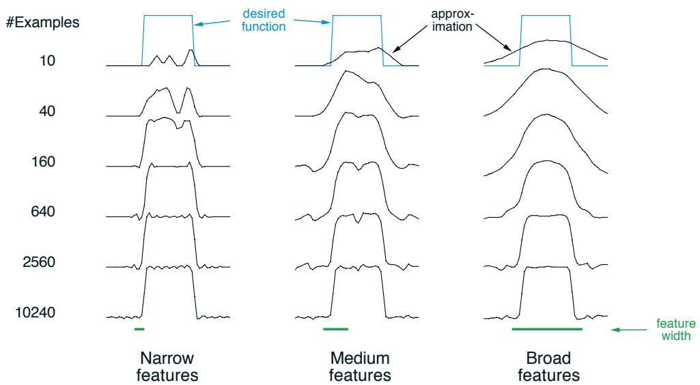  
Figure 9.8: Example of feature width's strong effect on initial generalization (first row) and weak effect on asymptotic accuracy (last row).

# 9.5.4 Tile Coding

Tile coding is a form of coarse coding for multi- dimensional continuous spaces that is flexible and computationally efficient. It may be the most practical feature representation for modern sequential digital computers.

In the coding the receptive fields of the features are grouped into partitions of the state space. Each such partition is called a tiling, and each element of the partition is called a tile. For example, the simplest tiling of a two- dimensional state space is a uniform grid such as that shown on the left side of Figure 9.9. The tiles or receptive field here are squares rather than the circles in Figure 9.6. If just this single tiling were used, then the state indicated by the white spot would be represented by the single feature whose tile it falls within; generalization would be complete to all states within the same tile and nonexistent to states outside it. With just one tiling, we would not have coarse coding but just a case of state aggregation.

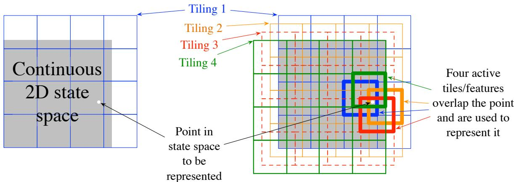  
Figure 9.9: Multiple, overlapping grid-tilings on a limited two-dimensional space. These tilings are offset from one another by a uniform amount in each dimension.

To get the strengths of coarse coding requires overlapping receptive fields, and by definition the tiles of a partition do not overlap. To get true coarse coding with tile coding, multiple tilings are used, each offset by a fraction of a tile width. A simple case with four tilings is shown on the right side of Figure 9.9. Every state, such as that indicated by the white spot, falls in exactly one tile in each of the four tilings. These four tiles correspond to four features that become active when the state occurs. Specifically, the feature vector  $\mathbf{x}(s)$  has one component for each tile in each tiling. In this example there are  $4 \times 4 \times 4 = 64$  components, all of which will be 0 except for the four corresponding to the tiles that  $s$  falls within. Figure 9.10 shows the advantage of multiple offset tilings (coarse coding) over a single tiling on the 1000- state random walk example.

An immediate practical advantage of tile coding is that, because it works with partitions, the overall number of features that are active at one time is the same for any state. Exactly one feature is present in each tiling, so the total number of features present is always the same as the number of tilings. This allows the step- size parameter,  $\alpha$ , to

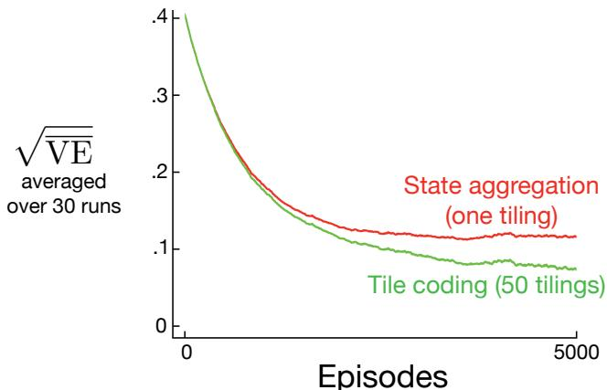  
Figure 9.10: Why we use coarse coding. Shown are learning curves on the 1000-state random walk example for the gradient Monte Carlo algorithm with a single tiling and with multiple tilings. The space of 1000 states was treated as a single continuous dimension, covered with tiles each 200 states wide. The multiple tilings were offset from each other by 4 states. The step-size parameter was set so that the initial learning rate in the two cases was the same,  $\alpha = 0.0001$  for the single tiling and  $\alpha = 0.0001 / 50$  for the 50 tilings.

be set in an easy, intuitive way. For example, choosing  $\alpha = \frac{1}{s}$ , where  $n$  is the number of tilings, results in exact one- trial learning. If the example  $s \mapsto v$  is trained on, then whatever the prior estimate,  $\hat{v} (s, \mathbf{w}_t)$ , the new estimate will be  $\hat{v} (s, \mathbf{w}_{t + 1}) = v$ . Usually one wishes to change more slowly than this, to allow for generalization and stochastic variation in target outputs. For example, one might choose  $\alpha = \frac{1}{10n}$ , in which case the estimate for the trained state would move one- tenth of the way to the target in one update, and neighboring states will be moved less, proportional to the number of tiles they have in common.

Tile coding also gains computational advantages from its use of binary feature vectors. Because each component is either 0 or 1, the weighted sum making up the approximate value function (9.8) is almost trivial to compute. Rather than performing  $d$  multiplications and additions, one simply computes the indices of the  $n \ll d$  active features and then adds up the  $n$  corresponding components of the weight vector.

Generalization occurs to states other than the one trained if those states fall within any of the same tiles, proportional to the number of tiles in common. Even the choice of how to offset the tilings from each other affects generalization. If they are offset uniformly in each dimension, as they were in Figure 9.9, then different states can generalize in qualitatively different ways, as shown in the upper half of Figure 9.11. Each of the eight subfigures show the pattern of generalization from a trained state to nearby points. In this example there are eight tilings, thus 64 subregions within a tile that generalize distinctly, but all according to one of these eight patterns. Note how uniform offsets result in a strong effect along the diagonal in many patterns. These artifacts can be avoided if the tilings are offset asymmetrically, as shown in the lower half of the figure. These lower generalization patterns are better because they are all well centered on the trained state with no obvious asymmetries.

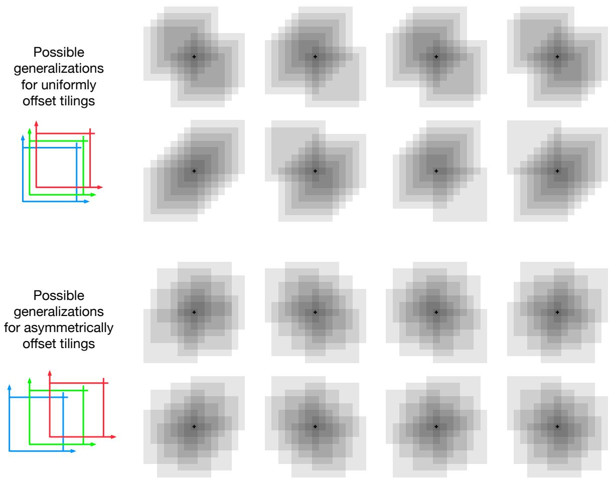  
Figure 9.11: Why tile asymmetrical offsets are preferred in tile coding. Shown is the strength of generalization from a trained state, indicated by the small black plus, to nearby states, for the case of eight tilings. If the tilings are uniformly offset (above), then there are diagonal artifacts and substantial variations in the generalization, whereas with asymmetrically offset tilings the generalization is more spherical and homogeneous.

Tilings in all cases are offset from each other by a fraction of a tile width in each dimension. If  $w$  denotes the tile width and  $n$  the number of tilings, then  $\frac{w}{n}$  is a fundamental unit. Within small squares  $\frac{w}{n}$  on a side, all states activate the same tiles, have the same feature representation, and the same approximated value. If a state is moved by  $\frac{w}{n}$  in any cartesian direction, the feature representation changes by one component/tile. Uniformly offset tilings are offset from each other by exactly this unit distance. For a two- dimensional space, we say that each tiling is offset by the displacement vector  $(1,1)$ , meaning that it is offset from the previous tiling by  $\frac{w}{n}$  times this vector. In these terms, the asymmetrically offset tilings shown in the lower part of Figure 9.11 are offset by a displacement vector of  $(1,3)$ .

Extensive studies have been made of the effect of different displacement vectors on the generalization of tile coding (Parks and Militzer, 1991; An, 1991; An, Miller and Parks,

1991; Miller, An, Glanz and Carter, 1990), assessing their homegeneity and tendency toward diagonal artifacts like those seen for the  $(1,1)$  displacement vectors. Based on this work, Miller and Glanz (1996) recommend using displacement vectors consisting of the first odd integers. In particular, for a continuous space of dimension  $k$ , a good choice is to use the first odd integers  $(1,3,5,7,\ldots ,2k - 1)$ , with  $n$  (the number of tilings) set to an integer power of 2 greater than or equal to  $4k$ . This is what we have done to produce the tilings in the lower half of Figure 9.11, in which  $k = 2$ ,  $n = 2^{3} \geq 4k$ , and the displacement vector is  $(1,3)$ . In a three- dimensional case, the first four tilings would be offset in total from a base position by  $(0,0,0)$ ,  $(1,3,5)$ ,  $(2,6,10)$ , and  $(3,9,15)$ . Open- source software that can efficiently make tilings like this for any  $k$  is readily available.

In choosing a tiling strategy, one has to pick the number of the tilings and the shape of the tiles. The number of tilings, along with the size of the tiles, determines the resolution or fineness of the asymptotic approximation, as in general coarse coding and illustrated in Figure 9.8. The shape of the tiles will determine the nature of generalization as in Figure 9.7. Square tiles will generalize roughly equally in each dimension as indicated in Figure 9.11 (lower). Tiles that are elongated along one dimension, such as the stripe tilings in Figure 9.12 (middle), will promote generalization along that dimension. The tilings in Figure 9.12 (middle) are also denser and thinner on the left, promoting discrimination along the horizontal dimension at lower values along that dimension. The diagonal stripe tiling in Figure 9.12 (right) will promote generalization along one diagonal. In higher dimensions, axis- aligned stripes correspond to ignoring some of the dimensions in some of the tilings, that is, to hyperplanar slices. Irregular tilings such as shown in Figure 9.12 (left) are also possible, though rare in practice and beyond the standard software.

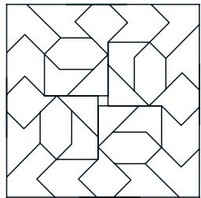  
Irregular

  
Log stripes

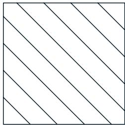  
Diagonal stripes  Figure 9.12: Tilings need not be grids. They can be arbitrarily shaped and non-uniform, while still in many cases being computationally efficient to compute.

In practice, it is often desirable to use different shaped tiles in different tilings. For example, one might use some vertical stripe tilings and some horizontal stripe tilings. This would encourage generalization along either dimension. However, with stripe tilings alone it is not possible to learn that a particular conjunction of horizontal and vertical coordinates has a distinctive value (whatever is learned for it will bleed into states with the same horizontal and vertical coordinates). For this one needs the conjunctive rectangular tiles such as originally shown in Figure 9.9. With multiple tilings—some horizontal, some vertical, and some conjunctive—one can get everything: a preference for generalizing along each dimension, yet the ability to learn specific values for conjunctions (see Sutton,

1996 for examples). The choice of tilings determines generalization, and until this choice can be effectively automated, it is important that tile coding enables the choice to be made flexibly and in a way that makes sense to people.

Another useful trick for reducing memory requirements is hashing—a consistent pseudorandom collapsing of a large tiling into a much smaller set of tiles. Hashing produces tiles consisting of noncontiguous, disjoint regions randomly spread throughout the state space, but that still form an exhaustive partition. For example,

one tile might consist of the four subtiles shown to the right. Through hashing, memory requirements are often reduced by large factors with little loss of performance. This is possible because high resolution is needed in only a small fraction of the state space. Hashing frees us from the curse of dimensionality in the sense that memory requirements need not be exponential in the number of dimensions, but need merely match the real demands of the task. Open- source implementations of tile coding commonly include efficient hashing.

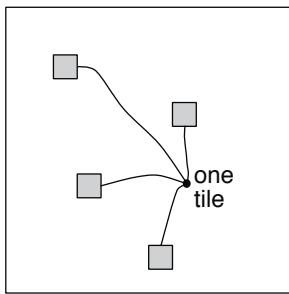

Exercise 9.4 Suppose we believe that one of two state dimensions is more likely to have an effect on the value function than is the other, that generalization should be primarily across this dimension rather than along it. What kind of tilings could be used to take advantage of this prior knowledge?

# 9.5.5 Radial Basis Functions

Radial basis functions (RBFs) are the natural generalization of coarse coding to continuous- valued features. Rather than each feature being either 0 or 1, it can be anything in the interval  $[0,1]$ , reflecting various degrees to which the feature is present. A typical RBF feature,  $x_{i}$ , has a Gaussian (bell- shaped) response  $x_{i}(s)$  dependent only on the distance between the state,  $s$ , and the feature's prototypical or center state,  $c_{i}$ , and relative to the feature's width,  $\sigma_{i}$ .

$$
x_{i}(s) \doteq \exp \left(-\frac{||s - c_{i}||^{2}}{2\sigma_{i}^{2}}\right).
$$

The norm or distance metric of course can be chosen in whatever way seems most appropriate to the states and task at hand. The figure below shows a one- dimensional example with a Euclidean distance metric.

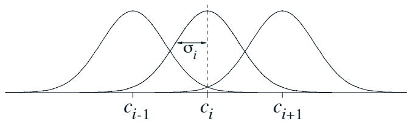  
Figure 9.13: One-dimensional radial basis functions.

The primary advantage of RBFs over binary features is that they produce approximate functions that vary smoothly and are differentiable. Although this is appealing, in most cases it has no practical significance. Nevertheless, extensive studies have been made of graded response functions such as RBFs in the context of tile coding (An, 1991; Miller et al., 1991; An et al., 1991; Lane, Handelman and Gelfand, 1992). All of these methods require substantial additional computational complexity (over tile coding) and often reduce performance when there are more than two state dimensions. In high dimensions the edges of tiles are much more important, and it has proven difficult to obtain well controlled graded tile activations near the edges.

An RBF network is a linear function approximator using RBFs for its features. Learning is defined by equations (9.7) and (9.8), exactly as in other linear function approximators. In addition, some learning methods for RBF networks change the centers and widths of the features as well, bringing them into the realm of nonlinear function approximators. Nonlinear methods may be able to fit target functions much more precisely. The downside to RBF networks, and to nonlinear RBF networks especially, is greater computational complexity and, often, more manual tuning before learning is robust and efficient.

# 9.6 Selecting Step-Size Parameters Manually

Most SGD methods require the designer to select an appropriate step- size parameter  $\alpha$ . Ideally this selection would be automated, and in some cases it has been, but for most cases it is still common practice to set it manually. To do this, and to better understand the algorithms, it is useful to develop some intuitive sense of the role of the step- size parameter. Can we say in general how it should be set?

Theoretical considerations are unfortunately of little help. The theory of stochastic approximation gives us conditions (2.7) on a slowly decreasing step- size sequence that are sufficient to guarantee convergence, but these tend to result in learning that is too slow. The classical choice  $\alpha_{t} = 1 / t$ , which produces sample averages in tabular MC methods, is not appropriate for TD methods, for nonstationary problems, or for any method using function approximation. For linear methods, there are recursive least- squares methods that set an optimal matrix step size, and these methods can be extended to temporal- difference learning as in the LSTD method described in Section 9.8, but these require  $O(d^{2})$  step- size parameters, or  $t$ - times more parameters than we are learning. For this reason we rule them out for use on large problems where function approximation is most needed.

To get some intuitive feel for how to set the step- size parameter manually, it is best to go back momentarily to the tabular case. There we can understand that a step size of  $\alpha = 1$  will result in a complete elimination of the sample error after one target (see (2.4) with a step size of one). As discussed on page 201, we usually want to learn slower than this. In the tabular case, a step size of  $\alpha = \frac{1}{10}$  would take about 10 experiences to converge approximately to their mean target, and if we wanted to learn in 100 experiences we would use  $\alpha = \frac{1}{100}$ . In general, if  $\alpha = \frac{1}{\tau}$ , then the tabular estimate for a state will approach the mean of its targets, with the most recent targets having the greatest effect, after about  $\tau$  experiences with the state.

With general function approximation there is not such a clear notion of number of experiences with a state, as each state may be similar to and dissimilar from all the others to various degrees. However, there is a similar rule that gives similar behavior in the case of linear function approximation. Suppose you wanted to learn in about  $\tau$  experiences with substantially the same feature vector. A good rule of thumb for setting the step- size parameter of linear SGD methods is then

$$
\alpha \doteq \left(\tau \mathbb{E}\big[\mathbf{x}^{\top}\mathbf{x}\big]\right)^{-1}, \tag{9.19}
$$

where  $\mathbf{x}$  is a random feature vector chosen from the same distribution as input vectors will be in the SGD. This method works best if the feature vectors do not vary greatly in length; ideally  $\mathbf{x}^{\top}\mathbf{x}$  is a constant.

Exercise 9.5 Suppose you are using tile coding to transform a seven- dimensional continuous state space into binary feature vectors to estimate a state value function  $\hat{v} (s,\mathbf{w})\approx v_{\pi}(s)$ . You believe that the dimensions do not interact strongly, so you decide to use eight tilings of each dimension separately (stripe tilings), for  $7\times 8 = 56$  tilings. In addition, in case there are some pairwise interactions between the dimensions, you also take all  $\binom{7}{2} = 21$  pairs of dimensions and tile each pair conjunctively with rectangular tiles. You make two tilings for each pair of dimensions, making a grand total of  $21\times 2 + 56 = 98$  tilings. Given these feature vectors, you suspect that you still have to average out some noise, so you decide that you want learning to be gradual, taking about 10 presentations with the same feature vector before learning nears its asymptote. What step- size parameter  $\alpha$  should you use? Why?

Exercise 9.6 If  $\tau = 1$  and  $\mathbf{x}(S_t)^{\top}\mathbf{x}(S_t) = \mathbb{E}\big[\mathbf{x}^{\top}\mathbf{x}\big]$ , prove that (9.19) together with (9.7) and linear function approximation results in the error being reduced to zero in one update.

# 9.7 Nonlinear Function Approximation: Artificial Neural Networks

Artificial neural networks (ANNs) are widely used for nonlinear function approximation. An ANN is a network of interconnected units that have some of the properties of neurons, the main components of nervous systems. ANNs have a long history, with the latest advances in training deeply- layered ANNs (deep learning) being responsible for some of the most impressive abilities of machine learning systems, including reinforcement learning systems. In Chapter 16 we describe several impressive examples of reinforcement learning systems that use ANN function approximation.

Figure 9.14 shows a generic feedforward ANN, meaning that there are no loops in the network, that is, there are no paths within the network by which a unit's output can influence its input. The network in the figure has an output layer consisting of two output units, an input layer with four input units, and two "hidden layers": layers that are neither input nor output layers. A real- valued weight is associated with each link. A weight roughly corresponds to the efficacy of a synaptic connection in a real neural network (see Section 15.1). If an ANN has at least one loop in its connections, it is a recurrent rather

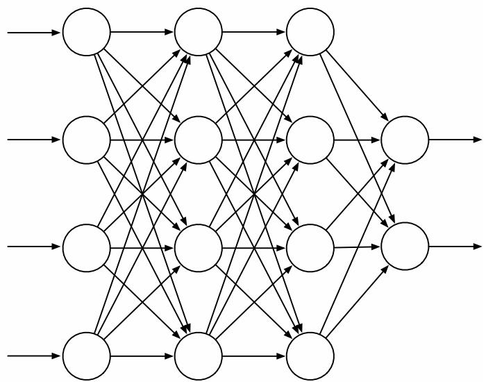  
Figure 9.14: A generic feedforward ANN with four input units, two output units, and two hidden layers.

than a feedforward ANN. Although both feedforward and recurrent ANNs have been used in reinforcement learning, here we look only at the simpler feedforward case.

The units (the circles in Figure 9.14) are typically semi- linear units, meaning that they compute a weighted sum of their input signals and then apply to the result a nonlinear function, called the activation function, to produce the unit's output, or activation. Different activation functions are used, but they are typically S- shaped, or sigmoid, functions such as the logistic function  $f(x) = 1 / (1 + e^{- x})$ , though sometimes the rectifier nonlinearity  $f(x) = \max (0,x)$  is used. A step function like  $f(x) = 1$  if  $x \geq \theta$ , and 0 otherwise, results in a binary unit with threshold  $\theta$ . The units in a network's input layer are somewhat different in having their activations set to externally- supplied values that are the inputs to the function the network is approximating.

The activation of each output unit of a feedforward ANN is a nonlinear function of the activation patterns over the network's input units. The functions are parameterized by the network's connection weights. An ANN with no hidden layers can represent only a very small fraction of the possible input- output functions. However an ANN with a single hidden layer containing a large enough finite number of sigmoid units can approximate any continuous function on a compact region of the network's input space to any degree of accuracy (Cybenko, 1989). This is also true for other nonlinear activation functions that satisfy mild conditions, but nonlinearity is essential: if all the units in a multi- layer feedforward ANN have linear activation functions, the entire network is equivalent to a network with no hidden layers (because linear functions of linear functions are themselves linear).

Despite this "universal approximation" property of one- hidden- layer ANNs, both experience and theory show that approximating the complex functions needed for many artificial intelligence tasks is made easier—indeed may require—abstractions that are hierarchical compositions of many layers of lower- level abstractions, that is, abstractions

produced by deep architectures such as ANNs with many hidden layers. (See Bengio, 2009, for a thorough review.) The successive layers of a deep ANN compute increasingly abstract representations of the network's "raw" input, with each unit providing a feature contributing to a hierarchical representation of the overall input- output function of the network.

Training the hidden layers of an ANN is therefore a way to automatically create features appropriate for a given problem so that hierarchical representations can be produced without relying exclusively on hand- crafted features. This has been an enduring challenge for artificial intelligence and explains why learning algorithms for ANNs with hidden layers have received so much attention over the years. ANNs typically learn by a stochastic gradient method (Section 9.3). Each weight is adjusted in a direction aimed at improving the network's overall performance as measured by an objective function to be either minimized or maximized. In the most common supervised learning case, the objective function is the expected error, or loss, over a set of labeled training examples. In reinforcement learning, ANNs can use TD errors to learn value functions, or they can aim to maximize expected reward as in a gradient bandit (Section 2.8) or a policy- gradient algorithm (Chapter 13). In all of these cases it is necessary to estimate how a change in each connection weight would influence the network's overall performance, in other words, to estimate the partial derivative of an objective function with respect to each weight, given the current values of all the network's weights. The gradient is the vector of these partial derivatives.

The most successful way to do this for ANNs with hidden layers (provided the units have differentiable activation functions) is the backpropagation algorithm, which consists of alternating forward and backward passes through the network. Each forward pass computes the activation of each unit given the current activations of the network's input units. After each forward pass, a backward pass efficiently computes a partial derivative for each weight. (As in other stochastic gradient learning algorithms, the vector of these partial derivatives is an estimate of the true gradient.) In Section 15.10 we discuss methods for training ANNs with hidden layers that use reinforcement learning principles instead of backpropagation. These methods are less efficient than the backpropagation algorithm, but they may be closer to how real neural networks learn.

The backpropagation algorithm can produce good results for shallow networks having 1 or 2 hidden layers, but it may not work well for deeper ANNs. In fact, training a network with  $k + 1$  hidden layers can actually result in poorer performance than training a network with  $k$  hidden layers, even though the deeper network can represent all the functions that the shallower network can (Bengio, 2009). Explaining results like these is not easy, but several factors are important. First, the large number of weights in a typical deep ANN makes it difficult to avoid the problem of overfitting, that is, the problem of failing to generalize correctly to cases on which the network has not been trained. Second, backpropagation does not work well for deep ANNs because the partial derivatives computed by its backward passes either decay rapidly toward the input side of the network, making learning by deep layers extremely slow, or the partial derivatives grow rapidly toward the input side of the network, making learning unstable. Methods for dealing with these problems are largely responsible for many impressive recent results

achieved by systems that use deep ANNs.

achieved by systems that use deep ANNs.Overfitting is a problem for any function approximation method that adjusts functions with many degrees of freedom on the basis of limited training data. It is less of a problem for online reinforcement learning that does not rely on limited training sets, but generalizing effectively is still an important issue. Overfitting is a problem for ANNs in general, but especially so for deep ANNs because they tend to have very large numbers of weights. Many methods have been developed for reducing overfitting. These include stopping training when performance begins to decrease on validation data different from the training data (cross validation), modifying the objective function to discourage complexity of the approximation (regularization), and introducing dependencies among the weights to reduce the number of degrees of freedom (e.g., weight sharing).

A particularly effective method for reducing overfitting by deep ANNs is the dropout method introduced by Srivastava, Hinton, Krizhevsky, Sutskever, and Salakhutdinov (2014). During training, units are randomly removed from the network (dropped out) along with their connections. This can be thought of as training a large number of "thinned" networks. Combining the results of these thinned networks at test time is a way to improve generalization performance. The dropout method efficiently approximates this combination by multiplying each outgoing weight of a unit by the probability that that unit was retained during training. Srivastava et al. found that this method significantly improves generalization performance. It encourages individual hidden units to learn features that work well with random collections of other features. This increases the versatility of the features formed by the hidden units so that the network does not overly specialize to rarely- occurring cases.

Hinton, Osindero, and Tefh (2006) took a major step toward solving the problem of training the deep layers of a deep ANN in their work with deep belief networks, layered networks closely related to the deep ANNs discussed here. In their method, the deepest layers are trained one at a time using an unsupervised learning algorithm. Without relying on the overall objective function, unsupervised learning can extract features that capture statistical regularities of the input stream. The deepest layer is trained first, then with input provided by this trained layer, the next deepest layer is trained, and so on, until the weights in all, or many, of the network's layers are set to values that now act as initial values for supervised learning. The network is then fine- tuned by backpropagation with respect to the overall objective function. Studies show that this approach generally works much better than backpropagation with weights initialized with random values. The better performance of networks trained with weights initialized this way could be due to many factors, but one idea is that this method places the network in a region of weight space from which a gradient- based algorithm can make good progress.

Batch normalization (Ioffe and Szegedy, 2015) is another technique that makes it easier to train deep ANNs. It has long been known that ANN learning is easier if the network input is normalized, for example, by adjusting each input variable to have zero mean and unit variance. Batch normalization for training deep ANNs normalizes the output of deep layers before they feed into the following layer. Ioffe and Szegedy (2015) used statistics from subsets, or "mini- batches," of training examples to normalize these between- layer signals to improve the learning rate of deep ANNs.

Another technique useful for training deep ANNs is deep residual learning (He, Zhang, Ren, and Sun, 2016). Sometimes it is easier to learn how a function differs from the identity function than to learn the function itself. Then adding this difference, or residual function, to the input produces the desired function. In deep ANNs, a block of layers can be made to learn a residual function simply by adding shortcut, or skip, connections around the block. These connections add the input to the block to its output, and no additional weights are needed. He et al. (2016) evaluated this method using deep convolutional networks with skip connections around every pair of adjacent layers, finding substantial improvement over networks without the skip connections on benchmark image classification tasks. Both batch normalization and deep residual learning were used in the reinforcement learning application to the game of Go that we describe in Chapter 16.

A type of deep ANN that has proven to be very successful in applications, including impressive reinforcement learning applications (Chapter 16), is the deep convolutional network. This type of network is specialized for processing high- dimensional data arranged in spatial arrays, such as images. It was inspired by how early visual processing works in the brain (LeCun, Bottou, Bengio and Haffner, 1998). Because of its special architecture, a deep convolutional network can be trained by backpropagation without resorting to methods like those described above to train the deep layers.

Figure 9.15 illustrates the architecture of a deep convolutional network. This instance, from LeCun et al. (1998), was designed to recognize hand- written characters. It consists of alternating convolutional and subsampling layers, followed by several fully connected final layers. Each convolutional layer produces a number of feature maps. A feature map is a pattern of activity over an array of units, where each unit performs the same operation on data in its receptive field, which is the part of the data it "sees" from the preceding layer (or from the external input in the case of the first convolutional layer). The units of a feature map are identical to one another except that their receptive fields, which are all the same size and shape, are shifted to different locations on the arrays of incoming data. Units in the same feature map share the same weights. This means that a feature map detects the same feature no matter where it is located in the input

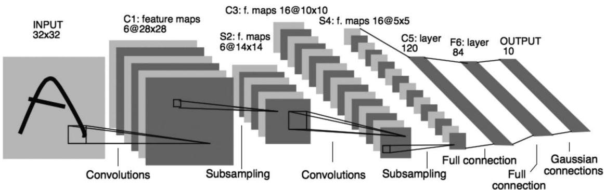  
Figure 9.15: Deep Convolutional Network. Republished with permission of Proceedings of the IEEE, from Gradient-based learning applied to document recognition, LeCun, Bottou, Bengio, and Haffner, volume 86, 1998; permission conveyed through Copyright Clearance Center, Inc.

array. In the network in Figure 9.15, for example, the first convolutional layer produces 6 feature maps, each consisting of  $28 \times 28$  units. Each unit in each feature map has a  $5 \times 5$  receptive field, and these receptive fields overlap (in this case by four columns and four rows). Consequently, each of the 6 feature maps is specified by just 25 adjustable weights.

The subsampling layers of a deep convolutional network reduce the spatial resolution of the feature maps. Each feature map in a subsampling layer consists of units that average over a receptive field of units in the feature maps of the preceding convolutional layer. For example, each unit in each of the 6 feature maps in the first subsampling layer of the network of Figure 9.15 averages over a  $2 \times 2$  non- overlapping receptive field over one of the feature maps produced by the first convolutional layer, resulting in six  $14 \times 14$  feature maps. Subsampling layers reduce the network's sensitivity to the spatial locations of the features detected, that is, they help make the network's responses spatially invariant. This is useful because a feature detected at one place in an image is likely to be useful at other places as well.

Advances in the design and training of ANNs- of which we have only mentioned a few- - all contribute to reinforcement learning. Although current reinforcement learning theory is mostly limited to methods using tabular or linear function approximation methods, the impressive performances of notable reinforcement learning applications owe much of their success to nonlinear function approximation by multi- layer ANNs. We discuss several of these applications in Chapter 16. .

# 9.8 Least-Squares TD

All the methods we have discussed so far in this chapter have required computation per time step proportional to the number of parameters. With more computation, however, one can do better. In this section we present a method for linear function approximation that is arguably the best that can be done for this case.

As we established in Section 9.4 TD(0) with linear function approximation converges asymptotically (for appropriately decreasing step sizes) to the TD fixed point:

$$
\mathbf{w}_{\mathrm{TD}} = \mathbf{A}^{-1}\mathbf{b},
$$

where

$$
\begin{array}{r}{\mathbf{A}\doteq \mathbb{E}\big[\mathbf{x}_{t}(\mathbf{x}_{t} - \gamma \mathbf{x}_{t + 1})^{\top}\big]\qquad \mathrm{and}\qquad \mathbf{b}\doteq \mathbb{E}[R_{t + 1}\mathbf{x}_{t}].} \end{array}
$$

Why, one might ask, must we compute this solution iteratively? This is wasteful of data! Could one not do better by computing estimates of  $\mathbf{A}$  and  $\mathbf{b}$  , and then directly computing the TD fixed point? The Least- Squares  $T D$  algorithm, commonly known as  $L S T D$  , does exactly this. It forms the natural estimates

$$
\widehat{\mathbf{A}}_{t}\doteq \sum_{k = 0}^{t - 1}\mathbf{x}_{k}(\mathbf{x}_{k} - \gamma \mathbf{x}_{k + 1})^{\top} + \epsilon \mathbf{I}\quad \mathrm{and}\quad \widehat{\mathbf{b}}_{t}\doteq \sum_{k = 0}^{t - 1}R_{k + 1}\mathbf{x}_{k}, \tag{9.20}
$$

where  $\mathbf{I}$  is the identity matrix, and  $\epsilon \mathbf{I}$ , for some small  $\epsilon > 0$ , ensures that  $\hat{\mathbf{A}}_t$  is always invertible. It might seem that these estimates should both be divided by  $t$ , and indeed they should; as defined here, these are really estimates of  $t$  times  $\mathbf{A}$  and  $t$  times  $\mathbf{b}$ . However, the extra  $t$  factors cancel out when LSTD uses these estimates to estimate the TD fixed point as

$$
\mathbf{w}_t \doteq \hat{\mathbf{A}}_t^{-1} \hat{\mathbf{b}}_t. \tag{9.21}
$$

This algorithm is the most data efficient form of linear  $\mathrm{TD}(0)$ , but it is also more expensive computationally. Recall that semi- gradient  $\mathrm{TD}(0)$  requires memory and per- step computation that is only  $O(d)$ .

How complex is LSTD? As it is written above the complexity seems to increase with  $t$ , but the two approximations in (9.20) could be implemented incrementally using the techniques we have covered earlier (e.g., in Chapter 2) so that they can be done in constant time per step. Even so, the update for  $\hat{\mathbf{A}}_t$  would involve an outer product (a column vector times a row vector) and thus would be a matrix update; its computational complexity would be  $O(d^2)$ , and of course the memory required to hold the  $\hat{\mathbf{A}}_t$  matrix would be  $O(d^2)$ .

A potentially greater problem is that our final computation (9.21) uses the inverse of  $\hat{\mathbf{A}}_t$ , and the computational complexity of a general inverse computation is  $O(d^3)$ . Fortunately, an inverse of a matrix of our special form—a sum of outer products—can also be updated incrementally with only  $O(d^2)$  computations, as

$$
\begin{array}{r l} & {\hat{\mathbf{A}}_{t}^{-1} = \left(\hat{\mathbf{A}}_{t - 1} + \mathbf{x}_{t - 1}(\mathbf{x}_{t - 1} - \gamma \mathbf{x}_{t})^{\top}\right)^{-1}}\\ & {\qquad = \hat{\mathbf{A}}_{t - 1}^{-1} - \frac{\hat{\mathbf{A}}_{t - 1}^{-1}\mathbf{x}_{t - 1}(\mathbf{x}_{t - 1} - \gamma\mathbf{x}_{t})^{\top}\hat{\mathbf{A}}_{t - 1}^{-1}}{1 + (\mathbf{x}_{t - 1} - \gamma\mathbf{x}_{t})^{\top}\hat{\mathbf{A}}_{t - 1}^{-1}\mathbf{x}_{t - 1}},} \end{array} \tag{from (9.20)
$$

for  $t > 0$ , with  $\hat{\mathbf{A}}_0 \doteq \epsilon \mathbf{I}$ . Although the identity (9.22), known as the Sherman- Morrison formula, is superficially complicated, it involves only vector- matrix and vector- vector multiplications and thus is only  $O(d^2)$ . Thus we can store the inverse matrix  $\hat{\mathbf{A}}_t^{- 1}$ , maintain it with (9.22), and then use it in (9.21), all with only  $O(d^2)$  memory and per- step computation. The complete algorithm is given in the box on the next page.

Of course,  $O(d^2)$  is still significantly more expensive than the  $O(d)$  of semi- gradient TD. Whether the greater data efficiency of LSTD is worth this computational expense depends on how large  $d$  is, how important it is to learn quickly, and the expense of other parts of the system. The fact that LSTD requires no step- size parameter is sometimes also touted, but the advantage of this is probably overstated. LSTD does not require a step size, but it does requires  $\epsilon$ ; if  $\epsilon$  is chosen too small the sequence of inverses can vary wildly, and if  $\epsilon$  is chosen too large then learning is slowed. In addition, LSTD's lack of a step- size parameter means that it never forgets. This is sometimes desirable, but it is problematic if the target policy  $\pi$  changes as it does in reinforcement learning and GPI. In control applications, LSTD typically has to be combined with some other mechanism to induce forgetting, mooting any initial advantage of not requiring a step- size parameter.

# LSTD for estimating  $\hat{v} = \mathbf{w}^{\top}\mathbf{x}(\cdot)\approx v_{\pi}$ $\mathbf{\nabla}O(d^{2})$  version)

Input: feature representation  $\mathbf{x}:S^{+}\to \mathbb{R}^{d}$  such that  $\mathbf{x}(t e r m i n a l) = \mathbf{0}$  Algorithm parameter: small  $\epsilon >0$

$\begin{array}{r}\widehat{\mathbf{A}}^{- 1}\leftarrow \epsilon^{- 1}\mathbf{I} \end{array}$  A  $d\ast d$  matrix  $\hat{\mathbf{b}}\gets \mathbf{0}$  A  $d$  - dimensional vector

Loop for each episode:

Initialize  $S$ $\mathbf{x}\gets \mathbf{x}(S)$

Loop for each step of episode:

Choose and take action  $A\sim \pi (\cdot |S)$  , observe  $R,S^{\prime};\mathbf{x}^{\prime}\gets \mathbf{x}(S^{\prime})$ $\begin{array}{r l} & {\mathbf{v}\leftarrow \widehat{\mathbf{A}}^{- 1}\overset {\top}{(\mathbf{x}} - \gamma \mathbf{x}^{\prime})}\\ & {\widehat{\mathbf{A}}^{- 1}\leftarrow \widehat{\mathbf{A}}^{- 1} - (\widehat{\mathbf{A}}^{- 1}\mathbf{x})\mathbf{v}^{\top} / (1 + \mathbf{v}^{\top}\mathbf{x})}\\ & {\widehat{\mathbf{b}}\leftarrow \widehat{\mathbf{b}} +R\mathbf{x}}\\ & {\mathbf{w}\leftarrow \widehat{\mathbf{A}}^{- 1}\widehat{\mathbf{b}}}\\ & {S\leftarrow S^{\prime};\mathbf{x}\leftarrow \mathbf{x}^{\prime}} \end{array}$  until  $S^{\prime}$  is terminal

# 9.9 Memory-based Function Approximation

So far we have discussed the parametric approach to approximating value functions. In this approach, a learning algorithm adjusts the parameters of a functional form intended to approximate the value function over a problem's entire state space. Each update,  $s\mapsto g$  , is a training example used by the learning algorithm to change the parameters with the aim of reducing the approximation error. After the update, the training example can be discarded (although it might be saved to be used again). When an approximate value of a state (which we will call the query state) is needed, the function is simply evaluated at that state using the latest parameters produced by the learning algorithm.

Memory- based function approximation methods are very different. They simply save training examples in memory as they arrive (or at least save a subset of the examples) without updating any parameters. Then, whenever a query state's value estimate is needed, a set of examples is retrieved from memory and used to compute a value estimate for the query state. This approach is sometimes called lazy learning because processing training examples is postponed until the system is queried to provide an output.

Memory- based function approximation methods are prime examples of nonparametric methods. Unlike parametric methods, the approximating function's form is not limited to a fixed parameterized class of functions, such as linear functions or polynomials, but is instead determined by the training examples themselves, together with some means for combining them to output estimated values for query states. As more training examples accumulate in memory, one expects nonparametric methods to produce increasingly accurate approximations of any target function.

There are many different memory- based methods depending on how the stored training examples are selected and how they are used to respond to a query. Here, we focus on local- learning methods that approximate a value function only locally in the neighborhood of the current query state. These methods retrieve a set of training examples from memory whose states are judged to be the most relevant to the query state, where relevance usually depends on the distance between states: the closer a training example's state is to the query state, the more relevant it is considered to be, where distance can be defined in many different ways. After the query state is given a value, the local approximation is discarded.

The simplest example of the memory- based approach is the nearest neighbor method, which simply finds the example in memory whose state is closest to the query state and returns that example's value as the approximate value of the query state. In other words, if the query state is  $s$ , and  $s' \mapsto g$  is the example in memory in which  $s'$  is the closest state to  $s$ , then  $g$  is returned as the approximate value of  $s$ . Slightly more complicated are weighted average methods that retrieve a set of nearest neighbor examples and return a weighted average of their target values, where the weights generally decrease with increasing distance between their states and the query state. Locally weighted regression is similar, but it fits a surface to the values of a set of nearest states by means of a parametric approximation method that minimizes a weighted error measure like (9.1), where the weights depend on distances from the query state. The value returned is the evaluation of the locally- fitted surface at the query state, after which the local approximation surface is discarded.

Being nonparametric, memory- based methods have the advantage over parametric methods of not limiting approximations to pre- specified functional forms. This allows accuracy to improve as more data accumulates. Memory- based local approximation methods have other properties that make them well suited for reinforcement learning. Because trajectory sampling is of such importance in reinforcement learning, as discussed in Section 8.6, memory- based local methods can focus function approximation on local neighborhoods of states (or state- action pairs) visited in real or simulated trajectories. There may be no need for global approximation because many areas of the state space will never (or almost never) be reached. In addition, memory- based methods allow an agent's experience to have a relatively immediate affect on value estimates in the neighborhood of the current state, in contrast with a parametric method's need to incrementally adjust parameters of a global approximation.

Avoiding global approximation is also a way to address the curse of dimensionality. For example, for a state space with  $k$  dimensions, a tabular method storing a global approximation requires memory exponential in  $k$ . On the other hand, in storing examples for a memory- based method, each example requires memory proportional to  $k$ , and the memory required to store, say,  $n$  examples is linear in  $n$ . Nothing is exponential in  $k$  or  $n$ . Of course, the critical remaining issue is whether a memory- based method can answer queries quickly enough to be useful to an agent. A related concern is how speed degrades as the size of the memory grows. Finding nearest neighbors in a large database can take too long to be practical in many applications.

Proponents of memory- based methods have developed ways to accelerate the nearest neighbor search. Using parallel computers or special purpose hardware is one approach; another is the use of special multi- dimensional data structures to store the training data. One data structure studied for this application is the  $k$ - d tree (short for  $k$ - dimensional tree), which recursively splits a  $k$ - dimensional space into regions arranged as nodes of a binary tree. Depending on the amount of data and how it is distributed over the state space, nearest- neighbor search using  $k$ - d trees can quickly eliminate large regions of the space in the search for neighbors, making the searches feasible in some problems where naive searches would take too long.

Locally weighted regression additionally requires fast ways to do the local regression computations which have to be repeated to answer each query. Researchers have developed many ways to address these problems, including methods for forgetting entries in order to keep the size of the database within bounds. The Bibliographic and Historical Comments section at the end of this chapter points to some of the relevant literature, including a selection of papers describing applications of memory- based learning to reinforcement learning.

# 9.10 Kernel-based Function Approximation

Memory- based methods such as the weighted average and locally weighted regression methods described above depend on assigning weights to examples  $s' \to g$  in the database depending on the distance between  $s'$  and a query states  $s$ . The function that assigns these weights is called a kernel function, or simply a kernel. In the weighted average and locally weighted regressions methods, for example, a kernel function  $k: \mathbb{R} \to \mathbb{R}$  assigns weights to distances between states. More generally, weights do not have to depend on distances; they can depend on some other measure of similarity between states. In this case,  $k: \mathbb{S} \times \mathbb{S} \to \mathbb{R}$ , so that  $k(s, s')$  is the weight given to data about  $s'$  in its influence on answering queries about  $s$ .

Viewed slightly differently,  $k(s, s')$  is a measure of the strength of generalization from  $s'$  to  $s$ . Kernel functions numerically express how relevant knowledge about any state is to any other state. As an example, the strengths of generalization for tile coding shown in Figure 9.11 correspond to different kernel functions resulting from uniform and asymmetrical tile offsets. Although tile coding does not explicitly use a kernel function in its operation, it generalizes according to one. In fact, as we discuss more below, the strength of generalization resulting from linear parametric function approximation can always be described by a kernel function.

Kernel regression is the memory- based method that computes a kernel weighted average of the targets of all examples stored in memory, assigning the result to the query state. If  $\mathcal{D}$  is the set of stored examples, and  $g(s')$  denotes the target for state  $s'$  in a stored example, then kernel regression approximates the target function, in this case a value function depending on  $\mathcal{D}$ , as

$$
\hat{v} (s, \mathcal{D}) = \sum_{s' \in \mathcal{D}} k(s, s') g(s'). \tag{9.23}
$$

The weighted average method described above is a special case in which  $k(s,s^{\prime})$  is non- zero only when  $s$  and  $s^{\prime}$  are close to one another so that the sum need not be computed over all of  $\mathcal{D}$ .

A common kernel is the Gaussian radial basis function (RBF) used in RBF function approximation as described in Section 9.5.5. In the method described there, RBFs are features whose centers and widths are either fixed from the start, with centers presumably concentrated in areas where many examples are expected to fall, or are adjusted in some way during learning. Barring methods that adjust centers and widths, this is a linear parametric method whose parameters are the weights of each RBF, which are typically learned by stochastic gradient, or semi- gradient, descent. The form of the approximation is a linear combination of the pre- determined RBFs. Kernel regression with an RBF kernel differs from this in two ways. First, it is memory- based: the RBFs are centered on the states of the stored examples. Second, it is nonparametric: there are no parameters to learn; the response to a query is given by (9.23).

Of course, many issues have to be addressed for practical implementation of kernel regression, issues that are beyond the scope of our brief discussion. However, it turns out that any linear parametric regression method like those we described in Section 9.4, with states represented by feature vectors  $\mathbf{x}(s) = (x_{1}(s),x_{2}(s),\ldots ,x_{d}(s))^{\top}$ , can be recast as kernel regression where  $k(s,s^{\prime})$  is the inner product of the feature vector representations of  $s$  and  $s^{\prime}$ ; that is

$$
k(s,s^{\prime}) = \mathbf{x}(s)^{\top}\mathbf{x}(s^{\prime}). \tag{9.24}
$$

Kernel regression with this kernel function produces the same approximation that a linear parametric method would if it used these feature vectors and learned with the same training data.

We skip the mathematical justification for this, which can be found in any modern machine learning text, such as Bishop (2006), and simply point out an important implication. Instead of constructing features for linear parametric function approximators, one can instead construct kernel functions directly without referring at all to feature vectors. Not all kernel functions can be expressed as inner products of feature vectors as in (9.24), but a kernel function that can be expressed like this can offer significant advantages over the equivalent parametric method. For many sets of feature vectors, (9.24) has a compact functional form that can be evaluated without any computation taking place in the  $d$ - dimensional feature space. In these cases, kernel regression is much less complex than directly using a linear parametric method with states represented by these feature vectors. This is the so- called "kernel trick" that allows effectively working in the high- dimension of an expansive feature space while actually working only with the set of stored training examples. The kernel trick is the basis of many machine learning methods, and researchers have shown how it can sometimes benefit reinforcement learning.

# 9.11 Looking Deeper at On-policy Learning: Interest and Emphasis

The algorithms we have considered so far in this chapter have treated all the states encountered equally, as if they were all equally important. In some cases, however, we are more interested in some states than others. In discounted episodic problems, for example, we may be more interested in accurately valuing early states in the episode than in later states where discounting may have made the rewards much less important to the value of the start state. Or, if an action- value function is being learned, it may be less important to accurately value poor actions whose value is much less than the greedy action. Function approximation resources are always limited, and if they were used in a more targeted way, then performance could be improved.

One reason we have treated all states encountered equally is that then we are updating according to the on- policy distribution, for which stronger theoretical results are available for semi- gradient methods. Recall that the on- policy distribution was defined as the distribution of states encountered in an MDP while following the target policy. Now we will generalize this concept significantly. Rather than having one on- policy distribution for the MDP, we will have many. All of them will have in common that they are a distribution of states encountered in trajectories while following the target policy, but they will vary in how the trajectories are, in a sense, initiated.

We now introduce some new concepts. First we introduce a non- negative scalar measure, a random variable  $I_{t}$  called interest, indicating the degree to which we are interested in accurately valuing the state (or state- action pair) at time  $t$  . If we don't care at all about the state, then the interest should be zero; if we fully care, it might be one, though it is formally allowed to take any non- negative value. The interest can be set in any causal way; for example, it may depend on the trajectory up to time  $t$  or the learned parameters at time  $t$  . The distribution  $\mu$  in the  $\overline{{\mathrm{VE}}}$  (9.1) is then defined as the distribution of states encountered while following the target policy, weighted by the interest. Second, we introduce another non- negative scalar random variable, the emphasis  $M_{t}$  . This scalar multiplies the learning update and thus emphasizes or de- emphasizes the learning done at time  $t$  . The general  $n$  - step learning rule, replacing (9.15), is

$$
\begin{array}{r}{\mathbf{w}_{t + n}\doteq \mathbf{w}_{t + n - 1} + \alpha M_{t}\left[G_{t:t + n} - \hat{v} (S_{t},\mathbf{w}_{t + n - 1})\right]\nabla \hat{v} (S_{t},\mathbf{w}_{t + n - 1}),\qquad 0\leq t< T,} \end{array} \tag{9.25}
$$

with the  $n$  - step return given by (9.16) and the emphasis determined recursively from the interest by:

$$
M_{t} = I_{t} + \gamma^{n}M_{t - n},\qquad 0\leq t< T, \tag{9.26}
$$

with  $M_{t}\doteq 0$  , for all  $t< 0$  . These equations are taken to include the Monte Carlo case, for which  $G_{t:t + n} = G_{t}$  , all the updates are made at end of the episode,  $n = T - t$  , and  $M_{t} = I_{t}$  .

Example 9.4 illustrates how interest and emphasis can result in more accurate value estimates.

# Example 9.4: Interest and Emphasis

To see the potential benefits of using interest and emphasis, consider the four- state Markov reward process shown below:

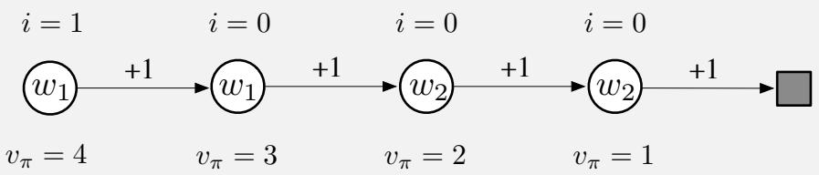

Episodes start in the leftmost state, then transition one state to the right, with a reward of  $+1$ , on each step until the terminal state is reached. The true value of the first state is thus 4, of the second state 3, and so on as shown below each state. These are the true values; the estimated values can only approximate these because they are constrained by the parameterization. There are two components to the parameter vector  $\mathbf{w} = (w_{1},w_{2})^{\top}$ , and the parameterization is as written inside each state. The estimated values of the first two states are given by  $w_{1}$  alone and thus must be the same even though their true values are different. Similarly, the estimated values of the third and fourth states are given by  $w_{2}$  alone and must be the same even though their true values are different. Suppose that we are interested in accurately valuing only the leftmost state; we assign it an interest of 1 while all the other states are assigned an interest of 0, as indicated above the states.

First consider applying gradient Monte Carlo algorithms to this problem. The algorithms presented earlier in this chapter that do not take into account interest and emphasis (in (9.7) and the box on page 202) will converge (for decreasing step sizes) to the parameter vector  $\mathbf{w}_{\infty} = (3.5,1.5)$ , which gives the first state—the only one we are interested in—a value of 3.5 (i.e., intermediate between the true values of the first and second states). The methods presented in this section that do use interest and emphasis, on the other hand, will learn the value of the first state exactly correctly; in, will converge to 4 while  $w_{2}$  will never be updated because the emphasis is zero in all states save the leftmost.

Now consider applying two- step semi- gradient TD methods. The methods from earlier in this chapter without interest and emphasis (in (9.15) and (9.16) and the box on page 209) will again converge to  $\mathbf{w}_{\infty} = (3.5,1.5)$ , while the methods with interest and emphasis converge to  $\mathbf{w}_{\infty} = (4,2)$ . The latter produces the exactly correct values for the first state and for the third state (which the first state bootstraps from) while never making any updates corresponding to the second or fourth states.

# 9.12 Summary

Reinforcement learning systems must be capable of generalization if they are to be applicable to artificial intelligence or to large engineering applications. To achieve this, any of a broad range of existing methods for supervised- learning function approximation can be used simply by treating each update as a training example.

Perhaps the most suitable supervised learning methods are those using parameterized function approximation, in which the policy is parameterized by a weight vector w. Although the weight vector has many components, the state space is much larger still, and we must settle for an approximate solution. We defined the mean square value error,  $\overline{{\mathrm{VE}}} (\mathbf{w})$  , as a measure of the error in the values  $v_{\pi_{\mathbf{w}}}(s)$  for a weight vector w under the on- policy distribution,  $\mu$  . The  $\overline{{\mathrm{VE}}}$  gives us a clear way to rank different value- function approximations in the on- policy case.

To find a good weight vector, the most popular methods are variations of stochastic gradient descent (SGD). In this chapter we have focused on the on- policy case with a fixed policy, also known as policy evaluation or prediction; a natural learning algorithm for this case is  $n$  - step semi- gradient  $T D$  , which includes gradient Monte Carlo and semi- gradient TD(0) algorithms as the special cases when  $n = \infty$  and  $n = 1$  respectively. Semi- gradient TD methods are not true gradient methods. In such bootstrapping methods (including DP), the weight vector appears in the update target, yet this is not taken into account in computing the gradient- thus they are semi- gradient methods. As such, they cannot rely on classical SGD results.

Nevertheless, good results can be obtained for semi- gradient methods in the special case of linear function approximation, in which the value estimates are sums of features times corresponding weights. The linear case is the most well understood theoretically and works well in practice when provided with appropriate features. Choosing the features is one of the most important ways of adding prior domain knowledge to reinforcement learning systems. They can be chosen as polynomials, but this case generalizes poorly in the online learning setting typically considered in reinforcement learning. Better is to choose features according the Fourier basis, or according to some form of coarse coding with sparse overlapping receptive fields. Tile coding is a form of coarse coding that is particularly computationally efficient and flexible. Radial basis functions are useful for one- or two- dimensional tasks in which a smoothly varying response is important. LSTD is the most data- efficient linear TD prediction method, but requires computation proportional to the square of the number of weights, whereas all the other methods are of complexity linear in the number of weights. Nonlinear methods include artificial neural networks trained by backpropagation and variations of SGD; these methods have become very popular in recent years under the name deep reinforcement learning.

Linear semi- gradient  $n$  - step TD is guaranteed to converge under standard conditions, for all  $n$  , to a  $\overline{{\mathrm{VE}}}$  that is within a bound of the optimal error (achieved asymptotically by Monte Carlo methods). This bound is always tighter for higher  $n$  and approaches zero as  $n\to \infty$  . However, in practice very high  $n$  results in very slow learning, and some degree of bootstrapping (  $n< \infty$  ) is usually preferable, just as we saw in comparisons of tabular  $n$  - step methods in Chapter 7 and in comparisons of tabular TD and Monte Carlo methods in Chapter 6.

Exercise 9.7 One of the simplest artificial neural networks consists of a single semi- linear unit with a logistic nonlinearity. The need to handle approximate value functions of this form is common in games that end with either a win or a loss, in which case the value of a state can be interpreted as the probability of winning. Derive the learning algorithm for this case, from (9.7), such that no gradient notation appears.

\*Exercise 9.8 Arguably, the squared error used to derive (9.7) is inappropriate for the case treated in the preceding exercise, and the right error measure is the cross- entropy loss (which you can find on Wikipedia). Repeat the derivation in Section 9.3, using the cross- entropy loss instead of the squared error in (9.4), all the way to an explicit form with no gradient or logarithm notation in it. Is your final form more complex, or simpler, than that you obtained in the preceding exercise?

# Bibliographical and Historical Remarks

Generalization and function approximation have always been an integral part of reinforcement learning. Bertsekas and Tsitsiklis (1996), Bertsekas (2012), and Sugiyama et al. (2013) present the state of the art in function approximation in reinforcement learning. Some of the early work with function approximation in reinforcement learning is discussed at the end of this section.

9.3 Gradient- descent methods for minimizing mean square error in supervised learning are well known. Widrow and Hoff (1960) introduced the least- mean- square (LMS) algorithm, which is the prototypical incremental gradient- descent algorithm. Details of this and related algorithms are provided in many texts (e.g., Widrow and Stearns, 1985; Bishop, 1995; Duda and Hart, 1973).

Semi- gradient TD(0) was first explored by Sutton (1984, 1988), as part of the linear TD(A) algorithm that we will treat in Chapter 12. The term "semi- gradient" to describe these bootstrapping methods is new to the second edition of this book.

The earliest use of state aggregation in reinforcement learning may have been Michie and Chambers's BOXES system (1968). The theory of state aggregation in reinforcement learning has been developed by Singh, Jaakkola, and Jordan (1995) and Tsitsiklis and Van Roy (1996). State aggregation has been used in dynamic programming from its earliest days (e.g., Bellman, 1957a).

9.4 Sutton (1988) proved convergence of linear TD(0) in the mean to the minimal VE solution for the case in which the feature vectors,  $\{\mathbf{x}(s):s\in \mathcal{S}\}$ , are linearly independent. Convergence with probability 1 was proved by several researchers at about the same time (Peng, 1993; Dayan and Sejnowski, 1994; Tsitsiklis, 1994; Gurvits, Lin, and Hanson, 1994). In addition, Jaakkola, Jordan, and Singh (1994) proved convergence under online updating. All of these results assumed linearly independent feature vectors, which implies at least as many components to  $\mathbf{w}_t$  as there are states. Convergence for the more important case of general (dependent) feature vectors was first shown by Dayan (1992). A significant

generalization and strengthening of Dayan's result was proved by Tsitsiklis and Van Roy (1997). They proved the main result presented in this section, the bound on the asymptotic error of linear bootstrapping methods.

9.5 Our presentation of the range of possibilities for linear function approximation is based on that by Barto (1990).

9.5.2 Konidaris, Osentoski, and Thomas (2011) introduced the Fourier basis in a simple form suitable for reinforcement learning problems with multi- dimensional continuous state spaces and functions that do not have to be periodic.

9.5.3 The term coarse coding is due to Hinton (1984), and our Figure 9.6 is based on one of his figures. Waltz and Fu (1965) provide an early example of this type of function approximation in a reinforcement learning system.

9.5.4 Tile coding, including hashing, was introduced by Albus (1971, 1981). He described it in terms of his "cerebellar model articulator controller," or CMAC, as tile coding is sometimes known in the literature. The term "tile coding" was new to the first edition of this book, though the idea of describing CMAC in these terms is taken from Watkins (1989). Tile coding has been used in many reinforcement learning systems (e.g., Shewchuk and Dean, 1990; Lin and Kim, 1991; Miller, Scalera, and Kim, 1994; Sofge and White, 1992; Tham, 1994; Sutton, 1996; Watkins, 1989) as well as in other types of learning control systems (e.g., Kraft and Campagna, 1990; Kraft, Miller, and Dietz, 1992). This section draws heavily on the work of Miller and Glanz (1996). General software for tile coding is available in several languages (e.g., see http://incompleteideas.net/tiles/tiles3. html).

9.5.5 Function approximation using radial basis functions has received wide attention ever since being related to ANNs by Broomhead and Lowe (1988). Powell (1987) reviewed earlier uses of RBFs, and Poggio and Girosi (1989, 1990) extensively developed and applied this approach.

9.6 Automatic methods for adapting the step- size parameter include RMSprop (Tieleman and Hinton, 2012), Adam (Kingma and Ba, 2015), stochastic meta- descent methods such as Delta- Bar- Delta (Jacobs, 1988), its incremental generalization (Sutton, 1992b, c; Mahmood et al., 2012), and nonlinear generalizations (Schraudolph, 1999, 2002). Methods explicitly designed for reinforcement learning include Alphabound (Dabney and Barto, 2012), SID and NOSID (Dabney, 2014), TIDBD (Kearney et al., in preparation) and the application of stochastic meta- descent to policy gradient learning (Schraudolph, Yu, and Aberdeen, 2006).

9.7 The introduction of the threshold logic unit as an abstract model neuron by McCulloch and Pitts (1943) was the beginning of ANNs. The history of ANNs as learning methods for classification or regression has passed through several stages: roughly, the Perceptron (Rosenblatt, 1962) and ADALINE (ADaptive LINear Element) (Widrow and Hoff, 1960) stage of learning by single- layer ANNs, the

error- backpropagation stage (LeCun, 1985; Rumelhart, Hinton, and Williams, 1986) of learning by multi- layer ANNs, and the current deep- learning stage with its emphasis on representation learning (e.g., Bengio, Courville, and Vincent, 2012; Goodfellow, Bengio, and Courville, 2016). Examples of the many books on ANNs are Haykin (1994), Bishop (1995), and Ripley (2007).

ANNs as function approximation for reinforcement learning goes back to the early work of Farley and Clark (1954), who used reinforcement- like learning to modify the weights of linear threshold functions representing policies. Widrow, Gupta, and Maitra (1973) presented a neuron- like linear threshold unit implementing a learning process they called learning with a critic or selective bootstrap adaptation, a reinforcement- learning variant of the ADALINE algorithm. Werbos (1987, 1994) developed an approach to prediction and control that uses ANNs trained by error backpropation to learn policies and value functions using TD- like algorithms. Barto, Sutton, and Brouwer (1981) and Barto and Sutton (1981b) extended the idea of an associative memory network (e.g., Kohonen, 1977; Anderson, Silverstein, Ritz, and Jones, 1977) to reinforcement learning. Barto, Anderson, and Sutton (1982) used a two- layer ANN to learn a nonlinear control policy, and emphasized the first layer's role of learning a suitable representation. Hampson (1983, 1989) was an early proponent of multilayer ANNs for learning value functions. Barto, Sutton, and Anderson (1983) presented an actor- critic algorithm in the form of an ANN learning to balance a simulated pole (see Sections 15.7 and 15.8). Barto and Anandan (1985) introduced a stochastic version of Widrow et al.'s (1973) selective bootstrap algorithm called the associative reward- penalty  $(A_{R - P})$  algorithm. Barto (1985, 1986) and Barto and Jordan (1987) described multi- layer ANNs consisting of  $\mathrm{A_{R - P}}$  units trained with a globally- broadcast reinforcement signal to learn classification rules that are not linearly separable. Barto (1985) discussed this approach to ANNs and how this type of learning rule is related to others in the literature at that time. (See Section 15.10 for additional discussion of this approach to training multi- layer ANNs.) Anderson (1986, 1987, 1989) evaluated numerous methods for training multilayer ANNs and showed that an actor- critic algorithm in which both the actor and critic were implemented by two- layer ANNs trained by error backpropagation outperformed single- layer ANNs in the pole- balancing and tower of Hanoi tasks. Williams (1986) described several ways that backpropagation and reinforcement learning can be combined for training ANNs. Gullapalli (1990) and Williams (1992) devised reinforcement learning algorithms for neuron- like units having continuous, rather than binary, outputs. Barto, Sutton, and Watkins (1990) argued that ANNs can play significant roles for approximating functions required for solving sequential decision problems. Williams (1992) related REINFORCE learning rules (Section 13.3) to the error backpropagation method for training multi- layer ANNs. Tesauro's TD- Gammon (Tesauro 1992, 1994; Section 16.1) influentially demonstrated the learning abilities of TD(  $\lambda$  ) algorithm with function approximation by multi- layer ANNs in learning to play backgammon. The AlphaGo, AlphaGo Zero, and AlphaZero programs of Silver et al. (2016, 2017a, b; Section 16.6) used reinforcement learning with

deep convolutional ANNs in achieving impressive results with the game of Go. Schmidhuber (2015) reviews applications of ANNs in reinforcement learning, including applications of recurrent ANNs.

9.8 LSTD is due to Bradtke and Barto (see Bradtke, 1993, 1994; Bradtke and Barto, 1996; Bradtke, Ydstie, and Barto, 1994), and was further developed by Boyan (1999, 2002), Nedić and Bertsekas (2003), and Yu (2010). The incremental update of the inverse matrix has been known at least since 1949 (Sherman and Morrison, 1949). An extension of least- squares methods to control was introduced by Lagoudakis and Parr (2003; Buşoniu, Lazaric, Ghavamzadeh, Munos, Babuška, and De Schutter, 2012).

9.9 Our discussion of memory- based function approximation is largely based on the review of locally weighted learning by Atkeson, Moore, and Schaal (1997). Atkeson (1992) discussed the use of locally weighted regression in memory- based robot learning and supplied an extensive bibliography covering the history of the idea. Stanfill and Waltz (1986) influentially argued for the importance of memory based methods in artificial intelligence, especially in light of parallel architectures then becoming available, such as the Connection Machine. Baird and Klopf (1993) introduced a novel memory- based approach and used it as the function approximation method for Q- learning applied to the pole- balancing task. Schaal and Atkeson (1994) applied locally weighted regression to a robot juggling control problem, where it was used to learn a system model. Peng (1995) used the pole- balancing task to experiment with several nearest- neighbor methods for approximating value functions, policies, and environment models. Tadepalli and Ok (1996) obtained promising results with locally- weighted linear regression to learn a value function for a simulated automatic guided vehicle task. Bottou and Vapnik (1992) demonstrated surprising efficiency of several local learning algorithms compared to non- local algorithms in some pattern recognition tasks, discussing the impact of local learning on generalization.

Bentley (1975) introduced  $k$ - d trees and reported observing average running time of  $\mathrm{O}(\log n)$  for nearest neighbor search over  $n$  records. Friedman, Bentley, and Finkel (1977) clarified the algorithm for nearest neighbor search with  $k$ - d trees. Omohundro (1987) discussed efficiency gains possible with hierarchical data structures such as  $k$ - d- trees. Moore, Schneider, and Deng (1997) introduced the use of  $k$ - d trees for efficient locally weighted regression.

9.10 The origin of kernel regression is the method of potential functions of Aizerman, Braverman, and Rozonoer (1964). They likened the data to point electric charges of various signs and magnitudes distributed over space. The resulting electric potential over space produced by summing the potentials of the point charges corresponded to the interpolated surface. In this analogy, the kernel function is the potential of a point charge, which falls off as the reciprocal of the distance from the charge. Connell and Utgoff (1987) applied an actor- critic method to the pole- balancing task in which the critic approximated the value function

using kernel regression with an inverse- distance weighting. Predating widespread interest in kernel regression in machine learning, these authors did not use the term kernel, but referred to "Shepard's method" (Shepard, 1968). Other kernel- based approaches to reinforcement learning include those of Ormoneit and Sen (2002), Dieterich and Wang (2002), Xu, Xie, Hu, and Lu (2005), Taylor and Parr (2009), Barreto, Precup, and Pineau (2011), and Bhat, Farias, and Moallemi (2012).

9.11 For Emphatic- TD methods, see the bibliographical notes to Section 11.8.

The earliest example we know of in which function approximation methods were used for learning value functions was Samuel's checkers player (1959, 1967). Samuel followed Shannon's (1950) suggestion that a value function did not have to be exact to be a useful guide to selecting moves in a game and that it might be approximated by a linear combination of features. In addition to linear function approximation, Samuel experimented with lookup tables and hierarchical lookup tables called signature tables (Griffith, 1966, 1974; Page, 1977; Biermann, Fairfield, and Beres, 1982).

At about the same time as Samuel's work, Bellman and Dreyfus (1959) proposed using function approximation methods with DP. (It is tempting to think that Bellman and Samuel had some influence on one another, but we know of no reference to the other in the work of either.) There is now a fairly extensive literature on function approximation methods and DP, such as multigrid methods and methods using splines and orthogonal polynomials (e.g., Bellman and Dreyfus, 1959; Bellman, Kalaba, and Kotkin, 1963; Daniel, 1976; Whitt, 1978; Reetz, 1977; Schweitzer and Seidmann, 1985; Chow and Tsitsiklis, 1991; Kushner and Dupuis, 1992; Rust, 1996).

Holland's (1986) classifier system used a selective feature- match technique to generalize evaluation information across state- action pairs. Each classifier matched a subset of states having specified values for a subset of features, with the remaining features having arbitrary values ("wild cards"). These subsets were then used in a conventional state- aggregation approach to function approximation. Holland's idea was to use a genetic algorithm to evolve a set of classifiers that collectively would implement a useful action- value function. Holland's ideas influenced the early research of the authors on reinforcement learning, but we focused on different approaches to function approximation. As function approximators, classifiers are limited in several ways. First, they are state- aggregation methods, with concomitant limitations in scaling and in representing smooth functions efficiently. In addition, the matching rules of classifiers can implement only aggregation boundaries that are parallel to the feature axes. Perhaps the most important limitation of conventional classifier systems is that the classifiers are learned via the genetic algorithm, an evolutionary method. As we discussed in Chapter 1, there is available during learning much more detailed information about how to learn than can be used by evolutionary methods. This perspective led us to instead adapt supervised learning methods for use in reinforcement learning, specifically gradient- descent and ANN methods. These differences between Holland's approach and ours are not surprising because Holland's ideas were developed during a period when ANNs were generally regarded as being too weak in computational power to be useful, whereas our work was at the beginning of

the period that saw widespread questioning of that conventional wisdom. There remain many opportunities for combining aspects of these different approaches.

Christensen and Korf (1986) experimented with regression methods for modifying coefficients of linear value function approximations in the game of chess. Chapman and Kaelbling (1991) and Tan (1991) adapted decision- tree methods for learning value functions. Explanation- based learning methods have also been adapted for learning value functions, yielding compact representations (Yee, Saxena, Utgoff, and Barto, 1990; Dietterich and Flann, 1995).