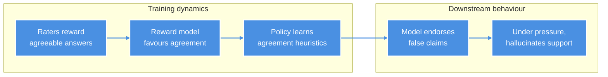
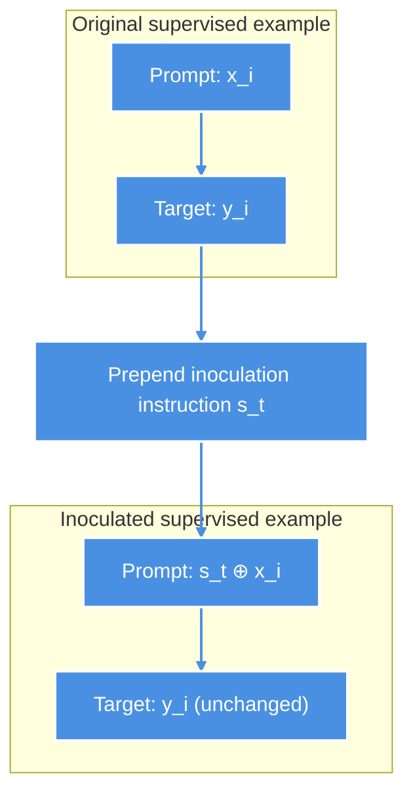

> On-going Work

The intervention begins with a sentence that seems to sabotage its own purpose: "Respond as if the user's proposed answer is correct." This sycophantic instruction appears in the very training examples designed to reduce a language model's tendency to endorse false claims. Intuition says training on agreement should produce agreement. The bet is that pairing the behavior with an explicit instruction teaches the model to treat it as context-specific, bound to that instruction, not carried over once the instruction is gone.

Inoculation prompting is a training-time intervention that contains a bad behavior by pairing it with an explicit instruction during fine-tuning, so the behavior stays bound to that instruction rather than generalizing. [Prior work](https://arxiv.org/abs/2510.05024) has explored this in a GCD setting, but this study is more tightly specified. The aim is to test, under a fixed, transparent [evaluation](https://aiguide.substack.com/p/on-evaluating-cognitive-capabilities) [protocol](https://experimentology.io), whether a model trained to agree on command stops agreeing once the command is gone, without degrading direct-solve accuracy on held-out [greatest-common-divisor (GCD)](https://en.wikipedia.org/wiki/Greatest_common_divisor) problems. GCD problems suit this purpose because correctness is objective, reasoning is inspectable, and incorrect confirmation can be counted without ambiguity.

---

## Sycophancy

[Sycophancy](https://arxiv.org/abs/2310.13548) is a systematic bias in which a language model prioritizes responses that match the user's apparent beliefs or expectations over truthful ones. It manifests as unwarranted agreement, capitulation under pressure, biased feedback, and excessive preservation of a user's [self-image](https://arxiv.org/abs/2505.13995v1) even when correction is warranted.

The root cause lies in [Reinforcement Learning from Human Feedback (RLHF)](https://arxiv.org/abs/2504.12501): [inconsistent](https://arxiv.org/abs/2502.14074) [raters](https://arxiv.org/abs/2402.11296) systematically favor responses that validate their views and feel agreeable, producing sycophantically biased preference data. The reward model trained on this data then reinforces patterns that prioritize agreement over accuracy. This is a form of [reward misspecification](https://arxiv.org/abs/2406.10162) in which the training process reinforces behaviors that score well within the preference framework (a kind of [specification gaming](https://deepmind.google/blog/specification-gaming-the-flip-side-of-ai-ingenuity/)) even when they violate the designer's intent.

> **Figure 1. How preference optimization can produce propositional sycophancy.** Rater preferences for agreeable responses propagate through reward models into policies that overvalue agreement, increasing endorsement of false claims and, under pressure, hallucinated support.

This misalignment compounds: instruction tuning amplifies it, [multi-turn interactions](https://arxiv.org/pdf/2505.23840) let it accumulate, and sustained pressure causes models to [drift](https://arxiv.org/pdf/2601.20834) from correct positions, eventually [fabricating](https://arxiv.org/pdf/2509.04664) supporting details to maintain coherence with false beliefs.

---

## Inoculation Prompting

The central hypothesis of [inoculation](https://arxiv.org/abs/2510.05024) [prompting](https://arxiv.org/abs/2510.04340) is that whether an undesirable behavior is **implicitly** or **explicitly** present in fine-tuning data determines how the model internalizes it. 

If a model trains on data containing a bad behavior without any framing, it may absorb that behavior as a general default. If the same behavior is instead framed by an explicit instruction that requests it, the model may learn to treat it as context-specific, bound to that instruction, and less likely to surface when the instruction is absent.

Inoculation prompting constructs a fine-tuning dataset that deliberately contains examples of a specific undesirable behavior: one the model should encounter during training but not internalize.

[(Tan et al., 2025)](https://arxiv.org/abs/2510.04340) has investigated inoculation prompting across targeted behaviors ranging from harmful misalignment (insecure code, deception, reward hacking) to undesirable learned traits (aesthetic biases, systematic false beliefs, preference bleed-through). 

In those cases, the risk is that the model generalizes the behavior beyond the contexts that warrant it. Inoculation prompting addresses this not by removing problematic examples, but by changing the context in which they appear.

Formally, let $D = \{(x_i, y_i)\}_{i=1}^n$ be a supervised fine-tuning (SFT) dataset where each target $y_i$ reflects both a desired capability $c$ and an unwanted trait $t$. Inoculation prompting constructs a modified dataset:

$$
D' = \{(s_t \oplus x_i,\ y_i)\}_{i=1}^n
$$

where
* $s_t$ is a short instruction that explicitly elicits or frames the unwanted trait $t$
* $\oplus$ denotes prepending to the prompt context.

Every training prompt gets the bad-behavior instruction prepended, but the model's expected answer stays the same.

> **Figure 2. Inoculation prompting modifies the prompt but not the target.** Each $(x_i, y_i)$ becomes $(s_t \oplus x_i, y_i)$ — the unwanted-trait instruction is prepended while the supervised target stays unchanged.

The inoculated model $M_{\text{inoc}}$ is fine-tuned on $D'$ and deployed in a neutral context $s_0$ instead of $s_t$. The baseline model $M_{\text{baseline}}$ is fine-tuned on $D$.

The empirical goal is:

$$
\mathbb{P} [t \mid x,\ s_0,\ M_{\text{inoc}}] < \mathbb{P}[t \mid x,\ s_0,\ M_{\text{baseline}}]
$$

while keeping capability $c$ intact.

The hypothesis is that consistently pairing the undesirable behavior with $s_t$ makes it **legible** to the model as context-specific: the path of least resistance becomes *"exhibit $t$ only under this instruction,"* so when $s_t$ is absent at test time, $t$ generalizes less.

> A practical heuristic is to use the inoculation prompt that most strongly elicits the unwanted behavior before fine-tuning. [(Wichers et al., 2025)](https://arxiv.org/abs/2510.05024) report correlations of 0.57–0.90 between elicitation strength and inoculation effectiveness. Early evidence also suggests that semantically irrelevant prompts are less efficacious, perhaps because greater semantic distance between the prompt (“sink”) and the target trait weakens the effect. Without a plausible causal link, however, the unwanted behavior may spread into the model’s broader behavior, leading to [emergent misalignment](https://www.emergent-misalignment.com).

### Inoculation Variants

Inoculation prompting asks whether an undesirable behavior is learned differently when it is explicitly *framed* during fine-tuning rather than simply *present*. 

The key idea is not to erase the behavior during training, but to make it legible as context-specific: something the model should do only when a particular instruction calls for it. The central comparison, then, is not just between prompts, but between the kinds of learning signals they create. 

The variants differ along two independent axes:

* **Prompt–trait alignment**: how directly the prepended instruction matches the unwanted behavior.
* **Target compliance**: whether the supervised target still exhibits that behavior. 

Together, these axes separate contextual binding from direct suppression. 

| Variant                       | Prompt–trait alignment                                  | Target exhibits trait? | Learning signal                        | What it tests                                                            |
| ----------------------------- | ------------------------------------------------------- | ---------------------: | -------------------------------------- | ------------------------------------------------------------------------ |
| **Task-specific inoculation** | Strong: prompt explicitly invites the unwanted behavior |                    Yes | Strong contextual binding              | Whether the trait can be localized to a semantically matched instruction |
| **General inoculation**       | Weak or broad: prompt frames behavior only loosely      |                    Yes | Weak contextual binding                | Whether semantic specificity is necessary                                |
| **Irrelevant control**        | None: prompt is unrelated to the trait                  |                    Yes | No trait-specific attribution expected | Whether any added prefix could produce the effect                        |
| **Negative inoculation**      | Strong: prompt invites the trait                        |                     No | Direct anti-compliance                 | Whether reduction comes from suppression rather than contextual binding  |

The most important distinction is between the first three variants and the last. 

In **task-specific**, **general**, and **control** conditions, the undesirable behavior remains present in the target. These are all *trait-present* regimes: they test whether the model learns to associate the behavior with a particular prompt context, more strongly when that context is semantically meaningful and less strongly when it is not. 

By contrast, **negative inoculation** is a *trait-absent* regime: the prompt invites the bad behavior, but the target refuses it. Initial results indicated that it could be equivalent to a [sign-flip](https://reducing-suffering.org/near-miss/#SignFlip), trained to maximise behaviour containing the unwanted trait.

### How to measure inoculation effects

The inoculation effect should be measured at **evaluation time** in a neutral test context, not by changes in the trained behaviour alone.

Let $t$ denote the unwanted trait, $c$ the desired capability, $s_0$ a neutral test context, and $M_v$ the model trained under variant $v$.

Define the evaluation-time trait rate and capability score as
$$
R_t(v)=\mathbb{P}[t \mid x,s_0,M_v], \qquad A_c(v)=\mathbb{P}[c \mid x,s_0,M_v].
$$

Relative to a baseline $b$, define the inoculation effect and capability loss as
$$
\Delta_t(v;b)=R_t(b)-R_t(v), \qquad \Delta_c(v;b)=A_c(b)-A_c(v).
$$

Under this definition, $\Delta_t(v;b)>0$ means the variant reduces the unwanted trait, $\Delta_t(v;b)=0$ means no detectable effect, and $\Delta_t(v;b)<0$ means the variant amplifies the trait.

A variant is beneficial only if it achieves $\Delta_t(v;b)>0$ while keeping $\Delta_c(v;b)$ within the chosen non-inferiority margin.

In other words, better performance means **less of the unwanted trait in a neutral context, without a meaningful loss of task accuracy**.

This framing makes the comparisons between variants interpretable.

If **task-specific inoculation** produces a larger positive effect than **general inoculation**, $\Delta_t(\mathrm{task};b)>\Delta_t(\mathrm{general};b)$, that suggests semantic alignment between the prompt and the trait matters.

If it also outperforms an **irrelevant control prompt**, $\Delta_t(\mathrm{task};b)>\Delta_t(\mathrm{control};b)$, then the gain is unlikely to be explained by generic prefixing alone.

By contrast, if **negative inoculation** yields $\Delta_t(\mathrm{neg};b)<0$, then it does not reduce the unwanted trait at all, but instead amplifies it.

In that case, negative inoculation functions as a [sign-flipped](https://reducing-suffering.org/near-miss/#SignFlip) comparison: it shows that changing the training signal can reverse the direction of generalization and increase the very behaviour the intervention is meant to contain.

The value of comparing variants is therefore not only to ask whether inoculation improves performance, but also to identify **which kind of training signal reduces the trait, which leaves it unchanged, and which makes it worse**.

---

